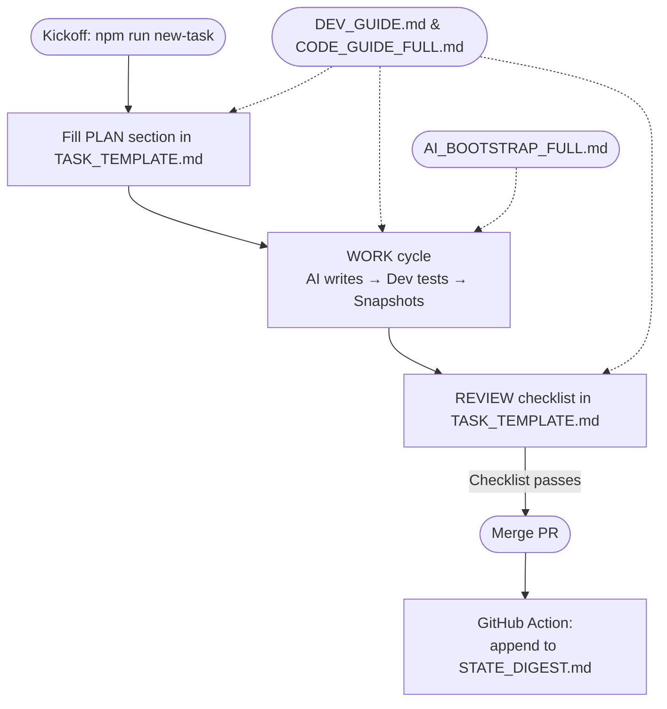
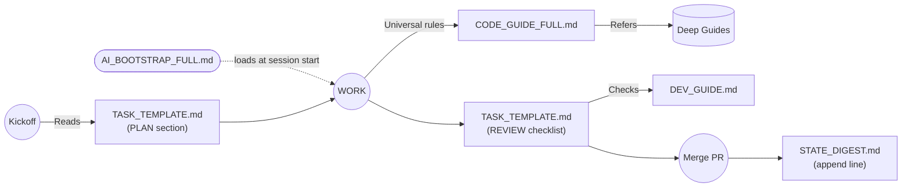

## Lean AI‑Assisted Development Framework

| ID                        | Purpose                                                                                                 | Touchpoints                                             | Owner          | Trigger / Tool             |
| ------------------------- | ------------------------------------------------------------------------------------------------------- | ------------------------------------------------------- | -------------- | -------------------------- |
| **1. `DEV_GUIDE.md`**     | Opinionated rulebook (namespacing, no globals, lint rules). ≤ 400 words for rapid scanning.             | Edited only when a new architectural rule is adopted.   | Tech lead      | Manual PR.                 |
| **2. `TASK_TEMPLATE.md`** | One‑page PLAN → WORK → REVIEW checklist for each feature/bug.                                           | Initialized at task kickoff, maintained until PR merge. | Assignee + LLM | `npm run new-task "slug"`. |
| **3. `STATE_DIGEST.md`**  | Append‑only JSONL log of decision hashes `{id, summary, choices, sha}` to rehydrate future AI sessions. | Auto‑appended on merge.                                 | GitHub Action  | Merge hook.                |
| **Automation hook**       | `scripts/snapshot.js` captures runtime/DOM/API samples in `snapshots/<task-id>/`.                       | Run mid‑WORK when live data helps reasoning.            | Developer      | `npm run snapshot`.        |

### Why This Works

* **Light cognitive load** – daily work involves only the template and quick‑reference guide.
* **Automatic context rehydration** – AI receives the latest digests at session start.
* **Automation first** – linting, snapshots, and digest logging reduce manual policing.

### Development & Documentation Flow

**Legend**

* Rounded nodes: automated hooks.
* Rectangles: manual edits.
* Dotted lines: documents referenced during that phase.

 

<h2 style="text-align:center;
           font-size:2em;
           margin:0.5em 0;
           border-bottom:none;">
  Flow ⇢ Documentation Map&nbsp;(AI Navigation)
   
  
</h2>

**Legend**
* Solid arrows: procedural progression.
* Dotted arrow: bootstrap prompt.
* Labeled arrow “Refers”: AI opens referenced doc when needed.

### Activation Flow

1. **Kickoff** → `npm run new-task <slug>`
   • Creates a branch, copies `TASK_TEMPLATE.md` into `tasks/<slug>/`, opens it.
2. Fill PLAN section and link any snapshots.
3. Work iteratively: AI writes code, developer tests, snapshots updated.
4. Pass REVIEW checklist; add digest line to `TASK_TEMPLATE.md`.
5. Merge PR → GitHub Action appends digest to `STATE_DIGEST.md`, runs lint/tests, rebuilds docs.
 
 

> *Keep docs concise; store rationale in code comments or separate appendices, and automate enforcement wherever possible.*

