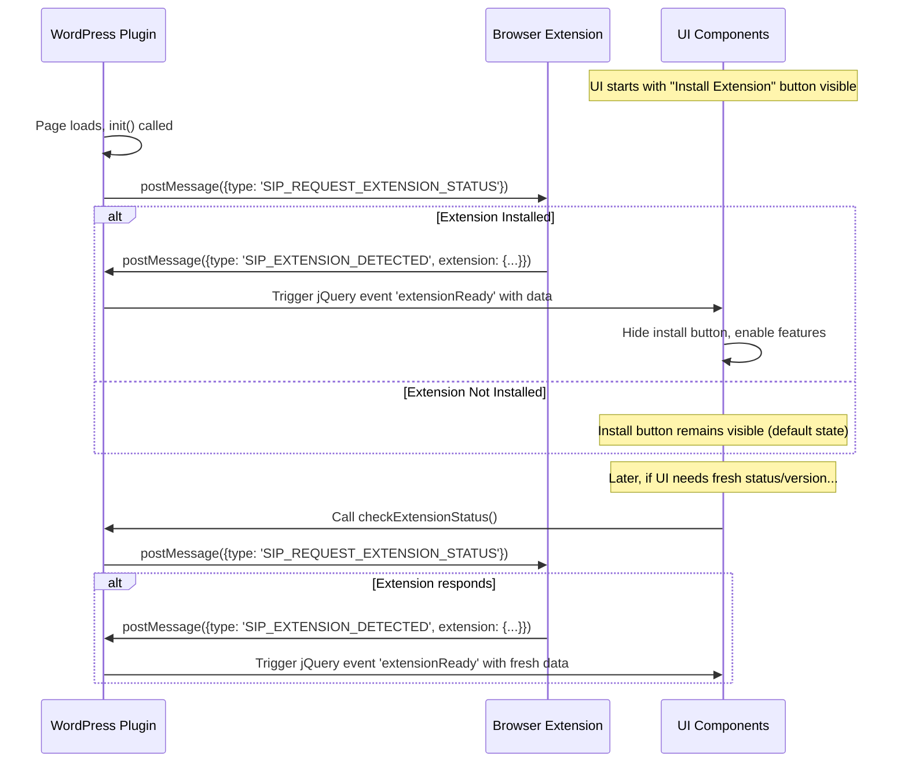

# Extension Detection Guidelines

## 1. Overview

This document defines the standardized request-based detection pattern for browser extensions in the SiP plugin ecosystem.

### Core Principles
- WordPress initiates detection via request
- Extensions respond only when asked
- Single detection method across all plugins
- All UI updates happen via events
- Fresh detection for every status check
- Purely event-driven architecture

## 2. Detection Architecture

### 2.1 Request-Response Flow



### 2.2 Component Responsibilities

| Component | Responsibility | Implementation File |
|-----------|---------------|-------------------|
| Detection Module | Send request, handle response, trigger events | browser-extension-actions.js |
| Extension | Listen for requests, send response | extension-detector.js |
| Feature Modules | Listen for extension events, request fresh status when needed | mockup-actions.js, shop-actions.js |
| UI Components | React to events only via setupExtensionUI() | Various UI modules |

## 3. Implementation Details

### 3.1 WordPress Plugin Side

#### Detection Request (browser-extension-actions.js)
```javascript
function checkExtensionStatus() {
    debug.log('🔍 Requesting extension status');
    
    window.postMessage({
        type: 'SIP_REQUEST_EXTENSION_STATUS',
        source: 'sip-printify-manager'
    }, window.location.origin);
}
```

#### Response Handler (browser-extension-actions.js)
```javascript
window.addEventListener('message', function(event) {
    if (event.origin !== window.location.origin) {
        return;
    }
    
    if (event.data && event.data.type === 'SIP_EXTENSION_DETECTED') {
        const extension = event.data.extension;
        if (extension && extension.slug === 'sip-printify-manager-extension') {
            $(document).trigger('extensionReady', extension);
            checkForExtensionUpdates(extension.version);
        }
    }
});
```

#### UI Setup Pattern (browser-extension-actions.js)
```javascript
function setupExtensionUI() {
    // Listen for extension detection
    $(document).on('extensionReady', function(e, extension) {
        if ($button && $button.length) {
            // Extension detected - hide install button
            $button.hide();
            
            // Show widget
            sendMessageToExtension({
                type: 'SIP_SHOW_WIDGET',
                source: 'sip-printify-manager'
            });
        }
    });
    
    // Install button is visible by default in HTML
}
```

#### Feature Module Integration (mockup-actions.js)
```javascript
// Store data while waiting for extension
$blueprintRows.data('blueprintIds', blueprintIds);

// Request extension status
SiP.PrintifyManager.browserExtensionManager.requestStatus();

// Handle extension ready
$(document).on('extensionReady', function(e, extension) {
    debug.log('Extension detected, enabling mockup features', extension);
    if (extension && extension.capabilities && extension.capabilities.mockupFetching) {
        // Re-add buttons with updated extension state
        addMockupButtons($blueprintRows, blueprintIds);
        
        // Check for missing mockups with stored data
        var storedBlueprintIds = $blueprintRows.data('blueprintIds');
        if (storedBlueprintIds) {
            checkForMissingMockups($blueprintRows, storedBlueprintIds, extension.capabilities);
        }
    }
});
```

#### Operational Event Handlers (browser-extension-actions.js)
```javascript
case 'STATUS_UPDATE':
    // Forward operational status to UI
    $(document).trigger('extensionStatusUpdate', data);
    break;
    
case 'DATA_CAPTURED':
    // Forward capture event to UI
    $(document).trigger('extensionDataCaptured', {
        itemCount: data.itemCount || 0
    });
    break;
    
case 'SYNC_COMPLETE':
    // Forward sync completion to UI
    $(document).trigger('extensionSyncComplete', {
        timestamp: new Date().toISOString()
    });
    break;
    
case 'SIP_EXTENSION_INSTALLED':
    // Extension was just installed (first install)
    debug.log('Extension first install detected');
    $(document).trigger('extensionInstalled', {
        firstInstall: data.firstInstall || false
    });
    break;
```

### 3.2 Browser Extension Side

#### Request Listener (extension-detector.js)
```javascript
window.addEventListener('message', function(event) {
    if (!isOurWordPressSite(event.origin)) {
        return;
    }
    
    if (event.data && event.data.type === 'SIP_REQUEST_EXTENSION_STATUS') {
        window.postMessage({
            type: 'SIP_EXTENSION_DETECTED',
            extension: {
                slug: 'sip-printify-manager-extension',
                name: 'SiP Printify Manager Extension',
                version: chrome.runtime.getManifest().version,
                capabilities: {
                    mockupFetching: true,
                    batchPublishing: true,
                    sceneSelection: true
                }
            }
        }, event.origin);
    }
});
```

### 3.3 Message Formats

#### Request Message
```javascript
{
    type: 'SIP_REQUEST_EXTENSION_STATUS',
    source: 'sip-printify-manager'
}
```

#### Response Message
```javascript
{
    type: 'SIP_EXTENSION_DETECTED',
    extension: {
        slug: 'sip-printify-manager-extension',
        name: 'SiP Printify Manager Extension',
        version: '1.7.7',
        capabilities: {
            mockupFetching: true,
            batchPublishing: true,
            sceneSelection: true
        }
    }
}
```

## 4. Events Reference

### Detection Events
| Event | Trigger | Data |
|-------|---------|------|
| extensionReady | Extension responds to status request | Full extension object |

### Operational Events
| Event | Trigger | Data |
|-------|---------|------|
| extensionStatusUpdate | STATUS_UPDATE message received | Connection status, item counts |
| extensionDataCaptured | DATA_CAPTURED message received | Item count |
| extensionSyncComplete | SYNC_COMPLETE message received | Timestamp |
| extensionInstalled | SIP_EXTENSION_INSTALLED message received | First install flag |

## 5. API Reference

### Public Methods
```javascript
// Request fresh detection (result via extensionReady event)
SiP.PrintifyManager.browserExtensionManager.requestStatus();
SiP.PrintifyManager.browserExtensionManager.checkStatus(); // Same as above

// Show installation wizard
SiP.PrintifyManager.browserExtensionManager.showInstallationWizard();

// Send message to extension
SiP.PrintifyManager.browserExtensionManager.sendMessage(message);
```

### Removed APIs
The following APIs were removed in favor of event-driven patterns:
- `isExtensionInstalled()` - Use extensionReady event instead
- `getState()` - Listen for events instead of checking state

## 6. Common Patterns

### Storing Data While Waiting for Extension
```javascript
// Store data on DOM element
$element.data('key', value);

// Request extension status
SiP.PrintifyManager.browserExtensionManager.requestStatus();

// Use stored data when extension is ready
$(document).on('extensionReady', function(e, extension) {
    var storedData = $element.data('key');
    // Process with extension capabilities
});
```

### Conditional Feature Enabling
```javascript
$(document).on('extensionReady', function(e, extension) {
    if (extension.capabilities.mockupFetching) {
        // Enable mockup features
    }
    if (extension.capabilities.batchPublishing) {
        // Enable batch publishing features
    }
});
```

### Update Checking
```javascript
// Automatic on detection
function checkForExtensionUpdates(currentVersion) {
    // Check with server
    // Show notification if update available
}
```