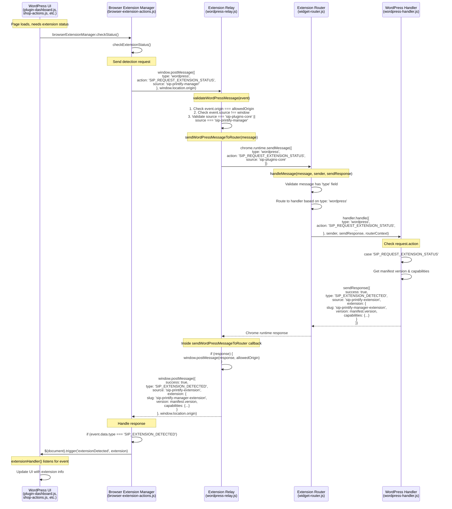
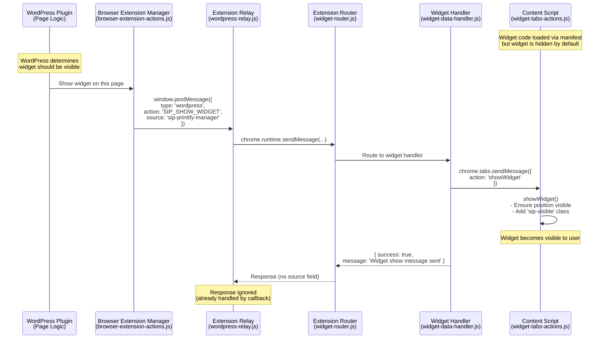

# Extension Detection Guidelines

## Overview

This document defines the standardized request-based detection pattern for browser extensions in the SiP plugin ecosystem.

### Core Principles
- WordPress initiates detection via request
- Extensions respond only when asked
- Single detection method across all plugins
- All UI updates happen via events
- Fresh detection for every status check
- Purely event-driven architecture

## What



### Widget Visibility Control

Once the extension is detected, WordPress controls when the floating widget appears:



## How

### Implementation Details

**Two-Stage Widget Display**:
- **Stage 1 (Manifest)**: Content scripts are automatically injected on all `/wp-admin/*` pages
- **Stage 2 (Command)**: WordPress sends `SIP_SHOW_WIDGET` to control visibility on specific pages
- This allows WordPress to have fine-grained control over widget visibility based on context, permissions, or page type

**Message Identification**:
- Messages are identified by their `source` field, not by structure or content
- The relay uses a simple string comparison: `data.source === 'sip-printify-extension'`
- No complex parsing or validation needed to distinguish requests from responses

**Callback vs Event Listener**:
- Responses arrive through TWO paths: the sendMessage callback AND the postMessage event listener
- The callback handles the actual response processing
- The event listener ignores responses based on their source field

**Edge Cases Handled**:
- Messages without a source field are rejected
- Cross-origin messages are blocked by origin validation
- The extension's own responses don't create infinite loops

### Configuration

**WordPress-side setup** (in any plugin):
```javascript
// Initialize the browser extension manager (required for message listener)
if (SiP.PrintifyManager && SiP.PrintifyManager.browserExtensionManager) {
    SiP.PrintifyManager.browserExtensionManager.init();
}

// Then check for extensions
SiP.PrintifyManager.browserExtensionManager.checkStatus()
```

**Extension manifest.json requirements**:
- Content script must be injected into WordPress admin pages
- `wordpress-relay.js` must be loaded before other widget scripts

## Why

### Architectural Decisions

**Source field on all messages**: 
- Enables future multi-extension support (each extension has unique source)
- Prevents response messages from re-entering validation flow
- Creates self-documenting messages (origin is always clear)

**Two-layer validation**:
- Relay performs security validation (origin, source)
- Router performs structural validation (type, action)
- Separation prevents security checks from being bypassed

**Event-driven, stateless detection**:
- No stale data - extension status is always current
- No memory leaks from storing detection state
- Works correctly even if extension updates while page is open

**Request-based pattern (no proactive announcements)**:
- Reduces message noise on the page
- Extension remains passive until queried
- Prevents timing issues where announcement arrives before listener is ready

**Callback handling for responses**:
- Direct path back to requester without re-validation
- Responses can't be spoofed by other page scripts
- Maintains clean separation between request and response flows

**Browser Extension Manager initialization**:
- Must be initialized before use to register message listeners
- Without init(), extension responses arrive but aren't processed
- Each WordPress page using detection must call init() once
- Extension detection setup MUST happen first in init(), before any UI-related logic
- Button existence should never gate whether detection runs (detection determines UI state, not vice versa)

**Cross-plugin initialization considerations**:
- The Printify Manager's main.js initializes modules including browserExtensionManager
- Other plugins (like Core) may need extension status before main.js completes initialization
- The browserExtensionManager tracks initialization to prevent duplicate setup
- If a module is marked as initialized but message handlers weren't set up (e.g., due to cached code), detection will fail silently