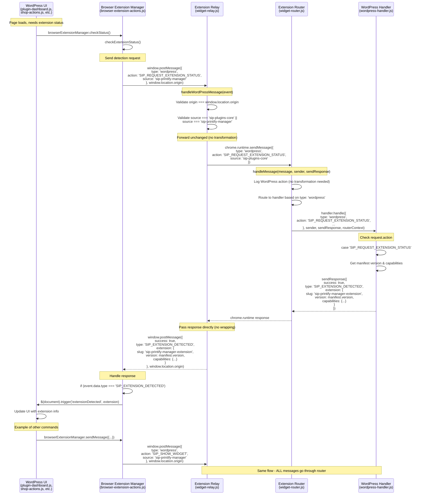

# Extension Detection Guidelines

## Overview

This document defines the standardized request-based detection pattern for browser extensions in the SiP plugin ecosystem.

### Core Principles
- WordPress initiates detection via request
- Extensions respond only when asked
- Single detection method across all plugins
- All UI updates happen via events
- Fresh detection for every status check
- Purely event-driven architecture

## What

## How

- WordPress sends messages in internal format: `{ type: 'wordpress', action: 'SIP_REQUEST_EXTENSION_STATUS', source: 'sip-printify-manager' }`
- Extension router checks `type` field to route to wordpress-handler.js
- Handler checks `request.action` to determine specific command
- Response is sent directly without wrapping
- Relay passes messages through unchanged in both directions

## Why

- **ALL messages through router**: Security model requires single validation point
- **Consistent message format**: No transformation needed throughout the flow
- **Event-driven detection**: No state storage prevents stale data
- **Request-based pattern**: Extension only responds when asked, reducing noise