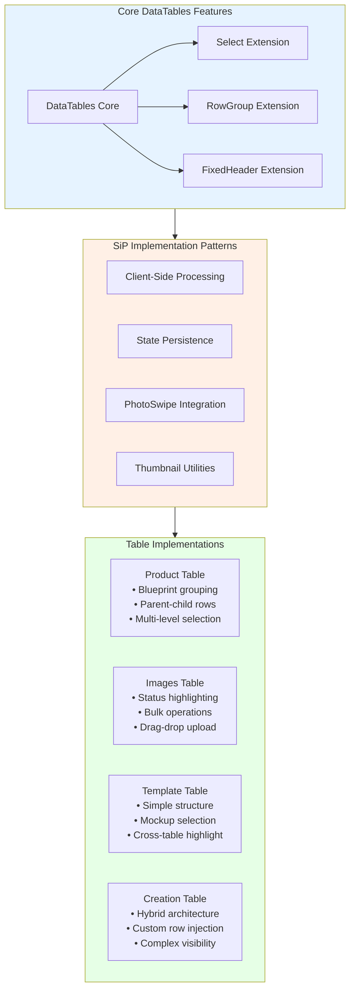
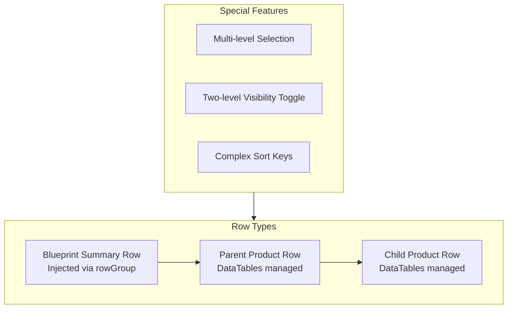
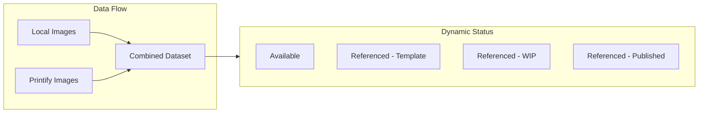
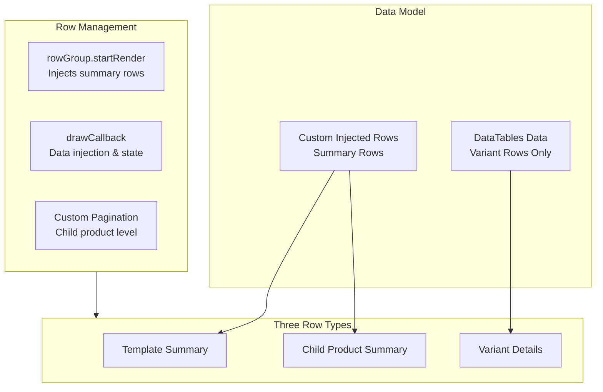

# DataTables Integration - Comprehensive Guide

This guide provides a complete reference for DataTables implementation in SiP plugins, covering all standard patterns and the four major table implementations in SiP Printify Manager.

## DataTables Architecture Overview



## Why Client-Side Processing

All SiP DataTables implementations use **client-side processing only** for these reasons:

1. **Data Volume**: Product counts rarely exceed 10,000 items, well within client-side limits
2. **Performance**: Instant sorting/filtering without server round-trips  
3. **Offline Capability**: Tables remain functional during connection issues
4. **Simplicity**: No server-side pagination/sorting logic needed
5. **State Management**: Easy to maintain selection state across operations

## Common Implementation Patterns

### Base Configuration

All tables share these foundational settings:

```javascript
const baseConfig = {
    serverSide: false,          // Always client-side
    processing: false,          // No processing overlay
    autoWidth: false,           // Manual column widths
    fixedHeader: true,          // Sticky header
    stateSave: true,            // Persist user preferences
    stateDuration: -1,          // Indefinite persistence
    scrollY: "100%",            // Full-height scrolling
    scrollCollapse: true,       // Collapse when less data
    scrollResize: true,         // Respond to container resize
    paging: false,              // No pagination
    responsive: false,          // Manual responsive handling
    keys: true                  // Keyboard navigation
};
```

### Multi-Select Configuration

Tables with row selection use DataTables select extension:

```javascript
select: {
    style: "multi",
    selector: "td.select-column",
    headerCheckbox: true,
    info: true
}
```

**Exception**: Creation table implements custom selection (see Creation Table section).

### State Persistence Pattern

All tables implement state persistence using the SiP.Core.state API:

```javascript
stateSave: true,
stateDuration: -1,

stateLoadCallback: function(settings) {
    // Use state system via plugin utilities adapter
    return SiP.PrintifyManager.utilities.datatablesState.load('table-name');
},

stateSaveCallback: function(settings, data) {
    // Save via state system
    SiP.PrintifyManager.utilities.datatablesState.save('table-name', data);
}
```

**Important**: All tables use the centralized SiP.Core.state system which automatically uses localStorage. Never use sessionStorage for DataTables state persistence.

**Script Dependencies**: When using the datatablesState adapter from SiP PrintifyManager utilities, ensure your table script declares 'sip-utilities' as a dependency in wp_enqueue_script() to prevent loading order issues.

### Thumbnail Integration

Standardized thumbnail creation across all tables:

```javascript
const thumbnail = SiP.PrintifyManager.utilities.createThumbnail(
    {
        src: row.src,
        name: data,
        width: row.width || 0,
        height: row.height || 0
    }, 
    {
        thumbnailSize: 24,      // Standard size
        containerClass: 'title-class',
        usePhotoSwipe: true
    }
);
```

### PhotoSwipe Integration

All tables update PhotoSwipe after DOM changes:

```javascript
drawCallback: function(settings) {
    // Other draw operations...
    
    // Always update PhotoSwipe dimensions last
    SiP.PrintifyManager.utilities.ui.updatePhotoSwipeDimensions();
}
```

## Table-Specific Implementations

### 1. Product Table

**Purpose**: Display and manage Printify products with blueprint grouping and parent-child relationships.

#### Unique Architecture



#### Key Features

1. **Row Grouping by Blueprint**
   ```javascript
   rowGroup: {
       dataSrc: "bp_id",
       startRender: function(rows, group) {
           // Inject blueprint summary row with custom controls
       }
   }
   ```

2. **Parent-Child Relationship Management**
   - Pre-processing assigns Parent/Child/Single types
   - Custom sorting maintains relationships
   - Post-draw DOM manipulation preserves hierarchy

3. **Multi-Level Visibility**
   - Blueprint toggle: Shows/hides all products in blueprint
   - Parent toggle: Shows/hides child products only
   - State persists across redraws

4. **Complex Selection Logic**
   - Blueprint checkbox selects all products in group
   - Parent selection independent of children
   - Custom event handlers maintain consistency

### 2. Images Table

**Purpose**: Manage local and Printify-hosted images with status tracking based on template associations.

#### Unique Architecture



#### Key Features

1. **Dynamic Status Updates**
   ```javascript
   function updateImageTableStatus(templateData) {
       // Collects all referenced image IDs
       // Updates row highlighting
       // Rebuilds filter dropdown
   }
   ```

2. **Row Highlighting System**
   - Template images: `#e7c8ac`
   - WIP images: `#dcf3ff`
   - Unpublished: `#bfdfc5`
   - Published: `#7bfd83`

3. **Drag-Drop Upload Integration**
   - File validation (type, size, duplicates)
   - Progress dialog with batch processing
   - Automatic table refresh

4. **Bulk Operations**
   - Add to new product
   - Upload to Printify
   - Delete local images

### 3. Template Table

**Purpose**: Simple template management with mockup selection and cross-table integration.

#### Unique Architecture

```mermaid
graph TD
    subgraph Structure["Simple Structure"]
        TwoCol[Two Column Layout<br/>Checkbox | Title+Thumbnail]
    end
    
    subgraph Integration["Cross-Table Integration"]
        LoadTemplate[Load into Creation Table]
        Highlight[Highlight Related Data]
        Preview[Template Preview Row]
    end
    
    Structure --> Integration
```

#### Key Features

1. **Mockup Selection Modal**
   - Triggered by thumbnail click
   - Allows multiple mockup selection
   - Saves to template metadata

2. **Cross-Table Highlighting**
   ```javascript
   // Highlights cascade across tables:
   highlightTemplateByTitle(title);      // Template table
   highlightBlueprintRow(blueprintId);   // Product table  
   updateImageTableStatus(templateData); // Images table
   ```

3. **Template Preview Row**
   - Displays above main tables
   - Shows child product statistics
   - Visual status meter

### 4. Creation Table (Most Complex)

**Purpose**: Edit templates and create products with a hybrid architecture combining DataTables with custom row management.

#### Hybrid Architecture



#### Critical Architecture Decisions

From the code documentation:
```javascript
/**
 * CREATION TABLE ARCHITECTURE:
 * 
 * This table uses a hybrid approach where:
 * - DataTables manages variant rows (secondary data)
 * - Custom code manages child product summary rows (primary data)
 * - Summary rows are intentionally outside DataTables' data model
 * 
 * Why this architecture:
 * - Child products are the primary unit (what gets uploaded)
 * - Variants are secondary details under each child product
 * - DataTables counts/filters variants, but we care about child products
 * - Summary rows need special behaviors DataTables can't provide
 */
```

#### Key Implementation Details

1. **Column Index Mapping**
   ```javascript
   const columnIndexMap = {
       'col-visibility': 0,    // Expand/collapse
       'col-select': 1,        // Checkboxes
       'col-rownum': 2,        // Row numbers
       'col-title': 3,         // Titles
       // ... etc
   };
   ```

2. **Custom Selection System**
   ```javascript
   select: false,  // DataTables selection disabled
   
   // Custom checkbox rendering
   columnDefs: [{
       render: function(data, type, row) {
           if (row.is_template) return '';
           if (row.child_product_id) {
               return '<input type="checkbox" class="variant-row-select">';
           }
       }
   }]
   ```

3. **State Tracking**
   ```javascript
   // Multiple state systems:
   let expandedGroups = new Set();        // Visibility state
   let visibleVariantRows = new Set();    // Row visibility
   let currentStatusFilter = '';          // Active filter
   let filteredChildProducts = [];        // Filtered results
   ```

4. **Custom Pagination**
   - Works at child product level, not row level
   - Custom controls outside DataTables
   - Maintains selection across pages

5. **Data Injection Pattern**
   ```javascript
   drawCallback: function(settings) {
       const utils = SiP.PrintifyManager.creationTableSetupActions.utils;
       
       // Inject aggregated data into summary rows
       utils.buildTemplateSummaryCells();
       utils.buildTemplateVariantCells();
       utils.buildChildProductSummaryCells();
       utils.buildChildProductVariantCells();
       
       // Maintain UI state
       attachGroupToggleListeners();
       updateChildProductRowNumbers();
   }
   ```

## Advanced Patterns

### Column Filtering

Dynamic filter dropdowns in column headers:

```javascript
initComplete: function() {
    const column = this.api().column("status:name");
    const select = $('<select class="sip-filter">')
        .append('<option value="">All</option>')
        .appendTo($(column.header()))
        .on("change", function() {
            const val = $.fn.dataTable.util.escapeRegex($(this).val());
            column.search(val ? "^" + val + "$" : "", true, false).draw();
        });
    
    // Populate options
    column.data().unique().sort().each(function(d) {
        if (d) select.append(`<option value="${d}">${d}</option>`);
    });
}
```

### Custom Sorting Logic

Handle complex sorting requirements:

```javascript
// Product table: Sort by blueprint, then parent/child relationship
columns: [{
    data: 'title',
    render: function(data, type, row) {
        if (type === 'sort') {
            let sortValue = row.bp_id || 'zzz';
            if (row.type === 'Child' && row.parent_product_id) {
                sortValue += '_' + row.parent_product_id + '_b_' + data.toLowerCase();
            } else if (row.type === 'Parent') {
                sortValue += '_' + row.product_id + '_a_' + data.toLowerCase();
            }
            return sortValue;
        }
        return data;
    }
}]
```

### DOM Manipulation in drawCallback

Maintain complex relationships:

```javascript
drawCallback: function(settings) {
    const api = this.api();
    
    // 1. Process parent-child relationships
    api.rows().every(function() {
        const data = this.data();
        if (data.type === 'Child') {
            // Move child row after its parent
        }
    });
    
    // 2. Update custom UI elements
    updateCustomCheckboxes();
    attachVisibilityHandlers();
    
    // 3. Always update PhotoSwipe last
    updatePhotoSwipeDimensions();
}
```

### Table Destruction and Cleanup

**Critical**: Always clean up moved UI elements before destroying:

```javascript
// WRONG - leaves orphaned elements
if ($.fn.DataTable.isDataTable('#table-id')) {
    $('#table-id').DataTable().destroy();
}

// CORRECT - removes moved elements first
if ($.fn.DataTable.isDataTable('#table-id')) {
    // Remove elements moved during initComplete
    $('.moved-search-container .dt-search').remove();
    $('.column-header .sip-filter').remove();
    
    // Now safe to destroy
    $('#table-id').DataTable().destroy();
}
```

## Implementation Checklist

### Standard Implementation
- [ ] Use client-side processing
- [ ] Implement state persistence with SiP.Core.state API (never sessionStorage)
- [ ] Configure multi-select if needed
- [ ] Add PhotoSwipe update in drawCallback
- [ ] Use standardized thumbnail utility
- [ ] Handle table destruction properly
- [ ] Add 'sip-utilities' dependency to table scripts that use datatablesState adapter

### Advanced Features
- [ ] Implement rowGroup for hierarchical data
- [ ] Add column filters in initComplete
- [ ] Create custom sorting logic if needed
- [ ] Manage visibility states externally
- [ ] Implement custom selection if required
- [ ] Handle cross-table integration

### Creation Table Specific
- [ ] Disable DataTables controls
- [ ] Implement custom pagination
- [ ] Create row injection system
- [ ] Manage multiple state systems
- [ ] Build data injection utilities
- [ ] Handle filter-aware selection

## Common Pitfalls and Solutions

1. **Orphaned UI Elements**
   - Always remove moved elements before destroy
   - Track where elements are moved in initComplete

2. **State Persistence Conflicts**
   - Use unique table identifiers with SiP.Core.state
   - Clear state when table structure changes
   - **Never use sessionStorage** - always use SiP.Core.state API which automatically uses localStorage

3. **Selection State Loss**
   - Track selection externally for complex tables
   - Restore after redraws and filters

4. **Performance Issues**
   - Use deferRender for large datasets
   - Batch DOM operations in drawCallback
   - Debounce rapid state updates

5. **Cross-Table Synchronization**
   - Use event system for loose coupling
   - Update related tables in single batch

## Related Documentation

- [AJAX Integration](./sip-plugin-ajax.md#datatables-integration)
- [PhotoSwipe Guide](./sip-core-feature-photoswipe.md)
- [UI Components](./sip-core-feature-ui-components.md)
- [SiP Printify Manager Architecture](./sip-printify-manager-guidelines.md)