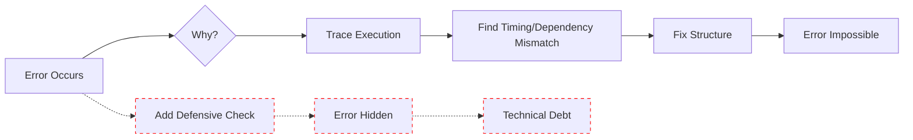

# SiP Code Guidelines

## Foundational Principles

These principles drive both code creation AND documentation creation:

### 1. FIX ROOT CAUSES, NOT SYMPTOMS
**Code**: Structure systems so errors are impossible, not defended against  
**Documentation**: Document fundamental constraints, not workarounds or defensive patterns

### 2. SINGLE SOURCE OF TRUTH  
**Code**: Each data point has one authoritative source  
**Documentation**: Each fact appears in exactly one location

### 3. ZERO ASSUMPTIONS
**Code**: Verify all data structures, timing, and dependencies  
**Documentation**: Verify all elements against actual implementation with file references

### 4. STRUCTURAL CORRECTNESS
**Code**: Build systems that work by design, not by defensive programming. Define functions in dependency order - basic utilities first, then functions that use them.
**Documentation**: Show correct implementation, don't guess at problems or edge cases

### 5. COMPLETE REPRESENTATION
**Code**: Handle all execution paths explicitly  
**Documentation**: Show all significant elements in the flow or structure

### 6. CURRENT STATE ONLY
**Code**: No backward compatibility that preserves broken patterns  
**Documentation**: No history, future plans, or deprecated information

### 7. POSITIVE SPECIFICATION
**Code**: Define what the system does, not what it doesn't do
**Documentation**: Specify what IS, not what ISN'T (no defensive clarifications)

### Work Compliance Checklist
□ Used file reading/editing tools directly (no Task agent delegation)
□ Verified search strings against actual code (not saved context)
□ Used Edit/MultiEdit for code updates (never Write for existing files)
□ Stayed within specified scope of specific current task
□ All implementations follow patterns Documented in the SIP guidelines documents OR have explicit approval
□ No defensive code added to prevent errors (fixed root causes instead)
□ No redundant storage mechanisms (single source of truth)
□ No setTimeout for waiting (only for intentional delays)
□ No try-catch for errors that shouldn't exist
□ No function_exists/class_exists/isset defensive checks
□ Made zero assumptions (verified all data structures and field names)
□ Code would pass senior developer review for simplicity and clarity
□ No backward compatibility code or legacy remnants preserved
□ All anti-patterns from CODE REVIEW CHECKLIST avoided

## CORE PRINCIPLES

### 1. FIX ROOT CAUSES, NOT SYMPTOMS



❌ WRONG - Symptom Treatment:
```php
if (function_exists('sip_plugin_storage')) {
    sip_plugin_storage()->register_plugin(...);
}
```

✅ CORRECT - Root Cause Fix:
```php
add_action('init', function() {
    sip_plugin_storage()->register_plugin(...);
}, 5);
```

**Warning Signs You're Treating Symptoms:**
- Adding reactive defensive checks
- Creating workarounds for recurring "edge cases"
- Multiple error handling layers for same issue
- Protecting against "what if" scenarios

### 2. SINGLE SOURCE OF TRUTH

❌ WRONG - Multiple Storage:
```javascript
// Store in multiple places "just in case"
localStorage.setItem('shop_name', shopName);
update_option('shop_name', $shop_name);
```

✅ CORRECT - Single Authority:
```php
update_option('shop_name', $shop_name);  // One source
```

### 3. LEGITIMATE setTimeout USAGE

Ask yourself: "Am I using setTimeout because I WANT a delay, or because I'm HOPING something will be ready?"

✅ CORRECT - Intentional Delay:
```javascript
// Browser extension announcement (industry standard)
setTimeout(() => {
    window.postMessage({ type: 'EXTENSION_READY' }, '*');
}, 100);

// Debouncing user input
let timeoutId;
searchInput.addEventListener('input', (e) => {
    clearTimeout(timeoutId);
    timeoutId = setTimeout(() => {
        performSearch(e.target.value);
    }, 300);
});
```

❌ WRONG - Hoping Something Happens:
```javascript
// Waiting for elements
setTimeout(() => {
    const button = document.getElementById('submit-button');
    button.addEventListener('click', handler);
}, 1000);

// Use proper lifecycle instead:
document.addEventListener('DOMContentLoaded', () => {
    const button = document.getElementById('submit-button');
    button.addEventListener('click', handler);
});
```

### 4. EFFICIENT STRING BUILDING

❌ WRONG - Concatenation in Loops:
```javascript
let html = '';
items.forEach(item => {
    html += '<div>' + item.name + '</div>';
});
```

```powershell
# PowerShell - Building incrementally
$content = ""
foreach ($item in $items) {
    $content += "Item: $($item.Name)`n"
    $content += "Value: $($item.Value)`n`n"
}
```

✅ CORRECT - Array Join:
```javascript
const sections = items.map(item => `<div>${item.name}</div>`);
const html = sections.join('');
```

```powershell
# PowerShell - Collect then join
$sections = @()
foreach ($item in $items) {
    $section = @"
Item: $($item.Name)
Value: $($item.Value)
"@
    $sections += $section
}
$content = $sections -join "`n"
```

## CODE REVIEW ANTI-PATTERNS

If your solution includes ANY of these, STOP and reconsider:

**❌ Timing & Defensive Patterns**
□ setTimeout/setInterval for waiting (vs. intentional delays)
□ try-catch blocks for errors that shouldn't exist
□ Defensive checks (function_exists, class_exists, isset, hasOwnProperty)
□ Event handler workarounds
□ State management to track framework behavior

**❌ UI & Storage Patterns**
□ Inline CSS styles (when not for dynamic values)
□ Multiple redundant storage/recovery mechanisms
□ Multiple truth sources for same data

**❌ Implementation Standards**
□ Parameter naming variations (e.g., action_name vs action_type)
□ Hook timing differences from documented patterns
□ Response format deviations from standard structures
□ JavaScript utility usage that bypasses documented methods
□ Functions calling other functions defined later in the same file (breaks dependency order)

**📋 Pattern-Specific Checkpoints**
□ AJAX: Parameter naming matches between PHP/JS
□ DataTables: Proper cleanup before destroy()
□ UI Components: Using SiP.Core utilities

## CODE TRACING METHODOLOGY

When tracing code execution paths:

```
TASK: Trace execution path
CONSTRAINTS: {
    assumptions_allowed: 0,
    file_scope: [specified directories],
    output_file: [audit file path]
}

AUDIT_FORMAT: {
    max_words_per_step: 10,
    template: "N. [action_verb] [what] (file.ext:line)",
    examples: [
        "47. Calls handleSubmit() (template-actions.js:236)",
        "48. Gets formData value (ajax.js:73)",
        "49. Validates nonce exists (handler.php:89)"
    ]
}

FOR each execution step DO {
    IF can_read_exact_code THEN {
        READ file at specific line;
        RECORD exact code action;
        CONTINUE to next explicit instruction;
    }
    ELSE IF cannot_find_next_step THEN {
        STOP;
        REPORT: "Need to open [specific_file] to continue";
    }
    ELSE IF would_require_assumption THEN {
        STOP;
        ASK: "Please clarify: [specific question]";
    }
}
```