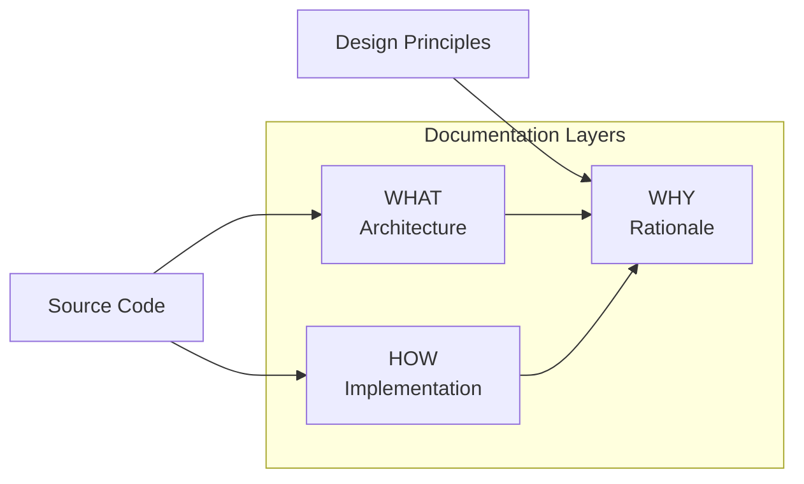

# SiP DOCUMENTATION GUIDELINES  {#top}

---

### TABLE OF CONTENTS

- [1. Overview](#overview)
- [2. Three‑Layer Framework](#three-layer-framework)
- [3. WHAT Layer Guidelines](#what-layer-guidelines)
- [4. HOW Layer Guidelines](#how-layer-guidelines)
- [5. WHY Layer Guidelines](#why-layer-guidelines)
- [6. Author Checklist](#author-checklist)

---

### 1. OVERVIEW {#overview}

#### I. WHAT
SiP documentation describes all SiP code clearly and concisely following the guidelines in the this document.

#### II. HOW
SiP documentation contains the following elements
>- **Title**
>- **Table of Contents** that links to each section
>- **Overview** that explains the WHAT and the WHY of the documentation - add HOW section only if it adds value without repeating the WHAT section; in most cases the documentation itself serves as the HOW for the overview.
>- **Main Architecture WHW Block** that shows the full framework of the code being documented
>- **What|How|Why Blocks** arranged according to the documentation guidelines that fully describe the code (henceforth WHW blocks)
>- **Review Checklist** that includes the requirement that the code adhere to the SiP code guidelines and other relevant essential considerations to ensure code conforms to functional requirements

Implemented properly, no additional documentation sections or formats are necessary to present or clarify the code.

#### III. WHY
The documentation guidelines are used primarily to provide context for an ai agent working on the documentation so that their work follows the principles that underlie both SiP code and documentation.
>- **Structural correctness** – documentation should follow the standards and patterns described in this document.
>- **Single source of truth** – each fact appears once; WHAT ↔︎ HOW ↔︎ WHY link but don’t repeat.
>- **Zero assumptions** – documentation can be easily related to and verified against the actual code.
>- **Complete representation** – collectively, the hierarchy of WHW blocks represent all implemented functionality.
>- **Current state only** – no history or future plans unless required for WHY.
>- **Logical clarity** – documentation flows from the main architecture diagram; every feature hangs logically from it.

In order to...

1. **Protect the main architecture diagram**

   - Main architecture diagram shows the full framework of the code being documented. Every feature diagram must trace back to at least one node on the overview.
   - If necessary, move node‑level detail to HOW layers or, when HOW layers become bloated, promote it to a bridging block between the main architecture and a new sub‑block where detail can be presented clearly.

2. **Avoid repetition**

   - The HOW layer must not repeat the WHAT layer (link through shared node).
   - The WHY layer must not repeat the HOW or WHAT layers (link instead).
   - WHW blocks must not repeat other WHW blocks

3. **Preserve documentation standards as documentation grows**

   - If code is a single logical function, keep it a single WHW block.
   - If code contains multiple features, map the full architectural framework in the main architecture block and, if necessary, add WHW blocks per feature.
   - When a WHW block becomes unreadable, break out a logical section into a WHW Section.

4. **Group like features**

   - Before adding a new WHW section, review existing sections; if ≥ 70 % of the diagram would duplicate an existing one, integrate instead.
   - Avoid parallel sections whose diagrams overlap substantially.

[Back to Top](#top)

---

### 2. THE THREE LAYER FRAMEWORK – WHAT, HOW AND WHY {#three-layer-framework}

Each WHW block in the body of any sip guidelines file follows the **WHAT | HOW | WHY** model.

#### Diagram requirements

#### LAYER OVERVIEW {#layer-overview-table}

| Layer         | Purpose                         | Typical Content                                  | Mandatory?      | Goal
| --- | --- | --- | --- | --- |
| **I.WHAT**   | System architecture & data flow | High‑level Mermaid diagram (or equivalent)       | **Recommended** | convey architecture at a glance
| **II.HOW**   | Implementation detail           | Code samples, mapping tables, detailed sequences | **Yes**         | supplement the WHAT to provide every detail needed to code, debug, or extend
| **III.WHY**  | Design rationale & constraints  | ≤ 2 short paragraphs                             | **Yes**         | make decisions obvious to inform coding, debugging and extending

[Back to Top](#top)

---

### 3. WHAT LAYER GUIDELINES {#what-layer-guidelines}

*Goal: convey architecture at a glance.*

The WHAT layer uses diagrams to show system architecture and logical structure, favoring legibility over exhaustive detail.

#### Main Architecture Block
If the whole system can be conveyed in a single legible diagram, it should be.  If not, complex sections representing logical groups of code should be collapsed to a representative node and that node's name becomes the title of a Section Block.
#### Section Blocks
In What Layers in section blocks showing details of the overall architecture that have been broken out for legibility, the WHW block diagram needs to show the nodes necessary to contextualize the elements being documented in the section relative to the main architecture diagram even if some are repeated.

The section title needs to correspond to the name of the node in the main architecture diagram that it is expanding.

There must be at least one node in the section diagram that maps back to a node in the main architecture diagram.

#### Include vs. exclude

- **Include** – components, relationships, logical groupings; every other diagram in the document must include a node that maps back to the overview diagram.
- **Recommended** – file/function names for verification and inter-diagram mapping.
- **Exclude** – implementation steps, magic numbers, exhaustive flows.

> **Rule of thumb** When a diagram no longer fits on one screen at 100 % zoom, move detail to the HOW layer.

[Back to Top](#top)

---

### 4. HOW LAYER GUIDELINES {#how-layer-guidelines}

*Goal: supplement the WHAT to provide every detail needed to code, debug, or extend.*

Although the HOW layer's primary purpose is to fill in the detail that would otherwise clutter the WHAT layer, it too must remain accessible and legible.

Each entry in the HOW layer should be derived from, map back to and be structured to correspond to the data in the diagram. For example, the first how entry in block 3 would be 3A. [Title of Referencing Node]. Correspondingly, the referencing node in the What layer diagram would show the element's title and beneath that say "see HOW 3A".  

#### Include vs. exclude

- **Include** – Diagrams showing granular code structures, Mapping tables, code constants, sequence or state diagrams.
- **Exclude** – Lengthy code blocks (use `
`/`summary` collapsible blocks when necessary).

  Visual Structure for HOW Subsections

#### HOW Section Format
All HOW subsections (e.g., 3A, 4B) must use blockquote formatting
  to create visual separation and improve readability.  In cases where How sections contain large amounts of data in a table or codeblock, that element should have a descriptive summary and then be collapsed using details tags.

##### 3A Component Name

> Description of the component and its purpose.
>
> 

> 
Descriptive Title for collapsed Example Table

> | Column 1 | Column 2 | Column 3 |
> |----------|----------|----------|
> | Data     | Data     | Data     |
>
> 

>
> Additional details, code examples, and all other content within this subsection should be contained within the blockquote.
>
> This formatting:
> - Creates a clear visual boundary for each subsection
> - Reduces the "wall of text" effect in long HOW sections
> - Makes it easier to scan and locate specific implementation details      
> - Maintains consistency across all technical documentation
> 
> The blockquote should encompass all content within the subsection,        
> including tables, code blocks, lists, and detailed explanations,
> ending only when the next heading is reached.

[Back to Top](#top)

---

### 5. WHY LAYER GUIDELINES {#why-layer-guidelines}

*Goal: make decisions obvious to any stakeholder.*

The WHY layer should clarify why the code is structured the way that it is so that when it's debugged or extended, considerations that enable and optimize the code are preserved.

WHY subsections should refer explicitly to the WHAT node or HOW section that they are referring to.

Limit each WHY subsection to ≈ 150 words. If a WHY topic exceeds this limit, split it into multiple WHY subsections. Avoid code; link back to WHAT/HOW for technical detail.

[Back to Top](#top)

---

### 6. AUTHOR CHECKLIST {#author-checklist}

- [ ] All code in specified files is documented in WHW blocks.
- [ ] Intro sentence explains each block scope.
- [ ] each WHAT layer present with clear architecture (diagram or bullets).  
- [ ] HOW layers collectively contains all implementation detail and do not repeat information.  
- [ ] WHY layer does not repeat HOW layer.
- [ ] WHW Blocks in the hierarchy hang together through node references
- [ ] Links, file paths, and diagram references verified.

[Back to Top](#top)