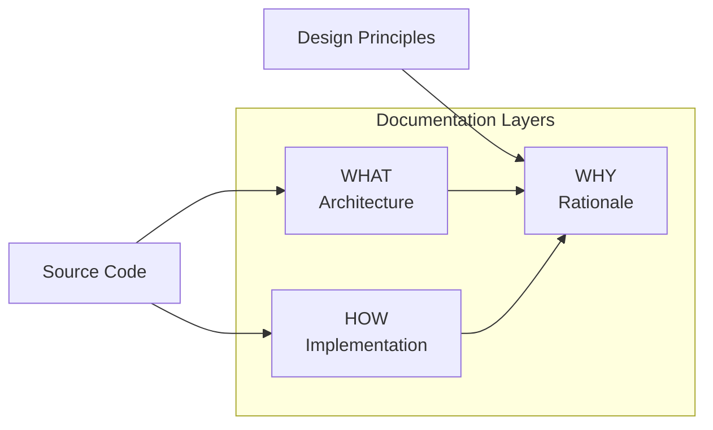

# SiP DOCUMENTATION GUIDELINES  {#top}

---

### TABLE OF CONTENTS

- [1. Three‑Layer Framework](#three-layer-framework)
- [2. WHAT Layer Guidelines](#what-layer-guidelines)
- [3. HOW Layer Guidelines](#how-layer-guidelines)
- [4. WHY Layer Guidelines](#why-layer-guidelines)
- [5. Scaling & Implementation Guidelines](#implementation-guidelines)
- [6. Author Checklist](#author-checklist)

---

### 2. OVERVIEW

I. WHAT
SiP documentation files should clearly describe all SiP code files clearly and concisely following the guidelines in the this document.

Documentation should contain the following elements
- **Title**
- **Table of Contents** that links to each section
- **Overview** that explains the WHAT and the WHY of the documentation - add HOW section only if it adds value without repeating the WHAT section; in most cases the documentation itself serves as the HOW for the overview.
- **Main Architecture WHW Block** that shows the full framework of the code being documented
- **What|How|Why Blocks** arranged according to the documentaiton guidelines that fully describe the code (henceforth WHW blocks)
- **Review Checklist** that includes the requirement that the code adhere to the SiP code guidelines and other relevant essential considerations to ensure code conforms to functional requirements

Documentation features that do not follow the format above like Testing protocols, FAQs or any other form that simply repeats content already present in the documenation should not be included.

II. WHY
The documentation guidelines are used primarily to provide context for an ai agent working on the documentation so that their work follows the SiP Documentation Principles.
- **Structural correctness** – documentation should follow the standards and patterns described in this document.
- **Single source of truth** – each fact appears once; WHAT ↔︎ HOW ↔︎ WHY link but don’t repeat.
- **Zero assumptions** – documentation can be easily related to and verified against the actual code.
- **Complete representation** – collectively, the hierarchy of WHW blocks represent all implemented functionality.
- **Current state only** – no history or future plans unless required for WHY.
- **Logical clarity** – documentation flows from the main architecture diagram; every feature hangs logically from it.

---

### 1. THE THREE LAYER FRAMEWORK – WHAT, HOW AND WHY {#three-layer-framework}

Each WHW block in the body of any sip guidelines file follows the **WHAT | HOW | WHY** model.

#### LAYER OVERVIEW {#layer-overview-table}

| Layer    | Purpose                         | Typical Content                                  | Mandatory?      | Goal
| -------- | ------------------------------- | ------------------------------------------------ | --------------- |------------------------------------------------------------------------------ |
| **WHAT** | System architecture & data flow | High‑level Mermaid diagram (or equivalent)       | **Recommended** | convey architecture at a glance
| **HOW**  | Implementation detail           | Code samples, mapping tables, detailed sequences | **Yes**         | supplement the WHAT to provide every detail needed to code, debug, or extend
| **WHY**  | Design rationale & constraints  | ≤ 2 short paragraphs                             | **Yes**         | make decisions obvious to inform coding, debugging and extending

[Back to Top](#top)

---

### 2. WHAT LAYER GUIDELINES {#what-layer-guidelines}

*Goal: convey architecture at a glance.*

The WHAT layer uses diagrams to show system architecture and logical structure, favoring legibility over exhaustive detail.
If the whole system can be conveyed in a single legible diagram, it should be.
For diagrams in blocks showing details of parts of the overall architecture, the WHW block diagram needs to show the nodes necessary to fully contextualize the elements being documented in the section even if they are repeated

#### Diagram requirements



*Diagrams speed comprehension but may be skipped for trivial elements.*

#### Include vs. exclude

- **Include** – components, relationships, logical groupings; every other diagram in the document must include a node that maps back to the overview diagram.
- **Recommended** – file/function names for verification and inter-diagram mapping.
- **Exclude** – implementation steps, magic numbers, exhaustive flows.

> **Rule of thumb** When a diagram no longer fits on one screen at 100 % zoom, move detail to the HOW layer.

[Back to Top](#top)

---

### 3. HOW LAYER GUIDELINES {#how-layer-guidelines}

*Goal: supplement the WHAT to provide every detail needed to code, debug, or extend.*

Although the HOW layer's primary purpose is to fill in the detail that would otherwise clutter the WHAT layer, it too must remain accessible and legible.

#### Include vs. exclude

- **Include** – Diagrams showing granular code structures, Mapping tables, code constants, sequence or state diagrams.
- **Exclude** – Lengthy code blocks (use `<details>`/`summary` collapsible blocks when necessary).

Example:

```markdown
| Diagram Node | Implementation   | File      |
|--------------|------------------|-----------|
| Router       | `handleMessage()`| router.js |
```

[Back to Top](#top)

---

### 4. WHY LAYER GUIDELINES {#why-layer-guidelines}

*Goal: make decisions obvious to any stakeholder.*

The WHY layer should clarify why the code is structured the way that it is so that when it's debugged or extended, considerations that enable and optimize the code are preserved.

Limit each WHY subsection to ≈ 150 words. If a WHY topic exceeds this limit, split it into multiple WHY subsections. Avoid code; link back to WHAT/HOW for technical detail.

[Back to Top](#top)

---

### 5. IMPLEMENTATION GUIDELINES {#implementation-guidelines}

*Goal – keep docs intuitive and complete as the codebase grows.*

1. **Protect the main architecture diagram**

   - Make sure the main architecture diagram shows the full framework of the code being documented. Every feature diagram must trace back to at least one node on the overview.
   - If necessary, move node‑level detail to HOW layers or, when HOW layers become bloated, promote it to a bridging block between the main architecture and a new sub‑block where detail can be presented clearly.

2. **Don't repeat yourself**

   - The HOW layer must not repeat the WHAT layer (link through shared node).
   - The WHY layer must not repeat the HOW or WHAT layers (link instead).
   - WHW blocks must not repeat other WHW blocks

3. **Evolving anatomy**

   - If code is a single logical function, keep it a single WHW block.
   - If code contains multiple features, map the full architectural framework in the main architecture block and, if necessary, add WHW blocks per feature.
   - When a WHW block becomes unreadable, promote it to a bridging block and add WHW blocks.

4. **Group like features**

   - Before adding a new WHW block, review existing sections; if ≥ 70 % of the diagram would duplicate an existing one, integrate instead.
   - Avoid parallel sections whose diagrams overlap substantially..

[Back to Top](#top)

---

### 6. AUTHOR CHECKLIST {#author-checklist}

- [ ] All code in specified files is documented in WHW blocks.
- [ ] Intro sentence explains each block scope.
- [ ] each WHAT layer present with clear architecture (diagram or bullets).  
- [ ] HOW layers collectively contains all implementation detail and do not repeat information.  
- [ ] WHY layer does not repeat HOW layer.
- [ ] WHW Blocks in the hierarchy hang together through node references
- [ ] Links, file paths, and diagram references verified.

[Back to Top](#top)