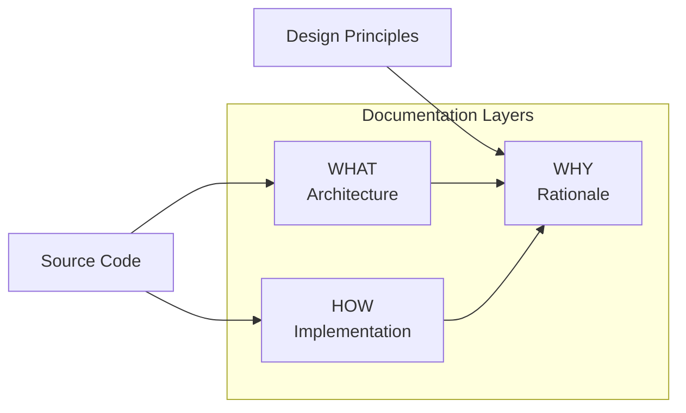

# SiP DOCUMENTATION GUIDELINES  {#top}

---

### TABLE OF CONTENTS

- [1. Three‑Layer Framework](#three-layer-framework)
- [2. WHAT Layer Guidelines](#what-layer-guidelines)
- [3. HOW Layer Guidelines](#how-layer-guidelines)
- [4. WHY Layer Guidelines](#why-layer-guidelines)
- [5. Scaling & Implementation Guidelines](#implementation-guidelines)
- [6. Author Checklist](#author-checklist)

---

### 1. THE THREE LAYER FRAMEWORK – WHAT, HOW AND WHY {#three-layer-framework}

Every documentation block follows the **WHAT | HOW | WHY** model.

#### LAYER OVERVIEW {#layer-overview-table}

| Layer    | Purpose                         | Typical Content                                  | Mandatory?      |
| -------- | ------------------------------- | ------------------------------------------------ | --------------- |
| **WHAT** | System architecture & data flow | High‑level Mermaid diagram (or equivalent)       | **Recommended** |
| **HOW**  | Implementation detail           | Code samples, mapping tables, detailed sequences | **Yes**         |
| **WHY**  | Design rationale & constraints  | ≤ 2 short paragraphs                             | **Yes**         |

The Three‑layer framework separates architectural diagrams (WHAT), implementation details (HOW), and design rationale (WHY) to create documentation that adheres to the SiP principles.

### SiP principles

- **Structural correctness** – show clean architecture; fix root causes, not symptoms.
- **Single source of truth** – each fact appears once; WHAT ↔︎ HOW ↔︎ WHY link but don’t repeat.
- **Zero assumptions** – verify every element against the actual code.
- **Complete representation** – document all implemented functionality in a nested hierarchy.
- **Current state only** – no history or future plans unless required for WHY.
- **Logical clarity** – documentation flows from the main architecture diagram; every feature hangs logically from it.

[Back to Top](#top)

---

### 2. WHAT LAYER GUIDELINES {#what-layer-guidelines}

*Goal: convey architecture at a glance.*

The WHAT layer uses diagrams to show system architecture and logical structure, favoring legibility over exhaustive detail.

#### Diagram requirements



*Diagrams speed comprehension but may be skipped for trivial elements.*

#### Include vs. exclude

- **Include** – components, relationships, logical groupings; every other diagram in the document must include a node that maps back to the overview diagram.
- **Recommended** – file/function names for verification.
- **Exclude** – implementation steps, magic numbers, exhaustive flows.

> **Rule of thumb** When a diagram no longer fits on one screen at 100 % zoom, move detail to the HOW layer.

[Back to Top](#top)

---

### 3. HOW LAYER GUIDELINES {#how-layer-guidelines}

*Goal: supplement the WHAT to provide every detail needed to code, debug, or extend.*

Although the HOW layer's primary purpose is to fill in the detail that would otherwise clutter the WHAT layer, it too must remain accessible and legible.

#### Include vs. exclude

- **Include** – Mapping tables, code constants, sequence or state diagrams.
- **Exclude** – Lengthy code blocks (use `<details>`/`summary` collapsible blocks when necessary).

Example:

```markdown
| Diagram Node | Implementation   | File      |
|--------------|------------------|-----------|
| Router       | `handleMessage()`| router.js |
```

[Back to Top](#top)

---

### 4. WHY LAYER GUIDELINES {#why-layer-guidelines}

*Goal: make decisions obvious to any stakeholder.*

Template:

```markdown
### WHY: <Decision Summary>

**Constraint** – Plain‑English description.
**Benefit** – How the choice helps users or the business.
**Alternatives** – Short note on rejected option(s) and why (optional).
```

Limit each WHY subsection to ≈ 150 words. If a WHY topic exceeds this limit, split it into multiple WHY subsections. Avoid code; link back to WHAT/HOW for technical detail.

[Back to Top](#top)

---

### 5. IMPLEMENTATION GUIDELINES {#implementation-guidelines}

*Goal – keep docs intuitive and complete as the codebase grows.*

1. **Protect the main architecture diagram**

   - Show only structural scaffolding; every feature diagram must trace back to at least one node on the overview.
   - If necessary, move node‑level detail to HOW layers or, when HOW layers become bloated, to lower‑tier WHW blocks.

2. **Don't repeat yourself**

   - The HOW layer must not repeat the WHAT layer (link through shared node).
   - The WHY layer must not repeat the HOW or WHAT layers (link instead).

3. **Evolving anatomy**

   - If code is a single logical function, keep it a single WHAT‑HOW‑WHY block.
   - If code contains multiple features, map the full framework in the first block and, if necessary, add WHW blocks per feature.
   - When a WHW block becomes unreadable, promote it to a bridging block between the main architecture and a new sub‑block where detail can be presented clearly.

4. **Group like features**

   - Before adding a new WHW block, review existing sections; if ≥ 70 % of the diagram would duplicate an existing one, integrate instead.
   - Avoid parallel sections whose diagrams overlap substantially.

> **Rule of thumb** If a diagram won’t fit on one screen at 100 % zoom, promote and add a block to the hierarchy.

[Back to Top](#top)

---

### 6. AUTHOR CHECKLIST {#author-checklist}

- [ ] All code in specified files is documented in WHW blocks.
- [ ] Intro sentence explains each block scope.
- [ ] each WHAT layer present with clear architecture (diagram or bullets).  
- [ ] HOW layers collectively contains all implementation detail and do not repeat information.  
- [ ] WHY layer does not repeat HOW layer.
- [ ] WHW Blocks in the hierarchy hang together through node references
- [ ] Links, file paths, and diagram references verified.

[Back to Top](#top)