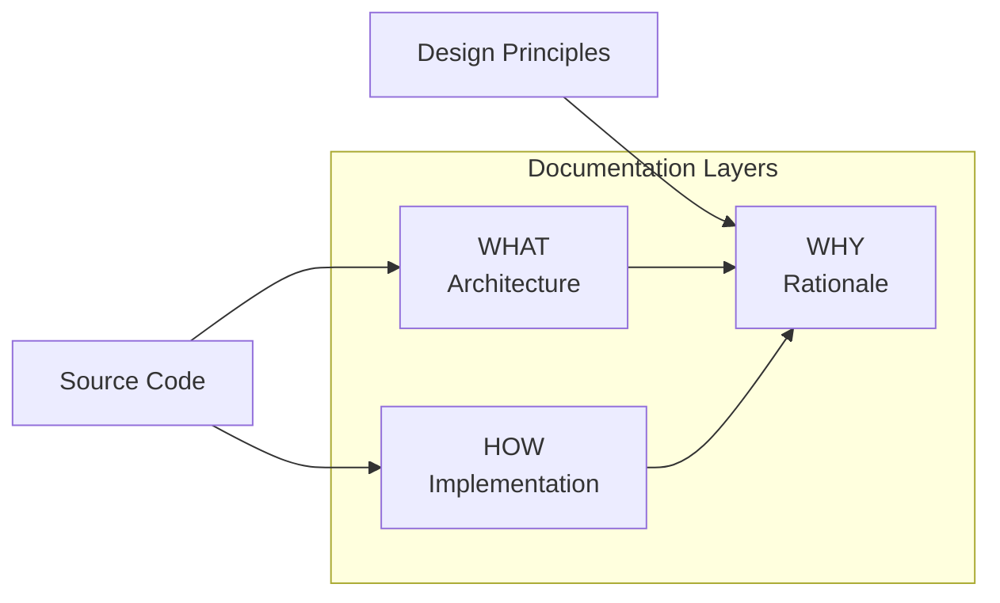
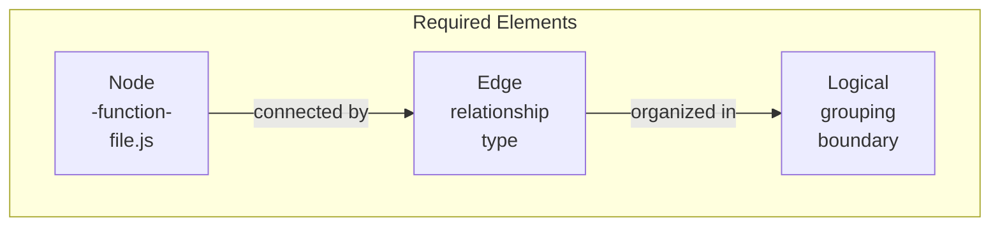

# SiP DOCUMENTATION GUIDELINES  {#top}

---

### TABLE OF CONTENTS

- [1. The Three-Layer Framework](#the-three-layer-framework)
- [2. WHAT Layer Guidelines](#what-layer-guidelines)
- [3. HOW Layer Guidelines](#how-layer-guidelines)
- [4. WHY Layer Guidelines](#why-layer-guidelines)
- [5. Author Checklist](#author-checklist)

---

### 1. THE THREE LAYER FRAMEWORK - WHAT, HOW AND WHY {#the-three-layer-framework}

Every section of a documentation or guidelines file must follow a standard format with introductions and three distinct layers.

#### LAYER OVERVIEW {#layer-overview-table}
| Layer | Purpose | Typical Content | Mandatory? |
|-------|---------|-----------------|------------|
| **WHAT** | System architecture & data flow | High-level Mermaid diagram (or equivalent) | **Optional** (diagram recommended for all but trivial implementations) |
| **HOW** | Implementation detail | Code samples, mapping tables, detailed sequences | **Yes** |
| **WHY** | Design rationale & constraints | 2 short paragraphs max in prose | **Yes** |

#### I. THE WHAT

*Goal: convey architecture at a glance.*

* **Include**: components, relationships, logical groupings.  
* **Recommended**: function / file names (for verification).  
* **Exclude**: implementation steps, magic numbers, exhaustive flows.



*Diagrams speed comprehension but may be skipped for simple/trivial elements.*

#### II. THE HOW

Technical Details of Implementation. See the [layer overview table](#layer-overview-table) above for mandatory content.

#### III. THE WHY

 The Three-layer framework separates architectural diagrams (WHAT), implementation details (HOW), and design rationale (WHY) to create documentation that is both complete and comprehensible.

 **Architecture without clutter**: The WHAT layer shows system structure without implementation details, making it easy to understand component relationships and data flow. Developers can quickly grasp how the system works without drowning in specifics.

**Details without loss**: The HOW layer captures implementation detail that fleshes out the architectural diagrams - ID mappings, timer values, specific API constraints. Nothing is lost; it's just properly structured to initially promote intuitive understanding and then allow access to all relevant details as needed.

**Understanding without jargon**: The WHY layer explains everything in plain English, connecting technical decisions to business value. A product manager can understand why the system works this way, while developers gain insight into constraints they must respect.

**Promotion of SiP Best Practices**: When put together, the three layer framework is meant to instantiate these six principles that drive both SiP code and documentation creation.

##### 1. STRUCTURAL CORRECTNESS - BUILD A SIMPLE, FUNCTIONAL, EXTENDABLE FRAMEWORK
- **Code**: FIX ROOT CAUSES, NOT SYMPTOMS - Structure systems so errors are impossible, not defended against
- **Documentation**: Structure the document to show architecture, detail and the reasoning behind them

##### 2. SINGLE SOURCE OF TRUTH
- **Code**: Each data point has one authoritative source
- **Documentation**: information should appear only once in documentation with the three sections building on, but not repeating one another

##### 3. ZERO ASSUMPTIONS
- **Code**: Verify all data structures, timing, and dependencies
- **Documentation**: All sections of the documentation must be mappable to the current iteration of the code. Verify all elements against actual implementation with file references

##### 4. COMPLETE REPRESENTATION
- **Code**: Handle all execution paths explicitly
- **Documentation**: Show all logical operations in the flow or structure

##### 5. CURRENT STATE ONLY
- **Code**: No backward compatibility that preserves broken patterns
- **Documentation**: No history, future plans, or deprecated information unless directly relevant to the WHY of the current implementation

##### 6. LOGICAL CLARITY
- **Code**: Group related operations into logical units
- **Documentation**: Follow the three-layer framework that separates logical operations, implementation details, the principles and reasoning underlying the code 

---

### 2. WHAT LAYER GUIDELINES {#what-layer-guidelines}

*Goal: convey architecture at a glance.*

The WHAT layer uses diagrams to show system architecture and logical structure without implementation details.

#### I. DIAGRAM REQUIREMENTS



#### II. DIAGRAM IMPLEMENTATION DETAILS

**What "code" means here**: Function and file names (like `-validateUser-` and `auth.js`) are recommended for verification. Actual code snippets, implementation logic, or code examples should be avoided to prioritize structure and flow clarity.

#### III. DIAGRAM RATIONALE

Diagrams must resist the temptation to show everything. Their power comes from abstraction - showing the forest, not every tree. A diagram that shows `validateUser()` calling `checkPermissions()` is useful; one that shows every validation step is not. When diagrams include implementation details, they become unreadable and unmaintainable.

Function and file names appear in WHAT diagrams for verification only - they prove the diagram matches reality. The actual implementation code belongs in the HOW layer, never in WHAT. This separation keeps architectural views clean while preserving all necessary details in their proper place.

Logical grouping makes complex systems comprehensible. By grouping related components, diagrams reveal system organization that's invisible in code. This architectural view is what makes diagrams valuable - it's the perspective code can't provide.

---

### 3. HOW LAYER GUIDELINES {#how-layer-guidelines}

*Goal: provide every detail needed to code, debug, or extend.*

### Common Elements
* Mapping tables  
* Code constants  
* Detailed sequence or state diagrams  
* Sample requests/responses  

Example:

```markdown
| Diagram Node | Implementation | File |
|--------------|----------------|------|
| Router | `handleMessage()` | router.js |
```

```javascript
// Timer values
const MESSAGE_DIM_TIMEOUT = 5000;      // ms
const HIDE_DELAY          = 2000;
```

---

### 4. WHY LAYER GUIDELINES {#why-layer-guidelines}

*Goal: make decisions obvious to any stakeholder.*

Template:

```markdown
### WHY: <Decision Summary>

**Constraint** – Plain-English description.  
**Benefit** – How the choice helps users or the business.  
**Alternatives** – Short note on rejected option(s) and why (optional).
```

Maximum length: **2 paragraphs** (≈ 150 words) per concept.  
Avoid code or jargon; link back to WHAT/HOW when technical detail is needed.

### 5. AUTHOR CHECKLIST {#author-checklist}

- [ ] Intro sentence explaining section scope.  
- [ ] WHAT layer present with clear architecture (diagram or bullets).  
- [ ] HOW layer contains all implementation detail, no leakage into WHAT.  
- [ ] WHY layer ≤ 2 paragraphs, understandable by non-engineers.  
- [ ] Headings, numbering, and capitalization follow this guide.  
- [ ] Links, file paths, and diagram references verified.

[Back to Top](#top)