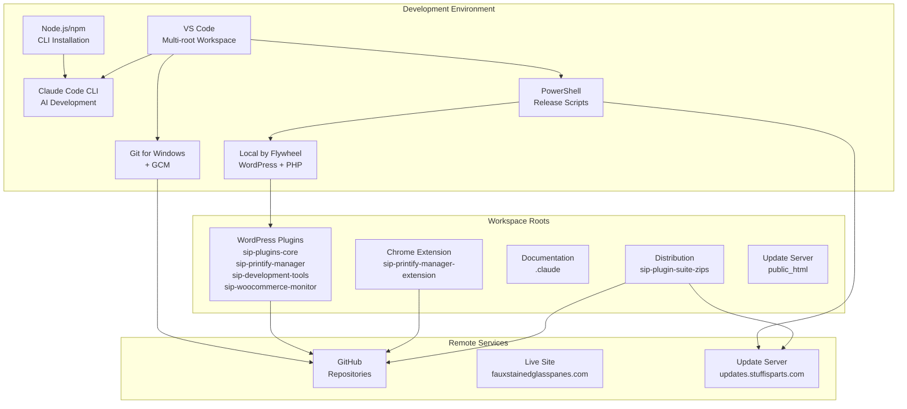
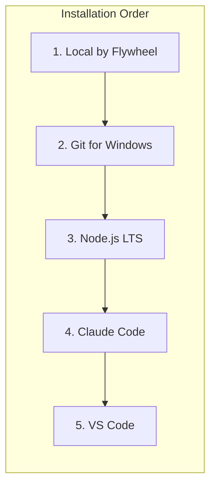
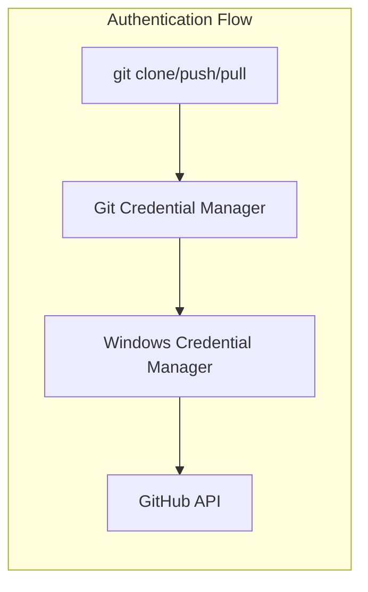
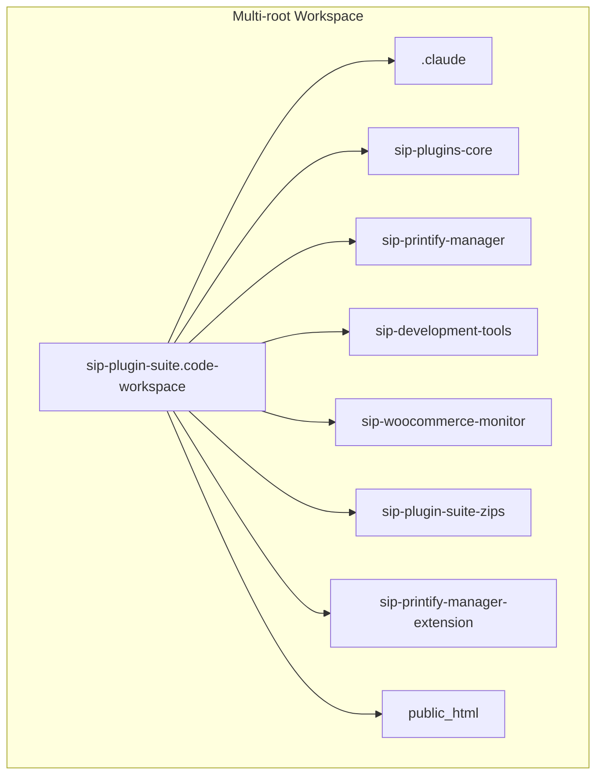

# SiP Development Environment Setup {#top}

---

### TABLE OF CONTENTS

- [1. Overview](#overview)
- [2. Main Architecture](#main-architecture)
- [3. Software Installation](#software-installation)
- [4. Directory Structure](#directory-structure)
- [5. Git Configuration](#git-configuration)
- [6. VS Code Workspace](#vscode-workspace)
- [7. Verification Checklist](#verification-checklist)

---

### 1. OVERVIEW {#overview}

#### I. WHAT
Standard development environment configuration for all SiP Plugin Suite workstations.

#### II. WHY
Consistent environment across workstations enables:
- Releases from any workstation using sip-development-tools
- Shared workspace file and directory structure
- Identical Git authentication workflow
- Predictable paths in automation scripts

---

### 2. MAIN ARCHITECTURE {#main-architecture}

#### I. WHAT



#### II. HOW

> **2A. Component Relationships**
>
> | Component | Depends On | Provides |
> |-----------|------------|----------|
> | Claude Code | Node.js/npm | AI-assisted development |
> | Git | GCM | Version control, GitHub auth |
> | PowerShell | Local (PHP) | Release automation |
> | VS Code | All above | Unified workspace interface |
> | Local by Flywheel | None | WordPress runtime, PHP |

#### III. WHY

**Windows-native stack** eliminates WSL complexity. Claude Code requires Node.js regardless of platform; running everything in Windows avoids cross-filesystem performance penalties and credential bridging issues.

**Local by Flywheel** provides isolated WordPress environment matching live site configuration without manual LAMP setup.

**Git Credential Manager** handles GitHub authentication securely across all repositories without repeated password prompts.

---

### 3. SOFTWARE INSTALLATION {#software-installation}

#### I. WHAT



#### II. HOW

> **3A. Local by Flywheel**
>
> Download: https://localwp.com/
>
> Configuration:
> - Site name: `faux-stained-glass-panes`
> - PHP version: Match live site (check at Dashboard → Tools → Site Health → Info → Server)
> - WordPress version: Match live site (check at Dashboard → Updates)
>
> Live site: https://www.fauxstainedglasspanes.com
>
> Verify: Local GUI opens and site starts

> **3B. Git for Windows**
>
> Download: https://git-scm.com/download/win
>
> During installation select:
> - Git Credential Manager (default)
> - Use Git from Windows Command Prompt
>
> Verify:
> ```powershell
> git --version
> git config --global credential.helper
> # Should return: manager
> ```

> **3C. Node.js LTS**
>
> Download: https://nodejs.org/ (LTS version)
>
> Post-installation - enable PowerShell scripts:
> ```powershell
> # Run PowerShell as Administrator
> Set-ExecutionPolicy RemoteSigned -Scope CurrentUser
> ```
>
> Verify:
> ```powershell
> node --version
> npm --version
> ```

> **3D. Claude Code CLI**
>
> Install globally via npm:
> ```powershell
> npm install -g @anthropic-ai/claude-code
> ```
>
> Verify:
> ```powershell
> claude --version
> ```

> **3E. VS Code**
>
> Download: https://code.visualstudio.com/
>
> No special configuration required.

#### III. WHY

**Installation order matters**: Git must be installed before cloning repositories. Node.js must be installed before Claude Code (npm dependency). Local must be running before release scripts can execute PHP.

**Node.js LTS** provides stability over cutting-edge features. Claude Code doesn't require latest Node features.

**PowerShell execution policy** must be set to `RemoteSigned` for npm scripts to run. This is a security default that blocks all scripts; `RemoteSigned` allows local scripts while protecting against unsigned remote scripts.

---

### 4. DIRECTORY STRUCTURE {#directory-structure}

#### I. WHAT

```mermaid
graph TB
    subgraph "C:\Users\tdeme\"
        LocalSites[Local Sites\]
        Repos[Repositories\]
        Docs[Documents\]
    end

    subgraph "LocalSites"
        Site[faux-stained-glass-panes\<br/>app\public\wp-content\plugins\]
    end

    subgraph "Plugins Directory"
        Claude[.claude\]
        Core[sip-plugins-core\]
        PM[sip-printify-manager\]
        DT[sip-development-tools\]
        WM[sip-woocommerce-monitor\]
        Zips[sip-plugin-suite-zips\]
    end

    subgraph "Repos"
        Ext[sip-printify-manager-extension\]
    end

    subgraph "Mapped Drive S:\"
        Update[home\updates\public_html\]
    end

    LocalSites --> Site
    Site --> Plugins Directory
    Repos --> Ext
```

#### II. HOW

> **4A. Standard Paths**
>
> All workstations must use identical paths:
>
> | Purpose | Path |
> |---------|------|
> | WordPress plugins | `C:\Users\tdeme\Local Sites\faux-stained-glass-panes\app\public\wp-content\plugins\` |
> | Chrome extension | `C:\Users\tdeme\Repositories\sip-printify-manager-extension\` |
> | Image references | `C:\Users\tdeme\Documents\VSCode_Images_Repo\` |
> | Update server | `S:\home\updates\public_html\` |
> | Workspace file | `D:\My Drive\code-workspaces\sip-plugin-suite.code-workspace` |

> **4B. Repository Cloning**
>
> After Git installation, clone each repository:
>
> ```powershell
> # Plugins directory
> cd "C:\Users\tdeme\Local Sites\faux-stained-glass-panes\app\public\wp-content\plugins"
>
> git clone https://github.com/Stuff-is-Parts/.claude.git
> git clone https://github.com/Stuff-is-Parts/sip-plugins-core.git
> git clone https://github.com/Stuff-is-Parts/sip-printify-manager.git
> git clone https://github.com/Stuff-is-Parts/sip-development-tools.git
> git clone https://github.com/Stuff-is-Parts/sip-woocommerce-monitor.git
> git clone https://github.com/Stuff-is-Parts/sip-plugin-suite-zips.git
>
> # Extension (separate location)
> cd "C:\Users\tdeme\Repositories"
> git clone https://github.com/Stuff-is-Parts/sip-printify-manager-extension.git
> ```
>
> GCM will prompt for GitHub authentication on first clone of private repositories.

> **4C. S: Drive Mapping (Update Server)**
>
> The update server is mounted via SSHFS:
>
> Prerequisites:
> - Install WinFsp: https://winfsp.dev/
> - Install SSHFS-Win: https://github.com/winfsp/sshfs-win
> - SSH key at `C:\Users\tdeme\.ssh\id_rsa`
>
> Map the drive:
> ```powershell
> net use S: \\sshfs.kr\root@143.198.184.177
> ```
>
> Verify: `ls S:\home\updates\public_html` shows update server files.

> **4D. Google Drive (Workspace File)**
>
> Install Google Drive Desktop: https://www.google.com/drive/download/
>
> After installation, Google Drive mounts as `D:\My Drive\`. The workspace file syncs automatically across workstations.

#### III. WHY

**Identical paths** across workstations enable release scripts to use hardcoded paths reliably. The PowerShell release scripts reference specific directories; path variations would break automation.

**Extension in separate directory** because Chrome extensions are not WordPress plugins and shouldn't be in the WordPress plugins folder.

**SSHFS for update server** provides direct file system access to the remote server without manual upload steps. Changes to S: drive are immediately reflected on updates.stuffisparts.com.

**Google Drive for workspace file** ensures all workstations use identical VS Code configuration without manual copying.

---

### 5. GIT CONFIGURATION {#git-configuration}

#### I. WHAT



#### II. HOW

> **5A. Initial Setup**
>
> ```powershell
> git config --global user.name "Your Name"
> git config --global user.email "your.email@example.com"
> ```

> **5B. Credential Manager Verification**
>
> GCM is installed with Git for Windows by default.
>
> Verify:
> ```powershell
> git config --global credential.helper
> # Should return: manager
> ```
>
> If not configured:
> ```powershell
> git config --global credential.helper manager
> ```

> **5C. Authentication Workflow**
>
> On first push/pull to a private repository, GCM opens a browser window for GitHub OAuth. After authentication, credentials are stored in Windows Credential Manager and reused automatically.

> **5D. Clearing Stored Credentials**
>
> If credentials need to be reset:
> 1. Open Windows Credential Manager (search "Credential Manager" in Start)
> 2. Select "Windows Credentials"
> 3. Remove entries starting with `git:https://github.com`

#### III. WHY

**Git Credential Manager** is the recommended authentication method for Git on Windows. It handles OAuth, 2FA, and token refresh automatically. Credentials persist across sessions and are secured by Windows Credential Manager.

**Single authentication** works across all repositories because GCM stores credentials per host (github.com), not per repository.

---

### 6. VS CODE WORKSPACE {#vscode-workspace}

#### I. WHAT



#### II. HOW

> **6A. Workspace File Location**
>
> `D:\My Drive\code-workspaces\sip-plugin-suite.code-workspace`
>
> This location (Google Drive) syncs the workspace configuration across workstations.

> **6B. Workspace Contents**
>
> ```json
> {
>     "folders": [
>         {"name": ".claude", "path": "C:/Users/tdeme/Local Sites/faux-stained-glass-panes/app/public/wp-content/plugins/.claude"},
>         {"name": "sip-plugins-core", "path": "C:/Users/tdeme/Local Sites/faux-stained-glass-panes/app/public/wp-content/plugins/sip-plugins-core"},
>         {"name": "sip-printify-manager", "path": "C:/Users/tdeme/Local Sites/faux-stained-glass-panes/app/public/wp-content/plugins/sip-printify-manager"},
>         {"name": "sip-development-tools", "path": "C:/Users/tdeme/Local Sites/faux-stained-glass-panes/app/public/wp-content/plugins/sip-development-tools"},
>         {"name": "sip-woocommerce-monitor", "path": "C:/Users/tdeme/Local Sites/faux-stained-glass-panes/app/public/wp-content/plugins/sip-woocommerce-monitor"},
>         {"name": "sip-plugin-suite-zips", "path": "C:/Users/tdeme/Local Sites/faux-stained-glass-panes/app/public/wp-content/plugins/sip-plugin-suite-zips"},
>         {"name": "sip-printify-manager-extension", "path": "C:/Users/tdeme/Repositories/sip-printify-manager-extension"},
>         {"name": "public_html", "path": "S:/home/updates/public_html"}
>     ],
>     "settings": {}
> }
> ```

> **6C. Development Workflow**
>
> 1. Open VS Code
> 2. File → Open Workspace from File → select `sip-plugin-suite.code-workspace`
> 3. Open terminal (PowerShell)
> 4. Start Claude Code: `claude`

#### III. WHY

**Multi-root workspace** allows all SiP components to be open simultaneously while maintaining separate Git repositories for each. This supports the integrated development of plugins and extensions that work together.

**Workspace file on Google Drive** automatically syncs workspace configuration across all workstations without manual copying.

---

### 7. VERIFICATION CHECKLIST {#verification-checklist}

#### I. WHAT

Complete verification that workstation is correctly configured.

#### II. HOW

> **7A. Software Verification**
>
> - [ ] `git --version` returns version
> - [ ] `git config --global credential.helper` returns `manager`
> - [ ] `node --version` returns version
> - [ ] `npm --version` returns version
> - [ ] `claude --version` returns version
> - [ ] Local by Flywheel GUI opens and site starts

> **7B. Repository Verification**
>
> - [ ] All repositories cloned to correct locations
> - [ ] Each repository shows in VS Code Source Control
> - [ ] Can fetch from GitHub without password prompt (after first auth)

> **7C. Workspace Verification**
>
> - [ ] VS Code opens workspace with all 8 roots visible
> - [ ] Terminal opens as PowerShell
> - [ ] `claude` command starts Claude Code

#### III. WHY

**Verification before development** catches configuration issues early. Missing components or incorrect paths cause cryptic errors during development or release processes.

[Back to Top](#top)
