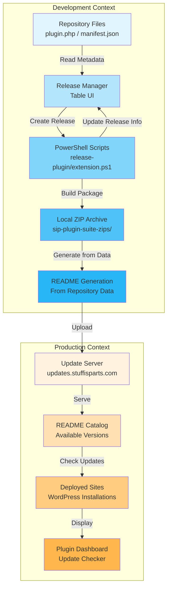

# Release, Versioning, and Git Process

## Overview

The SiP plugin suite uses an automated release system that handles version updates, Git operations, and package creation. The system supports both WordPress plugins and browser extensions through a flexible repository management interface. The process follows a specific Git workflow with `develop` and `master` branches, automated versioning, and centralized release distribution.

## Dual Lifecycle Architecture

The release system recognizes two distinct contexts with different requirements:

### Development Context (Local Environment)
- **Purpose**: Create and manage releases
- **Source of Truth**: Repository files (plugin headers, manifest.json)
- **Users**: Developers creating releases
- **Data Flow**: Repositories → Release Manager → ZIP Creation → Update Server

### Production Context (Deployed Sites)
- **Purpose**: Check for and install updates
- **Source of Truth**: Update server README (distribution catalog)
- **Users**: Site administrators checking for updates
- **Data Flow**: Update Server README → Plugin Dashboard → Update Installation

## Core Principles

1. **Repository Files as Source of Truth**
   - Version data comes from plugin headers or manifest.json
   - No parsing of external files for repository metadata
   - Dynamic reading ensures always-current information

2. **No String Concatenation for Data**
   - Data structures built as arrays/objects
   - Content assembled in single operations
   - Eliminates performance issues and complexity

3. **Type-Specific Lifecycles**
   - Plugins and extensions follow different paths
   - Clear distinction maintained throughout process
   - Type determines file structure and versioning

4. **Minimal Data Storage**
   - Store only what can't be read from files
   - Track release history separately
   - Reduce synchronization issues

## Release Lifecycle Visualization

### ASCII Flow Diagram
```
DEVELOPMENT CONTEXT                           PRODUCTION CONTEXT
===================                           ==================

┌─────────────────┐                          ┌──────────────────┐
│  Repository     │                          │  Deployed Site   │
│  Source Files   │                          │  (WordPress)     │
├─────────────────┤                          ├──────────────────┤
│ • plugin.php    │                          │ • Checks README  │
│ • manifest.json │                          │ • Shows updates  │
└────────┬────────┘                          └────────▲─────────┘
         │                                              │
         │ Read metadata                                │ HTTP Request
         ▼                                              │
┌─────────────────┐                          ┌──────────────────┐
│ Release Manager │                          │  Update Server   │
│    Table UI     │                          │ (stuffisparts)   │
├─────────────────┤                          ├──────────────────┤
│ • Shows version │                          │ • Hosts ZIPs     │
│ • Release date  │                          │ • Serves README  │
└────────┬────────┘                          └────────▲─────────┘
         │                                              │
         │ Create Release                               │ Upload
         ▼                                              │
┌─────────────────┐     ┌──────────────┐    ┌──────────────────┐
│   PowerShell    │────▶│ Local ZIPs   │───▶│ README Generated │
│    Scripts      │     │ Repository   │    │  (Not Parsed)    │
└─────────────────┘     └──────────────┘    └──────────────────┘

Plugin Path:  .php → Table → PS1 → ZIP → README → Server → Sites
Extension Path: .json → Table → PS1 → ZIP → README → Server → Sites
```

### Mermaid Flow Diagram


## Component Responsibilities

### 1. Repository Registration (Entry Point)
- **Input**: File path to repository
- **Process**: Validate Git repo, detect type, extract metadata
- **Storage**: Path, type, and last_release only
- **Output**: Repository added to management table

### 2. Release Manager Table (Display & Control)
- **Data Source**: Fresh read from repository files + stored release info
- **Shows**: Current version, last release date, branch status
- **Actions**: Create release, manage repositories
- **Updates**: Real-time from AJAX calls

### 3. PowerShell Release Scripts (Execution)
- **Plugin Script**: `release-plugin.ps1`
- **Extension Script**: `release-extension.ps1`
- **Process**: 16-step automated release
- **Updates**: Calls PHP to update release info on completion

### 4. README Generation (Distribution Catalog)
- **Trigger**: After successful release
- **Source**: Repository Manager data
- **Method**: PHP arrays to structured text (no concatenation)
- **Purpose**: Catalog for production sites

### 5. Update Server (Distribution Point)
- **Hosts**: ZIP files and README catalog
- **Access**: Public HTTP endpoint
- **Used By**: All deployed WordPress sites

## Implementation Files

### PHP Files
```
sip-development-tools/
├── includes/
│   ├── repository-manager.php          # Core repository management class
│   ├── repository-ajax-handlers.php    # AJAX endpoints for repository operations
│   └── release-functions.php           # Release process functions
```

### JavaScript Files
```
sip-development-tools/
├── assets/js/modules/
│   ├── repository-manager.js    # Client-side repository management
│   └── release-actions.js       # Release UI and status monitoring
```

### Key Classes and Functions

#### PHP (Server-Side)
- `SiP_Repository_Manager::get_repositories()` - Get all repos with status
- `SiP_Repository_Manager::get_fresh_repository_info()` - Read current file data
- `SiP_Repository_Manager::update_repository_release()` - Update release tracking
- `SiP_Repository_Manager::generate_readme_content()` - Create README from data
- `sip_check_release_status()` - Monitor release and update on completion

#### JavaScript (Client-Side)
- `updateRepositoryTable()` - Refresh table display via AJAX
- `handleAddRepository()` - UI for adding new repositories
- `startStatusPolling()` - Monitor release progress
- `checkReleaseStatus()` - Poll for completion and trigger updates

## Repository Management

### Overview
The release manager uses a flexible repository registration system that allows management of repositories located anywhere on the file system. This replaces the previous auto-detection system that was limited to the WordPress plugins directory.

### Data Architecture

#### What Gets Stored
```php
// WordPress Option: sip_development_tools_repositories
[
    'md5-hash-of-path' => [
        'path' => '/absolute/path/to/repository',
        'type' => 'plugin|extension',
        'last_release' => [
            'version' => '2.3.0',
            'date' => '2024-03-15 14:30:00'
        ]
    ]
]
```

#### What Gets Read Dynamically
- **From Plugin Files**: Name, version, text domain, description
- **From manifest.json**: Name, version, permissions, Chrome ID
- **From Git**: Branch status, uncommitted changes, remote sync

#### Data Flow Sequence
```
1. User adds repository path
   └─> Validate Git repo
   └─> Detect type (plugin/extension)
   └─> Store minimal data

2. Table displays repository
   └─> Read fresh metadata from files
   └─> Merge with stored release info
   └─> Show in UI

3. User creates release
   └─> PowerShell updates version
   └─> Creates ZIP package
   └─> Updates last_release in storage
   └─> Generates README from all repos

4. Production site checks updates
   └─> Fetches README from server
   └─> Compares versions
   └─> Shows available updates
```

### Repository Validation
Minimal validation ensures only essential requirements:
1. **Git Repository**: Directory must contain `.git` folder
2. **Main File**: 
   - Plugins: PHP file with valid WordPress plugin header
   - Extensions: `manifest.json` file
3. **Permissions**: Read/write access to directory
4. **Clear Error Messages**: Specific feedback on validation failures

### UI Elements
- **Add Repository Button**: Located in release table header, shows modal dialog with text input
- **Repository Table**: No longer shows repository path column (removed for cleaner UI)
- **Remove Repository**: × button in actions column to remove from management
- **Table Refresh**: Automatic refresh via AJAX when repositories are added/removed

### Disconnected Repository Handling
When a repository cannot be found at its stored path:

1. **Visual Indicators**:
   - Row appears greyed out
   - Path column shows "Repository not found" message
   - Version and status information unavailable

2. **Available Actions**:
   - **Delete**: Removes the repository entry permanently
   - **Reconnect**: Opens file browser to select new location
     - Uses same validation as adding new repository
     - If validation fails or user cancels, row remains disconnected
     - Useful when repository moved or drive temporarily unmounted

3. **Automatic Recovery**:
   - System checks repository availability on each page load
   - When missing repository becomes available again (e.g., drive remounted), full functionality automatically restored
   - No manual intervention required if repository returns to original location

## Branch Status Checking

### Overview
The branch status system checks Git repository state for all registered repositories, regardless of their location on the file system.

### Implementation Details
- **No Plugin Directory Assumptions**: Uses Repository Manager paths instead of `WP_PLUGIN_DIR`
- **Universal Support**: Works for both plugins and extensions in any location
- **Repository-Based Queries**: All functions accept repository path as parameter
- **Clean Architecture**: No `get_plugins()` calls or WordPress plugin scanning

### Key Functions
```php
// Check branch changes for all repositories
function sip_check_branch_changes() {
    $repositories = SiP_Repository_Manager::get_repositories();
    foreach ($repositories as $repo) {
        if ($repo['status'] === 'active') {
            $results[$repo['slug']] = sip_get_branch_changes($repo['path'], $repo['slug']);
        }
    }
}

// Get branch changes using repository path
function sip_get_branch_changes($repo_path, $repo_slug) {
    // Uses $repo_path directly for all Git commands
    // No assumptions about plugin directory structure
}
```

## Release Process Workflow

### Pre-Release Checklist
The system automatically checks:
1. Current branch (must be on `develop`)
2. Uncommitted changes (working directory must be clean)
3. Git identity configuration
4. Local/remote branch synchronization

### Branch Check and Recovery
**Why**: Git workflow requires releases from `develop` branch to maintain separation between stable (`master`) and development code. Manual branch switching is error-prone and interrupts workflow.

```javascript
// Branch check triggers modal if not on develop
checkCurrentBranch(pluginSlug).then(response => {
    if (response.data.current_branch !== 'develop') {
        showBranchSwitchModal(response.data.current_branch, (proceed) => {
            if (proceed) {
                switchToDevelopBranch(pluginSlug).then(() => {
                    startReleaseProcess(pluginSlug, ...);
                });
            }
        });
    }
});
```

## Type-Specific Release Lifecycles

### Plugin Release Lifecycle
1. **Repository Add**: Detect WordPress plugin via PHP headers
2. **Version Source**: Read from main PHP file header
3. **Release Process**: 
   - Update version in PHP file
   - Create ZIP with plugin folder structure
   - File naming: `plugin-name-X.Y.Z.zip`
4. **Distribution**: Upload to plugins section of update server
5. **Update Check**: WordPress sites check via SiP Plugins Core

### Extension Release Lifecycle  
1. **Repository Add**: Detect Chrome extension via manifest.json
2. **Version Source**: Read from manifest.json
3. **Release Process**:
   - Update version in manifest.json
   - Create ZIP with direct file structure (no wrapper folder)
   - File naming: `extension-name-vX.Y.Z.zip`
4. **Distribution**: Upload to extensions section of update server
5. **Future**: Chrome Web Store integration (pending approval)

### 16-Step Release Process
The PowerShell script executes these steps for both plugins and extensions:

1. **Safety Checks**: Verify Git branch and uncommitted changes
2. **Update Version**: Update version in main plugin file (or manifest.json for extensions)
3. **Update Dependencies**: Automatically set core dependency requirements for child plugins
4. **Commit Changes**: Commit to `develop` branch
5. **Push Develop**: Push `develop` to GitHub
6. **Merge to Master**: Checkout and merge `develop` into `master`
7. **Create Tag**: Create Git tag for release version
8. **Push Master**: Push `master` and tags to GitHub
9. **Verify Central Dir**: Check central repository exists
10. **Ensure Directories**: Create `previous_releases` folder
11. **Archive Old ZIPs**: Move existing ZIPs to previous releases
12. **Build Package**: Create clean release ZIP using 7-Zip via PHP
13. **Update README**: Generate from repository data (no parsing)
14. **Commit Central**: Commit changes to central repository
15. **Push Central**: Push central repository to GitHub
16. **Sync Branches**: Merge `master` back to `develop` and return to `develop` branch

## Version Numbering

### Format
- Follows semantic versioning: `MAJOR.MINOR.PATCH` (e.g., `2.3.0`)
- Must be numeric with exactly three components

### Version Locations

#### WordPress Plugins
```php
// Main plugin file header
/**
 * Version: 2.3.0
 */
```

#### Browser Extensions
```json
// manifest.json
{
  "version": "1.0.0"  // Note: No 'v' prefix in manifest
}
```

#### Central Repository README.md
```markdown
### sip-plugins-core
- Version: 2.3.0
- File: sip-plugins-core-2.3.0.zip
- Last updated: 2024-03-15 14:30:00

### sip-printify-manager-extension
- Version: 1.0.0
- File: extensions/sip-printify-manager-extension-v1.0.0.zip
- Last updated: 2024-03-15 14:35:00
```

## Git Workflow

### Branch Strategy
- **develop**: Active development branch (required for releases)
- **master**: Stable release branch
- Tags: `v2.3.0` format for releases

### Branch Switching Recovery
```php
// sip_switch_to_develop() implementation
function sip_switch_to_develop() {
    // Check for uncommitted changes
    $status_output = shell_exec('git status --porcelain 2>&1');
    if (!empty(trim($status_output))) {
        SiP_AJAX_Response::error(..., 'Cannot switch branches - you have uncommitted changes.');
    }
    
    // Switch to develop branch
    shell_exec('git checkout develop 2>&1');
    
    // Pull latest changes
    $pull_output = shell_exec('git pull origin develop 2>&1');
    
    // Set upstream if needed
    if (strpos($pull_output, 'no tracking information') !== false) {
        shell_exec('git branch --set-upstream-to=origin/develop develop 2>&1');
    }
}
```

### Release Git Flow
```bash
# Start on develop branch
git checkout develop

# Version bump and commit
git add main-file.php
git commit -m "Bump version to 2.3.0"
git push origin develop

# Merge to master
git checkout master
git merge develop
git tag -a "v2.3.0" -m "Version 2.3.0"
git push origin master --tags

# CRITICAL: Sync master back to develop (Step 16)
git checkout develop
git merge master
git push origin develop

# Both branches now identical
```

## Branch Synchronization (Step 16)

**Why**: Release process creates commits/tags on `master` during merge. Without syncing back to `develop`, branches diverge and cause merge conflicts in future releases.

**The Fix**: Step 16 automatically merges `master` back to `develop` after each release.

**Verification**: 
```bash
git rev-list --left-right --count master...develop
# Should show: 0	0 (branches identical)
```

### Git Identity
Default identity if not configured:
- Name: `SiP Development Tools`
- Email: `support@stuffisparts.com`

## ZIP Creation Process

### Overview
The release process creates ZIP files using 7-Zip through a PHP function that can be called from the PowerShell script without requiring WordPress context.

### Key Points
- **7-Zip Requirement**: The system requires 7-Zip to be installed at `C:\Program Files\7-Zip\7z.exe`
- **WordPress Independence**: The `sip_create_zip_archive()` function works without WordPress loaded
- **ABSPATH Calculation**: Dynamically calculates ABSPATH from script location to support repositories anywhere on the filesystem
- **Temp Directory**: Uses temporary directory structure for building packages
- **Compression**: Uses store method (no compression) for faster processing

### ABSPATH Calculation
**Why**: Repository Manager allows repositories anywhere on filesystem, but PHP ZIP creation function requires WordPress constants. Script location provides reliable reference point for calculation.

```php
// PowerShell script generates PHP code that calculates ABSPATH
$scriptDir = '$($MyInvocation.MyCommand.Path.Replace('\', '/'))';  
$parts = explode('/', $scriptDir);
$abspath = implode('/', array_slice($parts, 0, -5)) . '/';
define('ABSPATH', $abspath);
```

### Process Flow
1. PowerShell creates a temporary directory structure
2. Copies plugin files (excluding .git, logs, etc.)
3. Calls PHP function to create ZIP using 7-Zip
4. Cleans up temporary files

## Implementation Details

### AJAX Actions

#### Release Actions
```php
// Main release action handler
function sip_handle_release_action() {
    $release_action = $_POST['release_action'];
    
    switch ($release_action) {
        case 'create_release':
            sip_create_release();
            break;
        case 'check_release_status':
            sip_check_release_status();
            break;
        case 'check_uncommitted_changes':
            sip_check_uncommitted_changes();  // Uses Repository Manager
            break;
        case 'check_branch_changes':
            sip_check_branch_changes();  // Uses Repository Manager
            break;
        case 'commit_changes':
            sip_commit_changes();  // Uses Repository Manager
            break;
        case 'get_plugin_data':
            sip_get_plugin_data();  // Uses Repository Manager
            break;
        case 'check_current_branch':
            sip_check_current_branch();  // Check repository branch
            break;
        case 'switch_to_develop':
            sip_switch_to_develop();  // Switch to develop and pull latest
            break;
    }
}
```

#### Repository Actions
```php
// Repository management handler
function sip_handle_repository_action() {
    $action = $_POST['repository_action'];
    
    switch ($action) {
        case 'validate_repository':
            sip_ajax_validate_repository();
            break;
        case 'add_repository':
            sip_ajax_add_repository();
            break;
        case 'remove_repository':
            sip_ajax_remove_repository();
            break;
        case 'reconnect_repository':
            sip_ajax_reconnect_repository();
            break;
        case 'get_repository_table_rows':
            sip_ajax_get_repository_table_rows();
            break;
    }
}
```

### JavaScript Monitoring
```javascript
// Check release status every 2 seconds
function startStatusPolling(logFileName) {
    statusPollingInterval = setInterval(function() {
        checkReleaseStatus(logFileName, function(hasNewContent, currentLogEntry) {
            // Update UI with progress
        });
    }, 2000);
}

// Modal dialog for branch switching
function showBranchSwitchModal(currentBranch, callback) {
    // Creates SiP-standard modal dialog
    // Offers to switch to develop branch
    // Handles user response via callback
}
```

### PowerShell Execution
```php
// Background execution (default)
$command = "start /B cmd /c \"cd /d " . escapeshellarg($plugin_dir) . 
          " && powershell -ExecutionPolicy Bypass -File \"$ps_script\" " .
          "-NewVersion \"$new_version\" -PluginSlug \"$plugin_slug\" " .
          "-MainFile \"$main_file\" -LogLevel \"$log_level\" >> \"$log_file_path\" 2>&1\"";
pclose(popen($command, 'r'));

// Foreground execution (POWERSHELL log level)
exec($command, $output, $return_var);
```

### PowerShell Script Output
**Why**: PowerShell's default behavior outputs return values to console, which pollutes logs when redirected to file.

```powershell
# Suppress return value output to prevent log pollution
$null = @{
    Success = $success
    Errors = $errors
    Logs = $logEntries
    ZipFile = if ($success) { $zipFile } else { $null }
}

# Add explicit completion marker instead
Write-LogEntry "[COMPLETE] Release process finished" "INFO"
```

## Error Handling

### Pre-Release Errors
- **Uncommitted Changes**: Must commit or stash before release
- **Wrong Branch**: Shows modal offering to switch to `develop` branch
- **Git Identity**: Auto-configured if missing
- **Repository Not Found**: Clear error when repository path invalid

### Release Process Errors
- **Version Update Failed**: Check file permissions
- **Git Push Failed**: Check authentication/network
- **Tag Creation Failed**: Verify tag doesn't exist
- **Central Repo Issues**: Ensure directory exists

### Recovery
- PowerShell script logs all operations
- Process can be cancelled via UI
- Failed releases don't affect working directory

## Central Repository

### Structure
```
sip-plugin-suite-zips/
├── README.md               # Auto-updated plugin & extension manifest
├── sip-plugins-core-2.3.0.zip
├── sip-printify-manager-3.1.0.zip
├── extensions/             # Browser extensions directory
│   └── sip-printify-manager-extension-v1.0.0.zip
└── previous_releases/
    ├── sip-plugins-core-2.2.0.zip
    └── sip-printify-manager-3.0.0.zip
```

### README.md Format
```markdown
# SiP Plugin & Extension Releases

This directory contains the latest releases of all SiP plugins and extensions.

Last updated: 2024-03-15 14:30:00

## Available Plugins

### sip-plugins-core
- Version: 2.3.0
- File: sip-plugins-core-2.3.0.zip
- Last updated: 2024-03-15 14:30:00

### sip-printify-manager
- Version: 3.1.0
- File: sip-printify-manager-3.1.0.zip
- Last updated: 2024-03-14 10:15:00

## Available Extensions

### sip-printify-manager-extension
- Version: 1.0.0
- File: extensions/sip-printify-manager-extension-v1.0.0.zip
- Chrome Web Store ID: ikgbhdaibkmehpeipbcooebkgpfegdbg
- Last updated: 2024-03-15 14:35:00
```

### README Generation

**Why**: The central repository README serves as a distribution catalog for deployed sites to check for updates. It's generated from repository data, not parsed for data.

#### Generation Process

1. **Data Source**: Repository Manager maintains release information
2. **Generation Trigger**: README is regenerated after each successful release
3. **PHP Function**: `SiP_Repository_Manager::generate_readme_content()` creates the content
4. **No Parsing**: README is write-only from the release manager's perspective

#### README Structure
```markdown
# SiP Plugin Releases

This directory contains the latest releases of all SiP plugins.

Last updated: 2024-03-15 14:30:00

## Available Plugins

### sip-plugins-core
- Version: 2.3.0
- File: [sip-plugins-core-2.3.0.zip](./sip-plugins-core-2.3.0.zip)
- Last updated: 2024-03-15 14:30:00

## Available Extensions

### sip-printify-manager-extension
- Version: 1.0.0
- File: [extensions/sip-printify-manager-extension-v1.0.0.zip](./extensions/sip-printify-manager-extension-v1.0.0.zip)
- Chrome Web Store ID: ikgbhdaibkmehpeipbcooebkgpfegdbg
- Last updated: 2024-03-15 14:35:00
```

### PowerShell String Building Best Practices

**Why**: String concatenation in PowerShell creates new string objects repeatedly, leading to memory inefficiency and performance degradation. Building content all at once is cleaner and more maintainable.

The PowerShell scripts use a two-phase approach to avoid concatenation:

1. **Data Collection Phase**
```powershell
# Gather all repository data into structured objects
function Get-PluginReleaseData {
    $pluginData = @()
    foreach ($plugin in $sipPlugins) {
        $pluginInfo = @{
            Name = $plugin.Name
            Version = ""
            FileName = ""
            LastUpdated = ""
            HasRelease = $false
        }
        # Populate data...
        $pluginData += $pluginInfo
    }
    return $pluginData
}
```

2. **Content Generation Phase**
```powershell
# Generate complete README from data structure
function New-ReadmeContent {
    param ([array]$PluginData)
    
    # Build sections in array
    $sections = @()
    foreach ($plugin in $PluginData) {
        $section = @"
### $($plugin.Name)
- Version: $($plugin.Version)
- File: [$($plugin.FileName)](./$($plugin.FileName))
"@
        $sections += $section
    }
    
    # Join all at once
    $fullContent = @"
# SiP Plugin Releases
$($sections -join "`n`n")
"@
    return $fullContent
}
```

**Key Points**:
- No string concatenation (`+=` on strings)
- Data gathered first, then formatted
- Sections collected in arrays, joined once
- PowerShell here-strings for clean multi-line content
- Same approach used in both `release-plugin.ps1` and `release-extension.ps1`

### Update Server Integration
The README.md is automatically uploaded to `https://updates.stuffisparts.com/` after each release, allowing other systems to check for available updates.

### Extension Upload API
The update server API accepts both 'plugin_zip' and 'extension_zip' parameters to provide flexibility for different asset types.

```bash
# Extension upload uses extension-specific parameter
curl -X POST \
  -F "plugin_slug=$ExtensionSlug" \
  -F "version=$Version" \
  -F "action=upload" \
  -F "extension_zip=@$ZipFile" \
  https://updates.stuffisparts.com/update-api.php
```

**Note**: The server accepts both 'plugin_zip' and 'extension_zip' parameters, automatically detecting the file type from either parameter name.

## Logging

### Log Levels
- **MINIMAL**: Only critical steps
- **NORMAL**: Standard progress (default)
- **VERBOSE**: Detailed debug information
- **POWERSHELL**: Foreground execution with full output

### Log Location
```
sip-development-tools/logs/
└── release_sip-plugins-core_2.3.0_1710512400.log
```

### Log Format
```
[2024-03-15 14:30:00] [INFO] Starting release process for sip-plugins-core version 2.3.0
[2024-03-15 14:30:01] [SUCCESS] Version updated in main file
[2024-03-15 14:30:02] [INFO] Pushing develop branch to GitHub...
[2024-03-15 14:30:05] [SUCCESS] Develop branch pushed to GitHub
[2024-03-15 14:35:00] [SUCCESS] Plugin uploaded to update server successfully
[2024-03-15 14:35:01] [COMPLETE] Release process finished
```

### Completion Detection
**Why**: PHP needs to reliably detect when PowerShell scripts finish to update UI status and prevent indefinite "running" state.

```php
// PHP checks for these completion markers in log content
if (strpos($log_content, '[COMPLETE] Release process finished') !== false) {
    $is_complete = true;
}

// Also checks for upload success (different for plugins vs extensions)
if (strpos($log_content, '[SUCCESS] Plugin uploaded to update server successfully') !== false ||
    strpos($log_content, '[SUCCESS] Extension uploaded to update server successfully') !== false) {
    $is_complete = true;
}
```

## UI Features

### Branch Status Display
- **Master←Develop**: Shows commits between branches
- **Local↔Remote**: Shows ahead/behind status
- **Uncommitted**: Shows modified files

### Visual Indicators
```javascript
// Red button for plugins with changes
if (hasChangesForRelease) {
    $createReleaseButton.css({
        'background-color': '#d63638',
        'border-color': '#d63638',
        'color': 'white'
    });
}

// Modal dialogs for user interaction
// - Branch switch modal with monospace branch names
// - Uncommitted changes modal with file list
// - Progress tracking during operations
```

### Progress Tracking
- Real-time log updates
- Step duration display
- Total elapsed time
- Success/error messages

## Usage

### Basic Release
1. Navigate to SiP Dev Tools → Release Plugins
2. Enter new version number (e.g., `2.3.0`)
3. Select log level (default: NORMAL)
4. Click "Create Release"
5. Monitor progress in real-time

### Cancel Release
- Click "Cancel Release" during process
- System attempts to terminate PowerShell script
- Log file preserved for debugging

### View Logs
- Click "View Log File" after completion
- Access via `sip-development-tools/logs/`

## Configuration

### Environment Variables
```powershell
# Skip branch check
$env:SKIP_BRANCH_CHECK = "true"

# Enable Git trace (VERBOSE mode)
$env:GIT_TRACE = 1
$env:GIT_CURL_VERBOSE = 1
```

### Timeout Settings
```php
// PHP execution limits
ini_set('memory_limit', '256M');
ini_set('max_execution_time', 30);

// PowerShell timeouts
$timeoutSeconds = 60;  // Git push operations
$timeoutSeconds = 30;  // Git checkout/merge
$timeoutSeconds = 20;  // Git add/commit
```

## Troubleshooting

### Common Issues

1. **Stuck on "Processing..."**
   - Check PowerShell execution policy
   - Verify Git authentication
   - Check network connectivity

2. **"Not on develop branch" Error**
   - Click "Switch to Develop & Continue" in the modal dialog
   - Or manually switch:
     ```bash
     git checkout develop
     git pull origin develop
     ```

3. **Branch Divergence After Release**
   - **Cause**: Step 16 (branch sync) failed during previous release
   - **Solution**: `git checkout develop && git reset --hard master && git push origin develop --force-with-lease`

4. **Merge Conflicts During Release**
   - **Cause**: Conflicting changes between master and develop during sync
   - **Solution**: `git checkout develop && git merge master` (resolve conflicts manually)

5. **Authentication Failures**
   - Configure Git credentials
   - Use SSH keys or credential store

6. **Central Repository Missing**
   - Ensure `sip-plugin-suite-zips` exists
   - Check directory permissions

### Debug Commands
```bash
# Check branch divergence
git rev-list --left-right --count master...develop

# Verify branch sync (should be identical)
git log --oneline -1 master
git log --oneline -1 develop

# Check Git identity
git config user.name
git config user.email

# Test connectivity
git ls-remote origin
```

## Security Considerations

1. **File Permissions**: Ensure write access to:
   - Plugin directories
   - Log directory
   - Central repository

2. **Git Authentication**: 
   - Never store credentials in code
   - Use Git credential manager
   - Consider SSH keys

3. **Process Security**:
   - Scripts run with web server permissions
   - Validate all inputs
   - Sanitize version numbers

## Best Practices

1. **Before Release**:
   - Pull latest changes
   - Test plugin functionality
   - Review changelog

2. **Version Planning**:
   - MAJOR: Breaking changes
   - MINOR: New features
   - PATCH: Bug fixes

3. **Release Notes**:
   - Update README/changelog
   - Document breaking changes
   - Include migration guides

4. **Post-Release**:
   - Verify ZIP integrity
   - Test auto-update system
   - Monitor error logs

## Implementation Summary

### Key Changes from Previous System

1. **Eliminated README Parsing**
   - Old: Parse README with regex to extract release dates
   - New: Generate README from stored repository data
   - Benefit: No brittle pattern matching

2. **Repository Files as Source**
   - Old: Multiple sources of truth (README, stored data, file versions)
   - New: Single source - repository files for metadata
   - Benefit: Always current, no sync issues

3. **Automatic Release Tracking**
   - Old: Manual README updates required
   - New: Release info updated automatically on completion
   - Benefit: Accurate release history

4. **Type-Specific Handling**
   - Old: Plugins and extensions treated similarly
   - New: Clear distinction with different paths
   - Benefit: Proper support for both types

### Critical Implementation Details

1. **No String Concatenation**: All data assembly uses arrays/objects
2. **Dynamic Metadata**: Version/name always read fresh from files
3. **Minimal Storage**: Only store what can't be read
4. **Release History**: Separate option tracks all releases
5. **README Generation**: One-way process (write only, no parse)

## Troubleshooting Repository Management

### Common Issues and Solutions

#### Repository Not Showing in Table
**Symptom**: Added repository doesn't appear or shows "Not released"
**Cause**: Repository data stored but not displaying correctly
**Solution**:
1. Verify repository type detection worked correctly
2. Check `last_release` field exists in stored data
3. Ensure `get_fresh_repository_info()` can read version

#### Extension Release Dates Missing
**Symptom**: Extensions always show "Not released" even after releases
**Cause**: Release tracking not updating for extension type
**Solution**:
1. Check PowerShell script detects extension type correctly
2. Verify `update_repository_release()` called with correct type
3. Ensure manifest.json has valid version field

#### Version Mismatch
**Symptom**: Table shows old version after plugin update
**Cause**: Cached data or incorrect source
**Solution**:
1. Version should come from repository files, not stored data
2. Check `get_fresh_repository_info()` reads current file
3. Clear any transient caches

### Key Functions for Debugging

```php
// Get raw stored repository data
$repos = get_option('sip_development_tools_repositories');

// Get repository with fresh file data
$fresh = SiP_Repository_Manager::get_fresh_repository_info($repo);

// Check release history
$history = get_option('sip_development_tools_release_history');

// Force README regeneration
$readme = SiP_Repository_Manager::generate_readme_content();
```

### Data Flow Debugging

1. **Add Repository**: Check `extract_repository_info()` detects type
2. **Display Table**: Verify `get_release_repositories()` merges data correctly  
3. **Create Release**: Ensure `sip_check_release_status()` updates on completion
4. **View Updates**: Confirm README generation includes all active repos

