# SiP Documentation Guidelines - Three-Layer Framework

This document defines the three-layer documentation framework for all SiP technical documentation. The framework separates architectural diagrams (WHAT), implementation details (HOW), and design rationale (WHY) to create documentation that is both complete and comprehensible.

**Document outline:**
- Overview and framework structure
- Core principles and their implementation
- Requirements for sections and layers
- Guidelines for each layer (WHAT, HOW, WHY)
- Verification and maintenance procedures
- Quick reference templates

## 1. Overview

This section explains the three-layer framework structure and why it solves common documentation problems.

### I. Documentation Structure

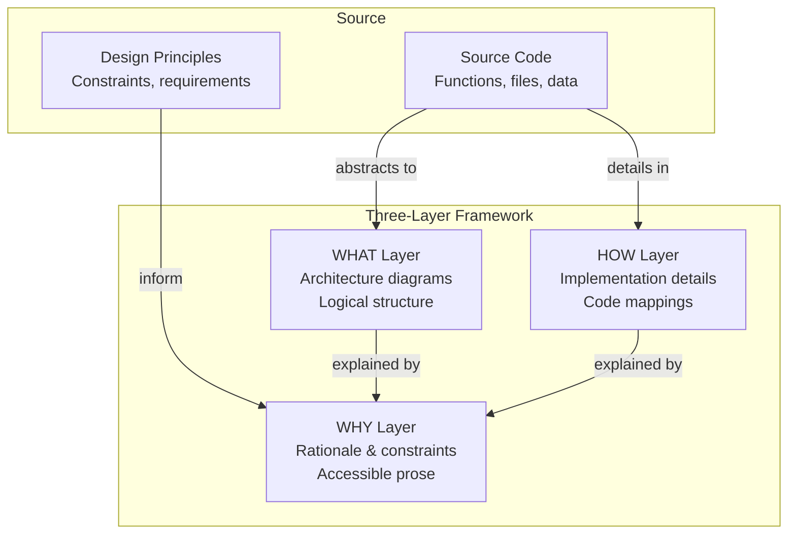

### II. Layer Responsibilities

| Layer | Content Type | Audience | Format |
|-------|-------------|----------|---------|
| **WHAT** | Logical architecture, component relationships, data flows | Developers understanding system structure | Mermaid diagrams with function/file references |
| **HOW** | Implementation details, code mappings, specific values | Developers implementing/debugging features | Code examples, detailed diagrams, mapping tables |
| **WHY** | Design rationale, constraints, business value | Everyone needing to understand decisions | Accessible prose, 2-4 paragraphs per section |

### III. Three Layers Solve Documentation Problems

Traditional documentation fails in predictable ways: either it's too abstract (missing critical implementation details) or too detailed (obscuring the architecture in implementation minutiae). The three-layer framework solves this by explicitly separating concerns:

**Architecture without clutter**: The WHAT layer shows system structure without implementation details, making it easy to understand component relationships and data flow. Developers can quickly grasp how the system works without drowning in specifics.

**Details without loss**: The HOW layer captures every implementation detail that was removed from architectural diagrams - ID mappings, timer values, specific API constraints. Nothing is lost; it's just properly organized.

**Understanding without jargon**: The WHY layer explains everything in plain English, connecting technical decisions to business value. A product manager can understand why the system works this way, while developers gain insight into constraints they must respect.

## 2. Foundational Principles

These eight principles drive both code and documentation creation, ensuring consistency between implementation and its documentation.

### I. Eight Core Principles

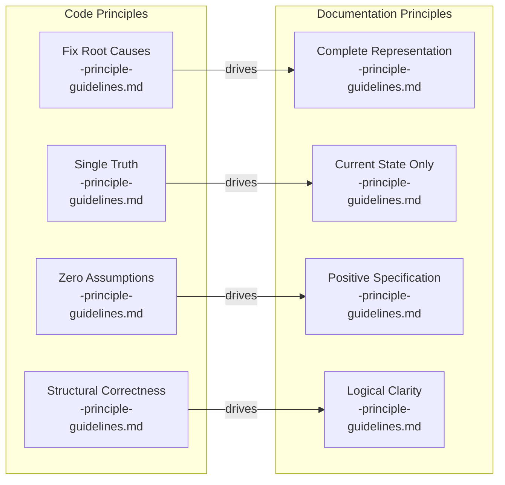

### II. Principle Implementation

#### 1. FIX ROOT CAUSES, NOT SYMPTOMS
- **Code**: Structure systems so errors are impossible, not defended against
- **Documentation**: Document fundamental constraints, not workarounds or defensive patterns
- **Example**: Document "Chrome divides contexts for security" not "check window exists"

#### 2. SINGLE SOURCE OF TRUTH
- **Code**: Each data point has one authoritative source
- **Documentation**: Each fact appears in exactly one location
- **Implementation**: WHAT shows structure once, HOW details once, WHY explains once

#### 3. ZERO ASSUMPTIONS
- **Code**: Verify all data structures, timing, and dependencies
- **Documentation**: Verify all elements against actual implementation with file references
- **Requirement**: Every diagram node must have function and file reference

#### 4. STRUCTURAL CORRECTNESS
- **Code**: Build systems that work by design, not by defensive programming
- **Documentation**: Show correct implementation, don't guess at problems or edge cases
- **Focus**: Document how it works, not how it might break

#### 5. COMPLETE REPRESENTATION
- **Code**: Handle all execution paths explicitly
- **Documentation**: Show all logical operations in the flow or structure
- **Coverage**: Every significant component must appear in documentation

#### 6. CURRENT STATE ONLY
- **Code**: No backward compatibility that preserves broken patterns
- **Documentation**: No history, future plans, or deprecated information
- **Forbidden**: "Will be", "Used to", "Planning to", version numbers

#### 7. POSITIVE SPECIFICATION
- **Code**: Define what the system does, not what it doesn't do
- **Documentation**: Specify what IS, not what ISN'T
- **Avoid**: Defensive clarifications, "does not support", negative statements

#### 8. LOGICAL CLARITY OVER IMPLEMENTATION DETAIL
- **Code**: Group related operations into logical units
- **Documentation**: Show logical operations, not every function call
- **Pattern**: Show patterns once, not every instance

### III. Principles Prevent Documentation Decay

These principles aren't arbitrary rules - they address specific ways documentation fails over time. Without fixing root causes, documentation accumulates workarounds that obscure the actual design. Without single source of truth, updates create inconsistencies that erode trust. Without zero assumptions, documentation drifts from implementation reality.

The principles work together: fixing root causes naturally leads to structural correctness, which enables logical clarity. Single source of truth combined with current state only prevents the accumulation of historical cruft. Zero assumptions paired with complete representation ensures documentation matches reality.

Most importantly, these principles make documentation maintainable. When code changes, it's clear what documentation needs updating (single source), how to update it (current state), and how to verify it's correct (zero assumptions).

## 3. Section Structure Requirements

Every documentation section must follow a standard format with introductions and three distinct layers.

### I. Standard Section Format

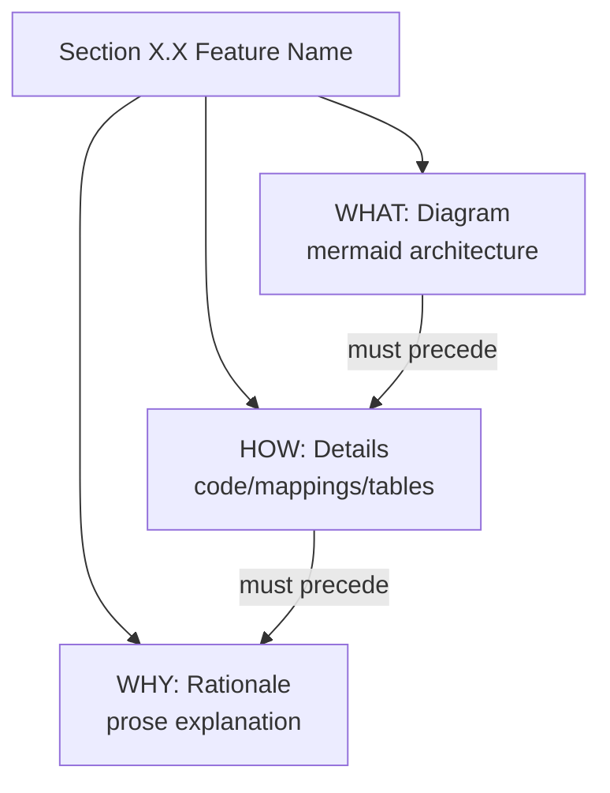

### II. Section Implementation

Every section MUST follow this structure:

```markdown
### X.X Feature Name

[1-2 sentences explaining what this section covers and optionally why it matters]

#### WHAT: [Descriptive Title]
```mermaid
[Architecture diagram showing logical structure]
[Every node must include: descriptor<br/>-functionName-<br/>file.js]
```

#### HOW: [Implementation Details]
```javascript
// Code examples showing implementation
// Mapping tables for diagram elements
// Constants and specific values
```

#### WHY: [Design Rationale]
[2-4 paragraphs explaining in accessible prose:]
[- What constraints drove this design]
[- How this serves user needs]
[- Why alternatives weren't suitable]
```

#### Introduction Requirements

**Document-level introduction** (at the very top):
1. First sentence: What system/feature this documents and its primary purpose
2. Second sentence: The key problem it solves or constraint it addresses
3. Brief outline: Major sections in bullet points

**Section-level introduction** (after each section heading):
1. One sentence: What this section demonstrates or explains
2. Optional second sentence: Why this is important (only if not obvious)

### III. Rigid Structure Enables Verification

The three-layer structure isn't just organization - it's a verification framework. By requiring every feature to have all three layers, we make incompleteness obvious. Missing HOW sections reveal undocumented implementation details. Missing WHY sections expose unexplained decisions.

The rigid ordering (WHAT→HOW→WHY) matches how developers approach understanding: first see the structure, then understand the details, finally grasp the reasoning. This order also makes verification systematic - you can't claim to explain WHY if you haven't shown WHAT and HOW.

Most importantly, this structure makes it impossible to hide missing documentation. You can't gloss over a missing WHY section or pretend implementation details don't matter when there's an empty HOW section staring at you.

## 4. WHAT Layer Guidelines

The WHAT layer uses diagrams to show system architecture and logical structure without implementation details.

### I. Diagram Requirements

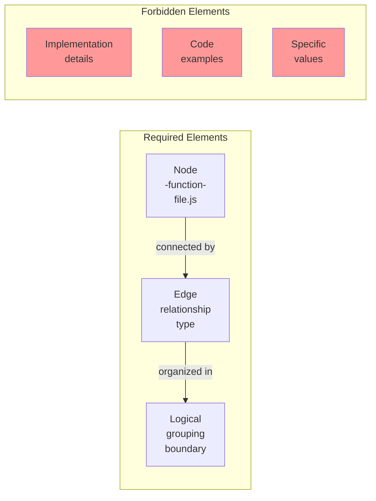

**What "code" means here**: Function and file names (like `-validateUser-` and `auth.js`) are required for verification. Actual code snippets, implementation logic, or code examples are forbidden.

### II. Diagram Syntax

#### Node Format Requirements
```
[Descriptor<br/>-functionName-<br/>file.js]
```
- **Descriptor**: What the component does logically
- **functionName**: Actual function/class name for verification
- **file.js**: Actual file location (no path, no line numbers)

**Important**: Never include line numbers. They change frequently and create maintenance burden.

#### Function and File Usage by Layer
| Layer | Function Names | File Names | Format |
|-------|---------------|------------|--------|
| **WHAT** | Required in nodes | Required in nodes | `[Description<br/>-functionName-<br/>file.js]` |
| **HOW** | In code examples | With examples | Standard code format |
| **WHY** | Never | Never | Plain prose only |

#### Edge Format by Diagram Type
- **Flow/Graph**: `-->|methodName()|` or `-->|data flow|`
- **Sequence**: `->>` (sync) or `-->>` (async)
- **State**: `-->|trigger[guard]/action|`

#### Grouping Patterns
```mermaid
subgraph "Logical Group Name"
    Component1[...]
    Component2[...]
end
```

### III. Diagrams Show Architecture, Not Implementation

Diagrams must resist the temptation to show everything. Their power comes from abstraction - showing the forest, not every tree. When diagrams include implementation details, they become unreadable and unmaintainable.

Function and file names appear in WHAT diagrams for verification only - they prove the diagram matches reality. The actual implementation code belongs in the HOW layer, never in WHAT. This separation keeps architectural views clean while preserving all necessary details in their proper place.

The function and file references serve verification, not implementation documentation. They prove the diagram matches reality without cluttering it with details. A diagram that shows `validateUser()` calling `checkPermissions()` is useful; one that shows every validation step is not.

Logical grouping makes complex systems comprehensible. By grouping related components, diagrams reveal system organization that's invisible in code. This architectural view is what makes diagrams valuable - it's the perspective code can't provide.

## 5. HOW Layer Guidelines

The HOW layer captures all implementation details removed from WHAT diagrams, ensuring nothing is lost.

### I. Implementation Detail Types

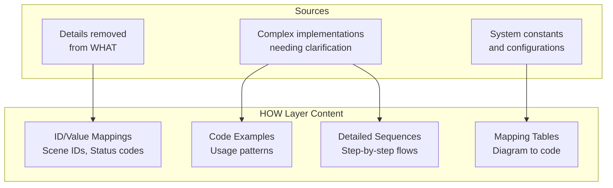

### II. Implementation Patterns

**What "code" means here**: This is where actual code examples, implementations, and detailed logic belong. Show real JavaScript, configuration values, SQL queries, etc.

#### Mapping Tables
```markdown
| Diagram Element | Implementation | File Location |
|----------------|----------------|---------------|
| Router | handleMessage() | widget-router.js |
| Storage Sync | chrome.storage.sync | Multiple files |
```

#### Code Constants
```javascript
// Scene ID mapping (from mockup-update-handler.js)
const SCENE_ID_MAP = {
    '102752': 'Front',  // Main product view
    '102753': 'Right',  // Side angle
    '102754': 'Back',   // Reverse view
    '102755': 'Left'    // Other side
};

// Timer values (from widget-tabs-actions.js)
const MESSAGE_DIM_TIMEOUT = 5000;  // 5 seconds to dim
const OPERATION_COMPLETE_DELAY = 2000;  // 2 seconds before hiding
```

#### Detailed Sequences
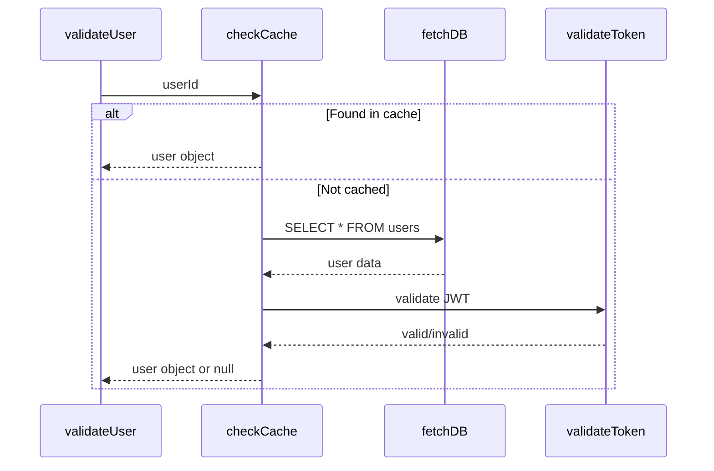

### III. HOW Layer Preserves Essential Details

When we abstract architecture for clarity, we risk losing critical implementation details. The HOW layer ensures nothing is lost - it's just organized better. Every magic number, every ID mapping, every complex sequence has a home.

This layer serves developers debugging production issues. When the system breaks at 3 AM, developers need those scene IDs, timer values, and exact sequences. The HOW layer provides these details without cluttering architectural understanding.

Most importantly, the HOW layer makes the WHAT layer possible. By providing a proper home for implementation details, we give developers permission to omit them from architectural diagrams. This separation is what makes documentation both complete and comprehensible.

## 6. WHY Layer Guidelines

The WHY layer explains design decisions in accessible prose that all stakeholders can understand.

### I. WHY Layer Components

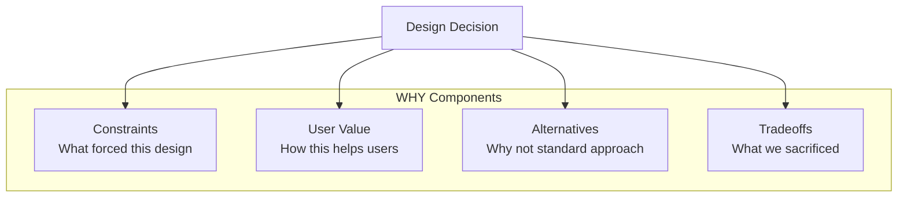

### II. Writing Effective WHY Sections

#### Structure Template
```markdown
#### WHY: [Decision Summary]

[Paragraph 1: Constraint explanation]
The system uses [design] because [constraint]. [Explain the limitation that 
forced this choice in plain English].

[Paragraph 2: User value]
This approach provides [benefit] by [mechanism]. Users experience [outcome]
which solves their problem of [original issue].

[Optional Paragraph 3: Alternatives considered]
The standard approach of [alternative] doesn't work here because [reason].
[Other alternative] would [problem it would cause].
```

#### Good vs Bad Examples

**BAD** (too technical):
```
The system uses chrome.runtime.sendMessage() for IPC because content scripts 
have restricted API access as per Manifest V3 specifications.
```

**GOOD** (accessible):
```
Browser extensions run in isolated sandboxes for security - your banking 
extension can't read your email tabs. This isolation forces all communication 
through Chrome's messaging system, creating an audit trail of what extensions 
do with your data.
```

### III. Prose Makes Documentation Accessible

Technical documentation often forgets its human readers. The WHY layer restores humanity to documentation by explaining decisions in terms anyone can understand. This isn't dumbing down - it's opening up.

No code or function names should appear in WHY sections. Not because they're forbidden, but because they're unnecessary - the WHY layer explains rationale, not implementation. Technical details would only obscure the human reasoning that makes decisions understandable to all stakeholders.

When documentation explains that "Printify blocks our extension to prevent automation," everyone understands the constraint. When it says "chrome.runtime is null," only developers understand, and even they don't know why it matters.

Accessible explanations build team alignment. When product managers understand technical constraints, they make better feature decisions. When developers understand business rationale, they make better implementation decisions. The WHY layer creates this shared understanding.

## 7. Verification Framework

This framework provides systematic methods to ensure documentation remains accurate and complete.

### I. Verification Structure

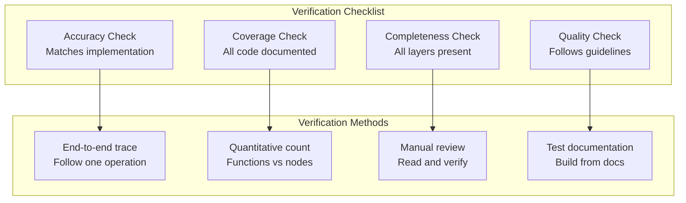

### II. Verification Protocol

#### Coverage Verification
```bash
# 1. List all exported functions
grep -n "export\|module.exports" src/**/*.js

# 2. Check each appears in documentation
for each function:
  - Find in WHAT diagram OR
  - Explain why omitted (internal helper, deprecated, etc.)

# 3. Count verification
Exported functions: 47
Documented in WHAT: 42
Explained omissions: 5
Coverage: 100%
```

#### Accuracy Verification
```markdown
1. Pick a user action (e.g., "Update mockups")
2. Trace through documentation:
   - WHAT: Find in message flow diagram
   - HOW: Check handler implementation
   - WHY: Understand design rationale
3. Trace through code:
   - Verify functions match diagram
   - Verify details match HOW
   - Verify constraints match WHY
4. Document any mismatches
```

#### Completeness Verification
For each major feature:
- [ ] WHAT diagram exists
- [ ] HOW details provided
- [ ] WHY explanation present
- [ ] All three reference same functionality
- [ ] No orphaned sections

### III. Verification Prevents Documentation Decay

Documentation has a half-life measured in weeks. Without active verification, it decays into fiction that misleads more than it helps. The verification framework fights this entropy through systematic checking.

Quantitative checks (counting functions) make it impossible to casually claim "everything is documented." You must actually count and compare. Qualitative checks (tracing operations) ensure the documentation tells the truth about how the system actually works.

Most importantly, the three-layer structure makes verification possible. When implementation details are scattered throughout prose, verification is subjective. When they're organized into layers, verification becomes objective: Is there a HOW section? Does it contain the removed details? Simple questions with clear answers.

## 8. Common Patterns and Anti-Patterns

Recognizing patterns and anti-patterns helps maintain documentation quality and consistency.

### I. Pattern Recognition

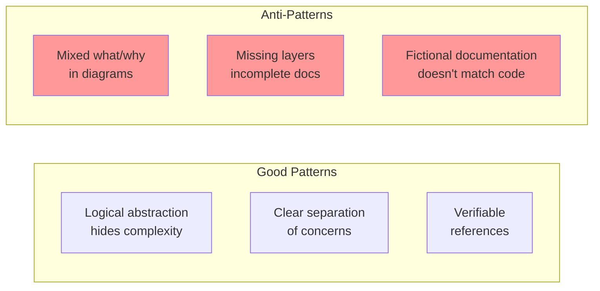

### II. Pattern Examples

#### Good Pattern: Logical Grouping
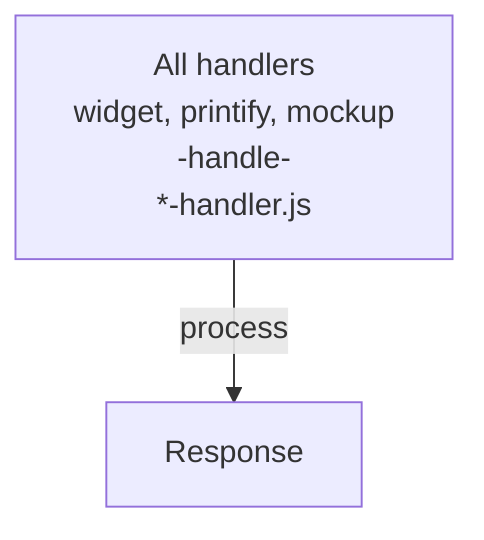
Instead of showing 5 identical handler flows

#### Anti-Pattern: Implementation in WHAT
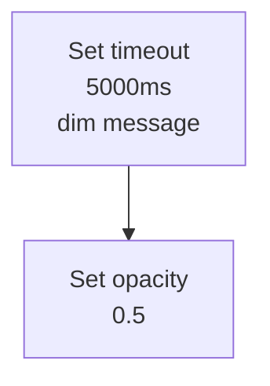

#### Good Pattern: Complete Layers
```markdown
### Message Routing

#### WHAT: [diagram]
#### HOW: Router uses Map<string, Handler> for O(1) lookup
#### WHY: Chrome forces central routing through service worker...
```

#### Anti-Pattern: Orphaned WHY
```markdown
### Why We Use Chrome Storage

Chrome storage syncs across devices... [no WHAT or HOW above]
```

### III. Patterns Guide Future Documentation

Patterns aren't rules - they're wisdom distilled from experience. They show what works and what doesn't, helping future documeters avoid known pitfalls. Anti-patterns are especially valuable because they show attractive approaches that lead to maintenance nightmares.

The most common anti-pattern is mixing layers. It's tempting to explain why in a diagram note or show implementation details in architectural views. This mixing seems efficient but destroys the value of both layers - architectural diagrams become cluttered and rationale gets lost in visual noise.

Good patterns reinforce the framework's benefits. Logical grouping shows how abstraction makes complex systems understandable. Complete layers demonstrate how separation of concerns serves different audiences. These patterns become templates for future documentation.

## 9. Maintenance Guidelines

Documentation requires regular updates to remain valuable - these guidelines define when and how to maintain it.

### I. Maintenance Triggers

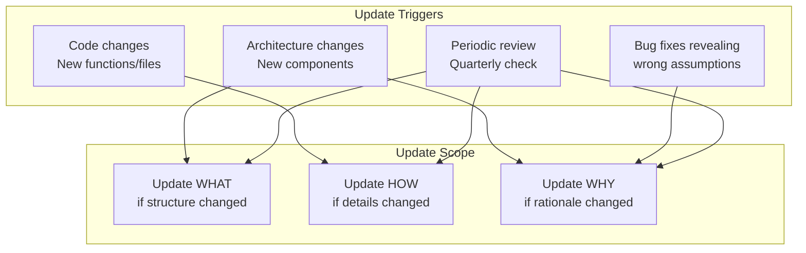

### II. Update Process

1. **Identify changed files**
   ```bash
   git diff --name-only main..feature-branch | grep -E '\.(js|ts)'
   ```

2. **Check documentation impact**
   - Exported functions added/removed → Update WHAT
   - Constants/IDs changed → Update HOW  
   - Design decisions changed → Update WHY

3. **Update affected layers**
   ```markdown
   ### Before committing code:
   - [ ] WHAT diagrams reflect new structure
   - [ ] HOW sections contain new details
   - [ ] WHY sections explain new decisions
   - [ ] Cross-references updated
   - [ ] No orphaned documentation
   ```

4. **Verify updates**
   - Run verification protocol on changed sections
   - Trace one operation through all changes
   - Review with someone unfamiliar with changes

### III. Maintenance Keeps Documentation Alive

Documentation maintenance is like tending a garden - ignore it and weeds take over. The three-layer framework makes maintenance manageable by localizing changes. When implementation details change, usually only the HOW layer needs updates. When architecture changes, WHAT and WHY need attention but HOW might stay the same.

The framework also makes maintenance predictable. Developers know where to document new constants (HOW), where to add new components (WHAT), and where to explain new constraints (WHY). This predictability reduces the friction of keeping documentation current.

Most importantly, the verification framework makes maintenance verifiable. You can prove documentation is current by running the verification protocol. This proof builds trust - developers will use documentation they trust and maintain documentation they use.

## 10. Quick Reference

Essential checklists and templates for creating compliant three-layer documentation.

### I. Essential Checklists

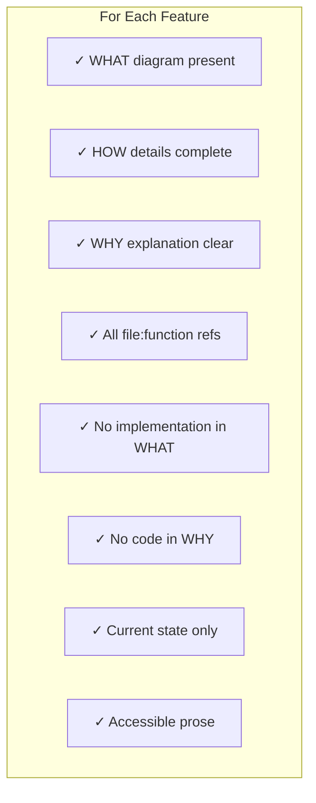

### II. Quick Templates

#### Section Template
```markdown
### X.X Feature Name

[1-2 sentences explaining what this section covers]

#### WHAT: Logical Architecture
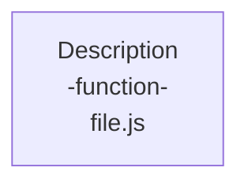

#### HOW: Implementation Details
```javascript
// Constants, mappings, specific values
```

#### WHY: Design Rationale
[Constraints that drove design]
[User value provided]
[Alternatives considered]
```

#### Verification Template
```markdown
- [ ] All exported functions appear in WHAT or explained
- [ ] All removed details appear in HOW  
- [ ] All design decisions explained in WHY
- [ ] One operation traced through all layers
- [ ] No mixed concerns between layers
```

### III. Quick Reference Enables Consistent Documentation

The curse of documentation standards is that nobody follows them. They're too long to remember, too complex to follow, hidden in some wiki. The quick reference fights this by providing the essential patterns at a glance.

Templates aren't just conveniences - they're quality controls. When every section follows the same template, reviewers know what to look for. When verification follows a checklist, nothing gets missed. Consistency makes documentation predictable, and predictable documentation gets used.

This quick reference is itself an example of the three-layer framework: WHAT shows the checklist structure, HOW provides the templates, and WHY explains their value. The framework is recursive - it documents itself using itself, proving its own utility.