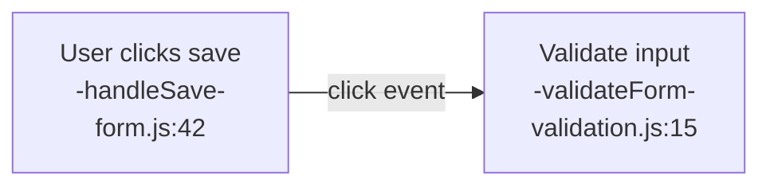
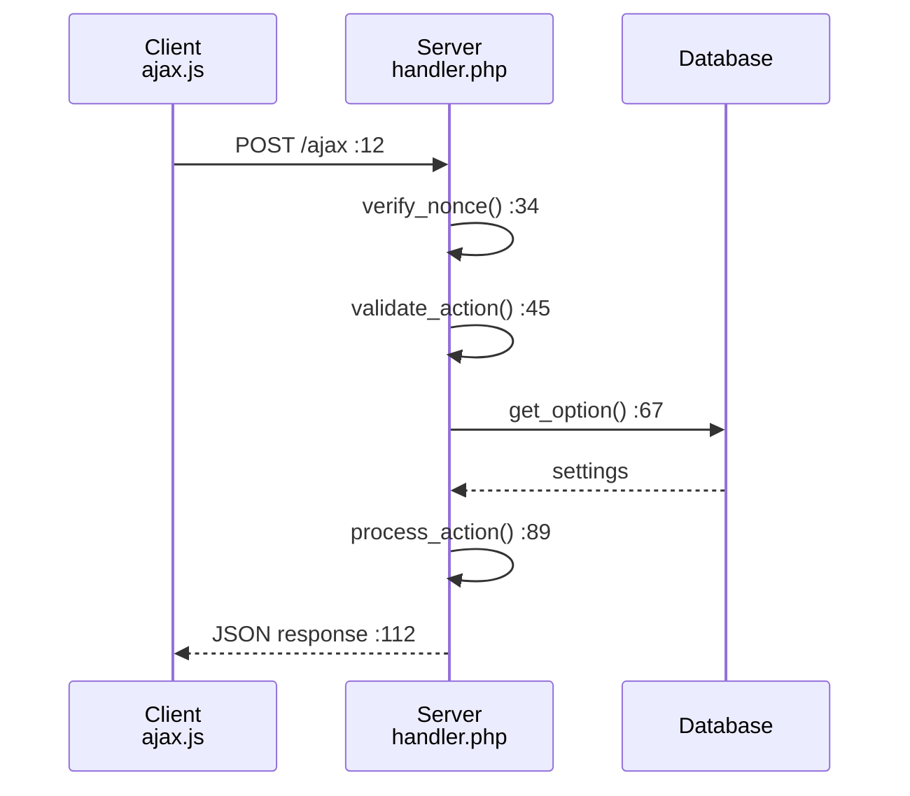
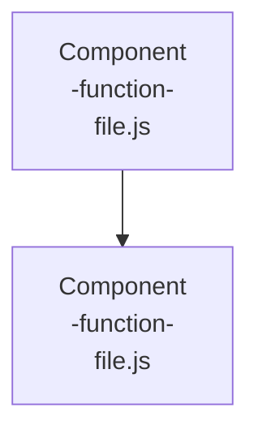
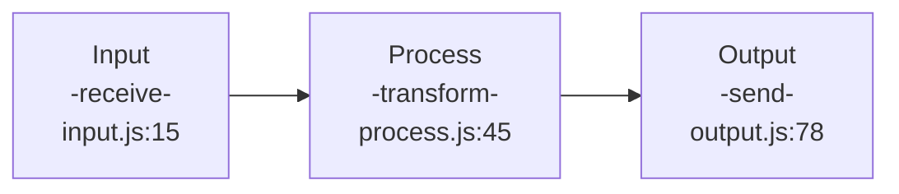

# SiP Documentation Guidelines

## Foundational Principles

These principles drive both code creation AND documentation creation:

### 1. FIX ROOT CAUSES, NOT SYMPTOMS
**Code**: Structure systems so errors are impossible, not defended against  
**Documentation**: Document fundamental constraints, not workarounds or defensive patterns

### 2. SINGLE SOURCE OF TRUTH  
**Code**: Each data point has one authoritative source  
**Documentation**: Each fact appears in exactly one location

### 3. ZERO ASSUMPTIONS
**Code**: Verify all data structures, timing, and dependencies  
**Documentation**: Verify all elements against actual implementation with file:line references

### 4. STRUCTURAL CORRECTNESS
**Code**: Build systems that work by design, not by defensive programming  
**Documentation**: Show correct implementation, don't guess at problems or edge cases

### 5. COMPLETE REPRESENTATION
**Code**: Handle all execution paths explicitly  
**Documentation**: Show all significant elements in the flow or structure

### 6. CURRENT STATE ONLY
**Code**: No backward compatibility that preserves broken patterns  
**Documentation**: No history, future plans, or deprecated information

### 7. POSITIVE SPECIFICATION
**Code**: Define what the system does, not what it doesn't do
**Documentation**: Specify what IS, not what ISN'T (no defensive clarifications)

## Documentation Philosophy

Documentation consists of two complementary parts that follow these principles:

1. **Diagrams**: Show WHAT exists (structure, flow, relationships) - COMPLETE and VERIFIED
2. **Text**: Explain WHY it exists (constraints, principles, rationale) - ROOT CAUSES only

This separation ensures clarity and prevents redundancy.

## Documentation Rules

### 1. SEPARATION OF CONCERNS
**Rule**: Diagrams show structure; text explains rationale.

**Implementation**:


**Text**:
The form validation occurs client-side before submission because:
- Immediate user feedback reduces server load
- Security validation still occurs server-side (never trust client)
- Form complexity requires staged validation

### 2. NO ASSUMPTIONS - VERIFY EVERYTHING
**Rule**: Every element must be verifiable against actual code.

**For Diagrams**:
- Include file:line references for every function
- Verify all connections by tracing actual code
- Use exact function/method names from implementation

**For Text**:
- Reference specific constraints that drove decisions
- Link to actual code examples
- Verify rationale is still current

### 3. NO FUTURE OR HISTORY
**Rule**: Document current state only.

**Exclude**:
- Version numbers, changelogs, release notes
- "Will be refactored to..."
- "Previously this used..."
- "Planning to add..."

**Include**:
- "Uses batch processing because..."
- "Validates input to prevent..."
- "Caches results to reduce..."

### 4. SINGLE SOURCE OF TRUTH
**Rule**: Each fact appears in exactly one location.

**Implementation**:
- Core concepts defined once, referenced elsewhere
- Use anchors: `[See Debug Levels](#debug-levels)`
- Diagrams show structure once, text explains once
- Never duplicate between diagram and text

### 5. ROOT CAUSE DOCUMENTATION
**Rule**: Document the fundamental reason, not the symptom. When code contains workarounds, document them accurately as issues needing correction.

**For Proper Implementation**:
```markdown
User authentication occurs during the 'init' hook at priority 5 because:
- WordPress core user functions are available after priority 0
- Our user enhancement must run before template rendering at priority 10
- This eliminates any race condition with user availability
```

**For Existing Workarounds** (document honestly, mark for correction):
```markdown
### Grid Selection Workaround [NEEDS FIX]
The code currently selects only the first grid because:
- Printify renders 6-9 identical grids but only Grid 0 contains interactive checkboxes
- Root cause unknown - requires investigation of Printify's rendering logic
- This workaround prevents errors but should be replaced with proper grid identification

Current implementation:
```javascript
const allGrids = document.querySelectorAll('[data-testid="mockupItemsGrid"]');
const visibleGrid = allGrids[0]; // WORKAROUND: Only first grid has checkboxes
```
```

**Key**: Symptoms in code should be documented as problems to fix, not hidden or justified.

## Diagram Guidelines (The WHAT)

### Purpose
Show structure, flow, and relationships WITHOUT explaining why.

### Requirements

#### 1. Complete Representation
Every significant element must be shown:
- All functions in the execution path
- All data stores and state
- All external interfaces
- All decision points

#### 2. Verifiable References
Every code element must include:
```
[Language does action<br/>-functionName-<br/>file.ext]
```
Function name and file location enable verification without line-number maintenance burden.

#### 3. Exact Naming
- Use actual function/method names from code
- Use actual file paths
- Use actual storage keys and table names

#### 4. Connection Accuracy
Every arrow must represent an actual code connection:
- Verified function calls
- Traced execution paths
- Actual event triggers
- Real data flow

### Diagram Syntax Reference

#### Node Types
1. **Actor/User**: `[User does action]`
2. **Code/Function**: `[JS validates input<br/>-validateForm-<br/>form.js]`
3. **Storage**: `[(MySQL Database<br/>-users table-)]` (cylinder for persistent)
4. **State**: `[Form State<br/>-formData-]` (rectangle for runtime)

#### Connection Types by Diagram

**Flow/Graph**:
- Function calls: `-->|methodName()|`
- Data flow: `-->|userData|`
- Events: `-->|click|`
- Conditions: `-->|[valid]|`

**Sequence**:
- Synchronous: `->>` with method name
- Asynchronous: `-->>` with method name
- Return: `-->>` with return value
- Participants: `participant Service<br/>file.js`

**State**:
- Transitions: `-->|trigger[guard]/action|`
- Initial: `[*] --> FirstState`
- Final: `LastState --> [*]`

**Component**:
- Dependencies: `-.->|<<use>>|`
- Interfaces: `--()` provided, `--(` required

**Class**:
- Inheritance: `--|>` (extends)
- Implementation: `..|>` (implements)
- Composition: `--*`
- Aggregation: `--o`

#### Special Arrows
- Dotted `-.->`: Loose coupling/async
- Thick `==>`: Primary flow
- Double `<-->`: Bidirectional

### What Diagrams Must NOT Include

**Principle Violations**:
1. **WHY explanations** (violates SEPARATION OF CONCERNS)
2. **Historical/future information** (violates CURRENT STATE ONLY)  
3. **Defensive patterns or workarounds** (violates STRUCTURAL CORRECTNESS)
4. **Assumptions or probabilities** (violates ZERO ASSUMPTIONS)
5. **Troubleshooting flows** (violates FIX ROOT CAUSES)

### Mermaid Technical Constraints
- No parentheses `()` in labels (breaks parsing)
- No quotes inside node labels
- Use `<br/>` for line breaks
- Escape special characters

## Text Documentation Guidelines (The WHY)

### Purpose
Explain the reasoning behind what diagrams show.

### Requirements

#### 1. Architectural Rationale
Every design decision must include:
- Business constraints that drove the decision
- Technical limitations that required this approach
- Performance considerations that influenced design
- Security requirements that shaped implementation

#### 2. Root Cause Explanations
Document fundamental reasons:
```markdown
### Why Hybrid Table Architecture

The Creation Table combines DataTables with custom row injection because:

1. **Parent-Child Relationships**: DataTables cannot dynamically group rows by 
   blueprint/product hierarchy - it treats all rows as independent

2. **Summary Row Requirements**: Business needs aggregate data rows that:
   - Show combined metrics for all children
   - Cannot be selected or sorted as normal rows
   - Must update dynamically as children change

3. **Performance Constraints**: Loading 1000+ products requires virtualization
   that DataTables provides, but with our custom modifications
```

#### 3. Constraint Documentation
Explain limitations that affect implementation:
```markdown
### Chrome Extension Constraints

The extension operates under these browser-imposed limitations:

1. **Printify Blocks chrome.runtime**: Cannot use standard messaging on printify.com
   - Forces URL parameter communication for mockup updates
   - Prevents real-time status updates from content scripts
   
2. **CORS Restrictions**: Cannot fetch Printify API directly
   - Must inject scripts into page context
   - Requires postMessage for data extraction
```

### What Text Must NOT Include

**Principle Violations**:
1. **Repetition of diagram content** (violates SINGLE SOURCE OF TRUTH)
2. **Step-by-step instructions** (violates SEPARATION OF CONCERNS - diagrams show this)
3. **Code structure descriptions** (violates SEPARATION OF CONCERNS - diagrams show this)  
4. **Historical context or future plans** (violates CURRENT STATE ONLY)
5. **Troubleshooting guides** (violates STRUCTURAL CORRECTNESS - show correct implementation)
6. **Defensive explanations** (violates FIX ROOT CAUSES - document why proper structure prevents issues)

## How Diagrams and Text Work Together

### Example: Feature Documentation

```markdown
# AJAX Request Handling

## Request Flow


## Architecture Rationale

### Why Three-Level Action Routing
The AJAX system uses plugin → type → action routing because:

1. **Plugin Isolation**: Each plugin handles only its own actions, preventing 
   cross-plugin conflicts and enabling independent deployment

2. **Type Organization**: Grouping by type (template, product, order) allows:
   - Shared validation per type
   - Consistent response formats
   - Type-specific error handling

3. **Granular Permissions**: Action-level routing enables precise capability 
   checks without cluttering individual handlers
```

## Code Example Guidelines

### In Diagrams
- Show structure and connections
- Include file:line references
- Use exact function names

### In Text
- Show implementation patterns
- Maximum 20 lines per example
- Focus on specific concepts
- Include rationale comments

```javascript
// Configuration loads at priority 5 because WordPress user 
// functions are available after priority 0
add_action('init', function() {
    $config = loadConfiguration();  // Single source of truth
    validateConfig($config);        // Fail fast on invalid config
    storeConfig($config);          // Make available system-wide
}, 5);
```

## Verification Checklist

### Before Creating Documentation
- [ ] Read actual implementation code
- [ ] Trace execution paths completely
- [ ] Identify architectural constraints
- [ ] Understand root causes, not symptoms

### For Diagrams
- [ ] Every function has file reference
- [ ] All connections verified in code
- [ ] No WHY explanations included
- [ ] Shows actual structure, including existing workarounds marked as such

### For Text
- [ ] Explains WHY for each design decision
- [ ] Documents constraints that drove design
- [ ] No repetition of WHAT
- [ ] Root causes explained

### Final Review - Principle Compliance
- [ ] **ZERO ASSUMPTIONS**: Everything verified against code
- [ ] **SINGLE SOURCE OF TRUTH**: No duplication within or between documents
- [ ] **CURRENT STATE ONLY**: No history, future plans, or deprecated content
- [ ] **STRUCTURAL CORRECTNESS**: Shows proper implementation, not defensive patterns
- [ ] **COMPLETE REPRESENTATION**: All significant elements shown
- [ ] **FIX ROOT CAUSES**: Documents constraints and principles, not symptoms

## Documentation Templates

### Feature Documentation Template

```markdown
# Feature Name

## Overview
Brief description of what this feature does and why it exists.

## Architecture



### Why This Design
- **Architectural constraints**: Specific technical limitations that necessitated this approach
- **Business requirements**: Performance, security, or integration requirements that drove decisions  
- **System constraints**: Platform limitations or dependencies that shaped the structure

**NOT**: Historical decisions, future plans, or workaround explanations

## Usage

### Basic Example
```javascript
// Minimal working example with rationale comments
// Uses priority 5 because WordPress core loads at priority 0
const example = initFeature();
```

## Configuration
| Option | Type | Default | Description |
|--------|------|---------|-------------|
| option1 | string | 'value' | What it controls |

## API Reference
Document all public functions, events, and data structures.
```

### Module Documentation Template

```markdown
# Module Name

## Purpose
What architectural problem this module solves.

## Dependencies
- Required modules
- External libraries

## Module Structure



### Why This Structure
- **Separation rationale**: Specific constraints that required this separation
- **Performance constraints**: Measurable requirements that drove this design
- **Integration requirements**: System dependencies that necessitated this approach

**NOT**: Generic benefits, historical context, or defensive explanations

## Public API

### Functions
```javascript
/**
 * Function purpose and architectural role
 * @param {Type} param - Description
 * @returns {Type} Description
 */
function publicFunction(param) {}
```

### Events
- `module.event` - When fired, what data, and why

## Integration Examples
How to use with other modules (showing WHY the integration is needed).
```

## Maintenance

### When to Update
- **Immediately**: When changing architecture or flow
- **Before merging**: When rationale changes
- **During refactoring**: When structure changes

### Update Process
1. Update diagrams to reflect new structure
2. Update text to explain new rationale
3. Verify all file:line references
4. Remove any obsolete explanations
5. Ensure no duplication created