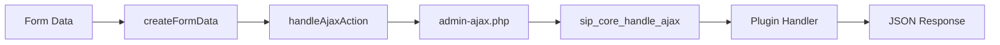
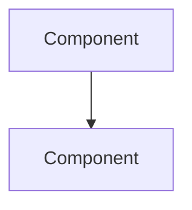
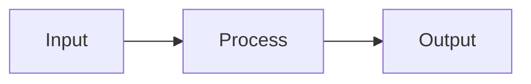

# SiP Plugin Suite Documentation Guidelines

## Overview

This document establishes the authoritative documentation standards for the SiP Plugin Suite. These guidelines ensure consistency, clarity, and usefulness across all technical documentation.

## The Ten Documentation Rules

### 1. NO FUTURE OR HISTORY
**Rule**: Document current state only. No roadmaps, predictions, or changelogs.

**Why**: Documentation should reflect what IS, not what was or might be. Future plans belong in issues or project management tools.

**❌ Bad Example**:
```markdown
## Upcoming Features
In version 2.0, we plan to add:
- Real-time synchronization
- Advanced filtering options

## Changelog
- v1.2: Added batch processing
- v1.1: Fixed performance issues
```

**✅ Good Example**:
```markdown
## Current Features
The system provides:
- Batch processing for multiple items
- Standard filtering by status and date
```

### 2. ARCHITECTURAL WHY
**Rule**: Explain design decisions, not just implementation details.

**Why**: Future developers need to understand the reasoning to make appropriate changes.

**❌ Bad Example**:
```markdown
The Creation Table uses a hybrid architecture combining DataTables with custom row injection.
```

**✅ Good Example**:
```markdown
The Creation Table uses a hybrid architecture because:
- DataTables cannot dynamically group rows by parent-child relationships
- We need to inject summary rows that aggregate child product data
- Standard DataTables selection must exclude these custom rows
```

### 3. EXAMPLES OVER EXPLANATIONS
**Rule**: Show working code examples instead of lengthy explanations.

**Why**: Developers learn faster from seeing patterns in action.

**❌ Bad Example**:
```markdown
To use the AJAX system, you need to create a FormData object with the appropriate parameters, including the plugin identifier, action type, and specific action. Then pass this to the handleAjaxAction function which will process the request and return a promise.
```

**✅ Good Example**:
```javascript
// Create and submit AJAX request
const formData = SiP.Core.utilities.createFormData('printify-manager', 'template', 'create');
formData.append('template_name', 'My Template');

SiP.Core.ajax.handleAjaxAction('printify-manager', 'template', formData)
    .then(response => console.log('Template created:', response))
    .catch(error => console.error('Failed:', error));
```

### 4. DIAGRAM BEFORE PROSE
**Rule**: Start with visual representations, then add textual details.

**Why**: Diagrams provide immediate understanding of relationships and flow.

**❌ Bad Example**:
```markdown
## AJAX Flow
The AJAX system works by first collecting form data, then sending it to the server through WordPress's admin-ajax.php endpoint. The server routes the request through our three-level action system...

[Diagram appears 3 paragraphs later]
```

**✅ Good Example**:
```markdown
## AJAX Flow



The three-level routing system ensures proper action delegation:
1. Core handler validates and routes to plugin
2. Plugin handler routes to action type
3. Action handler executes specific operation
```

### 5. CODE LIMITS
**Rule**: Keep code examples under 50 lines with clear focus.

**Why**: Large code blocks are hard to understand. Focused examples teach specific concepts.

**❌ Bad Example**:
```javascript
// 200+ line function showing everything
function initializeCompleteSystem() {
    // ... hundreds of lines mixing concerns ...
}
```

**✅ Good Example**:
```javascript
// Initialize DataTable (25 lines)
function initProductTable() {
    return $('#product-table').DataTable({
        ajax: {
            url: ajaxurl,
            type: 'POST',
            data: d => ({ 
                action: 'sip_products_ajax',
                products_action: 'load'
            })
        },
        columns: [
            { data: 'id' },
            { data: 'title' },
            { data: 'status' }
        ]
    });
}

// Handle row selection separately (15 lines)
function setupRowSelection(table) {
    table.on('select deselect', () => {
        const count = table.rows({selected: true}).count();
        $('.selection-count').text(count);
    });
}
```

### 6. SINGLE SOURCE OF TRUTH
**Rule**: Information appears in exactly one location.

**Why**: Prevents contradictions and simplifies updates.

**❌ Bad Example**:
```markdown
// In ajax.md
The AJAX system supports three debug levels: OFF, NORMAL, VERBOSE

// In debug.md  
Debug levels available: OFF, NORMAL, VERBOSE, TRACE
```

**✅ Good Example**:
```markdown
// In debug.md
Debug levels: OFF, NORMAL, VERBOSE
See [Debug Guide](./sip-development-testing-debug.md#debug-levels) for details.

// In ajax.md
For debug level configuration, see [Debug Guide](./sip-development-testing-debug.md#debug-levels).
```

### 7. STRUCTURED HIERARCHY
**Rule**: Organize content from general to specific with clear sections.

**Why**: Readers can quickly find information at the appropriate level of detail.

**✅ Good Structure**:
```markdown
# Component Name

## Overview
High-level purpose and context

## Architecture
### Design Decisions
Why this approach was chosen

### Component Diagram
Visual representation

## Usage
### Basic Example
Simple, common use case

### Advanced Patterns
Complex scenarios

## API Reference
### Functions
Detailed parameter documentation

### Events
Complete event listing
```

### 8. CONCISE HEADERS
**Rule**: Use brief, descriptive section titles.

**Why**: Headers should be scannable and immediately meaningful.

**❌ Bad Examples**:
```markdown
## A Comprehensive Overview of the System Architecture and Its Various Components
## How to Use This Feature in Your Daily Development Workflow
```

**✅ Good Examples**:
```markdown
## System Architecture
## Usage Examples
## API Reference
```

### 9. ACTIVE VOICE
**Rule**: Write in clear, direct language using active voice.

**Why**: Active voice is clearer and more engaging.

**❌ Bad Example**:
```markdown
The data is processed by the handler and then stored by the system.
Errors should be logged by developers when they are encountered.
```

**✅ Good Example**:
```markdown
The handler processes the data and stores it in the system.
Log errors immediately when you encounter them.
```

### 10. CONSISTENT TERMINOLOGY
**Rule**: Use the same terms throughout all documentation.

**Why**: Reduces cognitive load and prevents confusion.

**❌ Bad Example**:
```markdown
// Different documents using different terms:
- "component" vs "module" vs "feature"
- "plugin dashboard" vs "admin panel" vs "control interface"
```

**✅ Good Example**:
```markdown
// Established terminology used consistently:
- module: A JavaScript file providing functionality
- component: A reusable UI element
- dashboard: The main admin interface for a plugin
```

## Documentation Templates

### Feature Documentation Template
```markdown
# Feature Name

## Overview
Brief description of what this feature does and why it exists.

## Architecture



### Why This Design
- Rationale for key decisions
- Trade-offs considered

## Usage

### Basic Example
```javascript
// Minimal working example
```

### Common Patterns
```javascript
// Typical use cases
```

## Configuration
| Option | Type | Default | Description |
|--------|------|---------|-------------|
| option1 | string | 'value' | What it does |

## API Reference
Document all public functions, events, and data structures.

## Troubleshooting
Common issues and solutions.
```

### Module Documentation Template
```markdown
# Module Name

## Purpose
What problem this module solves.

## Dependencies
- Required modules
- External libraries

## Module Structure



## Public API

### Functions
```javascript
/**
 * Function purpose
 * @param {Type} param - Description
 * @returns {Type} Description
 */
function publicFunction(param) {}
```

### Events
- `module.event` - When fired and what data

## Integration Examples
How to use with other modules.
```

### How-To Guide Template
```markdown
# How to [Task]

## Prerequisites
- Required setup
- Knowledge needed

## Steps

### 1. First Step
```bash
command to run
```
Expected output:
```
output example
```

### 2. Second Step
```javascript
// Code to add
```

## Verification
How to confirm success.

## Common Issues
- Issue: Description
  - Solution: Steps to fix
```

## Writing Effective Documentation

### Before Writing
1. **Identify the audience**: Who needs this information?
2. **Define the scope**: What specific problem does this solve?
3. **Check existing docs**: Ensure no duplication

### While Writing
1. **Start with the diagram**: Visualize first
2. **Show, don't tell**: Use examples
3. **Focus each section**: One concept at a time
4. **Test your examples**: Ensure code works

### After Writing
1. **Review against rules**: Check all 10 guidelines
2. **Test documentation**: Can someone follow it?
3. **Update index.md**: Maintain navigation

## Common Anti-Patterns to Avoid

### 1. The Novel
Writing lengthy explanations when examples would suffice.

### 2. The Time Capsule
Including historical context or future plans.

### 3. The Mystery
Documenting what but not why.

### 4. The Encyclopedia
Trying to document everything in one file.

### 5. The Contradiction
Having different information in multiple places.

## Maintenance Guidelines

### When to Update Documentation
- **Immediately**: When changing public APIs
- **Before merging**: When adding new features
- **During refactoring**: When changing architecture

### Review Checklist
- [ ] Follows all 10 documentation rules
- [ ] Examples are tested and working
- [ ] No duplicate information exists
- [ ] Diagrams match current implementation
- [ ] Links to other docs are valid
- [ ] Terminology is consistent

## Quick Reference

| Rule | Key Point | Check |
|------|-----------|-------|
| 1. NO FUTURE OR HISTORY | Current state only | No "will" or "was" |
| 2. ARCHITECTURAL WHY | Explain decisions | Has rationale |
| 3. EXAMPLES OVER EXPLANATIONS | Show code | 80% examples |
| 4. DIAGRAM BEFORE PROSE | Visual first | Diagram at top |
| 5. CODE LIMITS | <50 lines | Focused examples |
| 6. SINGLE SOURCE OF TRUTH | No duplication | Info in one place |
| 7. STRUCTURED HIERARCHY | General to specific | Clear sections |
| 8. CONCISE HEADERS | Brief titles | Scannable |
| 9. ACTIVE VOICE | Direct language | Subject does verb |
| 10. CONSISTENT TERMINOLOGY | Same terms | Unified vocabulary |

---

For quick reference during development, see the [Process Cribsheet](../Claude_Process_Message_Cribsheet.txt).