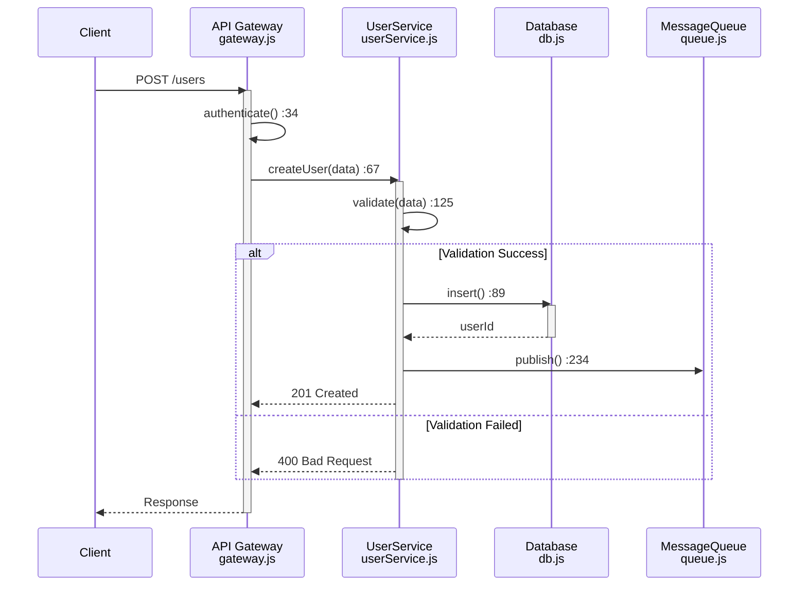
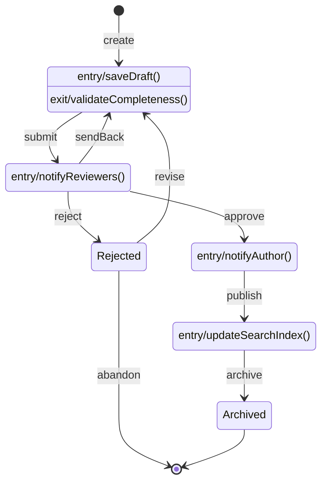
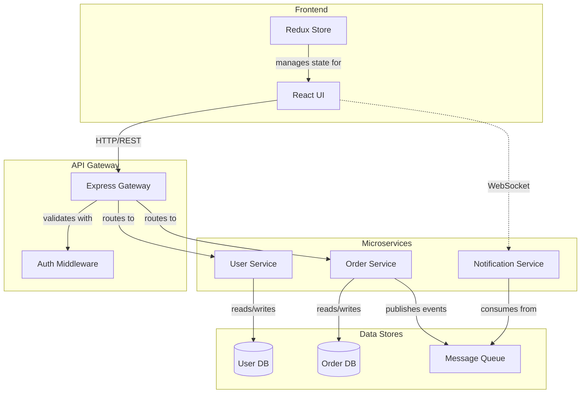

## Universal Mermaid Diagram Guidelines

**Note**: This document focuses on the structural aspects of diagrams (WHAT). For complete documentation guidelines including rationale (WHY), see [SiP Unified Documentation Guidelines](./sip-unified-documentation-guidelines.md).

### Table of Contents
1. [Core Principle: Complete System Representation](#core-principle-complete-system-representation)
2. [Choosing Your Diagram Type](#choosing-your-diagram-type)
3. [Universal Principles](#universal-principles-that-apply-to-all-diagrams)
4. [Box Types and Organization](#box-types-and-organization)
5. [Connection Labels by Diagram Type](#connection-labels-by-diagram-type)
6. [Universal Naming Conventions](#universal-naming-conventions)
7. [Universal Layout Guidelines](#universal-layout-guidelines)
8. [Diagram Type-Specific Guidelines](#diagram-type-specific-guidelines)
9. [Universal Completeness Checklist](#universal-completeness-checklist)
10. [Common Mistakes to Avoid](#common-mistakes-to-avoid)
11. [Example Patterns by Diagram Type](#example-patterns-by-diagram-type)

### Core Principle: Complete System Representation
**Every significant element relevant to your diagram's purpose must be shown.** This ensures the implementation can be validated against the documented architecture.

#### For Data Flow Diagrams:
- Functions that read, write, transform, or pass data
- Event handlers and callbacks
- AJAX request and response handlers
- Storage operations and data persistence

#### For Sequence Diagrams:
- All participants/actors in the interaction
- Message exchanges between participants
- Return values and responses
- Activation periods showing processing time

#### For State Diagrams:
- All states and substates
- Transitions between states
- Entry/exit actions
- Guards and conditions

#### For Component/Architecture Diagrams:
- Components and their interfaces
- Dependencies and relationships
- External systems and boundaries
- Data stores and resources

#### For Class Diagrams:
- Classes with attributes and methods
- Inheritance and implementation relationships
- Associations with multiplicity
- Interfaces and abstract classes

### Choosing Your Diagram Type

| Use Case | Diagram Type | When to Use |
|----------|--------------|-------------|
| Show how data moves through system | Flow/Graph | Data transformations, processing pipelines |
| Show time-ordered interactions | Sequence | API calls, user workflows, protocols |
| Show behavioral states | State | Object lifecycles, process states, UI states |
| Show static structure | Class | OOP design, domain models |
| Show system architecture | Component | High-level structure, deployment |
| Show data relationships | ER | Database schema, domain entities |

### Universal Principles That Apply to ALL Diagrams

1. **Completeness**: Show all relevant elements for your diagram's purpose
2. **Accuracy**: Names and relationships must match actual implementation
3. **Clarity**: Structure should be immediately understandable
4. **Verifiability**: Every element must be traceable to actual code with file:line references
5. **Consistency**: Use same notation and style throughout
6. **No Assumptions**: Every connection must be verified in actual code
7. **Structure Only**: Show WHAT exists, never WHY (that belongs in text documentation)

### Box Types and Organization

#### System Containers
- **Top-level subgraphs**: Represent major systems or boundaries
- Use quotes around labels to prevent parsing issues
- Keep labels concise to avoid wrapping

#### Universal Node Types

1. **Actor/User Nodes**: External entities interacting with system
   - Format varies by diagram type
   - Flow/State: `[User does action]`
   - Sequence: `participant User`
   - Component: `[External System]`

2. **Code/Function Nodes**: Implementation details with verification
   - **For Flow/Graph/State diagrams**:
     - Format: `[Language does action<br/>-functionName-<br/>file.ext:line]`
     - MUST include file path and line number
     - Examples: 
       - `[JS handles click<br/>-handleEvent-<br/>events.js:156]`
       - `[PHP validates data<br/>-validateInput-<br/>validation.php:42]`
   - **For Sequence diagrams**:
     - Format: `participant ServiceName<br/>file.ext`
     - Method calls on arrows must include line numbers: `->|methodName() :89|`
   - **For Class diagrams**:
     - Standard UML notation with file references
     - Class name must include file location

3. **Storage/State Nodes**: Data persistence and state
   - **Persistent Storage**: `[(Storage Type<br/>-identifier-)]` (cylinder shape)
   - **Runtime State**: `[State/Variable<br/>-name-]` (rectangle)
   - **State Diagrams**: Simple state names in rectangles

### Connection Labels by Diagram Type

#### Flow/Graph Diagrams
- Function calls: `-->|method/function name|`
- Data flow: `-->|data type/description|`
- Events: `-->|event name|`
- Conditions: `-->|[condition]|`

#### Sequence Diagrams
- Synchronous call: `->>` with message label
- Asynchronous call: `-->>` with message label
- Return/Response: `-->>` with return value
- Self-call: `participant->>participant: message`

#### State Diagrams
- Transitions: `-->|trigger[guard]/action|`
- Initial state: `[*] --> FirstState`
- Final state: `LastState --> [*]`

#### Component Diagrams
- Dependencies: `-.->|<<use>>|`
- Interfaces: `--()` provided, `--(` required
- Associations: `--|` with labels

#### Class Diagrams
- Inheritance: `--|>` (extends)
- Implementation: `..|>` (implements)
- Association: `--` with multiplicity
- Composition: `--*`
- Aggregation: `--o`

#### Special Connection Types (All Diagrams)
- Dotted line `-.->` for loose coupling/optional/async
- Thick arrow `==>` for important/primary flow
- Double arrow `<-->` for bidirectional

### Universal Naming Conventions

1. **Match Your Code**: Use actual names from implementation
2. **Be Specific**: Include enough context to be unambiguous
3. **Language Indicators**: Prefix with language where relevant (JS, PHP, etc.)
4. **Follow Standards**: Use established notation for your diagram type
5. **Avoid Breaking Characters**:
   - No parentheses `()` in labels (breaks Mermaid parsing)
   - No quotes inside node labels
   - Escape special characters when needed
   - Use `<br/>` for line breaks in nodes

### Universal Layout Guidelines

#### Flow Direction
- **Data/Control Flow**: Left-to-right (LR) or top-to-bottom (TD)
- **Sequence**: Top-to-bottom with time flowing downward
- **State**: Arrange by logical flow or state complexity
- **Component**: Hierarchical or layered arrangement
- **Class**: Group by package/module or relationships

#### Organization Principles
1. **Group Related Elements**: Use subgraphs for logical boundaries
2. **Consistent Spacing**: Maintain uniform gaps between elements
3. **Minimize Crossings**: Arrange to reduce line intersections
4. **Progressive Detail**: High-level overview → detailed views
5. **Visual Hierarchy**: Important elements more prominent

### Diagram Type-Specific Guidelines

#### Sequence Diagrams
- Declare all participants at the top
- Show activation boxes for processing time
- Use loop/alt/opt blocks for control flow
- Include return messages for completeness
- Number messages if order is critical

#### State Diagrams
- Name states as nouns/noun phrases (e.g., "Processing", "Awaiting Input")
- Name events as verbs/triggers (e.g., "submit", "timeout")
- Show initial `[*]` and final `[*]` states
- Use composite states for managing complexity
- Include entry/exit actions where significant

#### Class Diagrams
- Follow UML visibility: `+` public, `-` private, `#` protected, `~` package
- List attributes before methods
- Show parameter types and return types
- Include interfaces with `<<interface>>` stereotype
- Mark abstract classes/methods appropriately

#### Component Diagrams
- Show clear boundaries between systems
- Label interfaces with protocols/contracts
- Include external dependencies
- Show data flow direction
- Group related components visually

### What Diagrams Must NOT Include

1. **No WHY Explanations**: Rationale belongs in text documentation
   - Wrong: `-->|validates to prevent XSS|`
   - Right: `-->|validateInput()|`

2. **No Future or History**: Current implementation only
   - Wrong: `[Legacy Handler<br/>DEPRECATED]`
   - Right: `[Request Handler<br/>-handle-<br/>handler.php:45]`

3. **No Defensive Patterns**: Show proper structure, not workarounds
   - Wrong: Showing try-catch flows or existence checks
   - Right: Show the correct initialization order

4. **No Assumptions**: Only verified connections
   - Wrong: `-.->|probably calls|`
   - Right: `-->|dispatch() :67|`

5. **No Troubleshooting**: Structure only, not debugging flows

### Universal Completeness Checklist

#### Before Creating Any Diagram
- [ ] **Code Verified**: Read actual implementation files first
- [ ] **Execution Traced**: Followed code paths without assumptions
- [ ] **References Collected**: Noted all file:line locations
- [ ] **Purpose Defined**: Clear understanding of what structure to show
- [ ] **Type Selected**: Appropriate diagram type for the purpose
- [ ] **Scope Bounded**: Clear boundaries of what to include/exclude

#### While Creating
- [ ] **All Elements Present**: Every relevant [function/state/class/component] shown
- [ ] **Relationships Accurate**: Connections reflect actual behavior
- [ ] **Labels Clear**: Self-explanatory without additional context
- [ ] **Flow Logical**: Natural reading order maintained

#### After Creating
- [ ] **Validates Against Code**: Can trace diagram elements to implementation
- [ ] **Edge Cases Covered**: Error paths and exceptions shown
- [ ] **Notation Consistent**: Follows standards throughout
- [ ] **Standalone Understanding**: Comprehensible without narration

### Common Mistakes to Avoid

1. **Over-Abstraction**
   - Wrong: "System processes request"
   - Right: `[PHP processes request<br/>-handleRequest-<br/>handler.php:67]`

2. **Missing Error Paths**
   - Wrong: Only showing happy path
   - Right: Include error handling and edge cases

3. **Inconsistent Detail Level**
   - Wrong: Mix of high-level and implementation details
   - Right: Consistent abstraction level throughout

4. **Ambiguous Relationships**
   - Wrong: Unlabeled arrows
   - Right: Every connection clearly labeled

5. **Violating Diagram Semantics**
   - Wrong: Using sequence diagram for architecture
   - Right: Choose appropriate diagram type for purpose

6. **Missing Verification References**
   - Wrong: `[Handle Request<br/>-handleRequest-]`
   - Right: `[Handle Request<br/>-handleRequest-<br/>handler.php:67]`

7. **Unverified Connections**
   - Wrong: Assuming function A calls function B
   - Right: Traced execution path with verified line numbers

### Example Patterns by Diagram Type

#### Data Flow Example
```mermaid
graph LR
    subgraph "API Layer"
        Request[HTTP Request]
        Handler[JS handles request<br/>-handleApiRequest-<br/>api.js:42]
        Validator[JS validates input<br/>-validateData-<br/>validation.js:15]
    end
    
    subgraph "Business Logic"  
        Process[JS processes data<br/>-processBusinessLogic-<br/>processor.js:78]
        Transform[JS transforms result<br/>-transformResponse-<br/>transform.js:34]
    end
    
    subgraph "Data Layer"
        DB[(MySQL Database<br/>-users table-)]
        Cache[(Redis Cache<br/>-user:id-)]
    end
    
    Request -->|POST /api/user| Handler
    Handler -->|getData() :45| Validator
    Validator -->|process() :89| Process
    Process -->|checkCache() :92| Cache
    Cache -.->|miss| DB
    DB -->|query() :145| Process
    Process -->|setCache() :98| Cache
    Process -->|format() :112| Transform
    Transform -->|send() :67| Handler
```

#### Sequence Diagram Example


#### State Diagram Example


#### Component Diagram Example


### Additional Resources
- [SiP Unified Documentation Guidelines](./sip-unified-documentation-guidelines.md) - Complete documentation approach including rationale (WHY)
- [Mermaid Official Documentation](https://mermaid-js.github.io/mermaid/)
- [Mermaid Live Editor](https://mermaid.live/)
- [UML Quick Reference](https://www.uml-diagrams.org/)

### Version History
- v3.0: Aligned with unified documentation guidelines - focused on structure (WHAT) only
- v2.0: Expanded to cover all Mermaid diagram types
- v1.0: Original data flow focused guidelines