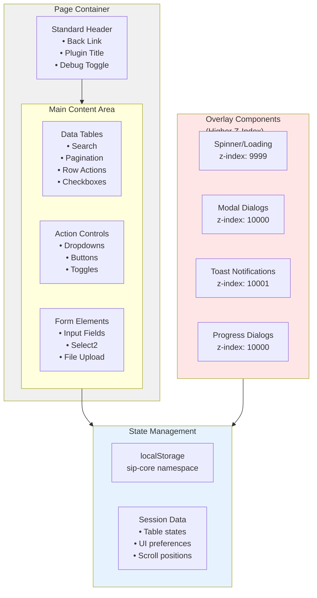

# SiP Feature - UI Components

This guide documents the UI components and browser storage patterns used in SiP plugins, including modals, toast notifications, spinners, and form elements.

## Table of Contents

- [Component Design Principles](#component-design-principles)
- [UI Component Hierarchy](#ui-component-hierarchy)
- [UI State Management with Local Storage](#ui-state-management-with-local-storage)
- [Toast Notifications](#toast-notifications)
- [Spinner and Overlay](#spinner-and-overlay)
- [Modals and Dialogs](#modals-and-dialogs)
- [Progress Indicators](#progress-indicators)
- [Extension Installer](#extension-installer)
- [Buttons and Controls](#buttons-and-controls)
- [Form Elements](#form-elements)
  - [Enhanced Select](#enhanced-select)
  - [Toggle Switches](#toggle-switches)
  - [Folder/Directory Selection](#folderdirectory-selection)
- [Checkbox Selection Patterns](#checkbox-selection-patterns)
- [Responsive Tables](#responsive-tables)
  - [Non-DataTables Table Refresh](#non-datatables-table-refresh)
  - [Collapsible Rows](#collapsible-rows)
- [Session Lifecycle](#session-lifecycle)
- [Standard Headers](#standard-headers)
- [Utility Functions](#utility-functions)
- [Conditional UI Visibility](#conditional-ui-visibility)
- [Best Practices](#best-practices)

## Component Design Principles

1. **Consistency**: Components should have a consistent look and feel across all SiP plugins
2. **Accessibility**: All components should be accessible and follow WCAG guidelines
3. **Responsive**: Components should work across different screen sizes
4. **Performance**: Components should be optimized for performance

## UI Component Hierarchy

### Component Hierarchy (ASCII)

```
┌─────────────────────────────────────────────────────────────────────┐
│                     SiP UI Component Hierarchy                       │
└─────────────────────────────────────────────────────────────────────┘

┌─────────────────────────────────────────────────────────────────────┐
│                          Page Container                              │
│  ┌─────────────────────────────────────────────────────────────┐   │
│  │                      Standard Header                         │   │
│  │  ┌─────────────┐  ┌──────────────────┐  ┌───────────────┐ │   │
│  │  │ Back Link   │  │   Plugin Title   │  │ Debug Toggle  │ │   │
│  │  └─────────────┘  └──────────────────┘  └───────────────┘ │   │
│  └─────────────────────────────────────────────────────────────┘   │
│                                                                     │
│  ┌─────────────────────────────────────────────────────────────┐   │
│  │                        Main Content                          │   │
│  │  ┌───────────────────────────────────────────────────────┐ │   │
│  │  │                    Data Tables                        │ │   │
│  │  │  ┌─────────────┐  ┌─────────────┐  ┌────────────┐   │ │   │
│  │  │  │   Search    │  │  Pagination │  │  Actions   │   │ │   │
│  │  │  └─────────────┘  └─────────────┘  └────────────┘   │ │   │
│  │  │  ┌───────────────────────────────────────────────┐   │ │   │
│  │  │  │              Table Rows                       │   │ │   │
│  │  │  │  ┌──┬─────────────────────────────────┬───┐  │   │ │   │
│  │  │  │  │☐ │         Row Content             │ ▼ │  │   │ │   │
│  │  │  │  └──┴─────────────────────────────────┴───┘  │   │ │   │
│  │  │  └───────────────────────────────────────────────┘   │ │   │
│  │  └───────────────────────────────────────────────────────┘ │   │
│  │                                                             │   │
│  │  ┌───────────────────────────────────────────────────────┐ │   │
│  │  │                  Action Controls                      │ │   │
│  │  │  ┌─────────────┐  ┌─────────────┐  ┌────────────┐   │ │   │
│  │  │  │  Dropdown   │  │   Buttons   │  │   Toggle   │   │ │   │
│  │  │  └─────────────┘  └─────────────┘  └────────────┘   │ │   │
│  │  └───────────────────────────────────────────────────────┘ │   │
│  └─────────────────────────────────────────────────────────────┘   │
└─────────────────────────────────────────────────────────────────────┘

┌─────────────────────────────────────────────────────────────────────┐
│                         Overlay Components                           │
│  ┌─────────────────────────────────────────────────────────────┐   │
│  │  Spinner/Loading  │  Modal Dialogs  │  Toast Notifications  │   │
│  │  ┌─────────────┐  │  ┌───────────┐  │  ┌────────────────┐  │   │
│  │  │      ⟳      │  │  │┌─────────┐│  │  │ Success! ✓     │  │   │
│  │  │  Loading... │  │  ││ Dialog  ││  │  └────────────────┘  │   │
│  │  └─────────────┘  │  │└─────────┘│  │                      │   │
│  │                   │  └───────────┘  │                      │   │
│  └─────────────────────────────────────────────────────────────┘   │
└─────────────────────────────────────────────────────────────────────┘

Z-Index Layers:
1000: Page Content
9998: Overlay
9999: Spinner
10000: Modal Dialogs
10001: Toast Notifications
```

### Component Hierarchy (Mermaid)



## UI State Management with Local Storage

SiP plugins use localStorage to persist UI state across sessions. All state is stored under a `sip-core` namespace.

### Storage Structure

```javascript
{
  "sip-core": {
    "sip-printify-manager": {
      "images-table": {},
      "products-table": {},
      "templates-table": {},
      "creations-table": {},
      "main-window": {}
    }
  }
}
```

### Common UI State Patterns

#### Table UI States
```javascript
{
  actionDropdown: 'add_image_to_new_product',
  search: { search: '' },
  displayStart: 0,
  order: [[2, 'desc'], [4, 'asc']],
  columns: {
    3: { search: 'all' },
    6: { search: 'all' }
  }
}
```

#### Window States
```javascript
{
  scrollPosition: 0,
  expandedSections: ['section1', 'section2'],
  selectedTab: 'images'
}
```

### Implementation Functions

#### Initialize Local Storage
```javascript
function initializeLocalStorage() {
    const coreState = JSON.parse(localStorage.getItem('sip-core')) || {};
    if (!coreState['sip-printify-manager']) {
        coreState['sip-printify-manager'] = {
            'images-table': {},
            'products-table': {},
            'templates-table': {},
            'creations-table': {},
            'main-window': { scrollPosition: 0 }
        };
    }
    localStorage.setItem('sip-core', JSON.stringify(coreState));
}
```

#### Track UI State
```javascript
function trackTableUi() {
    const state = JSON.parse(localStorage.getItem('sip-core')) || {};
    const pluginKey = 'sip-printify-manager';
    const tableKey = 'images-table';
    
    if (!state[pluginKey]) state[pluginKey] = {};
    
    state[pluginKey][tableKey] = {
        actionDropdown: $('#image_action').val() || '',
        expandedRows: Array.from($('.expanded-row')).map(el => el.id)
    };
    
    localStorage.setItem('sip-core', JSON.stringify(state));
}
```

#### Refresh UI from State
```javascript
function refreshTableUi() {
    const state = JSON.parse(localStorage.getItem('sip-core'))?.['sip-printify-manager']?.['images-table'] || {};
    const defaultState = {
        actionDropdown: '',
        expandedRows: []
    };
    
    const finalState = { ...defaultState, ...state };
    
    // Apply state to UI
    $('#image_action').val(finalState.actionDropdown);
    finalState.expandedRows.forEach(rowId => {
        $(`#${rowId}`).addClass('expanded-row');
    });
}
```

### Event Listeners

Track UI changes with debounced event listeners:

```javascript
// Track scroll position
$(window).on('scroll', _.debounce(trackMainWindowUi, 200));

// Track dropdown changes
$('#image_action').on('change', trackTableUi);

// Track tab switches
$('.nav-tab').on('click', function() {
    trackSelectedTab($(this).data('tab'));
});
```

### DataTables State Management

DataTables has its own state management that integrates with localStorage:

```javascript
$('#image-table').DataTable({
    stateSave: true,
    stateDuration: -1, // Forever
    
    stateLoadCallback: function(settings) {
        let savedState = localStorage.getItem("Image_DataTables_" + settings.sInstance);
        return savedState ? JSON.parse(savedState) : {};
    },
    
    stateSaveCallback: function(settings, data) {
        localStorage.setItem("Image_DataTables_" + settings.sInstance, JSON.stringify(data));
    }
});
```

## Toast Notifications

**Why**: Browser alerts block user interaction and don't match WordPress admin styling. Toast notifications provide non-intrusive feedback that integrates with the dashboard aesthetic.

SiP Core provides a unified toast system for user feedback.

### Basic Usage
```javascript
// Success message (green)
SiP.Core.utilities.toast.show('Operation completed successfully', 3000);

// Error message (red)
SiP.Core.utilities.toast.show('Error: Invalid input', 5000, true);

// With HTML content
SiP.Core.utilities.toast.show('<strong>Success:</strong> Files uploaded', 3000);
```

### Toast Options
- **Duration**: Time in milliseconds (default: 3000)
- **Error Style**: Red background for errors (third parameter)
- **HTML Content**: Supports basic HTML formatting

### Best Practices

**DO:**
- ✅ Use toasts for all user notifications
- ✅ Show errors in red with longer duration (5000ms)
- ✅ Keep messages concise and actionable
- ✅ Use HTML for emphasis when needed

**DON'T:**
- ❌ Use `alert()`, `confirm()`, or `prompt()`
- ❌ Show multiple toasts simultaneously
- ❌ Use toasts for critical decisions (use modals instead)
- ❌ Make duration too short for error messages

## Spinner and Overlay

The SiP Core provides a standardized spinner/overlay system for indicating loading states across all plugins.

### Overview

The spinner system consists of two components:
- **Overlay**: A semi-transparent backdrop that covers the entire dashboard
- **Spinner**: An animated loading indicator (spinner.webp) centered on screen

### Basic Usage

```javascript
// Show spinner (also shows overlay)
SiP.Core.utilities.spinner.show();

// Hide spinner (also hides overlay)
SiP.Core.utilities.spinner.hide();
```

### Manual Operations

For operations that require manual spinner control:

```javascript
// Example: Table reload with loading state
function reloadTable() {
    // Show spinner immediately
    SiP.Core.utilities.spinner.show();
    
    try {
        // Perform heavy operations
        destroyTable();
        fetchData();
        rebuildTable();
        
        // Hide spinner on success
        SiP.Core.utilities.spinner.hide();
    } catch (error) {
        // Always hide spinner on error
        SiP.Core.utilities.spinner.hide();
        SiP.Core.utilities.toast.show('Error: ' + error.message, 5000, true);
    }
}

// Example: Multi-step operation
async function performBatchOperation() {
    SiP.Core.utilities.spinner.show();
    
    try {
        await step1();
        await step2();
        await step3();
    } finally {
        // Ensure spinner is hidden even if operation fails
        SiP.Core.utilities.spinner.hide();
    }
}
```

### AJAX Integration

The spinner is automatically shown/hidden when using SiP Core AJAX:

```javascript
// Spinner shows/hides automatically
SiP.Core.ajax.handleAjaxAction('plugin-name', 'action', formData)
    .then(response => {
        // Spinner already hidden
    });

// Disable automatic spinner for custom handling
SiP.Core.ajax.handleAjaxAction('plugin-name', 'action', formData, { showSpinner: false })
    .then(response => {
        // Handle manually
    });
```

For complete AJAX documentation, see [AJAX Implementation Guide](sip-plugin-ajax.md#manual-spinner-control).

### HTML Structure

The overlay and spinner elements are automatically created by SiP Core:

```html
<!-- Added to page by SiP Core -->
<div id="overlay">
    
</div>
```

### Best Practices

**DO:**
- ✅ Show spinner immediately when user initiates action
- ✅ Always hide spinner in both success and error cases
- ✅ Use try/finally blocks to ensure spinner is hidden
- ✅ Let AJAX handle spinner automatically when possible
- ✅ Test spinner visibility with `SiP.Core.utilities.spinner.isVisible()`

**DON'T:**
- ❌ Manipulate #overlay or #spinner elements directly
- ❌ Forget to hide spinner in error handlers
- ❌ Show multiple spinners simultaneously
- ❌ Use custom loading indicators when standard spinner suffices

### Common Patterns

#### Immediate Feedback Pattern
```javascript
// Show spinner immediately on user action
$('#button').on('click', function() {
    SiP.Core.utilities.spinner.show();
    
    // Use setTimeout to ensure UI updates before heavy processing
    setTimeout(function() {
        performHeavyOperation();
    }, 10);
});
```

#### Conditional Spinner Pattern
```javascript
// Check if already showing
if (!SiP.Core.utilities.spinner.isVisible()) {
    SiP.Core.utilities.spinner.show();
}

// Perform operations...

// Safe to call hide multiple times
SiP.Core.utilities.spinner.hide();
```

#### Error Recovery Pattern
```javascript
function riskyOperation() {
    SiP.Core.utilities.spinner.show();
    
    return someAsyncOperation()
        .then(result => {
            SiP.Core.utilities.spinner.hide();
            return result;
        })
        .catch(error => {
            SiP.Core.utilities.spinner.hide();
            SiP.Core.utilities.toast.show('Operation failed', 5000, true);
            throw error; // Re-throw if needed
        });
}
```

## Modals and Dialogs

For dashboard integration examples, see the [Dashboards Guide](./sip-plugin-dashboards.md#step-6-add-modal-dialogs).

### jQuery UI Dialog

#### Basic Modal
```javascript
const $dialog = $('<div>Content</div>').dialog({
    modal: true,
    width: 400,
    title: 'Dialog Title',
    dialogClass: 'sip-dialog',
    buttons: {
        'OK': function() { $(this).dialog('close'); },
        'Cancel': function() { $(this).dialog('close'); }
    },
    close: function() { $(this).dialog('destroy').remove(); }
});
```

#### Standard Classes
- `sip-dialog` - Base class (required)
- `progress-dialog` - For progress dialogs
- `log-dialog` - For log viewers

### Progress Dialog Pattern

For complete progress dialog implementation, see the [Progress Dialog Guide](./sip-feature-progress-dialog.md).

#### Structure
```javascript
const dialogContent = `
    <div class="sip-dialog progress-dialog">
        <div class="initial-message">
            <p>Ready to proceed?</p>
            <div class="dialog-buttons">
                <button class="continue-button">Continue</button>
                <button class="cancel-button">Cancel</button>
            </div>
        </div>
        <div class="progress-content" style="display: none;">
            <div class="progress-bar">
                <div class="progress-fill" style="width: 0%"></div>
            </div>
            <div class="current-step">Starting...</div>
            <div class="status-log"></div>
        </div>
    </div>
`;
```

#### Controller Pattern
```javascript
function createProgressDialog() {
    const $dialog = $(dialogContent).dialog({
        modal: false,
        width: 600,
        dialogClass: 'sip-dialog progress-dialog',
        closeOnEscape: false
    });
    
    const controller = {
        onContinue: (callback) => { /* store callback */ },
        onCancel: (callback) => { /* store callback */ },
        startProcess: () => {
            $dialog.find('.initial-message').hide();
            $dialog.find('.progress-content').show();
        },
        updateProgress: (percent) => {
            $dialog.find('.progress-fill').css('width', `${percent}%`);
        },
        updateStatus: (message) => {
            $dialog.find('.current-step').text(message);
            $dialog.find('.status-log').append(`<div>${message}</div>`);
        },
        showError: (message) => {
            $dialog.find('.status-log').append(
                `<div class="error-message">${message}</div>`
            );
        },
        close: () => $dialog.dialog('destroy').remove()
    };
    
    return controller;
}
```

### Custom SiP Modal Pattern

**Why**: jQuery UI dialogs have limited styling options and don't match WordPress admin aesthetics. Custom modals provide consistent branding and better mobile responsiveness.

#### Structure
```html
<div id="custom-modal" class="sip-modal">
    <div class="sip-modal-content">
        <div class="sip-modal-header">
            <span class="sip-modal-close">&times;</span>
            <h2>Modal Title</h2>
        </div>
        <div class="sip-modal-body">
            <!-- Content goes here -->
        </div>
        <div class="sip-modal-footer">
            <button class="button button-primary">Primary Action</button>
            <button class="button button-secondary">Cancel</button>
        </div>
    </div>
</div>
```

#### Implementation Example
```javascript
// Create and show custom modal
function showCustomModal(title, content, onConfirm, onCancel) {
    var modalHtml = `
        <div class="sip-modal-content">
            <div class="sip-modal-header">
                <span class="sip-modal-close">&times;</span>
                <h2>${title}</h2>
            </div>
            <div class="sip-modal-body">
                ${content}
            </div>
            <div class="sip-modal-footer">
                <button id="modal-confirm" class="button button-primary">Confirm</button>
                <button id="modal-cancel" class="button button-secondary">Cancel</button>
            </div>
        </div>
    `;
    
    // Check if modal container exists, create if not
    var $modal = $('#sip-custom-modal');
    if ($modal.length === 0) {
        $modal = $('<div id="sip-custom-modal" class="sip-modal"></div>');
        $('body').append($modal);
    }
    
    // Set content and show
    $modal.html(modalHtml).show();
    
    // Attach event handlers
    $('#modal-confirm').on('click', function() {
        $modal.hide();
        if (onConfirm) onConfirm();
    });
    
    $('#modal-cancel, .sip-modal-close').on('click', function() {
        $modal.hide();
        if (onCancel) onCancel();
    });
    
    // Close on outside click
    $(window).on('click.sipModal', function(e) {
        if ($(e.target).is('#sip-custom-modal')) {
            $modal.hide();
            $(window).off('click.sipModal');
            if (onCancel) onCancel();
        }
    });
}
```

#### CSS Requirements
```css
.sip-modal {
    display: none;
    position: fixed;
    z-index: var(--sip-pm-z-modal, 2000); /* Use CSS variable, fallback to 2000 */
    left: 0;
    top: 0;
    width: 100%;
    height: 100%;
    overflow: auto;
    background-color: rgba(0,0,0,0.4);
}

.sip-modal-content {
    background-color: #fefefe;
    margin: 10% auto;
    padding: 0;
    border: 1px solid #888;
    width: 80%;
    max-width: 600px;
    border-radius: 5px;
    box-shadow: 0 4px 8px rgba(0,0,0,0.1);
}

.sip-modal-header {
    padding: 15px 20px;
    background-color: #f1f1f1;
    border-bottom: 1px solid #ddd;
    position: relative;
}

.sip-modal-close {
    color: #aaa;
    float: right;
    font-size: 28px;
    font-weight: bold;
    cursor: pointer;
    line-height: 20px;
}

.sip-modal-close:hover,
.sip-modal-close:focus {
    color: #000;
}

.sip-modal-body {
    padding: 20px;
}

.sip-modal-footer {
    padding: 15px 20px;
    background-color: #f1f1f1;
    border-top: 1px solid #ddd;
    text-align: right;
}

.sip-modal-footer button {
    margin-left: 10px;
}
```

### Common Modal Patterns

#### Confirmation Dialog
```javascript
const $dialog = $('<div>Are you sure?</div>').dialog({
    modal: true,
    title: 'Confirm',
    dialogClass: 'sip-dialog',
    buttons: {
        'Yes': function() {
            performAction();
            $(this).dialog('close');
        },
        'No': function() {
            $(this).dialog('close');
        }
    }
});
```

#### Save Dialog with Options
```javascript
const content = `
    <div class="sip-dialog">
        <p>Save changes?</p>
        <div class="dialog-buttons">
            <button class="push-close">Save & Close</button>
            <div class="button-group">
                <button class="save-button">Save</button>
                <button class="cancel-button">Cancel</button>
            </div>
        </div>
    </div>
`;

const $dialog = $(content).dialog({
    modal: true,
    dialogClass: 'sip-dialog',
    create: function() {
        $(this).find('.save-button').on('click', () => {
            save();
            $dialog.dialog('close');
        });
    }
});
```

### Key CSS

#### Dialog Z-Index
```css
:root {
    --z-overlay: 9998;
    --z-spinner: 9999;
    --z-dialog: 10000;
    --z-toast: 10001;
}
```

#### Toast Container
```css
#toast-container {
    position: fixed;
    top: 35%;
    left: 50%;
    transform: translate(-50%, -50%);
    z-index: var(--z-toast);
}
```

### Required Actions

#### Always Clean Up Dialogs
```javascript
close: function() {
    $(this).dialog('destroy').remove();
}
```

#### Use Custom Overlay
```javascript
$('#overlay').show();  // Instead of jQuery UI modal overlay
```

#### Error Handling
```javascript
dialog.showError(error.message);
SiP.Core.utilities.toast.show('Error: ' + error.message, 5000);
```

### Modal Checklist

- [ ] Use `sip-dialog` class on all dialogs
- [ ] Clean up with `destroy().remove()` 
- [ ] Use `SiP.Core.utilities.toast.show()` for notifications
- [ ] Progress dialogs follow controller pattern
- [ ] Custom overlay for non-modal dialogs
- [ ] Error messages longer duration (5000ms)
- [ ] Success messages standard duration (3000ms)

## Progress Indicators

### Progress Dialog
See [Progress Dialog Guide](sip-feature-progress-dialog.md) for batch processing with progress tracking.

### Simple Progress Bar
```javascript
// HTML
<div class="progress-bar-container">
    <div class="progress-bar" style="width: 0%"></div>
</div>

// JavaScript
function updateProgress(current, total) {
    const percentage = (current / total) * 100;
    $('.progress-bar').css('width', percentage + '%');
}
```

## Extension Installer

The centralized browser extension installer provides a consistent installation experience across all SiP plugins.

### Usage
```javascript
// Basic usage - opens installation wizard
SiP.Core.extensionInstaller.showWizard({
    name: 'Extension Name',
    slug: 'extension-slug',
    extensionPath: '/path/to/extension'  // For manual install
});

// Chrome Web Store installation
SiP.Core.extensionInstaller.showWizard({
    name: 'Extension Name',
    chromeStoreUrl: 'https://chrome.google.com/webstore/detail/...'
});
```

### Features
- **Step-by-step wizard**: Guides users through manual installation process
- **Chrome Web Store support**: Direct link to store when available
- **Cross-browser detection**: Adapts instructions for different browsers
- **Automatic fallback**: Manual instructions when store not available

### Implementation Details
The extension installer is part of SiP Plugins Core and loaded automatically via the platform loader. It uses jQuery UI dialog for the wizard interface with custom styling to match WordPress admin.

### Integration Pattern
```javascript
// In plugin dashboard or button handler
if (window.SiP.Core.extensionInstaller) {
    // Use core installer
    window.SiP.Core.extensionInstaller.showWizard(options);
} else if (window.SiP.PluginName?.browserExtension) {
    // Fallback to plugin-specific installer
    window.SiP.PluginName.browserExtension.showInstallationWizard();
} else {
    // No installer available
    SiP.Core.utilities.toast.show('Extension installer not available', 'error');
}
```

## Extension Detection

The SiP Plugins Core dashboard automatically detects installed browser extensions using postMessage communication.

### How It Works
1. **Extension Announcement**: Extension content script sends presence message on dashboard page
2. **Dashboard Listener**: Dashboard receives message and updates `window.sipInstalledItems`
3. **Table Update**: Both plugins and extensions tables refresh via `refreshInstallersTables()`
4. **Status Request**: Dashboard requests status after 2 seconds for late-loading extensions

### Extension Implementation
```javascript
// In extension content script (runs on WordPress admin pages)
if (window.location.href.includes('page=sip-plugins')) {
    window.postMessage({
        type: 'SIP_EXTENSION_DETECTED',
        extension: {
            slug: 'extension-slug',
            name: 'Extension Name',
            version: chrome.runtime.getManifest().version,
            isInstalled: true
        }
    }, window.location.origin);
}
```

### Dashboard Implementation
```javascript
// Automatically set up when plugin dashboard initializes
window.addEventListener('message', function(event) {
    if (event.origin !== window.location.origin) return;
    
    if (event.data?.type === 'SIP_EXTENSION_DETECTED') {
        // Update unified installed items
        window.sipInstalledItems[event.data.extension.slug] = {
            type: 'extension',
            version: event.data.extension.version,
            isInstalled: true,
            name: event.data.extension.name
        };
        // Refresh both tables
        refreshInstallersTables();
    }
});
```

### Benefits
- **Real-time Detection**: No page reload required
- **Automatic Updates**: Status changes immediately when extension installed/removed
- **Multi-Extension Support**: Each extension announces independently
- **Secure Communication**: Origin checking prevents malicious messages

## Buttons and Controls

### WordPress Button Classes
```html
<!-- Primary button -->
<button class="button button-primary">Save Changes</button>

<!-- Secondary button -->
<button class="button">Cancel</button>

<!-- Large button -->
<button class="button button-large">Import Data</button>

<!-- Small button -->
<button class="button button-small">Add</button>

<!-- Disabled state -->
<button class="button button-primary" disabled>Processing...</button>
```

### WordPress Dashicons
WordPress provides a comprehensive icon font called Dashicons that should be used for consistent admin UI elements.

```html
<!-- Icon button with text -->
<button class="button">
    <span class="dashicons dashicons-editor-help"></span> Help
</button>

<!-- Icon-only button -->
<button class="button" title="Settings">
    <span class="dashicons dashicons-admin-generic"></span>
</button>

<!-- Navigation icons commonly used -->
<span class="dashicons dashicons-controls-skipback"></span>   <!-- First/Skip to start -->
<span class="dashicons dashicons-arrow-left-alt2"></span>     <!-- Previous/Back -->
<span class="dashicons dashicons-arrow-right-alt2"></span>    <!-- Next/Forward -->
<span class="dashicons dashicons-controls-skipforward"></span> <!-- Last/Skip to end -->

<!-- Other common icons -->
<span class="dashicons dashicons-plus-alt"></span>            <!-- Add/Plus -->
<span class="dashicons dashicons-dismiss"></span>             <!-- Close/Remove -->
<span class="dashicons dashicons-yes"></span>                 <!-- Success/Check -->
<span class="dashicons dashicons-warning"></span>             <!-- Warning -->
<span class="dashicons dashicons-info"></span>                <!-- Information -->
```

**Icon Styling:**
```css
/* Standard icon size */
.dashicons {
    font-size: 16px;
    width: 16px;
    height: 16px;
    vertical-align: middle;
}

/* Larger icons */
.dashicons-large {
    font-size: 20px;
    width: 20px;
    height: 20px;
}
```

**Best Practices:**
- Use dashicons for consistency with WordPress admin UI
- Always include `title` attributes on icon-only buttons for accessibility
- Ensure icons have sufficient contrast against their background
- Test icon visibility at different zoom levels

### Action Dropdown Pattern
```html
<select id="bulk-action" class="action-dropdown">
    <option value="">Select Action</option>
    <option value="delete">Delete Selected</option>
    <option value="export">Export</option>
</select>
<button class="button apply-action">Apply</button>
```

## Form Elements

### Enhanced Select
```javascript
// Add search to select dropdowns
$('.enhanced-select').select2({
    placeholder: 'Select an option',
    allowClear: true,
    width: '100%'
});
```

### Toggle Switches
```html
<label class="toggle-switch">
    <input type="checkbox" class="toggle-input">
    <span class="toggle-slider"></span>
    <span class="toggle-label">Enable Feature</span>
</label>
```

### Folder/Directory Selection

Due to browser security limitations, web applications cannot access the full file system path when using folder selection dialogs. The SiP Plugin Suite uses text input fields for directory paths, following WordPress standards.

#### Implementation Pattern

```javascript
// Create path input dialog
const dialogHtml = `
    <div id="add-repository-dialog" class="sip-modal" style="display: block;">
        <div class="sip-modal-content" style="max-width: 500px;">
            <div class="sip-modal-header">
                <h2>Add Repository</h2>
                <span class="sip-modal-close">&times;</span>
            </div>
            <div class="sip-modal-body">
                <label for="repository-path-input">Repository Path:</label>
                <input type="text" 
                       id="repository-path-input" 
                       class="widefat" 
                       placeholder="e.g., C:\\Users\\name\\repos\\my-plugin or /home/user/repos/my-plugin"
                       style="margin: 10px 0;">
                <p class="description">Enter the full path to your Git repository directory.</p>
                <div id="path-validation-message" style="margin-top: 10px;"></div>
            </div>
            <div class="sip-modal-footer">
                <button id="validate-repository-btn" class="button button-primary">Add Repository</button>
                <button id="cancel-repository-btn" class="button">Cancel</button>
            </div>
        </div>
    </div>
`;
```

#### Path Validation

Always validate directory paths server-side:

```php
function validate_directory_path($path) {
    // Normalize the path for cross-platform compatibility
    $path = str_replace('/', DIRECTORY_SEPARATOR, $path);
    $path = str_replace('\\', DIRECTORY_SEPARATOR, $path);
    
    // Check if directory exists and is readable
    if (!is_dir($path) || !is_readable($path)) {
        return new WP_Error('invalid_path', 'Directory does not exist or is not readable');
    }
    
    return true;
}
```

#### User Guidance

Provide clear instructions for different platforms:

```html
<p class="description">
    Windows: Copy path from Explorer address bar (e.g., C:\Users\name\projects)<br>
    Mac/Linux: Use full path (e.g., /home/user/projects)
</p>
```

## Checkbox Selection Patterns

The SiP Plugin Suite implements comprehensive checkbox selection patterns for hierarchical data tables.

### Checkbox Types

#### 1. Row Selection Checkboxes
Used for selecting entire table rows, managed by DataTables Select extension:

```javascript
select: {
    style: "multi",
    selector: "td.col-select",
    headerCheckbox: true
}
```

#### 2. Data Element Checkboxes
For selecting specific data elements within rows (e.g., image selections):

```html
<input type="checkbox" class="creation-table-image-select sip-checkbox" data-image-index="0">
```

#### 3. Group Selection Checkboxes
For selecting all related items in a group:

```html
<input type="checkbox" class="child-product-group-select sip-checkbox">
```

### Selection Hierarchy

The selection system supports three levels:

```
Header Checkbox (all rows/columns)
├── Group Checkbox 1 (all items in group 1)
│   ├── Item Checkbox 1.1
│   ├── Item Checkbox 1.2
│   └── Item Checkbox 1.3
└── Group Checkbox 2 (all items in group 2)
    ├── Item Checkbox 2.1
    └── Item Checkbox 2.2
```

### Indeterminate States

Checkboxes display three states:
- **Unchecked**: No items selected
- **Checked**: All items selected
- **Indeterminate**: Some items selected

#### Implementing Indeterminate Logic

```javascript
function updateGroupCheckboxState($groupCheckbox, $itemCheckboxes) {
    const totalCount = $itemCheckboxes.length;
    const checkedCount = $itemCheckboxes.filter(':checked').length;
    
    if (checkedCount === 0) {
        $groupCheckbox.prop({
            'checked': false,
            'indeterminate': false
        });
    } else if (checkedCount === totalCount) {
        $groupCheckbox.prop({
            'checked': true,
            'indeterminate': false
        });
    } else {
        $groupCheckbox.prop({
            'checked': false,
            'indeterminate': true
        });
    }
}
```

### Implementation Patterns

#### Row Selection Pattern

```javascript
// Select/deselect rows
table.rows(selector)[isChecked ? 'select' : 'deselect']();

// Listen for selection changes
$('#table').on('select.dt deselect.dt', function(e, dt, type, indexes) {
    updateGroupCheckboxStates();
});
```

#### Column Selection Pattern

```javascript
// Select all checkboxes in a column
$(`.image-cell[data-image-index="${columnIndex}"] input.checkbox-class`)
    .prop('checked', isChecked);

// Listen for individual changes
$(document).on('change', '.image-cell input.checkbox-class', function() {
    const columnIndex = $(this).closest('.image-cell').data('image-index');
    updateColumnHeaderState(columnIndex);
});
```

#### Group Selection Pattern

```javascript
// Group checkbox handler
$(document).on('click', '.group-checkbox', function() {
    const groupId = $(this).data('group-id');
    const isChecked = this.checked;
    
    // Clear indeterminate state
    $(this).prop('indeterminate', false);
    
    // Update all items in the group
    $(`.item[data-group-id="${groupId}"]`).each(function() {
        // Update via appropriate method
    });
});
```

### Cross-Module Communication

When checkbox handlers exist in different modules:

```javascript
// Triggering Module
$(document).trigger('sip:checkboxStateChanged', [checkboxId, newState]);

// Listening Module
$(document).on('sip:checkboxStateChanged', function(e, checkboxId, newState) {
    updateRelatedCheckboxes(checkboxId, newState);
});
```

#### Module Loading Order Considerations

```javascript
// Option 1: Check if function exists
if (typeof SiP.OtherModule?.updateFunction === 'function') {
    SiP.OtherModule.updateFunction();
}

// Option 2: Use custom events (preferred)
$(document).trigger('sip:imageCheckboxStateChanged', [imageIndex]);

// Option 3: Defer updates
setTimeout(function() {
    // Update logic here
    $(document).trigger('sip:updateComplete');
}, 10);
```

### Checkbox CSS

Unified checkbox styles are defined in the [CSS Development](sip-development-css.md#unified-component-styles). Key aspects:

```css
/* Base checkbox reset */
input[type="checkbox"],
.sip-checkbox {
    -webkit-appearance: none;
    appearance: none;
    width: 1rem;
    height: 1rem;
    border: 1px solid #7e8993;
    border-radius: 3px;
    background-color: #fff;
    cursor: pointer;
}

/* Indeterminate state */
input[type="checkbox"]:indeterminate {
    background-color: #3582c4;
    border-color: #3582c4;
}

input[type="checkbox"]:indeterminate::before {
    content: "";
    position: absolute;
    left: 50%;
    top: 50%;
    width: 10px;
    height: 2px;
    background-color: #fff;
    transform: translate(-50%, -50%);
}
```

### Preventing Sort Interference

For checkboxes in sortable columns:

```javascript
// Make column non-sortable
columnDefs: [{
    orderable: false,
    targets: getColumnIndex('col-with-checkboxes')
}]
```

### Complete Implementation Example

```javascript
// Initialize hierarchical checkbox system
function initCheckboxHierarchy() {
    // Header checkbox - selects all groups and items
    $(document).on('click', '.header-checkbox', function() {
        const isChecked = this.checked;
        $('.group-checkbox, .item-checkbox').prop('checked', isChecked);
        $('.group-checkbox').prop('indeterminate', false);
    });
    
    // Group checkbox - selects all items in group
    $(document).on('click', '.group-checkbox', function() {
        const groupId = $(this).data('group-id');
        const isChecked = this.checked;
        
        $(this).prop('indeterminate', false);
        $(`.item-checkbox[data-group-id="${groupId}"]`).prop('checked', isChecked);
        
        updateHeaderCheckboxState();
    });
    
    // Item checkbox - updates group and header states
    $(document).on('change', '.item-checkbox', function() {
        const groupId = $(this).data('group-id');
        
        updateGroupCheckboxState(groupId);
        updateHeaderCheckboxState();
    });
}

// Update group checkbox based on its items
function updateGroupCheckboxState(groupId) {
    const $groupCheckbox = $(`.group-checkbox[data-group-id="${groupId}"]`);
    const $items = $(`.item-checkbox[data-group-id="${groupId}"]`);
    
    const total = $items.length;
    const checked = $items.filter(':checked').length;
    
    if (checked === 0) {
        $groupCheckbox.prop({ checked: false, indeterminate: false });
    } else if (checked === total) {
        $groupCheckbox.prop({ checked: true, indeterminate: false });
    } else {
        $groupCheckbox.prop({ checked: false, indeterminate: true });
    }
}
```

### Checkbox Best Practices

**DO:**
- ✅ Use semantic classes that describe checkbox purpose
- ✅ Implement proper indeterminate state logic
- ✅ Use event delegation for dynamic content
- ✅ Clear indeterminate state when user clicks
- ✅ Use DataTables API for row selection when available

**DON'T:**
- ❌ Use preventDefault() on checkbox clicks
- ❌ Assume checkbox state immediately after triggering click
- ❌ Mix selection paradigms unnecessarily
- ❌ Create circular dependencies between state updates

## Responsive Tables

### Non-DataTables Table Refresh

For simple tables that don't use DataTables (see [DataTables Integration](sip-feature-datatables.md) for complex data tables), use server-side rendering for clean updates:

#### Why This Pattern Exists
- **Avoids duplication**: HTML structure exists only in PHP
- **Leverages strengths**: PHP renders HTML, JavaScript updates DOM
- **Maintains simplicity**: No client-side templating or string concatenation

#### Implementation

```javascript
// JavaScript - Clean and simple
function updateRepositoryTable(repositories) {
    // Get fresh table rows from server
    const formData = SiP.Core.utilities.createFormData(PLUGIN_ID, ACTION_TYPE, 'get_table_rows');
    
    SiP.Core.ajax.handleAjaxAction(PLUGIN_ID, ACTION_TYPE, formData)
        .then(response => {
            if (response.success && response.data && response.data.html) {
                // Replace table body with server-rendered HTML
                $('.my-table tbody').html(response.data.html);
                
                // Re-initialize any JavaScript behaviors
                initializeTableBehaviors();
            }
        });
}
```

```php
// PHP - Server renders the HTML
function sip_ajax_get_table_rows() {
    $data = get_my_data();
    
    ob_start();
    foreach ($data as $item) {
        ?>
        <tr>
            <td><?php echo esc_html($item['name']); ?></td>
            <td><?php echo esc_html($item['status']); ?></td>
            <td>
                <button class="button action-button" data-id="<?php echo esc_attr($item['id']); ?>">
                    Action
                </button>
            </td>
        </tr>
        <?php
    }
    $html = ob_get_clean();
    
    SiP_AJAX_Response::success(
        'my-plugin',
        'table_action',
        'get_table_rows',
        array('html' => $html)
    );
}
```

### Collapsible Rows
```javascript
// Toggle row expansion
$('.expand-toggle').on('click', function() {
    const $row = $(this).closest('tr');
    const $detailRow = $row.next('.detail-row');
    
    if ($detailRow.is(':visible')) {
        $detailRow.hide();
        $(this).removeClass('expanded');
    } else {
        $detailRow.show();
        $(this).addClass('expanded');
    }
    
    // Track state
    trackExpandedRows();
});
```

## Session Lifecycle

### Initialization
```javascript
$(document).ready(function() {
    // Initialize localStorage
    initializeLocalStorage();
    
    // Refresh UI from saved state
    refreshAllUiStates();
    
    // Setup event listeners
    attachUiEventListeners();
});
```

### State Persistence
```javascript
// Save state before unload
$(window).on('beforeunload', function() {
    saveAllUiStates();
});

// Periodic state saves for critical data
setInterval(saveAllUiStates, 30000); // Every 30 seconds
```

## Standard Headers

Headers are used consistently across all SiP plugins with the following structure:

```html
<div class="sip-dashboard-wrapper">
  <div class="top-header-section">
    <a href="..." class="back-link">← Back to Dashboards</a>
    <h1 class="header-title">
       
      Plugin Name
    </h1>
    <div class="header-right-content">
      <!-- Debug toggle or other controls -->
    </div>
  </div>
  <hr class="header-divider">
</div>
```

For header implementation details, see the [Dashboard Guide](sip-plugin-dashboards.md#step-3-create-the-dashboard-header).

## Utility Functions

SiP Core provides utility functions to help with common UI tasks.

### String Normalization - normalizeForClass()

When generating CSS classes dynamically from data (e.g., status values, product types), use the `normalizeForClass()` utility to ensure consistent, valid CSS class names:

```javascript
// Basic usage
const className = SiP.Core.utilities.normalizeForClass('Work In Progress');
// Returns: 'work-in-progress'

// With prefix
const statusClass = SiP.Core.utilities.normalizeForClass('Uploaded - Unpublished', 'status-');
// Returns: 'status-uploaded-unpublished'

// Handles various input formats
SiP.Core.utilities.normalizeForClass('Some_Complex String!'); // Returns: 'some-complex-string'
SiP.Core.utilities.normalizeForClass('Multiple   Spaces'); // Returns: 'multiple-spaces'
SiP.Core.utilities.normalizeForClass(' - Leading/Trailing - '); // Returns: 'leading-trailing'
```

#### Normalization Rules

The utility applies these transformations in order:
1. Convert to lowercase
2. Replace " - " with single dash (prevents multiple dashes)
3. Replace remaining spaces with dashes
4. Replace underscores with dashes
5. Collapse multiple consecutive dashes
6. Remove non-alphanumeric characters (except dashes)
7. Remove leading/trailing dashes

#### Common Use Cases

```javascript
// Status-based styling
const status = rowData.status; // e.g., "Uploaded - Published"
const statusClass = SiP.Core.utilities.normalizeForClass(status, 'status-');
$row.addClass(statusClass); // Adds 'status-uploaded-published'

// Type-based styling
const productType = product.type; // e.g., "Parent Product"
const typeClass = SiP.Core.utilities.normalizeForClass(productType, 'type-');
$element.addClass(typeClass); // Adds 'type-parent-product'

// Data attributes
const categoryName = "Home & Garden";
const categoryId = SiP.Core.utilities.normalizeForClass(categoryName);
$element.attr('data-category', categoryId); // Sets 'data-category="home-garden"'
```

#### Implementation Pattern

```javascript
// ❌ Bad - Inconsistent normalization
const className = 'status-' + status.toLowerCase().replace(/\s+/g, '-');

// ❌ Bad - Missing edge case handling
const className = status.replace(/ /g, '-').toLowerCase();

// ✅ Good - Use standard utility
const className = SiP.Core.utilities.normalizeForClass(status, 'status-');

// ✅ Good - For multiple classes
const classes = [
    SiP.Core.utilities.normalizeForClass(status, 'status-'),
    SiP.Core.utilities.normalizeForClass(type, 'type-'),
    'base-class'
].join(' ');
```

For more details on dynamic class generation and CSS standards, see [CSS Development - Dynamic Class Generation](sip-development-css.md#dynamic-class-generation).

### HTML Escaping - escapeHtml()

When displaying user-generated content or dynamic data in the UI, use the `escapeHtml()` utility to prevent XSS attacks:

```javascript
// Basic usage
const safeText = SiP.Core.utilities.escapeHtml('<script>alert("XSS")</script>');
// Returns: '&lt;script&gt;alert(&quot;XSS&quot;)&lt;/script&gt;'

// Common use cases
const userInput = $('#user-input').val();
const safeInput = SiP.Core.utilities.escapeHtml(userInput);
$('#display-area').html(safeInput);

// In dynamic HTML generation
const productTitle = response.data.title;
const html = `<h3>${SiP.Core.utilities.escapeHtml(productTitle)}</h3>`;
```

#### Characters Escaped

The utility escapes these potentially dangerous characters:
- `&` → `&amp;`
- `<` → `&lt;`
- `>` → `&gt;`
- `"` → `&quot;`
- `'` → `&#39;`
- `/` → `&#x2F;`

#### Usage Patterns

```javascript
// ❌ Bad - Direct HTML injection
$('#title').html(userData.title);

// ❌ Bad - String concatenation without escaping
const html = '<div>' + userData.content + '</div>';

// ✅ Good - Escape user data
$('#title').html(SiP.Core.utilities.escapeHtml(userData.title));

// ✅ Good - Escape in template literals
const html = `<div>${SiP.Core.utilities.escapeHtml(userData.content)}</div>`;

// ✅ Good - Use .text() for plain text (jQuery handles escaping)
$('#title').text(userData.title);
```

## Conditional UI Visibility

### State-Based UI Controls

When UI controls should only be visible when data is available to manipulate:

```javascript
/**
 * Controls visibility of UI elements based on data availability
 * @param {boolean} show - Whether to show or hide the controls
 */
function toggleUIControls(show) {
    if (show) {
        $('.control-row-1').show();
        $('.control-row-2').show();
        $('.control-row-footer').show();
    } else {
        $('.control-row-1').hide();
        $('.control-row-2').hide();
        $('.control-row-footer').hide();
    }
}

// Usage examples
// On data load
if (dataLoaded) {
    toggleUIControls(true);
}

// On data clear/unload
toggleUIControls(false);

// On initialization
toggleUIControls(hasDataInMemory());
```

### Common Patterns

1. **Table Controls** - Hide pagination, search, and actions when no data
2. **Form Controls** - Hide submit buttons when no form context
3. **Action Buttons** - Hide actions that require selection when nothing selected

### Implementation Guidelines

- Toggle visibility at the container level, not individual controls
- Update visibility on state changes (load, unload, clear)
- Check initial state on page load
- Expose toggle functions in module utils for cross-module access

## Best Practices

1. **Namespace Storage**: Always use the `sip-core` namespace
2. **Default Values**: Provide sensible defaults for all stored values
3. **Debounce Events**: Use debouncing for scroll and resize events
4. **Clean Storage**: Remove obsolete data periodically
5. **Validate State**: Check for corrupt data when loading state
6. **User Privacy**: Don't store sensitive information in localStorage
7. **Cross-Browser**: Test localStorage availability before use
8. **Component Stacking**: Use the standardized z-index system (see [CSS Development](sip-development-css.md#z-index-management))
9. **Consistent Class Names**: Use `normalizeForClass()` for all dynamic CSS class generation
10. **Conditional Visibility**: Hide UI controls when no data is available to manipulate
11. **Modal Cleanup**: Always clean up dialogs with `destroy().remove()`
12. **Toast Duration**: Use 3000ms for success, 5000ms for errors