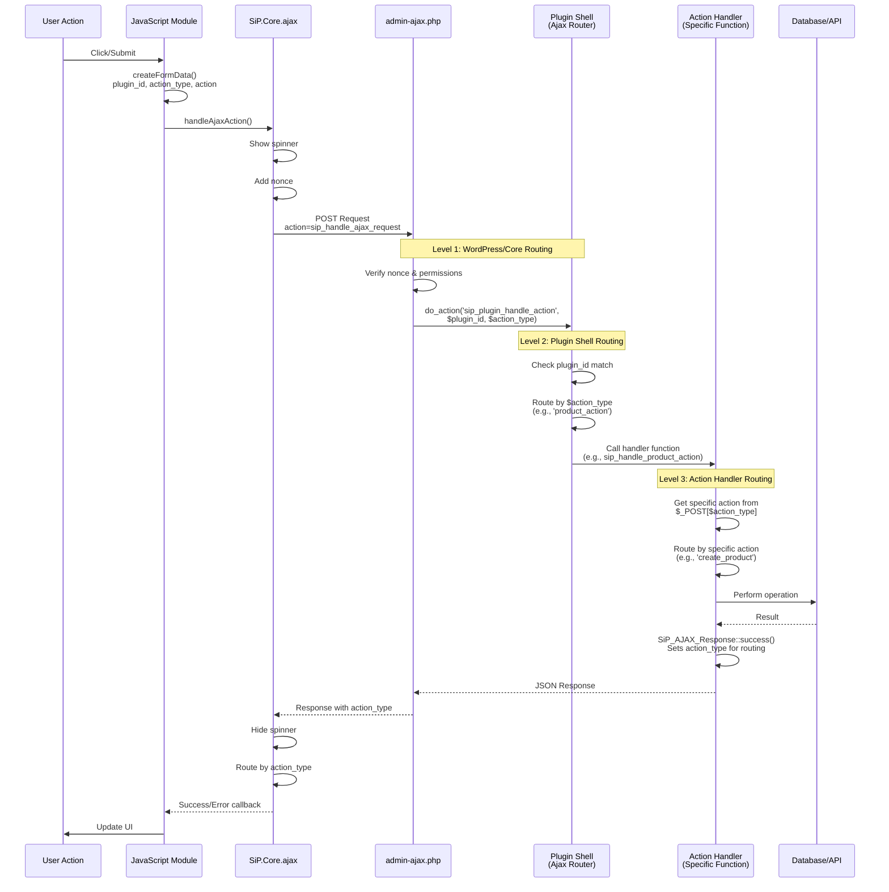

# SiP Plugin AJAX Guide & Checklist

## Overview

Centralized AJAX handling system for the SiP Plugin Suite with three-level routing architecture.

## Architecture Diagram



## Why Three-Level Architecture

The AJAX system uses three distinct routing levels because:

1. **Level 1 (WordPress/Core)**: Provides centralized security, nonce verification, and plugin discovery. All AJAX requests enter through a single, secure endpoint.

2. **Level 2 (Plugin Shell)**: Enables modular organization within plugins. Each major feature (products, templates, images) gets its own action type and handler file, preventing single massive switch statements.

3. **Level 3 (Action Handler)**: Allows fine-grained operation routing. Each handler manages related operations (create, update, delete) in one cohesive unit.

This architecture enables:
- **Cross-module operations**: One module can call another's PHP functions while routing responses back to the originator
- **Consistent security**: All requests pass through the same validation layers
- **Maintainable code**: Related operations stay together in focused handler files
- **Flexible response routing**: PHP controls which JavaScript handler receives the response via `action_type`

## Quick Reference

### Standard Flow
JavaScript → PHP Handler → JavaScript (same action_type)

### Cross-Table Flow
JavaScript (table A) → PHP Handler (table B functions) → JavaScript (table A success handler)

### Example: Template Delete
```
User clicks "Delete Template" → 
JS: createFormData('printify-manager', 'template', 'delete') →
Level 1: WordPress routes to sip_plugin_handle_action →
Level 2: Plugin shell routes to sip_handle_template_action() →
Level 3: Handler routes to 'delete' case in switch statement →
Execute delete_template() → Return success with action_type='template'
```

## Implementation Checklist & Code Examples

### ✅ JavaScript Side (File: `assets/js/modules/{feature}-actions.js`)

```javascript
// 1. Create standard request
const formData = SiP.Core.utilities.createFormData(
    'sip-printify-manager',    // plugin ID
    'product_action',          // action type  
    'create_product'           // specific action
);
formData.append('product_name', 'My Product');

// 2. Send request (spinner shows automatically)
SiP.Core.ajax.handleAjaxAction('sip-printify-manager', 'product_action', formData)
    .then(response => {
        // Handle success
        console.log('Product created:', response.data.product_id);
    })
    .catch(error => {
        // Handle error
        console.error('Error:', error.message);
    });

// 3. Register success handler to process responses
SiP.Core.ajax.registerSuccessHandler(
    'sip-printify-manager',
    'product_action',
    YourModule.handleSuccessResponse
);

// 4. Manual spinner control (when needed for multi-step operations)
// See [Spinner Documentation](sip-feature-ui-components.md#spinner-and-overlay) for complete details

// Show spinner manually
SiP.Core.utilities.spinner.show();

// Make AJAX call without automatic spinner
SiP.Core.ajax.handleAjaxAction('sip-printify-manager', 'product_action', formData, { showSpinner: false })
    .then(response => {
        // Do additional work...
        refreshTable();
        // Hide spinner after all operations complete
        SiP.Core.utilities.spinner.hide();
    })
    .catch(error => {
        // Always hide spinner on error
        SiP.Core.utilities.spinner.hide();
    });
```

**JavaScript Checklist:**
- [ ] Used `createFormData()` (never build FormData manually)
- [ ] Used `handleAjaxAction()` (never use jQuery.ajax)
- [ ] Registered success handler (if needed)
- [ ] Handled errors with .catch()
- [ ] Validated before sending
- [ ] For multi-step operations: used manual spinner control with `{ showSpinner: false }`

### ✅ PHP Ajax Shell (File: `includes/{plugin}-ajax-shell.php`)

```php
// Register with the standardized hook (2 parameters only!)
add_action('sip_plugin_handle_action', 'sip_printify_route_action', 10, 2);

function sip_printify_route_action($plugin_id, $action_type) {
    // Only handle our plugin
    if ($plugin_id !== 'sip-printify-manager') return;
    
    // Route based on action type
    switch ($action_type) {
        case 'product_action':
            sip_handle_product_action();
            break;
            
        case 'template_action':
            sip_handle_template_action();
            break;
            
        default:
            SiP_AJAX_Response::error(
                'sip-printify-manager',
                $action_type,
                $action_type,
                'Unknown action type: ' . $action_type
            );
    }
}
```

**PHP Shell Checklist:**
- [ ] Used standardized hook `sip_plugin_handle_action`
- [ ] Function accepts exactly 2 parameters
- [ ] Checks plugin ID first
- [ ] Routes by action type
- [ ] Has default error case

### ✅ PHP Action Handler - Basic Pattern

```php
function sip_handle_product_action() {
    // Get the specific action from $_POST
    $specific_action = isset($_POST['product_action']) 
        ? sanitize_text_field($_POST['product_action']) 
        : '';
    
    // Route to specific operation
    switch ($specific_action) {
        case 'create_product':
            handle_create_product();
            break;
            
        case 'delete_product':
            handle_delete_product();
            break;
            
        default:
            SiP_AJAX_Response::error(
                'sip-printify-manager',
                'product_action',
                $specific_action,
                'Unknown action: ' . $specific_action
            );
    }
}
```

### ✅ PHP Action Handler - Specific Operation

```php
function handle_create_product() {
    // 1. Validate inputs
    if (empty($_POST['product_name'])) {
        SiP_AJAX_Response::error(
            'sip-printify-manager',
            'product_action',
            'create_product',
            'Product name is required'
        );
        return;
    }
    
    // 2. Sanitize data
    $product_name = sanitize_text_field($_POST['product_name']);
    
    // 3. Process operation
    $product_id = create_product($product_name);
    
    // 4. Return success response
    SiP_AJAX_Response::success(
        'sip-printify-manager',
        'product_action',
        'create_product',
        ['product_id' => $product_id],
        'Product created successfully'
    );
}
```

**PHP Handler Checklist:**
- [ ] Gets specific action from $_POST
- [ ] Validates all inputs
- [ ] Sanitizes all data
- [ ] Checks capabilities (if needed)
- [ ] Uses correct response format:
  - [ ] Success: `SiP_AJAX_Response::success($plugin, $action_type, $action, $data, $message)`
  - [ ] Error: `SiP_AJAX_Response::error($plugin, $action_type, $action, $message)`
- [ ] Never uses `wp_send_json()`

## Cross-Table Operations & Response Routing

The AJAX system supports cross-table operations where one table's JavaScript calls another table's PHP functions and receives the response back.

### How Response Routing Works

The AJAX system routes responses based on the `action_type` field in the PHP response:

- **Same-table**: PHP sets same `action_type` as the JavaScript call
- **Cross-table**: PHP sets different `action_type` to route response elsewhere

### Cross-Table Example

```javascript
// Image table makes cross-table call to creation functions
const formData = SiP.Core.utilities.createFormData(
    'sip-printify-manager', 
    'creation_action',           // Call goes to creation handler
    'integrate_new_product_images'
);

SiP.Core.ajax.handleAjaxAction('sip-printify-manager', 'creation_action', formData);
```

**Why cross-table?** The image module needs functionality from the creation module (image integration), but the response should come back to the image module for UI updates.

```php
// Creation functions PHP handler processes the call
function sip_handle_creation_action() {
    $action = $_POST['creation_action'];
    
    if ($action === 'integrate_new_product_images') {
        // Process the integration...
        
        // Route response back to image_action handler (not creation_action)
        SiP_AJAX_Response::success(
            'sip-printify-manager',
            'image_action',              // Routes to image-actions.js handler
            'integrate_new_product_images',
            $data,
            'Images integrated successfully'
        );
    }
}
```

```javascript
// Image table success handler receives the response
function handleSuccessResponse(response) {
    switch(response.action) {
        case 'integrate_new_product_images':
            // Handle the cross-table response
            updateImageTableStatus(response.data);
            break;
    }
}
```

### Cross-Table Checklist
- [ ] JavaScript calls appropriate PHP handler (`'creation_action'`)
- [ ] PHP processes the request in correct functions file
- [ ] PHP routes response to originating handler (`'image_action'`)
- [ ] Originating success handler has case for the action
- [ ] Response includes all data needed by originating table

## Standard Response Formats

### Success Response
```php
SiP_AJAX_Response::success(
    'sip-printify-manager',    // plugin ID
    'product_action',          // action type
    'create_product',          // specific action (same as in request)
    ['product_id' => 123],     // data
    'Product created'          // message
);
```

**Returns to JavaScript:**
```json
{
    "success": true,
    "plugin": "sip-printify-manager",
    "action_type": "product_action",
    "action": "create_product",
    "data": {"product_id": 123},
    "message": "Product created"
}
```

### Error Response
```php
SiP_AJAX_Response::error(
    'sip-printify-manager',    // plugin ID
    'product_action',          // action type
    'create_product',          // specific action (what failed)
    'Product name is required' // error message
);
```

## Key Points to Remember

1. **Three-Level Action Structure:**
   - **Plugin level:** `sip-printify-manager` (which plugin)
   - **Action type:** `product_action` (functional category)  
   - **Specific action:** `create_product` (exact operation)

2. **Standardized Hook Pattern:**
   - Hook: `do_action('sip_plugin_handle_action', $plugin, $action_type)`
   - Get specific action from: `$_POST[$action_type]`
   - Example: `$_POST['product_action']` contains `'create_product'`

3. **Never Use:**
   - Direct jQuery.ajax calls
   - Direct wp_send_json calls  
   - Plugin-specific hooks
   - Manual FormData creation

4. **Always Use:**
   - `SiP.Core.ajax.handleAjaxAction()` in JavaScript
   - `SiP_AJAX_Response` class in PHP
   - Standardized `sip_plugin_handle_action` hook
   - `SiP.Core.utilities.createFormData()` for requests

5. **Cross-Table Operations:**
   - FormData `action_type` can differ from `handleAjaxAction` parameter
   - FormData contains target PHP handler's action_type
   - handleAjaxAction parameter determines which success handler receives response
   - No validation prevents action_type differences for cross-table routing

## File Structure Pattern

```
plugins/
└── sip-printify-manager/
    ├── assets/js/modules/
    │   └── product-actions.js      # JavaScript AJAX calls
    ├── includes/
    │   ├── printify-ajax-shell.php # Plugin router
    │   └── product-functions.php   # Action handlers
```

## Error Handling Patterns

### JavaScript Error Handling

```javascript
// Basic error handling with user feedback
SiP.Core.ajax.handleAjaxAction('sip-printify-manager', 'product_action', formData)
    .then(response => {
        // Success - response.success is already true
        updateUI(response.data);
    })
    .catch(error => {
        // Network or server error
        console.error('AJAX Error:', error);
        SiP.Core.utilities.toast.show('Connection error. Please try again.', 5000, true);
    });
```

### Handling Specific Error Types

```javascript
function handleSuccessResponse(response) {
    // Check for application-level errors
    if (!response.success) {
        switch (response.action) {
            case 'create_product':
                if (response.message.includes('duplicate')) {
                    showDuplicateProductDialog(response);
                } else {
                    SiP.Core.utilities.toast.show(response.message, 5000, true);
                }
                break;
                
            case 'delete_product':
                if (response.message.includes('permission')) {
                    showPermissionError();
                } else {
                    SiP.Core.utilities.toast.show('Delete failed: ' + response.message, 5000, true);
                }
                break;
                
            default:
                // Generic error display
                SiP.Core.utilities.toast.show('Error: ' + response.message, 5000, true);
        }
        return;
    }
    
    // Handle successful responses...
}
```

### PHP Error Response Patterns

```php
// Validation error with specific field
if (empty($_POST['product_name'])) {
    SiP_AJAX_Response::error(
        'sip-printify-manager',
        'product_action', 
        'create_product',
        'Product name is required',
        ['field' => 'product_name']  // Additional error context
    );
    return;
}

// Permission error
if (!current_user_can('edit_products')) {
    SiP_AJAX_Response::error(
        'sip-printify-manager',
        'product_action',
        'delete_product', 
        'You do not have permission to delete products'
    );
    return;
}

// Database error with fallback
try {
    $result = $wpdb->insert($table_name, $data);
    if ($result === false) {
        throw new Exception($wpdb->last_error);
    }
} catch (Exception $e) {
    SiP_AJAX_Response::error(
        'sip-printify-manager',
        'product_action',
        'create_product',
        'Database error: Could not save product',
        ['technical_error' => $e->getMessage()]
    );
    return;
}
```

### Batch Operation Error Handling

```javascript
async function processBatch(items) {
    const errors = [];
    const successes = [];
    
    for (const item of items) {
        try {
            const formData = SiP.Core.utilities.createFormData(
                'sip-printify-manager', 
                'product_action', 
                'process_item'
            );
            formData.append('item_id', item.id);
            
            const response = await SiP.Core.ajax.handleAjaxAction(
                'sip-printify-manager',
                'product_action', 
                formData,
                { showSpinner: false }
            );
            
            if (response.success) {
                successes.push(item);
            } else {
                errors.push({ item, error: response.message });
            }
        } catch (error) {
            errors.push({ item, error: 'Network error' });
        }
    }
    
    // Report results
    if (errors.length > 0) {
        showBatchErrorReport(errors, successes);
    } else {
        SiP.Core.utilities.toast.show(`All ${successes.length} items processed successfully`, 3000);
    }
}
```

## Debugging Tips

Use the [Testing, Debugging & Logging Guide](./sip-development-testing-debug.md) for more advanced debugging.

1. **Check Network Tab:**
   - Look for `admin-ajax.php` requests
   - Check POST data has all required fields
   - Verify response format

2. **Console Logging:**
   ```javascript
   // Enable debug mode
   console.log('Request:', formData);
   console.log('Response:', response);
   ```

3. **PHP Logging:**
   ```php
   error_log('Action: ' . $specific_action);
   error_log('POST data: ' . print_r($_POST, true));
   ```

## DataTables Integration

For comprehensive DataTables configuration options, see the [DataTables Guide](./sip-feature-datatables.md).

```javascript
$('#products-table').DataTable({
    serverSide: true,
    ajax: {
        url: sipCoreAjax.ajaxUrl,
        type: 'POST',
        data: function(data) {
            data.action = 'sip_handle_ajax_request';
            data.plugin = 'sip-printify-manager';
            data.action_type = 'product_action';
            data.product_action = 'get_table_data';
            data.nonce = sipCoreAjax.nonce;
            return data;
        }
    }
});
```

## Common Mistakes to Avoid

1. ❌ Using function names as action parameters
   ```php
   // WRONG
   SiP_AJAX_Response::error('plugin', 'type', 'sip_handle_function', 'message');
   
   // RIGHT  
   SiP_AJAX_Response::error('plugin', 'type', 'actual_action', 'message');
   ```

2. ❌ Creating FormData manually
   ```javascript
   // WRONG
   const formData = new FormData();
   formData.append('action', 'sip_handle_ajax_request');
   
   // RIGHT
   const formData = SiP.Core.utilities.createFormData('plugin', 'type', 'action');
   ```

3. ❌ Using jQuery.ajax directly
   ```javascript
   // WRONG
   $.ajax({url: ajaxurl, ...});
   
   // RIGHT
   SiP.Core.ajax.handleAjaxAction('plugin', 'type', formData);
   ```

## Quick Reference

### JavaScript Template
```javascript
// Make request
const formData = SiP.Core.utilities.createFormData('plugin-id', 'action_type', 'specific_action');
formData.append('param', value);
SiP.Core.ajax.handleAjaxAction('plugin-id', 'action_type', formData);

// Handle response
SiP.Core.ajax.registerSuccessHandler('plugin-id', 'action_type', handleResponse);
```

### PHP Template
```php
// Ajax shell
add_action('sip_plugin_handle_action', 'route_function', 10, 2);
function route_function($plugin_id, $action_type) {
    if ($plugin_id !== 'my-plugin') return;
    // Route to handlers...
}

// Handler
function handle_action() {
    $action = $_POST['action_key'];
    // Process...
    SiP_AJAX_Response::success('plugin', 'type', 'action', $data, 'message');
}
```

## Final Checklist

Before considering your AJAX implementation complete:

- [ ] JavaScript uses standard utilities
- [ ] PHP shell uses standardized hook
- [ ] Handlers use proper response format
- [ ] Error messages include actual action (not function name)
- [ ] All inputs validated and sanitized
- [ ] Tested success and error cases
- [ ] No console errors
- [ ] Spinner behavior correct

## Manual Spinner Control

While the SiP Core AJAX system automatically handles spinner display, some operations require manual control:

### When to Use Manual Control

1. **Multi-step operations** where AJAX is just one part
2. **Heavy JavaScript processing** before/after AJAX
3. **Batch operations** with multiple AJAX calls
4. **Custom timing** requirements

### Implementation Pattern

```javascript
// Pattern 1: Show immediately on user action
$('#heavy-operation-button').on('click', function() {
    // Show spinner immediately for user feedback
    SiP.Core.utilities.spinner.show();
    
    // Perform operation without automatic spinner
    SiP.Core.ajax.handleAjaxAction('plugin', 'action', formData, { showSpinner: false })
        .then(response => {
            // Process response
            return processHeavyData(response);
        })
        .then(result => {
            // Update UI
            updateInterface(result);
        })
        .finally(() => {
            // Always hide spinner
            SiP.Core.utilities.spinner.hide();
        });
});

// Pattern 2: Sequential operations
async function batchOperation() {
    SiP.Core.utilities.spinner.show();
    
    try {
        // Multiple AJAX calls without individual spinners
        for (const item of items) {
            const formData = SiP.Core.utilities.createFormData('plugin', 'action', item.action);
            await SiP.Core.ajax.handleAjaxAction('plugin', 'action', formData, { showSpinner: false });
        }
        
        SiP.Core.utilities.toast.show('Batch operation complete', 3000);
    } catch (error) {
        SiP.Core.utilities.toast.show('Error: ' + error.message, 5000, true);
    } finally {
        SiP.Core.utilities.spinner.hide();
    }
}
```

### Key Points

- Always hide spinner in `finally` or both success/error handlers
- Use `{ showSpinner: false }` to disable automatic spinner
- Show spinner before heavy operations for immediate feedback
- See [Spinner Documentation](sip-feature-ui-components.md#spinner-and-overlay) for complete API reference