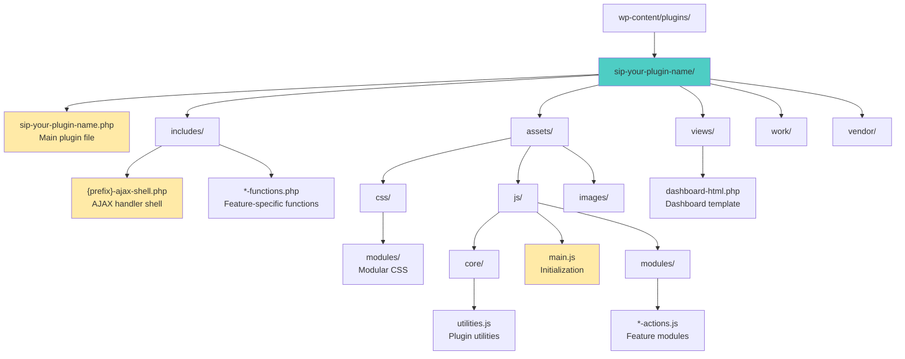
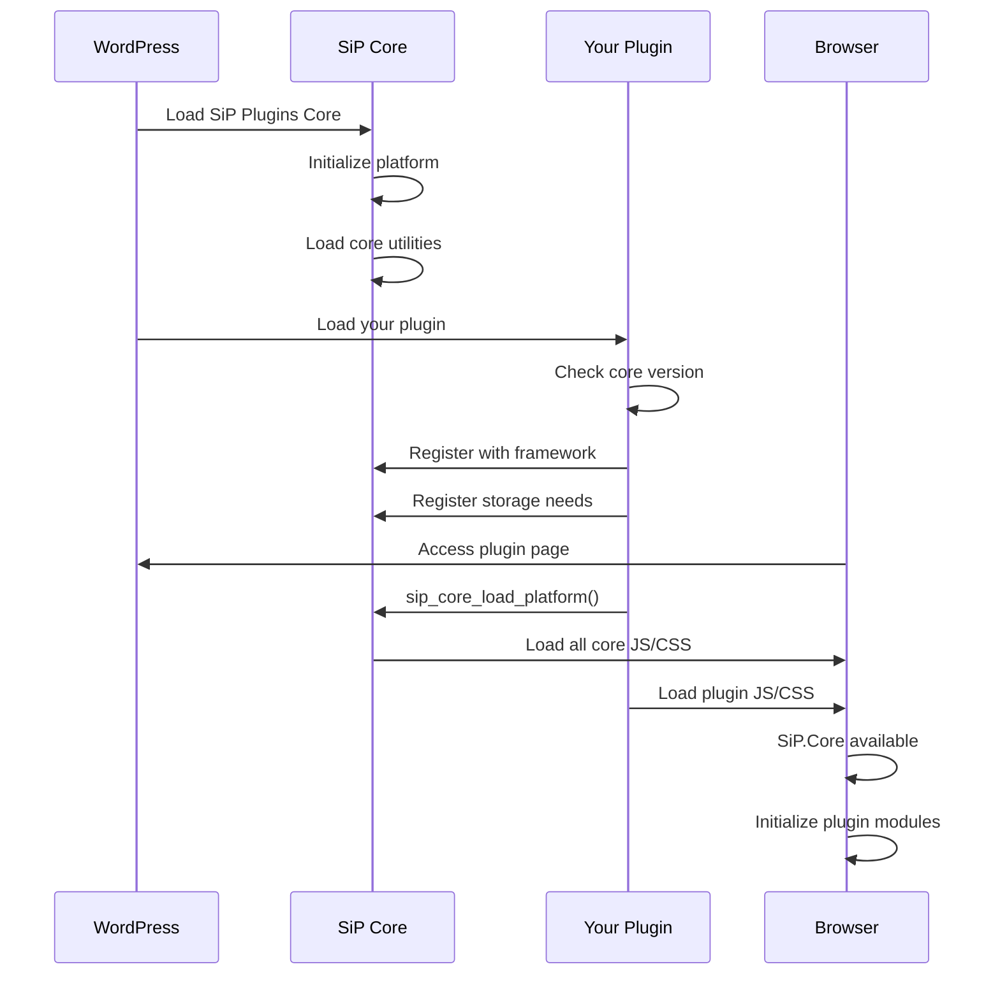
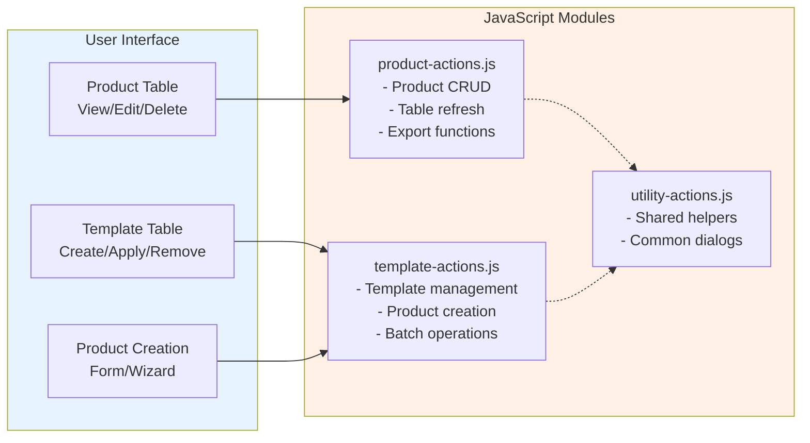

# SiP Plugin Architecture

## Overview

Complete guide for creating SiP plugins with standardized architecture, file organization, and dashboard implementation.

## Complete Plugin Architecture

```mermaid
graph TB
    subgraph WordPress["WordPress Environment"]
        subgraph CorePlugin["SiP Plugins Core"]
            Framework[Plugin Framework]
            Storage[Storage Manager]
            CoreUtils[Core Utilities<br/>Debug, AJAX, State]
            CoreModules[Core Modules<br/>DataTables, Progress, etc]
        end
        
        subgraph YourPlugin["Your SiP Plugin"]
            MainFile[sip-your-plugin.php<br/>Main Plugin File]
            
            subgraph Backend["PHP Layer"]
                AjaxShell[{prefix}-ajax-shell.php]
                Functions[*-functions.php]
            end
            
            subgraph Frontend["JavaScript Layer"]
                MainJS[main.js]
                Modules[Module Files<br/>*-actions.js]
            end
            
            subgraph Views["Presentation Layer"]
                Dashboard[dashboard.php]
            end
        end
        
        Framework --> MainFile
        Storage --> MainFile
        CoreUtils --> Modules
        CoreModules --> Modules
        
        MainFile --> AjaxShell
        MainFile --> Functions
        MainFile --> Dashboard
        AjaxShell --> Functions
        Modules --> AjaxShell
    end
    
    style CorePlugin fill:#e6f3ff
    style YourPlugin fill:#fff0e6
    style Backend fill:#ffe6e6
    style Frontend fill:#e6ffe6
```

## Architecture Diagram



### Plugin Directory Structure

The standardized directory structure for all SiP plugins:

```
sip-your-plugin-name/
├── sip-your-plugin-name.php    # Main plugin file
├── includes/                   # PHP functionality
│   ├── {prefix}-ajax-shell.php # AJAX handler
│   └── *-functions.php         # Feature functions
├── assets/                     # Frontend resources
│   ├── css/
│   │   └── modules/            # Modular CSS
│   └── js/
│       ├── main.js            # Initialization
│       └── modules/           # Feature modules
├── views/                     # HTML templates
│   └── dashboard-html.php     # Dashboard view
├── work/                      # Development files
└── vendor/                    # Third-party libraries
```

## Why This Architecture

The SiP plugin architecture follows these principles for specific reasons:

### 1. **Standardized Naming Convention** (`sip-` prefix)
All plugins must start with `sip-` because:
- Prevents namespace collisions in the WordPress ecosystem
- Enables automatic discovery by SiP Plugins Core
- Groups all SiP plugins together in admin interfaces
- Allows for future automated tooling and updates

### 2. **Separation of Concerns** (includes/, assets/, views/)
The directory structure enforces clean separation because:
- **includes/**: Backend PHP logic stays isolated from presentation
- **assets/**: Frontend resources are organized by type for efficient loading
- **views/**: Templates remain separate from business logic
- This separation enables independent updates and testing of each layer

### 3. **Modular JavaScript Architecture** (modules/*-actions.js)
JavaScript is organized into feature-specific modules because:
- Each feature can be developed and tested independently
- Module boundaries prevent global scope pollution
- Clear naming (`*-actions.js`) indicates the module's purpose
- Enables conditional loading of features based on context

### 4. **Centralized AJAX Handling** ({prefix}-ajax-shell.php)
A single AJAX shell routes all requests because:
- Provides consistent security checks and nonce verification
- Simplifies debugging with a single entry point
- Enables cross-feature communication through standardized routing
- Maintains the three-level AJAX architecture described in the [AJAX Guide](./sip-plugin-ajax.md)

## Prerequisites

Before creating a SiP plugin:
- SiP Plugins Core must be installed and activated
- WordPress development environment setup
- Understanding of PHP and JavaScript
- Familiarity with the [SiP Plugins Platform](./sip-core-platform.md)

## Plugin Integration Flow



## Module Pattern Examples

### JavaScript Module Pattern

```javascript
// assets/js/modules/product-actions.js
SiP.YourPlugin.productActions = (function($) {
    const debug = SiP.Core.debug;
    
    // Private variables
    let productTable = null;
    
    // Private functions
    function validateProduct(data) {
        return data.name && data.price > 0;
    }
    
    // Public functions
    function init() {
        debug.normal('🟢 Product module initialized');
        attachEventListeners();
    }
    
    function attachEventListeners() {
        $(document).on('click', '.create-product', handleCreate);
        $(document).on('click', '.delete-product', handleDelete);
    }
    
    function handleCreate(e) {
        e.preventDefault();
        const formData = SiP.Core.utilities.createFormData(
            'sip-your-plugin',
            'product_action',
            'create'
        );
        // ... handle creation
    }
    
    // Public API
    return {
        init: init,
        refreshTable: refreshProductTable
    };
})(jQuery);
```

### PHP Function Organization Pattern

```php
// includes/product-functions.php
<?php
if (!defined('ABSPATH')) exit;

/**
 * Handle all product-related actions
 */
function sip_handle_product_action() {
    $action = isset($_POST['product_action']) ? 
        sanitize_text_field($_POST['product_action']) : '';
    
    switch ($action) {
        case 'create':
            sip_create_product();
            break;
        case 'update':
            sip_update_product();
            break;
        case 'delete':
            sip_delete_product();
            break;
        default:
            SiP_AJAX_Response::error(
                'sip-your-plugin',
                'product_action',
                $action,
                'Unknown action'
            );
    }
}
```

### Example from SiP Printify Manager
```
sip-printify-manager/
├── includes/
│   ├── printify-ajax-shell.php         # Plugin-specific prefix
│   ├── image-functions.php
│   ├── product-functions.php
│   └── template-functions.php
├── assets/
│   ├── css/
│   │   └── modules/                    # Modular CSS organization
│   │       ├── base.css
│   │       ├── modals.css
│   │       └── tables.css
│   └── js/
│       ├── main.js
│       └── modules/
│           ├── image-actions.js
│           ├── product-actions.js
│           └── template-actions.js
└── views/
    └── dashboard-html.php
```

## Naming Convention Standards

### Why These Naming Conventions

The SiP naming conventions serve specific purposes:

1. **Discoverability**: Consistent naming makes files instantly recognizable
2. **Auto-loading**: Predictable names enable future automation tools
3. **Conflict Prevention**: Prefixes prevent naming collisions
4. **Self-Documentation**: File names clearly indicate their purpose

### PHP Files
- Main plugin file: `sip-plugin-name.php`
- AJAX handler shell: `{plugin-prefix}-ajax-shell.php` (e.g., `printify-ajax-shell.php`)
- Function files: `{functionality}-functions.php` (e.g., `shop-functions.php`, `image-functions.php`)
- Utility functions: `utility-functions.php` (for pan-table/cross-component functionality)
- Classes: `SiP_ClassName` (e.g., `SiP_Product_Manager`)
- Functions: `sip_function_name()` (e.g., `sip_handle_product_action()`)
- Constants: `SIP_CONSTANT_NAME` (e.g., `SIP_PLUGIN_VERSION`)

### JavaScript Files
- Module files: `{functionality}-actions.js` (e.g., `image-actions.js`, `shop-actions.js`)
- Utility files: `utilities.js`
- Namespaces: `SiP.ModuleName` (e.g., `SiP.PrintifyManager`)
- Functions: `camelCase()` (e.g., `handleProductSubmit()`)
- Constants: `UPPER_CASE` (e.g., `MAX_FILE_SIZE`)

### CSS Files
- Main stylesheet: `sip-plugin-name.css`
- Component styles: `{component}.css` (e.g., `modals.css`, `tables.css`)
- Classes: `sip-component-name` (e.g., `sip-modal-dialog`)
- IDs: `sip-specific-element` (e.g., `sip-product-table`)

## Main Plugin File

Create `sip-your-plugin-name.php`:

### Plugin Header and Core Checks

```php
<?php
/*
Plugin Name: SiP Your Plugin Name
Description: Brief description of what your plugin does
Version: 1.0.0
Author: Stuff is Parts, LLC
Requires Plugins: sip-plugins-core
*/

if (!defined('ABSPATH')) exit;

// Error logging setup (optional but recommended)
ini_set('error_log', plugin_dir_path(__FILE__) . 'logs/php-errors.log');
ini_set('log_errors', 1);
ini_set('display_errors', 0);

// Check for minimum core version compatibility
$required_core_version = '2.8.9';
$core_plugin_data = get_plugin_data(
    WP_PLUGIN_DIR . '/sip-plugins-core/sip-plugins-core.php',
    false, false
);
$current_core_version = $core_plugin_data['Version'] ?? '0.0.0';

if (version_compare($current_core_version, $required_core_version, '<')) {
    add_action('admin_notices', function() use ($required_core_version, $current_core_version) {
        echo '<div class="notice notice-error"><p>';
        echo '<strong>SiP Your Plugin Name:</strong> ';
        echo 'Requires SiP Plugins Core version ' . $required_core_version;
        echo ' or higher. Current version: ' . $current_core_version;
        echo '. Please update SiP Plugins Core first.</p></div>';
    });
    return; // Stop plugin initialization
}
```

### File Includes and Class Definition

```php
// Include required files
require_once WP_PLUGIN_DIR . '/sip-plugins-core/includes/plugin-framework.php';
require_once plugin_dir_path(__FILE__) . 'includes/plugin-ajax-shell.php';

// Include functionality files
$includes = [
    'utility-functions.php',
    'feature1-functions.php',
    'feature2-functions.php',
];

foreach ($includes as $file) {
    require_once plugin_dir_path(__FILE__) . 'includes/' . $file;
}

// Main plugin class
class SiP_Your_Plugin_Name {
    private static $instance = null;
    
    private function __construct() {
        add_action('plugins_loaded', array($this, 'init'));
        add_action('admin_enqueue_scripts', array($this, 'enqueue_admin_assets'));
    }
    
    public static function get_instance() {
        if (null === self::$instance) {
            self::$instance = new self();
        }
        return self::$instance;
    }
```

### Core Methods

```php
    public function init() {
        if (class_exists('SiP_Plugin_Framework')) {
            SiP_Plugin_Framework::init_plugin(
                'Your Plugin Name',
                __FILE__,
                'SiP_Your_Plugin_Name'
            );
        }
    }
    
    public function enqueue_admin_assets($hook) {
        if (strpos($hook, 'sip-your-plugin-name') === false) {
            return;
        }
        
        // CSS
        wp_enqueue_style(
            'sip-your-plugin-css',
            plugin_dir_url(__FILE__) . 'assets/css/admin.css',
            array(),
            '1.0.0'
        );
        
        // JavaScript
        wp_enqueue_script(
            'sip-your-plugin-js',
            plugin_dir_url(__FILE__) . 'assets/js/main.js',
            array('jquery', 'sip-core-js'),
            '1.0.0',
            true
        );
        
        // Localize script
        wp_localize_script('sip-your-plugin-js', 'sipYourPluginAjax', array(
            'ajaxUrl' => admin_url('admin-ajax.php'),
            'nonce' => wp_create_nonce('sip-ajax-nonce'),
            'plugin' => 'sip-your-plugin-name'
        ));
    }
```

### Dashboard Rendering

```php
    public static function render_dashboard() {
        sip_render_standard_header(
            'Your Plugin Name',
            admin_url('admin.php?page=sip-plugins')
        );
        
        include plugin_dir_path(__FILE__) . 'views/dashboard.php';
    }
} // End of class

// Initialize the plugin
SiP_Your_Plugin_Name::get_instance();
```

### Storage Registration

```php
// Register storage configuration
sip_plugin_storage()->register_plugin('sip-your-plugin-name', array(
    'database' => array(
        'tables' => array(
            'items' => array(
                'version' => '1.0.0',
                'create_sql' => "CREATE TABLE IF NOT EXISTS {table_name} (
                    id INT(11) NOT NULL AUTO_INCREMENT,
                    name VARCHAR(255) NOT NULL,
                    description TEXT,
                    status VARCHAR(50) DEFAULT 'active',
                    created_at DATETIME DEFAULT CURRENT_TIMESTAMP,
                    updated_at DATETIME DEFAULT CURRENT_TIMESTAMP ON UPDATE CURRENT_TIMESTAMP,
                    PRIMARY KEY (id),
                    KEY status (status)
                ) ENGINE=InnoDB DEFAULT CHARSET=utf8mb4 COLLATE=utf8mb4_unicode_ci;"
            )
        )
    ),
    'folders' => array('data', 'exports', 'logs', 'cache')
));
```

## Storage Management

Register your plugin's storage needs with the centralized storage manager:

```php
// Register storage configuration
sip_plugin_storage()->register_plugin('sip-your-plugin-name', array(
    'database' => array(
        'tables' => array(
            'table_name' => array(
                'version' => '1.0.0',
                'custom_table_name' => 'sip_custom_name', // Optional
                'drop_existing' => false, // Only true during development
                'create_sql' => "CREATE TABLE IF NOT EXISTS {table_name} ..."
            )
        )
    ),
    'folders' => array(
        'folder1',
        'folder2',
        'nested/folder'
    )
));
```

### Using Storage in Functions:

```php
// Get a folder path
$logs_dir = sip_plugin_storage()->get_folder_path('sip-your-plugin-name', 'logs');

// Get plugin URL
$plugin_url = sip_plugin_storage()->get_plugin_url('sip-your-plugin-name');

// Save a file
$export_dir = sip_plugin_storage()->get_folder_path('sip-your-plugin-name', 'exports');
file_put_contents($export_dir . '/data.json', json_encode($data));
```

## AJAX Handler Implementation

Create `includes/{plugin-prefix}-ajax-shell.php`:

```php
<?php
if (!defined('ABSPATH')) exit;

// Register with central SiP AJAX handler
add_action('init', function() {
    add_action('sip_plugin_handle_action', 'sip_your_plugin_route_action', 10, 2);
});

// Route actions to specific handlers
function sip_your_plugin_route_action($plugin_id, $action_type) {
    // Only handle our plugin
    if ($plugin_id !== 'sip-your-plugin-name') {
        return;
    }
    
    switch ($action_type) {
        case 'feature1_action':
            sip_handle_feature1_action();
            break;
            
        case 'feature2_action':
            sip_handle_feature2_action();
            break;
            
        default:
            SiP_AJAX_Response::error(
                'sip-your-plugin-name',
                $action_type,
                'unknown',
                'Invalid action type: ' . $action_type
            );
            break;
    }
}
```

## Dashboard Implementation

### Dashboard Structure Overview

SiP plugin dashboards follow a consistent pattern:

1. **Standard Header** - Uses `sip_render_standard_header()` with optional action buttons
2. **Main Content Area** - Contains tables, forms, and controls
3. **Data Tables** - For displaying plugin data with actions
4. **Action Forms** - Dropdown menus with execute buttons
5. **Modals/Dialogs** - For complex interactions

### Creating the Dashboard View

Create `views/dashboard.php`:

#### Dashboard Structure

```php
<?php
// Prevent direct access
if (!defined('ABSPATH')) exit;

// Get necessary data
$settings = get_option('sip_your_plugin_settings', []);
$data = sip_get_your_plugin_data();
?>

<div class="wrap sip-dashboard-wrapper">
    
    <!-- Optional spinner overlay -->
    <div id="overlay">
        " 
             alt="Loading...">
    </div>
    
    <!-- Main dashboard content -->
    <div id="dashboard-container">
        <!-- Content sections go here -->
    </div>
    
    <!-- Toast container for notifications -->
    <div id="toast-container"></div>
    
</div>
```

#### Section with Actions

```php
<!-- Section with header and actions -->
<div class="sip-section">
    <div class="section-header">
        <h2><?php esc_html_e('Section Title', 'your-text-domain'); ?></h2>
        
        <!-- Action form -->
        <form id="section-action-form" class="action-form">
            <label for="section_action" class="screen-reader-text">
                <?php esc_html_e('Actions', 'your-text-domain'); ?>
            </label>
            
            <select name="section_action" id="section_action">
                <option value="action1">
                    <?php esc_html_e('Action 1', 'your-text-domain'); ?>
                </option>
                <option value="action2">
                    <?php esc_html_e('Action 2', 'your-text-domain'); ?>
                </option>
                <option value="reload_data">
                    <?php esc_html_e('Reload Data', 'your-text-domain'); ?>
                </option>
            </select>
            
            <input type="submit" 
                   value="<?php esc_attr_e('Execute', 'your-text-domain'); ?>" 
                   class="button button-secondary" />
        </form>
    </div>
    
    <!-- Table container -->
    <div id="table-container" class="table-container">
        <!-- Table goes here -->
    </div>
</div>
```

#### Data Table Structure

```php
<table id="data-table" class="wp-list-table widefat fixed striped">
    <thead>
        <tr>
            <th><?php esc_html_e('ID', 'your-text-domain'); ?></th>
            <th><?php esc_html_e('Name', 'your-text-domain'); ?></th>
            <th><?php esc_html_e('Status', 'your-text-domain'); ?></th>
            <th><?php esc_html_e('Actions', 'your-text-domain'); ?></th>
        </tr>
    </thead>
    <tbody>
        <!-- Table content populated via JavaScript -->
    </tbody>
</table>
```

### Standard Headers with Custom Actions

```php
// Add custom buttons to the header
$right_content = '<div id="button-container">
    <button id="help-button" class="button button-secondary" title="Get Help">
        <span class="dashicons dashicons-editor-help"></span> Help
    </button>
    <button id="settings-button" class="button button-primary">
        ' . esc_html__('Settings', 'your-text-domain') . '
    </button>
</div>';

sip_render_standard_header('Your Plugin Name', $right_content);
```

### Dashboard JavaScript Implementation

The dashboard requires JavaScript for interactivity. Create appropriate modules following the module organization principle.

#### Module Organization Principle



**Code should be associated with the interface where it's called.**

- **Product Table Actions**: If a "Create Template" button exists in the product table, the `createTemplate()` function belongs in `product-actions.js`
- **Template Table Actions**: Actions executed from the template table interface go in `template-actions.js`
- **Cross-Table Actions**: The Product Creation Table initialization is in `template-actions.js` because it's triggered from the template table

### Initial Data Loading Patterns

#### Pattern 1: Server-Side Data Loading (Recommended)

```php
// In your enqueue_admin_scripts method
public function enqueue_admin_scripts() {
    // Get the data once in PHP
    $dashboard_data = $this->get_dashboard_data();
    
    // Pass to JavaScript
    wp_localize_script('your-plugin-script', 'yourPluginData', [
        'dashboardData' => $dashboard_data,
        'settings' => get_option('your_plugin_settings', [])
    ]);
}
```

```javascript
// JavaScript: Use localized data
let dashboardData = {};
let pluginSettings = {};

function init(serverData, serverSettings) {
    dashboardData = serverData || {};
    pluginSettings = serverSettings || {};
    
    $(document).ready(function() {
        renderDashboard();
        attachEventHandlers();
    });
}

// Initialize with localized data
if (typeof yourPluginData !== 'undefined') {
    init(yourPluginData.dashboardData, yourPluginData.settings);
}
```

#### Pattern 2: Client-Side AJAX Loading

Use when data must be fetched dynamically:

```javascript
jQuery(document).ready(function($) {
    loadDashboardData();
    
    function loadDashboardData() {
        const formData = SiP.Core.utilities.createFormData(
            'sip-your-plugin',
            'load_dashboard',
            'get_all'
        );
        
        SiP.Core.ajax.handleAjaxAction(
            'sip-your-plugin',
            'load_dashboard',
            formData
        )
        .then(function(response) {
            updateDashboard(response.data);
        })
        .catch(function(error) {
            SiP.Core.utilities.toast.show('Failed to load dashboard data', 5000);
        });
    }
});
```

### Dashboard Refresh Strategies

#### Local State Update + Re-render (Recommended)

Best for instant response:

```javascript
// Module scope storage
let availableData = {};
let localState = {};

// Initial load - store server data
function loadDashboard() {
    SiP.Core.ajax.handleAjaxAction('plugin', 'get_data', formData)
        .then(response => {
            availableData = response.data; // Store for reuse
            renderDashboard(response.data);
        });
}

// Re-render using existing data + updated local state
function refreshDashboard() {
    renderDashboard(availableData); // Uses updated localState
}

// After successful operation
function handleOperationSuccess(response) {
    // Update local state with response data
    if (response.data.newVersion) {
        localState.installedItems[itemId].version = response.data.newVersion;
    }
    
    // Re-render immediately
    refreshDashboard();
}
```

#### Page Reload (Fallback)

When local state update isn't feasible:

```javascript
// After successful operation
setTimeout(function() {
    window.location.reload();
}, 1000); // Brief delay for user feedback
```

## Feature Implementation

### Feature-Specific Functions

Create `includes/feature1-functions.php`:

```php
<?php
if (!defined('ABSPATH')) exit;

// Handle feature1 actions
function sip_handle_feature1_action() {
    $specific_action = isset($_POST['feature1_action']) 
        ? sanitize_text_field($_POST['feature1_action']) 
        : '';
    
    switch ($specific_action) {
        case 'create_item':
            sip_create_item();
            break;
            
        case 'update_item':
            sip_update_item();
            break;
            
        case 'delete_item':
            sip_delete_item();
            break;
            
        default:
            SiP_AJAX_Response::error(
                'sip-your-plugin-name',
                'feature1_action',
                'unknown',
                'Unknown action: ' . $specific_action
            );
            break;
    }
}

// Create item function
function sip_create_item() {
    // Validate required parameters
    if (!isset($_POST['item_name'])) {
        SiP_AJAX_Response::error(
            'sip-your-plugin-name',
            'feature1_action',
            'create_item',
            'Missing required parameter: item_name'
        );
        return;
    }
    
    $item_name = sanitize_text_field($_POST['item_name']);
    
    // Perform the operation
    // ... your business logic here ...
    
    // Return success response
    SiP_AJAX_Response::success(
        'sip-your-plugin-name',
        'feature1_action',
        'create_item',
        ['item_id' => $new_item_id],
        'Item created successfully'
    );
}
```

### JavaScript Namespace Architecture

#### Why This Namespace Pattern

The SiP namespace pattern is required because:

1. **Global Namespace Protection**: The `var SiP = SiP || {};` pattern ensures we don't overwrite existing namespaces
2. **Cross-Plugin Communication**: All SiP plugins share the root `SiP` namespace, enabling access to `SiP.Core` utilities
3. **Module Independence**: Each plugin gets its own namespace (`SiP.YourPlugin`) preventing conflicts
4. **Load Order Flexibility**: The `|| {}` pattern allows modules to load in any order without errors

#### JavaScript Module Structure

Create `assets/js/modules/feature1-actions.js`:

##### Module Namespace and Initialization

```javascript
// Namespace initialization - REQUIRED at top of every module
var SiP = SiP || {};
window.SiP = window.SiP || {};
SiP.YourPlugin = SiP.YourPlugin || {};

// Module definition using IIFE pattern
SiP.YourPlugin.feature1Actions = (function($, ajax, utilities) {
    const debug = SiP.Core.debug;
    
    // Initialize module
    function init() {
        debug.log('▶ feature1-actions.js Loading...');
        attachEventListeners();
    }
    
    // Attach event listeners
    function attachEventListeners() {
        $(document).on('click', '.create-item-btn', handleCreateItem);
        $(document).on('click', '.update-item-btn', handleUpdateItem);
        $(document).on('click', '.delete-item-btn', handleDeleteItem);
    }
```

##### AJAX Request Handler

```javascript
    // Handle create item
    function handleCreateItem(e) {
        e.preventDefault();
        
        // Create form data
        const formData = utilities.createFormData(
            'sip-your-plugin-name',
            'feature1_action',
            'create_item'
        );
        
        // Add item data
        formData.append('item_name', $('#item-name').val());
        
        // Send request
        return ajax.handleAjaxAction(
            'sip-your-plugin-name',
            'feature1_action',
            formData
        )
        .then(function(response) {
            utilities.toast.show('Item created successfully', 3000);
            return response;
        })
        .catch(function(error) {
            utilities.toast.show('Error: ' + error.message, 5000);
            throw error;
        });
    }
```

##### Response Handler and Module Export

```javascript
    // Handle successful responses
    function handleSuccessResponse(response) {
        if (!response.success) {
            return response;
        }
        
        switch(response.action) {
            case 'create_item':
                $('#items-table').DataTable().ajax.reload();
                break;
            case 'update_item':
                // Handle update response
                break;
            case 'delete_item':
                // Handle delete response
                break;
            default:
                debug.warn('Unhandled action:', response.action);
        }
        
        return response;
    }
    
    // Public API
    return {
        init: init,
        handleSuccessResponse: handleSuccessResponse
    };
    
})(jQuery, SiP.Core.ajax, SiP.Core.utilities);

// Register success handler
SiP.Core.ajax.registerSuccessHandler(
    'sip-your-plugin-name',
    'feature1_action',
    SiP.YourPlugin.feature1Actions.handleSuccessResponse
);
```

## DataTables Integration

For server-side data tables:

```javascript
$('#items-table').DataTable({
    processing: true,
    serverSide: true,
    ajax: {
        url: sipCoreAjax.ajaxUrl,
        type: 'POST',
        data: function(data) {
            data.action = 'sip_handle_ajax_request';
            data.plugin = 'sip-your-plugin-name';
            data.action_type = 'feature1_action';
            data.feature1_action = 'get_items';
            data.nonce = sipCoreAjax.nonce;
            return data;
        }
    },
    columns: [
        { data: 'id', title: 'ID' },
        { data: 'name', title: 'Name' },
        { 
            data: 'status',
            render: function(data) {
                return '<span class="status-' + data + '">' + data + '</span>';
            }
        }
    ]
});
```

## CSS Architecture

**Why**: Plugins need their own styles for custom components while leveraging Core-provided base styles for common UI patterns.

### Core-Provided CSS

When you call `sip_core_load_platform()`, the following CSS files are automatically loaded:
- **variables.css** - CSS custom properties for consistent theming
- **modals.css** - Base styles for `.sip-modal` and `.sip-dialog` patterns  
- **ui.css** - Core UI component styles
- **header.css** - Standard header component styles

### Plugin-Specific CSS

Create `assets/css/admin.css` for your plugin-specific styles:

#### Dashboard Layout Styles

```css
/* Dashboard wrapper */
.sip-dashboard-wrapper {
    width: 100%;
    max-width: 100%;
    margin: 20px 0;
}

/* Section styling */
.sip-section {
    background: #fff;
    border: 1px solid #ccd0d4;
    box-shadow: 0 1px 1px rgba(0,0,0,.04);
    margin-bottom: 20px;
    padding: 20px;
}

/* Plugin-specific panel styling */
.sip-panel {
    background: #fff;
    border: 1px solid #ccd0d4;
    box-shadow: 0 1px 1px rgba(0,0,0,.04);
    margin: 20px 0;
    padding: 20px;
}
```

#### Interactive Component Styles

```css
/* Section header with actions */
.section-header {
    display: flex;
    justify-content: space-between;
    align-items: center;
    margin-bottom: 20px;
}

/* Action forms */
.action-form {
    display: flex;
    gap: 10px;
    align-items: center;
}

/* 
 * Note: Base modal styles (.sip-modal, .sip-dialog) are provided by Core
 * Only add plugin-specific modal customizations here
 */
```

## Dependency Management

### Plugin Headers

All SiP child plugins must include the `Requires Plugins` header:

```php
/*
Plugin Name: SiP Your Plugin Name
...
Requires Plugins: sip-plugins-core
*/
```

### Version Compatibility

Child plugins must check for minimum core version compatibility:

```php
$required_core_version = '2.8.9';
$core_plugin_data = get_plugin_data(WP_PLUGIN_DIR . '/sip-plugins-core/sip-plugins-core.php', false, false);
$current_core_version = $core_plugin_data['Version'] ?? '0.0.0';

if (version_compare($current_core_version, $required_core_version, '<')) {
    add_action('admin_notices', function() use ($required_core_version, $current_core_version) {
        echo '<div class="notice notice-error"><p><strong>Your Plugin Name:</strong> Requires SiP Plugins Core version ' . $required_core_version . ' or higher. Current version: ' . $current_core_version . '. Please update SiP Plugins Core first.</p></div>';
    });
    return; // Stop plugin initialization
}
```

## Architecture Checklist

### PHP Integration
- [ ] Main plugin file includes plugin-framework.php
- [ ] AJAX shell properly configured with two-parameter hook
- [ ] All functionality-specific files included
- [ ] AJAX responses use SiP_AJAX_Response class
- [ ] Plugin registered with SiP_Plugin_Framework::init_plugin()
- [ ] render_dashboard() method implemented
- [ ] Standard headers use sip_render_standard_header()
- [ ] Storage registered with sip_plugin_storage()
- [ ] Version compatibility checked

### JavaScript Integration
- [ ] Modules follow standard pattern
- [ ] AJAX requests use SiP.Core utilities
- [ ] Success handlers registered
- [ ] Event handlers properly attached
- [ ] Debug logging uses SiP.Core.debug
- [ ] Module organization follows interface principle
- [ ] Data stored in module scope for reuse

### Dashboard Implementation
- [ ] Dashboard view in views/ directory
- [ ] Action forms with dropdowns
- [ ] DataTables for data display
- [ ] Loading indicators present
- [ ] Toast notifications for feedback
- [ ] Proper data loading pattern chosen
- [ ] Refresh strategy appropriate

### File Structure
- [ ] Directory structure matches standard
- [ ] Naming conventions consistent
- [ ] Plugin name starts with 'sip-'
- [ ] AJAX shell follows naming pattern

### UI Standards
- [ ] Standard CSS classes used
- [ ] Responsive layout
- [ ] Accessibility labels included
- [ ] Separation of PHP/JavaScript maintained

## Best Practices

1. **Code Organization** - Keep code associated with its interface
2. **State Management** - Store server data in module scope
3. **Refresh Strategy** - Prefer local updates over page reload
4. **Error Handling** - Always handle errors gracefully
5. **User Feedback** - Provide clear feedback for all actions
6. **Documentation** - Follow patterns, don't create variations
7. **Module Consolidation** - Group related functionality
8. **Separation of Concerns** - Keep PHP and JavaScript separate

## Common Pitfalls to Avoid

1. **Don't use wp_send_json()** - Always use SiP_AJAX_Response
2. **Don't create custom AJAX endpoints** - Use centralized handler
3. **Don't embed JavaScript in PHP** - Use wp_localize_script()
4. **Don't skip loading indicators** - Users need feedback
5. **Don't create redundant refresh endpoints** - Use local state
6. **Don't forget storage registration** - Use storage manager
7. **Don't mix concerns** - Keep PHP/JS responsibilities separate

## Related Documentation

- [SiP Plugin Platform](./sip-core-platform.md) - Platform architecture
- [AJAX Implementation](./sip-plugin-ajax.md) - AJAX patterns and implementation
- [DataTables Guide](./sip-core-feature-datatables.md) - Table implementation
- [Debug Logging](./sip-development-testing-debug.md) - Debug system
- [Data Storage](./sip-plugin-data-storage.md) - Storage patterns