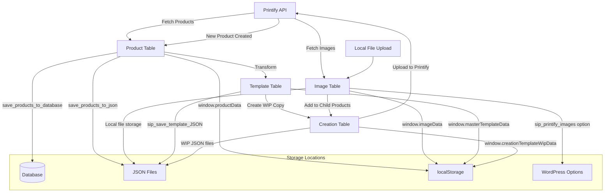

# SiP Plugin - Data Storage and File Handling

This guide documents all data storage and file handling patterns used in SiP plugins.

## Storage Types Overview

SiP plugins use multiple storage mechanisms based on the data type and persistence requirements:

1. **Local Storage** - UI state and temporary data (client-side)
2. **Session Storage** - Temporary session data (client-side)
3. **SQL Database** - Products, events, persistent data (server-side)
4. **Window Object** - Runtime data and state (client-side)
5. **JSON Files** - Products, templates, configurations (server-side)
6. **File System** - Images, uploads, exports, logs (server-side)
7. **WordPress Options** - Plugin settings and configurations (server-side)
8. **WordPress Transients** - Cached data with expiration (server-side)

## Plugin Storage API

The SiP Plugin Storage system provides a centralized API for managing plugin directories and files. All plugins must register their storage needs with the storage manager.

### Registering Plugin Storage

Register folders during plugin initialization (see [Creating a New Plugin](./sip-plugin-creation.md#step-2-create-main-plugin-file)):

```php
// In your main plugin file, after plugin class initialization
sip_plugin_storage()->register_plugin('sip-your-plugin-name', array(
    'folders' => array(
        'data',
        'exports',
        'logs',
        'cache',
        'images',
        'images/thumbnails'  // Nested folders supported
    )
));
```

**Why**: WordPress doesn't automatically create plugin upload directories. The storage manager ensures all registered folders exist before use.

### Storage API Methods

```php
// Get the storage manager instance
$storage = sip_plugin_storage();

// Get base directory path for a plugin
$base_dir = $storage->get_plugin_dir('sip-printify-manager');
// Returns: /path/to/wp-content/uploads/sip-printify-manager/

// Get base URL for a plugin's upload directory
$base_url = $storage->get_plugin_url('sip-printify-manager');
// Returns: https://site.com/wp-content/uploads/sip-printify-manager/

// Get specific folder path
$images_dir = $storage->get_folder_path('sip-printify-manager', 'images');
// Returns: /path/to/wp-content/uploads/sip-printify-manager/images/

// Construct full file paths
$file_path = $storage->get_folder_path('sip-printify-manager', 'mockups') . $blueprint_id . '/metadata.json';

// Construct full URLs
$file_url = $storage->get_plugin_url('sip-printify-manager') . 'mockups/' . $blueprint_id . '/image.jpg';
```

### Common Patterns

```php
// Save file to plugin directory
function save_mockup_data($blueprint_id, $data) {
    $storage = sip_plugin_storage();
    $dir = $storage->get_folder_path('sip-printify-manager', 'mockups') . $blueprint_id . '/';
    
    // Create subdirectory if needed
    if (!is_dir($dir)) {
        wp_mkdir_p($dir);
    }
    
    $filepath = $dir . 'metadata.json';
    return file_put_contents($filepath, json_encode($data, JSON_PRETTY_PRINT));
}

// Get file URL for display
function get_mockup_url($blueprint_id, $filename) {
    $storage = sip_plugin_storage();
    return $storage->get_plugin_url('sip-printify-manager') . 'mockups/' . $blueprint_id . '/' . $filename;
}
```

**Important**: 
- Never use `get_directory()` or `get_url()` - these methods don't exist
- Always use `get_folder_path()` for file system paths
- Always use `get_plugin_url()` for URLs
- Register all folders your plugin needs during initialization

## 1. Local Storage (Client-Side)

Used for persistent UI state across browser sessions. All data stored under `sip-core` namespace.

### Core State Management System

SiP Core provides a centralized state management system in `/assets/js/core/state.js`:

```javascript
// Register a plugin's state
SiP.Core.state.registerPlugin('sip-printify-manager', {
    'images-table': {},
    'products-table': {},
    'templates-table': {},
    'creation-table': {}
});

// Set state for a feature
SiP.Core.state.setState('sip-printify-manager', 'images-table', {
    actionDropdown: 'delete_local_image',
    expandedRows: ['row-1', 'row-2']
});

// Get state for a feature
const tableState = SiP.Core.state.getState('sip-printify-manager', 'images-table');
```

### Structure
```javascript
{
  "sip-core": {
    "sip-printify-manager": {
      "images-table": {
        "actionDropdown": "add_image_to_new_product",
        "filters": { "location": "Local File" }
      },
      "products-table": {
        "sortOrder": [[2, "asc"]],
        "pageLength": 50
      }
    },
    "sip-woocommerce-monitor": {
      "event-poller": {
        "lastUpdate": "2024-01-01T00:00:00Z",
        "pollingInterval": 5000
      }
    }
  }
}
```

### Implementation Examples

#### Table State Management
```javascript
function trackTableUi() {
    const state = JSON.parse(localStorage.getItem('sip-core')) || {};
    state['sip-printify-manager'] = state['sip-printify-manager'] || {};
    
    state['sip-printify-manager']['products-table'] = {
        actionDropdown: $('#product_action').val() || '',
        expandedRows: Array.from($('.expanded-row')).map(el => el.id),
        filters: getActiveFilters(),
        sortOrder: $('#products-table').DataTable().order()
    };
    
    localStorage.setItem('sip-core', JSON.stringify(state));
}
```

#### DataTables Integration
```javascript
$('#products-table').DataTable({
    stateSave: true,
    stateDuration: -1, // Forever
    stateLoadCallback: function(settings) {
        let savedState = localStorage.getItem("Products_DataTables_" + settings.sInstance);
        return savedState ? JSON.parse(savedState) : {};
    },
    stateSaveCallback: function(settings, data) {
        localStorage.setItem("Products_DataTables_" + settings.sInstance, JSON.stringify(data));
    }
});
```

### Client-Server Synchronized State

This pattern combines the previous two approaches and is used for settings that need to be accessible both in PHP and JavaScript. This pattern is used extensively in the [Debug Logging System](./sip-development-debug-logging.md).

Some configuration options need to exist in both client and server storage. For these cases, a dual-storage approach is used. An excellent example is the debug toggle functionality which exists in both localStorage for UI state and WordPress options for server-side behavior.

The synchronization pattern involves:

1. **Client-Side Storage**: Using local storage for quick access and UI state
2. **Server-Side Storage**: Using WordPress options for persistent configuration
3. **Synchronization Logic**: Code that ensures both remain in sync

#### Debug Toggle Example

```javascript
// In header-debug-toggle.js
function handleToggleChange(event) {
    const isEnabled = event.target.checked;
    
    // Create form data using SiP pattern
    const formData = SiP.Core.utilities.createFormData(
        'sip-plugins-core',     // plugin ID
        'core_debug',           // action type
        'toggle_debug'          // specific action
    );
    formData.append('enabled', isEnabled ? 'true' : 'false');
    
    // Send request using SiP AJAX to update WordPress option
    SiP.Core.ajax.handleAjaxAction('sip-plugins-core', 'core_debug', formData)
        .then(response => {
            // Update localStorage state to match the WordPress option
            SiP.Core.debug.syncWithWordPressOption(isEnabled);
            
            // Update UI based on the new state
            if (isEnabled) {
                showDebugEnabledNotice();
            } else {
                SiP.Core.utilities.toast.show('Debug logging disabled', 2000);
            }
        });
}
```

```php
// In core-ajax-shell.php (server-side handler)
function sip_core_handle_debug_actions($specific_action) {
    switch ($specific_action) {
        case 'toggle_debug':
            // Get enabled state from request
            $enabled = isset($_POST['enabled']) && $_POST['enabled'] === 'true';
            
            // Update WordPress option
            update_option('sip_debug_enabled', $enabled ? 'true' : 'false');
            
            // Send success response
            SiP_AJAX_Response::success(
                'sip-plugins-core',
                'core_debug',
                'toggle_debug',
                ['enabled' => $enabled],
                'Debug state updated'
            );
            break;
    }
}
```

When implementing features that require dual storage:
- Use WordPress options for the "source of truth"
- Pass option values to JavaScript via `wp_localize_script()`
- Synchronize localStorage when server-side changes occur
- Include helper methods for direct synchronization

For more details on implementing debug functionality, see the [Debug Logging Guide](./sip-development-debug-logging.md).

## 2. Session Storage (Client-Side)

Used for temporary data that expires when the browser tab closes.

### Progress Dialog State
```javascript
// Store progress dialog state
sessionStorage.setItem('sip-progress-dialog-state', JSON.stringify({
    currentStep: 'uploading',
    progress: 45,
    startTime: Date.now()
}));

// Retrieve progress state
const progressState = JSON.parse(sessionStorage.getItem('sip-progress-dialog-state') || '{}');
```

## Centralized Storage Management

SiP Core provides a centralized storage management system that handles folder creation, database tables, and path utilities for all plugins. This system ensures consistency and reduces boilerplate code.

### Registering Plugin Storage

```php
// In your main plugin file, after SiP_Plugin_Framework::init_plugin()
// Register on the 'init' hook to ensure storage manager is available
add_action('init', function() {
    sip_plugin_storage()->register_plugin('sip-printify-manager', array(
    'database' => array(
        'tables' => array(
            'products' => array(
                'version' => '1.0.0',
                'custom_table_name' => 'sip_printify_products', // Optional custom name
                'drop_existing' => false, // Set to true only during development
                'create_sql' => "CREATE TABLE IF NOT EXISTS {table_name} (
                    id VARCHAR(64) NOT NULL,
                    title TEXT NOT NULL,
                    status VARCHAR(50) NOT NULL,
                    type VARCHAR(50) NOT NULL DEFAULT 'single',
                    blueprint_id VARCHAR(64) NOT NULL,
                    image_url TEXT NOT NULL,
                    full_data LONGTEXT NOT NULL,
                    PRIMARY KEY (id)
                ) ENGINE=InnoDB DEFAULT CHARSET=utf8mb4 COLLATE=utf8mb4_unicode_ci;"
            )
        )
    ),
    'folders' => array(
        'products',
        'templates',
        'templates/wip',
        'images',
        'images/thumbnails',
        'images/uploaded-images',
        'blueprints',
        'logs',
        'exports'
    )
));
}, 5); // Priority 5 to run after storage manager initialization
```

### Using the Storage Manager

```php
// Get a folder path
$products_dir = sip_plugin_storage()->get_folder_path('sip-printify-manager', 'products');

// Get the plugin's base URL
$plugin_url = sip_plugin_storage()->get_plugin_url('sip-printify-manager');

// Get the plugin's base directory
$plugin_dir = sip_plugin_storage()->get_plugin_dir('sip-printify-manager');
```

## 3. SQL Database (Server-Side)

For more complex data structures or when you need to perform queries. The centralized storage manager handles table creation and version management automatically.

### Database Registration

Database tables are registered with the storage manager, which handles:
- Table creation on plugin activation
- Version management and migrations
- Proper charset and collation
- Custom table names if needed

### Custom Tables Examples

#### SiP Printify Manager - Products Table
```php
// Registered via storage manager with create_sql:
CREATE TABLE IF NOT EXISTS {table_name} (
    id VARCHAR(64) NOT NULL,
    title TEXT NOT NULL,
    status VARCHAR(50) NOT NULL,
    type VARCHAR(50) NOT NULL DEFAULT 'single',
    blueprint_id VARCHAR(64) NOT NULL,
    image_url TEXT NOT NULL,
    full_data LONGTEXT NOT NULL,
    PRIMARY KEY (id)
) ENGINE=InnoDB DEFAULT CHARSET=utf8mb4 COLLATE=utf8mb4_unicode_ci;
```

#### SiP WooCommerce Monitor - Events Table  
```php
// Registered via storage manager with create_sql:
CREATE TABLE IF NOT EXISTS {table_name} (
    id bigint(20) NOT NULL AUTO_INCREMENT,
    event_type varchar(50) NOT NULL,
    product_id bigint(20) NOT NULL,
    product_sku varchar(100),
    product_title text,
    event_data longtext,
    created_at datetime DEFAULT CURRENT_TIMESTAMP,
    PRIMARY KEY (id),
    KEY product_id (product_id),
    KEY event_type (event_type),
    KEY product_sku (product_sku)
) ENGINE=InnoDB DEFAULT CHARSET=utf8mb4 COLLATE=utf8mb4_unicode_ci;
```

### Database Operations

#### Insert Operations
```php
// Insert product
$wpdb->insert(
    $wpdb->prefix . 'sip_printify_products',
    array(
        'printify_id' => $product_id,
        'title' => $product_title,
        'status' => 'published',
        'type' => 'product',
        'blueprint_id' => $blueprint_id,
        'image_url' => $image_url,
        'full_data' => json_encode($product_data)
    ),
    array('%s', '%s', '%s', '%s', '%d', '%s', '%s')
);

// Log event
$wpdb->insert(
    $wpdb->prefix . 'sip_woocommerce_events',
    array(
        'event_type' => 'product_updated',
        'product_id' => $product_id,
        'product_sku' => $sku,
        'product_title' => $title,
        'event_data' => json_encode($event_details)
    )
);
```

#### Query Operations
```php
// Get all published products
$products = $wpdb->get_results(
    "SELECT * FROM {$wpdb->prefix}sip_printify_products 
     WHERE status = 'published' 
     ORDER BY created_at DESC"
);

// Get recent events
$recent_events = $wpdb->get_results($wpdb->prepare(
    "SELECT * FROM {$wpdb->prefix}sip_woocommerce_events 
     WHERE created_at > %s 
     ORDER BY created_at DESC 
     LIMIT 100",
    $since_date
));
```

## 4. Window Object (Client-Side)

Used for global state that needs to be accessible across modules. For consistent namespace structure, see the [Plugin Creation Guidelines](./sip-plugin-creation.md#standard-module-structure).

### Global Namespace Structure
```javascript
window.SiP = {
    Core: {
        ajax: {},
        utilities: {},
        progressDialog: {},
        state: {}
    },
    PrintifyManager: {
        productActions: {},
        imageActions: {},
        templateActions: {}
    },
    WooCommerceMonitor: {
        eventPoller: {},
        dashboard: {}
    }
};
```

### Common Data Patterns
```javascript
// Template data
window.creationTemplateWipData = {
    path: '/uploads/sip-printify-manager/templates/template-001.json',
    data: {
        template_title: 'Holiday Template',
        print_areas: [],
        child_products: []
    }
};

// Table data cache
window.imageData = [
    { id: '1', name: 'image.jpg', size: 12345, location: 'Local File' }
];

// Configuration
window.shopConfig = {
    api_key: 'encrypted_key',
    shop_id: '12345',
    last_sync: '2024-01-01T00:00:00Z'
};
```

## 5. JSON File Storage (Server-Side)

Used for templates, configurations, and data exports.

### Directory Structure

Plugin directories are managed by the centralized storage system. The standard structure is:

```
wp-content/uploads/
├── sip-printify-manager/
│   ├── templates/
│   │   ├── template-001.json
│   │   └── template-002.json
│   ├── products/
│   │   ├── product-abc123.json
│   │   └── product-xyz789.json
│   ├── exports/
│   │   └── export-2024-01-01.json
│   └── logs/
│       └── sync-log-2024-01.json
├── sip-development-tools/
│   ├── releases/
│   │   └── release-1.2.3.json
│   └── logs/
│       └── build-log-2024-01.log
```

**Important**: Never create directories manually. Use the storage manager's folder registration system.

### JSON Operations

#### Server-Side (PHP)
```php
// Save JSON file using the storage manager
function save_json_file($data, $filename, $folder = '') {
    $filepath = sip_plugin_storage()->get_folder_path('sip-printify-manager', $folder);
    $filepath .= '/' . $filename;
    
    $result = file_put_contents($filepath, json_encode($data, JSON_PRETTY_PRINT));
    
    return $result !== false;
}

// Load JSON file using the storage manager
function load_json_file($filename, $folder = '') {
    $filepath = sip_plugin_storage()->get_folder_path('sip-printify-manager', $folder);
    $filepath .= '/' . $filename;
    
    if (!file_exists($filepath)) {
        return null;
    }
    
    $content = file_get_contents($filepath);
    return json_decode($content, true);
}
```

#### Client-Side (JavaScript)
```javascript
// Save JSON via AJAX
async function saveJsonTemplate(templateData) {
    const formData = new FormData();
    formData.append('action', 'sip_save_template');
    formData.append('template_data', JSON.stringify(templateData));
    
    const response = await fetch(ajaxurl, {
        method: 'POST',
        body: formData
    });
    
    return response.json();
}

// Load JSON file
async function loadJsonTemplate(filepath) {
    const response = await fetch(filepath);
    return response.json();
}
```

### Template JSON Structure
```json
{
    "template_title": "Summer Collection Template",
    "template_id": "temp_summer_2024",
    "version": "1.0.0",
    "created_at": "2024-01-01T00:00:00Z",
    "print_areas": [
        {
            "id": "front",
            "placeholder_id": "front_print",
            "placeholders": [
                {
                    "position": 1,
                    "images": [
                        {
                            "id": "img_001",
                            "name": "summer-design.jpg",
                            "src": "/uploads/images/summer-design.jpg",
                            "position": { "x": 0, "y": 0 },
                            "scale": 1.0
                        }
                    ]
                }
            ]
        }
    ],
    "child_products": [
        {
            "title": "Summer Tee - Blue",
            "sku": "SUMMER-TEE-BLU",
            "status": "draft"
        }
    ]
}
```

## 6. File System Operations (Server-Side)

### File Upload Operations

#### Server-Side Implementation

```php
function handle_image_upload() {
    if (!isset($_FILES['file']) || !is_uploaded_file($_FILES['file']['tmp_name'])) {
        return ['error' => 'No file uploaded'];
    }
    
    $file_name = sanitize_file_name($_FILES['file']['name']);
    $sip_upload_dir = sip_plugin_storage()->get_folder_path('sip-printify-manager', 'images');
    $sip_upload_url = sip_plugin_storage()->get_plugin_url('sip-printify-manager') . '/images';
    
    // Storage manager ensures directories exist during registration
    // No need to check or create directories manually
    
    // Move uploaded file
    $destination = $sip_upload_dir . '/' . $file_name;
    if (!move_uploaded_file($_FILES['file']['tmp_name'], $destination)) {
        return ['error' => 'Failed to move uploaded file'];
    }
    
    // Process image
    $image_editor = wp_get_image_editor($destination);
    if (!is_wp_error($image_editor)) {
        // Create thumbnail
        $image_editor->resize(256, 256, true);
        $thumb_path = sip_plugin_storage()->get_folder_path('sip-printify-manager', 'images/thumbnails');
        $thumb_path .= '/' . $file_name;
        $image_editor->save($thumb_path);
    }
    
    return [
        'success' => true,
        'url' => $sip_upload_url . '/' . $file_name,
        'thumbnail' => $sip_upload_url . '/thumbnails/' . $file_name
    ];
}
```

#### Client-Side Patterns

##### Single File Upload
```javascript
$('#upload-form').on('submit', function(e) {
    e.preventDefault();
    
    const formData = SiP.Core.utilities.createFormData('sip-printify-manager', 'image_action', 'add_local_image');
    formData.append('file', $('#file-input')[0].files[0]);
    
    SiP.Core.ajax.handleAjaxAction('sip-printify-manager', 'image_action', formData)
        .then(response => {
            SiP.Core.utilities.toast.show('File uploaded successfully', 3000);
        })
        .catch(error => {
            SiP.Core.utilities.toast.show('Upload failed: ' + error.message, 5000);
        });
});
```

##### Batch File Uploads with Progress Dialog

For multiple file uploads with visual progress:

```javascript
function startMultiLocalImageAdd(fileList) {
    const files = Array.from(fileList);
    
    if (files.length === 0) {
        SiP.Core.utilities.toast.show('No files selected', 3000);
        return;
    }
    
    return SiP.Core.progressDialog.processBatch({
        items: files,
        batchSize: 1, // Process one file at a time
        dialogOptions: {
            title: 'Uploading Images',
            initialMessage: `Uploading ${files.length} images to your library...`,
            waitForUserOnStart: false,
            waitForUserOnComplete: true
        },
        steps: {
            weights: {
                upload: 70,
                process: 30
            }
        },
        processItemFn: async (file, dialog) => {
            dialog.startStep('upload');
            dialog.updateStatus(`Uploading ${file.name}...`);
            
            const formData = SiP.Core.utilities.createFormData('sip-printify-manager', 'image_action', 'add_local_image');
            formData.append('file', file);
            
            try {
                const response = await SiP.Core.ajax.handleAjaxAction('sip-printify-manager', 'image_action', formData);
                
                dialog.completeStep('upload');
                dialog.startStep('process');
                dialog.updateStatus(`Processing ${file.name}...`);
                dialog.updateStepProgress('process', 1.0);
                dialog.completeStep('process');
                
                return response;
            } catch (error) {
                throw error;
            }
        },
        onAllComplete: function(successCount, failureCount, errors) {
            if (failureCount > 0) {
                SiP.Core.utilities.toast.show(`Uploaded ${successCount} images with ${failureCount} errors`, 5000);
            }
        },
        onCancel: function() {
            SiP.Core.utilities.toast.show('Image upload cancelled', 3000);
        }
    });
}
```

##### Drag and Drop Support

```javascript
function attachImageEventListeners() {
    const $uploadArea = $('#image-upload-area');
    $uploadArea.off('dragover').on('dragover', handleDragOver);
    $uploadArea.off('dragleave').on('dragleave', handleDragLeave);
    $uploadArea.off('drop').on('drop', handleImageDrop);
    
    $('#image-file-input').off('change').on('change', handleImageAdd);
    
    $('#select-images-button').off('click').on('click', function() {
        $('#image-file-input').click();
    });
}

function handleDragOver(e) {
    e.preventDefault();
    e.stopPropagation();
    $(this).addClass('dragging');
}

function handleDragLeave(e) {
    e.preventDefault();
    e.stopPropagation();
    $(this).removeClass('dragging');
}

function handleImageDrop(e) {
    e.preventDefault();
    e.stopPropagation();
    $(this).removeClass('dragging');
    startMultiLocalImageAdd(e.originalEvent.dataTransfer.files);
}

function handleImageAdd(e) {
    e.preventDefault();
    e.stopPropagation();
    const files = e.target.files;
    if (files.length > 0) {
        startMultiLocalImageAdd(files);
        $(this).val(''); // Reset the file input
    }
}
```

##### External Service Uploads

Pattern for uploading to external services (e.g., AWS S3, Printify):

```javascript
// Upload to Printify via base64 encoding
async function uploadToPrintify(localImageData) {
    const formData = SiP.Core.utilities.createFormData('sip-printify-manager', 'image_action', 'upload_to_printify');
    formData.append('image', JSON.stringify(localImageData));
    
    try {
        const response = await SiP.Core.ajax.handleAjaxAction('sip-printify-manager', 'image_action', formData);
        return response.printify_data;
    } catch (error) {
        console.error('Upload to Printify failed:', error);
        throw error;
    }
}

// PHP handler for Printify upload
function sip_upload_image_to_printify() {
    $local_image_data = json_decode(stripslashes($_POST['image']), true);

    if (empty($local_image_data) || !isset($local_image_data['src'])) {
        return ['error' => 'Invalid image data'];
    }

    $file_path = str_replace(site_url('/'), ABSPATH, $local_image_data['src']);
    if (!file_exists($file_path)) {
        return ['error' => 'File not found'];
    }

    $encrypted_token = get_option('printify_bearer_token');
    $token = sip_decrypt_token($encrypted_token);
    if (!$token) {
        return ['error' => 'Authentication error'];
    }

    $file_contents = file_get_contents($file_path);
    if (!$file_contents) {
        return ['error' => 'File read error'];
    }

    $response = wp_remote_post('https://api.printify.com/v1/uploads/images.json', [
        'headers' => [
            'Authorization' => 'Bearer ' . $token,
            'Content-Type'  => 'application/json'
        ],
        'body' => json_encode(array_merge(
            map_internal_to_printify($local_image_data),
            ['contents' => base64_encode($file_contents)]
        )),
        'timeout' => 60
    ]);

    if (is_wp_error($response)) {
        return ['error' => 'API error occurred'];
    }

    $body = wp_remote_retrieve_body($response);
    $result = json_decode($body, true);

    if (!$result || !isset($result['id'])) {
        return ['error' => 'Invalid API response'];
    }

    return ['printify_data' => $result];
}
```

#### HTML Structure

Basic file upload interface:

```html
<div id="image-upload-area" class="upload-area">
    <p>Drag and drop images here or</p>
    <button type="button" id="select-images-button" class="button">Select Images</button>
    <input type="file" id="image-file-input" multiple accept="image/*" style="display: none;">
</div>
```

#### Upload Security Considerations

**PHP Validation:**
```php
// Validate file types
$dimensions = @getimagesize($destination);
if (!$dimensions) {
    @unlink($destination);
    return ['error' => 'Invalid image file'];
}

// Check file size
$max_size = 10 * 1024 * 1024; // 10MB
if (filesize($destination) > $max_size) {
    @unlink($destination);
    return ['error' => 'File too large'];
}

// Sanitize filename
$file_name = sanitize_file_name($_FILES['file']['name']);
```

**Client-Side Validation:**
```javascript
// Check file types before upload
function validateFiles(files) {
    const allowedTypes = ['image/jpeg', 'image/png', 'image/gif'];
    const maxSize = 10 * 1024 * 1024; // 10MB
    
    for (const file of files) {
        if (!allowedTypes.includes(file.type)) {
            throw new Error(`Invalid file type: ${file.name}`);
        }
        
        if (file.size > maxSize) {
            throw new Error(`File too large: ${file.name}`);
        }
    }
    
    return true;
}
```

### Log File Operations
```php
function write_to_log($message, $log_file = 'debug.log') {
    $log_dir = sip_plugin_storage()->get_folder_path('sip-printify-manager', 'logs');
    
    // Storage manager ensures the logs directory exists
    // No need to check or create it manually
    
    $log_path = $log_dir . '/' . $log_file;
    $timestamp = date('[Y-m-d H:i:s]');
    $formatted_message = $timestamp . ' ' . $message . PHP_EOL;
    
    return file_put_contents($log_path, $formatted_message, FILE_APPEND | LOCK_EX);
}
```

### CSV Export
```php
function export_products_csv() {
    $export_dir = sip_plugin_storage()->get_folder_path('sip-printify-manager', 'exports');
    
    // Storage manager ensures the exports directory exists
    // No need to check or create it manually
    
    $filename = 'products-export-' . date('Y-m-d-His') . '.csv';
    $filepath = $export_dir . '/' . $filename;
    
    $handle = fopen($filepath, 'w');
    
    // Write headers
    fputcsv($handle, ['ID', 'Title', 'SKU', 'Status', 'Price']);
    
    // Write data
    $products = get_products_for_export();
    foreach ($products as $product) {
        fputcsv($handle, [
            $product->id,
            $product->title,
            $product->sku,
            $product->status,
            $product->price
        ]);
    }
    
    fclose($handle);
    
    return sip_plugin_storage()->get_plugin_url('sip-printify-manager') . '/exports/' . $filename;
}
```

## 7. WordPress Options API (Server-Side)

For plugin settings and configuration.

### Basic Usage
```php
// Save options
update_option('sip_printify_settings', array(
    'api_key' => $encrypted_key,
    'shop_id' => $shop_id,
    'sync_interval' => 3600,
    'features' => array('auto_sync', 'bulk_edit')
));

// Get options with defaults
$settings = get_option('sip_printify_settings', array(
    'api_key' => '',
    'shop_id' => '',
    'sync_interval' => 3600,
    'features' => array()
));

// Delete options
delete_option('sip_printify_settings');
```

### Autoloaded Options
```php
// For frequently accessed options, use autoload
add_option('sip_core_version', '1.0.0', '', 'yes');
```

### WordPress Options with JavaScript Sync

For options that need to be accessed in JavaScript:

```php
// In your enqueue_scripts function
wp_localize_script('sip-core-debug', 'sipCoreSettings', array(
    'debugEnabled' => get_option('sip_debug_enabled', 'false')
));
```

```javascript
// In your JavaScript file
if (window.sipCoreSettings && typeof window.sipCoreSettings.debugEnabled !== 'undefined') {
    // Use the WordPress option value
    const debugEnabled = window.sipCoreSettings.debugEnabled === 'true';
    
    // Sync with localStorage if needed
    SiP.Core.debug.syncWithWordPressOption(debugEnabled);
}
```

## 8. WordPress Transients API (Server-Side)

For cached data with automatic expiration.

### API Response Caching
```php
// Cache API response
$cache_key = 'sip_printify_products_' . md5($query);
$cached_data = get_transient($cache_key);

if ($cached_data === false) {
    // Fetch from API
    $products = fetch_products_from_api($query);
    
    // Cache for 1 hour
    set_transient($cache_key, $products, HOUR_IN_SECONDS);
    
    return $products;
}

return $cached_data;
```

### Temporary Data Storage
```php
// Store temporary processing data
set_transient('sip_import_progress_' . $import_id, array(
    'current' => 150,
    'total' => 500,
    'status' => 'processing',
    'errors' => array()
), 15 * MINUTE_IN_SECONDS);
```

## 9. Data Flow Architecture

### Template and Product Creation Flow



### Template Work-in-Progress (WIP) Workflow

The template system uses a WIP pattern to safely edit templates:

1. **Base Templates**: Stored in `/wp-content/uploads/sip-printify-manager/templates/`
2. **WIP Files**: Temporary copies in `/templates/wip/` during editing
3. **Workflow**:
   - Template selected → WIP created
   - Edits save to WIP file only
   - On save: WIP → Base template
   - On close: WIP deleted

```php
// Create WIP file when loading template
function sip_create_template_wip($template_name) {
    $base_path = sip_plugin_storage()->get_folder_path('sip-printify-manager', 'templates');
    $wip_path = sip_plugin_storage()->get_folder_path('sip-printify-manager', 'templates/wip');
    
    // Storage manager ensures directories exist during registration
    // No need to check or create directories manually
    
    $source = $base_path . '/' . $template_name . '.json';
    $destination = $wip_path . '/' . $template_name . '_wip.json';
    
    return copy($source, $destination);
}
```

## Data Synchronization Patterns

### Local to Remote Sync
```javascript
async function syncLocalToRemote() {
    // Get local data from various sources
    const localStorage = getLocalStorageData();
    const windowData = window.creationTemplateWipData;
    
    // Get remote data
    const remoteData = await fetchRemoteData();
    
    // Compare and sync
    const toUpload = findDifferences(localStorage, remoteData);
    
    for (const item of toUpload) {
        await uploadToRemote(item);
    }
    
    // Update local state
    updateLocalState(remoteData);
}
```

### State Management Class
```javascript
class DataManager {
    constructor() {
        this.localStorage = new Map();
        this.sessionCache = new Map();
        this.dirty = new Set();
    }
    
    get(key, storage = 'local') {
        if (storage === 'session' && this.sessionCache.has(key)) {
            return this.sessionCache.get(key);
        }
        
        if (storage === 'local' && this.localStorage.has(key)) {
            return this.localStorage.get(key);
        }
        
        // Load from actual storage
        const data = this.loadFromStorage(key, storage);
        this.cache(key, data, storage);
        return data;
    }
    
    set(key, value, storage = 'local') {
        if (storage === 'session') {
            this.sessionCache.set(key, value);
            sessionStorage.setItem(key, JSON.stringify(value));
        } else {
            this.localStorage.set(key, value);
            this.dirty.add(key);
            this.scheduleSave();
        }
    }
    
    scheduleSave() {
        if (this.saveTimeout) return;
        
        this.saveTimeout = setTimeout(() => {
            this.saveAll();
            this.saveTimeout = null;
        }, 1000);
    }
}
```

## Security Considerations

1. **Sanitize All Input**: Use WordPress sanitization functions
```php
$filename = sanitize_file_name($_FILES['file']['name']);
$title = sanitize_text_field($_POST['title']);
$data = sanitize_textarea_field($_POST['data']);
```

2. **Validate File Types**: Check MIME types and extensions
```php
$allowed_types = array('jpg', 'jpeg', 'png', 'gif');
$file_type = wp_check_filetype($filename, $allowed_types);
if (!$file_type['type']) {
    wp_die('Invalid file type');
}
```

3. **Encrypt Sensitive Data**: Use encryption for API keys
```php
$encrypted_key = sip_encrypt_data($api_key);
$decrypted_key = sip_decrypt_data($encrypted_key);
```

4. **Use Prepared Statements**: Prevent SQL injection
```php
$results = $wpdb->get_results($wpdb->prepare(
    "SELECT * FROM {$wpdb->prefix}sip_products WHERE status = %s",
    $status
));
```

5. **Validate JSON**: Check structure before parsing
```javascript
function safeJsonParse(jsonString) {
    try {
        const parsed = JSON.parse(jsonString);
        // Validate expected structure
        if (!parsed.template_id || !parsed.print_areas) {
            throw new Error('Invalid JSON structure');
        }
        return parsed;
    } catch (error) {
        console.error('JSON parse error:', error);
        return null;
    }
}
```

## Best Practices

1. **Choose Appropriate Storage**
   - UI state → localStorage
   - Temporary data → sessionStorage
   - Business data → Database
   - Files → File system
   - Settings → WordPress Options
   - Cached data → Transients

2. **Implement Proper Error Handling**
```php
try {
    $result = save_product_data($data);
} catch (Exception $e) {
    error_log('Failed to save product: ' . $e->getMessage());
    return new WP_Error('save_failed', 'Could not save product data');
}
```

3. **Use Batch Operations**
```php
// Instead of multiple queries
foreach ($products as $product) {
    $wpdb->insert($table, $product);
}

// Use single batch insert
$values = array();
$placeholders = array();
foreach ($products as $product) {
    $values[] = $product['id'];
    $values[] = $product['title'];
    $placeholders[] = "(%d, %s)";
}

$query = "INSERT INTO $table (id, title) VALUES " . implode(', ', $placeholders);
$wpdb->query($wpdb->prepare($query, $values));
```

4. **Clean Up Old Data**
```php
// Remove old log files
function cleanup_old_logs($days = 30) {
    $log_dir = sip_plugin_storage()->get_folder_path('sip-printify-manager', 'logs');
    $files = glob($log_dir . '/*.log');
    
    foreach ($files as $file) {
        if (filemtime($file) < strtotime("-$days days")) {
            unlink($file);
        }
    }
}
```

5. **Version Control for Data Structures**

The storage manager includes integrated database version management:

```php
// Database versions are handled automatically by the storage manager
// When registering your table, specify the version:
'products' => array(
    'version' => '1.0.0',
    'create_sql' => "CREATE TABLE IF NOT EXISTS {table_name} ..."
)

// The storage manager:
// - Tracks version in wp_options as 'sip_{plugin_slug}_db_version_{table_name}'
// - Only creates/updates tables when version changes
// - Handles migrations automatically

// To update a table schema, simply increment the version:
'products' => array(
    'version' => '1.1.0', // Changed from 1.0.0
    'create_sql' => "CREATE TABLE IF NOT EXISTS {table_name} ..."
)
```

6. **Implement Data Validation**
```javascript
function validateProductData(data) {
    const required = ['title', 'sku', 'price'];
    
    for (const field of required) {
        if (!data[field]) {
            throw new Error(`Missing required field: ${field}`);
        }
    }
    
    if (data.price < 0) {
        throw new Error('Price cannot be negative');
    }
    
    return true;
}
```

7. **Use Caching Strategically**
```php
function get_product_with_cache($product_id) {
    $cache_key = 'sip_product_' . $product_id;
    $product = wp_cache_get($cache_key);
    
    if ($product === false) {
        $product = $wpdb->get_row($wpdb->prepare(
            "SELECT * FROM {$wpdb->prefix}sip_products WHERE id = %d",
            $product_id
        ));
        
        wp_cache_set($cache_key, $product, '', 3600);
    }
    
    return $product;
}
```

## Storage Decision Matrix

| Data Type | Storage Method | Persistence | Access Speed | Use Case |
|-----------|---------------|-------------|--------------|----------|
| UI State | localStorage | Permanent | Fast | User preferences, table states |
| Session Data | sessionStorage | Tab lifetime | Fast | Temporary UI state |
| Business Data | Database | Permanent | Medium | Products, orders, events |
| Runtime Data | Window Object | Page lifetime | Fastest | Current working data |
| Config Files | JSON Files | Permanent | Slow | Templates, exports |
| Media Files | File System | Permanent | Slow | Images, documents |
| Settings | WP Options | Permanent | Fast | Plugin configuration |
| Cache | Transients | Temporary | Fast | API responses, calculations |
| Dual-Purpose | WP Options + localStorage | Permanent | Fast + Fastest | Debug toggle, system-wide settings |

## Complete Plugin Examples

Here are the complete storage registrations for all migrated SiP plugins:

### SiP Printify Manager
```php
// Complex plugin with database and multiple folders
add_action('init', function() {
    sip_plugin_storage()->register_plugin('sip-printify-manager', array(
    'database' => array(
        'tables' => array(
            'products' => array(
                'version' => '1.0.0',
                'custom_table_name' => 'sip_printify_products',
                'drop_existing' => false,
                'create_sql' => "CREATE TABLE IF NOT EXISTS {table_name} (
                    id VARCHAR(64) NOT NULL,
                    title TEXT NOT NULL,
                    status VARCHAR(50) NOT NULL,
                    type VARCHAR(50) NOT NULL DEFAULT 'single',
                    blueprint_id VARCHAR(64) NOT NULL,
                    image_url TEXT NOT NULL,
                    full_data LONGTEXT NOT NULL,
                    PRIMARY KEY (id)
                ) ENGINE=InnoDB DEFAULT CHARSET=utf8mb4 COLLATE=utf8mb4_unicode_ci;"
            )
        )
    ),
    'folders' => array(
        'products',
        'templates',
        'templates/wip',
        'images',
        'images/thumbnails',
        'images/uploaded-images',
        'blueprints',
        'logs',
        'exports'
    )
));
}, 5);
```

### SiP WooCommerce Monitor
```php
// Plugin with database only, no file storage
add_action('init', function() {
    sip_plugin_storage()->register_plugin('sip-woocommerce-monitor', array(
    'database' => array(
        'tables' => array(
            'events' => array(
                'version' => '1.0.0',
                'custom_table_name' => 'sip_woocommerce_events',
                'drop_existing' => false,
                'create_sql' => "CREATE TABLE IF NOT EXISTS {table_name} (
                    id bigint(20) NOT NULL AUTO_INCREMENT,
                    event_type varchar(50) NOT NULL,
                    product_id bigint(20) NOT NULL,
                    product_sku varchar(100),
                    product_title text,
                    event_data longtext,
                    created_at datetime DEFAULT CURRENT_TIMESTAMP,
                    PRIMARY KEY (id),
                    KEY product_id (product_id),
                    KEY event_type (event_type),
                    KEY product_sku (product_sku)
                ) ENGINE=InnoDB DEFAULT CHARSET=utf8mb4 COLLATE=utf8mb4_unicode_ci;"
            )
        )
    ),
    'folders' => array(
        // No folders needed for this plugin
    )
));
}, 5);
```

### SiP Development Tools
```php
// Plugin with folders only, no database
add_action('init', function() {
    sip_plugin_storage()->register_plugin('sip-development-tools', array(
    'folders' => array(
        'logs',
        'temp',
        'releases'
    )
));
}, 5);
```

### Key Patterns from Examples

1. **Register on 'init' hook** with priority 5 to ensure storage manager is available
2. **Use `custom_table_name`** only when maintaining existing table names for backward compatibility
3. **Always set `drop_existing` to false** in production (true only during initial development)
4. **Empty arrays are fine** - Use `'folders' => array()` when no folders are needed
5. **Nested folders** - Use forward slashes for subdirectories (e.g., 'templates/wip')

## Migrating Existing Plugins to Centralized Storage

When migrating an existing SiP plugin to use the centralized storage system, follow these steps:

### 1. Add Storage Registration

After `SiP_Plugin_Framework::init_plugin()` in your main plugin file, add:

```php
add_action('init', function() {
    sip_plugin_storage()->register_plugin('your-plugin-slug', array(
    'database' => array(
        'tables' => array(
            'table_name' => array(
                'version' => '1.0.0',
                'custom_table_name' => 'existing_table_name', // For backward compatibility
                'create_sql' => "CREATE TABLE IF NOT EXISTS {table_name} ..."
            )
        )
    ),
    'folders' => array(
        'folder1',
        'folder2/subfolder'
    )
));
}, 5);
```

### 2. Remove Legacy Patterns

**Remove these patterns from your code:**
- Manual directory creation with `wp_mkdir_p()`
- Direct usage of `wp_upload_dir()`
- Database table creation in activation hooks
- Manual database version checking

**Example of code to remove:**
```php
// Remove this:
function init_plugin_directories() {
    $upload_dir = wp_upload_dir();
    $base_dir = $upload_dir['basedir'] . '/my-plugin';
    if (!file_exists($base_dir)) {
        wp_mkdir_p($base_dir);
    }
}

// Remove this:
register_activation_hook(__FILE__, 'create_database_tables');
```

### 3. Update Path References

Replace direct path construction with storage manager methods:

```php
// Old way:
$upload_dir = wp_upload_dir();
$plugin_dir = $upload_dir['basedir'] . '/my-plugin/';

// New way:
$plugin_dir = sip_plugin_storage()->get_plugin_dir('my-plugin');
$specific_folder = sip_plugin_storage()->get_folder_path('my-plugin', 'logs');
```

### 4. Clean Up Activation Hooks

If your activation hook only created directories or database tables, you can remove it entirely:

```php
// If this was your only activation code, remove the entire hook:
public static function activate_plugin() {
    create_database_tables();
    create_plugin_directories();
}
```

### Migration Benefits

- **Automatic initialization** - Folders and tables are created automatically
- **Version management** - Database updates handled by the storage manager
- **Consistent paths** - Standardized directory structure across all plugins
- **Reduced boilerplate** - No manual directory or table creation code
- **Better maintainability** - Centralized storage logic

### What NOT to Migrate

Keep these patterns unchanged during migration:

1. **Internal Plugin Files** - Files within the plugin directory structure
   ```php
   // Keep this pattern for plugin assets:
   $script_path = dirname(__FILE__) . '/../tools/script.ps1';
   $template_path = plugin_dir_path(__FILE__) . 'templates/template.php';
   ```

2. **Plugin URL References** - For assets served by the plugin
   ```php
   // Keep this pattern for plugin assets:
   wp_enqueue_script('my-script', plugin_dir_url(__FILE__) . 'assets/js/script.js');
   ```

3. **System Paths** - Paths to system files or other plugins
   ```php
   // Keep this pattern for system references:
   require_once(ABSPATH . 'wp-admin/includes/upgrade.php');
   ```

Only migrate paths that point to the WordPress uploads directory structure.

## Related Guides
- For handling batch operations with progress feedback, see the [Progress Dialog Guide](./sip-feature-progress-dialog.md)
- For creating new plugins with storage support, see the [Plugin Creation Guide](./sip-plugin-creation.md)