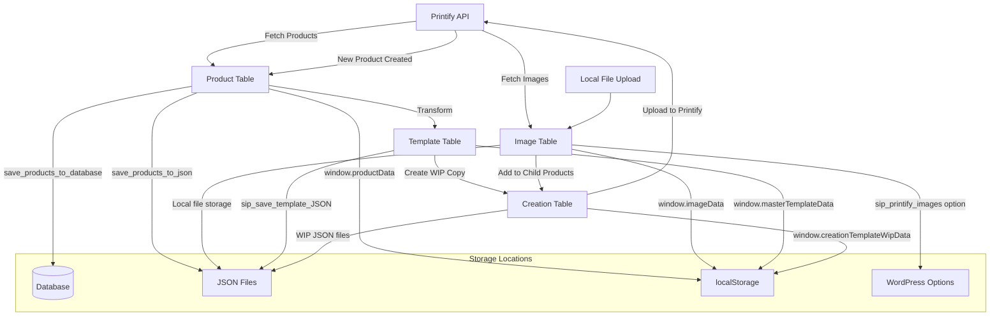

# SiP Plugin - Data Storage and File Handling

This guide documents all data storage and file handling patterns used in SiP plugins.

## Storage Types Overview

SiP plugins use multiple storage mechanisms based on the data type and persistence requirements:

1. **Local Storage** - UI state and temporary data (client-side)
2. **Session Storage** - Temporary session data (client-side)
3. **SQL Database** - Products, events, persistent data (server-side)
4. **Window Object** - Runtime data and state (client-side)
5. **JSON Files** - Products, templates, configurations (server-side)
6. **File System** - Images, uploads, exports, logs (server-side)
7. **WordPress Options** - Plugin settings and configurations (server-side)
8. **WordPress Transients** - Cached data with expiration (server-side)

## 1. Local Storage (Client-Side)

Used for persistent UI state across browser sessions. All data stored under `sip-core` namespace.

### Core State Management System

SiP Core provides a centralized state management system in `/assets/js/core/state.js`:

```javascript
// Register a plugin's state
SiP.Core.state.registerPlugin('sip-printify-manager', {
    'images-table': {},
    'products-table': {},
    'templates-table': {},
    'creation-table': {}
});

// Set state for a feature
SiP.Core.state.setState('sip-printify-manager', 'images-table', {
    actionDropdown: 'delete_local_image',
    expandedRows: ['row-1', 'row-2']
});

// Get state for a feature
const tableState = SiP.Core.state.getState('sip-printify-manager', 'images-table');
```

### Structure
```javascript
{
  "sip-core": {
    "sip-printify-manager": {
      "images-table": {
        "actionDropdown": "add_image_to_new_product",
        "filters": { "location": "Local File" }
      },
      "products-table": {
        "sortOrder": [[2, "asc"]],
        "pageLength": 50
      }
    },
    "sip-woocommerce-monitor": {
      "event-poller": {
        "lastUpdate": "2024-01-01T00:00:00Z",
        "pollingInterval": 5000
      }
    }
  }
}
```

### Implementation Examples

#### Table State Management
```javascript
function trackTableUi() {
    const state = JSON.parse(localStorage.getItem('sip-core')) || {};
    state['sip-printify-manager'] = state['sip-printify-manager'] || {};
    
    state['sip-printify-manager']['products-table'] = {
        actionDropdown: $('#product_action').val() || '',
        expandedRows: Array.from($('.expanded-row')).map(el => el.id),
        filters: getActiveFilters(),
        sortOrder: $('#products-table').DataTable().order()
    };
    
    localStorage.setItem('sip-core', JSON.stringify(state));
}
```

#### DataTables Integration
```javascript
$('#products-table').DataTable({
    stateSave: true,
    stateDuration: -1, // Forever
    stateLoadCallback: function(settings) {
        let savedState = localStorage.getItem("Products_DataTables_" + settings.sInstance);
        return savedState ? JSON.parse(savedState) : {};
    },
    stateSaveCallback: function(settings, data) {
        localStorage.setItem("Products_DataTables_" + settings.sInstance, JSON.stringify(data));
    }
});
```

## 2. Session Storage (Client-Side)

Used for temporary data that expires when the browser tab closes.

### Progress Dialog State
```javascript
// Store progress dialog state
sessionStorage.setItem('sip-progress-dialog-state', JSON.stringify({
    currentStep: 'uploading',
    progress: 45,
    startTime: Date.now()
}));

// Retrieve progress state
const progressState = JSON.parse(sessionStorage.getItem('sip-progress-dialog-state') || '{}');
```

## 3. SQL Database (Server-Side)

WordPress database storage for persistent business data.

### Custom Tables

#### SiP Printify Manager - Products Table
```sql
CREATE TABLE {$wpdb->prefix}sip_printify_products (
    id int(11) NOT NULL AUTO_INCREMENT,
    printify_id varchar(255) NOT NULL,
    title varchar(255) NOT NULL,
    status varchar(50) DEFAULT 'draft',
    type varchar(50) DEFAULT 'product',
    blueprint_id int(11),
    image_url varchar(255),
    full_data longtext,
    created_at datetime DEFAULT CURRENT_TIMESTAMP,
    updated_at datetime DEFAULT CURRENT_TIMESTAMP ON UPDATE CURRENT_TIMESTAMP,
    PRIMARY KEY (id),
    KEY printify_id (printify_id),
    KEY status (status),
    KEY blueprint_id (blueprint_id)
);
```

#### SiP WooCommerce Monitor - Events Table
```sql
CREATE TABLE {$wpdb->prefix}sip_woocommerce_events (
    id mediumint(9) NOT NULL AUTO_INCREMENT,
    event_type varchar(50) NOT NULL,
    product_id mediumint(9),
    product_sku varchar(100),
    product_title text,
    event_data longtext,
    created_at datetime DEFAULT CURRENT_TIMESTAMP,
    PRIMARY KEY (id),
    KEY event_type (event_type),
    KEY product_id (product_id),
    KEY created_at (created_at)
) DEFAULT CHARSET=utf8mb4;
```

### Database Operations

#### Insert Operations
```php
// Insert product
$wpdb->insert(
    $wpdb->prefix . 'sip_printify_products',
    array(
        'printify_id' => $product_id,
        'title' => $product_title,
        'status' => 'published',
        'type' => 'product',
        'blueprint_id' => $blueprint_id,
        'image_url' => $image_url,
        'full_data' => json_encode($product_data)
    ),
    array('%s', '%s', '%s', '%s', '%d', '%s', '%s')
);

// Log event
$wpdb->insert(
    $wpdb->prefix . 'sip_woocommerce_events',
    array(
        'event_type' => 'product_updated',
        'product_id' => $product_id,
        'product_sku' => $sku,
        'product_title' => $title,
        'event_data' => json_encode($event_details)
    )
);
```

#### Query Operations
```php
// Get all published products
$products = $wpdb->get_results(
    "SELECT * FROM {$wpdb->prefix}sip_printify_products 
     WHERE status = 'published' 
     ORDER BY created_at DESC"
);

// Get recent events
$recent_events = $wpdb->get_results($wpdb->prepare(
    "SELECT * FROM {$wpdb->prefix}sip_woocommerce_events 
     WHERE created_at > %s 
     ORDER BY created_at DESC 
     LIMIT 100",
    $since_date
));
```

## 4. Window Object (Client-Side)

Runtime data storage for current session.

### Global Namespace Structure
```javascript
window.SiP = {
    Core: {
        ajax: {},
        utilities: {},
        progressDialog: {},
        state: {}
    },
    PrintifyManager: {
        productActions: {},
        imageActions: {},
        templateActions: {}
    },
    WooCommerceMonitor: {
        eventPoller: {},
        dashboard: {}
    }
};
```

### Common Data Patterns
```javascript
// Template data
window.creationTemplateWipData = {
    path: '/uploads/sip-printify-manager/templates/template-001.json',
    data: {
        template_title: 'Holiday Template',
        print_areas: [],
        child_products: []
    }
};

// Table data cache
window.imageData = [
    { id: '1', name: 'image.jpg', size: 12345, location: 'Local File' }
];

// Configuration
window.shopConfig = {
    api_key: 'encrypted_key',
    shop_id: '12345',
    last_sync: '2024-01-01T00:00:00Z'
};
```

## 5. JSON File Storage (Server-Side)

Used for templates, configurations, and data exports.

### Directory Structure
```
wp-content/uploads/
├── sip-printify-manager/
│   ├── templates/
│   │   ├── template-001.json
│   │   └── template-002.json
│   ├── products/
│   │   ├── product-abc123.json
│   │   └── product-xyz789.json
│   ├── exports/
│   │   └── export-2024-01-01.json
│   └── logs/
│       └── sync-log-2024-01.json
├── sip-development-tools/
│   ├── releases/
│   │   └── release-1.2.3.json
│   └── logs/
│       └── build-log-2024-01.log
```

### JSON Operations

#### Server-Side (PHP)
```php
// Save JSON file
function save_json_file($data, $filename) {
    $upload_dir = wp_upload_dir();
    $plugin_dir = $upload_dir['basedir'] . '/sip-printify-manager/';
    
    if (!file_exists($plugin_dir)) {
        wp_mkdir_p($plugin_dir);
    }
    
    $filepath = $plugin_dir . $filename;
    $result = file_put_contents($filepath, json_encode($data, JSON_PRETTY_PRINT));
    
    return $result !== false;
}

// Load JSON file
function load_json_file($filename) {
    $upload_dir = wp_upload_dir();
    $filepath = $upload_dir['basedir'] . '/sip-printify-manager/' . $filename;
    
    if (!file_exists($filepath)) {
        return null;
    }
    
    $content = file_get_contents($filepath);
    return json_decode($content, true);
}
```

#### Client-Side (JavaScript)
```javascript
// Save JSON via AJAX
async function saveJsonTemplate(templateData) {
    const formData = new FormData();
    formData.append('action', 'sip_save_template');
    formData.append('template_data', JSON.stringify(templateData));
    
    const response = await fetch(ajaxurl, {
        method: 'POST',
        body: formData
    });
    
    return response.json();
}

// Load JSON file
async function loadJsonTemplate(filepath) {
    const response = await fetch(filepath);
    return response.json();
}
```

### Template JSON Structure
```json
{
    "template_title": "Summer Collection Template",
    "template_id": "temp_summer_2024",
    "version": "1.0.0",
    "created_at": "2024-01-01T00:00:00Z",
    "print_areas": [
        {
            "id": "front",
            "placeholder_id": "front_print",
            "placeholders": [
                {
                    "position": 1,
                    "images": [
                        {
                            "id": "img_001",
                            "name": "summer-design.jpg",
                            "src": "/uploads/images/summer-design.jpg",
                            "position": { "x": 0, "y": 0 },
                            "scale": 1.0
                        }
                    ]
                }
            ]
        }
    ],
    "child_products": [
        {
            "title": "Summer Tee - Blue",
            "sku": "SUMMER-TEE-BLU",
            "status": "draft"
        }
    ]
}
```

## 6. File System Operations (Server-Side)

### Upload Handling
```php
function handle_image_upload() {
    if (!isset($_FILES['file']) || !is_uploaded_file($_FILES['file']['tmp_name'])) {
        return ['error' => 'No file uploaded'];
    }
    
    $file_name = sanitize_file_name($_FILES['file']['name']);
    $upload_dir = wp_upload_dir();
    $sip_upload_dir = $upload_dir['basedir'] . '/sip-printify-manager/images/';
    $sip_upload_url = $upload_dir['baseurl'] . '/sip-printify-manager/images/';
    
    // Create directory if it doesn't exist
    if (!file_exists($sip_upload_dir)) {
        wp_mkdir_p($sip_upload_dir);
    }
    
    // Move uploaded file
    $destination = $sip_upload_dir . $file_name;
    if (!move_uploaded_file($_FILES['file']['tmp_name'], $destination)) {
        return ['error' => 'Failed to move uploaded file'];
    }
    
    // Process image
    $image_editor = wp_get_image_editor($destination);
    if (!is_wp_error($image_editor)) {
        // Create thumbnail
        $image_editor->resize(256, 256, true);
        $thumb_path = $sip_upload_dir . 'thumbnails/' . $file_name;
        $image_editor->save($thumb_path);
    }
    
    return [
        'success' => true,
        'url' => $sip_upload_url . $file_name,
        'thumbnail' => $sip_upload_url . 'thumbnails/' . $file_name
    ];
}
```

### Log File Operations
```php
function write_to_log($message, $log_file = 'debug.log') {
    $upload_dir = wp_upload_dir();
    $log_dir = $upload_dir['basedir'] . '/sip-printify-manager/logs/';
    
    if (!file_exists($log_dir)) {
        wp_mkdir_p($log_dir);
    }
    
    $log_path = $log_dir . $log_file;
    $timestamp = date('[Y-m-d H:i:s]');
    $formatted_message = $timestamp . ' ' . $message . PHP_EOL;
    
    return file_put_contents($log_path, $formatted_message, FILE_APPEND | LOCK_EX);
}
```

### CSV Export
```php
function export_products_csv() {
    $upload_dir = wp_upload_dir();
    $export_dir = $upload_dir['basedir'] . '/sip-printify-manager/exports/';
    
    if (!file_exists($export_dir)) {
        wp_mkdir_p($export_dir);
    }
    
    $filename = 'products-export-' . date('Y-m-d-His') . '.csv';
    $filepath = $export_dir . $filename;
    
    $handle = fopen($filepath, 'w');
    
    // Write headers
    fputcsv($handle, ['ID', 'Title', 'SKU', 'Status', 'Price']);
    
    // Write data
    $products = get_products_for_export();
    foreach ($products as $product) {
        fputcsv($handle, [
            $product->id,
            $product->title,
            $product->sku,
            $product->status,
            $product->price
        ]);
    }
    
    fclose($handle);
    
    return $upload_dir['baseurl'] . '/sip-printify-manager/exports/' . $filename;
}
```

## 7. WordPress Options API (Server-Side)

For plugin settings and configuration.

### Basic Usage
```php
// Save options
update_option('sip_printify_settings', array(
    'api_key' => $encrypted_key,
    'shop_id' => $shop_id,
    'sync_interval' => 3600,
    'features' => array('auto_sync', 'bulk_edit')
));

// Get options with defaults
$settings = get_option('sip_printify_settings', array(
    'api_key' => '',
    'shop_id' => '',
    'sync_interval' => 3600,
    'features' => array()
));

// Delete options
delete_option('sip_printify_settings');
```

### Autoloaded Options
```php
// For frequently accessed options, use autoload
add_option('sip_core_version', '1.0.0', '', 'yes');
```

## 8. WordPress Transients API (Server-Side)

For cached data with automatic expiration.

### API Response Caching
```php
// Cache API response
$cache_key = 'sip_printify_products_' . md5($query);
$cached_data = get_transient($cache_key);

if ($cached_data === false) {
    // Fetch from API
    $products = fetch_products_from_api($query);
    
    // Cache for 1 hour
    set_transient($cache_key, $products, HOUR_IN_SECONDS);
    
    return $products;
}

return $cached_data;
```

### Temporary Data Storage
```php
// Store temporary processing data
set_transient('sip_import_progress_' . $import_id, array(
    'current' => 150,
    'total' => 500,
    'status' => 'processing',
    'errors' => array()
), 15 * MINUTE_IN_SECONDS);
```

## 9. Data Flow Architecture

### Template and Product Creation Flow



### Template Work-in-Progress (WIP) Workflow

The template system uses a WIP pattern to safely edit templates:

1. **Base Templates**: Stored in `/wp-content/uploads/sip-printify-manager/templates/`
2. **WIP Files**: Temporary copies in `/templates/wip/` during editing
3. **Workflow**:
   - Template selected → WIP created
   - Edits save to WIP file only
   - On save: WIP → Base template
   - On close: WIP deleted

```php
// Create WIP file when loading template
function sip_create_template_wip($template_name) {
    $base_path = wp_upload_dir()['basedir'] . '/sip-printify-manager/templates/';
    $wip_path = $base_path . 'wip/';
    
    if (!file_exists($wip_path)) {
        wp_mkdir_p($wip_path);
    }
    
    $source = $base_path . $template_name . '.json';
    $destination = $wip_path . $template_name . '_wip.json';
    
    return copy($source, $destination);
}
```

## Data Synchronization Patterns

### Local to Remote Sync
```javascript
async function syncLocalToRemote() {
    // Get local data from various sources
    const localStorage = getLocalStorageData();
    const windowData = window.creationTemplateWipData;
    
    // Get remote data
    const remoteData = await fetchRemoteData();
    
    // Compare and sync
    const toUpload = findDifferences(localStorage, remoteData);
    
    for (const item of toUpload) {
        await uploadToRemote(item);
    }
    
    // Update local state
    updateLocalState(remoteData);
}
```

### State Management Class
```javascript
class DataManager {
    constructor() {
        this.localStorage = new Map();
        this.sessionCache = new Map();
        this.dirty = new Set();
    }
    
    get(key, storage = 'local') {
        if (storage === 'session' && this.sessionCache.has(key)) {
            return this.sessionCache.get(key);
        }
        
        if (storage === 'local' && this.localStorage.has(key)) {
            return this.localStorage.get(key);
        }
        
        // Load from actual storage
        const data = this.loadFromStorage(key, storage);
        this.cache(key, data, storage);
        return data;
    }
    
    set(key, value, storage = 'local') {
        if (storage === 'session') {
            this.sessionCache.set(key, value);
            sessionStorage.setItem(key, JSON.stringify(value));
        } else {
            this.localStorage.set(key, value);
            this.dirty.add(key);
            this.scheduleSave();
        }
    }
    
    scheduleSave() {
        if (this.saveTimeout) return;
        
        this.saveTimeout = setTimeout(() => {
            this.saveAll();
            this.saveTimeout = null;
        }, 1000);
    }
}
```

## Security Considerations

1. **Sanitize All Input**: Use WordPress sanitization functions
```php
$filename = sanitize_file_name($_FILES['file']['name']);
$title = sanitize_text_field($_POST['title']);
$data = sanitize_textarea_field($_POST['data']);
```

2. **Validate File Types**: Check MIME types and extensions
```php
$allowed_types = array('jpg', 'jpeg', 'png', 'gif');
$file_type = wp_check_filetype($filename, $allowed_types);
if (!$file_type['type']) {
    wp_die('Invalid file type');
}
```

3. **Encrypt Sensitive Data**: Use encryption for API keys
```php
$encrypted_key = sip_encrypt_data($api_key);
$decrypted_key = sip_decrypt_data($encrypted_key);
```

4. **Use Prepared Statements**: Prevent SQL injection
```php
$results = $wpdb->get_results($wpdb->prepare(
    "SELECT * FROM {$wpdb->prefix}sip_products WHERE status = %s",
    $status
));
```

5. **Validate JSON**: Check structure before parsing
```javascript
function safeJsonParse(jsonString) {
    try {
        const parsed = JSON.parse(jsonString);
        // Validate expected structure
        if (!parsed.template_id || !parsed.print_areas) {
            throw new Error('Invalid JSON structure');
        }
        return parsed;
    } catch (error) {
        console.error('JSON parse error:', error);
        return null;
    }
}
```

## Best Practices

1. **Choose Appropriate Storage**
   - UI state → localStorage
   - Temporary data → sessionStorage
   - Business data → Database
   - Files → File system
   - Settings → WordPress Options
   - Cached data → Transients

2. **Implement Proper Error Handling**
```php
try {
    $result = save_product_data($data);
} catch (Exception $e) {
    error_log('Failed to save product: ' . $e->getMessage());
    return new WP_Error('save_failed', 'Could not save product data');
}
```

3. **Use Batch Operations**
```php
// Instead of multiple queries
foreach ($products as $product) {
    $wpdb->insert($table, $product);
}

// Use single batch insert
$values = array();
$placeholders = array();
foreach ($products as $product) {
    $values[] = $product['id'];
    $values[] = $product['title'];
    $placeholders[] = "(%d, %s)";
}

$query = "INSERT INTO $table (id, title) VALUES " . implode(', ', $placeholders);
$wpdb->query($wpdb->prepare($query, $values));
```

4. **Clean Up Old Data**
```php
// Remove old log files
function cleanup_old_logs($days = 30) {
    $log_dir = wp_upload_dir()['basedir'] . '/sip-printify-manager/logs/';
    $files = glob($log_dir . '*.log');
    
    foreach ($files as $file) {
        if (filemtime($file) < strtotime("-$days days")) {
            unlink($file);
        }
    }
}
```

5. **Version Control for Data Structures**
```php
// Track schema versions
function update_database_schema() {
    $current_version = get_option('sip_db_version', '0');
    
    if (version_compare($current_version, '1.0', '<')) {
        // Run version 1.0 migrations
        create_products_table();
        update_option('sip_db_version', '1.0');
    }
    
    if (version_compare($current_version, '2.0', '<')) {
        // Run version 2.0 migrations
        add_status_column();
        update_option('sip_db_version', '2.0');
    }
}
```

6. **Implement Data Validation**
```javascript
function validateProductData(data) {
    const required = ['title', 'sku', 'price'];
    
    for (const field of required) {
        if (!data[field]) {
            throw new Error(`Missing required field: ${field}`);
        }
    }
    
    if (data.price < 0) {
        throw new Error('Price cannot be negative');
    }
    
    return true;
}
```

7. **Use Caching Strategically**
```php
function get_product_with_cache($product_id) {
    $cache_key = 'sip_product_' . $product_id;
    $product = wp_cache_get($cache_key);
    
    if ($product === false) {
        $product = $wpdb->get_row($wpdb->prepare(
            "SELECT * FROM {$wpdb->prefix}sip_products WHERE id = %d",
            $product_id
        ));
        
        wp_cache_set($cache_key, $product, '', 3600);
    }
    
    return $product;
}
```

## Storage Decision Matrix

| Data Type | Storage Method | Persistence | Access Speed | Use Case |
|-----------|---------------|-------------|--------------|----------|
| UI State | localStorage | Permanent | Fast | User preferences, table states |
| Session Data | sessionStorage | Tab lifetime | Fast | Temporary UI state |
| Business Data | Database | Permanent | Medium | Products, orders, events |
| Runtime Data | Window Object | Page lifetime | Fastest | Current working data |
| Config Files | JSON Files | Permanent | Slow | Templates, exports |
| Media Files | File System | Permanent | Slow | Images, documents |
| Settings | WP Options | Permanent | Fast | Plugin configuration |
| Cache | Transients | Temporary | Fast | API responses, calculations |