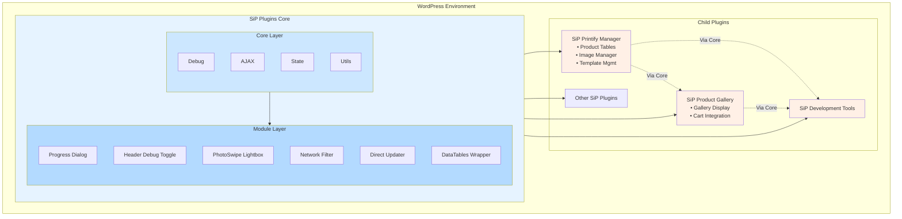
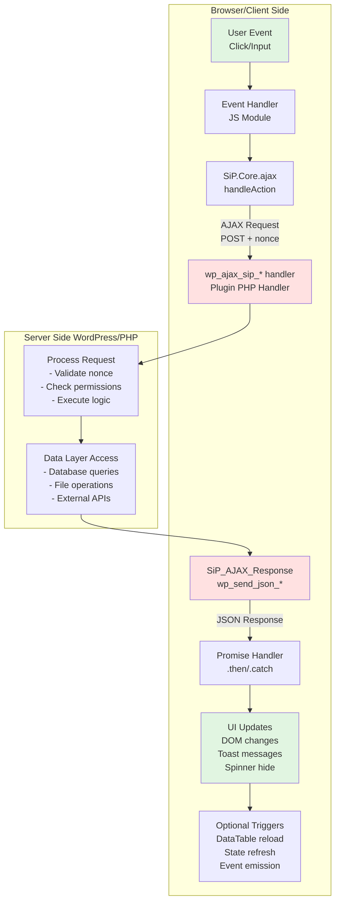
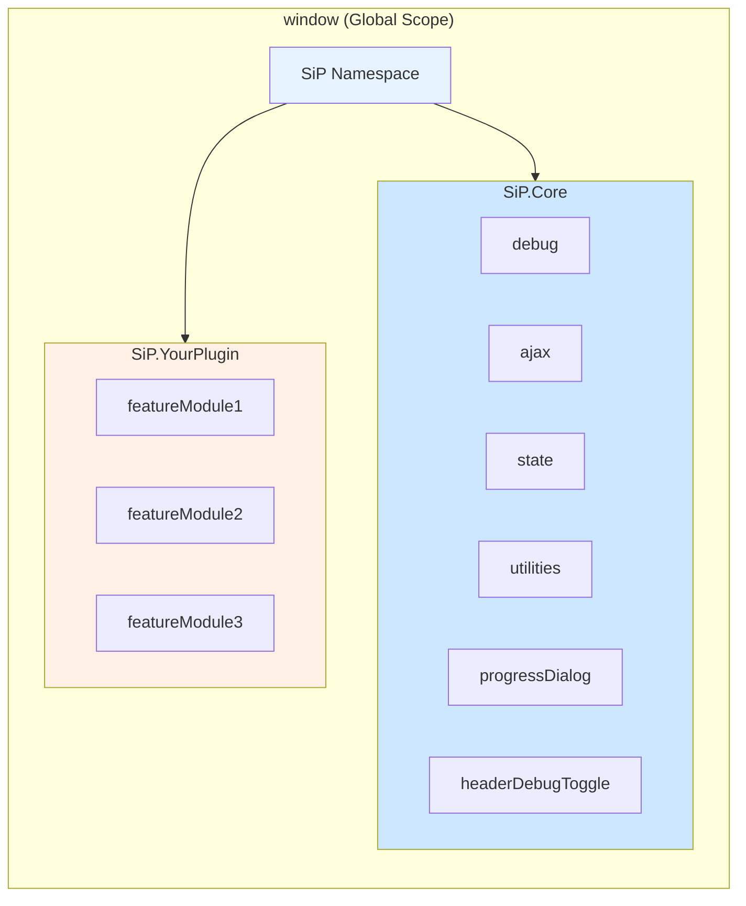

# SiP Plugins Platform Guide

## Overview

The SiP Plugins Platform is a centralized architecture for all SiP plugins that provides automatic loading of core features, utilities, and dependencies. This guide explains how the platform works and how to use it effectively in child plugins.

## Key Principles

1. **Central Loading**: All core scripts are loaded by the platform automatically
2. **Zero Duplication**: Child plugins never load core scripts themselves
3. **Direct Feature Access**: Child plugins access core features directly through the global namespace
4. **Dependency Management**: Core features have proper dependencies defined and loading order

## Platform Architecture



## Why This Architecture

The SiP platform architecture solves specific WordPress plugin development challenges:

### 1. **Centralized Core (One Plugin to Rule Them All)**
WordPress loads each plugin independently, leading to:
- **Problem**: Duplicate code across plugins (each loading jQuery, utilities, etc.)
- **Solution**: Core plugin loads shared resources once, child plugins use them
- **Benefit**: 10 SiP plugins = 1 set of core utilities, not 10 copies

### 2. **Layered Architecture (Core → Modules → Plugins)**
The three-layer design provides:
- **Core Layer**: Fundamental utilities every plugin needs (debug, AJAX, state)
- **Module Layer**: Optional features built on core (progress dialogs, lightboxes)
- **Plugin Layer**: Business logic specific to each plugin's purpose
- **Benefit**: Clear dependencies, no circular references, predictable load order

### 3. **Global Namespace Pattern (`SiP.Core.*`)**
Using a global object because:
- **Problem**: WordPress doesn't have a module system like Node.js
- **Solution**: Organized global namespace prevents conflicts
- **Benefit**: `SiP.Core.ajax` is always available, no import needed

### 4. **Platform Loading (`sip_core_load_platform()`)**
Single function call because:
- **Problem**: Managing script dependencies across plugins is complex
- **Solution**: Core handles all dependency ordering and loading
- **Benefit**: Child plugins just call one function, everything works

### Dependency Flow

All child plugins depend on the Core plugin, which provides:
- Shared JavaScript and CSS assets
- Common PHP utilities and classes
- Centralized storage management
- Update mechanisms

### Directory Structure

```
sip-plugins-core/            # Core plugin with shared functionality
├── assets/                  # Shared assets
│   ├── css/                 # CSS files
│   │   ├── variables.css    # CSS variables
│   │   └── ...
│   ├── js/                  # JavaScript files
│   │   ├── core/            # Core JS modules
│   │   └── modules/         # Feature modules
│   └── images/              # Shared images
├── includes/                # PHP includes
└── sip-plugins-core.php     # Main plugin file

sip-plugin-name/             # Feature plugin
├── assets/                  # Plugin-specific assets
│   ├── css/
│   │   └── modules/         # CSS modules
│   └── js/
│       └── modules/         # JS modules
├── includes/                # PHP includes
├── views/                   # HTML templates
└── sip-plugin-name.php      # Main plugin file
```

### How Scripts Load

The platform uses a central loader function `sip_core_load_platform()` that:

1. Loads all core JavaScript files in the correct dependency order
2. Attaches necessary WordPress data through localization
3. Sets up third-party libraries (DataTables, PhotoSwipe)
4. Runs early in the admin lifecycle to ensure availability

## Available Core Features

The following core features are always available to child plugins. For details on specific core features, see the guides for [AJAX handling](./sip-plugin-ajax.md), [DataTables integration](./sip-feature-datatables.md), and [Progress Dialog](./sip-feature-progress-dialog.md):

### Core Utilities

| Feature | Global Variable | Description |
|---------|----------------|-------------|
| Debug | `SiP.Core.debug` | Centralized debug logging system |
| AJAX | `SiP.Core.ajax` | Standardized AJAX handling |
| State | `SiP.Core.state` | Client-side state management |
| Utilities | `SiP.Core.utilities` | Common utility functions including string normalization, HTML escaping, and UI helpers |

### Module Features

| Feature | Global Variable | Description |
|---------|----------------|-------------|
| Progress Dialog | `SiP.Core.progressDialog` | Standardized progress indicators |
| Header Debug Toggle | `SiP.Core.headerDebugToggle` | Debug mode toggle in admin UI |
| Network Filter Helper | `SiP.Core.networkFilterHelper` | Network request filtering utilities |
| Direct Updater | `SiP.Core.directUpdater` | Plugin update utilities |
| PhotoSwipe Lightbox | `SiP.Core.photoswipeLightbox` | Image lightbox functionality |

### Server-Side Features

| Feature | PHP Function | Description |
|---------|--------------|-------------|
| Storage Manager | `sip_plugin_storage()` | Centralized storage management for folders and database tables |
| Plugin Framework | `SiP_Plugin_Framework::init_plugin()` | Plugin initialization and menu registration |
| AJAX Response | `SiP_AJAX_Response` | Standardized AJAX response formatting |

## Practical Examples

### Using Debug System

```javascript
// Basic debug logging
SiP.Core.debug.log('Starting product sync...');
SiP.Core.debug.normal('Product count:', productCount);
SiP.Core.debug.verbose('Detailed product data:', productData);

// Conditional logging based on debug level
if (SiP.Core.debug.isVerbose()) {
    SiP.Core.debug.log('Extra details only shown in verbose mode');
}
```

### Using AJAX System

```javascript
// Create form data with proper structure
const formData = SiP.Core.utilities.createFormData(
    'sip-your-plugin',
    'product_action',
    'create'
);
formData.append('product_name', 'New Product');

// Send AJAX request
SiP.Core.ajax.handleAjaxAction(
    'sip-your-plugin',
    'product_action',
    formData
).then(response => {
    SiP.Core.utilities.toast.show('Product created!', 3000);
}).catch(error => {
    SiP.Core.utilities.toast.show('Error: ' + error.message, 5000);
});
```

### Using Progress Dialog

```javascript
// Initialize progress dialog
SiP.Core.progressDialog.show('Processing Items', 'Please wait...');
SiP.Core.progressDialog.initialize(totalItems);

// Update progress in loop
items.forEach((item, index) => {
    processItem(item);
    SiP.Core.progressDialog.update(
        index + 1,
        totalItems,
        `Processing ${item.name}...`
    );
});

// Complete and close
SiP.Core.progressDialog.complete('All items processed!');
setTimeout(() => SiP.Core.progressDialog.hide(), 2000);
```

### Using Utility Functions

```javascript
// String normalization
const safeString = SiP.Core.utilities.normalizeString(userInput);

// HTML escaping
const displayText = SiP.Core.utilities.escapeHtml(untrustedContent);

// Show status indicator
SiP.Core.utilities.showSpinner();
// ... do work ...
SiP.Core.utilities.hideSpinner();

// Copy to clipboard
SiP.Core.utilities.copyToClipboard('Text to copy')
    .then(() => console.log('Copied!'))
    .catch(err => console.error('Copy failed:', err));
```

### Third-Party Libraries

All third-party libraries are automatically loaded by the platform and available globally:

| Library | Version | Access | Purpose |
|---------|---------|--------|---------|
| jQuery | WP Core | `$` or `jQuery` | DOM manipulation and events |
| DataTables | 1.11.5 | `$.fn.DataTable` | Advanced table functionality |
| PhotoSwipe | 5.3.3 | `PhotoSwipeLightbox` | Image lightbox galleries |

## How Child Plugins Use the Platform

Child plugins leverage the platform through a simple initialization pattern:

### JavaScript Usage

In child plugin JavaScript files:

1. **DO NOT** check if `SiP.Core` exists - it's guaranteed to be there.
2. **DO** use core features directly without any initialization.
3. **DO** follow the namespace pattern for your own modules.
4. **DO** register success handlers early in your module's lifecycle.

```javascript
// Namespace setup - REQUIRED at top of every module
var SiP = SiP || {};
window.SiP = window.SiP || {};
SiP.YourPlugin = SiP.YourPlugin || {};

// Module definition
SiP.YourPlugin.feature = (function($) {
    const debug = SiP.Core.debug;
    
    function init() {
        debug.log('▶ Module initializing...');
        // Your initialization code
    }
    
    // Public API
    return {
        init: init
    };
})(jQuery);
```

### PHP Usage

In child plugin PHP files:

1. **DO NOT** register or enqueue any core scripts.
2. **DO NOT** check if core features are available - they always are.
3. **DO** only register and enqueue plugin-specific scripts.
4. **DO** register your storage needs with the storage manager.

```php
// Plugin initialization
SiP_Plugin_Framework::init_plugin(
    'Your Plugin Name',
    __FILE__,
    'Your_Plugin_Class'
);

// Register storage configuration on init hook
add_action('init', function() {
    sip_plugin_storage()->register_plugin('your-plugin-slug', array(
    'database' => array(
        'tables' => array(
            // Your table definitions
        )
    ),
    'folders' => array(
        'logs',
        'data',
        // Other folders
    )
));
}, 5); // After storage manager initialization

// Script enqueueing
function enqueue_your_plugin_scripts($hook) {
    if ($hook !== 'your_plugin_page') {
        return;
    }
    
    // DO NOT enqueue core scripts - they're already loaded
    
    // Only enqueue plugin-specific scripts
    wp_enqueue_script(
        'your-plugin-script',
        plugin_dir_url(__FILE__) . 'assets/js/your-script.js',
        array('jquery'), // Only include actual dependencies, no need for core scripts
        filemtime(plugin_dir_path(__FILE__) . 'assets/js/your-script.js'),
        true
    );
}
```

## Important Rules

1. **NEVER** enqueue core scripts in child plugins
2. **ALWAYS** use core features directly - no need to check if they exist
3. **ONLY** enqueue plugin-specific scripts with no unnecessary dependencies
4. **USE** the `SiP.Core` namespace for all core features
5. **MAINTAIN** your plugin's namespace to avoid conflicts
6. **REGISTER** storage needs with `sip_plugin_storage()` - no manual directory creation
7. **AVOID** activation hooks for storage initialization - the storage manager handles it

## Troubleshooting

If core features are not available:

1. Check that SiP Plugins Core is active
2. Verify the page is loaded in the WordPress admin area
3. Check browser console for JavaScript errors
4. Ensure your plugin initializes after the platform is loaded

## Development Guidelines

When extending the platform:

1. Add new core features to the appropriate layer 
2. Update the platform loader to include new scripts
3. Maintain proper dependency chains
4. Document new features in this guide

## Data Flow Architecture



### JavaScript Architecture

The JavaScript architecture follows a modular namespace pattern:



This namespace structure ensures:
- No global scope pollution
- Clear ownership of functionality
- Easy access to core features
- Predictable naming patterns

## Examples from Production Plugins

### SiP Printify Manager Usage

```javascript
// From product-actions.js
SiP.PrintifyManager.productActions = (function($) {
    const debug = SiP.Core.debug;
    
    function deleteProducts(productIds) {
        const formData = SiP.Core.utilities.createFormData(
            'sip-printify-manager',
            'product_action',
            'delete_products'
        );
        formData.append('selected_products', JSON.stringify(productIds));
        
        return SiP.Core.ajax.handleAjaxAction(
            'sip-printify-manager',
            'product_action',
            formData
        );
    }
    
    return {
        deleteProducts: deleteProducts
    };
})(jQuery);
```

### SiP Development Tools Usage

```javascript
// From code-generator.js
SiP.DevelopmentTools.codeGenerator = (function($) {
    function generatePlugin(config) {
        SiP.Core.progressDialog.show('Generating Plugin', 'Creating files...');
        
        // Use core AJAX for server communication
        const formData = SiP.Core.utilities.createFormData(
            'sip-development-tools',
            'generator_action',
            'create_plugin'
        );
        
        // ... generation logic ...
        
        SiP.Core.progressDialog.complete('Plugin generated!');
    }
    
    return {
        generatePlugin: generatePlugin
    };
})(jQuery);
```

## Platform Extension Points

The platform is designed to be extended. To add new core features:

1. **Add to Core Layer** if it's a fundamental utility all plugins need
2. **Add to Module Layer** if it's an optional feature some plugins use
3. **Update Platform Loader** to include your new script in the correct order
4. **Document** the new feature in this guide

## Best Practices

1. **Use Core Features First** - Don't reinvent what the platform provides
2. **Follow Namespace Patterns** - Keep your plugin's code organized
3. **Register Storage Early** - Use the init hook with priority 5
4. **Handle Errors Gracefully** - Use promise chains for AJAX
5. **Debug Responsibly** - Use appropriate debug levels
6. **Document Your Modules** - Help future developers understand your code

## Related Documentation

- [AJAX Implementation Guide](./sip-plugin-ajax.md)
- [DataTables Integration](./sip-feature-datatables.md)
- [Progress Dialog Usage](./sip-feature-progress-dialog.md)
- [Debug System](./sip-development-testing-debug.md)
- [Storage Management](./sip-plugin-data-storage.md)