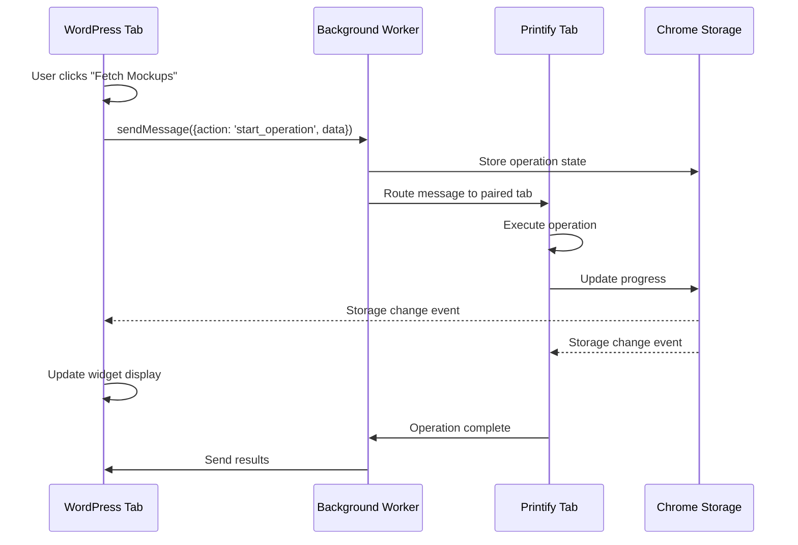

# SiP Printify Manager Browser Extension - Complete Documentation

**Last Updated:** January 21, 2025  
**Purpose:** Consolidated documentation for the SiP Printify Manager browser extension, combining architectural vision, implementation patterns, and development guidelines.

## Important: Documentation as Target Specification

**This document represents the FINAL target state for the browser extension.** It serves as both:
1. The complete feature specification showing how the extension SHOULD work
2. A record of where the current code deviates from these standards

**The refactoring process consists of:**
- Making changes to bring the existing code into alignment with this documentation
- Removing notes about deviations as each issue is resolved
- When complete, this document will accurately describe the working extension

**All patterns, standards, and implementations shown here are the intended final state.**

## Table of Contents

1. [Overview](#overview)
2. [Core Mission & Architecture](#core-mission--architecture)
3. [Development Phases](#development-phases)
4. [Technical Implementation](#technical-implementation)
5. [State Management & Data Flow](#state-management--data-flow)
6. [REST API Implementation](#rest-api-implementation)
7. [Module Pattern & Code Standards](#module-pattern--code-standards)
8. [Message Handling Architecture](#message-handling-architecture)
9. [Implementation Guidelines](#implementation-guidelines)
10. [Testing & Quality Assurance](#testing--quality-assurance)
11. [Refactoring Transition Plan](#refactoring-transition-plan)
12. [Quick Reference](#quick-reference-for-developers)

## Overview

The SiP Printify Manager browser extension serves as a **bridge between WordPress and Printify**, capturing data and enabling functionality that isn't available through Printify's public API. It provides enhanced functionality through a floating widget that appears on both sites.

## Prerequisites for Refactoring

1. Read the current implementation of each file before refactoring
2. Note that current code uses ES6 classes and modern JavaScript
3. The goal is to convert to IIFE pattern while preserving ALL functionality
4. Test each module individually after refactoring
5. Do NOT change message formats, storage keys, or DOM structures

### Key Problem Being Solved

Printify's public API has limitations that prevent full automation of product management. This extension fills those gaps by:
- Scraping mockup data directly from Printify pages
- Monitoring the publish process (which can take significant time)
- Discovering internal APIs that could enhance functionality
- Providing real-time visibility into product status across systems

### Directory Structure

```
browser-extension/
├── manifest.json                    # Extension manifest (V3)
├── main.js                         # Background service worker
├── content-scripts/
│   ├── widget-ui.js               # Main widget UI (SiPWidget.UI)
│   ├── widget-mockup-scraper.js   # Printify data extraction (SiPWidget.MockupScraper)
│   ├── widget-wp-connector.js     # WordPress integration (SiPWidget.WPConnector)
│   ├── widget-marker.js           # Extension presence indicator (SiPWidget.Marker)
│   └── widget-styles.css          # Widget styling
├── modules/
│   ├── widget-debug.js            # Debug logging utility
│   └── widget-message-handler.js  # Central message router
├── message-senders/               # Client-side message senders
│   ├── widget-mockup-messages.js
│   ├── widget-status-messages.js
│   └── widget-navigation-messages.js
├── message-handlers/              # Message processors
│   ├── widget-mockup-handler.js
│   ├── widget-status-handler.js
│   └── widget-navigation-handler.js
├── printify-modules/              # Future modules (Phase 2+)
│   ├── api-interceptor.js
│   ├── data-capture.js
│   └── wordpress-sync.js
└── images/                        # Extension icons and assets
```

### Current State vs. Target State

#### Files That Already Exist (Need Refactoring):
- `main.js` - Background service worker (currently procedural)
- `content-scripts/widget-ui.js` - Uses ES6 class `FloatingWidget`
- `content-scripts/widget-mockup-scraper.js` - Already IIFE but needs namespace
- `content-scripts/widget-wp-connector.js` - Simple IIFE, needs structure
- `content-scripts/widget-marker.js` - Complex inline logic, needs cleanup
- `modules/widget-debug.js` - Exists but needs IIFE pattern

#### Files/Directories to Create:
- `modules/widget-message-handler.js` - New central router
- `message-senders/` - New directory with all sender modules
- `message-handlers/` - New directory with all handler modules

## Core Mission & Architecture

### Architectural Principles

#### 1. **API-First, Extension-Second**
- Always prefer Printify's public API when available
- Use extension only for data/functionality not accessible via API
- Document why each extension feature exists (what API limitation it addresses)

#### 2. **Push-Driven Architecture**
- **NO polling or regular checks** - everything is event-driven
- User actions trigger operations
- State changes propagate via listeners
- Efficient resource usage with no background timers

#### 3. **Progressive Enhancement**
- Core functionality works with minimal features
- Advanced features build on stable foundation
- Each phase delivers standalone value
- No phase depends on future phases

#### 4. **Clear Separation of Concerns**
- **Widget**: Status display and user interaction only
- **Background Worker**: Tab management and message routing
- **Content Scripts**: Page-specific data extraction
- **WordPress Plugin**: Business logic and data storage

#### 5. **Data Persistence Hierarchy**
```
Temporary State (seconds-minutes)
    └─→ Chrome Storage (5MB limit)
        └─→ Operation progress, widget UI state

Operational Data (hours-days)  
    └─→ WordPress Database
        └─→ Operation history, discovered APIs

Business Data (permanent)
    └─→ WordPress Database
        └─→ Products, mockups, lifecycle tracking
```

## Development Phases

### Phase 1: Foundation (Current)
**Goal**: Establish core architecture with mockup fetching

**Deliverables**:
- ✅ Basic widget with status display
- ✅ Tab pairing and navigation
- ✅ Mockup data extraction
- ⬜ Structured state management (Chrome Storage)
- ⬜ Operation history in database
- ⬜ Error handling and recovery

**Success Metrics**:
- Reliable mockup fetching for any product
- Widget state syncs across tabs
- Operations complete without manual intervention

### Phase 2: API Discovery
**Goal**: Identify and document Printify's internal APIs

**Deliverables**:
- Network request interception
- Pattern recognition for API calls
- Automated API documentation
- Usage examples storage
- Security/rate limit detection

### Phase 3: Lifecycle Tracking
**Goal**: Complete visibility of product journey

**Product Lifecycle Stages**:
```
DRAFT_CREATED (WordPress)
    ↓
UPLOADED_TO_PRINTIFY
    ↓
AWAITING_PUBLISH (Manual step currently)
    ↓
PUBLISHING (Long process - needs monitoring)
    ↓
PUBLISHED (In Printify)
    ↓
SYNCING_TO_WC
    ↓
ACTIVE_IN_WC (Final state)
```

### Phase 4: Process Automation
**Goal**: Automate manual steps in product workflow

### Phase 5: WooCommerce Monitor Integration
**Goal**: Unified monitoring across all systems

## Technical Implementation

### System Components

#### 1. Browser Extension Components
- **main.js**: Background service worker for tab management and message routing
- **widget-ui.js**: UI widget that appears on all pages
- **widget-mockup-scraper.js**: Printify-specific data extraction
- **widget-wp-connector.js**: WordPress integration bridge
- **widget-message-handler.js**: Central message routing system

#### 2. WordPress Plugin Integration
```
WordPress Dashboard
    ├─ Triggers operations via postMessage
    ├─ Receives results via REST API
    ├─ Stores data in MySQL database
    └─ Displays aggregated information

REST API Endpoints (Detailed specifications below)
    ├─ /wp-json/sip-printify/v1/mockup-data      # Store scraped mockups
    ├─ /wp-json/sip-printify/v1/extension-status # Update extension status
    ├─ /wp-json/sip-printify/v1/plugin-status    # Check plugin status
    └─ /wp-json/sip-printify/v1/extension-key    # Generate API key
```

#### 3. Data Storage Systems
```sql
-- Core Tables (Phase 1)
wp_sip_printify_products       # Existing product data
wp_sip_printify_mockup_cache   # Mockup storage

-- Extended Tables (Phase 2-3)
wp_sip_printify_api_endpoints  # Discovered API documentation
wp_sip_printify_operations     # Operation history/audit trail
wp_sip_printify_product_lifecycle # Full lifecycle tracking
```

## State Management & Data Flow

### Chrome Storage Structure
```javascript
// Synced across ALL tabs (WordPress and Printify)
chrome.storage.local = {
    sipWidgetState: {
        // UI State
        isExpanded: boolean,
        position: { x: number, y: number },
        
        // Connection State
        isConnected: boolean,
        lastConnectionCheck: timestamp,
        
        // Operation State
        currentOperation: {
            id: string,
            type: 'fetch_mockups' | 'analyze_page' | null,
            status: 'pending' | 'in_progress' | 'complete' | 'error',
            progress: number (0-100),
            message: string,
            startTime: timestamp,
            data: object
        },
        
        // Operation History (size-limited retention)
        operationHistory: [
            {
                id: string,
                type: string,
                status: 'complete' | 'error',
                timestamp: number,
                duration: number, // milliseconds
                message: string,
                errorDetails: string // if status is error
            }
        ]
    },
    
    // Tab Pairing (managed by background script)
    tabPairs: Map<tabId, { partnerTabId: number, partnerUrl: string }>
}
```

### WordPress Context Storage
```javascript
// Only accessible in WordPress admin pages
window.globals = {
    masterTemplateData: array,      // Templates from database
    creationTemplateWipData: object, // Active template being edited
    imageData: array,               // Image library
    productData: array              // Product summaries
}

localStorage['sip-core']['sip-printify-manager'] = {
    // UI preferences per table
    'products-table': { search, sort, filters },
    'templates-table': { expandedItems, view },
    'images-table': { displayMode, pageSize },
    // ... other UI state
}
```

### Data Flow Patterns

#### WordPress → Printify Operations


#### State Synchronization Implementation
```javascript
// Initiate from WordPress
function startMockupFetch(productId, blueprintId) {
    const operation = {
        id: crypto.randomUUID(),
        type: 'fetch_mockups',
        status: 'pending',
        progress: 0,
        data: { productId, blueprintId },
        startTime: Date.now()
    };
    
    // 1. Update Chrome Storage (syncs to all tabs)
    chrome.storage.local.set({
        sipWidgetState: {
            ...currentState,
            currentOperation: operation
        }
    });
    
    // 2. Send message to execute
    chrome.runtime.sendMessage({
        action: 'execute_operation',
        operation: operation
    });
}

// Listen for state changes (both tabs)
chrome.storage.onChanged.addListener((changes, area) => {
    if (changes.sipWidgetState?.newValue?.currentOperation) {
        updateWidgetDisplay(changes.sipWidgetState.newValue);
    }
});
```

## REST API Implementation

### Authentication Mechanism

The extension uses **Custom API Key Authentication** (not WordPress nonces):

```javascript
// Required header for all requests
headers: {
    'X-SiP-API-Key': 'your-32-character-api-key'
}
```

**Key Details:**
- API keys are 32-character alphanumeric strings generated by WordPress
- Stored in WordPress options table as `sip_extension_api_key`
- Validated by `sip_validate_extension_request()` function
- No session cookies or nonces required (allows cross-origin requests from Printify.com)

### Core REST Endpoints

#### 1. Mockup Data Storage
```
POST /wp-json/sip-printify/v1/mockup-data
```

**Request Format:**
```javascript
{
    productId: "123456",
    mockupData: {
        images: [
            {
                url: "https://printify.com/mockup.jpg",
                type: "front",
                printAreaId: "front-print"
            }
        ],
        metadata: {
            blueprintId: "789",
            variantCount: 10
        }
    },
    timestamp: "2025-01-21T10:30:00Z"
}
```

**Success Response:**
```javascript
{
    success: true,
    message: "Mockup data stored successfully",
    stored_count: 5
}
```

**Error Response:**
```javascript
{
    code: "rest_forbidden",
    message: "Invalid API key",
    data: { status: 403 }
}
```

#### 2. Extension Status Update
```
POST /wp-json/sip-printify/v1/extension-status
```

**Request Format:**
```javascript
{
    productId: "123456",    // optional
    status: "fetching" | "complete" | "error",
    error: "Error message", // optional
    timestamp: "2025-01-21T10:30:00Z"
}
```

**Response:**
```javascript
{ success: true }
```

#### 3. Plugin Status Check
```
GET /wp-json/sip-printify/v1/plugin-status
```

**Success Response:**
```javascript
{
    plugin_active: true,
    plugin_version: "4.1.9",
    plugin_name: "SiP Printify Manager"
}
```

**404 Response (plugin deactivated):**
```javascript
{
    code: "rest_no_route",
    message: "No route was found matching the URL and request method",
    data: { status: 404 }
}
```

#### 4. API Key Generation
```
POST /wp-json/sip-printify/v1/extension-key
```

**Request:** No body required (must be authenticated WordPress admin)

**Response:**
```javascript
{
    success: true,
    api_key: "generated-32-character-key"
}
```

### Error Response Standards

All error responses follow WordPress REST API conventions:

```javascript
// HTTP 403 - Authentication Failed
{
    code: "rest_forbidden",
    message: "Invalid API key",
    data: { status: 403 }
}

// HTTP 400 - Bad Request
{
    code: "invalid_param",
    message: "Missing required parameter: productId",
    data: { status: 400 }
}

// HTTP 500 - Server Error
{
    code: "internal_error",
    message: "Failed to process mockup data",
    data: { status: 500 }
}
```

### Client-Side Error Handling Pattern

```javascript
async function callWordPressAPI(endpoint, options) {
    try {
        const response = await fetch(endpoint, {
            ...options,
            headers: {
                'Content-Type': 'application/json',
                'X-SiP-API-Key': config.apiKey,
                ...options.headers
            }
        });
        
        // Check for plugin deactivation
        if (response.status === 404) {
            return { 
                success: false, 
                pluginActive: false, 
                error: 'Plugin deactivated' 
            };
        }
        
        // Check for authentication errors
        if (response.status === 403) {
            return { 
                success: false, 
                error: 'Invalid API key',
                needsReauth: true 
            };
        }
        
        // Check for other HTTP errors
        if (!response.ok) {
            const errorData = await response.json();
            throw new Error(errorData.message || `HTTP ${response.status}`);
        }
        
        const result = await response.json();
        return { success: true, ...result };
        
    } catch (error) {
        // Network errors, timeouts, JSON parse errors
        debug.error('API call failed:', error);
        return { 
            success: false, 
            error: error.message,
            networkError: true 
        };
    }
}
```

### Configuration Management

#### Extension Configuration Storage

Configuration is stored in two locations for redundancy:

1. **Primary: config.json file**
```json
{
    "wordpressUrl": "https://your-site.com",
    "apiKey": "your-32-character-api-key",
    "autoSync": false,
    "configured": true
}
```

2. **Fallback: Chrome Storage Sync**
```javascript
// Store configuration
chrome.storage.sync.set({
    wordpressUrl: "https://your-site.com",
    apiKey: "your-32-character-api-key",
    autoSync: false,
    configured: true
});

// Retrieve configuration
chrome.storage.sync.get(['wordpressUrl', 'apiKey'], (config) => {
    // Use config
});
```

#### Auto-Configuration from WordPress

The WordPress admin embeds configuration in the page for automatic setup:

```javascript
// Embedded in WordPress admin pages
window.sipPrintifyExtensionConfig = {
    apiUrl: "https://your-site.com/wp-json/sip-printify/v1",
    apiKey: "your-32-character-api-key",
    nonce: "wordpress-nonce" // For future use
};
```

### Security Considerations

1. **API Key Security**
   - Generated using WordPress's `wp_generate_password(32, false)`
   - Stored encrypted in WordPress database
   - Never exposed in client-side code or logs
   - Transmitted only via HTTPS in production

2. **Request Validation**
   - All incoming data is validated and sanitized
   - Product IDs are verified against existing records
   - File uploads are validated for type and size

3. **Rate Limiting**
   - Not currently implemented but planned for Phase 2
   - Will track requests per API key per minute

4. **CORS Handling**
   - WordPress REST API automatically handles CORS
   - Extension can call from any origin with valid API key

## Module Pattern & Code Standards

### Required IIFE Module Pattern

All JavaScript files must use the Immediately Invoked Function Expression pattern:

```javascript
/**
 * SiP Widget [Module Name]
 * 
 * [Module description]
 */
var SiPWidget = SiPWidget || {};
SiPWidget.ModuleName = (function() {
    'use strict';
    
    // Debug utility
    const debug = window.widgetDebug || { log: () => {}, error: () => {}, warn: () => {} };
    
    // Private variables
    let isInitialized = false;
    let config = {};
    
    // Private functions
    function loadConfiguration() {
        // Implementation
    }
    
    function attachEventListeners() {
        // Attach all event listeners here
        document.addEventListener('click', handleClick);
        chrome.runtime.onMessage.addListener(handleMessage);
        chrome.storage.onChanged.addListener(handleStorageChange);
    }
    
    // Public functions
    function init() {
        if (isInitialized) {
            debug.warn('Module already initialized');
            return;
        }
        
        debug.log('🟢 ModuleName initializing');
        
        loadConfiguration();
        attachEventListeners();
        
        isInitialized = true;
        debug.log('✅ ModuleName initialized');
    }
    
    // Public API
    return {
        init: init,
        // Only expose necessary public methods
    };
})();

// Initialize when appropriate
if (document.readyState === 'loading') {
    document.addEventListener('DOMContentLoaded', SiPWidget.ModuleName.init);
} else {
    SiPWidget.ModuleName.init();
}
```

### Namespace Convention
- Global namespace: `SiPWidget`
- Module names match file purpose:
  - `widget-ui.js` → `SiPWidget.UI`
  - `widget-mockup-scraper.js` → `SiPWidget.MockupScraper`
  - `widget-wp-connector.js` → `SiPWidget.WPConnector`
  - `widget-marker.js` → `SiPWidget.Marker`

### File Naming Convention
All browser extension JavaScript files use the `widget-` prefix to clearly distinguish them from WordPress plugin files.

## Message Handling Architecture

The browser extension uses Chrome messaging instead of AJAX, but follows the exact same architectural patterns as the WordPress plugin.

### Pattern Comparison
**WordPress AJAX Pattern**:
```
ajax-handler.php (router) → product-actions.js (client) → product-functions.php (handler)
```

**Browser Extension Pattern**:
```
widget-message-handler.js (router) → widget-mockup-messages.js (client) → widget-mockup-handler.js (handler)
```

### Central Message Router
```javascript
var SiPWidget = SiPWidget || {};
SiPWidget.MessageHandler = (function() {
    'use strict';
    
    const debug = window.widgetDebug || { log: () => {}, error: () => {}, warn: () => {} };
    
    // Message type handlers map
    const handlers = {
        'mockup': SiPWidget.MockupHandler,
        'status': SiPWidget.StatusHandler,
        'navigation': SiPWidget.NavigationHandler
    };
    
    function routeMessage(request, sender, sendResponse) {
        debug.log('🔄 Routing message:', request);
        
        const messageType = request.type;
        const handler = handlers[messageType];
        
        if (handler && handler.handle) {
            return handler.handle(request, sender, sendResponse);
        } else {
            debug.error('❌ Unknown message type:', messageType);
            sendResponse({
                success: false,
                error: 'Unknown message type: ' + messageType
            });
            return false;
        }
    }
    
    return {
        route: routeMessage
    };
})();

// Register as Chrome message listener
chrome.runtime.onMessage.addListener(SiPWidget.MessageHandler.route);
```

### Message Format Standards

#### Request Format
```javascript
{
    type: 'mockup',           // Message type (routes to handler)
    action: 'fetch_start',    // Specific action
    data: {                   // Action data
        productId: '123',
        blueprintId: '456'
    }
}
```

#### Response Format
```javascript
// Success
{
    success: true,
    message: 'Operation completed successfully',
    data: { /* response data */ },
    timestamp: 1705847200000
}

// Error
{
    success: false,
    error: 'Error message',
    code: 'ERROR_CODE',
    timestamp: 1705847200000
}
```

### Message Types
```javascript
const MessageTypes = {
    // Operation Control
    OPERATION_START: 'operation_start',
    OPERATION_UPDATE: 'operation_update',
    OPERATION_COMPLETE: 'operation_complete',
    OPERATION_ERROR: 'operation_error',
    
    // Data Transfer
    MOCKUP_FOUND: 'mockup_found',
    API_DISCOVERED: 'api_discovered',
    LIFECYCLE_UPDATE: 'lifecycle_update',
    
    // System Control
    TAB_NAVIGATE: 'tab_navigate',
    CONNECTION_STATUS: 'connection_status'
};
```

## Implementation Guidelines

### Widget UI Specifications

#### Required Widget Structure (Top to Bottom):

1. **Header**
   - Title: "SiP Printify Manager"
   - Minimize/Maximize toggle
   - Close button (if appropriate)

2. **Connection Status** (Already Implemented)
   - Visual indicator (green/red dot) based on configuration and plugin status
   - Connection requires: WordPress URL + valid API key
   - Status text shows:
     - "Extension Ready" (on WordPress when connected)
     - "Connected to WordPress" (on Printify when connected)
     - "Not Connected" (when missing configuration)
     - "Plugin not active" (when WordPress plugin is deactivated)
   - "Check Again" button appears when plugin is deactivated

3. **Progress Dialog Area** (Partially Implemented)
   - **Current Implementation**:
     - Progress bar with percentage display
     - Progress text for status messages
     - Cancel button (UI exists, functionality incomplete)
     - Show/hide progress methods
   - **To Be Enhanced**:
     - Initial state with user options/confirmation
     - Multi-step operation support
     - Final state with results/actions
     - State machine for operation flow

4. **Action Buttons**
   - **Tab Switch Button** (Already Implemented)
     - Shows "Go to WordPress" when on Printify
     - Shows "Go to Printify" when on WordPress
     - Navigates to configured WordPress URL or Printify products page
     - Creates new tab if target site not already open
   - **History Button** (To be implemented)
     - Will show operation history in simple formatted display
   - **Check Extension Button** (WordPress only, already implemented)
     - Appears on WordPress admin pages
     - Verifies extension is properly connected
   - Additional buttons may be added as features are developed

#### Widget Behavior Requirements:

1. **Persistence**: 
   - Widget position stored in Chrome Storage (persists across browser sessions)
   - UI state (expanded/collapsed) persists per session
   - Operation history retained based on storage thresholds

2. **Synchronization**: 
   - Widget instances on different tabs stay in sync via Chrome Storage
   - State updates debounced to prevent excessive storage writes
   - Visual updates occur within 100ms of state change

3. **Non-Intrusive**: 
   - Widget has z-index of 999999 to stay on top
   - Drag boundaries prevent widget from leaving viewport
   - Click-through to page elements when widget is collapsed

4. **Responsive**: 
   - Minimum viewport: 320px width
   - Widget scales down on mobile devices
   - Touch-friendly drag handles for mobile

#### Widget Implementation Details:

**Drag Behavior & Window Scaling:**
```javascript
// Constrain widget to viewport with window resize handling
function constrainToViewport(x, y) {
    const widget = document.querySelector('.sip-widget');
    const rect = widget.getBoundingClientRect();
    const maxX = window.innerWidth - rect.width;
    const maxY = window.innerHeight - rect.height;
    
    return {
        x: Math.max(0, Math.min(x, maxX)),
        y: Math.max(0, Math.min(y, maxY))
    };
}

// Revalidate position on window resize
window.addEventListener('resize', debounce(() => {
    const currentPos = getWidgetPosition();
    const validPos = constrainToViewport(currentPos.x, currentPos.y);
    
    if (validPos.x !== currentPos.x || validPos.y !== currentPos.y) {
        updateWidgetPosition(validPos);
    }
}, 100));
```

**SPA Navigation Handling:**
```javascript
// Monitor for Printify SPA route changes
let lastUrl = location.href;
new MutationObserver(() => {
    const url = location.href;
    if (url !== lastUrl) {
        lastUrl = url;
        handleRouteChange(url);
    }
}).observe(document, { subtree: true, childList: true });
```

**Storage Management:**
```javascript
// Chrome Storage usage monitoring (5MB limit shared with other features)
async function checkStorageUsage() {
    const usage = await chrome.storage.local.getBytesInUse();
    const limit = chrome.storage.local.QUOTA_BYTES; // 5,242,880 bytes
    const percentUsed = (usage / limit) * 100;
    
    // Conservative threshold to leave room for other features
    if (percentUsed > 50) {
        await pruneOperationHistory();
    }
    
    return { usage, limit, percentUsed };
}

// Prune operation history based on size
async function pruneOperationHistory() {
    const state = await chrome.storage.local.get('sipWidgetState');
    const operations = state.sipWidgetState?.operationHistory || [];
    
    // Keep removing oldest operations until under size limit
    while (operations.length > 10) { // Keep minimum 10 operations
        const currentSize = JSON.stringify(operations).length;
        const targetSize = 100000; // ~100KB for operation history
        
        if (currentSize <= targetSize) break;
        
        operations.shift(); // Remove oldest
    }
    
    await chrome.storage.local.set({
        'sipWidgetState.operationHistory': operations
    });
}
```

**History Log Display:**
```javascript
// Simple log viewer without external dependencies
function showOperationHistory() {
    chrome.storage.local.get(['sipWidgetState'], (result) => {
        const operations = result.sipWidgetState?.operationHistory || [];
        
        const popup = document.createElement('div');
        popup.className = 'sip-widget-log-popup';
        popup.innerHTML = `
            <div class="sip-log-header">
                <h3>Operation History</h3>
                <button class="sip-log-close">×</button>
            </div>
            <div class="sip-log-content">
                ${formatOperationsAsTable(operations)}
            </div>
        `;
        
        document.body.appendChild(popup);
        
        // Attach close handler
        popup.querySelector('.sip-log-close').addEventListener('click', () => {
            popup.remove();
        });
    });
}

function formatOperationsAsTable(operations) {
    if (operations.length === 0) {
        return '<p class="sip-log-empty">No operations recorded</p>';
    }
    
    return `
        <table class="sip-log-table">
            <thead>
                <tr>
                    <th>Time</th>
                    <th>Operation</th>
                    <th>Status</th>
                    <th>Duration</th>
                </tr>
            </thead>
            <tbody>
                ${operations.reverse().map(op => `
                    <tr class="sip-log-${op.status}">
                        <td>${new Date(op.timestamp).toLocaleTimeString()}</td>
                        <td>${op.type}</td>
                        <td>${op.status}</td>
                        <td>${op.duration ? op.duration + 'ms' : '-'}</td>
                    </tr>
                `).join('')}
            </tbody>
        </table>
    `;
}
```

**CSS for Log Display:**
```css
.sip-widget-log-popup {
    position: fixed;
    top: 50%;
    left: 50%;
    transform: translate(-50%, -50%);
    background: white;
    border: 1px solid #ccc;
    border-radius: 4px;
    box-shadow: 0 2px 10px rgba(0,0,0,0.1);
    max-width: 600px;
    max-height: 400px;
    z-index: 1000000;
}

.sip-log-header {
    padding: 10px 15px;
    border-bottom: 1px solid #eee;
    display: flex;
    justify-content: space-between;
    align-items: center;
}

.sip-log-content {
    padding: 15px;
    overflow-y: auto;
    max-height: 300px;
}

.sip-log-table {
    width: 100%;
    border-collapse: collapse;
    font-size: 12px;
}

.sip-log-table th,
.sip-log-table td {
    padding: 5px 10px;
    text-align: left;
    border-bottom: 1px solid #eee;
}

.sip-log-complete { color: #28a745; }
.sip-log-error { color: #dc3545; }
.sip-log-pending { color: #ffc107; }
```

### Error Handling Strategy

```javascript
// Every operation follows this pattern
async function executeOperation(operation) {
    try {
        // Update state: pending
        await updateOperationState(operation.id, 'pending');
        
        // Execute with timeout
        const result = await withTimeout(
            performOperation(operation),
            30000 // 30 second timeout
        );
        
        // Update state: complete
        await updateOperationState(operation.id, 'complete', result);
        
    } catch (error) {
        // Update state: error
        await updateOperationState(operation.id, 'error', null, error);
        
        // Determine if retryable
        if (isRetryable(error)) {
            await scheduleRetry(operation);
        }
    }
}
```

### Event Types and Listeners

#### Chrome Storage Events
```javascript
chrome.storage.onChanged.addListener((changes, areaName) => {
    if (areaName === 'local' && changes.sipWidgetState) {
        const newState = changes.sipWidgetState.newValue;
        const oldState = changes.sipWidgetState.oldValue;
        
        // Handle state transitions
        if (newState.currentOperation?.status !== oldState.currentOperation?.status) {
            handleOperationStatusChange(newState.currentOperation);
        }
    }
});
```

#### Message Passing Events
```javascript
// Content Script → Background
chrome.runtime.sendMessage({ action: 'operation_start', data: {...} });

// Background → Content Script
chrome.tabs.sendMessage(tabId, { action: 'execute_operation', data: {...} });

// Cross-origin via postMessage (WordPress page context)
window.postMessage({ source: 'sip-printify-manager', action: 'trigger_fetch' }, '*');
```

#### Tab Lifecycle Events
```javascript
// Tab removed - cleanup pairing
chrome.tabs.onRemoved.addListener((tabId) => {
    cleanupTabPair(tabId);
});

// Tab updated - check if still valid
chrome.tabs.onUpdated.addListener((tabId, changeInfo, tab) => {
    if (changeInfo.status === 'complete') {
        validateTabPair(tabId, tab.url);
    }
});
```

### Security Requirements

1. **API Key Protection**
   - Never store API keys in content scripts
   - Pass through background script only
   - Use secure message channels

2. **Data Validation**
   - Validate all incoming messages
   - Sanitize data before storage
   - Check origin for postMessage

3. **Operation Authorization**
   - Verify operations are user-initiated
   - Implement rate limiting if needed
   - Log suspicious activity

4. **Content Security**
   - Widget should not inject unsafe content
   - Use minimal required permissions in manifest
   - Respect rate limits and ToS

### Performance Considerations

1. **State Updates**
   - Debounce rapid state updates
   - Use Chrome Storage efficiently (5MB limit)
   - Clean up completed operations after success
   - Minimize message payload size

2. **Resource Usage**
   - No polling or regular checks
   - Everything is event-driven
   - Efficient resource usage with no background timers

### Storage Strategy by Data Type

| Data Type | Storage Location | Retention | Size Limit |
|-----------|-----------------|-----------|------------|
| Widget UI State | Chrome Storage | Session | 5MB total |
| Operation Progress | Chrome Storage | During operation | Included in 5MB |
| Operation History | MySQL Database | 30 days | Unlimited |
| Mockup Data | MySQL Database | Permanent | Unlimited |
| API Discoveries | MySQL Database | Permanent | Unlimited |
| Product Lifecycle | MySQL Database | Permanent | Unlimited |

## Testing & Quality Assurance

### Testing Requirements

1. **Unit Tests**
   - Test data extraction functions
   - Test message formatting
   - Test state management

2. **Integration Tests**
   - Test message flow between components
   - Test Chrome storage synchronization
   - Test WordPress API communication

3. **End-to-End Tests**
   - Test complete operations from start to finish
   - Test error scenarios and recovery
   - Test multi-tab synchronization

4. **Cross-Browser Compatibility**
   - Chrome - all versions
   - Firefox - with Chrome API polyfill
   - Edge - Chromium based

5. **Performance Testing**
   - Ensure widget doesn't impact page performance
   - Test with large data sets
   - Monitor memory usage

### Testing Checklist

#### Pre-Refactoring
- [ ] Document current functionality
- [ ] Create test scenarios
- [ ] Backup current working code

#### Post-Module Refactoring
- [ ] Module initializes without errors
- [ ] All event listeners attached properly
- [ ] Public API methods work as expected
- [ ] Private functions remain inaccessible
- [ ] Debug logging works correctly

#### Integration Testing
- [ ] Modules communicate properly
- [ ] Chrome messages route correctly
- [ ] State syncs between tabs
- [ ] Error handling works
- [ ] No memory leaks

### Common Pitfalls to Avoid

1. **Don't expose private functions** - Only return what's needed
2. **Don't use global variables** - Keep everything in module scope
3. **Don't forget error handling** - Every async operation needs try/catch
4. **Don't skip init checks** - Prevent double initialization
5. **Don't ignore memory cleanup** - Remove listeners when needed

### Success Criteria

A properly implemented module will:
1. Follow the IIFE pattern exactly
2. Have clear public/private separation
3. Initialize cleanly with debug output
4. Handle all errors gracefully
5. Integrate with other modules seamlessly
6. Be easy to understand and maintain

## Refactoring Transition Plan

### Clean Break Refactoring Strategy

This refactoring approach emphasizes complete module replacement without backward compatibility code. Each module is fully refactored in a single session while preserving all external interfaces and behaviors.

### Critical Interfaces to Preserve

Before refactoring any module, document these interfaces that MUST remain unchanged:

#### 1. Chrome Message Formats
```javascript
// These message formats must stay exactly the same:
{
    action: 'fetchMockups',
    productId: '123456',
    blueprintId: '789'
}

{
    action: 'updateWidgetState',
    state: { isExpanded: true, position: { x: 100, y: 200 } }
}
```

#### 2. Chrome Storage Keys
```javascript
// These storage keys must remain unchanged:
chrome.storage.local.get(['sipWidgetState', 'tabPairs', 'config'])
chrome.storage.sync.get(['wordpressUrl', 'apiKey'])
```

#### 3. DOM Elements and Classes
```css
/* These selectors must continue to work: */
.sip-widget
.sip-widget-header
.sip-widget-content
#sip-widget-status
```

#### 4. Global Functions/Objects
```javascript
// Any globally exposed functions must maintain same signatures:
window.sipDebug // Now window.widgetDebug but must maintain same API
```

### Module Refactoring Order

Refactor modules in dependency order to avoid breaking interfaces:

#### 1. widget-debug.js (No dependencies)
**Dependencies:** None  
**Used by:** All other modules  
**Preserve:**
- `debug.log()`, `debug.error()`, `debug.warn()` function signatures
- Console output format
- Enable/disable mechanism

#### 2. widget-marker.js (Depends on debug only)
**Dependencies:** widget-debug.js  
**Used by:** WordPress admin pages, widget-wp-connector.js  
**Preserve:**
- DOM marker element creation
- Extension detection mechanism
- Message response format for status checks

#### 3. widget-mockup-scraper.js (Mostly independent)
**Dependencies:** widget-debug.js  
**Used by:** main.js (receives messages from it)  
**Preserve:**
- Scraped data structure format
- Message types sent to background script
- DOM parsing logic for Printify pages

#### 4. widget-wp-connector.js (Interfaces with WordPress)
**Dependencies:** widget-debug.js, widget-marker.js  
**Used by:** WordPress admin pages  
**Preserve:**
- postMessage event formats
- Message handler registration
- WordPress page detection logic

#### 5. main.js (Background service worker)
**Dependencies:** None (service worker)  
**Used by:** All content scripts (message routing)  
**Preserve:**
- Tab pairing data structure
- Message routing behavior
- REST API call formats
- Config loading mechanism

#### 6. widget-ui.js (Most complex, depends on all others)
**Dependencies:** widget-debug.js, all message handlers/senders  
**Used by:** User interaction on all pages  
**Preserve:**
- Widget HTML structure
- Event handler behaviors
- State management patterns
- CSS class names

### Single-Session Refactoring Process

For each module:

1. **Document Current Behavior**
   ```javascript
   // Example for widget-marker.js
   // Current: Creates div#sip-extension-marker
   // Current: Responds to 'checkExtension' messages
   // Current: Returns { installed: true, version: '1.0.0' }
   ```

2. **Extract Interface Contract**
   ```javascript
   // Must maintain:
   // - Element ID: 'sip-extension-marker'
   // - Message response: { installed: boolean, version: string }
   // - No external function calls except debug
   ```

3. **Write Complete IIFE Replacement**
   - One file, one session
   - No compatibility flags
   - No bridge code

4. **Verify Interface Compliance**
   - Same inputs produce same outputs
   - Same DOM elements created
   - Same messages handled

### Testing Without Backward Compatibility

Since there's no gradual migration, testing focuses on interface preservation:

```javascript
// Test that refactored module produces identical results
// Old implementation:
oldResult = oldModule.someFunction(input);

// New implementation must match:
newResult = SiPWidget.ModuleName.someFunction(input);
assert(deepEqual(oldResult, newResult));
```

### Common Pitfalls to Avoid

1. **Don't change message formats** - Even small changes break other modules
2. **Don't rename storage keys** - Would lose user data
3. **Don't alter DOM structure** - CSS and other modules depend on it
4. **Don't modify REST API calls** - WordPress expects specific formats

### Success Criteria

A module is successfully refactored when:
1. It follows IIFE pattern with SiPWidget namespace
2. All original functionality works identically
3. No changes required in any other module
4. Can drop in replacement with zero configuration

### Verification Checklist

After completing all refactoring, verify the extension still:

#### Basic Functionality
- [ ] Widget appears on both WordPress and Printify pages
- [ ] Widget can be dragged and position persists after page reload
- [ ] Widget can be expanded/collapsed with state persisting

#### Connection Status
- [ ] Shows "Connected to WordPress" on Printify when configured
- [ ] Shows "Extension Ready" on WordPress when configured
- [ ] Shows "Not Connected" when missing configuration
- [ ] Shows "Plugin not active" when WordPress plugin is deactivated
- [ ] "Check Again" button appears and works when plugin is deactivated

#### Navigation
- [ ] Tab switch button shows correct text based on current site
- [ ] Tab switch navigates to existing tab or creates new one
- [ ] Navigation works in both directions (WordPress ↔ Printify)

#### Message Routing
- [ ] Messages from WordPress admin trigger actions on Printify tab
- [ ] Progress updates sync between tabs
- [ ] Errors are properly displayed in the widget

#### Data Persistence
- [ ] Widget position saved in Chrome Storage
- [ ] Configuration persists across browser restarts
- [ ] Operation history is maintained (when implemented)

## Quick Reference for Developers

### Starting a New Feature
1. Check which phase it belongs to
2. Verify it addresses an API limitation
3. Follow the architectural principles
4. Use existing patterns and utilities
5. Document the implementation

### Common Patterns
```javascript
// Starting an operation
chrome.storage.local.set({ currentOperation: {...} });
chrome.runtime.sendMessage({ action: MessageTypes.OPERATION_START });

// Updating progress
chrome.storage.local.set({ 
    'currentOperation.progress': percentComplete 
});

// Handling errors
catch (error) {
    await storeError(operation.id, error);
    showUserNotification(error.message);
}
```

### Module Dependencies
```javascript
// Define load order in manifest.json
"js": [
    "modules/widget-debug.js",           // First - debugging
    "modules/widget-message-handler.js", // Second - message routing
    "message-handlers/widget-*.js",      // Third - handlers
    "message-senders/widget-*.js",       // Fourth - senders
    "content-scripts/widget-*.js"        // Last - UI components
]
```

### Cross-Module Communication
```javascript
// Module A sends event
document.dispatchEvent(new CustomEvent('sip-widget-status-change', {
    detail: { status: 'connected' }
}));

// Module B listens
document.addEventListener('sip-widget-status-change', function(event) {
    updateUIForStatus(event.detail.status);
});
```

## Future Considerations

### Potential Features (Not Committed)
- Bulk mockup operations
- Product variant analysis
- Competitive analysis tools
- Advanced template management
- Custom workflow automation

### Technical Debt Prevention
- Regular code reviews against this architecture
- Refactor when deviating from principles
- Document all architectural decisions
- Maintain backwards compatibility
- Version all data structures

### Monitoring and Metrics
- Operation success rates
- API discovery patterns
- Lifecycle bottlenecks
- Error frequency by type
- Performance metrics

---

This consolidated documentation ensures that regardless of who implements features or when they're implemented, the extension will maintain consistency, quality, and alignment with the core mission of bridging WordPress and Printify.

For specific implementation details, refer to the individual code files which follow the patterns and standards outlined in this document.