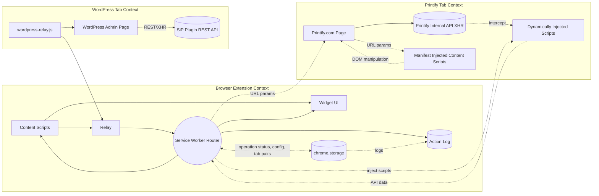
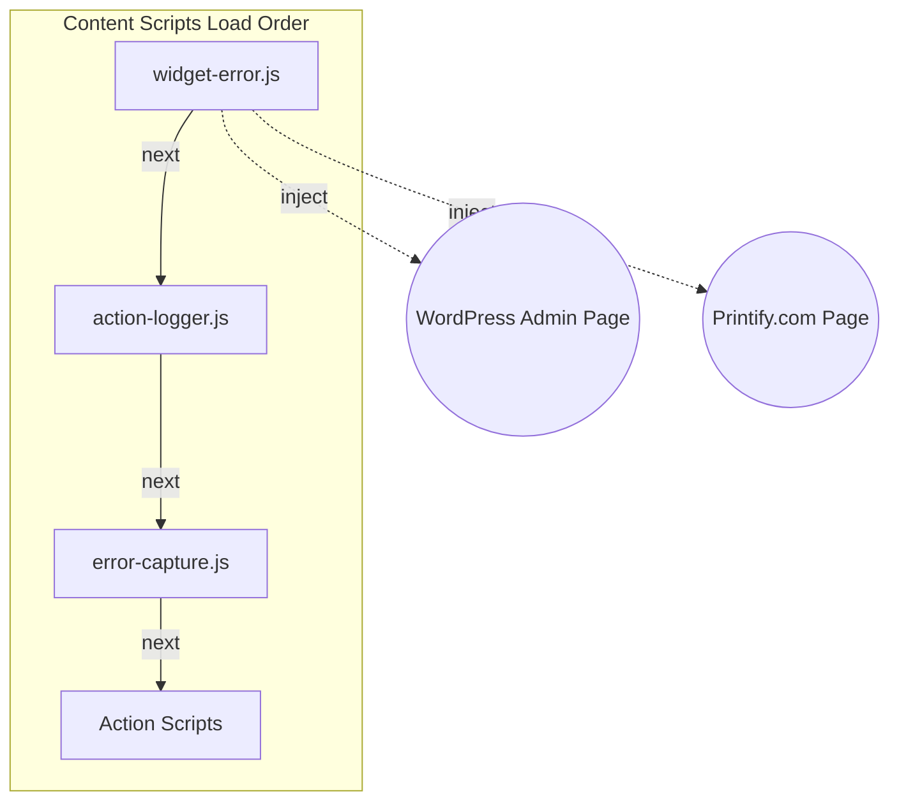
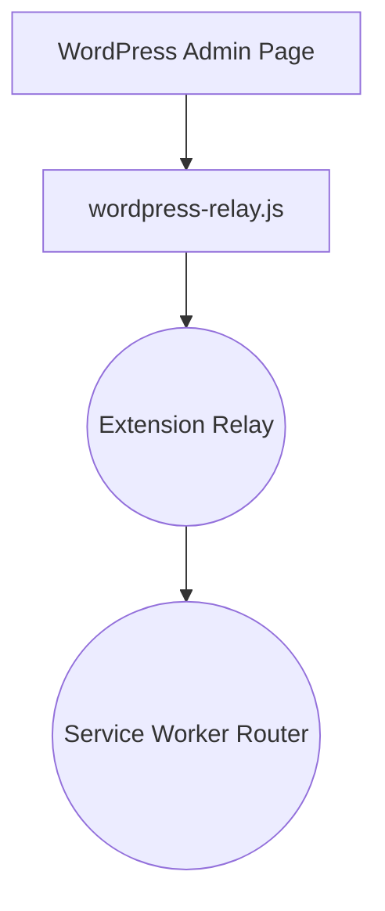
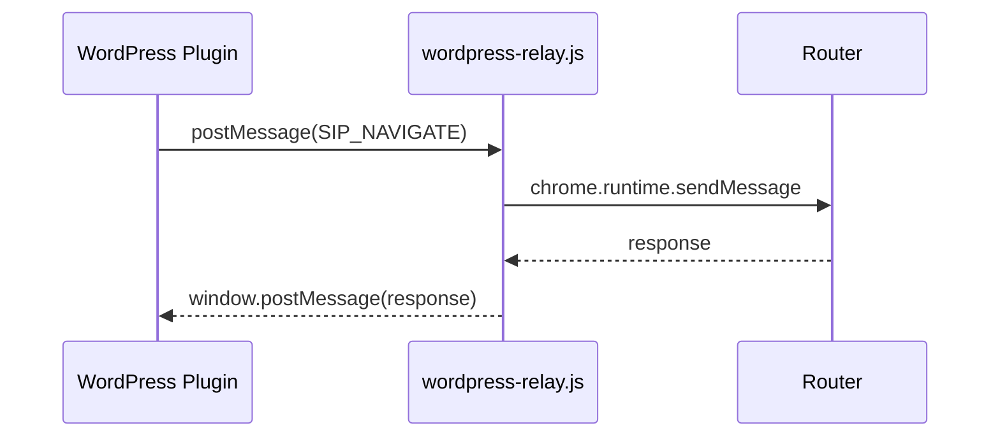
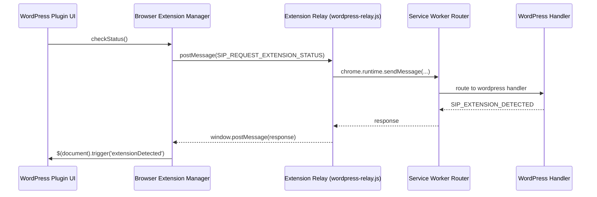
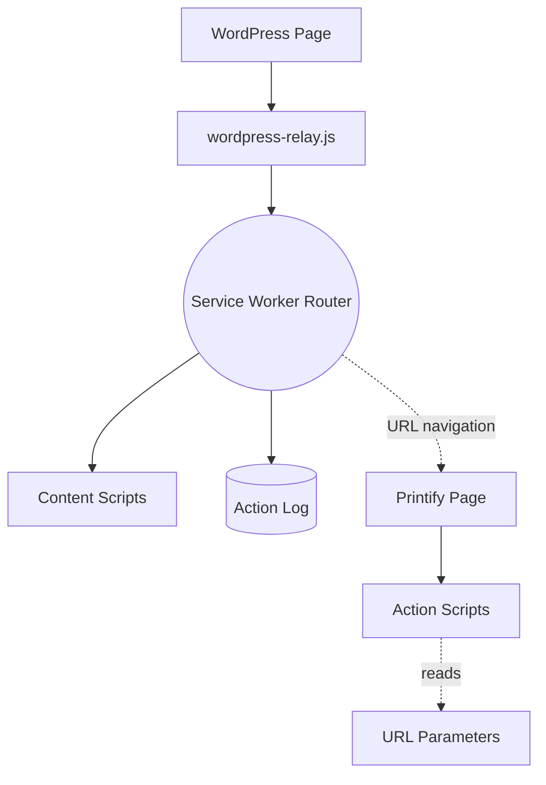
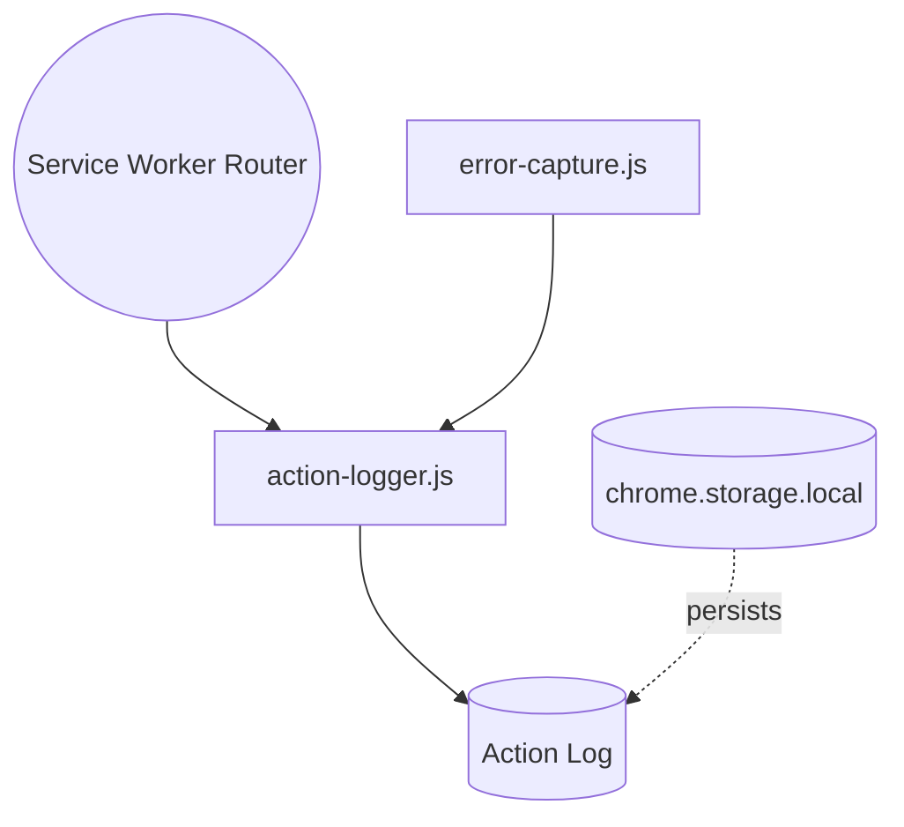
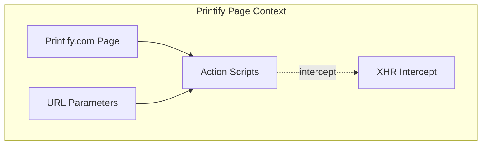
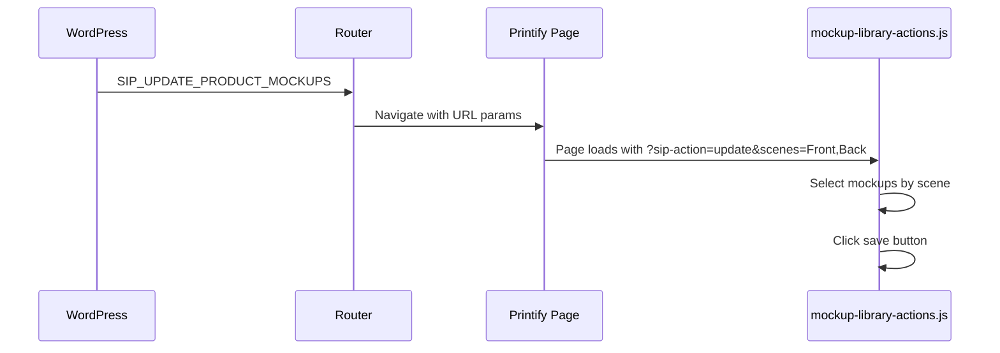

# SiP Printify Manager Extension – Integrated Documentation {#top}

---

### TABLE OF CONTENTS

- [1. Three‑Layer Framework](#three-layer-framework)
- [2. Overview](#overview)
- [3. Architecture](#architecture)
  - [3.1A UI & Content Scripts](#area-ui-content-scripts)
  - [3.1B WordPress Tab Integration](#area-wordpress-tab)
  - [3.1C Background Router & Messaging](#area-router-messaging)
  - [3.1D Storage & Logging](#area-storage-logging)
  - [3.1E Printify Tab Integration](#area-printify-tab)
- [4. Development Guide](#development-guide)
- [5. Author Checklist](#author-checklist)

---

## 1. THREE‑LAYER FRAMEWORK {#three-layer-framework}

Every subsequent section follows SiP’s standard three‑layer model (**WHAT | HOW | WHY**).

### LAYER OVERVIEW {#layer-overview-table}

| Layer    | Purpose                        | Typical Content                 | Mandatory?             |
| -------- | ------------------------------ | ------------------------------- | ---------------------- |
| **WHAT** | Architecture & data‑flow       | Mermaid diagram or outline      | Optional (recommended) |
| **HOW**  | Implementation detail          | Code, mapping tables, sequences | **Yes**                |
| **WHY**  | Design rationale & constraints | ≤ 2 short paragraphs            | **Yes**                |


---

## 2. OVERVIEW {#overview}

### WHAT

The extension links three contexts to automate Printify product management without direct access to the public API:

1. **Browser‑Extension Context** – content scripts, widget UI, relay, and background router.
2. **WordPress Tab Context** – WordPress admin page with relay for extension communication.
3. **Printify Tab Context** – Printify.com page plus internal XHR that content scripts intercept, scrape and pass to the router.

The full‑system diagram in section 4.0 visualises these contexts, data flows, and storage/logging backbones. Features are documented inside their respective Major Areas in section 3 (Architecture).

### WHY

Printify’s public API omits mock‑up images and some product attributes needed for SiP’s automated template creation. The browser extension bridges that gap by harvesting data directly from the live Printify site while staying in sync with the WordPress plugin via in‑page messaging. Keeping the three contexts distinct preserves security boundaries and minimises maintenance risk: each block can evolve independently while the relay and router enforce a stable contract.

---

## 3. ARCHITECTURE {#architecture}

### 3.0 Full‑System Overview (WHAT)



#### WHY


The overview highlights three execution contexts and their interactions:

• **Browser Extension Context** – injected scripts, relay, and background router that coordinate actions.  
• **WordPress Tab Context** – WordPress admin page communicates with extension via relay, and may call the SiP WordPress plugin's REST API for store data.  
• **Printify Tab Context** – the live page, its internal XHR calls, URL‑parameter commands, and DOM that scripts inspect.

Content Scripts declared in manifest.json cannot use chrome.runtime on Printify. However, the router can dynamically inject scripts to intercept API responses and relay data back.

WordPress plugin uses REST for back‑end tasks, separate from the browser extension.

Host permissions are limited to printify.com and wp-admin domains to minimize Chrome Web Store review friction while maintaining necessary access.


### 3.1 Major Areas

| ID | Major Area                    | Maps to Diagram Node                                      |
| -- | ----------------------------- | --------------------------------------------------------- |
| A  | UI & Content Scripts          | `Content Scripts`, `Widget UI`                            |
| B  | WordPress Tab Integration     | `wordpress-relay.js`                                   |
| C  | Background Router & Messaging | `Service Worker Router`                                   |
| D  | Storage & Logging             | `chrome.storage`, `Action Log`                            |
| E  | Printify Tab Integration      | `Printify.com Page`, URL params flow, DOM scraping routes |

Each area will become its own subsection (**WHAT | HOW | WHY**) containing relevant Key Features.

### 3.1A UI & Content Scripts {#area-ui-content-scripts}

> **Bundle definition**  `manifest.json` contains **two** `content_scripts` blocks:
>
> 1. **Printify bundle** – Core scripts (`widget-error.js`, `action-logger.js`, `error-capture.js`) plus action scripts for Printify pages.
> 2. **WordPress bundle** – Core scripts plus `wordpress-relay.js` and widget actions for WP admin pages.

#### WHAT



The bundles load error handling and logging infrastructure first, then inject action-specific scripts for page interactions and widget UI.


#### HOW

| Component           | Responsibility                                               | Key Files                       |
| ------------------- | ------------------------------------------------------------ | ------------------------------- |
| Error Infrastructure | Global error handling and widget error display               | `widget-error.js`               |
| Action Logger       | Logs all actions with timing and categorization              | `action-logger.js`              |
| Error Capture       | Captures and logs uncaught errors and promise rejections     | `error-capture.js`              |
| Widget UI           | Renders floating panel with terminal display                 | `widget-tabs-actions.js`        |
| WordPress Relay     | Handles postMessage communication with WordPress             | `wordpress-relay.js`            |
| Printify Actions    | Handles mockup selection and page automation                 | `mockup-library-actions.js`     |

**Message Flow**

- `SIP_SHOW_WIDGET` – router → content scripts → Widget UI shows.
- `SIP_TERMINAL_APPEND` – router log entry → content scripts → terminal.
- Widget auto-hides after `AUTO_HIDE_MS` (30s) of no new logs.

Key constants:

```javascript
export const TERMINAL_MAX_LINES = 500;
export const WIDGET_Z_INDEX = 2147483000; // stays above site pop‑ups
export const AUTO_HIDE_MS = 30000;       // terminal hides after 30s inactivity
export const LEVEL_COLORS = {
  INFO: '#8ae',
  ERROR: '#e44',
  SUCCESS: '#4e4',
  WARNING: '#ea4'
};
```

#### WHY

A consistent floating widget keeps all extension actions in one place, avoiding separate browser‑action pop‑ups. Injecting via `content_scripts` guarantees that the UI appears automatically on every relevant domain. The terminal gives real‑time feedback critical for long‑running batch operations; capping lines avoids memory leaks.

---

### 3.1B WordPress Tab Integration {#area-wordpress-tab}

#### WHAT



`wordpress-relay.js` is injected on WordPress admin pages. It establishes communication between the WordPress plugin and the extension.

#### HOW

| Component                | Responsibility                                    | Key Files            |
| ------------------------ | ------------------------------------------------- | -------------------- |
| `manifest.json` WP block | Registers scripts for `*/wp-admin/*`              | `manifest.json`      |
| wordpress-relay.js       | Handles postMessage from WP; validates & forwards | `wordpress-relay.js` |
| widget-tabs-actions.js   | Provides floating widget UI on WordPress pages    | `widget-tabs-actions.js` |
| wordpress-handler.js     | Processes WordPress commands in service worker    | `wordpress-handler.js` |

**Sequence**



#### WHY

WordPress admin is the user's command hub. In‑page integration respects WP permissions and provides immediate feedback. Tab pairing prevents actions from targeting the wrong Printify tab, while the relay maintains consistent validation and logging.

**Deep-dive: Extension Detection**



The extension detection pattern uses:
- Two‑stage widget display – content scripts always injected, widget revealed only on `SIP_SHOW_WIDGET`
- Message identification via `source` string (`sip‑printify-extension`)
- Validation chain – origin → source → structure
- Stateless detection – request/response each time; no proactive announcements
- Edge‑case handling – missing `source`, cross‑origin messages, self‑responses

---

### 3.1C Background Router & Messaging {#area-router-messaging}

#### WHAT



WordPress messages pass through wordpress-relay.js to reach the **Service‑Worker Router**. Printify pages operate in isolation due to chrome.runtime restrictions, using URL parameters as the sole communication method. The Router navigates to Printify pages with specific parameters that action scripts read and execute.

#### HOW

| Component               | Responsibility                                                                         | Key Files            |
| ----------------------- | -------------------------------------------------------------------------------------- | -------------------- |
| Service‑Worker Router   | Central switchboard; validates messages; calls handlers; persists logs                 | `widget-router.js`   |
| wordpress‑relay.js      | In‑page relay that validates WP messages and forwards to Router                        | `wordpress-relay.js` |
| Action Scripts          | Handle page-specific actions (mockup selection, product details)                       | `*-actions.js` files |
| Message Handlers        | Process messages by type and execute appropriate actions                               | `*-handler.js` files |

**Message Lifecycle**

**WordPress → Router:**
1. WordPress plugin posts message to window → wordpress-relay.js
2. Relay validates and formats object `{source:'sip', type:'SIP_*', payload}`
3. Relay calls `chrome.runtime.sendMessage` → Router
4. Router dispatches to appropriate handler

**Router → Printify (URL Parameters):**
1. Router navigates to Printify URL with parameters (e.g., `?sip-action=update&scenes=Front,Back`)
2. Printify action scripts read URL parameters on page load
3. Scripts execute requested actions (mockup selection, etc.)
4. No response path - chrome.runtime is blocked for manifest content scripts

**Router → Printify (Data Fetching):**
1. Router navigates to Printify mockup library page
2. Router dynamically injects scripts via `chrome.scripting.executeScript`:
   - Relay script in ISOLATED world (can use chrome.runtime)
   - Interceptor script in MAIN world (captures API responses)
3. Interceptor captures Printify API responses (e.g., `generated-mockup-maps`)
4. Data flows back: Interceptor → postMessage → Relay → chrome.runtime → Router

Key constants:

```javascript
export const MSG_PREFIX = 'SIP_';
export const AUTO_HIDE_MS = 30000; // widget auto-hide timeout
export const TERMINAL_MAX_LINES = 500; // max log entries in UI
```

**Message Type Catalog**

| Type | Direction | Handler | Purpose |
|------|-----------|---------|---------|
| **WordPress Commands** |
| `SIP_REQUEST_EXTENSION_STATUS` | WP → Extension | `wordpress-handler.js` | Check if extension is active |
| `SIP_EXTENSION_DETECTED` | Extension → WP | (response) | Confirms extension presence |
| `SIP_SHOW_WIDGET` | WP → Extension | `widget-data-handler.js` | Display floating widget |
| `SIP_HIDE_WIDGET` | WP → Extension | `widget-data-handler.js` | Hide floating widget |
| `SIP_UPDATE_PRODUCT_MOCKUPS` | WP → Extension | `mockup-update-handler.js` | Batch update mockups |
| `SIP_FETCH_MOCKUPS` | WP → Extension | `mockup-fetch-handler.js` | Fetch mockup data via intercept |
| `SIP_TEST_CONNECTION` | WP → Extension | `wordpress-handler.js` | Test config & connection |
| `SIP_WP_ROUTE_TO_PRINTIFY` | WP → Extension | `wordpress-handler.js` | Navigate to Printify tab |
| **Internal Actions** |
| `SIP_TERMINAL_APPEND` | Internal | `widget-data-handler.js` | Add line to terminal |
| `SIP_TERMINAL_CLEAR` | Internal | `widget-data-handler.js` | Clear terminal content |
| `SIP_TERMINAL_SET_STATE` | Internal | `widget-data-handler.js` | Update terminal state |
| `SIP_SCENE_MAP` | Router → WP | (broadcast) | Available scenes update |
| `SIP_TAB_PAIRED` | Internal | `widget-tabs-actions.js` | Tabs linked successfully |
| `SIP_TAB_REMOVED` | Internal | `widget-tabs-actions.js` | Tab closed, cleanup pair |
| `SIP_OPERATION_PAUSED` | Internal | `action-queue.js` | User paused batch |
| `SIP_OPERATION_RESUMED` | Internal | `action-queue.js` | User resumed batch |
| `SIP_OPERATION_STATUS` | Internal | `widget-data-handler.js` | Update progress display |
| `SIP_STORAGE_UPDATE` | Internal | `widget-data-handler.js` | Sync storage changes |
| `SIP_LOG_ACTION` | Internal | `action-logger.js` | Record action to log |
| `SIP_ERROR_CAPTURED` | Internal | `error-capture.js` | Global error occurred |
| **Printify Data Events** |
| `MOCKUP_API_RESPONSE` | Printify → Router | `mockup-fetch-handler.js` | Intercepted API data |

**Handler Files**

| Handler | Responsibility | Message Types |
|---------|---------------|---------------|
| `mockup-fetch-handler.js` | Fetches mockup data from Printify pages | `SIP_FETCH_MOCKUPS` |
| `mockup-update-handler.js` | Updates mockup selections on products | `SIP_UPDATE_PRODUCT_MOCKUPS` |
| `widget-data-handler.js` | Controls widget UI and terminal | `SIP_SHOW_WIDGET`, `SIP_TERMINAL_*` |
| `printify-data-handler.js` | Processes mockup data fetched from Printify | `SIP_FETCH_MOCKUPS` responses |
| `wordpress-handler.js` | Processes WordPress plugin commands | `SIP_REQUEST_EXTENSION_STATUS`, `SIP_NAVIGATE` |

#### WHY

A single service‑worker router gives one chokepoint for security and observability: every action is validated, logged, and tracked. The router pattern enables clean separation between message sources and handlers, making the extension maintainable as features grow. Enforcing consistent message naming helps debug issues and prevents collisions with other extensions.

---

### 3.1D Storage & Logging {#area-storage-logging}

#### WHAT



All logs—errors or normal actions—flow through `action-logger.js` into a single array **sipActionLogs** stored in `chrome.storage.local`.

#### HOW

| Component              | Responsibility                                                                                     | Key Files                      |
| ---------------------- | -------------------------------------------------------------------------------------------------- | ------------------------------ |
| action-logger.js       | Maintains `sipActionLogs` array; caps at **500** entries; creates hierarchical log entries         | `action-logger.js`             |
| error-capture.js       | Hooks `window.onerror` & promise rejections; forwards to action logger                             | `error-capture.js`             |
| widget-error.js        | Global error handling and error display infrastructure                                             | `widget-error.js`              |

**Data Schema (current implementation)**

```jsonc
{
  "timestamp": 1713012345678,
  "type": "SIP_API_CALL",
  "tabId": 38,
  "category": "navigation",   // one of: wp-action, navigation, api-call, error, etc.
  "payload": { "endpoint": "/v1/products" }
}
```

Stored under key `"sipActionLogs"` as an array. The logger prunes the array to the last **500** entries to keep below Chrome’s 5 MB quota.

**Storage Keys**

*All keys live in chrome.storage unless noted otherwise.*

| Key | Scope | Purpose | Schema | Size/Quota |
|-----|-------|---------|--------|------------|
| `sipActionLogs` | local | Action & error logging | Array of log entries (see above) | Capped at 500 entries |
| `sipStore` | local | Extension state persistence | `{widgetState, tabPairs, operationStatus}` | Max 1MB total |
| `sipQueue` | session | Paused operation queue | Array of pending messages | Cleared on resume |
| `sipWidgetState` | local | Widget UI persistence | `{isVisible, position, terminalContent, terminalState}` | ~1KB |
| `sipTabPairs` | local | WP↔Printify tab mapping | `{[wpTabId]: printifyTabId}` bidirectional | ~500B |
| `sipOperationStatus` | local | Current operation tracking | `{operation, task, progress, state, timestamp}` | ~2KB |
| `fetchStatus_*` | local | Temporary fetch results | `{status, data, timestamp}` per operation | ~50KB each |
| `wordpressUrl` | sync | Cross-device WP URL | String URL | ~100B |
| `apiKey` | sync | Cross-device auth | 32-char string | ~50B |

**Storage Access Patterns**

```javascript
// Local storage (device-specific)
chrome.storage.local.get(['sipStore', 'sipActionLogs'], (result) => {
  const state = result.sipStore || {};
  const logs = result.sipActionLogs || [];
});

// Session storage (tab-specific, cleared on close)
chrome.storage.session.get(['sipQueue'], (result) => {
  const queue = result.sipQueue || [];
});

// Sync storage (cross-device)
chrome.storage.sync.get(['wordpressUrl', 'apiKey'], (result) => {
  const config = { url: result.wordpressUrl, key: result.apiKey };
});
```

#### WHY

A rolling array of the most‑recent 500 events is simple and fast to query while still covering typical batch‑run history. The hierarchical log structure in `action-logger.js` tracks operation start/end times and nesting, making it easy to trace complex workflows. Keeping both functional and error events in the same list gives an immediate chronological view for debugging.

Chrome's storage quotas shape the architecture: `sipStore` is capped at 1MB to leave headroom in the 5MB local quota, while `sipQueue` uses session storage that's automatically cleared on browser restart, preventing stale operations from accumulating. The bidirectional tab mapping in `sipTabPairs` enables instant lookups in either direction without scanning arrays.

---

### 3.1E Printify Tab Integration {#area-printify-tab}

#### WHAT



Content scripts handle mockup selection via URL parameters and intercept XHR requests to capture Printify data.

#### HOW

| Component                  | Responsibility                                                                   | Key Files                                     |
| -------------------------- | -------------------------------------------------------------------------------- | --------------------------------------------- |
| mockup-library-actions.js  | Handles mockup selection on library pages via URL params and DOM manipulation     | `mockup-library-actions.js`    |
| product-details-actions.js | Sets primary/default images on product detail pages                             | `product-details-actions.js`   |
| printify-tab-actions.js    | Monitors Printify pages (minimal functionality due to restrictions)              | `printify-tab-actions.js`      |
| Scene Navigation           | Uses URL params `scenes`, `primaryScene`, `primaryColor` for automation         | Built into mockup actions      |

**URL Parameters**

- `sip-action=update` - Triggers mockup selection automation
- `scenes=Front,Back,Left` - Comma-separated list of scenes to select
- `primaryScene=Front` - Designates primary/default scene
- `primaryColor=Black` - Sets primary color variant

**Sequence (Mockup Selection via URL)**



#### WHY

Printify lacks an official scene API, so intercepting internal XHR and scraping DOM labels delivers the required data without violating site terms. The extension uses two distinct approaches: URL parameter automation for mockup selection (one-way) and dynamic script injection for data extraction (two-way). Dynamic injection bypasses chrome.runtime restrictions by using ISOLATED world scripts as relays. The scene-based selection (Front, Back, etc.) provides a more intuitive interface than raw mockup IDs.

---


<a id="storage-schema"></a>
<a id="message-type-reference"></a>

## 4. DEVELOPMENT GUIDE {#development-guide}

### Adding a New Feature

1. **Register message type** in [3.1C message catalog](#area-router-messaging)
   - Add entry to appropriate section (WordPress Commands, Internal Actions, etc.)
   - Follow `SIP_<VERB>_<NOUN>` naming convention

2. **Add handler** in appropriate handler file
   - Create handler method in relevant `*-handler.js`
   - Register in router's handler map
   - Return `true` for async operations

3. **Emit logs** via action logger
   ```javascript
   // Use the global action object
   action.info('Feature activated', { feature: 'newFeature' });
   action.error('Operation failed', { error: error.message });
   ```

4. **Update documentation**
   - Add feature to relevant section in this file
   - Update message catalog if new messages added
   - Document any new storage keys

---

## 5. AUTHOR CHECKLIST {#author-checklist}

- [ ] Each section follows three-layer framework (WHAT/HOW/WHY)
- [ ] WHAT layer contains architecture diagram or high-level overview
- [ ] HOW layer includes all implementation details from source files
- [ ] WHY layer explains rationale in 2 paragraphs or less
- [ ] All file references verified against actual codebase


[Back to Top](#top)

