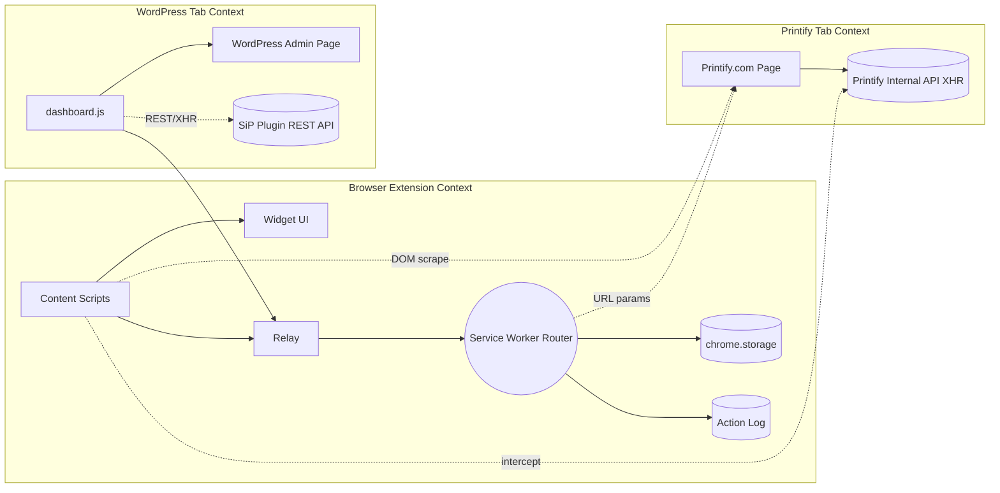
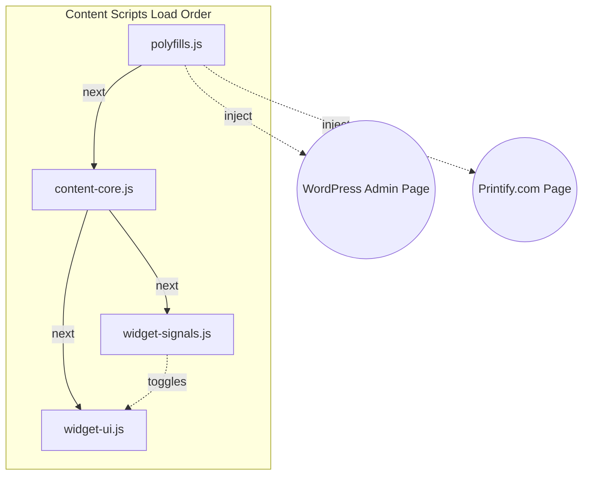
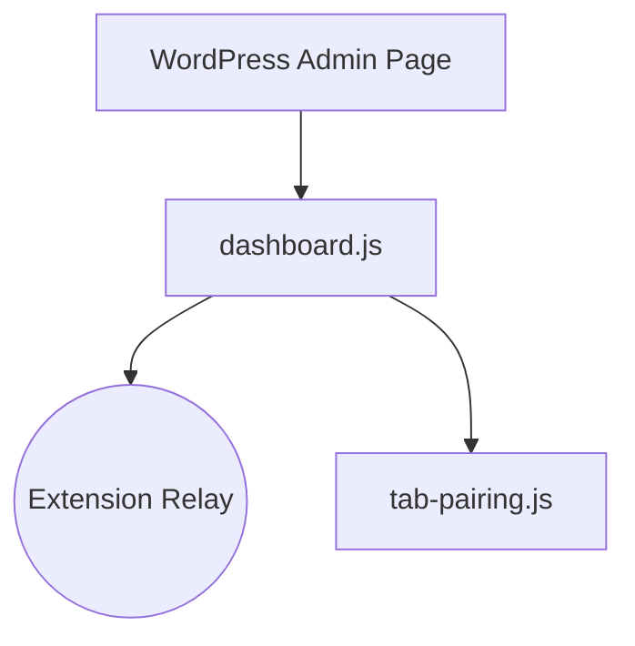
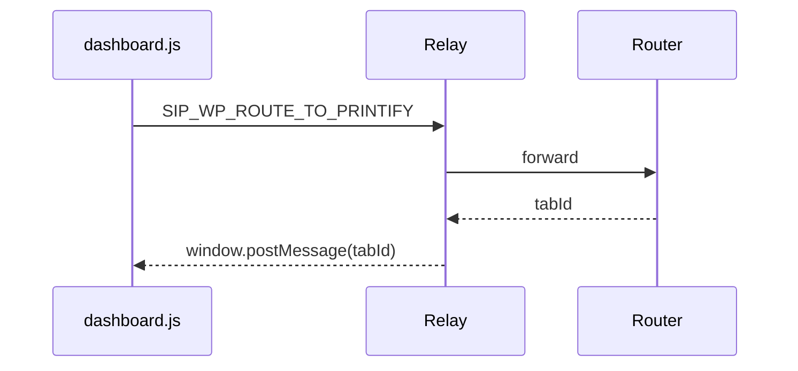
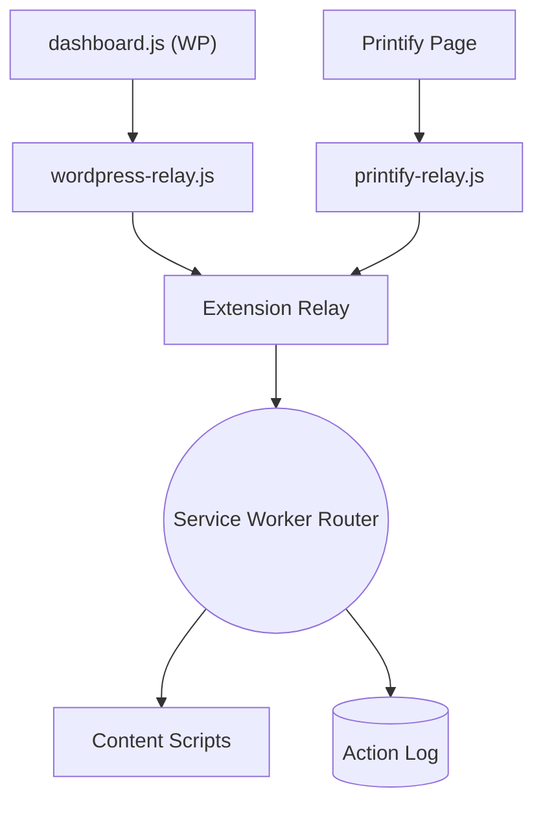
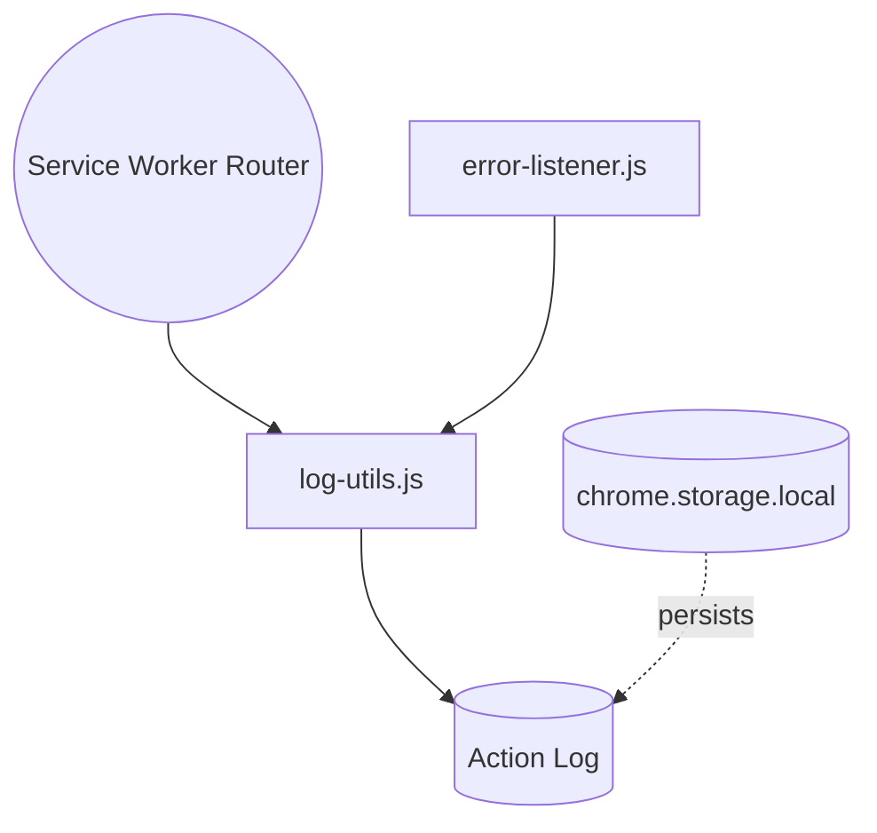
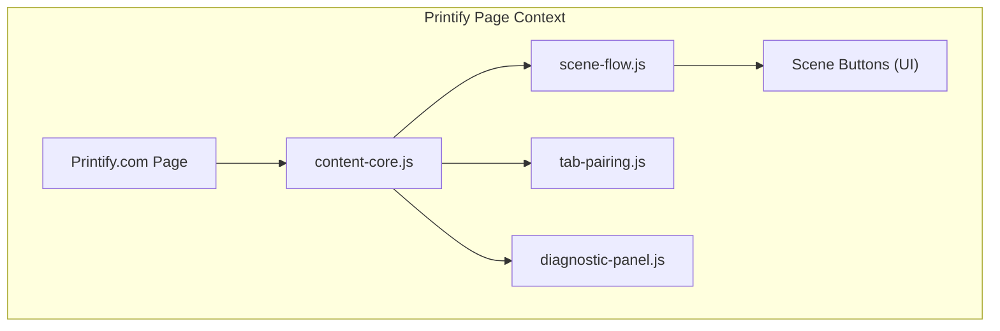
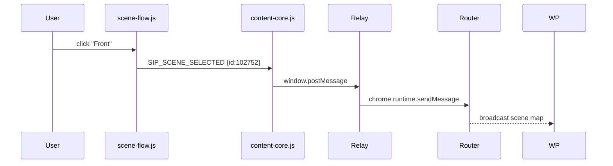
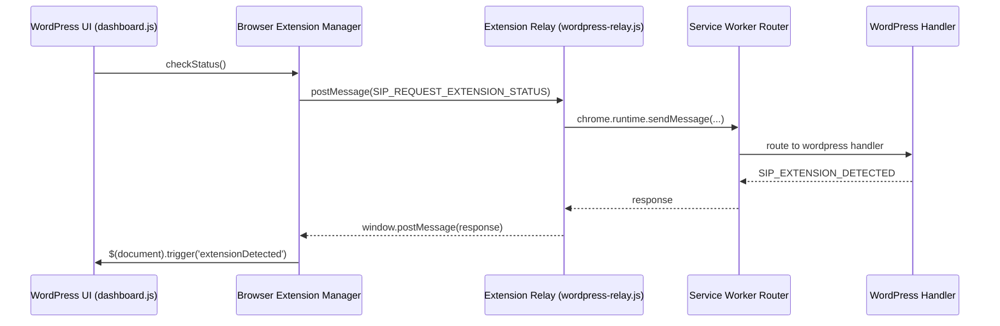

# SiP Printify Manager Extension – Integrated Documentation {#top}

---

### TABLE OF CONTENTS

- [1. Three‑Layer Framework](#three-layer-framework)
- [2. Overview](#overview)
- [3. Key Features](#key-features)
- [4. Architecture](#architecture)
- [5. Implementation Guide](#implementation-guide)
  - [5.1 Extension Detection Pattern (Refactor)](#extension-detection-pattern)
- [6. Storage Schema](#storage-schema)
- [7. Message Type Reference](#message-type-reference)
- [8. Development Quick Reference](#development-quick-reference)
- [9. Author Checklist](#author-checklist)

---

## 1. THREE‑LAYER FRAMEWORK {#three-layer-framework}

Every subsequent section follows SiP’s standard three‑layer model (**WHAT | HOW | WHY**).

### LAYER OVERVIEW {#layer-overview-table}

| Layer    | Purpose                        | Typical Content                 | Mandatory?             |
| -------- | ------------------------------ | ------------------------------- | ---------------------- |
| **WHAT** | Architecture & data‑flow       | Mermaid diagram or outline      | Optional (recommended) |
| **HOW**  | Implementation detail          | Code, mapping tables, sequences | **Yes**                |
| **WHY**  | Design rationale & constraints | ≤ 2 short paragraphs            | **Yes**                |

> **Note**  Legacy material below is being migrated. Sections still in their original form are flagged **TODO** and will be split into WHAT / HOW / WHY in later passes.

---

## 2. OVERVIEW {#overview}

### WHAT

The extension links three contexts to automate Printify product management without direct access to the public API:

1. **Browser‑Extension Context** – content scripts, widget UI, relay, and background router.
2. **WordPress Tab Context** – `dashboard.js` running inside the WP admin page, forwarding store data via the relay.
3. **Printify Tab Context** – Printify.com page plus internal XHR that content scripts intercept, scrape and pass to the router.

The full‑system diagram in section 4.0 visualises these contexts, data flows, and storage/logging backbones.

### WHY

Printify’s public API omits mock‑up images and some product attributes needed for SiP’s automated template creation. The browser extension bridges that gap by harvesting data directly from the live Printify site while staying in sync with the WordPress plugin via in‑page messaging. Keeping the three contexts distinct preserves security boundaries and minimises maintenance risk: each block can evolve independently while the relay and router enforce a stable contract.

---

## 3. KEY FEATURES {#key-features}

Feature index – each feature now appears under its Major Area subsection.

| ID  | Feature                              | Major Area                                                 |
| --- | ------------------------------------ | ---------------------------------------------------------- |
| F1  | Tab Pairing System                   | B. WordPress Tab Integration & E. Printify Tab Integration |
| F2  | Widget Terminal Display              | A. UI & Content Scripts                                    |
| F3  | Pause/Resume Error Recovery          | C. Background Router & Messaging                           |
| F4  | Response Logging Architecture        | D. Storage & Logging                                       |
| F5  | Content Security Policy Compliance   | C. Background Router & Messaging                           |
| F6  | Public API Naming Standards          | C. Background Router & Messaging                           |
| F7  | Scene‑Based Mockup Selection Flow    | E. Printify Tab Integration                                |
| F8  | Scene‑Based Selection Implementation | E. Printify Tab Integration                                |
| F9  | Error Capture System                 | D. Storage & Logging                                       |
| F10 | Action Logging Helper                | D. Storage & Logging                                       |
| F11 | Diagnostic & Monitoring Tools        | E. Printify Tab Integration                                |
| F12 | Action Log Visual Hierarchy          | D. Storage & Logging                                       |

---

## 4. ARCHITECTURE {#architecture}

### 4.0 Full‑System Overview (WHAT)



> **WHY**   The overview highlights three execution contexts and their interactions: • **Browser Extension Context** – injected scripts, relay, and background router that coordinate actions. • **WordPress Tab Context** – `dashboard.js` bridges the admin page and extension, and may call the SiP WordPress plugin’s REST API for store data. • **Printify Tab Context** – the live page, its internal XHR calls, URL‑parameter commands, and DOM that scripts inspect. Content Scripts forward intercepted Printify data to the router; the router never calls the public API. WordPress plugin uses REST for back‑end tasks, separate from the browser extension.

### 4.1 Major Areas

| ID | Major Area                    | Maps to Diagram Node                                      |
| -- | ----------------------------- | --------------------------------------------------------- |
| A  | UI & Content Scripts          | `Content Scripts`, `Widget UI`                            |
| B  | WordPress Tab Integration     | `dashboard.js`, `Relay`                                   |
| C  | Background Router & Messaging | `Service Worker Router`                                   |
| D  | Storage & Logging             | `chrome.storage`, `Action Log`                            |
| E  | Printify Tab Integration      | `Printify.com Page`, URL params flow, DOM scraping routes |

Each area will become its own subsection (**WHAT | HOW | WHY**) containing relevant Key Features.

### 4.1A UI & Content Scripts {#area-ui-content-scripts}

> **Bundle definition**  `manifest.json` contains **two** `content_scripts` blocks:
>
> 1. **Global bundle** (Printify & WP) – `polyfills.js`, `content-core.js`, `widget-ui.js`, `widget-signals.js`.
> 2. **WordPress-only** – `dashboard.js`. Chrome injects the four‑file bundle first, then `dashboard.js` on WP‑admin URLs.

#### WHAT



The bundle loads


#### HOW

| Component           | Responsibility                                               | Key Files                       |
| ------------------- | ------------------------------------------------------------ | ------------------------------- |
| Polyfills Loader    | ES feature shims & safe JS APIs                              | `polyfills.js`                  |
| Content‑Core Bridge | Sets up page listeners; forwards DOM & XHR data to the relay | `content-core.js`               |
| Widget UI           | Renders floating panel; listens to router events             | `widget-ui.js`, `widget-ui.css` |
| Hot‑Reload Helper   | Toggles widget on `SIP_SHOW_WIDGET` / `SIP_HIDE_WIDGET`      | `widget-signals.js`             |

**Message Flow**

- `SIP_SHOW_WIDGET` – router → content scripts → Widget UI shows.
- `SIP_TERMINAL_APPEND` – router log entry → content scripts → terminal.

Key constants:

```javascript
export const TERMINAL_MAX_LINES = 500;
export const WIDGET_Z_INDEX = 2147483000; // stays above site pop‑ups
```

#### WHY

A consistent floating widget keeps all extension actions in one place, avoiding separate browser‑action pop‑ups. Injecting via `content_scripts` guarantees that the UI appears automatically on every relevant domain. The terminal gives real‑time feedback critical for long‑running batch operations; capping lines avoids memory leaks.

---

### 4.1B WordPress Tab Integration {#area-wordpress-tab}

#### WHAT



`dashboard.js` is injected only on WordPress admin pages. It boots the **Tab Pairing System** and relays admin actions to the extension.

#### HOW

| Component                | Responsibility                                    | Key Files            |
| ------------------------ | ------------------------------------------------- | -------------------- |
| `manifest.json` WP block | Registers `dashboard.js` for `*/wp-admin/*`       | `manifest.json`      |
| dashboard.js             | Captures DOM events; sends `SIP_WP_*` messages    | `dashboard.js`       |
| tab-pairing.js (F1)      | Maps WP tab ↔︎ Printify tab via `chrome.sessions` | `tab-pairing.js`     |
| wordpress-relay.js       | Validates & forwards messages to Router           | `wordpress-relay.js` |

**Sequence**



#### WHY

WordPress admin is the user’s command hub. In‑page integration respects WP permissions and provides immediate feedback. Tab pairing prevents actions from targeting the wrong Printify tab, while the relay maintains consistent validation and logging.

---

### 4.1C Background Router & Messaging {#area-router-messaging}

#### WHAT



All page‑generated messages pass through a two‑tier relay chain—context‑specific relay → Extension Relay—before reaching the central **Service‑Worker Router** hub.

#### HOW

| Component               | Responsibility                                                                         | Key Files            |
| ----------------------- | -------------------------------------------------------------------------------------- | -------------------- |
| Service‑Worker Router   | Central switchboard; validates messages; calls handlers; persists logs                 | `widget-router.js`   |
| wordpress‑relay.js      | In‑page relay that validates WP messages and forwards to Router                        | `wordpress-relay.js` |
| printify‑relay.js       | In‑page relay for Printify tab messages (`window.postMessage ↔︎ chrome.runtime`)       | `printify-relay.js`  |
| Pause/Resume Queue (F3) | Holds pending actions when user pauses batch run; persists to `chrome.storage.session` | `action-queue.js`    |
| CSP Helper (F5)         | Injects dynamic Content‑Security‑Policy headers via `chrome.declarativeNetRequest`     | `csp-helper.js`      |
| Naming Standard (F6)    | Enforces `SIP_<VERB>_<NOUN>` on outbound messages; throws error on violation           | `message-utils.js`   |

**Message Lifecycle**

1. Relay receives page event → formats object `{source:'sip', type:'SIP_*', payload}`.
2. Relay `chrome.runtime.sendMessage` → Router.
3. Router validates `source` and `type` with regex `/^SIP_[A-Z_]+$/` (F6).
4. Router dispatches to handler; handler may push log entry (`SIP_TERMINAL_APPEND`).
5. On *Pause* user action, Router stores queue to `chrome.storage.session` and halts dispatch until *Resume*.

Key constants:

```javascript
export const MSG_PREFIX = 'SIP_';
export const PAUSE_KEY = 'sip_queue_paused';
export const CSP_RULE_ID = 9999; // reserved rule id for dynamic CSP
```

#### WHY

A single service‑worker router gives one chokepoint for security and observability: every action is validated, logged, and can be paused/resumed. Dynamic CSP rules let content scripts fetch Printify assets without whitelisting entire domains. Enforcing a strict `SIP_` naming convention prevents accidental collisions with other extensions and makes filtering logs trivial.

---

### 4.1D Storage & Logging {#area-storage-logging}

#### WHAT



All logs—errors or normal actions—flow through `log-utils.js` into a single array **sipActionLogs** stored in `chrome.storage.local`.

#### HOW

| Component              | Responsibility                                                                                     | Key Files                      |
| ---------------------- | -------------------------------------------------------------------------------------------------- | ------------------------------ |
| log-utils.js (F10)     | `createLogEntry(type, payload)`; adds timestamp & tabId; calls `log()` in `action-logger.js`       | `log-utils.js`                 |
| action-logger.js (F4)  | Maintains `sipActionLogs` array; caps at **500** entries; prunes oldest on overflow                | `action-logger.js`             |
| action-queue.js        | Stores/resumes queued commands; serialises to `chrome.storage.session`                             | `action-queue.js`              |
| error-listener.js (F9) | Hooks `window.onerror` & `chrome.runtime.onMessageError`; forwards to `createLogEntry('ERROR', …)` | `error-listener.js`            |
| log-tree.jsx (F12)     | React component that renders collapsible visual hierarchy of the log                               | `log-tree.jsx`, `log-tree.css` |

**Data Schema (current implementation)**

```jsonc
{
  "timestamp": 1713012345678,
  "type": "SIP_API_CALL",
  "tabId": 38,
  "category": "navigation",   // one of: wp-action, navigation, api-call, error, etc.
  "payload": { "endpoint": "/v1/products" }
}
```

Stored under key `"sipActionLogs"` as an array. The logger prunes the array to the last **500** entries to keep below Chrome’s 5 MB quota.

#### WHY

A rolling array of the most‑recent 500 events is simple and fast to query while still covering typical batch‑run history. Centralising entry creation in `log-utils.js` maintains uniform structure, and keeping both functional and error events in the same list gives an immediate chronological view for debugging. Should quota issues arise, daily partitioning can be added later, but the current single‑key design keeps lookup logic trivial.

---

### 4.1E Printify Tab Integration {#area-printify-tab}

#### WHAT



Content scripts inject **Scene Flow UI** for choosing mock‑up scenes, the **Tab‑Pairing helper**, and an optional **Diagnostic Panel** for developers.

#### HOW

| Component                  | Responsibility                                                                   | Key Files                                     |
| -------------------------- | -------------------------------------------------------------------------------- | --------------------------------------------- |
| tab-pairing.js (F1)        | Detects/creates matching Printify tab for active WP tab; listens for `tabremove` | `tab-pairing.js`                              |
| scene-flow\.js (F7)        | Renders scene buttons (Front, Right, Back …) and emits `SIP_SCENE_SELECTED`      | `scene-flow.js`, `scene-flow.css`             |
| mockup-scene-utils.js (F8) | Maps `scene_id` ↔︎ label; intercepts internal XHR to grab mock‑up IDs            | `mockup-scene-utils.js`                       |
| diagnostic-panel.js (F11)  | Dev‑only panel: shows queue length, last error, selected scene                   | `diagnostic-panel.js`, `diagnostic-panel.css` |
| printify-relay.js          | Forwards page messages to Extension Relay; strips large image blobs              | `printify-relay.js`                           |

**Message Types**

- `SIP_SCENE_SELECTED` – Printify tab → Router.
- `SIP_SCENE_MAP` – Router → WordPress tab (scene id ↔︎ label).

**Sequence (Scene Selection)**



#### WHY

Printify lacks an official scene API, so intercepting internal XHR and scraping DOM labels delivers the required data without violating site terms. Scene buttons give users an explicit, error‑proof way to pick mock‑ups, while the same code path feeds the WordPress plugin with consistent IDs. Separating mapping utilities into **mockup-scene-utils.js** lets unit tests cover the logic outside the UI. A lightweight Diagnostic Panel, hidden by default, accelerates support without cluttering the normal interface. Tab pairing mirrors the WP side to ensure each action targets the correct Printify tab, avoiding accidental edits.

---

## 5. IMPLEMENTATION GUIDE {#implementation-guide}

*(Legacy material preserved below – ****TODO****: reorganise using three‑layer model.)*

### 5.1 EXTENSION DETECTION PATTERN (Refactor) {#extension-detection-pattern}

#### WHAT



#### HOW

- Two‑stage widget display – content scripts always injected, widget revealed only on `SIP_SHOW_WIDGET`.
- Message identification via `source` string (`sip‑printify-extension`).
- Validation chain – origin → source → structure.
- Stateless detection – request/response each time; no proactive announcements.
- Edge‑case handling – missing `source`, cross‑origin messages, self‑responses.

| Node                      | Implementation                                                 | File                           |
| ------------------------- | -------------------------------------------------------------- | ------------------------------ |
| Browser Extension Manager | `checkStatus()`, `init()`                                      | `browser-extension-actions.js` |
| Extension Relay           | `validateWordPressMessage()`, `sendWordPressMessageToRouter()` | `wordpress-relay.js`           |
| Router                    | `handleMessage()`                                              | `widget-router.js`             |
| WordPress Handler         | `handle()` (`SIP_REQUEST_EXTENSION_STATUS`)                    | `wordpress-handler.js`         |

#### WHY

Request‑based detection avoids unsolicited chatter and guarantees fresh status. A minimal `source` flag prevents spoofing and prepares for multiple SiP extensions. Splitting validation (relay) from routing builds defence‑in‑depth without duplication.

---

## 6. STORAGE SCHEMA {#storage-schema}

*(Legacy section – ****TODO****: convert to layer format.)*

---

## 7. MESSAGE TYPE REFERENCE {#message-type-reference}

Current documented message types:

- `SIP_REQUEST_EXTENSION_STATUS`
- `SIP_EXTENSION_DETECTED`
- `SIP_SHOW_WIDGET`

*(Full list will be migrated from legacy docs into the Background Router HOW subsection.)*

---

## 8. DEVELOPMENT QUICK REFERENCE {#development-quick-reference}

*(Legacy content from original Section 7 retained – ****TODO****: restructure using three‑layer format.)*

---

## 9. AUTHOR CHECKLIST {#author-checklist}

-

[Back to Top](#top)

