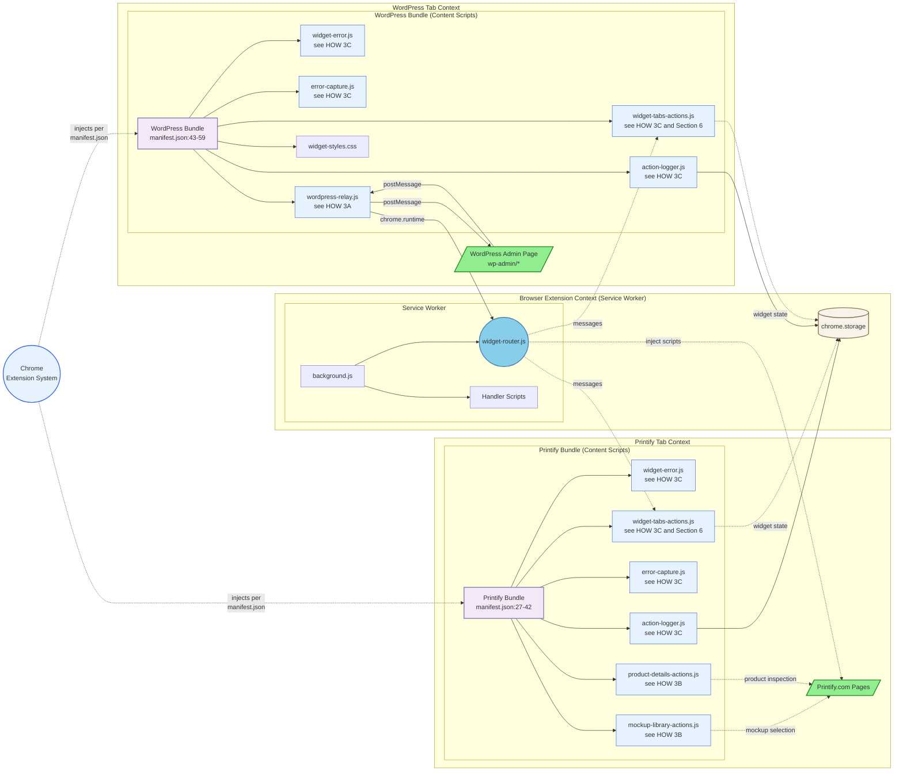
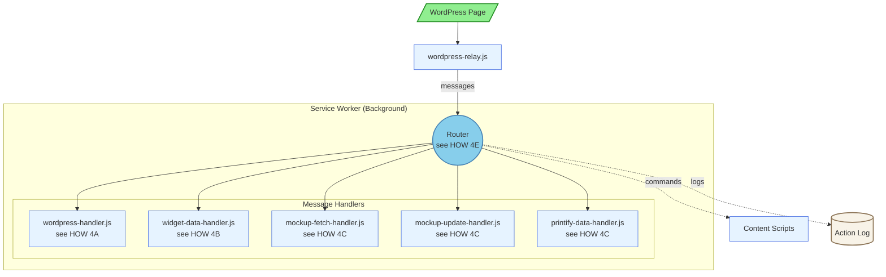
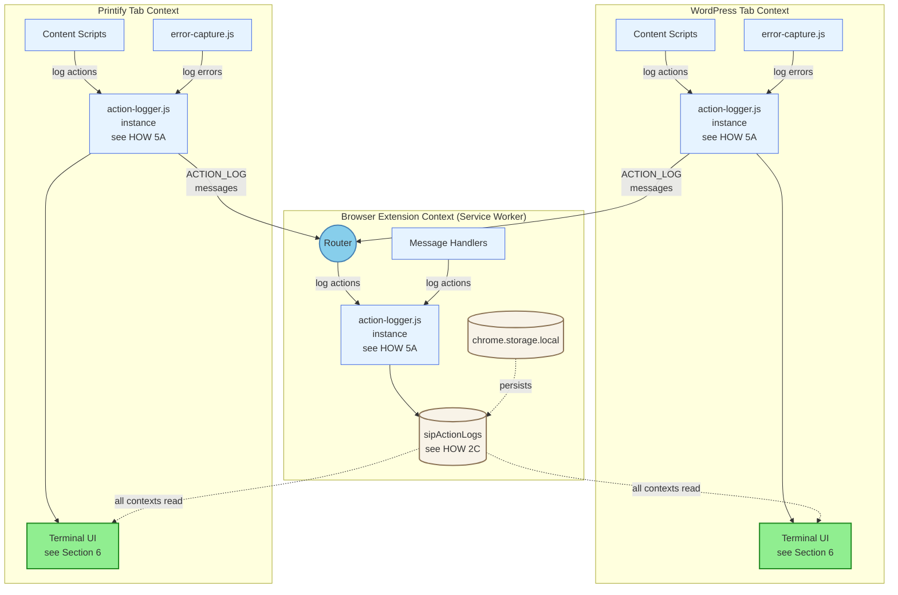
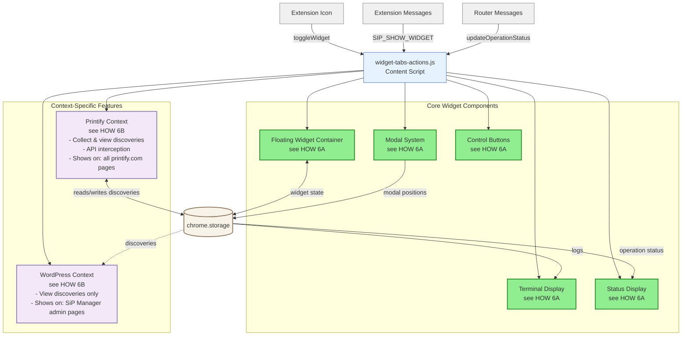

# SiP Printify Manager Extension – Integrated Documentation {#top}

---

### TABLE OF CONTENTS

- [1. Overview](#overview)
- [2. Main Architecture - The Three Contexts](#architecture)
- [3. Content Scripts](#content-scripts)
- [4. Message Handlers](#message-handlers)
- [5. Action Logger](#action-logger)
- [6. Widget UI](#widget-ui)
- [7. Development Guide](#development-guide)
- [8. Author Checklist](#author-checklist)

---

## 1. OVERVIEW {#overview}

### WHAT

The SiP Printify Manager Extension links three contexts to automate Printify product management in ways that are unavailable through the Printify public API:

1. **Browser Extension Context (Service Worker)** – Router, Message Handlers, Storage
2. **WordPress Admin Page Context** – WordPress Admin Page DOM, Widget UI, Content Scripts
3. **Printify Page Context** – Printify Page DOM, Printify Internal API, Widget UI, Content Scripts, Dynamic Scripts

### WHY

Printify’s public API omits mock‑up images and some product attributes needed for SiP’s automated template creation. The browser extension bridges that gap by harvesting data directly from the live Printify site while staying in sync with the WordPress plugin via in‑page messaging. The extension's three context architecture preserves security boundaries and minimises maintenance risk: each context can evolve independently while the relay and router that intermediates between them enforce a stable contract.

---

## 2. MAIN ARCHITECTURE - The Three Contexts {#architecture}

This block documents the extension's full three context architecture and their component parts.  All parts are fully detailed in the linked blocks that follow.

**Diagram 2: Main Architecture**


**Diagram Legend:**

**Color Coding:**
- 🟩 **Green** - User-facing elements (web pages, UI widgets)
- 🔵 **Sky Blue** - Router (central message hub)
- 🔷 **Light Blue** - Script files and code components
- 🟣 **Purple** - Grouping/organizational nodes
- 🟫 **Tan** - Storage components
- 🟡 **Yellow** - External APIs/services
- ⬜ **Gray** - Actions/processes

### HOW

#### 2A The Router

> The Router (`widget-router.js`) is the extension's central message dispatcher, running in the Service Worker context. **All messages pass through the Router** - there are no direct connections between contexts. This single-point message flow ensures consistent validation, logging, and error handling.
> 
> The Router:
> - **Validates** incoming messages for required fields and security
> - **Routes** messages to appropriate handlers based on message type
> - **Wraps Chrome APIs** with consistent error handling
> - **Manages tab pairing** to coordinate WordPress and Printify tabs
> - **Injects scripts** dynamically when manifest-declared scripts can't access needed APIs
> - **Updates extension badge** via chrome.action API to show status (✓ green for success, ! orange for warnings)
> 
> Message flow: Content Scripts → `chrome.runtime.sendMessage()` → Router → Handler → `chrome.tabs.sendMessage()` → Content Scripts
> 
> **Dynamic Script Injection:** The Router uses `chrome.scripting.executeScript()` in two scenarios:
> 1. **API Interception**: When Printify's restrictions prevent manifest-declared content scripts from accessing needed APIs, the Router dynamically injects scripts that can intercept XHR responses and access Printify's internal data structures.
> 2. **Install/Update Events**: During extension install or update (`onInstalled`), the Router injects the full set of content scripts into already-open WordPress and Printify tabs, matching exactly what manifest.json declares for each context. This ensures pre-existing tabs receive complete extension functionality without requiring a page refresh.
> 
> **Pause/Resume System:** The Router includes built-in operation pausing for user intervention:
> - `pauseOperation(tabId, issue, instructions)` - Pauses operation and shows UI with instructions
> - `resumeOperation()` - Resumes when user clicks the resume button in the widget
> - Messages use internal format: `{ type: 'widget', action: 'resumeOperation' }`
> - Automatically focuses the problematic tab and displays pause status in widget
> 
> **Configuration Loading:** The Router attempts to load pre-configuration from `assets/config.json`:
> - Contains optional pre-configured settings: `wordpressUrl`, `apiKey`, `autoSync`, `configured`
> - If `configured: true`, these settings are automatically applied on extension install
> - Falls back to chrome.storage.sync if config.json is unavailable
> - Useful for enterprise deployments with pre-configured extensions

#### 2B Documentation Links

> The following sections detail elements referenced in the Main Architecture Diagram.
>- **Content Scripts** → [Section 3: Content Scripts](#content-scripts-widget-ui)
>- **Message Handlers** → [Section 4: Message Handlers](#message-handlers)
>- **Action Log** → [Section 5: Action Logger](#action-logger)
>- **chrome.storage** → [See HOW 2C below](#storage-how)
>- **Widget UI** → [Section 6: Widget UI](#widget-ui)

#### 2C Storage {#storage-how}

> Chrome provides two storage areas for persisting extension data:
> 
> | API | Scope | Quota | Use Cases |
> |-----|-------|-------|-----------|
> | **chrome.storage.local** | Device-specific | 10MB | Large data, logs, state |
> | **chrome.storage.sync** | Synced across devices | 100KB total, 8KB per item | User settings, config |
> 
> <details>
> <summary>View all storage keys</summary>
> 
> | Key | Scope | Purpose | Schema | Size |
> |-----|-------|---------|----------|------|
> | `sipActionLogs` | local | Action & error logging | Array of log entries (see Section 5) | Capped at 500 entries |
> | `sipWidgetState` | local | Widget UI persistence | `{isVisible, isExpanded, position, terminalContent, terminalState}` | ~1KB |
> | `sipTabPairs` | local | WP↔Printify tab mapping | `{[wpTabId]: printifyTabId}` bidirectional | ~500B |
> | `sipOperationStatus` | local | Current operation tracking | `{state, operation, task, progress, issue, timestamp}` | ~2KB |
> | `sip-extension-state` | local | Extension pause/resume state | `{isPaused, timestamp}` | ~100B |
> | `sipDiscoveries` | local | Printify data discovery catalog | `{api_endpoints[], dom_patterns[], data_structures[]}` (see Section 6D) | ~10KB |
> | `fetchStatus_*` | local | Temporary fetch results | `{status, error, data, timestamp}` per product | ~50KB each |
> | `wordpressUrl` | sync | Cross-device WP URL | String URL | ~100B |
> | `apiKey` | sync | Cross-device auth | String (variable length) | ~50B |
> 
> </details>
> 
> **Storage Access Pattern:**
> ```javascript
> // Read from storage
> chrome.storage.local.get(['sipWidgetState'], (result) => {
>   const state = result.sipWidgetState || {};
> });
> 
> // Write to storage  
> chrome.storage.local.set({
>   sipOperationStatus: { state: 'idle', timestamp: Date.now() }
> });
> ```
> 
> The extension auto-configures on WordPress admin pages by capturing the site URL and storing it in sync storage for cross-device access.

### WHY

Printify blocks Chrome.Runtime so content Scripts declared in manifest.json cannot use chrome.runtime features on the Printify site. However, the router can dynamically inject scripts to intercept API responses and relay data back.

Host permissions are limited to printify.com and wp-admin domains to minimize Chrome Web Store review friction while maintaining necessary access.

Web accessible resources include assets needed across origins: config.json, logo images, loading animation, and widget-styles.css.

---

## 3. Content Scripts {#content-scripts}

Content scripts are JavaScript files injected by Chrome into web pages based on URL patterns defined in manifest.json. They provide the bridge between web pages and the extension's background service worker.

#### WHAT

**Diagram 3: Content Scripts Architecture**

[← Back to Diagram 2: Main Architecture](#architecture)

#### HOW

The Browser Extension Context shows the Service Worker, which is Chrome's background execution environment for the extension. The Service Worker loads background.js, which in turn imports all the handler scripts and the Router via `importScripts()`.

##### 3A wordpress-relay.js

> The `wordpress-relay.js` script acts as a secure message bridge between WordPress pages and the extension. It performs minimal validation (origin and source checks) before forwarding messages to the Router, where comprehensive validation occurs.
> 
> <details>
> <summary>View relay functions</summary>
> 
> | Function | Purpose | Implementation |
> |----------|---------|----------------|
> | Origin validation | Security check | Only accepts messages from `window.location.origin` |
> | Source filtering | Prevents loops | Ignores messages from `sip-printify-extension` |
> | Message forwarding | WP → Router | Validates source is `sip-printify-manager` or `sip-plugins-core` |
> | Response relay | Router → WP | Forwards responses back via `window.postMessage` |
> 
> </details>

##### 3B Printify-Specific Scripts

> The Printify bundle includes scripts that handle Printify-specific automation and data extraction:
> 
> | Script | Purpose | When Active |
> |--------|---------|-------------|
> | **mockup-library-actions.js** | Automates mockup selection by clicking UI elements based on scene names | Mockup library page when automation parameters present |
> | **product-details-actions.js** | Extracts product data, mockup URLs, and variant information from DOM | Product detail pages |
> 
> **Communication Patterns:**
> - Scripts use `chrome.runtime.sendMessage()` to send messages to the Router
> - Router uses `chrome.tabs.sendMessage()` to send messages to content scripts
> - Router can inject additional scripts via `chrome.scripting.executeScript()` (shown as "inject scripts" arrow)

##### 3C Shared Bundle Scripts

> Both WordPress and Printify bundles include these core scripts for error handling, logging, and UI:
> 
> | Script | Purpose | Shared Functionality |
> |--------|---------|---------------------|
> | **widget-error.js** | Global error handler | Provides `window.SiPWidget.showError()` for consistent error display |
> | **action-logger.js** | Centralized logging system | Maintains logs in chrome.storage with categories and timestamps |
> | **error-capture.js** | Runtime error interceptor | Catches uncaught errors and promise rejections for logging |
> | **widget-tabs-actions.js** | Widget UI creator | Builds the floating widget interface, manages state, includes Discovery Tool for Printify data collection (see Section 6) |
> 
> **Other Bundle Contents:**
> - **widget-styles.css** - Comprehensive styles for the floating widget UI
>   - Injected into WordPress pages via manifest and dynamically into other pages
>   - Includes styles for: floating widget, terminal display, modal dialogs, toast notifications
>   - Responsive design with drag-and-drop support and smooth animations
>   - Dark theme terminal with syntax highlighting for log entries
>   - Listed in web_accessible_resources for cross-origin access

#### WHY

Chrome's content script architecture provides security isolation between web pages and extension code. Scripts injected into web pages run in an "isolated world" with access to the DOM but not the page's JavaScript, preventing malicious sites from accessing extension APIs. The two-bundle approach reflects the different needs: WordPress pages need the relay to communicate with the plugin, while Printify pages need automation scripts to interact with the UI. The postMessage/chrome.runtime message flow bridges these isolated contexts while maintaining security boundaries.

---

## 4. Message Handlers {#message-handlers}

Message handlers process specific message types received by the Router, executing actions like fetching mockup data, updating UI, and managing extension state.

#### WHAT

**Diagram 4: Message Handlers**

[← Back to Diagram 2: Main Architecture](#architecture)


#### HOW

##### 4A WordPress Handler

> Processes commands from the WordPress plugin:
> 
> <details>
> <summary>View WordPress message types</summary>
>
> | Message Type | Action | Response |
> |--------------|--------|----------|
> | `SIP_REQUEST_EXTENSION_STATUS` | Confirms extension is active | `SIP_EXTENSION_DETECTED` |
> | `SIP_NAVIGATE` | General navigation request | Success/failure |
> | `SIP_OPEN_TAB` | Opens new tab with URL | Tab ID or error |
> | `SIP_TOGGLE_WIDGET` | Toggles widget collapsed/expanded | Success/failure |
> | `SIP_SHOW_WIDGET` | Ensures widget is visible | Success/failure |
> | `SIP_FETCH_MOCKUPS` | Initiates mockup data fetch | `SIP_MOCKUP_DATA` response |
> | `SIP_UPDATE_PRODUCT_MOCKUPS` | Updates product mockups | `SIP_MOCKUP_UPDATE_COMPLETE` |
> | `SIP_CLEAR_STATUS` | Clears operation status | Success/failure |
> 
> **Key Functions:**
> - Validates WordPress URL and API key configuration
> - Uses Router's `navigateTab()` for smart tab management
> - Returns standardized success/error responses
> 
> **Extension Detection Pattern:**
> 
> | Component | Implementation | Purpose |
> |-----------|----------------|---------|
> | Two‑stage widget display | Content scripts always injected, widget revealed only on `SIP_SHOW_WIDGET` | Prevents widget clutter |
> | Message identification | Via `source` string (`sip‑printify-extension`) | Distinguishes from other extensions |
> | Validation chain | origin → source → structure | Security verification |
> | Stateless detection | Request/response each time; no proactive announcements | Reduces message noise |
> | Edge‑case handling | Missing `source`, cross‑origin messages, self‑responses | Robustness |
>
> </details>

##### 4B Widget Data Handler

> Controls the floating widget UI across all tabs:
> 
> <details>
> <summary>View widget data handler messages</summary>
> 
> | Message Type | Action | Implementation |
> |--------------|--------|----------------|
> | `SIP_SHOW_WIDGET` | Makes widget visible | Routes to widget-data-handler |
> 
> </details>

##### 4C Mockup Handlers

> Three handlers work together to manage Printify mockups:
> 
> **Diagram 4.1: Mockup Operation Flow**
> ```mermaid
> graph TD
>   WP[/WordPress Admin/] -->|SIP_FETCH_MOCKUPS| Router((Router))
>   WP -->|SIP_UPDATE_PRODUCT_MOCKUPS| Router
>   
>   Router --> MFH[mockup-fetch-handler.js]
>   Router --> MUH[mockup-update-handler.js]
>   
>   MFH -->|navigateTab| MockupLib[/Printify Mockup Library/]
>   MFH -->|inject script| Interceptor[API Interceptor]
>   MockupLib -.->|API calls| Interceptor
>   Interceptor -->|MOCKUP_API_RESPONSE| PDH[printify-data-handler.js]
>   PDH -->|transformed data| Router
>   Router -->|mockup data| WP
>   
>   MUH -->|navigateTab + params| ProductPage[/Printify Product Page/]
>   ProductPage -->|automation| Mockups[Mockup Selection]
>   MUH -->|monitor completion| Status[Operation Status]
>   Status -->|pause/resume| UserIntervention[User Actions]
>   
>   %% Style definitions
>   classDef userFacingStyle fill:#90EE90,stroke:#228B22,stroke-width:2px
>   classDef routerStyle fill:#87CEEB,stroke:#4682B4,stroke-width:2px
>   classDef scriptStyle fill:#E6F3FF,stroke:#4169E1,stroke-width:1px
>   classDef actionStyle fill:#F0F0F0,stroke:#808080,stroke-width:1px
>   
>   %% Apply styles
>   class WP,MockupLib,ProductPage userFacingStyle
>   class Router routerStyle
>   class MFH,MUH,PDH,Interceptor scriptStyle
>   class Mockups,Status,UserIntervention actionStyle
> ```
> 
> **Handler Responsibilities:**
> 
> | Handler | Message | Purpose | Key Actions |
> |---------|---------|---------|-------------|
> | `mockup-fetch-handler.js` | `SIP_FETCH_MOCKUPS` | Retrieve mockup library data | Navigate to library, inject interceptor, relay data |
> | `mockup-update-handler.js` | `SIP_UPDATE_PRODUCT_MOCKUPS` | Apply mockups to product | Navigate with params, monitor progress, handle pauses |
> | `printify-data-handler.js` | `MOCKUP_API_RESPONSE` | Transform API data | Parse Printify format, map scenes, validate data |

##### 4D Additional Message Types

> This catalog documents internal system messages not covered in handler descriptions above.
>
> <details>
> <summary>View additional message types</summary>
>
> **System Events**
> | Message | Purpose | Source |
> |---------|---------|--------|
> | `ACTION_LOG` | Records actions to storage | action-logger.js |
> | `MOCKUP_API_RESPONSE` | Carries intercepted Printify data | mockup-fetch-handler.js |
>
> </details>

##### 4E Message Validation

> All messages pass through comprehensive validation in the Router:
>
> 1. **Structure Check**: Message must have `type` field
> 2. **Source Validation**: WordPress messages verified by source and origin
> 3. **Handler Routing**: Message type mapped to specific handler
> 4. **Response Wrapping**: Success/error responses formatted consistently

#### WHY

WordPress messages pass through wordpress-relay.js to reach the Router. Printify pages operate in isolation due to chrome.runtime restrictions, using URL parameters as the sole communication method. The Router navigates to Printify pages with specific parameters that action scripts read and execute.

A single router gives one chokepoint for security and observability: every action is validated, logged, and tracked. The router pattern enables clean separation between message sources and handlers, making the extension maintainable as features grow. Enforcing consistent message naming helps debug issues and prevents collisions with other extensions.

---

## 5. Action Logger {#action-logger}

The Action Logger provides comprehensive logging across all extension contexts, capturing user actions, errors, and system events in a structured format for debugging and monitoring.

#### WHAT

**Diagram 5: Action Logger System**

[← Back to Diagram 2: Main Architecture](#architecture)

#### HOW

##### 5A action-logger.js

> **Diagram 5.1: Logger Processing Pipeline**
> ```mermaid
> graph LR
>   subgraph "Each action-logger.js Instance"
>     A[Log Request] --> B{Categorize}
>     B --> C[Detect Context]
>     C --> D[Track Hierarchy]
>     D --> E[Track Status]
>     E --> F[Measure Time]
>     F --> G[Update Terminal]
>     G --> H{Route to Storage}
>   end
>   
>   H -->|Content Scripts| I[ACTION_LOG message<br/>to Router]
>   H -->|Service Worker| J[Direct write to<br/>chrome.storage]
>   
>   I --> K[Router adds<br/>tab info]
>   K --> J
>   
>   %% Style definitions
>   classDef processStyle fill:#E6F3FF,stroke:#4169E1,stroke-width:1px
>   classDef routeStyle fill:#87CEEB,stroke:#4682B4,stroke-width:2px
>   classDef storageStyle fill:#F8F3E8,stroke:#8B7355,stroke-width:2px
>   
>   class B,C,D,E,F,G processStyle
>   class I,K routeStyle
>   class J storageStyle
> ```
> 
> **Processing Steps:**
> 1. **Log Request** - Logger receives `log(category, action, details)` call
> 2. **Categorize** - Uses category parameter (one of seven defined types)
> 3. **Detect Context** - Identifies tab type from URL or falls back to "Unknown Tab"
> 4. **Track Hierarchy** - Detects operation boundaries and manages indentation stack
> 5. **Track Status** - Uses `details.status` parameter or defaults to "success"
> 6. **Measure Time** - Duration passed in details (timing handled externally)
> 7. **Update Terminal** - Updates widget display (content scripts only)
> 8. **Route to Storage** - Content scripts send ACTION_LOG to Router; Service Worker writes directly
> 9. **Router Enhancement** - Router enriches with sender.tab info before storage
> 
> <details>
> <summary>View processing details</summary>
> 
> | Stage | Categories/Values | Implementation |
> |-------|------------------|----------------|
> | **Categorize** | `WORDPRESS_ACTION`, `NAVIGATION`, `DATA_FETCH`, `API_CALL`, `USER_ACTION`, `INFO`, `EXTENSION_ACTION` | Category passed in by caller |
> | **Detect Context** | "WordPress Tab", "Printify Tab", or "Unknown Tab" | Check URL for `/wp-admin/` or `printify.com` |
> | **Track Hierarchy** | 🔻 start, 🔺 end, │ indent | Detects "starting", "Starting", "Received: SIP_" for start; "completed", "Complete", "failed", "Failed", "SUCCESS:", "ERROR:" for end |
> | **Track Status** | "success" or "error" | From `details.status` parameter (defaults to "success") |
> | **Measure Time** | Duration in ms | Uses separate `startTiming()`/`endTiming()` methods |
> | **Update Terminal** | Color by site/status | Calls `updateWidgetDisplay()` in content scripts only |
> 
> </details>


#### WHY

A unified logging system across all contexts provides essential visibility into the extension's complex multi-context operations. By routing all logs through the Router, we maintain the core architectural principle of centralized message flow, ensuring consistent validation and tab identification. The 500-entry limit balances comprehensive logging with Chrome's storage constraints.

Having independent logger instances in each context (rather than a single shared logger) allows each environment to perform context-specific processing like site detection and terminal updates locally, while still maintaining centralized storage through the Router. This design prevents race conditions, ensures proper tab identification, and keeps the logging system functional even if individual contexts are isolated or restricted (like Printify's chrome.runtime limitations).

---

## 6. WIDGET UI {#widget-ui}

The Widget UI provides a floating interface for monitoring extension operations, viewing logs, and debugging issues across both WordPress and Printify contexts.

### WHAT

**Diagram 6: Widget UI Components**

[← Back to Diagram 2: Main Architecture](#architecture)

### HOW

The widget is created once per tab by widget-tabs-actions.js and persists across page navigations within the same tab.

##### 6A Core Components

> All widget components are created by widget-tabs-actions.js and shared across both WordPress and Printify contexts.
>
> | Component | Purpose | Details |
> |-----------|---------|---------|
> | **Floating Widget Container** | Main UI frame | Draggable, collapsible, persists position |
> | **Terminal Display** | Log viewer | Shows action logs from chrome.storage (500 line buffer) |
> | **Modal System** | Dialog framework | VanillaModal for reports and future dialogs |
> | **Control Buttons** | User actions | Expand/Collapse, Clear Terminal, Hide Widget, Discovery Report |
> | **Status Display** | Operation tracking | Shows progress for mockup updates and other operations |

##### 6B Context-Specific Behaviors

> While core components are shared, certain features behave differently depending on the context.
>
> | Feature | WordPress Context | Printify Context |
> |---------|------------------|------------------|
> | **Terminal Logs** | Shows all logs from chrome.storage (both contexts) | Shows all logs from chrome.storage (both contexts) |
> | **Discovery Report** | View-only access to stored discoveries | Full access: collect new data + view stored |
> | **Discovery Collection** | Not active | Runs `analyzePageOnce()` and `setupDiscoveryIntercept()` on page load |
> | **Widget Visibility** | Only on SiP Printify Manager pages | On all Printify.com pages |

##### 6C Terminal Display Integration

> The terminal component has special integration with the Action Logger system for real-time log display.
>
> - **Real-time logs**: action-logger.js calls `updateWidgetDisplay()` directly to show logs in the terminal
> - **Operation status**: Router sends `updateOperationStatus` actions (not SIP_ messages) to update progress
> - **Direct DOM updates**: Widget code directly manipulates terminal innerHTML for pause UI and status messages
> - **No message-based terminal control**: Terminal is updated via direct function calls, not messages

##### 6D Discovery Tool

> The Discovery Tool is a lightweight data discovery system that passively collects information about Printify's data landscape. Data collection only occurs while browsing Printify.com, but the Discovery Report can be viewed from any context (WordPress or Printify).
>
> **Implementation Components:**
> 
> | Component | Function | Implementation |
> |-----------|----------|----------------|
> | `initDiscoverySystem()` | Initializes discovery on page load | Called once in init() |
> | `analyzePageOnce()` | Performs one-time DOM analysis | Extracts data-* attributes, identifies patterns |
> | `setupDiscoveryIntercept()` | Intercepts fetch API calls | Overrides window.fetch to capture responses |
> | `saveDiscoveries()` | Persists discoveries to storage | Deduplicates and marks new items |
> | `showDiscoveryReport()` | Displays modal with discoveries | Categories: api_endpoints, dom_patterns, data_structures |
>
> **Storage Schema (`sipDiscoveries`):**
> ```javascript
> {
>   api_endpoints: [{
>     url: string,
>     method: string,
>     timestamp: number,
>     hasSeenBefore: boolean
>   }],
>   dom_patterns: [{
>     pattern: string,
>     example: string,
>     count: number,
>     timestamp: number,
>     hasSeenBefore: boolean
>   }],
>   data_structures: [{
>     name: string,
>     fields: string[],
>     source: string,
>     timestamp: number,
>     hasSeenBefore: boolean
>   }]
> }
> ```
>
> **Key Features:**
> - One-time page analysis (no polling) - only on Printify pages
> - Passive API interception - only on Printify pages
> - Persistent storage with deduplication
> - NEW badge visible in all contexts when unseen discoveries exist
> - Discovery Report accessible from both WordPress and Printify contexts
> - Export functionality for discovered data
> - Modal display with categories
> - "Mark all as seen" functionality

### WHY

The Widget UI serves as the primary debugging interface for the extension, providing real-time visibility into operations without requiring developer tools. By floating above page content and persisting position across sessions, it offers consistent access to logs and status information. The 500-line terminal buffer and auto-hide behavior balance information availability with screen real estate, while the modal system enables future expansion for configuration dialogs or detailed views.

---

## 7. DEVELOPMENT GUIDE {#development-guide}

### Adding a New Feature

1. **Register message type** in [Section 4 message catalog](#message-handlers)
   - Add entry to appropriate section (WordPress Commands, Internal Actions, etc.)
   - Follow `SIP_<VERB>_<NOUN>` naming convention

2. **Add handler** in appropriate handler file
   - Create handler method in relevant `*-handler.js`
   - Register in router's handler map
   - Return `true` for async operations

3. **Emit logs** via action logger
   ```javascript
   // Use the global action object
   action.info('Feature activated', { feature: 'newFeature' });
   action.error('Operation failed', { error: error.message });
   ```

4. **Update documentation**
   - Add feature to relevant section in this file
   - Update message catalog if new messages added
   - Document any new storage keys

---

## 8. AUTHOR CHECKLIST {#author-checklist}

- [ ] Each section follows three-layer framework (WHAT/HOW/WHY)
- [ ] WHAT layer contains architecture diagram or high-level overview
- [ ] HOW layer includes all implementation details from source files
- [ ] WHY layer explains rationale in 2 paragraphs or less
- [ ] All file references verified against actual codebase


[Back to Top](#top)

