# SiP Printify Manager Extension – Integrated Documentation {#top}

---

### TABLE OF CONTENTS

- [1. Overview](#overview)
- [2. Main Architecture - The Three Contexts](#architecture)
- [3. Content Scripts](#content-scripts-widget-ui)
- [4. Message Handlers](#message-handlers)
- [5. Action Logger](#action-logger)
- [6. Storage](#storage)
- [7. Widget UI](#widget-ui)
- [8. Development Guide](#development-guide)
- [9. Author Checklist](#author-checklist)

---

## 1. OVERVIEW {#overview}

### WHAT

The SiP Printify Manager Extension links three contexts to automate Printify product management in ways that are unavailable through the Printify public API:

1. **Browser Extension Context (Service Worker)** – Router, Message Handlers, Storage
2. **WordPress Admin Page Context** – WordPress Admin Page DOM, Widget UI, Content Scripts
3. **Printify Page Context** – Printify Page DOM, Printify Internal API, Widget UI, Content Scripts, Dynamic Scripts

### WHY

Printify’s public API omits mock‑up images and some product attributes needed for SiP’s automated template creation. The browser extension bridges that gap by harvesting data directly from the live Printify site while staying in sync with the WordPress plugin via in‑page messaging. The extension's three context architecture preserves security boundaries and minimises maintenance risk: each context can evolve independently while the relay and router that intermediates between them enforce a stable contract.

---

## 2. MAIN ARCHITECTURE - The Three Contexts {#architecture}

This block documents the extension's full three context architecture and their component parts.  All parts are fully detailed in the linked blocks that follow.

**Diagram 2: Main Architecture**


**Diagram Legend:**

**Color Coding:**
- 🟩 **Green** - User-facing elements (web pages, UI widgets)
- 🔵 **Sky Blue** - Router (central message hub)
- 🔷 **Light Blue** - Script files and code components
- 🟣 **Purple** - Grouping/organizational nodes
- 🟫 **Tan** - Storage components
- 🟡 **Yellow** - External APIs/services
- ⬜ **Gray** - Actions/processes

### HOW

#### 2A The Router

> The Router (`widget-router.js`) is the extension's central message dispatcher, running in the Service Worker context. **All messages pass through the Router** - there are no direct connections between contexts. This single-point message flow ensures consistent validation, logging, and error handling.
> 
> The Router:
> - **Validates** incoming messages for required fields and security
> - **Routes** messages to appropriate handlers based on message type
> - **Wraps Chrome APIs** with consistent error handling
> - **Manages tab pairing** to coordinate WordPress and Printify tabs
> - **Injects scripts** dynamically when manifest-declared scripts can't access needed APIs
> 
> Message flow: Content Scripts → `chrome.runtime.sendMessage()` → Router → Handler → `chrome.tabs.sendMessage()` → Content Scripts
> 
> **Dynamic Script Injection:** When Printify's restrictions prevent manifest-declared content scripts from accessing needed APIs, the Router uses `chrome.scripting.executeScript()` to inject scripts dynamically. These scripts can intercept XHR responses and access Printify's internal data structures.

#### 2B Documentation Links

> The following sections detail elements referenced in the Main Architecture Diagram.
>- **Content Scripts** → [Section 3: Content Scripts](#content-scripts-widget-ui)
>- **Message Handlers** → [Section 4: Message Handlers](#message-handlers)
>- **Action Log** → [Section 5: Action Logger](#action-logger)
>- **chrome.storage** → [Section 6: Storage](#storage)
>- **Widget UI** → [Section 7: Widget UI](#widget-ui)

#### WHY

Printify blocks Chrome.Runtime so content Scripts declared in manifest.json cannot use chrome.runtime features on the Printify site. However, the router can dynamically inject scripts to intercept API responses and relay data back.

Host permissions are limited to printify.com and wp-admin domains to minimize Chrome Web Store review friction while maintaining necessary access.

---

### 3 Content Scripts {#content-scripts-widget-ui}

Content scripts are JavaScript files injected by Chrome into web pages based on URL patterns defined in manifest.json. They provide the bridge between web pages and the extension's background service worker.

#### WHAT

**Diagram 3: Content Scripts Architecture**

```mermaid
graph LR
  Chrome((Chrome<br/>Extension System))
  
  subgraph "Browser Extension Context (Service Worker)"
    subgraph "Service Worker"
      SW[background.js] --> Router((widget-router.js))
      SW --> Handlers[Handler Scripts]
    end
    
    Storage[(chrome.storage)]
  end
  
  subgraph "WordPress Tab Context"
    subgraph "WordPress Bundle (Content Scripts)"
      WPBundle[WordPress Bundle<br/>manifest.json:43-59]
      WPBundle --> WE[widget-error.js<br/>see HOW 3C]
      WPBundle --> AL1[action-logger.js<br/>see HOW 3C]
      WPBundle --> EC1[error-capture.js<br/>see HOW 3C]
      WPBundle --> WR[wordpress-relay.js<br/>see HOW 3A]
      WPBundle --> WT1[widget-tabs-actions.js<br/>see HOW 3C]
      WPBundle --> WSS[widget-styles.css]
    end
    
    WPPage[/WordPress Admin Page<br/>wp-admin/*/]
    WR -->|postMessage| WPPage
    WPPage -->|postMessage| WR
  end
  
  subgraph "Printify Tab Context"
    subgraph "Printify Bundle (Content Scripts)"
      PBundle[Printify Bundle<br/>manifest.json:27-42]
      PBundle --> WE2[widget-error.js<br/>see HOW 3C]
      PBundle --> AL2[action-logger.js<br/>see HOW 3C]
      PBundle --> EC2[error-capture.js<br/>see HOW 3C]
      PBundle --> PTA[printify-tab-actions.js<br/>see HOW 3B]
      PBundle --> WT2[widget-tabs-actions.js<br/>see HOW 3C]
      PBundle --> MLA[mockup-library-actions.js<br/>see HOW 3B]
      PBundle --> PDA[product-details-actions.js<br/>see HOW 3B]
    end
    
    PrintifyPage[/Printify.com Pages/]
    PTA -.->|DOM manipulation| PrintifyPage
    MLA -.->|mockup selection| PrintifyPage
    PDA -.->|product inspection| PrintifyPage
  end
  
  WR -->|chrome.runtime| Router
  Router -.->|messages| WT1
  Router -.->|messages| WT2
  Router -.->|inject scripts| PrintifyPage
  AL1 --> Storage
  AL2 --> Storage
  WT1 -.->|widget state| Storage
  WT2 -.->|widget state| Storage
  
  Chrome -.->|injects per<br/>manifest.json| WPBundle
  Chrome -.->|injects per<br/>manifest.json| PBundle
  
  %% Style definitions
  classDef userFacingStyle fill:#90EE90,stroke:#228B22,stroke-width:2px
  classDef routerStyle fill:#87CEEB,stroke:#4682B4,stroke-width:2px
  classDef scriptStyle fill:#E6F3FF,stroke:#4169E1,stroke-width:1px
  classDef storageStyle fill:#F8F3E8,stroke:#8B7355,stroke-width:2px
  classDef groupStyle fill:#F3E8F8,stroke:#8B7AB8,stroke-width:2px
  classDef chromeStyle fill:#E6F3FF,stroke:#4169E1,stroke-width:2px
  
  %% Apply styles
  class WPPage,PrintifyPage userFacingStyle
  class Router routerStyle
  class WE,WE2,AL1,AL2,EC1,EC2,WR,PTA,WT1,WT2,MLA,PDA scriptStyle
  class Storage storageStyle
  class WPBundle,PBundle groupStyle
  class Chrome chromeStyle
```

[← Back to Diagram 2: Main Architecture](#architecture)

#### HOW

The Browser Extension Context shows the Service Worker, which is Chrome's background execution environment for the extension. The Service Worker loads background.js, which in turn imports all the handler scripts and the Router via `importScripts()`.

##### 3A wordpress-relay.js

> The `wordpress-relay.js` script acts as a secure message bridge between WordPress pages and the extension. It performs minimal validation (origin and source checks) before forwarding messages to the Router, where comprehensive validation occurs.
> 
> <details>
> <summary>View relay functions</summary>
> 
> | Function | Purpose | Implementation |
> |----------|---------|----------------|
> | Origin validation | Security check | Only accepts messages from `window.location.origin` |
> | Source filtering | Prevents loops | Ignores messages from `sip-printify-extension` |
> | Message forwarding | WP → Router | Validates source is `sip-printify-manager` or `sip-plugins-core` |
> | Response relay | Router → WP | Forwards responses back via `window.postMessage` |
> 
> </details>

##### 3B Printify-Specific Scripts

> The Printify bundle includes scripts that handle Printify-specific automation and data extraction:
> 
> | Script | Purpose | When Active |
> |--------|---------|-------------|
> | **printify-tab-actions.js** | Main coordinator - reads URL parameters and orchestrates automation | All Printify pages |
> | **mockup-library-actions.js** | Automates mockup selection by clicking UI elements based on scene names | Mockup library page when automation parameters present |
> | **product-details-actions.js** | Extracts product data, mockup URLs, and variant information from DOM | Product detail pages |
> 
> **Communication Patterns:**
> - Scripts use `chrome.runtime.sendMessage()` to send messages to the Router
> - Router uses `chrome.tabs.sendMessage()` to send messages to content scripts
> - Router can inject additional scripts via `chrome.scripting.executeScript()` (shown as "inject scripts" arrow)

##### 3C Shared Bundle Scripts

> Both WordPress and Printify bundles include these core scripts for error handling, logging, and UI:
> 
> | Script | Purpose | Shared Functionality |
> |--------|---------|---------------------|
> | **widget-error.js** | Global error handler | Provides `window.SiPWidget.showError()` for consistent error display |
> | **action-logger.js** | Centralized logging system | Maintains logs in chrome.storage with categories and timestamps |
> | **error-capture.js** | Runtime error interceptor | Catches uncaught errors and promise rejections for logging |
> | **widget-tabs-actions.js** | Widget UI creator | Builds the floating widget interface and manages its state |
> 
> **Other Bundle Contents:**
> - **widget-styles.css** (WordPress bundle only) - Styles for the floating widget UI


#### WHY

Chrome's content script architecture provides security isolation between web pages and extension code. Scripts injected into web pages run in an "isolated world" with access to the DOM but not the page's JavaScript, preventing malicious sites from accessing extension APIs. The two-bundle approach reflects the different needs: WordPress pages need the relay to communicate with the plugin, while Printify pages need automation scripts to interact with the UI. The postMessage/chrome.runtime message flow bridges these isolated contexts while maintaining security boundaries.

---

### 4 Message Handlers {#message-handlers}

Message handlers process specific message types received by the Router, executing actions like fetching mockup data, updating UI, and managing extension state.

#### WHAT

**Diagram 4: Message Handlers**

[← Back to Diagram 2: Main Architecture](#architecture)


#### HOW

##### 4A WordPress Handler

> Processes commands from the WordPress plugin:
> 
> | Message Type | Action | Response |
> |--------------|--------|---------->
> | `SIP_REQUEST_EXTENSION_STATUS` | Confirms extension is active | `SIP_EXTENSION_DETECTED` |
> | `SIP_TEST_CONNECTION` | Tests WordPress API connection | Connection status |
> | `SIP_WP_ROUTE_TO_PRINTIFY` | Navigates to Printify tab | Tab ID or error |
> | `SIP_NAVIGATE` | General navigation request | Success/failure |
> 
> **Key Functions:**
> - Validates WordPress URL and API key configuration
> - Uses Router's `navigateTab()` for smart tab management
> - Returns standardized success/error responses
> 
> **Extension Detection Pattern:**
> 
> | Component | Implementation | Purpose |
> |-----------|----------------|---------|
> | Two‑stage widget display | Content scripts always injected, widget revealed only on `SIP_SHOW_WIDGET` | Prevents widget clutter |
> | Message identification | Via `source` string (`sip‑printify-extension`) | Distinguishes from other extensions |
> | Validation chain | origin → source → structure | Security verification |
> | Stateless detection | Request/response each time; no proactive announcements | Reduces message noise |
> | Edge‑case handling | Missing `source`, cross‑origin messages, self‑responses | Robustness |

##### 4B Widget Data Handler

> Controls the floating widget UI across all tabs:
> 
> | Message Type | Action | Implementation |
> |--------------|--------|---------------->
> | `SIP_SHOW_WIDGET` | Makes widget visible | Sets widget state in storage |
> | `SIP_HIDE_WIDGET` | Hides widget | Updates visibility state |
> | `SIP_TERMINAL_APPEND` | Adds log entry | Appends to terminal content |
> | `SIP_TERMINAL_CLEAR` | Clears terminal | Resets terminal array |
> | `SIP_TERMINAL_SET_STATE` | Expand/collapse | Updates terminal display state |
> | `SIP_OPERATION_STATUS` | Progress updates | Shows current operation status |

##### 4C Mockup Handlers

> Three handlers work together to manage Printify mockups:
> 
> **mockup-fetch-handler.js:**
> - Handles `SIP_FETCH_MOCKUPS` requests
> - Navigates to Printify mockup library
> - Injects scripts to intercept API responses
> - Returns mockup data to WordPress
> 
> **mockup-update-handler.js:**
> - Handles `SIP_UPDATE_PRODUCT_MOCKUPS` requests
> - Navigates to product mockup page with URL parameters
> - Monitors tab for completion
> - Supports pause/resume for user intervention

**printify-data-handler.js:**
- Processes raw mockup data from Printify API
- Transforms data for WordPress consumption
- Handles scene mapping and validation

**Message Type Catalog**

<details>
<summary>View complete message catalog</summary>

| Type | Direction | Handler | Purpose |
|------|-----------|---------|---------|
| **WordPress Commands** |
| `SIP_REQUEST_EXTENSION_STATUS` | WP → Extension | `wordpress-handler.js` | Check if extension is active |
| `SIP_EXTENSION_DETECTED` | Extension → WP | (response) | Confirms extension presence |
| `SIP_SHOW_WIDGET` | WP → Extension | `widget-data-handler.js` | Display floating widget |
| `SIP_HIDE_WIDGET` | WP → Extension | `widget-data-handler.js` | Hide floating widget |
| `SIP_UPDATE_PRODUCT_MOCKUPS` | WP → Extension | `mockup-update-handler.js` | Batch update mockups |
| `SIP_FETCH_MOCKUPS` | WP → Extension | `mockup-fetch-handler.js` | Fetch mockup data via intercept |
| `SIP_TEST_CONNECTION` | WP → Extension | `wordpress-handler.js` | Test config & connection |
| `SIP_WP_ROUTE_TO_PRINTIFY` | WP → Extension | `wordpress-handler.js` | Navigate to Printify tab |
| **Internal Actions** |
| `SIP_TERMINAL_APPEND` | Internal | `widget-data-handler.js` | Add line to terminal |
| `SIP_TERMINAL_CLEAR` | Internal | `widget-data-handler.js` | Clear terminal content |
| `SIP_TERMINAL_SET_STATE` | Internal | `widget-data-handler.js` | Update terminal state |
| `SIP_SCENE_MAP` | Router → WP | (broadcast) | Available scenes update |
| `SIP_TAB_PAIRED` | Internal | `widget-tabs-actions.js` | Tabs linked successfully |
| `SIP_TAB_REMOVED` | Internal | `widget-tabs-actions.js` | Tab closed, cleanup pair |
| `SIP_OPERATION_PAUSED` | Internal | `action-queue.js` | User paused batch |
| `SIP_OPERATION_RESUMED` | Internal | `action-queue.js` | User resumed batch |
| `SIP_OPERATION_STATUS` | Internal | `widget-data-handler.js` | Update progress display |
| `SIP_STORAGE_UPDATE` | Internal | `widget-data-handler.js` | Sync storage changes |
| `SIP_LOG_ACTION` | Internal | `action-logger.js` | Record action to log |
| `SIP_ERROR_CAPTURED` | Internal | `error-capture.js` | Global error occurred |
| **Printify Data Events** |
| `MOCKUP_API_RESPONSE` | Printify → Router | `mockup-fetch-handler.js` | Intercepted API data |

</details>

**Message Validation Flow**

All messages pass through comprehensive validation in the Router:

1. **Structure Check**: Message must have `type` field
2. **Source Validation**: WordPress messages verified by source and origin
3. **Handler Routing**: Message type mapped to specific handler
4. **Response Wrapping**: Success/error responses formatted consistently

#### WHY

WordPress messages pass through wordpress-relay.js to reach the Router. Printify pages operate in isolation due to chrome.runtime restrictions, using URL parameters as the sole communication method. The Router navigates to Printify pages with specific parameters that action scripts read and execute.

A single router gives one chokepoint for security and observability: every action is validated, logged, and tracked. The router pattern enables clean separation between message sources and handlers, making the extension maintainable as features grow. Enforcing consistent message naming helps debug issues and prevents collisions with other extensions.

---

### 5 Action Logger {#action-logger}

The Action Logger provides comprehensive logging across all extension contexts, capturing user actions, errors, and system events in a structured format for debugging and monitoring.

#### WHAT

**Diagram 5: Action Logger System**

[← Back to Diagram 2: Main Architecture](#architecture)

#### HOW

##### 5A Core Components

> | Component | Purpose | Location |
> |-----------|---------|---------->
> | action-logger.js | Core logging system | Loaded in all contexts |
> | error-capture.js | Global error interception | Content scripts only |
> | sipActionLogs | Persistent log storage | chrome.storage.local |
> | Terminal UI | Real-time log display | Widget in tab contexts |

##### 5B Log Categories

> The logger uses categories to organize different types of events:
> 
> | Category | Usage | Example Actions |
> |----------|-------|---------------->
> | `WORDPRESS_ACTION` | WordPress plugin interactions | `SIP_UPDATE_PRODUCT_MOCKUPS` |
> | `NAVIGATION` | Tab navigation events | Tab creation, pairing, switching |
> | `API_CALL` | External API interactions | WordPress REST API calls |
> | `ERROR` | Errors and exceptions | Unhandled errors, failed operations |
> | `EXTENSION_ACTION` | Internal extension events | Widget state changes |
> | `PRINTIFY_ACTION` | Printify page interactions | Mockup selection, product updates |

##### 5C Log Entry Structure

> ```javascript
> {
>   timestamp: 1713012345678,
>   category: "navigation",
>   action: "Created new Printify tab",
>   details: {
>     tabId: 123,
>     url: "https://printify.com/...",
>     duration: 250
>   },
>   tabInfo: {
>     tabId: 456,
>     tabName: "WordPress Admin",
>     url: "https://site.com/wp-admin/..."
>   }
> }
> ```

##### 5D Storage Management

> - Logs are capped at **500 entries** to stay within Chrome's storage limits
> - Oldest entries are automatically pruned when limit is reached
> - Each context writes directly to the shared `sipActionLogs` array

##### 5E Terminal Display

> - Shows last 500 log entries in the widget UI
> - Auto-hides after 30 seconds of inactivity
> - Color-coded by category for quick scanning
> - Filterable by category or search term

#### WHY

A unified logging system across all contexts provides essential visibility into the extension's complex multi-context operations. By capturing events from content scripts, the service worker, and message handlers in one place, developers can trace user actions through the entire system. The 500-entry limit balances comprehensive logging with Chrome's storage constraints, while the terminal UI gives immediate feedback without requiring developer tools access.

The category system enables quick filtering of relevant events, particularly important when debugging specific workflows like mockup updates that span WordPress initiation, router coordination, and Printify automation. Having the same logger implementation in all contexts ensures consistent formatting and behavior, making the logs predictable and parseable.

---

### 6 Storage {#storage}

The extension uses Chrome's storage APIs to persist configuration, state, logs, and operation data across sessions and devices.

#### WHAT

**Diagram 6: Storage System**

[← Back to Diagram 2: Main Architecture](#architecture)

#### HOW

##### 6A Storage APIs

> Chrome provides three storage areas with different scopes:
> 
> | API | Scope | Quota | Use Cases |
> |-----|-------|-------|----------->
> | **chrome.storage.local** | Device-specific | 10MB | Large data, logs, state |
> | **chrome.storage.sync** | Synced across devices | 100KB total, 8KB per item | User settings, config |
> | **chrome.storage.session** | Tab session only | 10MB | Temporary data, queues |

##### 6B Configuration Storage

> Extension configuration uses sync storage for cross-device availability:
> 
> | Key | Type | Purpose | Example |
> |-----|------|---------|---------|
> | `wordpressUrl` | String | WordPress site URL | `"https://site.com"` |
> | `apiKey` | String | Authentication key | `"sk_123abc..."` |
> 
> **Auto-configuration** occurs when content scripts detect WordPress admin pages.

##### 6C Data Storage Keys

> 
> <details>
> <summary>View all storage keys</summary>
> 
> *All keys live in chrome.storage unless noted otherwise.*
> 
> | Key | Scope | Purpose | Schema | Size/Quota |
> |-----|-------|---------|----------|----------->
> | `sipActionLogs` | local | Action & error logging | Array of log entries (see Section 6) | Capped at 500 entries |
> | `sipStore` | local | Extension state persistence | `{widgetState, tabPairs, operationStatus}` | Max 1MB total |
> | `sipQueue` | session | Paused operation queue | Array of pending messages | Cleared on resume |
> | `sipWidgetState` | local | Widget UI persistence | `{isVisible, position, terminalContent, terminalState}` | ~1KB |
> | `sipTabPairs` | local | WP↔Printify tab mapping | `{[wpTabId]: printifyTabId}` bidirectional | ~500B |
> | `sipOperationStatus` | local | Current operation tracking | `{operation, task, progress, state, timestamp}` | ~2KB |
> | `fetchStatus_*` | local | Temporary fetch results | `{status, data, timestamp}` per operation | ~50KB each |
> | `wordpressUrl` | sync | Cross-device WP URL | String URL | ~100B |
> | `apiKey` | sync | Cross-device auth | 32-char string | ~50B |
> 
> </details>
> 
> **Storage Access Patterns**
> 
> <details>
> <summary>View storage access patterns</summary>
> 
> ```javascript
> // Local storage (device-specific)
> chrome.storage.local.get(['sipStore', 'sipActionLogs'], (result) => {
>   const state = result.sipStore || {};
>   const logs = result.sipActionLogs || [];
> });
> 
> // Session storage (tab-specific, cleared on close)
> chrome.storage.session.get(['sipQueue'], (result) => {
>   const queue = result.sipQueue || [];
> });
> 
> // Sync storage (cross-device)
> chrome.storage.sync.get(['wordpressUrl', 'apiKey'], (result) => {
>   const config = { url: result.wordpressUrl, key: result.apiKey };
> });
> ```
> 
> </details>
> 
> **State Management Functions**
> 
> Widget components manage their own state persistence:
> 
> | Function | Purpose | Storage Key | Scope |
> |----------|---------|-------------|-------|
> | `saveState()` | Debounced widget state saving | `sipWidgetState` | Widget position, visibility, terminal content |
> | `loadState()` | Restore widget on page load | `sipWidgetState` | Called on content script initialization |
> | `autoConfigureForWordPress()` | Auto-detect WP URL | `wordpressUrl` | WordPress admin pages only |
> 
> **Auto-Configuration**
> 
> On WordPress admin pages, the extension automatically captures the site URL:
> 
> <details>
> <summary>View auto-configuration code</summary>
> 
> ```javascript
> function autoConfigureForWordPress() {
>   if (window.location.pathname.includes('/wp-admin/')) {
>     const baseUrl = `${window.location.protocol}//${window.location.hostname}`;
>     
>     // Check if already configured
>     chrome.storage.sync.get(['wordpressUrl'], (items) => {
>       if (!items.wordpressUrl || items.wordpressUrl !== baseUrl) {
>         chrome.storage.sync.set({ 
>           wordpressUrl: baseUrl 
>         }, () => {
>           console.log('Auto-configured WordPress URL:', baseUrl);
>         });
>       }
>     });
>   }
> }
> ```
> 
> </details>
> 
> **State Persistence Pattern**
> 
> Widget state is saved with debouncing to prevent storage thrashing:
> 
> <details>
> <summary>View state persistence implementation</summary>

> ```javascript
> let saveTimeout;
> function saveState() {
>   clearTimeout(saveTimeout);
>   saveTimeout = setTimeout(() => {
>     const state = {
>       isVisible: widgetVisible,
>       position: { x: widget.offsetLeft, y: widget.offsetTop },
>       terminalContent: terminal.innerHTML,
>       terminalState: terminalExpanded,
>       timestamp: Date.now()
>     };
>     
>     chrome.storage.local.set({ sipWidgetState: state });
>   }, 1000); // 1 second debounce
> }
> ```
> 
> </details>

#### WHY

A rolling array of the most‑recent 500 events is simple and fast to query while still covering typical batch‑run history. The hierarchical log structure in `action-logger.js` tracks operation start/end times and nesting, making it easy to trace complex workflows. Keeping both functional and error events in the same list gives an immediate chronological view for debugging.

Chrome's storage quotas shape the architecture: `sipStore` is capped at 1MB to leave headroom in the 5MB local quota, while `sipQueue` uses session storage that's automatically cleared on browser restart, preventing stale operations from accumulating. The bidirectional tab mapping in `sipTabPairs` enables instant lookups in either direction without scanning arrays.

---

## 7. WIDGET UI {#widget-ui}

The Widget UI provides a floating interface for monitoring extension operations, viewing logs, and debugging issues across both WordPress and Printify contexts.

### WHAT

**Diagram 7: Widget UI Components**

[← Back to Diagram 2: Main Architecture](#architecture)

### HOW

> The widget is created once per tab by widget-tabs-actions.js and persists across page navigations within the same tab.

### WHY

The Widget UI serves as the primary debugging interface for the extension, providing real-time visibility into operations without requiring developer tools. By floating above page content and persisting position across sessions, it offers consistent access to logs and status information. The 500-line terminal buffer and auto-hide behavior balance information availability with screen real estate, while the modal system enables future expansion for configuration dialogs or detailed views.

---


<a id="storage-schema"></a>
<a id="message-type-reference"></a>

## 8. DEVELOPMENT GUIDE {#development-guide}

### Adding a New Feature

1. **Register message type** in [Section 4 message catalog](#message-handlers)
   - Add entry to appropriate section (WordPress Commands, Internal Actions, etc.)
   - Follow `SIP_<VERB>_<NOUN>` naming convention

2. **Add handler** in appropriate handler file
   - Create handler method in relevant `*-handler.js`
   - Register in router's handler map
   - Return `true` for async operations

3. **Emit logs** via action logger
   ```javascript
   // Use the global action object
   action.info('Feature activated', { feature: 'newFeature' });
   action.error('Operation failed', { error: error.message });
   ```

4. **Update documentation**
   - Add feature to relevant section in this file
   - Update message catalog if new messages added
   - Document any new storage keys

---

## 9. AUTHOR CHECKLIST {#author-checklist}

- [ ] Each section follows three-layer framework (WHAT/HOW/WHY)
- [ ] WHAT layer contains architecture diagram or high-level overview
- [ ] HOW layer includes all implementation details from source files
- [ ] WHY layer explains rationale in 2 paragraphs or less
- [ ] All file references verified against actual codebase


[Back to Top](#top)

