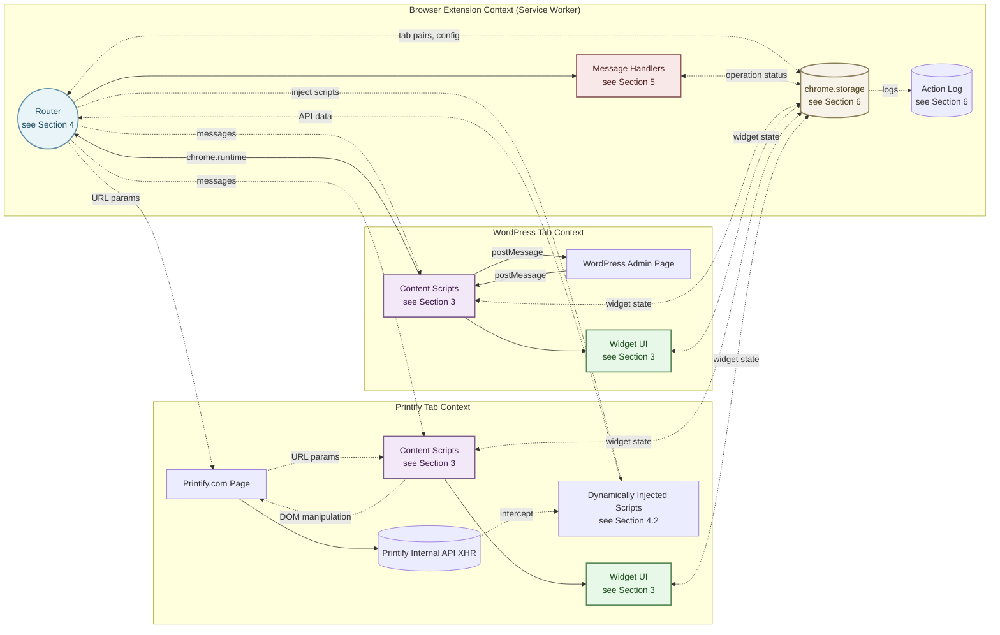
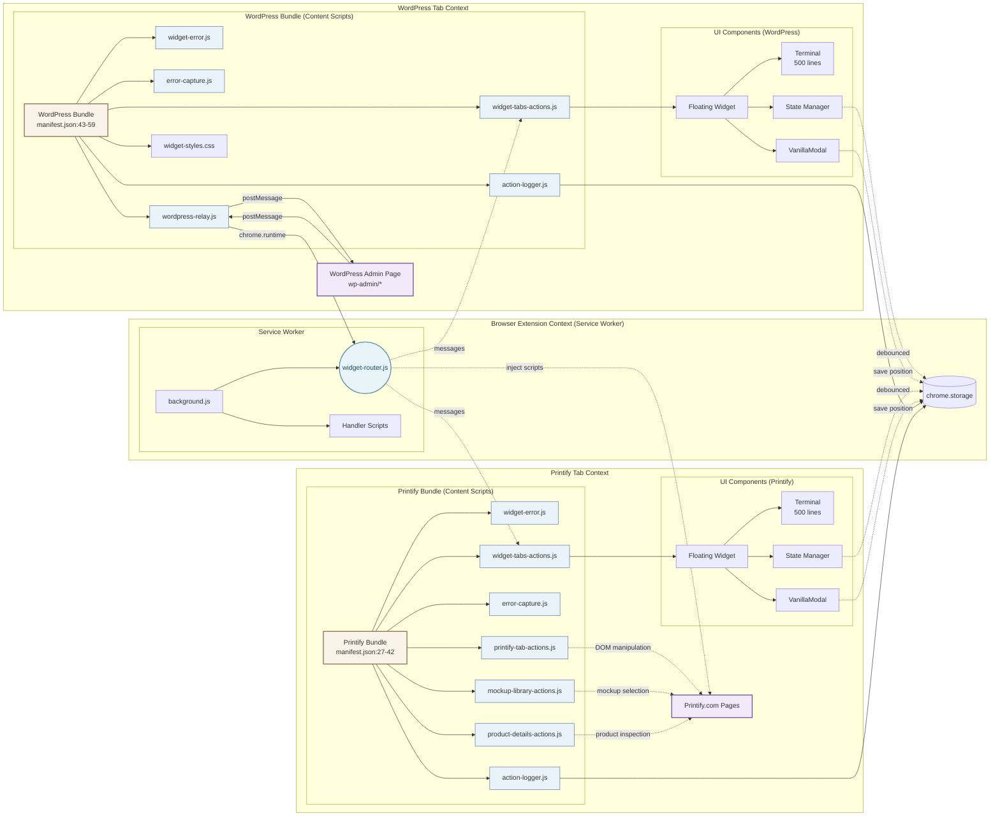
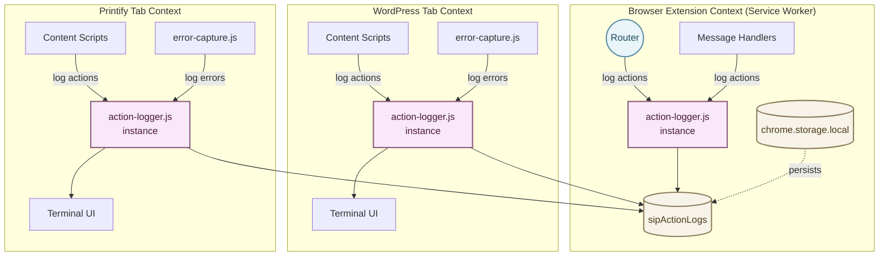

# SiP Printify Manager Extension – Integrated Documentation {#top}

---

### TABLE OF CONTENTS

- [1. Overview](#overview)
- [2. Main Architecture - The Three Contexts](#architecture)
- [3. Content Scripts & Widget UI](#content-scripts-widget-ui)
- [4. Service Worker](#service-worker)
  - [4.1 Tab Pairing](#tab-pairing)
  - [4.2 Dynamic Script Injection](#dynamic-script-injection)
- [5. Message Handlers](#message-handlers)
  - [5.1 Extension Detection](#extension-detection)
- [6. Action Logger](#action-logger)
- [7. Storage](#storage)
- [8. Development Guide](#development-guide)
- [9. Author Checklist](#author-checklist)

---

## 1. OVERVIEW {#overview}

### WHAT

The SiP Printify Manager Extension links three contexts to automate Printify product management in ways that are unavailable through the Printify public API:

1. **Browser Extension Context (Service Worker)** – Router, Message Handlers, Storage
2. **WordPress Admin Page Context** – WordPress Admin Page DOM, Widget UI, Content Scripts
3. **Printify Page Context** – Printify Page DOM, Printify Internal API, Widget UI, Content Scripts, Dynamic Scripts

### WHY

Printify’s public API omits mock‑up images and some product attributes needed for SiP’s automated template creation. The browser extension bridges that gap by harvesting data directly from the live Printify site while staying in sync with the WordPress plugin via in‑page messaging. The extension's three context architecture preserves security boundaries and minimises maintenance risk: each context can evolve independently while the relay and router that intermediates between them enforce a stable contract.

---

## 2. MAIN ARCHITECTURE - The Three Contexts {#architecture}

This block documents the extension's full three context architecture and their component parts.  All parts are fully detailed in the linked blocks that follow.

**Diagram 2.1: Main Architecture**



**Diagram Legend:**

- **Content Scripts** → [Section 3: Content Scripts & Widget UI](#content-scripts-widget-ui)
- **Widget UI** → [Section 3: Content Scripts & Widget UI](#content-scripts-widget-ui)
- **Router** → [Section 4: Router](#service-worker)
- **Dynamically Injected Scripts** → [Section 4.2: Dynamic Script Injection](#dynamic-script-injection)
- **Message Handlers** → [Section 5: Message Handlers](#message-handlers)
- **Action Log** → [Section 6: Action Logger](#action-logger)
- **chrome.storage** → [Section 7: Storage](#storage)

### HOW

Each component in the main architecture diagram is fully documented in subsequent sections:

#### WHY

Printify blocks Chrome.Runtime so content Scripts declared in manifest.json cannot use chrome.runtime features on the Printify site. However, the router can dynamically inject scripts to intercept API responses and relay data back.

Host permissions are limited to printify.com and wp-admin domains to minimize Chrome Web Store review friction while maintaining necessary access.

---

### 3 Content Scripts & Widget UI {#content-scripts-widget-ui}

The content scripts system provides error handling, logging, and a floating widget UI that persists state and provides real-time feedback across WordPress and Printify pages.

#### WHAT

**Diagram 3.1: Content Scripts Architecture**

[← Back to Diagram 2.1: Main Architecture](#architecture)

#### HOW

> **Bundle definition**  `manifest.json` contains **two** `content_scripts` blocks:
>
> 1. **Printify bundle** – Core scripts (`widget-error.js`, `action-logger.js`, `error-capture.js`) plus action scripts for Printify pages.
> 2. **WordPress bundle** – Core scripts plus `wordpress-relay.js` and widget actions for WP admin pages.

**Component Implementations**

| WHAT Component | Implementation | File:Line | Key Details |
|----------------|----------------|-----------|-------------|
| widget-error.js | Global error handler | widget-error.js:1 | Sets up `window.SiPWidget.showError()` |
| action-logger.js | Logging system | action-logger.js:1 | Maintains `sipActionLogs` array |
| error-capture.js | Error interceptor | error-capture.js:1 | Hooks `window.onerror` and unhandled rejections |
| Widget UI | Main UI controller | widget-tabs-actions.js:1 | Creates floating widget interface |
| VanillaModal | Modal class | widget-tabs-actions.js:12 | Draggable/resizable dialogs |
| Terminal | Log display | widget-tabs-actions.js:450 | Circular buffer implementation |
| State Manager | `saveState()`, `loadState()` | widget-tabs-actions.js:380 | Debounced persistence |

**Constants & Configuration**

<details>
<summary>View constants</summary>

```javascript
// Widget positioning
const WIDGET_Z_INDEX = 2147483000;  // Above all page content

// Terminal settings  
const TERMINAL_MAX_LINES = 500;     // Circular buffer size
const AUTO_HIDE_MS = 30000;         // 30 second auto-hide

// State persistence
const SAVE_DEBOUNCE_MS = 1000;      // 1 second debounce
```

</details>

**Message Handlers**

| Message | Handler Function | Action |
|---------|-----------------|--------|
| `SIP_SHOW_WIDGET` | `showWidget()` | Makes widget visible |
| `SIP_HIDE_WIDGET` | `hideWidget()` | Hides widget |
| `SIP_TERMINAL_APPEND` | `updateTerminal()` | Adds log entry |
| `SIP_OPERATION_STATUS` | `updateOperationStatus()` | Updates progress display |

#### WHY

A consistent floating widget keeps all extension actions in one place, avoiding separate browser‑action pop‑ups. Injecting via `content_scripts` guarantees that the UI appears automatically on every relevant domain. The terminal gives real‑time feedback critical for long‑running batch operations; capping lines avoids memory leaks.

---

### 4 Service Worker {#service-worker}

The service worker acts as the central message router and background processor for the extension, managing tab coordination, message routing, and Chrome API interactions.

#### WHAT

**Diagram 4.1: Service Worker Architecture**

[← Back to Diagram 2.1: Main Architecture](#architecture)

The service worker includes tab management functionality that maintains bidirectional pairing between WordPress and Printify tabs, enabling coordinated actions across both contexts while respecting browser security boundaries.

#### HOW

**Component Locations**

| WHAT Component | Implementation | File:Line |
|----------------|----------------|-----------|
| navigateTab | `async function navigateTab(url, tabType, currentTabId)` | widget-router.js:366 |
| Tab Pair Manager | `tabPairs` Map + helper functions | widget-router.js:42-104 |
| sipTabPairs storage | `chrome.storage.local` key | Persisted as `{tabId: pairedId}` |
| wordpress-relay.js | Content script relay | wordpress-relay.js:1-133 |
| Manifest Scripts | `content_scripts` block | manifest.json:27-60 |
| Dynamic Scripts | `chrome.scripting.executeScript()` | mockup-fetch-handler.js:263 |

**Data Formats**

<details>
<summary>View data structures</summary>

```javascript
// Tab pairs storage structure
sipTabPairs: {
  "123": 456,  // WordPress tab 123 ↔ Printify tab 456
  "456": 123   // Bidirectional for O(1) lookup
}

// URL parameters for Printify automation
?sip-action=update&scenes=Front,Back&primaryScene=Front

// Message format through relay
{
  type: "SIP_UPDATE_PRODUCT_MOCKUPS",
  source: "sip-printify-manager",
  data: { productId: "123", scenes: ["Front", "Back"] }
}
```

</details>

**Script Injection Worlds**

- **ISOLATED world**: Can use `chrome.runtime` API, sets up message relay
- **MAIN world**: Can access page's JavaScript context and intercept API calls

---

### 4.1 Tab Pairing {#tab-pairing}

The service worker manages tab pairing to coordinate actions between WordPress and Printify tabs.

#### WHAT

**Diagram 4.2: Tab Pairing Flow**

[← Back to Diagram 2.1: Main Architecture](#architecture)

---

### 4.2 Dynamic Script Injection {#dynamic-script-injection}

The service worker can dynamically inject scripts into Printify pages to intercept API responses and automate interactions.

#### WHAT

**Diagram 4.3: Dynamic Script Injection**

[← Back to Diagram 2.1: Main Architecture](#architecture)

#### WHY

Tab pairing solves the fundamental challenge of coordinating actions across security-isolated contexts. Without direct API access, the extension must orchestrate browser tabs to automate Printify operations while maintaining state consistency. The bidirectional pairing ensures that each WordPress session maintains its own Printify workspace, preventing cross-contamination in multi-store setups.

The dual communication approach—URL parameters for one-way automation and dynamic script injection for data extraction—works around chrome.runtime restrictions on third-party sites. This architecture respects browser security models while enabling the complex interactions required for mockup management. Tab reuse through pairing reduces resource consumption and provides a smoother user experience than constantly opening new tabs.

---

### 5.1 Extension Detection {#extension-detection}

Extension detection is handled by the wordpress-handler.js message handler to verify the extension is installed and active.

#### WHAT

**Diagram 5.2: Extension Detection Flow**

[← Back to Diagram 2.1: Main Architecture](#architecture)

#### HOW

The extension detection pattern uses:

| Component | Implementation | Purpose |
|-----------|----------------|---------|
| Two‑stage widget display | Content scripts always injected, widget revealed only on `SIP_SHOW_WIDGET` | Prevents widget clutter |
| Message identification | Via `source` string (`sip‑printify-extension`) | Distinguishes from other extensions |
| Validation chain | origin → source → structure | Security verification |
| Stateless detection | Request/response each time; no proactive announcements | Reduces message noise |
| Edge‑case handling | Missing `source`, cross‑origin messages, self‑responses | Robustness |

#### WHY

The extension detection flow enables the WordPress plugin to verify that the browser extension is installed and active before attempting extension-dependent operations.

Extension detection must be reliable without being intrusive. The stateless request/response pattern avoids the complexity of maintaining connection state while ensuring the WordPress plugin always knows the current extension status. The two-stage widget display keeps the UI clean until explicitly requested, improving user experience on pages where the extension isn't actively used.

---

### 5 Message Handlers {#message-handlers}

Message handlers process specific message types received by the service worker router, executing actions like fetching mockup data, updating UI, and managing extension state.

#### WHAT

**Diagram 5.1: Message Handlers**

[← Back to Diagram 2.1: Main Architecture](#architecture)


#### HOW

| Component               | Responsibility                                                                         | Key Files            |
| ----------------------- | -------------------------------------------------------------------------------------- | -------------------- |
| Service‑Worker Router   | Central switchboard; validates messages; calls handlers; persists logs                 | `widget-router.js`   |
| wordpress‑relay.js      | In‑page relay that validates WP messages and forwards to Router                        | `wordpress-relay.js` |
| Action Scripts          | Handle page-specific actions (mockup selection, product details)                       | `*-actions.js` files |
| Message Handlers        | Process messages by type and execute appropriate actions                               | `*-handler.js` files |

**Message Lifecycle**

**WordPress → Router:**
1. WordPress plugin posts message to window → wordpress-relay.js
2. Relay validates and formats object `{source:'sip', type:'SIP_*', payload}`
3. Relay calls `chrome.runtime.sendMessage` → Router
4. Router dispatches to appropriate handler

**Router → Printify (URL Parameters):**
1. Router navigates to Printify URL with parameters (e.g., `?sip-action=update&scenes=Front,Back`)
2. Printify action scripts read URL parameters on page load
3. Scripts execute requested actions (mockup selection, etc.)
4. No response path - chrome.runtime is blocked for manifest content scripts

**Router → Printify (Data Fetching):**
1. Router navigates to Printify mockup library page
2. Router dynamically injects scripts via `chrome.scripting.executeScript`:
   - Relay script in ISOLATED world (can use chrome.runtime)
   - Interceptor script in MAIN world (captures API responses)
3. Interceptor captures Printify API responses (e.g., `generated-mockup-maps`)
4. Data flows back: Interceptor → postMessage → Relay → chrome.runtime → Router

Key constants:

```javascript
export const MSG_PREFIX = 'SIP_';
export const AUTO_HIDE_MS = 30000; // widget auto-hide timeout
export const TERMINAL_MAX_LINES = 500; // max log entries in UI
```

**Message Type Catalog**

<details>
<summary>View complete message catalog</summary>

| Type | Direction | Handler | Purpose |
|------|-----------|---------|---------|
| **WordPress Commands** |
| `SIP_REQUEST_EXTENSION_STATUS` | WP → Extension | `wordpress-handler.js` | Check if extension is active |
| `SIP_EXTENSION_DETECTED` | Extension → WP | (response) | Confirms extension presence |
| `SIP_SHOW_WIDGET` | WP → Extension | `widget-data-handler.js` | Display floating widget |
| `SIP_HIDE_WIDGET` | WP → Extension | `widget-data-handler.js` | Hide floating widget |
| `SIP_UPDATE_PRODUCT_MOCKUPS` | WP → Extension | `mockup-update-handler.js` | Batch update mockups |
| `SIP_FETCH_MOCKUPS` | WP → Extension | `mockup-fetch-handler.js` | Fetch mockup data via intercept |
| `SIP_TEST_CONNECTION` | WP → Extension | `wordpress-handler.js` | Test config & connection |
| `SIP_WP_ROUTE_TO_PRINTIFY` | WP → Extension | `wordpress-handler.js` | Navigate to Printify tab |
| **Internal Actions** |
| `SIP_TERMINAL_APPEND` | Internal | `widget-data-handler.js` | Add line to terminal |
| `SIP_TERMINAL_CLEAR` | Internal | `widget-data-handler.js` | Clear terminal content |
| `SIP_TERMINAL_SET_STATE` | Internal | `widget-data-handler.js` | Update terminal state |
| `SIP_SCENE_MAP` | Router → WP | (broadcast) | Available scenes update |
| `SIP_TAB_PAIRED` | Internal | `widget-tabs-actions.js` | Tabs linked successfully |
| `SIP_TAB_REMOVED` | Internal | `widget-tabs-actions.js` | Tab closed, cleanup pair |
| `SIP_OPERATION_PAUSED` | Internal | `action-queue.js` | User paused batch |
| `SIP_OPERATION_RESUMED` | Internal | `action-queue.js` | User resumed batch |
| `SIP_OPERATION_STATUS` | Internal | `widget-data-handler.js` | Update progress display |
| `SIP_STORAGE_UPDATE` | Internal | `widget-data-handler.js` | Sync storage changes |
| `SIP_LOG_ACTION` | Internal | `action-logger.js` | Record action to log |
| `SIP_ERROR_CAPTURED` | Internal | `error-capture.js` | Global error occurred |
| **Printify Data Events** |
| `MOCKUP_API_RESPONSE` | Printify → Router | `mockup-fetch-handler.js` | Intercepted API data |

</details>

**Handler Files**

| Handler | Responsibility | Message Types |
|---------|---------------|---------------|
| `mockup-fetch-handler.js` | Fetches mockup data from Printify pages | `SIP_FETCH_MOCKUPS` |
| `mockup-update-handler.js` | Updates mockup selections on products | `SIP_UPDATE_PRODUCT_MOCKUPS` |
| `widget-data-handler.js` | Controls widget UI and terminal | `SIP_SHOW_WIDGET`, `SIP_TERMINAL_*` |
| `printify-data-handler.js` | Processes mockup data fetched from Printify | `SIP_FETCH_MOCKUPS` responses |
| `wordpress-handler.js` | Processes WordPress plugin commands | `SIP_REQUEST_EXTENSION_STATUS`, `SIP_NAVIGATE` |

**Router Internal Systems**

<details>
<summary>View router internal systems</summary>

| System | Purpose | Key Functions |
|--------|---------|---------------|
| Config Manager | Extension setup & API keys | `initializeConfig()`, `loadConfiguration()`, `updateConfig()` |
| Chrome API Layer | Wrapped Chrome APIs with error handling | `createTab()`, `queryTabs()`, `sendTabMessage()`, `updateTab()`, `removeTab()` |
| Operation Control | Pause/resume for user intervention | `pauseOperation()`, `resumeOperation()` |
| Message Validation | Single-point validation | `handleMessage()` validates all incoming messages |

</details>

**Configuration Management**

The Router manages extension configuration with fallback layers:

<details>
<summary>View configuration management code</summary>

```javascript
async function initializeConfig() {
  // 1. Try pre-configured settings first
  const preConfig = await fetch(chrome.runtime.getURL('assets/config.json'))
    .then(r => r.json())
    .catch(() => null);
    
  if (preConfig?.configured) {
    return preConfig;
  }
  
  // 2. Fall back to chrome.storage.sync
  const stored = await chrome.storage.sync.get(['wordpressUrl', 'apiKey']);
  
  // 3. Update badge based on config status
  if (stored.wordpressUrl && stored.apiKey) {
    chrome.action.setBadgeText({ text: '✓' });
    chrome.action.setBadgeBackgroundColor({ color: '#4CAF50' });
  }
  
  return stored;
}
```

</details>

**Chrome API Wrapper Pattern**

All Chrome APIs are wrapped for consistent error handling:

<details>
<summary>View Chrome API wrapper example</summary>

```javascript
async function createTab(params) {
  try {
    const tab = await chrome.tabs.create(params);
    return { 
      success: true, 
      data: { tabId: tab.id, tab: tab } 
    };
  } catch (error) {
    return { 
      success: false, 
      error: error.message, 
      code: 'TAB_CREATION_FAILED' 
    };
  }
}
```

</details>

**Operation Pause/Resume**

For operations requiring user intervention:

<details>
<summary>View pause/resume implementation</summary>

```javascript
async function pauseOperation(tabId, issue, instructions) {
  operationState.paused = true;
  operationState.pausedOperation = { tabId, issue, instructions };
  
  // Focus the problematic tab
  await chrome.tabs.update(tabId, { active: true });
  
  // Update UI with pause instructions
  await chrome.storage.local.set({
    sipOperationStatus: {
      state: 'paused',
      issue: issue,
      instructions: instructions,
      showResumeButton: true
    }
  });
  
  // Return promise that resolves when resumed
  return new Promise((resolve) => {
    operationState.pausedCallback = resolve;
  });
}
```

</details>

**Message Validation Flow**

All messages pass through comprehensive validation:

1. **Structure Check**: Message must have `type` field
2. **Source Validation**: WordPress messages verified by source and origin
3. **Handler Routing**: Message type mapped to specific handler
4. **Response Wrapping**: Success/error responses formatted consistently

#### WHY

WordPress messages pass through wordpress-relay.js to reach the **Service‑Worker Router**. Printify pages operate in isolation due to chrome.runtime restrictions, using URL parameters as the sole communication method. The Router navigates to Printify pages with specific parameters that action scripts read and execute.

A single service‑worker router gives one chokepoint for security and observability: every action is validated, logged, and tracked. The router pattern enables clean separation between message sources and handlers, making the extension maintainable as features grow. Enforcing consistent message naming helps debug issues and prevents collisions with other extensions.

---

### 6 Action Logger {#action-logger}

The Action Logger provides comprehensive logging across all extension contexts, capturing user actions, errors, and system events in a structured format for debugging and monitoring.

#### WHAT

**Diagram 6.1: Action Logger System**

[← Back to Diagram 2.1: Main Architecture](#architecture)

#### HOW

**Implementation Overview**

| Component | Purpose | Location |
|-----------|---------|----------|
| action-logger.js | Core logging system | Loaded in all contexts |
| error-capture.js | Global error interception | Content scripts only |
| sipActionLogs | Persistent log storage | chrome.storage.local |
| Terminal UI | Real-time log display | Widget in tab contexts |

**Log Categories**

The logger uses categories to organize different types of events:

| Category | Usage | Example Actions |
|----------|-------|-----------------|
| `WORDPRESS_ACTION` | WordPress plugin interactions | `SIP_UPDATE_PRODUCT_MOCKUPS` |
| `NAVIGATION` | Tab navigation events | Tab creation, pairing, switching |
| `API_CALL` | External API interactions | WordPress REST API calls |
| `ERROR` | Errors and exceptions | Unhandled errors, failed operations |
| `EXTENSION_ACTION` | Internal extension events | Widget state changes |
| `PRINTIFY_ACTION` | Printify page interactions | Mockup selection, product updates |

**Log Entry Structure**

```javascript
{
  timestamp: 1713012345678,
  category: "navigation",
  action: "Created new Printify tab",
  details: {
    tabId: 123,
    url: "https://printify.com/...",
    duration: 250
  },
  tabInfo: {
    tabId: 456,
    tabName: "WordPress Admin",
    url: "https://site.com/wp-admin/..."
  }
}
```

**Storage Management**

- Logs are capped at **500 entries** to stay within Chrome's storage limits
- Oldest entries are automatically pruned when limit is reached
- Each context writes directly to the shared `sipActionLogs` array

**Terminal Display**

- Shows last 500 log entries in the widget UI
- Auto-hides after 30 seconds of inactivity
- Color-coded by category for quick scanning
- Filterable by category or search term

#### WHY

A unified logging system across all contexts provides essential visibility into the extension's complex multi-context operations. By capturing events from content scripts, the service worker, and message handlers in one place, developers can trace user actions through the entire system. The 500-entry limit balances comprehensive logging with Chrome's storage constraints, while the terminal UI gives immediate feedback without requiring developer tools access.

The category system enables quick filtering of relevant events, particularly important when debugging specific workflows like mockup updates that span WordPress initiation, router coordination, and Printify automation. Having the same logger implementation in all contexts ensures consistent formatting and behavior, making the logs predictable and parseable.

---

### 7 Storage {#storage}

The extension uses Chrome's storage APIs to persist configuration, state, logs, and operation data across sessions and devices.

#### WHAT

**Diagram 7.1: Storage System**

[← Back to Diagram 2.1: Main Architecture](#architecture)

All logs—errors or normal actions—flow through `action-logger.js` into a single array **sipActionLogs** stored in `chrome.storage.local`.

#### HOW

| Component              | Responsibility                                                                                     | Key Files                      |
| ---------------------- | -------------------------------------------------------------------------------------------------- | ------------------------------ |
| action-logger.js       | Maintains `sipActionLogs` array; caps at **500** entries; creates hierarchical log entries         | `action-logger.js`             |
| error-capture.js       | Hooks `window.onerror` & promise rejections; forwards to action logger                             | `error-capture.js`             |
| widget-error.js        | Global error handling and error display infrastructure                                             | `widget-error.js`              |

**Data Schema (current implementation)**

```jsonc
{
  "timestamp": 1713012345678,
  "type": "SIP_API_CALL",
  "tabId": 38,
  "category": "navigation",   // one of: wp-action, navigation, api-call, error, etc.
  "payload": { "endpoint": "/v1/products" }
}
```

Stored under key `"sipActionLogs"` as an array. The logger prunes the array to the last **500** entries to keep below Chrome’s 5 MB quota.

**Storage Keys**

<details>
<summary>View all storage keys</summary>

*All keys live in chrome.storage unless noted otherwise.*

| Key | Scope | Purpose | Schema | Size/Quota |
|-----|-------|---------|--------|------------|
| `sipActionLogs` | local | Action & error logging | Array of log entries (see above) | Capped at 500 entries |
| `sipStore` | local | Extension state persistence | `{widgetState, tabPairs, operationStatus}` | Max 1MB total |
| `sipQueue` | session | Paused operation queue | Array of pending messages | Cleared on resume |
| `sipWidgetState` | local | Widget UI persistence | `{isVisible, position, terminalContent, terminalState}` | ~1KB |
| `sipTabPairs` | local | WP↔Printify tab mapping | `{[wpTabId]: printifyTabId}` bidirectional | ~500B |
| `sipOperationStatus` | local | Current operation tracking | `{operation, task, progress, state, timestamp}` | ~2KB |
| `fetchStatus_*` | local | Temporary fetch results | `{status, data, timestamp}` per operation | ~50KB each |
| `wordpressUrl` | sync | Cross-device WP URL | String URL | ~100B |
| `apiKey` | sync | Cross-device auth | 32-char string | ~50B |

</details>

**Storage Access Patterns**

<details>
<summary>View storage access patterns</summary>

```javascript
// Local storage (device-specific)
chrome.storage.local.get(['sipStore', 'sipActionLogs'], (result) => {
  const state = result.sipStore || {};
  const logs = result.sipActionLogs || [];
});

// Session storage (tab-specific, cleared on close)
chrome.storage.session.get(['sipQueue'], (result) => {
  const queue = result.sipQueue || [];
});

// Sync storage (cross-device)
chrome.storage.sync.get(['wordpressUrl', 'apiKey'], (result) => {
  const config = { url: result.wordpressUrl, key: result.apiKey };
});
```

</details>

**State Management Functions**

Widget components manage their own state persistence:

| Function | Purpose | Storage Key | Scope |
|----------|---------|-------------|-------|
| `saveState()` | Debounced widget state saving | `sipWidgetState` | Widget position, visibility, terminal content |
| `loadState()` | Restore widget on page load | `sipWidgetState` | Called on content script initialization |
| `autoConfigureForWordPress()` | Auto-detect WP URL | `wordpressUrl` | WordPress admin pages only |

**Auto-Configuration**

On WordPress admin pages, the extension automatically captures the site URL:

<details>
<summary>View auto-configuration code</summary>

```javascript
function autoConfigureForWordPress() {
  if (window.location.pathname.includes('/wp-admin/')) {
    const baseUrl = `${window.location.protocol}//${window.location.hostname}`;
    
    // Check if already configured
    chrome.storage.sync.get(['wordpressUrl'], (items) => {
      if (!items.wordpressUrl || items.wordpressUrl !== baseUrl) {
        chrome.storage.sync.set({ 
          wordpressUrl: baseUrl 
        }, () => {
          console.log('Auto-configured WordPress URL:', baseUrl);
        });
      }
    });
  }
}
```

</details>

**State Persistence Pattern**

Widget state is saved with debouncing to prevent storage thrashing:

<details>
<summary>View state persistence implementation</summary>

```javascript
let saveTimeout;
function saveState() {
  clearTimeout(saveTimeout);
  saveTimeout = setTimeout(() => {
    const state = {
      isVisible: widgetVisible,
      position: { x: widget.offsetLeft, y: widget.offsetTop },
      terminalContent: terminal.innerHTML,
      terminalState: terminalExpanded,
      timestamp: Date.now()
    };
    
    chrome.storage.local.set({ sipWidgetState: state });
  }, 1000); // 1 second debounce
}
```

</details>

#### WHY

A rolling array of the most‑recent 500 events is simple and fast to query while still covering typical batch‑run history. The hierarchical log structure in `action-logger.js` tracks operation start/end times and nesting, making it easy to trace complex workflows. Keeping both functional and error events in the same list gives an immediate chronological view for debugging.

Chrome's storage quotas shape the architecture: `sipStore` is capped at 1MB to leave headroom in the 5MB local quota, while `sipQueue` uses session storage that's automatically cleared on browser restart, preventing stale operations from accumulating. The bidirectional tab mapping in `sipTabPairs` enables instant lookups in either direction without scanning arrays.

---


<a id="storage-schema"></a>
<a id="message-type-reference"></a>

## 8. DEVELOPMENT GUIDE {#development-guide}

### Adding a New Feature

1. **Register message type** in [Section 5 message catalog](#message-handlers)
   - Add entry to appropriate section (WordPress Commands, Internal Actions, etc.)
   - Follow `SIP_<VERB>_<NOUN>` naming convention

2. **Add handler** in appropriate handler file
   - Create handler method in relevant `*-handler.js`
   - Register in router's handler map
   - Return `true` for async operations

3. **Emit logs** via action logger
   ```javascript
   // Use the global action object
   action.info('Feature activated', { feature: 'newFeature' });
   action.error('Operation failed', { error: error.message });
   ```

4. **Update documentation**
   - Add feature to relevant section in this file
   - Update message catalog if new messages added
   - Document any new storage keys

---

## 9. AUTHOR CHECKLIST {#author-checklist}

- [ ] Each section follows three-layer framework (WHAT/HOW/WHY)
- [ ] WHAT layer contains architecture diagram or high-level overview
- [ ] HOW layer includes all implementation details from source files
- [ ] WHY layer explains rationale in 2 paragraphs or less
- [ ] All file references verified against actual codebase


[Back to Top](#top)

