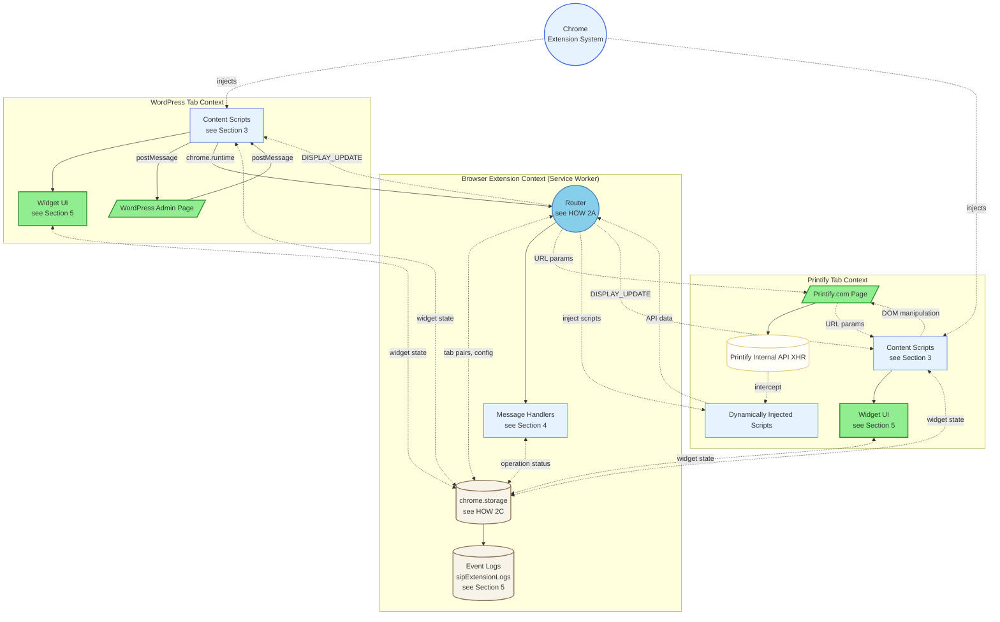
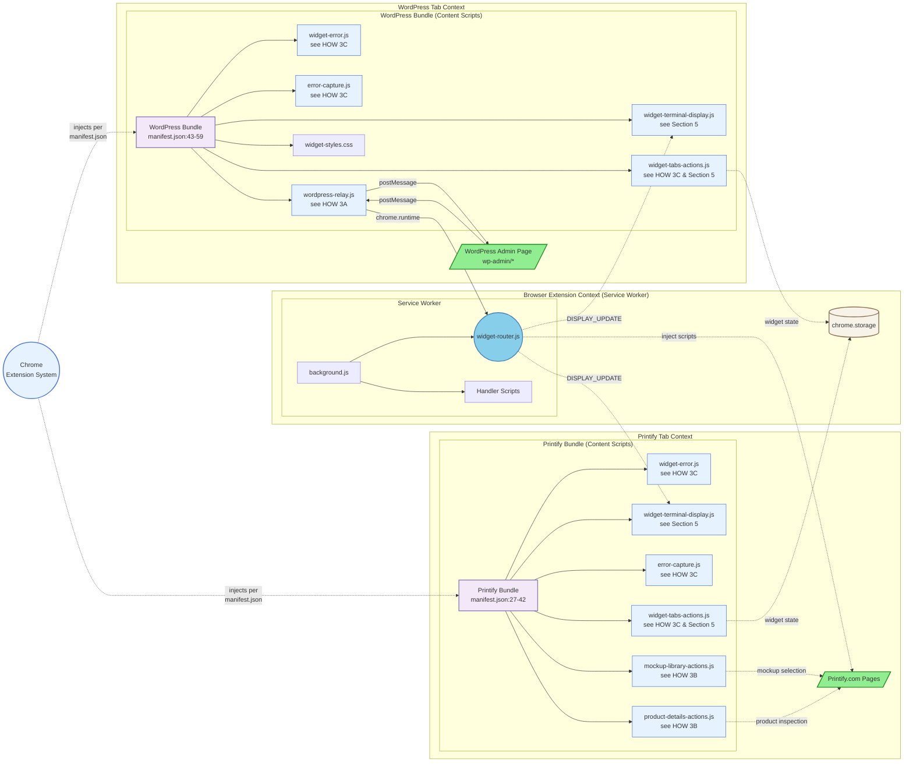
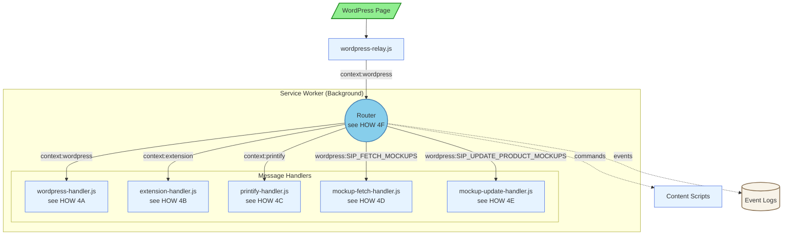
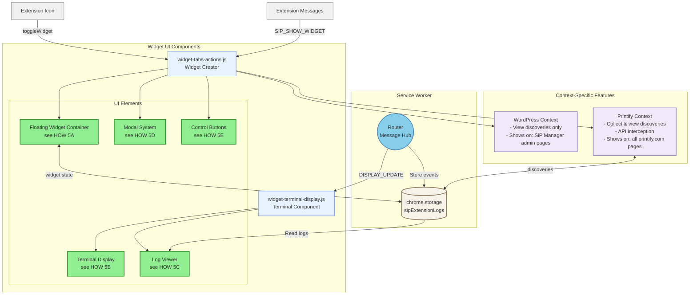

# SiP Printify Manager Extension – Integrated Documentation {#top}

---

### TABLE OF CONTENTS

- [1. Overview](#overview)
- [2. Main Architecture - The Three Contexts](#architecture)
- [3. Content Scripts](#content-scripts-widget-ui)
- [4. Message Handlers](#message-handlers)
- [5. Widget UI & Terminal Display](#widget-ui-terminal-display)
- [6. Development Guide](#development-guide)
- [7. Author Checklist](#author-checklist)

---

## 1. OVERVIEW {#overview}

### WHAT

The SiP Printify Manager Extension links three contexts to automate Printify product management in ways that are unavailable through the Printify public API:

1. **Browser Extension Context (Service Worker)** – Router, Message Handlers, Storage
2. **WordPress Admin Page Context** – WordPress Admin Page DOM, Widget UI, Content Scripts
3. **Printify Page Context** – Printify Page DOM, Printify Internal API, Widget UI, Content Scripts, Dynamic Scripts

### WHY

Printify's public API omits mock‑up images and some product attributes needed for SiP's automated template creation. The browser extension bridges that gap by harvesting data directly from the live Printify site while staying in sync with the WordPress plugin via in‑page messaging. The extension's three context architecture preserves security boundaries and minimises maintenance risk: each context can evolve independently while the relay and router that intermediates between them enforce a stable contract.

---

## 2. MAIN ARCHITECTURE - The Three Contexts {#architecture}

This block documents the extension's full three context architecture and their component parts.  All parts are fully detailed in the linked blocks that follow.

### I. WHAT

**Diagram 2: Main Architecture**



**Diagram Legend:**

**Color Coding:**
- 🟩 **Green** - User-facing elements (web pages, UI widgets)
- 🔵 **Sky Blue** - Router (central message hub)
- 🔷 **Light Blue** - Script files and code components
- 🟣 **Purple** - Grouping/organizational nodes
- 🟫 **Tan** - Storage components
- 🟡 **Yellow** - External APIs/services
- ⬜ **Gray** - Actions/processes

### II. HOW

#### 2A The Router

> The Router (`widget-router.js`) is the extension's central message dispatcher, running in the Service Worker context. **All messages pass through the Router** - there are no direct connections between contexts. This single-point message flow ensures consistent validation, logging, and error handling.
> 
> The Router:
> - **Validates** incoming messages for required `context`, `action`, and `source` fields
> - **Routes** messages to registered handlers using compound keys (`context:action`)
> - **Stores** all events in chrome.storage for historical viewing
> - **Forwards** display updates to all extension tabs (WordPress and Printify)
> - **Wraps Chrome APIs** with consistent error handling
> - **Manages tab pairing** ONLY for navigation (prevents duplicate tabs)
> - **Injects scripts** dynamically when manifest-declared scripts can't access needed APIs
> - **Updates extension badge** via chrome.action API to show status (✓ green for success, ! orange for warnings)
> 
> Message flow: Content Scripts → `chrome.runtime.sendMessage()` → Router → Handler → `chrome.tabs.sendMessage()` → Content Scripts
> 
> **Message Format:**
> All messages use the standardized format:
> ```javascript
> {
>     context: 'wordpress' | 'printify' | 'extension',
>     action: 'SIP_FETCH_MOCKUPS' | 'SIP_NAVIGATE' | etc.,
>     source: 'sip-printify-manager' | 'sip-printify-extension',
>     data: { ... }  // Optional payload
> }
> ```
> 
> **Handler Registration Pattern:**
> The Router implements a WordPress AJAX-style registration system:
> ```javascript
> // Register handlers with two-parameter pattern
> registerHandler('wordpress', '*', wordpressHandler);  // Wildcard for all WordPress actions
> registerHandler('wordpress', 'SIP_FETCH_MOCKUPS', mockupFetchHandler);  // Specific action
> 
> // Routing logic tries specific first, then wildcard
> const handler = handlers[`${context}:${action}`] || handlers[`${context}:*`];
> ```
> 
> **Terminal Display Integration:**
> The Router stores and forwards operation messages for the terminal display:
> - Action messages: One-off status with category (success/error/warning/info)
> - Operation messages: Progress-tracked with percentage and completion status
> 
> These messages are:
> 1. Stored in `sipExtensionLogs` (max 500 entries)
> 2. Forwarded as internal `DISPLAY_UPDATE` messages to tabs tracked in `injectedTabs` Set
> 
> **Critical: Async Storage Race Condition:**
> The `storeEventLog()` function uses `chrome.storage.local.set()` which is asynchronous. When multiple log entries are written in quick succession without awaiting, a race condition occurs where later writes can overwrite earlier ones before they complete. To prevent this:
> - **Always** use `await storeEventLog(data)` to ensure sequential writes
> - **Never** call `storeEventLog()` without await in loops or rapid sequences
> - This applies to all contexts where `storeEventLog()` is called
> 
> **Injected Tabs Tracking:**
> To prevent "Could not establish connection" errors, the Router maintains a Set of tab IDs where content scripts are loaded:
> - Content scripts announce readiness via `chrome.runtime.sendMessage({ type: 'CONTENT_SCRIPT_READY' })`
> - Router adds tabs to Set after successful script injection during `onInstalled`
> - Tabs removed from Set when closed (`onRemoved`) or navigating (`onUpdated` with status='loading')
> - `forwardDisplayUpdate` only sends to tabs in this Set
> 
> **Tab Pairing Usage Guidelines:**
> - ✅ **USE** for `navigateTab()` - Prevents duplicate tabs, reuses existing ones
> - ❌ **DON'T USE** for message broadcasting - Use injectedTabs tracking instead
> - ❌ **DON'T USE** for display updates - Terminal should update in all contexts
> 
> <details>
> <summary>Message Broadcasting Pattern (Current Implementation)</summary>
> 
> ```javascript
> // Only send to tabs we know have content scripts
> for (const tabId of injectedTabs) {
>     try {
>         await chrome.tabs.sendMessage(tabId, {
>             type: 'DISPLAY_UPDATE',
>             data: data
>         });
>     } catch (error) {
>         // Tab closed or navigated - remove from Set
>         injectedTabs.delete(tabId);
>     }
> }
> ```
> 
> </details>
> 
> **Dynamic Script Injection:** The Router uses `chrome.scripting.executeScript()` in two scenarios:
> 1. **API Interception**: When Printify's restrictions prevent manifest-declared content scripts from accessing needed APIs, the Router dynamically injects scripts that can intercept XHR responses and access Printify's internal data structures.
> 2. **Install/Update Events**: During extension install or update (`onInstalled`), the Router injects the full set of content scripts into already-open WordPress and Printify tabs, matching exactly what manifest.json declares for each context. This ensures pre-existing tabs receive complete extension functionality without requiring a page refresh.
> 
> **Pause/Resume System:** The Router includes built-in operation pausing for user intervention:
> - `pauseOperation(tabId, issue, instructions)` - Pauses operation and shows UI with instructions
> - `resumeOperation()` - Resumes when user clicks the resume button in the widget
> - Messages use internal format: `{ type: 'widget', action: 'resumeOperation' }`
> - Automatically focuses the problematic tab and displays pause status in widget
> 
> **Configuration Loading:** The Router attempts to load pre-configuration from `assets/config.json`:
> - Contains optional pre-configured settings: `wordpressUrl`, `apiKey`, `autoSync`, `configured`
> - If `configured: true`, these settings are automatically applied on extension install
> - Falls back to chrome.storage.sync if config.json is unavailable
> - Useful for enterprise deployments with pre-configured extensions

#### 2B Documentation Links

> The following sections detail elements referenced in the Main Architecture Diagram.
>- **Content Scripts** → [Section 3: Content Scripts](#content-scripts-widget-ui)
>- **Message Handlers** → [Section 4: Message Handlers](#message-handlers)
>- **Widget UI & Terminal Display** → [Section 5: Widget UI & Terminal Display](#widget-ui-terminal-display)
>- **chrome.storage** → [See HOW 2C below](#storage-how)

#### 2C Storage {#storage-how}

> Chrome provides two storage areas for persisting extension data:
> 
> <details>
> <summary>Storage API Comparison</summary>
> 
> | API | Scope | Quota | Use Cases |
> |-----|-------|-------|-----------|
> | **chrome.storage.local** | Device-specific | 10MB | Large data, logs, state |
> | **chrome.storage.sync** | Synced across devices | 100KB total, 8KB per item | User settings, config |
> 
> </details>
> 
> <details>
> <summary>View all storage keys</summary>
> 
> | Key | Scope | Purpose | Schema | Size |
> |-----|-------|---------|----------|------|
> | `sipExtensionLogs` | local | Event logging for terminal display | Array of message objects (see Section 5) | Capped at 500 entries |
> | `sipWidgetState` | local | Widget UI persistence | `{isVisible, isExpanded, position, terminalContent, terminalState}` | ~1KB |
> | `sipTabPairs` | local | WP↔Printify tab mapping | `{[wpTabId]: printifyTabId}` bidirectional | ~500B |
> | `sipOperationStatus` | local | Current operation tracking | `{state, operation, task, progress, issue, timestamp}` | ~2KB |
> | `sip-extension-state` | local | Extension pause/resume state | `{isPaused, timestamp}` | ~100B |
> | `sipDiscoveries` | local | Printify data discovery catalog | `{api_endpoints[], dom_patterns[], data_structures[]}` (see Section 5) | ~10KB |
> | `fetchStatus_*` | local | Temporary fetch results | `{status, error, data, timestamp}` per product | ~50KB each |
> | `wordpressUrl` | sync | Cross-device WP URL | String URL | ~100B |
> | `apiKey` | sync | Cross-device auth | String (variable length) | ~50B |
> 
> </details>
> 
> <details>
> <summary>Storage Access Pattern</summary>
> 
> ```javascript
> // Read from storage
> chrome.storage.local.get(['sipWidgetState'], (result) => {
>   const state = result.sipWidgetState || {};
> });
> 
> // Write to storage  
> chrome.storage.local.set({
>   sipOperationStatus: { state: 'idle', timestamp: Date.now() }
> });
> ```
> 
> </details>
> 
> The extension auto-configures on WordPress admin pages by capturing the site URL and storing it in sync storage for cross-device access.

### III. WHY

Printify blocks Chrome.Runtime so content Scripts declared in manifest.json cannot use chrome.runtime features on the Printify site. However, the router can dynamically inject scripts to intercept API responses and relay data back.

Host permissions are limited to printify.com and wp-admin domains to minimize Chrome Web Store review friction while maintaining necessary access.

Web accessible resources include assets needed across origins: config.json, logo images, loading animation, and widget-styles.css.

---

## 3. CONTENT SCRIPTS {#content-scripts-widget-ui}

Content scripts are JavaScript files injected by Chrome into web pages based on URL patterns defined in manifest.json. They provide the bridge between web pages and the extension's background service worker.

### I. WHAT

**Diagram 3: Content Scripts Architecture**

[← Back to Diagram 2: Main Architecture](#architecture)

### II. HOW

The Browser Extension Context shows the Service Worker, which is Chrome's background execution environment for the extension. The Service Worker loads background.js, which in turn imports all the handler scripts and the Router via `importScripts()`.

#### 3A wordpress-relay.js

> The `wordpress-relay.js` script acts as a secure message bridge between WordPress pages and the extension. It performs minimal validation (origin and source checks) before forwarding messages to the Router, where comprehensive validation occurs.
> 
> <details>
> <summary>View relay functions</summary>
> 
> | Function | Purpose | Implementation |
> |----------|---------|----------------|
> | Origin validation | Security check | Only accepts messages from `window.location.origin` |
> | Source filtering | Prevents loops | Ignores messages from `sip-printify-extension` |
> | Message forwarding | WP → Router | Validates source is `sip-printify-manager` or `sip-plugins-core` |
> | Response relay | Router → WP | Forwards responses back via `window.postMessage` |
> | Terminal display | Log events | Sends action/operation messages to Router |
> 
> </details>

#### 3B Printify-Specific Scripts

> The Printify bundle includes scripts that handle Printify-specific automation and data extraction:
> 
> <details>
> <summary>Printify-Specific Scripts Table</summary>
> 
> | Script | Purpose | When Active |
> |--------|---------|-------------|
> | **mockup-library-actions.js** | Automates mockup selection by clicking UI elements based on scene names | Mockup library page when automation parameters present |
> | **product-details-actions.js** | Extracts product data, mockup URLs, and variant information from DOM | Product detail pages |
> 
> </details>
> 
> **Communication Patterns:**
> - Scripts use `chrome.runtime.sendMessage()` to send messages to the Router
> - Router uses `chrome.tabs.sendMessage()` to send messages to content scripts
> - Router can inject additional scripts via `chrome.scripting.executeScript()` (shown as "inject scripts" arrow)

#### 3C Shared Bundle Scripts

> Both WordPress and Printify bundles include these core scripts for error handling and UI:
> 
> <details>
> <summary>Shared Bundle Scripts Table</summary>
> 
> | Script | Purpose | Shared Functionality |
> |--------|---------|---------------------|
> | **widget-error.js** | Global error handler | Provides `window.SiPWidget.showError()` for consistent error display |
> | **widget-terminal-display.js** | Terminal display component | Receives DISPLAY_UPDATE messages and shows real-time progress |
> | **error-capture.js** | Runtime error interceptor | Catches uncaught errors and promise rejections for logging |
> | **widget-tabs-actions.js** | Widget UI creator | Builds the floating widget interface, manages state, includes Discovery Tool for Printify data collection (see Section 5) |
> 
> </details>
> 
> **Other Bundle Contents:**
> - **widget-styles.css** - Comprehensive styles for the floating widget UI
>   - Injected into WordPress pages via manifest and dynamically into other pages
>   - Includes styles for: floating widget, terminal display, modal dialogs, toast notifications
>   - Responsive design with drag-and-drop support and smooth animations
>   - Dark theme terminal with syntax highlighting for log entries
>   - Listed in web_accessible_resources for cross-origin access

### III. WHY

Chrome's content script architecture provides security isolation between web pages and extension code. Scripts injected into web pages run in an "isolated world" with access to the DOM but not the page's JavaScript, preventing malicious sites from accessing extension APIs. The two-bundle approach reflects the different needs: WordPress pages need the relay to communicate with the plugin, while Printify pages need automation scripts to interact with the UI. The postMessage/chrome.runtime message flow bridges these isolated contexts while maintaining security boundaries.

---

## 4. MESSAGE HANDLERS {#message-handlers}

Message handlers process specific message types received by the Router, executing actions like fetching mockup data, updating UI, and managing extension state.

**Message Type Convention:**
The `type` field identifies the **message source/context**, not the operation:
- `wordpress` - Commands from WordPress pages (via relay)
- `printify` - Data/responses from Printify pages
- `widget` - Widget UI actions

The `action` field specifies **what the message does** (e.g., `SIP_FETCH_MOCKUPS`, `MOCKUP_API_RESPONSE`).

**⚠️ CRITICAL: Service Worker Context**
All message handlers run in the Service Worker context (same as the Router). This means:
- ❌ **CANNOT** use `chrome.runtime.sendMessage()` - it won't work within the same context
- ✅ **MUST** use direct router methods for reporting status:
  - `router.reportOperation(progress, message, complete)` - For progress-tracked operations
  - `router.reportAction(message, category)` - For one-off status messages

This is a common source of bugs where operation messages don't appear in the terminal display.

### I. WHAT

**Diagram 4: Message Handlers**

[← Back to Diagram 2: Main Architecture](#architecture)

### II. HOW

#### 4A WordPress Handler

> Processes commands from the WordPress plugin:
> 
> <details>
> <summary>View WordPress message types</summary>
>
> | Message Type | Action | Response |
> |--------------|--------|----------|
> | `SIP_REQUEST_EXTENSION_STATUS` | Confirms extension is active | `SIP_EXTENSION_DETECTED` |
> | `SIP_NAVIGATE` | General navigation request | Success/failure |
> | `SIP_OPEN_TAB` | Opens new tab with URL | Tab ID or error |
> | `SIP_TOGGLE_WIDGET` | Toggles widget collapsed/expanded | Success/failure |
> | `SIP_SHOW_WIDGET` | Ensures widget is visible | Success/failure |
> | `SIP_FETCH_MOCKUPS` | Initiates mockup data fetch (routes to MockupFetchHandler) | `SIP_MOCKUP_DATA` response |
> | `SIP_UPDATE_PRODUCT_MOCKUPS` | Updates product mockups (routes to MockupUpdateHandler) | `SIP_MOCKUP_UPDATE_COMPLETE` |
> | `SIP_CLEAR_STATUS` | Clears operation status | Success/failure |
> 
> **Key Functions:**
> - Routes messages to appropriate handlers based on action
> - Navigation commands go to WidgetDataHandler
> - Mockup operations go to their respective handlers
> - Returns standardized success/error responses
> 
> **Extension Detection Pattern:**
> 
> | Component | Implementation | Purpose |
> |-----------|----------------|---------|
> | Two‑stage widget display | Content scripts always injected, widget revealed only on `SIP_SHOW_WIDGET` | Prevents widget clutter |
> | Message identification | Via `source` string (`sip‑printify-extension`) | Distinguishes from other extensions |
> | Validation chain | origin → source → structure | Security verification |
> | Stateless detection | Request/response each time; no proactive announcements | Reduces message noise |
> | Edge‑case handling | Missing `source`, cross‑origin messages, self‑responses | Robustness |
>
> </details>

#### 4B Widget Data Handler

> Controls the floating widget UI across all tabs:
> 
> <details>
> <summary>View widget data handler messages</summary>
> 
> | Message Type | Action | Implementation |
> |--------------|--------|----------------|
> | `SIP_SHOW_WIDGET` | Makes widget visible | Routes to widget-data-handler |
> 
> Note: The widget now auto-expands when receiving operation messages. No explicit expandWidget action is needed.
> 
> </details>

#### 4C Mockup Handlers

> Three handlers work together to manage Printify mockups:
> 
> <details>
> <summary>Mockup Operation Flow Diagram</summary>
> 
> **Diagram 4.1: Mockup Operation Flow**
> ```mermaid
> graph TD
>   WP[/WordPress Admin/] -->|SIP_FETCH_MOCKUPS| Router((Router))
>   WP -->|SIP_UPDATE_PRODUCT_MOCKUPS| Router
>   
>   Router --> MFH[mockup-fetch-handler.js]
>   Router --> MUH[mockup-update-handler.js]
>   
>   MFH -->|navigateTab| MockupLib[/Printify Mockup Library/]
>   MFH -->|inject script| Interceptor[API Interceptor]
>   MockupLib -.->|API calls| Interceptor
>   Interceptor -->|MOCKUP_API_RESPONSE| PDH[printify-data-handler.js]
>   PDH -->|transformed data| Router
>   Router -->|mockup data| WP
>   
>   MUH -->|navigateTab + params| ProductPage[/Printify Product Page/]
>   ProductPage -->|automation| Mockups[Mockup Selection]
>   MUH -->|monitor completion| Status[Operation Status]
>   Status -->|pause/resume| UserIntervention[User Actions]
>   
>   %% Style definitions
>   classDef userFacingStyle fill:#90EE90,stroke:#228B22,stroke-width:2px
>   classDef routerStyle fill:#87CEEB,stroke:#4682B4,stroke-width:2px
>   classDef scriptStyle fill:#E6F3FF,stroke:#4169E1,stroke-width:1px
>   classDef actionStyle fill:#F0F0F0,stroke:#808080,stroke-width:1px
>   
>   %% Apply styles
>   class WP,MockupLib,ProductPage userFacingStyle
>   class Router routerStyle
>   class MFH,MUH,PDH,Interceptor scriptStyle
>   class Mockups,Status,UserIntervention actionStyle
> ```
> 
> </details>
> 
> <details>
> <summary>Handler Responsibilities</summary>
> 
> | Handler | Message Type & Action | Purpose | Key Actions |
> |---------|---------|---------|-------------|
> | `mockup-fetch-handler.js` | via `wordpress` → `SIP_FETCH_MOCKUPS` | Retrieve mockup library data | Navigate to library, inject interceptor, wait for response |
> | `mockup-update-handler.js` | via `wordpress` → `SIP_UPDATE_PRODUCT_MOCKUPS` | Apply mockups to product | Navigate with params, monitor progress, handle pauses |
> | `printify-data-handler.js` | `printify` → various actions | Handle Printify data | Process API responses, update status, sync data |
> 
> </details>
>
> <details>
> <summary>Progress Reporting Code Example</summary>
> 
> Mockup handlers report operation progress using direct router methods:
> ```javascript
> // ✅ CORRECT - Direct router method (handlers run in Service Worker context)
> router.reportOperation(45, 'Fetching Mockups: Loading data...');
> 
> // ❌ WRONG - This won't work in Service Worker context
> // chrome.runtime.sendMessage({
> //     type: 'operation',
> //     progress: 45,
> //     message: 'Fetching Mockups: Loading data...',
> //     complete: false
> // });
> ```
> 
> </details>

#### 4D Additional Message Types

> This catalog documents internal system messages not covered in handler descriptions above.
>
> <details>
> <summary>View additional message types</summary>
>
> **System Events**
> | Type | Action | Purpose | Source |
> |------|--------|---------|--------|
> | (no type) | `action` | One-off status messages | Any content script |
> | (no type) | `operation` | Progress-tracked operations | Mockup handlers |
> | `printify` | `MOCKUP_API_RESPONSE` | Carries intercepted Printify data | Injected scripts via mockup-fetch-handler |
> | (no type) | `DISPLAY_UPDATE` | Terminal display updates | Router |
> | (no type) | `CONTENT_SCRIPT_READY` | Announces content script loaded | All content scripts |
>
> </details>

#### 4E Message Validation

> All messages pass through comprehensive validation in the Router:
>
> 1. **Structure Check**: Message must have `type` field
> 2. **Source Validation**: WordPress messages verified by source and origin
> 3. **Handler Routing**: Message type mapped to specific handler
> 4. **Response Wrapping**: Success/error responses formatted consistently
> 5. **Event Logging**: All action/operation messages stored in sipExtensionLogs
> 6. **Display Forwarding**: Updates broadcast to all extension tabs via DISPLAY_UPDATE

### III. WHY

WordPress messages pass through wordpress-relay.js to reach the Router. Printify pages operate in isolation due to chrome.runtime restrictions, using URL parameters as the sole communication method. The Router navigates to Printify pages with specific parameters that action scripts read and execute.

A single router gives one chokepoint for security and observability: every action is validated, logged, and tracked. The router pattern enables clean separation between message sources and handlers, making the extension maintainable as features grow. Enforcing consistent message naming helps debug issues and prevents collisions with other extensions.

---

## 5. WIDGET UI & TERMINAL DISPLAY {#widget-ui-terminal-display}

The Widget UI provides a floating interface for monitoring extension operations, viewing logs, and debugging issues across both WordPress and Printify contexts. The terminal display system within the widget shows real-time progress and historical event logs.

### I. WHAT

**Diagram 5: Widget UI & Terminal Display Architecture**

[← Back to Diagram 2: Main Architecture](#architecture)

### II. HOW

#### 5A Widget Container

> The floating widget is created once per tab by widget-tabs-actions.js and persists across page navigations:
>
> <details>
> <summary>Widget Container Components</summary>
> 
> | Component | Purpose | Implementation |
> |-----------|---------|----------------|
> | **Container** | Main UI frame | Draggable, collapsible, saves position to storage |
> | **Header** | Title & controls | "SiP Extension" with expand/collapse button |
> | **Body** | Content area | Contains terminal display and controls |
> | **State Persistence** | Remember UI state | Saves to `sipWidgetState` in chrome.storage |
> 
> </details>

#### 5B Terminal Display

> The terminal display component (widget-terminal-display.js) shows real-time operation progress and action messages:
>
> <details>
> <summary>Terminal Display Message Types</summary>
> 
> ```javascript
> // Action message (one-off status)
> {
>     type: 'action',
>     message: 'Blueprint updated',
>     category: 'success',  // success, error, warning, info
>     timestamp: 1634567890123  // Added by Router
> }
> 
> // Operation message (progress-tracked)
> {
>     type: 'operation', 
>     progress: 45,        // 0-100
>     message: 'Updating mockups...',
>     complete: false,     // true when operation finishes
>     timestamp: 1634567890123  // Added by Router
> }
> ```
> 
> </details>
>
> **Display States:**
> - **Idle (READY)**: No active operations, shows "..." or previous message
> - **Active (PROCESSING...)**: Operation in progress with percentage
> - **Completion**: Shows SUCCESS/ERROR/WARNING briefly, then returns to idle
>
> **Auto-Expand Behavior:**
> - Widget automatically expands when receiving an operation message (not complete)
> - Ensures users see operation progress without manual interaction
> - Only triggers if widget is currently collapsed
> - Implemented in `TerminalDisplay.autoExpandWidget()` method

#### 5C Log Viewer

> The log viewer shows historical events from `sipExtensionLogs`:
>
> <details>
> <summary>Log Viewer Column Mapping</summary>
> 
> | Column | Source | Display Logic |
> |--------|--------|---------------|
> | Time | `timestamp` | Locale time string |
> | Site | Current domain | `window.location.hostname` |
> | Status | Derived | Actions: SUCCESS/ERROR/WARNING/INFO<br>Operations: Progress % or COMPLETE |
> | Category | `type` | ACTION or OPERATION |
> | Action | `message` | The message text |
> 
> </details>
>
> **Features:**
> - 500 entry limit (automatic trimming)
> - Copy to clipboard functionality
> - Clear logs button
> - Auto-refresh on new events

#### 5D Modal System

> VanillaModal implementation for dialogs:
> - Discovery Report modal
> - Future: Configuration dialogs
> - Saves position between uses
> - Dark theme styling

#### 5E Control Buttons

> Widget control interface:
>
> <details>
> <summary>Control Button Functions</summary>
> 
> | Button | Function | Visibility |
> |--------|----------|------------|
> | Expand/Collapse | Toggle widget size | Always |
> | Clear Terminal | Clear log display | Always |
> | Copy Log | Copy logs to clipboard | Always |
> | Hide Widget | Hide until next trigger | Always |
> | Discovery Report | View collected data | Shows "NEW" badge when unseen items |
> 
> </details>

#### 5F Discovery Tool

> The Discovery Tool passively collects Printify data patterns:
>
> **Implementation (Printify Context Only):**
> - `initDiscoverySystem()` - Called once on page load
> - `analyzePageOnce()` - DOM analysis for data attributes
> - `setupDiscoveryIntercept()` - Fetch API interception
> - `saveDiscoveries()` - Deduplicates and stores findings
>
> <details>
> <summary>Discovery Storage Schema</summary>
> 
> ```javascript
> // sipDiscoveries storage structure
> {
>   api_endpoints: [{
>     url: string,
>     method: string,
>     timestamp: number,
>     hasSeenBefore: boolean
>   }],
>   dom_patterns: [{
>     pattern: string,
>     example: string,
>     count: number,
>     timestamp: number,
>     hasSeenBefore: boolean
>   }],
>   data_structures: [{
>     name: string,
>     fields: string[],
>     source: string,
>     timestamp: number,
>     hasSeenBefore: boolean
>   }]
> }
> ```
> 
> </details>

### III. WHY

The Widget UI serves as the primary debugging interface for the extension, providing real-time visibility into operations without requiring developer tools. The terminal display system replaces the previous ActionLogger with a unified approach where all messages flow through the Router for consistent logging and display.

The separation between high-level batch progress (WordPress) and granular operation progress (Extension) enables fluid user experience without complex polling. The 500-line log buffer and auto-hide behavior balance information availability with screen real estate.

Display updates are broadcast to tabs tracked in the `injectedTabs` Set, ensuring terminal visibility regardless of message origin (WordPress tab, Printify tab, or service worker). This approach eliminates both the "no origin tab" problem when handlers run in service worker context and the "Could not establish connection" errors from sending to tabs without content scripts. Tab pairing remains focused solely on its primary purpose: preventing duplicate tabs during navigation.

---

## 6. DEVELOPMENT GUIDE {#development-guide}

### Adding a New Feature

1. **Register message type** in [Section 4 message catalog](#message-handlers)
   - Add entry to appropriate section (WordPress Commands, Internal Actions, etc.)
   - Follow `SIP_<VERB>_<NOUN>` naming convention for WordPress commands
   - Use `action` or `operation` types for display messages

2. **Add handler** in appropriate handler file
   - Create handler method in relevant `*-handler.js`
   - Register in router's handler map
   - Return `true` for async operations

3. **Send display messages** for user visibility
   ```javascript
   // For handlers in Service Worker context:
   router.reportAction('Feature activated', 'success');
   router.reportOperation(50, 'Processing data...');
   
   // For content scripts:
   chrome.runtime.sendMessage({
       type: 'action',
       message: 'Feature activated',
       category: 'success'  // or 'error', 'warning', 'info'
   });
   ```

4. **Update documentation**
   - Add feature to relevant section in this file
   - Update message catalog if new messages added
   - Document any new storage keys

---

## 7. AUTHOR CHECKLIST {#author-checklist}

- [ ] All code in specified files is documented in WHW blocks
- [ ] Intro sentence explains each block scope
- [ ] Each WHAT layer present with clear architecture (diagram or bullets)
- [ ] HOW layers collectively contains all implementation detail and do not repeat information
- [ ] WHY layer does not repeat HOW layer
- [ ] WHW Blocks in the hierarchy hang together through node references
- [ ] Links, file paths, and diagram references verified


[Back to Top](#top)