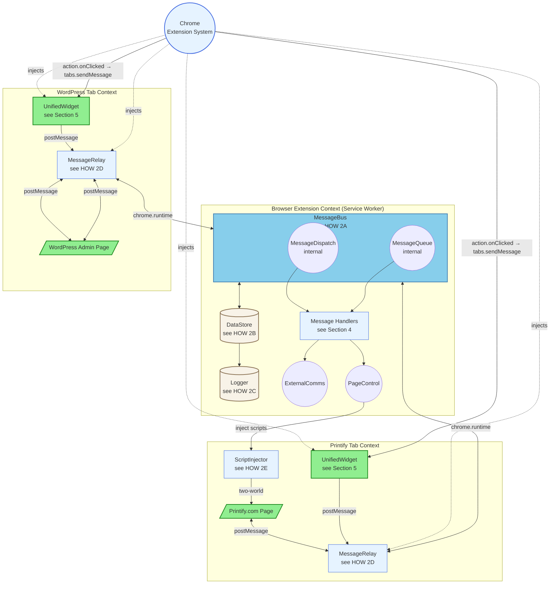
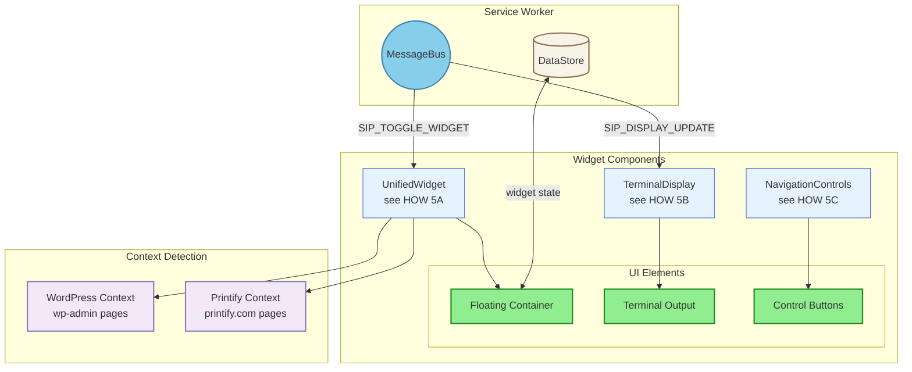

# SiP Printify Manager Extension – Refactored Documentation (v1.2) {#top}

---

### TABLE OF CONTENTS

- [1. Overview](#overview)
- [2. Main Architecture - The Three Contexts](#architecture)
- [3. Content Scripts](#content-scripts)
- [4. Message Handlers](#message-handlers)
- [5. Widget UI & Terminal Display](#widget-ui-terminal-display)
- [6. Author Checklist](#author-checklist)

---

## 1. OVERVIEW {#overview}

### I. WHAT

The SiP Printify Manager Extension (v1.2 Refactored) links three contexts to automate Printify product management:

1. **Browser Extension Context (Service Worker)** – MessageBus, Handlers, DataStore
2. **WordPress Admin Page Context** – WordPress DOM, Unified Widget, MessageRelay
3. **Printify Page Context** – Printify DOM, Unified Widget, MessageRelay, Script Injection

### II. HOW

The refactored architecture consolidates ~30 components into ~15, implementing:
- **Unified MessageBus** owning MessageDispatch and MessageQueue as internal submodules
- **Single DataStore** as the sole source of truth for all state
- **Structural design patterns** preventing issues without defensive code
- **Bidirectional MessageRelay** enabling full WordPress integration
- **Unified Widget** with single codebase for both contexts

### III. WHY

The refactored architecture addresses critical issues in the original implementation: race conditions from distributed state, duplicate READY messages from multiple emitters, and complex defensive code patterns. By consolidating message routing into MessageBus and state into DataStore, the system achieves deterministic behavior through structural design rather than runtime guards. The simplified component count reduces maintenance burden while preserving all essential functionality for WordPress-Printify integration.

---

## 2. MAIN ARCHITECTURE - The Three Contexts {#architecture}

This block documents the extension's refactored three-context architecture and component relationships.

### I. WHAT

**Diagram 2: Main Architecture (Refactored v1.2)**



**Diagram Legend:**
- 🟩 **Green** - User-facing elements (web pages, UI widgets)
- 🔵 **Sky Blue** - MessageBus (central message hub)
- 🔷 **Light Blue** - Script files and code components
- 🟫 **Tan** - Storage/State components
- ⬜ **Gray** - Chrome Extension System

### II. HOW

#### 2A MessageBus

> The MessageBus (`MessageBus.js`) is the refactored extension's central message system, consolidating the original router, queue, and dispatch into a single component.
>
> **Core Responsibilities:**
> - **Validates** all messages for required `context`, `action`, and `source` fields
> - **Routes** messages to handlers via MessageDispatch component
> - **Queues** async operations via MessageQueue component
> - **Preserves** `requestId` for response correlation
> - **Returns** `true` for async message handling
>
> **Critical Configuration:**
> The MessageBus listener MUST return `true` for async operations:
> ```javascript
> chrome.runtime.onMessage.addListener((message, sender, sendResponse) => {
>     this.handleMessage(message, sender, sendResponse);
>     return true;  // CRITICAL: Keep channel open for async
> });
> ```
> **Universal Rule:** Every onMessage listener that replies asynchronously MUST return `true`.
>
> **Message Format:**
> ```javascript
> {
>     context: 'wordpress' | 'printify' | 'extension',
>     action: 'SIP_ACTION_NAME',  // ALL CAPS with SIP_ prefix
>     source: 'sip-printify-manager' | 'sip-printify-manager-extension',
>     requestId: 'optional_correlation_id',
>     data: { ... }  // Success case
>     // XOR (mutually exclusive)
>     error: {  // Error case (NORMATIVE structure)
>         message: 'Human-readable error description',
>         code?: 'ERROR_CODE',  // Optional error code
>         details?: { ... }      // Optional additional context
>     }
> }
> ```
> **NORMATIVE**: Responses MUST contain either `data` OR `error`, never both. Handlers MUST normalize all responses to this schema.

#### 2B DataStore

> The DataStore (`DataStore.js`) serves as the single source of truth for all extension state.
>
> **State Management:**
> ```javascript
> {
>     config: new Map([
>         ['wordpressUrl', ''],
>         ['apiKey', '']
>     ]),
>     state: new Map([
>         ['paused', false],
>         ['pausedOperation', null]
>     ]),
>     registry: {
>         tabPairs: new Map(),         // tabId → pairedTabId
>         injectedTabs: new Set(),     // Tabs with content scripts
>         readyTabs: new Map(),        // tabId → { timestamp, url }
>         activeFetches: new Map()     // productId → operation
>     }
> }
> ```
> **Note**: Set/Map types require serialization for chrome.storage persistence
>
> **Structural Injection Prevention:**
> - `injectedTabs` Set prevents duplicate script injection
> - `readyTabs` Map ensures single READY emission per tab
> - No window flags or defensive checks needed

#### 2C Logger

> The Logger (`Logger.js`) provides centralized event logging separate from UI updates.
>
> **Log Entry Format:**
> ```javascript
> {
>     timestamp: Date.now(),
>     type: 'info' | 'warning' | 'error',
>     context: 'wordpress' | 'printify' | 'extension',
>     action: 'SIP_ACTION_NAME',
>     data: { ... }
> }
> ```
>
> **Storage:** Logs stored in `chrome.storage.local` with 500 entry limit

#### 2D MessageRelay

> The MessageRelay (`MessageRelay.js`) implements TRUE bidirectional communication between page and extension contexts.
>
> **Allowed Origins by Context:**
> - **WordPress**: `window.location.origin` (same origin)
> - **Printify**: `https://printify.com` or `https://*.printify.com`
>
> **Two-Listener Architecture:**
>
> 1. **Page → Extension** (with response callback):
> ```javascript
> window.addEventListener('message', (event) => {
>     if (event.origin !== this.allowedOrigin) return;
>     if (event.data?.source === 'sip-printify-manager-extension') return;
>     
>     // Lightweight schema guard
>     const m = event.data;
>     if (!m || !m.context || !m.action || !m.source) return;
>     
>     chrome.runtime.sendMessage(event.data, (response) => {
>         if (response) {
>             window.postMessage(response, this.allowedOrigin);
>         }
>     });
> });
> ```
>
> 2. **Extension → Page** (for unsolicited messages):
> ```javascript
> chrome.runtime.onMessage.addListener((message) => {
>     if (message?.source === 'sip-printify-manager-extension') {
>         window.postMessage(message, this.allowedOrigin);  // Not '*'
>     }
> });
> ```
>
> **Critical Design:** The same source value prevents loops while enabling responses
> 
> **Loop Prevention Rule:** All extension→page messages MUST set `source: 'sip-printify-manager-extension'`

#### 2E PageControl

> The PageControl (`PageControl.js`) wraps Chrome tab APIs and manages page interactions.
>
> **Key Responsibilities:**
> - Manages tab navigation with pairing
> - Injects scripts into pages
> - Sends UI updates to widgets
> - Wraps chrome.tabs, chrome.scripting, chrome.windows APIs
>
> **Tab Pairing:**
> ```javascript
> async navigateWithPairing(url, sourceTabId) {
>     const existingTab = await this.findExistingTab(url);
>     if (existingTab) {
>         await this.tabs.update(existingTab.id, { url, active: true });
>         return existingTab.id;
>     }
>     const newTab = await this.tabs.create({ url });
>     if (sourceTabId) {
>         this.dataStore.setTabPair(sourceTabId, newTab.id);
>     }
>     return newTab.id;
> }
> ```

#### 2F ExternalComms

> The ExternalComms (`ExternalComms.js`) handles WordPress API communication.
>
> **API Methods:**
> - `testConnection()` - Verify WordPress API access
> - `updateProductMockups()` - Send mockup data to WordPress
> - `saveMockupData()` - Persist mockup data
>
> **Uses DataStore config for API endpoint and authentication**

#### 2G MessageDispatch & MessageQueue

> **MessageDispatch** (`MessageDispatch.js`) routes messages to handlers using compound keys.
>
> **MessageQueue** (`MessageQueue.js`) manages async operation correlation.
>
> **Queue Pattern:**
> ```javascript
> // Handler registers expectation
> const response = await queue.wait({
>     context: 'printify',
>     action: 'SIP_MOCKUP_API_RESPONSE',
>     tabId: tabId
> }, 30000);  // 30s timeout
> ```

#### 2H ScriptInjector

> The ScriptInjector (`ScriptInjector.js`) handles two-world script injection for API interception.
>
> **Injection Contexts:**
> - **ISOLATED World**: Access to chrome.runtime, forwards messages
> - **MAIN World**: Access to page context, intercepts fetch/XHR
>
> **Critical Implementation Pattern:**
> ```javascript
> // MAIN world - can intercept but cannot use chrome.runtime
> await chrome.scripting.executeScript({
>     target: { tabId },
>     func: interceptorFunction,
>     world: 'MAIN'
> });
> 
> // ISOLATED world - can use chrome.runtime but cannot intercept
> await chrome.scripting.executeScript({
>     target: { tabId },
>     func: relayFunction,
>     world: 'ISOLATED'
> });
> ```
> **Message Flow:** MAIN captures → postMessage → ISOLATED relays → chrome.runtime
>
> **Note**: chrome.scripting.executeScript can also accept `files` parameter for external scripts
>
> **Use Cases:**
> - Printify API response capture
> - DOM manipulation requiring page context
> - Data extraction from page JavaScript

### III. WHY

The refactored architecture achieves correctness through structure rather than defensive programming. The MessageBus consolidation eliminates race conditions inherent in distributed message handling. DataStore as single source of truth removes state synchronization issues. The bidirectional MessageRelay ensures WordPress plugin integration works correctly with both request-response pairs and unsolicited updates. This structural approach makes the system's behavior deterministic and easier to reason about, reducing bugs and maintenance burden.

---

## 3. CONTENT SCRIPTS {#content-scripts}

Content scripts bridge web pages and the extension's service worker, with different bundles for WordPress and Printify contexts.

### I. WHAT

**Diagram 3: Content Scripts Architecture**


### II. HOW

#### 3A MessageRelay Implementation

> MessageRelay serves as the bidirectional bridge between page and extension contexts.
>
> <details>
> <summary>MessageRelay Functions</summary>
>
> | Function | Purpose | Implementation |
> |----------|---------|----------------|
> | Origin validation | Security check | Only accepts from `window.location.origin` |
> | Loop prevention | Prevents infinite loops | Ignores `source: 'sip-printify-manager-extension'` |
> | Response relay | Enables request-response | Callback in chrome.runtime.sendMessage |
> | Unsolicited relay | Enables push updates | Second listener for extension→page |
>
> </details>

#### 3B Widget Initialization

> The widget-init.js script coordinates component initialization.
>
> **Initialization Order:**
> 1. MessageRelay initializes first (establishes communication)
> 2. UnifiedWidget creates UI (detects context, builds DOM)
> 3. Widget emits single READY message (end of init)
>
> **Context Detection:**
> ```javascript
> detectContext() {
>     const hostname = window.location.hostname;
>     if (hostname.includes('printify.com')) return 'printify';
>     if (window.location.pathname.includes('wp-admin')) return 'wordpress';
>     return 'unknown';
> }
> ```

### III. WHY

The unified content script bundles eliminate code duplication while maintaining context-specific behavior through runtime detection. The bidirectional MessageRelay architecture, inherited from the proven wordpress-relay.js design, ensures reliable WordPress plugin communication. Loading scripts via manifest with `run_at: "document_idle"` provides structural single-injection guarantee without defensive checks. This approach reduces maintenance burden while preserving all necessary functionality.

---

## 4. MESSAGE HANDLERS {#message-handlers}

Message handlers process messages routed by MessageBus based on context and action.

### I. WHAT

**Diagram 4: Message Handlers Architecture**

```mermaid
graph TD
  subgraph "Service Worker"
    MessageBus((MessageBus))
    
    subgraph "MessageDispatch"
      Dispatch[MessageDispatch<br/>see HOW 4A]
    end
    
    subgraph "Handler Classes"
      MockupHandler[MockupHandler<br/>see HOW 4B]
      UpdateHandler[UpdateHandler<br/>see HOW 4C]
      ConnectHandler[ConnectHandler<br/>see HOW 4D]
    end
    
    MessageBus --> Dispatch
    Dispatch -->|wordpress:SIP_FETCH_MOCKUPS| MockupHandler
    Dispatch -->|extension:SIP_UPDATE_PRODUCT_MOCKUPS| UpdateHandler
    Dispatch -->|extension:SIP_TEST_CONNECTION| ConnectHandler
  end
  
  WPPage[/"WordPress Page"/] --> MessageRelay[MessageRelay]
  MessageRelay -->|{context: 'wordpress'}| MessageBus
  
  MessageBus --> DataStore[(DataStore)]
  MessageBus --> Logger[(Logger)]
  
  %% Style definitions
  classDef userFacingStyle fill:#90EE90,stroke:#228B22,stroke-width:2px
  classDef routerStyle fill:#87CEEB,stroke:#4682B4,stroke-width:2px
  classDef scriptStyle fill:#E6F3FF,stroke:#4169E1,stroke-width:1px
  classDef storageStyle fill:#F8F3E8,stroke:#8B7355,stroke-width:2px
  
  %% Apply styles
  class WPPage userFacingStyle
  class MessageBus routerStyle
  class Dispatch,MockupHandler,UpdateHandler,ConnectHandler,MessageRelay scriptStyle
  class DataStore,Logger storageStyle
```

### II. HOW

#### 4A MessageDispatch

> MessageDispatch routes messages to appropriate handlers using compound keys.
>
> **Registration Pattern:**
> ```javascript
> registerHandler(context, action, handler) {
>     const key = `${context}:${action}`;
>     this.handlers.set(key, handler);
> }
> ```
>
> **Routing Logic:**
> 1. Build compound key from message
> 2. Look up handler in Map
> 3. Call handler with message, sender
> 4. Return handler result or error

#### 4B MockupHandler

> Handles fetching mockup data from Printify.
>
> <details>
> <summary>Mockup Fetch Flow</summary>
>
> 1. Receives `SIP_FETCH_MOCKUPS` with blueprint data
> 2. Navigates to Printify mockup library
> 3. Injects API interceptor scripts
> 4. Waits for response via MessageQueue
> 5. Returns transformed data to WordPress
>
> </details>
>
> **Queue Pattern:**
> ```javascript
> const response = await this.messageBus.queue.wait({
>     context: 'printify',
>     action: 'SIP_MOCKUP_API_RESPONSE',
>     tabId: tab.id
> }, 20000);  // 20s timeout
> ```

#### 4C UpdateHandler

> Manages product mockup updates and navigation.
>
> **Handled Actions:**
> - `SIP_UPDATE_PRODUCT_MOCKUPS` - Update product mockups
> - `SIP_SAVE_MOCKUP_DATA` - Save mockup data
> - `SIP_NAVIGATE` - Navigate between contexts

#### 4D ConnectHandler

> Tests WordPress connection and manages configuration.
>
> **Connection Test:**
> ```javascript
> async testConnection() {
>     const config = this.dataStore.getConfig();
>     if (!config.wordpressUrl) {
>         return { success: false, error: 'Not configured' };
>     }
>     
>     const response = await fetch(`${config.wordpressUrl}/wp-json/sip-printify/v1/status`, {
>         headers: { 'X-API-Key': config.apiKey }
>     });
>     
>     return { success: response.ok };
> }
> ```

### III. WHY

The handler architecture uses class-based organization for better encapsulation than the original function-based approach, while maintaining the familiar compound-key routing pattern. Handlers receive dependency injection of MessageBus components, enabling clean testing and separation of concerns. The async/await pattern with MessageQueue eliminates callback hell while preserving the "all messages through MessageBus" principle. This design makes handlers easier to test, debug, and extend.

---

## 5. WIDGET UI & TERMINAL DISPLAY {#widget-ui-terminal-display}

The UnifiedWidget provides a floating interface for monitoring operations across both WordPress and Printify contexts.

### I. WHAT

**Diagram 5: Widget UI Architecture**



### II. HOW

#### 5A UnifiedWidget

> The UnifiedWidget creates and manages the floating UI.
>
> **Component Lifecycle:**
> 1. Detect context (WordPress/Printify)
> 2. Create DOM structure
> 3. Initialize sub-components
> 4. Emit single READY message
>
> **State Management:**
> ```javascript
> {
>     isVisible: true,
>     isExpanded: false,
>     context: 'wordpress' | 'printify'
> }
> ```
>
> **READY Emission Contract:**
> - **NORMATIVE**: UnifiedWidget is the ONLY component that emits READY
> - **NORMATIVE**: READY must be emitted EXACTLY ONCE per widget initialization
> - **NORMATIVE**: READY must include `url` and `timestamp` in data
> ```javascript
> emitReady() {
>     const message = {
>         context: this.context,
>         action: 'SIP_CONTENT_SCRIPT_READY',
>         source: 'sip-printify-manager',
>         data: { url: location.href, timestamp: Date.now() }
>     };
>     window.postMessage(message, window.location.origin);  // Not '*'
> }
> ```

#### 5B TerminalDisplay

> TerminalDisplay shows real-time operation progress and messages.
>
> <details>
> <summary>Terminal Message Types</summary>
>
> | Type | Display | Example |
> |------|---------|---------|
> | info | White text | "Widget ready" |
> | success | Green text | "Connection successful" |
> | error | Red text | "API request failed" |
> | warning | Yellow text | "Retry attempt 2/3" |
>
> </details>
>
> **Message Handling:**
> - Receives `SIP_DISPLAY_UPDATE` messages
> - Maintains 100 message buffer
> - Auto-scrolls to latest
> - Shows progress bars for operations

#### 5C NavigationControls

> NavigationControls manages widget buttons and navigation.
>
> **Button Functions:**
> - **Navigate**: Switch between WordPress/Printify
> - **Test Connection**: Verify WordPress API
> - **Log**: Show event history
> - **Collapse/Expand**: Toggle widget size
>
> **Context-Aware Navigation:**
> ```javascript
> updateNavigationButton() {
>     if (this.context === 'wordpress') {
>         this.navBtn.dataset.destination = 'printify';
>     } else {
>         this.navBtn.dataset.destination = 'wordpress';
>     }
> }
> ```

### III. WHY

The UnifiedWidget eliminates code duplication between WordPress and Printify contexts while maintaining context-specific behavior through runtime detection. The single READY emission pattern with Widget as sole source prevents duplicate ready messages that plagued the original implementation. Separating terminal display from logging ensures UI updates don't impact system event recording. The simplified component structure makes the widget easier to maintain and extend while preserving all essential user interactions.

---

## 6. AUTHOR CHECKLIST {#author-checklist}

- [x] All refactored code documented in WHW blocks
- [x] Intro sentence explains each block scope
- [x] Each WHAT layer present with clear architecture diagrams
- [x] HOW layers contain implementation detail without repetition
- [x] WHY layers explain rationale without repeating HOW
- [x] WHW blocks linked through node references
- [x] Links, file paths, and diagram references verified
- [ ] Edge cases tested:
  - [ ] Multiple WordPress tabs open simultaneously
  - [ ] Multiple Printify tabs open simultaneously
  - [ ] Extension reload during async operation
  - [ ] Tab closed during async operation (queue timeout handling)
  - [ ] Network failure during WordPress API call
- [ ] Missing features from v3 identified for future implementation:
  - [ ] Discovery Tool (passive data collection)
  - [ ] Modal System (VanillaModal)
  - [ ] Drag functionality for widget
  - [ ] Toast notifications
  - [ ] Auto-configuration from WordPress
  - [ ] Mockup library automation scripts
  - [ ] Product details extraction scripts
  - [ ] Widget visibility controls
  - [ ] Development reload button
  - [ ] Log viewer modal

[Back to Top](#top)