# SiP Printify Manager Extension – Documentation {#top}

---

### TABLE OF CONTENTS

- [1. Overview](#overview)
- [2. Main Architecture - The Three Contexts](#architecture)
- [3. Content Scripts](#content-scripts)
- [4. Message Handlers](#message-handlers)
- [5. Logging & Display Architecture](#logging-display-architecture)
- [6. Widget UI & Terminal Display](#widget-ui-terminal-display)
- [7. Author Checklist](#author-checklist)

---

## 1. OVERVIEW {#overview}

### I. WHAT

The SiP Printify Manager Extension links three contexts to automate Printify product management:

1. **Browser Extension Context (Service Worker)** – MessageBus, Handlers, DataStore
2. **WordPress Admin Page Context** – WordPress DOM, Unified Widget, MessageRelay
3. **Printify Page Context** – Printify DOM, Unified Widget, MessageRelay, Script Injection

### II. HOW

The refactored architecture consolidates ~30 components into ~15, implementing:
- **Unified MessageBus** owning MessageDispatch and MessageQueue as internal submodules
- **Single DataStore** as the sole source of truth for all state
- **Structural design patterns** preventing issues without defensive code
- **Bidirectional MessageRelay** enabling full WordPress integration
- **Unified Widget** with single codebase for both contexts

### III. WHY

Consolidating message routing into MessageBus and state into DataStore achieves deterministic behavior through structural design rather than runtime guards. This prevents race conditions from distributed state, eliminates duplicate READY messages from multiple emitters, and removes the need for complex defensive code patterns. The architecture enables reliable WordPress-Printify integration while minimizing maintenance burden.

**Dynamic Script Re-injection:** The service worker automatically re-injects content scripts on EVERY startup, including after `chrome.runtime.reload()`. This enables one-click extension reloading during development - no manual page refresh required. The widget checks for existing instances via DOM ID to prevent duplicates. This solution eliminates the "orphaned content script" problem that plagues Manifest V3 extensions.

**SiP Ecosystem Requirements:** The extension is part of the SiP Plugins Platform ecosystem and must maintain compatibility with the WordPress plugin suite. The message protocol contract (context/action/source fields) is dictated by the SiP Core Platform's utilities and the browser-extension-actions.js module. The `source: 'sip-printify-manager-extension'` identifier and `SIP_` action prefix are required for proper integration with WordPress plugin event handlers.

---

## 2. MAIN ARCHITECTURE - The Three Contexts {#architecture}

This block documents the extension's refactored three-context architecture and component relationships.

### I. WHAT

**Diagram 2: Main Architecture**

```mermaid
graph TD
  Chrome((Chrome<br/>Extension System))
  
  subgraph "Browser Extension Context (Service Worker)"
    subgraph MessageBus[MessageBus<br/>see HOW 2A]
      MessageDispatch((MessageDispatch<br/>internal))
      MessageQueue((MessageQueue<br/>internal))
    end
    DataStore[(DataStore<br/>see HOW 2B)]
    Logger[(Logger<br/>see HOW 2C)]
    ExternalComms((ExternalComms))
    TabPairManager((TabPairManager<br/>see 2E))
    Handlers[Message Handlers<br/>see Section 4]
    
    MessageDispatch --> Handlers
    MessageQueue --> Handlers
    MessageBus <--> DataStore
    MessageBus --> Logger
    MessageBus --> TabPairManager
    DataStore --> Logger
    Handlers --> ExternalComms
    Handlers --> TabPairManager
    TabPairManager --> DataStore
  end

  subgraph "WordPress Tab Context"
    WPPage[/WordPress Admin Page/]
    WPRelay[MessageRelay<br/>see HOW 2D]
    WPWidget[UnifiedWidget<br/>see Section 5]
    WPRelay <-->|postMessage| WPPage
    WPPage <-->|postMessage| WPRelay
    WPRelay <-->|chrome.runtime| MessageBus
    WPWidget -->|postMessage| WPRelay
  end

  subgraph "Printify Tab Context"
    PrintifyPage[/Printify.com Page/]
    PFRelay[MessageRelay<br/>see HOW 2D]
    PFWidget[UnifiedWidget<br/>see Section 5]
    ScriptInjector[ScriptInjector<br/>see HOW 2H]
    PrintifyPage <-->|postMessage| PFRelay
    PFRelay <-->|chrome.runtime| MessageBus
    PFWidget -->|postMessage| PFRelay
    TabPairManager -->|inject scripts| ScriptInjector
    ScriptInjector -->|two-world| PrintifyPage
  end
  
  Chrome -.->|injects| WPRelay
  Chrome -.->|injects| PFRelay
  Chrome -.->|injects| WPWidget
  Chrome -.->|injects| PFWidget
  
  %% Chrome.action sends toggle message directly
  Chrome -->|action.onClicked → tabs.sendMessage| WPWidget
  Chrome -->|action.onClicked → tabs.sendMessage| PFWidget
  
  %% MessageBus forwards display updates to terminals
  TabPairManager -->|SIP_DISPLAY_UPDATE| WPWidget
  TabPairManager -->|SIP_DISPLAY_UPDATE| PFWidget
  
  %% Style definitions
  classDef userFacingStyle fill:#90EE90,stroke:#228B22,stroke-width:2px
  classDef routerStyle fill:#87CEEB,stroke:#4682B4,stroke-width:2px
  classDef scriptStyle fill:#E6F3FF,stroke:#4169E1,stroke-width:1px
  classDef storageStyle fill:#F8F3E8,stroke:#8B7355,stroke-width:2px
  classDef chromeStyle fill:#E6F3FF,stroke:#4169E1,stroke-width:2px
  
  %% Apply styles
  class WPPage,PrintifyPage,WPWidget,PFWidget userFacingStyle
  class MessageBus routerStyle
  class WPRelay,PFRelay,ScriptInjector scriptStyle
  class DataStore,Logger storageStyle
  class Handlers scriptStyle
  class Chrome chromeStyle
```



**Diagram Legend:**
- 🟩 **Green** - User-facing elements (web pages, UI widgets)
- 🔵 **Sky Blue** - MessageBus (central message hub)
- 🔷 **Light Blue** - Script files and code components
- 🟫 **Tan** - Storage/State components
- ⬜ **Gray** - Chrome Extension System

### II. HOW

#### 2A MessageBus

> The MessageBus (`MessageBus.js`) is the refactored extension's central message system, consolidating the original router, queue, and dispatch into a single component.
>
> **Core Responsibilities:**
> - **Validates** all messages for required `context`, `action`, and `source` fields
> - **Logs** complete v4 messages via Logger for historical record
> - **Forwards** display actions to terminal displays automatically
> - **Routes** messages to handlers via MessageDispatch component
> - **Queues** async operations via MessageQueue component
> - **Preserves** `requestId` for response correlation
> - **Returns** `true` for async message handling
>
> **Message Flow Sequence:**
> 1. Validate message contract
> 2. Log complete message to Logger (v4 format)
> 3. Forward display actions to terminals
> 4. Check MessageQueue for waiting operations
> 5. Route to handler via MessageDispatch
> 6. Return response with preserved requestId
>
> **Display Action Forwarding:**
> MessageBus forwards display-specific actions to terminals (see [HOW 2C](#2c-logger--unified-message-logging) for display action types). Operational messages are converted to display format before forwarding.
>
> **Critical Configuration:**
> The MessageBus listener MUST return `true` for async operations:
> ```javascript
> chrome.runtime.onMessage.addListener((message, sender, sendResponse) => {
>     this.handleMessage(message, sender, sendResponse);
>     return true;  // CRITICAL: Keep channel open for async
> });
> ```
> **Universal Rule:** Every onMessage listener that replies asynchronously MUST return `true`.
>
> **Message Format:**
> ```javascript
> {
>     context: 'wordpress' | 'printify' | 'extension',
>     action: 'SIP_ACTION_NAME',  // ALL CAPS with SIP_ prefix (Platform requirement)
>     source: 'sip-printify-manager' | 'sip-printify-manager-extension',  // Platform requirement
>     requestId: 'optional_correlation_id',  // Generated by SiP.Core.utilities.generateRequestId()
>     data: { ... }  // Success case
>     // XOR (mutually exclusive)
>     error: {  // Error case (NORMATIVE structure)
>         message: 'Human-readable error description',
>         code?: 'ERROR_CODE',  // Optional error code
>         details?: { ... }      // Optional additional context
>     }
> }
> ```
> **NORMATIVE**: Responses MUST contain either `data` OR `error`, never both. Handlers MUST normalize all responses to this schema.
> **PLATFORM REQUIREMENT**: The `SIP_` prefix and source field values are mandated by the SiP Plugins Platform for proper WordPress plugin integration (see [SiP Core Platform Guide](../sip-core-platform.md)).

#### 2B DataStore

##### I. WHAT

DataStore serves as the single source of truth for all extension state, managing configuration, runtime state, and registries.


##### II. HOW

###### 2B-1 Configuration Storage

> Persistent configuration synchronized across browser instances.
>
> **Config Map:**
> - `wordpressUrl` → Site URL for API calls
> - `apiKey` → Authentication token
> 
> Persisted to `chrome.storage.sync` for cross-device access.

###### 2B-2 Runtime State

> Temporary operational state cleared on restart.
>
> **State Map:**
> - `paused` → Operation pause status
> - `pausedOperation` → Details of paused operation

###### 2B-3 Registry Management

> In-memory registries with selective persistence.
>
> <details>
> <summary>Registry Structure</summary>
>
> ```javascript
> registry: {
>     tabPairs: new Map(),      // Bidirectional: tabId ↔ pairedTabId
>     injectedTabs: new Set(),  // Tabs with content scripts
>     readyTabs: new Map(),     // tabId → { timestamp, url }
>     activeFetches: new Map()  // productId → operation
> }
> ```
> </details>
>
> **Bidirectional Pairing:**
> ```javascript
> setTabPair(tab1Id, tab2Id) {
>     this.registry.tabPairs.set(tab1Id, tab2Id);
>     this.registry.tabPairs.set(tab2Id, tab1Id);
>     this.persistTabPairs();
> }
> ```
>
> **Structural Injection Prevention:**
> Single-init guaranteed by registry check:
> ```javascript
> if (this.registry.injectedTabs.has(tabId)) return false;
> ```

##### III. WHY

DataStore centralizes all state management to prevent synchronization bugs common in distributed state systems. The registry pattern provides O(1) lookups for performance-critical operations like tab pairing checks. Bidirectional pairing storage ensures navigation works from either context without additional lookups. The structural injection prevention eliminates race conditions in content script injection without relying on DOM flags that could be cleared by page navigation.

#### 2C Logger & Unified Message Logging

> The Logger (`Logger.js`) stores complete v4 messages for historical record, maintaining format consistency throughout the system.
>
> **Unified v4 Format:** Logger stores actual messages sent/received, not transformed data. This provides complete traceability and debugging capability.
>
> **Log Entry Format:**
> ```javascript
> {
>     timestamp: Date.now(),
>     message: { ... },  // Complete v4 message (see HOW 2A for format)
>     sender: {  // Optional sender metadata
>         tabId: number,
>         url: string,
>         frameId: number
>     }
> }
> ```
>
> **Display Action Types:**
> Logger recognizes three display-specific actions for terminal/modal presentation:
>
> <details>
> <summary>Display Action Definitions</summary>
>
> ```javascript
> // Progress tracking (mockup fetch, product update)
> {
>     context: 'extension',
>     action: 'SIP_OPERATION_PROGRESS',
>     source: 'sip-printify-manager-extension',
>     data: {
>         operationId: 'mockup_fetch_123',
>         operation: 'mockup_fetch',
>         progress: 45,  // 0-100
>         message: 'Fetching mockups...',
>         complete: false
>     }
> }
>
> // Status messages (success, error, warning, info)
> {
>     context: 'extension',
>     action: 'SIP_STATUS_MESSAGE',
>     source: 'sip-printify-manager-extension',
>     data: {
>         message: 'Configuration updated',
>         level: 'success',  // success|error|warning|info
>         details: { ... }  // Optional
>     }
> }
>
> // Generic display update (backward compatibility)
> {
>     context: 'extension',
>     action: 'SIP_DISPLAY_UPDATE',
>     source: 'sip-printify-manager-extension',
>     data: {
>         message: string,
>         progress?: number,
>         level?: string,
>         complete?: boolean
>     }
> }
> ```
> </details>
>
> **Storage:**
> - Maximum 500 entries in memory
> - Persisted to `sipExtensionLogs` in chrome.storage
> - Clear operation maintains key with empty array (v3 compatibility)
>
> **Helper Methods:**
> ```javascript
> // Create display messages
> logger.createOperationProgress(operationId, operation, progress, message, complete)
> logger.createStatusMessage(message, level, details)
> ```
>     }
> }
> ```
>
> **Storage:** 
> - In-memory: 1000 entries for quick access
> - Persisted: `sipExtensionLogs` in chrome.storage.local
> - Selective persistence based on event type importance

#### 2D MessageRelay

> The MessageRelay (`MessageRelay.js`) implements TRUE bidirectional communication between page and extension contexts.
>
> **Allowed Origins by Context:**
> - **WordPress**: `window.location.origin` (same origin)
> - **Printify**: `https://printify.com` or `https://*.printify.com`
>
> **Two-Listener Architecture:**
>
> 1. **Page → Extension** (with response callback):
> ```javascript
> window.addEventListener('message', (event) => {
>     if (event.origin !== this.allowedOrigin) return;
>     if (event.data?.source === 'sip-printify-manager-extension') return;
>     
>     // Lightweight schema guard
>     const m = event.data;
>     if (!m || !m.context || !m.action || !m.source) return;
>     
>     chrome.runtime.sendMessage(event.data, (response) => {
>         if (response) {
>             window.postMessage(response, this.allowedOrigin);
>         }
>     });
> });
> ```
>
> 2. **Extension → Page** (for unsolicited messages):
> ```javascript
> chrome.runtime.onMessage.addListener((message) => {
>     if (message?.source === 'sip-printify-manager-extension') {
>         window.postMessage(message, this.allowedOrigin);  // Not '*'
>     }
> });
> ```
>
> **Critical Design:** The same source value prevents loops while enabling responses
> 
> **Loop Prevention Rule:** All extension→page messages MUST set `source: 'sip-printify-manager-extension'`

#### 2E TabPairManager

##### I. WHAT

TabPairManager orchestrates all tab-related operations, managing bidirectional pairing between WordPress and Printify tabs with intent-based navigation.

```mermaid
graph LR
    subgraph TabPairManager
        NI[navigate()<br/>see HOW 2E-1]
        DI[deriveIntent()<br/>see HOW 2E-2]
        GS[getNavigationStrategy()<br/>see HOW 2E-3]
        ES[executeStrategy()<br/>see HOW 2E-4]
        CW[coordinateWidgets()<br/>see HOW 2E-5]
        
        NI --> DI
        NI --> GS
        GS --> ES
        ES --> CW
    end
    
    Handler[Handler] -->|message| NI
    DS[DataStore] <-->|pairs| GS
    CT[Chrome APIs] <--> ES
    MB[MessageBus] <-- CW
    
    NI -->|result| Handler
```

##### II. HOW

###### 2E-1 Navigate Method

> Primary entry point that orchestrates navigation with intent-based behavior.
>
> ```javascript
> async navigate(url, sourceTabId, message) {
>     const intent = this.deriveIntent(message);
>     const strategy = await this.getNavigationStrategy(sourceTabId, url);
>     const result = await this.executeStrategy(strategy, url, sourceTabId, intent);
>     await this.coordinateWidgets(result, intent, sourceTabId);
>     return { tabId, action, focusChanged };
> }
> ```

###### 2E-2 Intent Derivation

> Extracts navigation intent from message action and data.
>
> **Intent Mapping:**
> - `action.includes('FETCH')` → `'background-fetch'` (no focus)
> - `action.includes('UPDATE')` → `'interactive'` (immediate focus)
> - `action.includes('NAVIGATE')` → `'interactive'` (immediate focus)
> - `message.data.batch === true` → `'batch'` (focus on error)
> - `message.data.intent` → explicit intent (overrides derivation)

###### 2E-3 Navigation Strategy

> Determines optimal tab usage based on pairing and existing tabs.
>
> **Strategy Decision Tree:**
> 1. Check paired tab exists → `'use-paired'`
>    - Same URL detected → `isSameUrl: true`
>    - Different URL → `isSameUrl: false`
> 2. No paired tab → check domain tabs
>    - Found existing → `'use-existing'` + `shouldPair: true`
>    - None found → `'create-new'` + `shouldPair: true`

###### 2E-4 Strategy Execution

> Executes navigation with intent-based focus policies.
>
> <details>
> <summary>Focus Policy Matrix</summary>
>
> | Intent | Focus Behavior | Window Focus | Widget Action |
> |--------|---------------|--------------|---------------|
> | `interactive` | Always | Yes | Expand |
> | `background-fetch` | Never | No | Show alert |
> | `batch` | On error only | On error | Progress bar |
> | `on-complete` | When done | When done | Expand |
>
> </details>
>
> **Same-URL Optimization:** When `isSameUrl === true`, only focuses without reload.

###### 2E-5 Widget Coordination

> Synchronizes widget states across paired tabs.
>
> **Widget Messages:**
> ```javascript
> {
>     context: 'extension',
>     action: 'SIP_WIDGET_CONTROL',
>     data: {
>         action: 'expand' | 'show-alert' | 'show-progress',
>         message: string,
>         pairedTabId?: number
>     }
> }
> ```

###### 2E-6 Tab Pairing Persistence

> Maintains bidirectional pairing through DataStore.
>
> **Lifecycle Events:**
> - `setTabPair(tab1, tab2)` → Sets both directions
> - `chrome.storage.local['sipTabPairs']` → Persists pairs
> - `loadPersistedData()` → Restores on startup
> - `chrome.tabs.onRemoved` → Cleans both directions
> - `validateTabPairs()` → Removes orphaned pairs

##### III. WHY

The TabPairManager consolidates all tab logic into a single orchestrator rather than spreading it across handlers and services. This prevents race conditions in tab operations and ensures consistent pairing behavior. The intent-based system allows handlers to declare their navigation purpose through the existing message format, enabling the extension to intelligently manage focus without stealing attention during background operations. Bidirectional pairing ensures users can navigate from either context back to its partner, critical for the WordPress↔Printify workflow where users frequently switch between platforms.

#### 2F ExternalComms

> The ExternalComms (`ExternalComms.js`) handles WordPress API communication.
>
> **API Methods:**
> - `testConnection()` - Verify WordPress API access
> - `updateProductMockups()` - Send mockup data to WordPress
> - `saveMockupData()` - Persist mockup data
>
> **Uses DataStore config for API endpoint and authentication**

#### 2G MessageDispatch & MessageQueue

> **MessageDispatch** (`MessageDispatch.js`) routes messages to handlers using compound keys.
>
> **MessageQueue** (`MessageQueue.js`) manages async operation correlation.
>
> **Queue Pattern:**
> ```javascript
> // Handler registers expectation
> const response = await queue.wait({
>     context: 'printify',
>     action: 'SIP_MOCKUP_API_RESPONSE',
>     tabId: tabId
> }, 30000);  // 30s timeout
> ```

#### 2H ScriptInjector

> The ScriptInjector (`ScriptInjector.js`) handles two-world script injection for API interception.
>
> **Injection Contexts:**
> - **ISOLATED World**: Access to chrome.runtime, forwards messages
> - **MAIN World**: Access to page context, intercepts fetch/XHR
>
> **Critical Implementation Pattern:**
> ```javascript
> // MAIN world - can intercept but cannot use chrome.runtime
> await chrome.scripting.executeScript({
>     target: { tabId },
>     func: interceptorFunction,
>     world: 'MAIN'
> });
> 
> // ISOLATED world - can use chrome.runtime but cannot intercept
> await chrome.scripting.executeScript({
>     target: { tabId },
>     func: relayFunction,
>     world: 'ISOLATED'
> });
> ```
> **Message Flow:** MAIN captures → postMessage → ISOLATED relays → chrome.runtime
>
> **Note**: chrome.scripting.executeScript can also accept `files` parameter for external scripts
>
> **Use Cases:**
> - Printify API response capture
> - DOM manipulation requiring page context
> - Data extraction from page JavaScript

### III. WHY

The refactored architecture achieves correctness through structure rather than defensive programming. The MessageBus consolidation eliminates race conditions inherent in distributed message handling. DataStore as single source of truth removes state synchronization issues. The bidirectional MessageRelay ensures WordPress plugin integration works correctly with both request-response pairs and unsolicited updates. This structural approach makes the system's behavior deterministic and easier to reason about, reducing bugs and maintenance burden.

**Dual-Purpose Message Flow:** The MessageBus implements the v3 pattern of both logging AND displaying events, but with clean separation of concerns. Every message flows through MessageBus where it's logged for historical record (via Logger) and simultaneously forwarded for real-time display (via TabPairManager). This dual flow ensures complete observability: terminals show operations as they happen for immediate feedback, while logs preserve the full history for debugging. The separation means UI updates never interfere with logging and vice versa.

**WordPress Plugin Compatibility:** The MessageBus must preserve exact message formats expected by the SiP Printify Manager WordPress plugin. The `requestId` field correlation is required for the plugin's `SiP.Core.utilities.generateRequestId()` pattern. The source field distinction (`sip-printify-manager` from WordPress, `sip-printify-manager-extension` from extension) prevents infinite loops and enables the WordPress plugin's jQuery event system to properly identify extension responses.

---

## 3. CONTENT SCRIPTS {#content-scripts}

Content scripts bridge web pages and the extension's service worker, with different bundles for WordPress and Printify contexts.

### I. WHAT

**Diagram 3: Content Scripts Architecture**


### II. HOW

#### 3A MessageRelay Implementation

> MessageRelay serves as the bidirectional bridge between page and extension contexts.
>
> <details>
> <summary>MessageRelay Functions</summary>
>
> | Function | Purpose | Implementation |
> |----------|---------|----------------|
> | Origin validation | Security check | Only accepts from `window.location.origin` |
> | Loop prevention | Prevents infinite loops | Ignores `source: 'sip-printify-manager-extension'` |
> | Response relay | Enables request-response | Callback in chrome.runtime.sendMessage |
> | Unsolicited relay | Enables push updates | Second listener for extension→page |
>
> </details>

#### 3B Widget Initialization

> The widget-init.js script coordinates component initialization.
>
> **Initialization Order:**
> 1. MessageRelay initializes first (establishes communication)
> 2. UnifiedWidget creates UI (detects context, builds DOM)
> 3. Widget emits single READY message (end of init)
>
> **Context Detection:**
> ```javascript
> detectContext() {
>     const hostname = window.location.hostname;
>     if (hostname.includes('printify.com')) return 'printify';
>     if (window.location.pathname.includes('wp-admin')) return 'wordpress';
>     return 'unknown';
> }
> ```

### III. WHY

The unified content script bundles eliminate code duplication while maintaining context-specific behavior through runtime detection. The bidirectional MessageRelay architecture ensures reliable WordPress plugin communication through request-response pairs and unsolicited updates. Loading scripts via manifest with `run_at: "document_idle"` provides structural single-injection guarantee without defensive checks.

**SiP Platform Integration:** The MessageRelay must handle messages from the WordPress plugin's browser-extension-actions.js module (see [SiP Core Platform Guide](../sip-core-platform.md)). The `source: 'sip-printify-manager'` identifier indicates messages from the WordPress plugin, while `source: 'sip-printify-manager-extension'` identifies extension responses. This source field pattern is required by the plugin's message filtering logic to prevent loops and enable proper jQuery event triggering.

---

## 4. MESSAGE HANDLERS {#message-handlers}

Message handlers process messages routed by MessageBus based on context and action.

### I. WHAT

**Diagram 4: Message Handlers Architecture**

```mermaid
graph TD
  subgraph "Service Worker"
    MessageBus((MessageBus))
    
    subgraph "MessageDispatch"
      Dispatch[MessageDispatch<br/>see HOW 4A]
    end
    
    subgraph "Handler Classes"
      MockupHandler[MockupHandler<br/>see HOW 4B]
      UpdateHandler[UpdateHandler<br/>see HOW 4C]
      ConnectHandler[ConnectHandler<br/>see HOW 4D]
      ReloadHandler[ReloadHandler<br/>see HOW 4E]
    end
    
    MessageBus --> Dispatch
    Dispatch -->|wordpress:SIP_FETCH_MOCKUPS| MockupHandler
    Dispatch -->|extension:SIP_UPDATE_PRODUCT_MOCKUPS| UpdateHandler
    Dispatch -->|extension:SIP_TEST_CONNECTION| ConnectHandler
    Dispatch -->|wordpress:SIP_AUTO_CONFIGURE| ConnectHandler
    Dispatch -->|extension:SIP_RELOAD_EXTENSION| ReloadHandler
  end
  
  WPPage[/"WordPress Page"/] --> MessageRelay[MessageRelay]
  MessageRelay -->|{context: 'wordpress'}| MessageBus
  
  MessageBus --> DataStore[(DataStore)]
  MessageBus --> Logger[(Logger)]
  
  %% Style definitions
  classDef userFacingStyle fill:#90EE90,stroke:#228B22,stroke-width:2px
  classDef routerStyle fill:#87CEEB,stroke:#4682B4,stroke-width:2px
  classDef scriptStyle fill:#E6F3FF,stroke:#4169E1,stroke-width:1px
  classDef storageStyle fill:#F8F3E8,stroke:#8B7355,stroke-width:2px
  
  %% Apply styles
  class WPPage userFacingStyle
  class MessageBus routerStyle
  class Dispatch,MockupHandler,UpdateHandler,ConnectHandler,ReloadHandler,MessageRelay scriptStyle
  class DataStore,Logger storageStyle
```

### II. HOW

#### 4A MessageDispatch

> MessageDispatch routes messages to appropriate handlers using compound keys.
>
> **Registration Pattern:**
> ```javascript
> registerHandler(context, action, handler) {
>     const key = `${context}:${action}`;
>     this.handlers.set(key, handler);
> }
> ```
>
> **Routing Logic:**
> 1. Build compound key from message
> 2. Look up handler in Map
> 3. Call handler with message, sender
> 4. Return handler result or error

#### 4B MockupHandler

> Handles fetching mockup data from Printify.
>
> <details>
> <summary>Mockup Fetch Flow</summary>
>
> 1. Receives `SIP_FETCH_MOCKUPS` with blueprint data
> 2. Navigates to Printify using TabPairManager (background-fetch intent)
> 3. Injects API interceptor scripts
> 4. Waits for response via MessageQueue
> 5. Returns transformed data to WordPress
>
> </details>
>
> **Queue Pattern:**
> ```javascript
> const response = await this.messageBus.queue.wait({
>     context: 'printify',
>     action: 'SIP_MOCKUP_API_RESPONSE',
>     tabId: tab.id
> }, 20000);  // 20s timeout
> ```

#### 4C UpdateHandler

> Manages product mockup updates and navigation.
>
> **Handled Actions:**
> - `SIP_UPDATE_PRODUCT_MOCKUPS` - Update product mockups
> - `SIP_SAVE_MOCKUP_DATA` - Save mockup data
> - `SIP_NAVIGATE` - Navigate between contexts

#### 4D ConnectHandler

> Manages WordPress connection and configuration.

#### 4E ReloadHandler

> Triggers extension reload for development.
>
> **Actions Handled:**
> - `SIP_RELOAD_EXTENSION` - Reloads entire extension

#### 4F ConnectHandler Actions

> **Actions Handled:**
> - `SIP_TEST_CONNECTION` - Test WordPress API connection
> - `SIP_UPDATE_CONFIG` - Update configuration
> - `SIP_GET_CONFIG` - Retrieve current configuration
> - `SIP_CLEAR_CONFIG` - Clear stored configuration
> - `SIP_AUTO_CONFIGURE` - Auto-configure from WordPress (see [HOW 5A](#5a-unifiedwidget) for configuration sources)

### III. WHY

The handler architecture uses class-based organization for encapsulation and maintainability, with compound-key routing for efficient message dispatch. Handlers receive dependency injection of MessageBus components, enabling clean testing and separation of concerns. The async/await pattern with MessageQueue provides clean async handling while preserving the "all messages through MessageBus" principle.

**Auto-Configuration Dual Sources:** The extension checks two configuration sources to maximize compatibility. The `window.sipPrintifyManager` object is preferred as it's directly set by the WordPress plugin's JavaScript. The meta tag serves as fallback for cases where the global object isn't available due to script loading order or conflicts. This redundancy ensures reliable auto-configuration across different WordPress setups.

**Development Reload:** The ReloadHandler enables one-click reload capability essential for development workflow. Direct `chrome.runtime.sendMessage()` bypasses MessageRelay to ensure immediate reload even if relay components are unresponsive.

**WordPress Plugin Requirements:** Handlers must respond to specific actions defined in the WordPress plugin's mockup-actions.js and browser-extension-actions.js modules. The `SIP_REQUEST_EXTENSION_STATUS` action must return an object with `slug: 'sip-printify-manager-extension'` for proper detection. The `SIP_FETCH_MOCKUPS` action must preserve the `requestId` generated by `SiP.Core.utilities.generateRequestId()` (see [SiP Core Platform Guide](../sip-core-platform.md#core-utilities)) to enable the WordPress plugin to correlate async responses with their requests.

---

## 5. LOGGING & DISPLAY ARCHITECTURE {#logging-display-architecture}

The extension implements a unified logging and display system using v4 message format throughout.

### I. WHAT

**Diagram 5: Logging & Display Flow**

```mermaid
graph LR
    subgraph "Message Flow"
        Handler[Handler]
        MB[MessageBus]
        Logger[Logger]
        TPM[TabPairManager]
    end
    
    subgraph "Storage"
        Storage[(chrome.storage<br/>sipExtensionLogs)]
    end
    
    subgraph "Display Components"
        Terminal[TerminalDisplay<br/>Real-time]
        Modal[VanillaModal<br/>Historical]
    end
    
    Handler -->|v4 message| MB
    MB -->|log message| Logger
    MB -->|display action| TPM
    Logger -->|store| Storage
    TPM -->|forward| Terminal
    Storage -->|read| Modal
    
    %% Style
    classDef messageStyle fill:#E6F3FF,stroke:#4169E1
    classDef storageStyle fill:#F8F3E8,stroke:#8B7355
    classDef displayStyle fill:#90EE90,stroke:#228B22
    
    class Handler,MB,TPM messageStyle
    class Logger,Storage storageStyle
    class Terminal,Modal displayStyle
```

### II. HOW

#### 5A Unified Message Format

> All logging uses standard v4 message format (see [HOW 2A](#2a-messagebus) for complete message specification).
>
> Logger wraps messages in log entries with timestamp and sender metadata (see [HOW 2C](#2c-logger--unified-message-logging)).

#### 5B Display Action Types

> Three specialized actions for terminal/modal display (see [HOW 2C](#2c-logger--unified-message-logging) for complete specifications).

#### 5C Message Flow Sequence

> Messages flow through the system in a specific sequence.
>
> 1. **Handler sends message** → MessageBus
> 2. **MessageBus logs** → Logger stores with timestamp
> 3. **MessageBus converts** → Display action if needed
> 4. **MessageBus forwards** → TabPairManager
> 5. **TabPairManager broadcasts** → All terminals
> 6. **Terminal displays** → Real-time update
> 7. **User opens log** → Modal reads from storage

### III. WHY

The unified v4 format eliminates format conversions and data transformations that cause bugs and complexity. By storing actual messages, the system provides complete traceability - you can see exactly what was sent and received. The separation between real-time display (Terminal) and historical viewing (Modal) ensures the terminal remains responsive while preserving complete history. Display-specific actions allow rich UI updates without breaking the standard message contract.

---

## 6. WIDGET UI & TERMINAL DISPLAY {#widget-ui-terminal-display}

The UnifiedWidget provides a floating interface for monitoring operations across both WordPress and Printify contexts.

### I. WHAT

**Diagram 5: Widget UI Architecture**


### II. HOW

#### 5A UnifiedWidget

> The UnifiedWidget creates and manages the floating UI.
>
> **Component Lifecycle:**
> 1. Detect context (WordPress/Printify)
> 2. Create DOM structure
> 3. Initialize sub-components
> 4. Check for auto-configuration (WordPress only)
> 5. Emit single READY message
>
> **Auto-Configuration Check (WordPress only):**
> - Checks `window.sipPrintifyManager.apiKey` first (primary source)
> - Falls back to `<meta name="sip-extension-config">` (secondary source)
> - Sends `SIP_AUTO_CONFIGURE` message if configuration found
>
> **Widget Controls:**
> - Navigate button - Context-aware navigation
> - Log button - Opens VanillaModal with historical logs
> - Test button - Test WordPress connection
> - Reload button (↻) - Development reload with hover effects
>
> **State Management:**
> ```javascript
> {
>     isVisible: true,
>     isExpanded: false,
>     context: 'wordpress' | 'printify'
> }
> ```
>
> **READY Emission Contract:**
> - **NORMATIVE**: UnifiedWidget is the ONLY component that emits READY
> - **NORMATIVE**: READY must be emitted EXACTLY ONCE per widget initialization
> - **NORMATIVE**: READY must include `url` and `timestamp` in data
> ```javascript
> emitReady() {
>     const message = {
>         context: this.context,
>         action: 'SIP_CONTENT_SCRIPT_READY',
>         source: 'sip-printify-manager',
>         data: { url: location.href, timestamp: Date.now() }
>     };
>     window.postMessage(message, window.location.origin);  // Not '*'
> }
> ```

#### 5B TerminalDisplay

> TerminalDisplay shows real-time operation progress and status messages using v4 unified format.
>
> **v4 Message Handling:**
> ```javascript
> // Handles three display action types
> handleMessage(message) {
>     switch(message.action) {
>         case 'SIP_OPERATION_PROGRESS':
>             this.showOperationProgress(message.data);
>             break;
>         case 'SIP_STATUS_MESSAGE':
>             this.showStatusMessage(message.data);
>             break;
>         case 'SIP_DISPLAY_UPDATE':
>             // Backward compatibility
>             this.update(message.data);
>             break;
>     }
> }
> ```
>
> <details>
> <summary>Display Formatting by Action Type</summary>
>
> | Action | Data Fields | Display |
> |--------|------------|---------|
> | `SIP_OPERATION_PROGRESS` | operationId, progress, message, complete | Progress bar + message |
> | `SIP_STATUS_MESSAGE` | message, level, details | Colored text by level |
> | `SIP_DISPLAY_UPDATE` | message, progress?, level? | Auto-detect format |
>
> **Level Colors:**
> - `success` → Green text
> - `error` → Red text
> - `warning` → Yellow text
> - `info` → White text
>
> </details>
>
> **Message Sources:**
> 1. **Automatic from MessageBus** - Display actions forwarded to all terminals
> 2. **Direct from TabPairManager** - Handler-initiated updates
>
> **Display Features:**
> - 100 message buffer for scrollback
> - Progress bar for operations (0-100%)
> - Auto-clear progress after completion
> - Auto-scrolls to latest
> - Shows progress bars for operations
>
> **Critical Design:** Terminal shows events AS THEY HAPPEN, not historical logs. Log button will show historical data via VanillaModal (separate system).

#### 6C VanillaModal

> VanillaModal provides draggable, resizable modals for viewing historical logs.
>
> **Features:**
> - Draggable by header
> - Resizable from 8 edges (n, e, s, w, ne, se, sw, nw)
> - State persistence to chrome.storage
> - Escape key to close
>
> **Log Modal Display:**
> ```javascript
> showLogModal(logs) {
>     // Logs in v4 format: { timestamp, message, sender }
>     const modal = new VanillaModal({
>         id: 'sip-action-log-modal',
>         title: 'SiP Extension - Action Log',
>         content: buildLogContentHtml(logs),
>         width: 800,
>         height: 600,
>         saveState: true
>     });
> }
> ```
>
> <details>
> <summary>Log Table Columns</summary>
>
> | Column | Source | Display |
> |--------|--------|---------|
> | Time | entry.timestamp | toLocaleTimeString() |
> | Context | message.context | wordpress/printify/extension |
> | Action | message.action | SIP_* action name |
> | Status | Derived from action/data | ERROR/SUCCESS/WARNING/INFO/% |
> | Message | message.data | Formatted message or JSON |
>
> </details>
>
> **Modal Actions:**
> - Clear Logs - Sends `SIP_CLEAR_LOGS` to LogHandler
> - Copy Log - Copies plain text to clipboard

#### 6D NavigationControls

> NavigationControls manages widget buttons and navigation.
>
> **Button Functions:**
> - **Navigate**: Switch between WordPress/Printify
> - **Test Connection**: Verify WordPress API
> - **Log**: Show event history
> - **Collapse/Expand**: Toggle widget size
>
> **Context-Aware Navigation:**
> ```javascript
> updateNavigationButton() {
>     if (this.context === 'wordpress') {
>         this.navBtn.dataset.destination = 'printify';
>     } else {
>         this.navBtn.dataset.destination = 'wordpress';
>     }
> }
> ```

### III. WHY

The UnifiedWidget eliminates code duplication between WordPress and Printify contexts while maintaining context-specific behavior through runtime detection. The single READY emission pattern with Widget as sole source prevents duplicate ready messages that plagued the original implementation. Separating terminal display from logging ensures UI updates don't impact system event recording. The simplified component structure makes the widget easier to maintain and extend while preserving all essential user interactions.

**jQuery Event Compatibility:** The widget must respond to `SIP_SHOW_WIDGET` and `SIP_TOGGLE_WIDGET` actions sent from the WordPress plugin's browser-extension-actions.js module. The widget's visibility state changes trigger jQuery events (`extensionDetected`, `extensionStatusUpdate`) that the WordPress plugin listens for. The terminal display must handle `SIP_DISPLAY_UPDATE` messages to show operation progress that corresponds to WordPress plugin actions like mockup fetching initiated from the blueprint table.

---

## 7. AUTHOR CHECKLIST {#author-checklist}

- [x] All refactored code documented in WHW blocks
- [x] Intro sentence explains each block scope
- [x] Each WHAT layer present with clear architecture diagrams
- [x] HOW layers contain implementation detail without repetition
- [x] WHY layers explain rationale without repeating HOW
- [x] WHW blocks linked through node references
- [x] Links, file paths, and diagram references verified


[Back to Top](#top)