# SiP Printify Manager Browser Extension - Three-Layer Documentation

This document provides complete technical documentation for the SiP Printify Manager browser extension, which bridges WordPress and Printify.com for automated workflows. The extension overcomes Printify's API limitations by acting as a privileged intermediary with full access to internal APIs and page data.

**Document outline:**
- 1. Overview
- 2. Architecture
  - 2.1 Master System Architecture
  - 2.2 Message Flow
  - 2.3 Widget Terminal Display
  - 2.4 Storage Architecture
  - 2.5 Configuration Management
  - 2.6 Tab Pairing System
- 3. Implementation Guide
  - 3.1 Architectural Constraints
  - 3.2 Message Channel Design
  - 3.3 Action Logging System
  - 3.4 Terminal Display Implementation
  - 3.5 Mockup Scene Mapping
  - 3.6 Chrome Architecture Constraints
  - 3.7 Critical Patterns
  - 3.8 Adding New Features
- 4. Storage Schema
- 5. Message Type Reference
  - 5.1 WordPress Commands
  - 5.2 Internal Actions
- 6. Key Features
  - 6.1 Tab Pairing System
  - 6.2 Widget Terminal Display
  - 6.3 Pause/Resume Error Recovery
  - 6.4 Response Logging Architecture
  - 6.5 Content Security Policy Compliance
  - 6.6 Public API Naming Standards
  - 6.7 Scene-Based Mockup Selection Flow
  - 6.8 Scene-Based Selection Implementation
  - 6.9 Error Capture System
  - 6.10 Action Logging Helper
  - 6.11 Diagnostic and Monitoring Tools
  - 6.12 Action Log Visual Hierarchy
- 7. Development Quick Reference
  - 7.1 File Structure
  - 7.2 Testing Checklist
  - 7.3 Terminal Display Testing
- 8. Key Implementation Notes
  - 8.1 Separate Progress Systems
  - 8.2 Message Persistence
  - 8.3 State Management
  - 8.4 Service Worker Safe Logging
- 9. Conclusion

**Repository**: https://github.com/tdemelle-SiP/sip-printify-manager-extension

## 1. Overview

This section explains the extension's purpose, access levels, and why it bridges a critical gap between WordPress and Printify.

### I. System Purpose

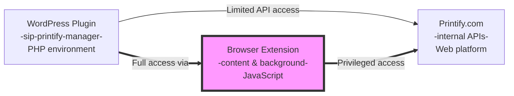

### II. Access Levels

| Component | Printify Public API | Printify Internal APIs | Page DOM Access |
|-----------|-------------------|---------------------|-----------------|
| WordPress Plugin | ✓ Limited endpoints | ❌ No access | ❌ No access |
| Browser Extension | ✓ All endpoints | ✓ Full access | ✓ Full access |
| Content Scripts | ❌ CORS blocked | ✓ Via page context | ✓ Direct manipulation |

### III. Extension Bridges Critical Gap

Printify intentionally limits their public API to protect their business model - they want users on their platform, not managing everything through third-party tools. However, SiP's customers need bulk operations and automated workflows that Printify's interface doesn't support.

The browser extension solves this by acting as a privileged intermediary. When installed, it has the same access as a logged-in user, allowing it to capture data and perform operations that the WordPress plugin cannot. This creates a seamless experience where users click buttons in WordPress and the extension handles the Printify interaction transparently.

## 2. Architecture

The extension's architecture comprises content scripts, background service worker, and storage systems working together to enable cross-domain communication.

### 2.1 Master System Architecture

This diagram shows all extension components and their interactions, from user actions in WordPress to automated operations on Printify.

#### I. Component Overview

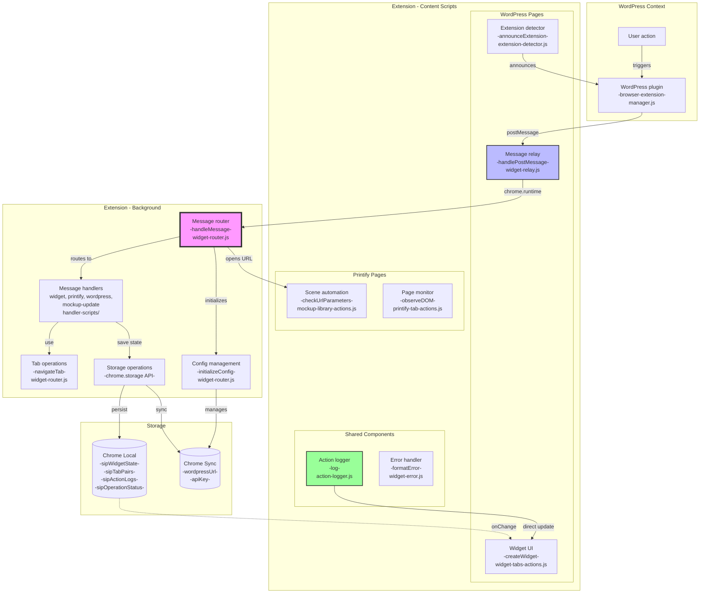

#### II. Component Mapping

| Component | Key Functions | Communication Method |
|-----------|--------------|---------------------|
| Message relay | handleWordPressMessage() | window.postMessage |
| Extension detector | announceReady() | window.postMessage |
| Widget UI | createWidget(), updateOperationStatus() | DOM manipulation |
| Scene automation | checkUrlParameters() | URL params |
| Page monitor | observeDOM() | MutationObserver |
| Action logger | log() | chrome.storage |
| Error handler | formatError() | Returns formatted object |
| Message router | handleMessage() | chrome.runtime |
| Config management | initializeConfig(), updateConfig() | chrome.storage.sync |
| All handlers | handle() | Via router context |
| Tab operations | navigateTab() | chrome.tabs API |
| Storage operations | Distributed across components | chrome.storage API |
| **widget-relay.js** | `handlePostMessage()`, `validateAndRelay()` | window.postMessage → chrome.runtime |
| **widget-router.js** | `handleMessage()`, `navigateTab()`, `pauseOperation()` | chrome.runtime messaging |
| **background.js** | `importScripts()` | Service worker module loading |
| **Message Handlers** | `handle()`, `reportStatus()` | Async response callbacks |
| **widget-tabs-actions.js** | `createWidget()`, `updateOperationStatus()` | DOM manipulation, storage events |
| **action-logger.js** | `log()`, `updateWidgetDisplay()` | Direct DOM updates + storage |

#### III. Central Router Architecture

Chrome's security model forces all extension messaging through the background service worker - content scripts cannot communicate directly with each other. This constraint, intended to prevent malicious scripts from intercepting data, shapes the entire architecture.

The router pattern turns this limitation into a strength. By centralizing all message handling, the extension gains a single point for logging, error handling, and state management. When debugging issues, developers can set one breakpoint in the router and see every message flowing through the system.

The dual update paths (storage-driven and direct) solve different timing needs. Storage updates provide persistence and work across page refreshes, essential for long-running operations. Direct updates give immediate feedback for quick actions, preventing the UI from feeling sluggish.

### 2.2 Message Flow

This section demonstrates how messages travel between WordPress, the extension, and Printify through a secure relay system. Understanding this flow is critical for debugging communication issues and implementing new commands.

#### I. Communication Sequence

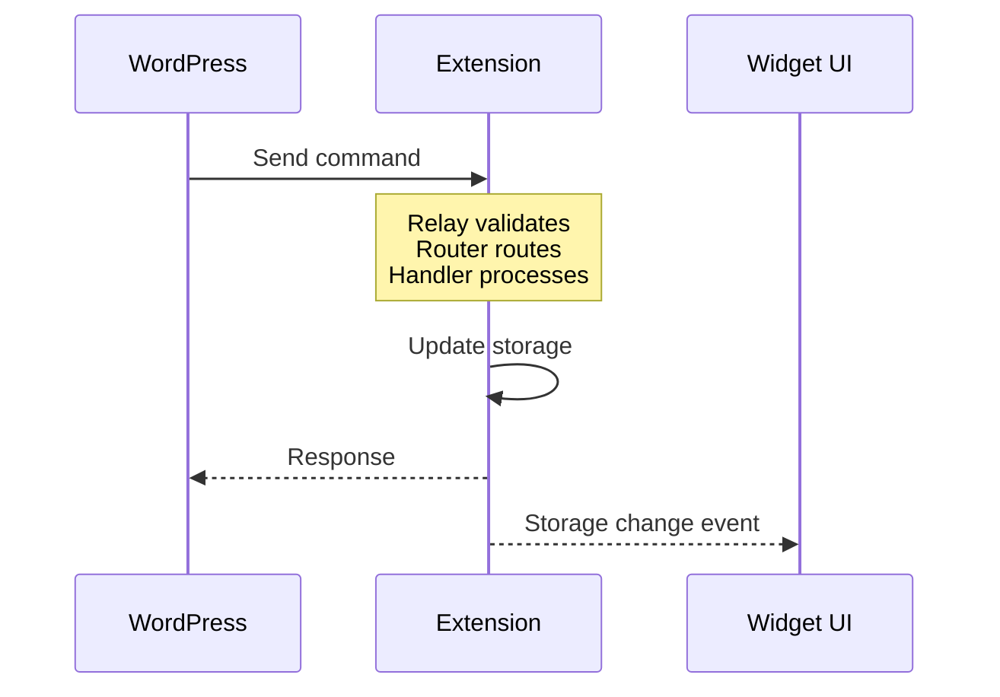

#### II. Message Format

```javascript
// WordPress → Extension (via postMessage)
{
    type: 'SIP_*',           // WordPress commands start with SIP_
    action: string,          // Specific operation
    data: object,           // Operation parameters
    requestId: string       // Unique ID for response matching
}

// Extension internal (via chrome.runtime)
{
    type: 'widget' | 'printify' | 'wordpress',
    action: string,
    data: object,
    _sipMeta: {
        source: 'relay' | 'action' | 'handler',
        timestamp: number,
        requestId: string
    }
}

// Extension → WordPress (via postMessage)
{
    type: 'SIP_EXTENSION_RESPONSE',
    success: boolean,
    data?: object,
    error?: string,
    requestId: string       // Matches request
}
```

#### III. Message Transformation Enables Security

The extension transforms messages between WordPress's `SIP_*` format and internal routing formats to create a security boundary. WordPress commands are clearly marked and validated before entering the extension's internal systems, preventing malicious websites from impersonating WordPress.

This transformation also enables request-response matching. WordPress includes a `requestId` with each command, and the extension preserves it through the entire operation. When multiple operations run simultaneously, WordPress can match responses to their originating requests, enabling reliable async operations.

### 2.3 Widget Terminal Display

This section explains how the widget terminal provides real-time feedback for extension operations using a state-driven display system. The terminal metaphor sets user expectations for technical processes while maintaining clear visual states.

#### I. Display State Machine

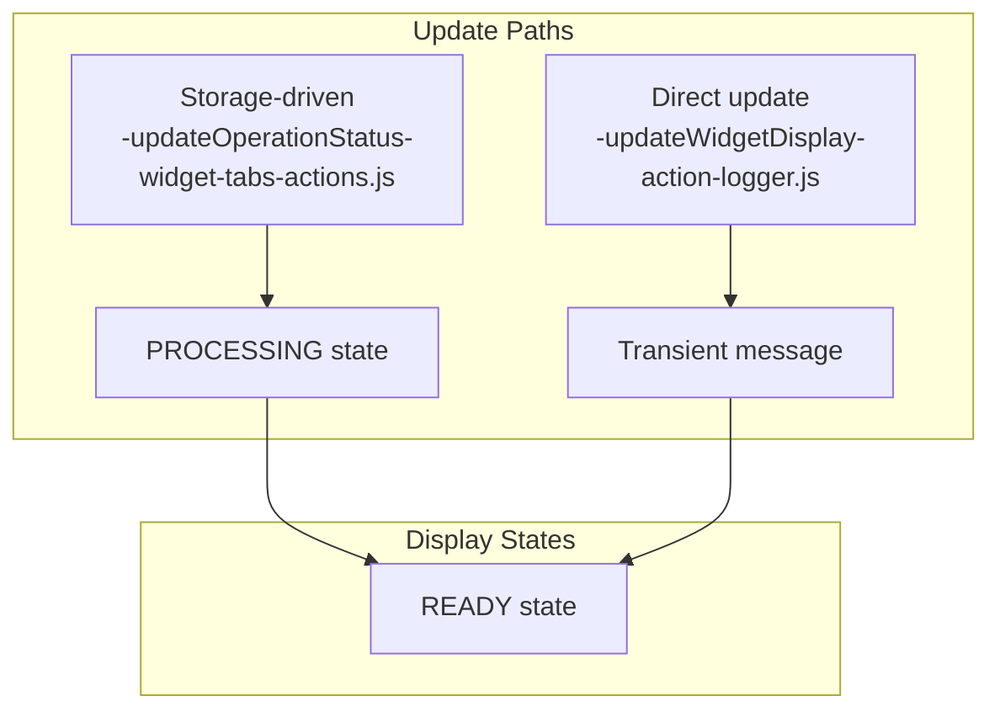

#### II. State Transitions

```javascript
// Display states
const DISPLAY_STATES = {
    READY: {
        shows: '...',           // Animated dots
        allows: 'transient',    // One-off messages
        color: '#00ff00'        // Green
    },
    PROCESSING: {
        shows: 'progress bar',  // 0-100% bar
        blocks: 'transient',    // No interruptions
        header: 'operation name'
    }
};

// State update triggers
const UPDATE_TRIGGERS = {
    'sipOperationStatus.state': {
        'active': 'PROCESSING',
        'idle': 'READY',
        'paused': 'PROCESSING'  // Shows pause message
    }
};

// Message persistence
const MESSAGE_BEHAVIOR = {
    dimAfter: 5000,            // 5 seconds
    opacity: 0.5,              // 50% dimmed
    resetOnNew: true           // New message restores opacity
};
```

#### III. Terminal Metaphor Conveys Technical Process

The widget deliberately mimics a terminal interface to set user expectations. Terminal interfaces signal "technical process happening" in a way that spinners or progress bars don't. Users understand they're watching a developer tool work, not waiting for a page to load.

The dual update system solves a critical UX problem: how to show both persistent operations (like bulk updates) and quick status messages (like "connection verified") without confusion. By using different visual states and update paths, users can track long operations while still seeing immediate feedback from their actions.

Message dimming creates a visual history without clutter. Recent messages stay bright and obvious, while older messages fade but remain visible. This gives users context about what's been happening without overwhelming them with a scrolling log.

### 2.4 Storage Architecture

This section details how the extension persists configuration, state, and operational data across Chrome's storage APIs. The split between sync and local storage enables cross-device configuration while preventing sync conflicts.

#### I. Data Persistence Layers

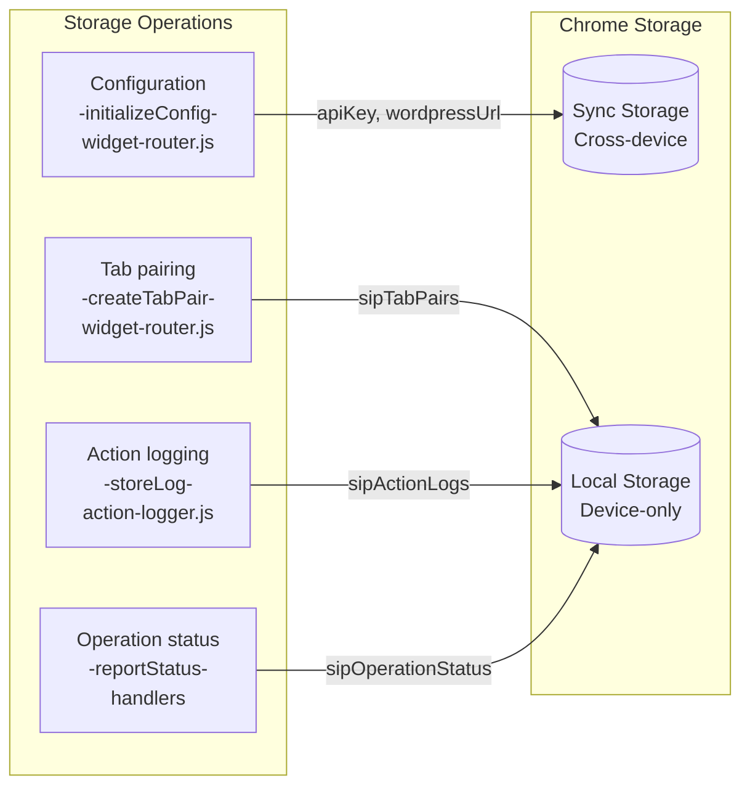

#### II. Storage Schema

```javascript
// Chrome Storage Local - accessed via chrome.storage.local.get/set
{
    sipWidgetState: {
        isVisible: boolean,
        position: {x: number, y: number},
        terminalContent: string,
        terminalState: 'ready' | 'processing'
    },
    sipTabPairs: {
        [wordpressTabId]: printifyTabId,
        [printifyTabId]: wordpressTabId
    },
    sipActionLogs: [{
        timestamp: string,      // ISO 8601
        category: string,       // ERROR, USER_ACTION, etc.
        message: string,
        details: object,
        url: string            // Page where logged
    }],
    sipOperationStatus: {
        operation: string,
        task: string,
        progress: number,       // 0-100
        details: string,
        state: 'active' | 'idle' | 'paused' | 'resuming',
        timestamp: number
    },
    fetchStatus_*: {           // Dynamic keys per product
        status: string,
        data: object,
        timestamp: number
    }
}

// Chrome Storage Sync - accessed via chrome.storage.sync.get/set
{
    wordpressUrl: string,      // https://example.com
    apiKey: string            // 32-character key
}
```

#### III. Storage Split Enables Sync Without Bloat

Chrome sync storage has a 100KB limit and syncs across all user devices. By storing only configuration (API key and WordPress URL) in sync storage, users can install the extension on multiple computers without reconfiguring. Their actual work data stays local, preventing sync conflicts and quota issues.

The storage schema reveals the extension's state machine. Operation status drives the widget display, tab pairs enable intelligent navigation, and action logs provide debugging capability. Each storage key serves a specific architectural purpose, creating a system where state changes automatically update the UI through Chrome's storage events.

Dynamic fetch status keys (`fetchStatus_${productId}`) solve a specific problem: tracking multiple simultaneous operations. When fetching mockups for several products, each gets its own status key. This prevents race conditions where one product's completion overwrites another's progress.

### 2.5 Configuration Management

The extension manages configuration through a centralized system that handles initialization, updates, and auto-configuration for WordPress sites.

#### I. Configuration Flow

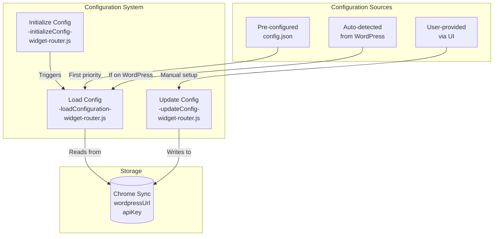

#### II. Configuration Implementation

```javascript
// Configuration structure
const config = {
    wordpressUrl: '',  // Base URL of WordPress site
    apiKey: ''         // 32-character API key
};

// Initialization state management
let configInitialized = false;
let configInitPromise = null;

// Configuration functions
- initializeConfig(): Loads config and updates badge
- loadConfiguration(): Tries pre-config, then storage
- updateConfig(newConfig): Updates and reinitializes

// Auto-configuration on WordPress pages
if (window.sipPrintifyManager?.apiKey) {
    // Use embedded configuration
    config.wordpressUrl = window.location.origin;
    config.apiKey = window.sipPrintifyManager.apiKey;
}
```

#### III. Configuration Enables Seamless Integration

The configuration system solves the chicken-and-egg problem of extension setup. Users need the extension configured to use it, but configuring requires knowing technical details like API keys. Auto-configuration on WordPress pages eliminates this friction - when users install the extension while on their WordPress site, it automatically detects and saves the configuration.

The initialization promise pattern (`configInitPromise`) prevents race conditions during startup. Multiple components might request configuration simultaneously, but the promise ensures configuration loads only once. The badge indicator provides instant visual feedback about configuration status - green checkmark for configured, orange exclamation for needs setup.

### 2.6 Tab Pairing System

This section describes how the extension maintains intelligent relationships between WordPress and Printify tabs to enable seamless navigation. Tab pairing prevents tab proliferation while maintaining user context across operations.

#### I. Bidirectional Tab Relationships

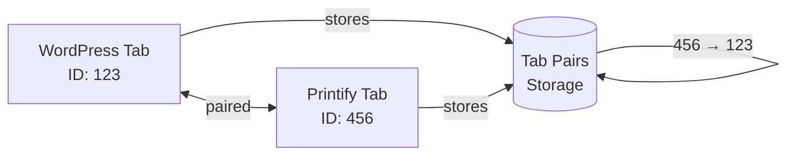

#### II. Pairing Implementation

```javascript
// Creating pairs (widget-router.js)
async function createTabPair(wordpressTabId, printifyTabId) {
    const pairs = await loadTabPairs();
    pairs[wordpressTabId] = printifyTabId;
    pairs[printifyTabId] = wordpressTabId;
    await chrome.storage.local.set({ sipTabPairs: pairs });
}

// Using pairs (widget-router.js)
async function navigateTab(targetUrl, senderTabId) {
    const pairs = await loadTabPairs();
    const pairedTabId = pairs[senderTabId];
    
    if (pairedTabId) {
        // Reuse existing paired tab
        await chrome.tabs.update(pairedTabId, { url: targetUrl });
        return pairedTabId;
    } else {
        // Create new tab and pair it
        const newTab = await chrome.tabs.create({ url: targetUrl });
        await createTabPair(senderTabId, newTab.id);
        return newTab.id;
    }
}

// Cleanup on tab close
chrome.tabs.onRemoved.addListener(async (tabId) => {
    const pairs = await loadTabPairs();
    const pairedId = pairs[tabId];
    delete pairs[tabId];
    if (pairedId) delete pairs[pairedId];
    await chrome.storage.local.set({ sipTabPairs: pairs });
});
```

#### III. Tab Reuse Matches User Mental Model

Users think of WordPress and Printify as connected workspaces, not isolated tabs. When they click "Go to Printify" repeatedly, they expect to return to the same Printify tab, not spawn dozens of new ones. Tab pairing makes the extension behave like users expect.

The bidirectional storage (both tabs know about each other) enables navigation from either direction. Users can trigger operations from WordPress that update Printify, or work in Printify and see results in WordPress. This flexibility supports different workflows without forcing users into a rigid pattern.

Automatic cleanup prevents memory leaks and confusion. When either tab closes, the pairing is removed. This ensures the next navigation creates a fresh pairing rather than trying to reuse a closed tab, which would confuse users and potentially lose work.

## 3. Implementation Guide

This guide provides essential patterns, constraints, and best practices for extending or maintaining the extension. Understanding these implementation details ensures new features integrate properly with existing architecture.

### 3.1 Architectural Constraints

This section explains Chrome's security model and how it shapes the extension's architecture through context isolation and API restrictions. These constraints aren't limitations but security features that prevent extensions from becoming attack vectors.

#### I. Chrome Extension Security Model

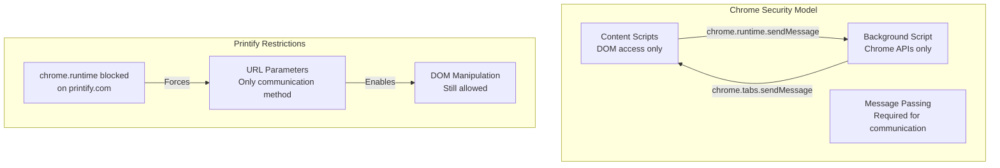

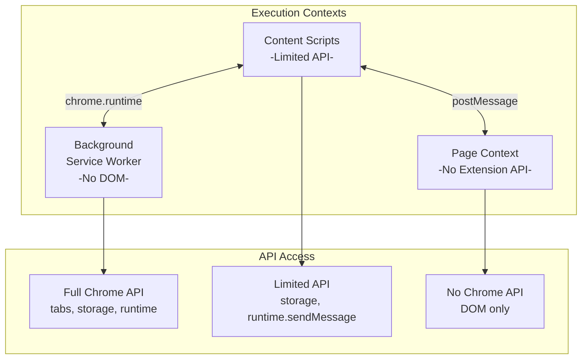

#### II. Context Limitations

```javascript
// Background (Service Worker) - widget-router.js
typeof window === 'undefined'              // true - no DOM
chrome.tabs.create()                       // ✓ Allowed
chrome.runtime.onMessage.addListener()     // ✓ Allowed
document.querySelector()                   // ❌ Error - no document

// Content Script - widget-tabs-actions.js
typeof window === 'object'                 // true - has DOM
document.querySelector()                   // ✓ Allowed
chrome.storage.local.get()                 // ✓ Allowed
chrome.runtime.sendMessage()               // ✓ Allowed*
chrome.tabs.create()                       // ❌ Error - not allowed

// * On Printify.com
chrome.runtime.sendMessage()               // ❌ Blocked by Printify
chrome.runtime.onMessage                   // ❌ null - Printify blocks
chrome.runtime.getURL()                    // ❌ null - Printify blocks

// Page Context (injected) - printify-page-scripts.js
window.location                            // ✓ Allowed
fetch('/api/internal')                     // ✓ Allowed - same origin
chrome.runtime                             // ❌ undefined - no access
```

#### III. Security Model Shapes Architecture

Chrome's security model prevents extensions from becoming malware by limiting what each context can do. The background script can't see page content (preventing password theft), while content scripts can't access all Chrome APIs (preventing tab hijacking). These restrictions force the hub-and-spoke architecture where all powerful operations go through the background script.

Printify's blocking of `chrome.runtime` adds another layer of constraint. They prevent extensions from functioning normally on their site, likely to stop automation tools. This forces the extension to use creative workarounds like URL parameters for communication, turning a security measure into an architectural driver.

Understanding these constraints prevents developers from attempting impossible operations. You cannot "just access the DOM" from the background script or "just create a tab" from a content script. The architecture isn't arbitrary - it's shaped by the security sandbox.

### 3.2 Message Channel Design

This section details the secure message relay system that enables cross-origin communication between WordPress and the extension. The multi-step validation chain prevents security breaches while maintaining reliable async operations.

#### I. Communication Pathways

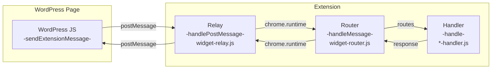

#### II. Message Validation Chain

```javascript
// Step 1: WordPress sends (browser-extension-manager.js)
function sendExtensionMessage(action, data) {
    const message = {
        type: `SIP_${action}`,
        data: data,
        requestId: `req_${Date.now()}_${Math.random()}`
    };
    window.postMessage(message, window.location.origin);
}

// Step 2: Relay validates (widget-relay.js)
function handlePostMessage(event) {
    // Security checks
    if (event.origin !== window.location.origin) return;
    if (!event.data.type?.startsWith('SIP_')) return;
    if (event.source !== window) return;
    
    // Transform and forward
    chrome.runtime.sendMessage({
        type: 'wordpress',
        action: event.data.type,
        data: event.data.data,
        _sipMeta: {
            source: 'relay',
            origin: event.origin,
            requestId: event.data.requestId
        }
    });
}

// Step 3: Router routes (widget-router.js)
async function handleMessage(message, sender, sendResponse) {
    const handler = handlers.get(message.type);
    if (!handler) {
        sendResponse({success: false, error: 'Unknown message type'});
        return;
    }
    
    // Wrap response for logging
    const wrappedResponse = (response) => {
        logResponse(message, response);
        sendResponse(response);
    };
    
    return handler.handle(message, sender, wrappedResponse, routerContext);
}
```

#### III. Validation Prevents Security Breaches

The multi-step validation chain prevents malicious websites from controlling the extension. Any website can send postMessages, so the relay carefully validates that messages come from the same origin and follow the expected format. The `SIP_` prefix creates a namespace that prevents accidents and makes malicious messages obvious.

Message transformation at each boundary creates audit points. When debugging, developers can log messages at the relay boundary, router boundary, and handler boundary to see exactly how data flows and where problems occur. This visibility is critical when operations fail mysteriously.

The request ID system enables async operations in a stateless protocol. PostMessage has no built-in request-response matching, so the extension adds request IDs that flow through the entire system. This allows WordPress to send multiple commands and correctly match responses, enabling parallel operations.

### 3.3 Action Logging System

This section describes the comprehensive logging system that captures actions across all extension contexts for debugging and monitoring. The distributed architecture ensures no critical information is lost while maintaining performance.

#### I. Distributed Logging Architecture

```mermaid
graph TD
    subgraph "Log Sources"
        CS[Content Scripts<br/>-action.info()-]
        BG[Background Scripts<br/>-ActionLogger.log()-]
        Errors[Global Errors<br/>-window.onerror-]
    end
    
    subgraph "Log System"
        Logger[ActionLogger<br/>-log-<br/>action-logger.js]
        Storage[(Log Storage<br/>-sipActionLogs-)]
        Display[Widget Display<br/>-updateWidgetDisplay-]
    end
    
    CS --> Logger
    BG --> Logger
    Errors --> Logger
    Logger --> Storage
    Logger --> Display
```

#### II. Logging Implementation

```javascript
// Global helper (action-log-helper.js)
window.action = {
    info: (msg, details) => log('USER_ACTION', msg, details),
    error: (msg, details) => log('ERROR', msg, details),
    warn: (msg, details) => log('WARNING', msg, details),
    data: (msg, details) => log('DATA_FETCH', msg, details),
    api: (msg, details) => log('API_CALL', msg, details),
    navigation: (msg, details) => log('NAVIGATION', msg, details)
};

// Core logger (action-logger.js)
const ActionLogger = {
    CATEGORIES: {
        ERROR: 'ERROR',
        USER_ACTION: 'USER_ACTION',
        DATA_FETCH: 'DATA_FETCH',
        // ... etc
    },
    
    log: function(category, action, details = null) {
        const log = {
            timestamp: new Date().toISOString(),
            category: category,
            message: action,
            details: details,
            url: window.location.href
        };
        
        // Store (with 1000 log limit)
        this.logs.push(log);
        if (this.logs.length > 1000) this.logs.shift();
        chrome.storage.local.set({ sipActionLogs: this.logs });
        
        // Display (if in content script)
        if (typeof window !== 'undefined') {
            updateWidgetDisplay(category, action, details);
        }
    }
};

// Global error capture (error-capture.js)
window.onerror = function(message, source, lineno, colno, error) {
    window.action.error('Uncaught error: ' + message, {
        source: source,
        line: lineno,
        column: colno,
        stack: error?.stack
    });
    return true; // Prevent default console error
};
```

#### III. Centralized Logging Enables Debugging

Browser extensions are notoriously hard to debug because they run in multiple contexts across multiple pages. Centralized logging solves this by capturing everything in one place. When users report issues, developers can see the complete sequence of events leading to the problem.

The action helper shortcuts make logging frictionless. Developers are more likely to add helpful logs when it's `action.info('User clicked save')` instead of the verbose ActionLogger API. This ease of use results in better instrumentation and easier debugging.

Storing logs in Chrome storage rather than memory provides persistence across page refreshes and crashes. When the extension fails catastrophically, the logs survive to tell the story. The 1000-log limit prevents storage bloat while maintaining enough history to debug complex issues.

### 3.4 Terminal Display Implementation

This section explains how the terminal display manages both transient messages and persistent operation status through a dual-track system. This design provides immediate feedback while maintaining clear operation context.

#### I. Display State System

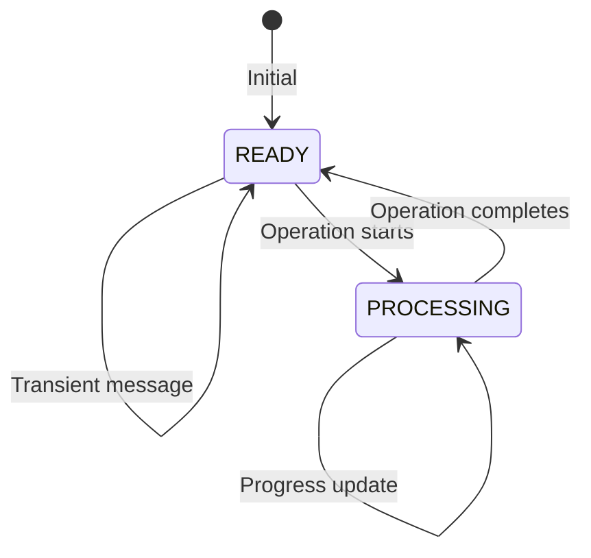

#### II. Visual Implementation

```javascript
// Terminal states and colors
const TERMINAL_CONFIG = {
    READY: {
        animation: ['⠋', '⠙', '⠹', '⠸', '⠼', '⠴', '⠦', '⠧', '⠇', '⠏'],
        animationSpeed: 100,
        defaultMessage: '...',
        baseColor: '#00ff00'
    },
    PROCESSING: {
        progressChar: '█',
        emptyChar: '░',
        barLength: 20,
        headerColors: {
            'info': '#cccccc',
            'success': '#00ff00',
            'error': '#ff3333',
            'warning': '#ffaa00'
        }
    }
};

// Message coloring by context
const MESSAGE_COLORS = {
    'WordPress Site': {
        onPage: '#00ccff',      // Bright blue when on WP
        external: '#0088cc'     // Darker blue when on Printify
    },
    'Printify Site': {
        onPage: '#00ff00',      // Bright green when on Printify
        external: '#00cc00'     // Darker green when on WP
    }
};

// Message persistence
const MESSAGE_DIMMING = {
    delay: 5000,                // Wait 5 seconds
    dimmedOpacity: 0.5,         // Dim to 50%
    transition: 'opacity 0.5s ease-in-out'
};
```

#### III. Terminal Metaphor Conveys Technical Process

The terminal aesthetic immediately communicates "technical tool" to users. Unlike consumer-friendly progress bars or spinners, the terminal style sets expectations that this is a developer tool doing complex operations. Users grant more patience to terminal-style interfaces because they associate them with powerful but slower operations.

The color coding system provides instant context without reading. Green operations on Printify, blue operations on WordPress - users learn this mapping quickly and can understand system state at a glance. The brightness variation (brighter when you're on the relevant site) provides subtle wayfinding.

Message persistence with dimming solves the "did I miss something?" problem. Unlike logs that scroll away or toasts that disappear, dimmed messages remain visible but unobtrusive. Users can see what happened recently without the interface becoming cluttered with old information.

### 3.5 Mockup Scene Mapping

This section details how the extension automatically maps Printify's mockup library scenes to product requirements through URL parameter detection. This automation eliminates manual scene selection for bulk operations.

#### I. Scene Translation System

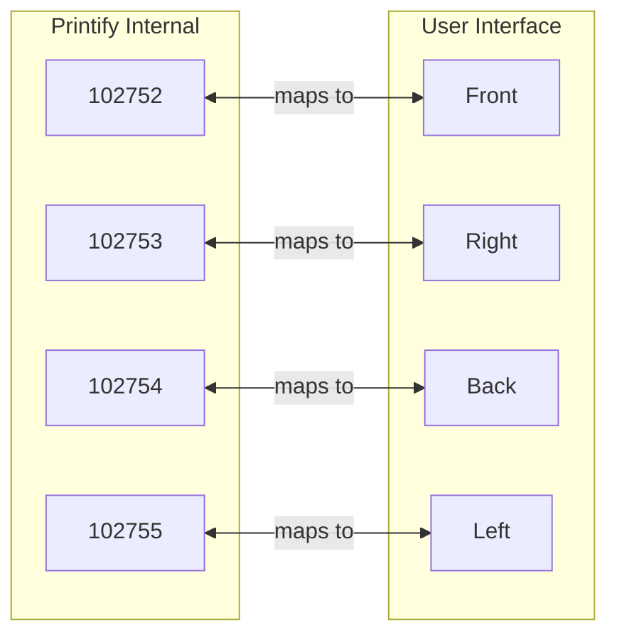

#### II. Mapping Implementation

```javascript
// Scene ID mapping (mockup-update-handler.js)
const SCENE_ID_MAP = {
    '102752': 'Front',
    '102753': 'Right', 
    '102754': 'Back',
    '102755': 'Left'
};

// Mockup ID structure
// Format: mockup_{variant}_{scene}_{position}
// Example: mockup_19773102_102752_1
//          - variant: 19773102 (product variant ID)
//          - scene: 102752 (maps to 'Front')
//          - position: 1 (first image in scene)

// Extraction function
function extractSceneNames(selectedMockups) {
    const sceneNames = new Set();
    selectedMockups.forEach(mockup => {
        const parts = mockup.id.split('_');
        if (parts.length >= 3) {
            const sceneId = parts[2];
            const sceneName = SCENE_ID_MAP[sceneId];
            if (sceneName) {
                sceneNames.add(sceneName);
            }
        }
    });
    return Array.from(sceneNames);
}

// URL parameter encoding
function buildMockupUrl(shopId, productId, scenes, primaryScene, primaryColor) {
    const params = new URLSearchParams({
        'sip-action': 'update',
        'scenes': scenes.join(','),
        'primary-scene': primaryScene,
        'primary-color': primaryColor
    });
    return `https://printify.com/app/mockup-library/shops/${shopId}/products/${productId}?${params}`;
}
```

#### III. Scene Mapping Bridges Technical and Human

Printify uses numeric IDs internally because databases prefer integers and APIs need stable identifiers. But humans think in terms of viewing angles - "I want the front and back views." The scene mapping bridges this gap, allowing the interface to speak human while the system speaks computer.

The mapping was discovered through reverse engineering - inspecting Printify's DOM and API responses to understand their internal structure. This is fragile (Printify could change their IDs), but necessary because Printify provides no public documentation for their internal systems.

URL parameters became the communication method out of necessity. When Printify blocked chrome.runtime, the extension needed another way to pass data to content scripts. URL parameters can't be blocked without breaking the web, making them a reliable if limited communication channel.

### 3.6 Chrome Architecture Constraints

This section provides a comprehensive reference for Chrome's execution contexts and their capabilities. Understanding these environments prevents architectural mistakes and guides proper feature placement.

#### I. API Availability Matrix

```mermaid
graph TD
    subgraph "Service Worker APIs"
        SW_Yes[✓ chrome.tabs.*<br/>✓ chrome.runtime.*<br/>✓ chrome.storage.*<br/>✓ fetch()]
        SW_No[❌ window<br/>❌ document<br/>❌ DOM APIs<br/>❌ localStorage]
    end
    
    subgraph "Content Script APIs"
        CS_Yes[✓ document.*<br/>✓ window.*<br/>✓ chrome.storage.*<br/>✓ chrome.runtime.sendMessage]
        CS_No[❌ chrome.tabs.*<br/>❌ chrome.windows.*<br/>❌ cross-origin fetch<br/>❌ chrome.runtime.onMessage*]
    end
    
    subgraph "Printify Override"
        P_Block[❌ ALL chrome.runtime.*]
    end
    
    CS_No -.->|"*except on Printify"| P_Block
```

#### II. Working Within Constraints

```javascript
// Service Worker context detection (widget-router.js)
const isServiceWorker = typeof window === 'undefined';
const globalScope = isServiceWorker ? self : window;

// Safe API usage patterns
async function safeStorageGet(key) {
    try {
        return await chrome.storage.local.get(key);
    } catch (error) {
        // In Printify content script where chrome.storage might fail
        console.error('Storage access failed:', error);
        return {};
    }
}

// Message sending with fallback
async function sendMessageSafe(message) {
    try {
        return await chrome.runtime.sendMessage(message);
    } catch (error) {
        // On Printify, this will fail
        console.error('Message sending blocked:', error);
        // Fallback: encode in URL for navigation-based messaging
        const params = new URLSearchParams({
            'sip-message': JSON.stringify(message)
        });
        window.location.href = `${window.location.href}?${params}`;
    }
}

// Cross-context communication
if (isServiceWorker) {
    // Background context - full API access
    chrome.runtime.onMessage.addListener(handleMessage);
    chrome.tabs.onRemoved.addListener(cleanupTabPairs);
} else {
    // Content script - limited API
    if (chrome.runtime?.id) {
        // Normal content script
        chrome.runtime.sendMessage({type: 'ready'});
    } else {
        // Printify content script - no chrome.runtime
        console.warn('Chrome runtime blocked, using workarounds');
    }
}
```

#### III. Constraints Drive Creative Solutions

Chrome's API restrictions exist for security - you don't want any website being able to close your tabs or read your browsing history. But these same restrictions complicate extension development, forcing creative architectures like the central router pattern.

Printify's blocking of chrome.runtime is more aggressive - they're actively preventing extensions from working normally. This is likely to prevent automation tools from bypassing their business model. The extension must respect this while still providing value to users, leading to workarounds like URL parameter messaging.

Understanding these constraints prevents wasted effort. Developers won't spend hours trying to access the DOM from a service worker or wondering why chrome.runtime is null on Printify. The constraints are frustrating but unchangeable, so the architecture embraces them rather than fighting them.

### 3.7 Critical Patterns

This section highlights essential patterns that ensure reliable operation across Chrome's service worker lifecycle and storage events. These patterns prevent common pitfalls that cause intermittent failures.

#### I. Essential Implementation Patterns

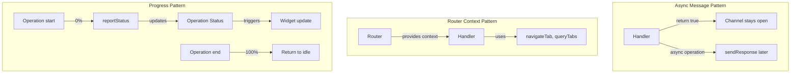

#### II. Pattern Implementations

```javascript
// Async message handling pattern
chrome.runtime.onMessage.addListener((message, sender, sendResponse) => {
    if (message.action === 'fetchData') {
        // CRITICAL: return true to keep channel open
        (async () => {
            try {
                const data = await fetchSomeData();
                sendResponse({success: true, data: data});
            } catch (error) {
                sendResponse({success: false, error: error.message});
            }
        })();
        return true; // Without this, sendResponse won't work
    }
});

// Router context pattern (widget-router.js)
const routerContext = {
    // Navigation and tab management
    navigateTab: async (url, tabType, currentTabId) => { },
    queryTabs: async (query) => { },
    createTab: async (params) => { },
    updateTab: async (tabId, props) => { },
    removeTab: async (tabId) => { },
    getCurrentTab: async () => { },
    
    // Configuration management
    config: { wordpressUrl, apiKey },
    getConfig: () => { },
    updateConfig: (newConfig) => { },
    testConnection: async () => { },
    checkPluginStatus: async () => { },
    
    // Operation control
    pauseOperation: async (tabId, issue, instructions) => { },
    resumeOperation: () => { },
    
    // WordPress API
    callWordPressAPI: async (endpoint, method, data) => { }
};

// Progress reporting pattern (handlers)
async function performOperation() {
    await reportStatus('Updating Mockups', 'Starting', 0);
    
    // ... do work ...
    await reportStatus('Updating Mockups', 'Processing', 50);
    
    // ... more work ...
    await reportStatus('Updating Mockups', 'Saving', 90);
    
    // Complete
    await reportStatus('Updating Mockups', 'Complete', 100, 'Updated 5 mockups');
    
    // Return to idle after delay
    setTimeout(async () => {
        await chrome.storage.local.set({ 
            sipOperationStatus: { state: 'idle', timestamp: Date.now() } 
        });
    }, 2000);
}
```

#### III. Patterns Prevent Common Failures

The async message pattern solves Chrome's most confusing behavior. Without `return true`, Chrome closes the message channel immediately, and `sendResponse` silently fails. This single line causes more extension bugs than any other issue. Making it a pattern ensures developers don't forget.

Router context injection solves the API access problem elegantly. Handlers need Chrome APIs but run in a service worker context. Rather than each handler importing chrome APIs directly, the router provides them as context. This makes handlers testable (mock the context) and flexible (router can add new methods).

The progress reporting pattern creates consistent user experience across all operations. Users see the same progress flow whether updating mockups, fetching data, or processing orders. The 2-second delay before returning to idle gives users time to see "Complete" before the widget resets.

### 3.8 Adding New Features

This section provides a systematic approach for adding new features to the extension while maintaining architectural integrity. Following this checklist ensures new features integrate properly with existing systems.

#### I. Feature Addition Flow

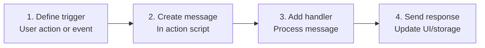

#### II. Implementation Steps

```javascript
// Step 1: Define trigger (e.g., in WordPress JS)
$('#new-feature-button').on('click', function() {
    sendExtensionMessage('NEW_FEATURE', {
        param1: 'value1',
        param2: 'value2'
    });
});

// Step 2: Create message (in content script if needed)
chrome.runtime.sendMessage({
    type: 'wordpress',
    action: 'SIP_NEW_FEATURE',
    data: {
        param1: 'value1',
        param2: 'value2'
    }
});

// Step 3: Add handler (new-feature-handler.js)
class NewFeatureHandler {
    constructor() {
        this.type = 'wordpress';
    }
    
    async handle(message, sender, sendResponse, router) {
        if (message.action !== 'SIP_NEW_FEATURE') {
            return false;
        }
        
        try {
            // Process the feature
            await router.updateStatus({
                operation: 'New Feature',
                task: 'Processing',
                progress: 50
            });
            
            // Do the work
            const result = await this.processFeature(message.data);
            
            // Success response
            sendResponse({success: true, data: result});
        } catch (error) {
            sendResponse({success: false, error: error.message});
        }
        
        return true; // Async response
    }
}

// Step 4: Register handler (background.js)
importScripts('handlers/new-feature-handler.js');

// In widget-router.js initialization
handlers.set('wordpress', new NewFeatureHandler());
```

#### III. Consistent Pattern Speeds Development

Following the same pattern for every feature reduces cognitive load. Developers don't need to invent new architectures or debate implementation approaches. The pattern is proven to work and handles edge cases like async operations and error handling.

The four-step process maps cleanly to the architecture. Triggers live in UI code, messages flow through the established channels, handlers process in the background, and responses update UI through storage events. This alignment between process and architecture makes development predictable.

Most importantly, the pattern maintains system integrity. New features automatically get logging, error handling, and progress reporting because they flow through the same infrastructure. This consistency is what separates professional extensions from hobby projects.

## 4. Storage Schema

This section documents the complete storage schema used by the extension for configuration, state management, and operation tracking. Understanding this schema is essential for debugging state issues and implementing new features.

### I. Data Persistence Architecture

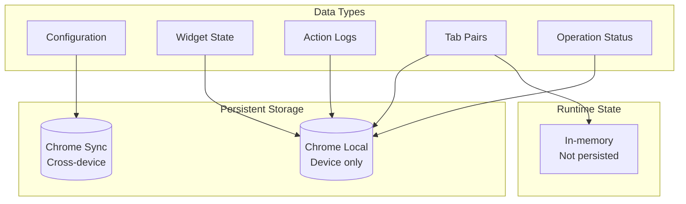

#### II. Complete Storage Schema

```javascript
// Chrome Storage Local - accessed via chrome.storage.local.get/set
{
    sipWidgetState: {
        isVisible: boolean,
        position: {x: number, y: number},
        terminalContent: string,
        terminalState: 'ready' | 'processing'
    },
    sipTabPairs: {
        [wordpressTabId]: printifyTabId,  // "123": 456
        [printifyTabId]: wordpressTabId   // "456": 123
    },
    sipActionLogs: [{
        timestamp: string,      // ISO 8601: "2024-01-15T10:30:00Z"
        category: string,       // ERROR, USER_ACTION, DATA_FETCH, etc.
        message: string,        // Human readable action
        details: object,        // Arbitrary data
        url: string            // Page where logged
    }],
    sipOperationStatus: {
        operation: string,      // "Updating Mockups"
        task: string,          // "Opening mockup library"
        progress: number,      // 0-100
        details: string,       // Multi-line details
        cancellable: boolean,  // false (not implemented)
        state: 'active' | 'idle' | 'paused' | 'resuming',
        message: string,       // Alternative to operation/task
        timestamp: number,     // Date.now()
        
        // For paused operations:
        issue: string,         // "Please log in to Printify"
        instructions: string,  // "Click Resume when ready"
        showResumeButton: boolean
    },
    fetchStatus_*: {          // Dynamic keys like fetchStatus_12345
        status: string,        // "fetching", "complete", "error"
        data: object,         // Fetched mockup data
        timestamp: number     // When fetched
    }
}

// Chrome Storage Sync - accessed via chrome.storage.sync.get/set
{
    wordpressUrl: string,     // "https://example.com"
    apiKey: string           // 32-character key from WordPress
}

// Runtime State (not persisted)
{
    tabPairs: Map,           // In-memory cache loaded by loadTabPairs()
    operationState: {        // Managed by pauseOperation()/resumeOperation()
        paused: boolean,
        pausedOperation: {...},
        pausedCallback: Function
    },
    handlers: Map,           // Message type to handler mapping
    config: {               // Loaded from storage or config.json
        wordpressUrl: string,
        apiKey: string
    },
    messageDimTimer: number, // Timer ID for dimming messages
    
    // ActionLogger state (in action-logger.js)
    operationStack: [],      // Tracks nested operations for hierarchy
    activeOperations: Map,   // Maps operation IDs to operation data
    sipActionTimings: Map    // Performance timing data
}
```

#### III. Storage Strategy Enables Features

The split between Chrome Local and Sync storage is deliberate. Configuration that users need everywhere (API key, WordPress URL) syncs across devices. Work data that could conflict or exceed quotas (logs, operation status) stays local. This split enables multi-device use without sync conflicts.

Dynamic storage keys (`fetchStatus_${productId}`) solve a specific race condition. When fetching multiple products simultaneously, each needs independent status tracking. Fixed keys would overwrite each other. Dynamic keys isolate each operation while still allowing pattern-based queries (`fetchStatus_*`).

The runtime state reveals the extension's true complexity. Tab pairs cache in memory for performance but persist to storage for durability. Operation state enables pause/resume but doesn't persist because paused operations shouldn't survive restarts. Each storage decision balances performance, durability, and complexity.

## 5. Message Type Reference

This reference catalogs all message types that flow through the extension, including WordPress commands and internal actions. Each message type includes its purpose, data structure, and response format.

### 5.1 WordPress Commands

This section lists all commands that WordPress can send to the extension for automation and data retrieval. These commands form the public API between WordPress and the extension.

#### I. Command Flow

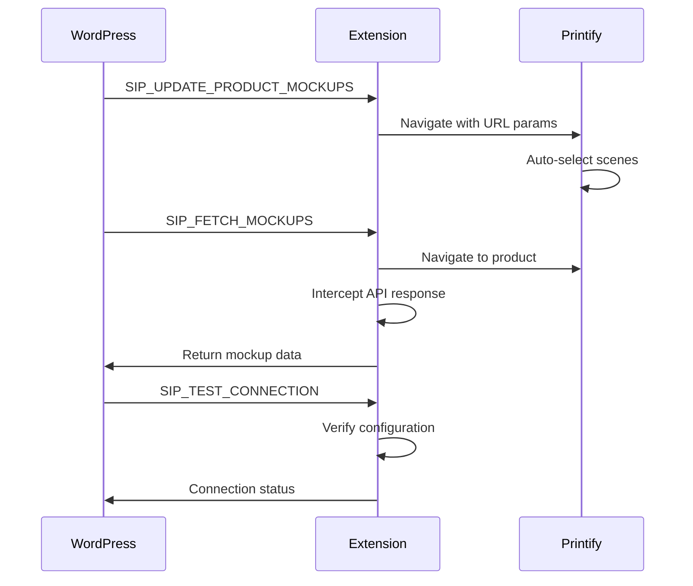

#### II. Command Specifications

```javascript
// SIP_UPDATE_PRODUCT_MOCKUPS
{
    type: 'SIP_UPDATE_PRODUCT_MOCKUPS',
    data: {
        productInfo: {
            link: string,        // Printify product URL
            shop_id: number,
            product_id: string
        },
        selectedScenes: string[], // ['Front', 'Back']
        primaryScene: string,     // 'Front'
        primaryColor: string      // '#FF0000'
    }
}

// SIP_FETCH_MOCKUPS
{
    type: 'SIP_FETCH_MOCKUPS',
    data: {
        link: string,            // Product editor URL
        productId: string,
        blueprintId: number,
        variantData: {...}       // Product details
    }
}

// SIP_TEST_CONNECTION
{
    type: 'SIP_TEST_CONNECTION',
    data: {
        apiKey: string          // For validation
    }
}

// Response format
{
    type: 'SIP_EXTENSION_RESPONSE',
    success: boolean,
    data?: object,              // Command-specific
    error?: string,             // Error message
    requestId: string           // Matches request
}
```

#### III. Commands Map to User Intent

Each command represents a specific user intent, not a technical operation. `SIP_UPDATE_PRODUCT_MOCKUPS` means "make Printify's selection match what I chose in WordPress." This intent-based design keeps the API stable even as implementation details change.

The command prefix `SIP_` creates a clear namespace that prevents collisions with other extensions or page scripts. It also makes debugging easier - developers can filter browser messages to see only SiP traffic.

Response standardization enables generic error handling. WordPress doesn't need command-specific error logic because all commands return the same success/error structure. This consistency reduces code duplication and makes the system more maintainable.

### 5.2 Internal Actions

This section documents internal messages used for communication between extension components. These messages handle state updates, logging, and inter-component coordination.

#### I. Internal Message Types

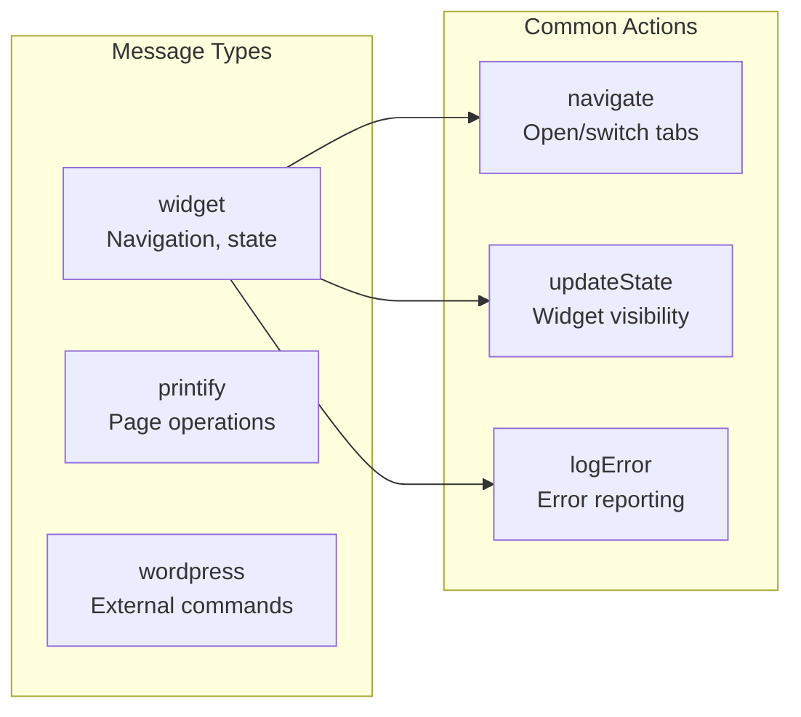

#### II. Internal Message Format

```javascript
// Widget messages (internal operations)
{
    type: 'widget',
    action: 'navigate' | 'showWidget' | 'hideWidget' | 'updateState' | 'logError',
    data: {
        // navigate
        url?: string,
        
        // showWidget/hideWidget
        position?: {x: number, y: number},
        
        // updateState
        state?: object,
        
        // logError
        error?: {
            message: string,
            stack: string,
            context: string
        }
    }
}

// Printify messages (page-specific operations)
{
    type: 'printify',
    action: 'navigateToPage' | 'automateSelection',
    data: {
        page?: string,          // 'mockup-library', 'editor'
        selections?: string[]   // Scene names to select
    }
}

// WordPress messages (transformed from SIP_*)
{
    type: 'wordpress',
    action: string,            // Original SIP_* command
    data: object,             // Command-specific data
    _sipMeta: {
        source: 'relay',
        origin: string,
        requestId: string
    }
}
```

#### III. Internal Types Enable Routing

The three-type system (`widget`, `printify`, `wordpress`) creates clear routing boundaries. Each type maps to a specific handler that understands that domain. This separation prevents handlers from growing too complex and makes testing easier.

Internal actions are more granular than external commands. While WordPress sends high-level intents like "update mockups," internal actions break this down into "navigate to page," "automate selection," "report status." This decomposition keeps each piece simple and reusable.

The metadata (`_sipMeta`) preserves context through transformations. When debugging why a command failed, developers can trace its journey from WordPress through the relay to the handler and back. This visibility is critical for debugging async operations across multiple contexts.

## 6. Key Features

This section provides detailed documentation for the extension's core features, including implementation details and usage patterns. Each feature section includes architecture, implementation, and troubleshooting information.

### 6.1 Tab Pairing System

This feature maintains intelligent relationships between WordPress and Printify tabs to prevent tab proliferation and maintain user context. The bidirectional pairing system ensures operations always use the correct tabs.

#### I. Bidirectional Tab Relationship

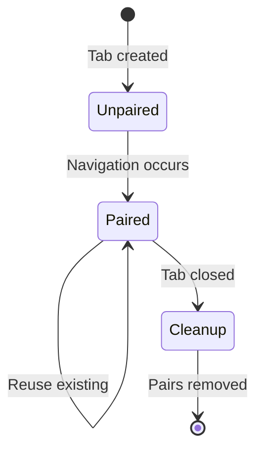

#### II. Implementation Details

```javascript
// Tab pair structure in storage
{
    sipTabPairs: {
        "123": "456",  // WordPress tab 123 paired with Printify tab 456
        "456": "123"   // Bidirectional - Printify knows about WordPress
    }
}

// Pairing lifecycle
async function handleNavigation(targetUrl, senderTabId) {
    const pairs = await loadTabPairs();
    const existingPair = pairs[senderTabId];
    
    if (existingPair) {
        // Check if paired tab still exists
        try {
            await chrome.tabs.get(existingPair);
            // Reuse existing tab
            await chrome.tabs.update(existingPair, { url: targetUrl });
            return existingPair;
        } catch (e) {
            // Tab was closed, clean up
            delete pairs[senderTabId];
            delete pairs[existingPair];
        }
    }
    
    // Create new tab and pair
    const newTab = await chrome.tabs.create({ url: targetUrl });
    pairs[senderTabId] = newTab.id;
    pairs[newTab.id] = senderTabId;
    await chrome.storage.local.set({ sipTabPairs: pairs });
    
    return newTab.id;
}

// Automatic cleanup
chrome.tabs.onRemoved.addListener(async (tabId) => {
    const pairs = await loadTabPairs();
    const pairedId = pairs[tabId];
    
    if (pairedId) {
        delete pairs[tabId];
        delete pairs[pairedId];
        await chrome.storage.local.set({ sipTabPairs: pairs });
    }
});
```

#### III. Tab Reuse Matches Mental Model

Users think of WordPress and Printify as connected workspaces. When they click "Go to Printify" multiple times, they expect to return to the same tab, not create dozens of new ones. Tab pairing makes the extension behave like users expect, reducing confusion and browser clutter.

Bidirectional pairing enables workflows in both directions. Users can start in WordPress and navigate to Printify, or work in Printify and return to WordPress. The pairing persists across page refreshes, maintaining workspace continuity even when pages reload.

Automatic cleanup prevents accumulation of stale pairs. When tabs close, their pairs are immediately removed. This ensures the next navigation creates fresh pairs rather than trying to reuse closed tabs, which would confuse users and potentially lose work.

### 6.2 Widget Terminal Display

This feature provides real-time operation feedback through a terminal-style interface that conveys technical processes clearly. The dual-state system handles both quick messages and long-running operations.

#### I. Terminal State Machine

```mermaid
stateDiagram-v2
    [*] --> READY: Initialize
    
    READY --> READY: Transient message
    note right of READY: Shows dots "..."
    
    READY --> PROCESSING: Operation start
    note right of PROCESSING: Shows progress bar
    
    PROCESSING --> PROCESSING: Progress update
    PROCESSING --> READY: Operation complete
    
    READY --> [*]: Widget hidden
    PROCESSING --> [*]: Widget hidden
```

#### II. State Implementation

```javascript
// Terminal states
const TERMINAL_STATES = {
    READY: {
        display: '...',
        animation: ['⠋', '⠙', '⠹', '⠸', '⠼', '⠴', '⠦', '⠧', '⠇', '⠏'],
        allows: ['transient'],
        color: '#00ff00'
    },
    PROCESSING: {
        display: 'progress',
        template: '[{bar}] {progress}% - {task}',
        blocks: ['transient'],
        headerColor: {
            'info': '#cccccc',
            'success': '#00ff00',
            'error': '#ff3333',
            'warning': '#ffaa00'
        }
    }
};

// Update triggers
chrome.storage.onChanged.addListener((changes, area) => {
    if (area !== 'local') return;
    
    if (changes.sipOperationStatus) {
        const status = changes.sipOperationStatus.newValue;
        
        if (status.state === 'active') {
            setTerminalState('PROCESSING', status);
        } else if (status.state === 'idle') {
            setTerminalState('READY');
        }
    }
});

// Message persistence
function showTransientMessage(message, category) {
    if (terminalState === 'PROCESSING') return; // Don't interrupt
    
    const messageElement = createMessageElement(message, category);
    terminalDisplay.appendChild(messageElement);
    
    // Dim after delay
    setTimeout(() => {
        messageElement.style.opacity = '0.5';
    }, 5000);
}
```

#### III. Dual States Handle Different Needs

The terminal needs to handle two different types of information: persistent operations (like bulk updates) and quick status messages (like "connection verified"). Two states prevent these from interfering with each other while keeping the interface simple.

The READY state with animated dots shows the extension is active without demanding attention. This subtle animation reassures users that the system is working without being distracting. The dots are a universal "waiting" indicator that needs no explanation.

The PROCESSING state takes over the display because operations need full attention. Progress bars, operation names, and task descriptions help users understand what's happening and how long it might take. Blocking transient messages during processing prevents confusion about what the progress bar represents.

### 6.3 Pause/Resume Error Recovery

This feature enables graceful recovery from errors during bulk operations by allowing users to pause, fix issues, and resume. The system maintains operation state across page refreshes and tab switches.

#### I. Operation State Flow

```mermaid
sequenceDiagram
    participant Handler
    participant Router
    participant Widget
    participant User
    
    Handler->>Handler: Detect issue
    Handler->>Router: Pause operation
    Router->>Widget: Show pause UI
    Widget->>User: Display issue + Resume button
    
    User->>User: Fix issue (login, etc.)
    
    User->>Widget: Click Resume
    Widget->>Router: Resume operation
    Router->>Handler: Continue from saved state
    Handler->>Handler: Complete operation
```

#### II. Pause/Resume Implementation

```javascript
// Pausing operation (widget-router.js)
function pauseOperation(issue, instructions, callback) {
    operationState.paused = true;
    operationState.pausedOperation = {
        issue: issue,
        instructions: instructions,
        showResumeButton: true,
        state: 'paused',
        timestamp: Date.now()
    };
    operationState.pausedCallback = callback;
    
    chrome.storage.local.set({
        sipOperationStatus: operationState.pausedOperation
    });
}

// Handler detecting issue (mockup-fetch-handler.js)
async function fetchMockups(tab) {
    const result = await chrome.scripting.executeScript({
        target: { tabId: tab.id },
        func: checkLoginState
    });
    
    if (!result[0].result.isLoggedIn) {
        // Pause and wait for user
        return new Promise((resolve) => {
            router.pauseOperation(
                'Please log in to Printify',
                'Click Resume when you have logged in',
                async () => {
                    // Resume from where we left off
                    const mockups = await fetchMockups(tab);
                    resolve(mockups);
                }
            );
        });
    }
    
    // Continue normal operation...
}

// Resume trigger (widget-tabs-actions.js)
resumeButton.addEventListener('click', async () => {
    chrome.runtime.sendMessage({
        type: 'widget',
        action: 'resumeOperation'
    });
});

// Resume handler (widget-router.js)
function resumeOperation() {
    if (operationState.paused && operationState.pausedCallback) {
        operationState.paused = false;
        const callback = operationState.pausedCallback;
        operationState.pausedCallback = null;
        
        chrome.storage.local.set({
            sipOperationStatus: {
                state: 'resuming',
                message: 'Resuming operation...',
                timestamp: Date.now()
            }
        });
        
        callback(); // Continue where we left off
    }
}
```

#### III. Pause/Resume Handles Real-World Interruptions

Web operations fail for predictable reasons: users aren't logged in, sessions expire, permissions change. Rather than failing completely, pause/resume lets users fix the issue and continue. This is especially valuable for long operations where starting over would waste time.

The pause state preserves operation context. When users click Resume, the operation continues exactly where it paused, not from the beginning. This stateful recovery is what distinguishes professional tools from simple scripts.

Clear instructions during pause reduce support burden. Instead of cryptic error messages, users see exactly what went wrong ("Please log in") and what to do ("Click Resume when ready"). This self-service error recovery reduces frustration and support tickets.

### 6.4 Response Logging Architecture

This feature implements comprehensive logging across all extension layers to aid debugging and monitoring. The architecture captures both successful operations and errors with full context.

#### I. Centralized Response Logging

```mermaid
sequenceDiagram
    participant WP as WordPress
    participant Router as Router<br/>widget-router.js
    participant Handler as Message Handler
    participant Logger as ActionLogger
    
    WP->>Router: Request message
    activate Router
    Note over Router: Wrap response callback<br/>with logging
    Router->>Handler: Process request
    deactivate Router
    
    activate Handler
    alt Success
        Handler->>Router: Success response
        Router->>Logger: Log success
        Router->>WP: Success response
    else Error
        Handler->>Router: Error response
        Router->>Logger: Log error
        Router->>WP: Error response
    else Timeout
        Note over Handler: No response
        Note over WP: Request timeout
    end
    deactivate Handler
```

#### II. Response Wrapper Implementation

```javascript
// Response wrapping in router (widget-router.js)
async function handleMessage(message, sender, sendResponse) {
    const startTime = Date.now();
    const requestId = message._sipMeta?.requestId || `req_${startTime}`;
    
    // Log incoming
    ActionLogger.log(
        CATEGORIES.WORDPRESS_ACTION,
        `Received: ${message.action || message.type}`,
        { message, sender, requestId }
    );
    
    // Wrap response for logging
    const originalSendResponse = sendResponse;
    const wrappedSendResponse = (response) => {
        const duration = Date.now() - startTime;
        const status = response?.success ? 'SUCCESS' : 'ERROR';
        const error = response?.error || '';
        
        ActionLogger.log(
            CATEGORIES.WORDPRESS_ACTION,
            `${status}: ${message.action}${error ? ' - ' + error : ''}`,
            {
                status: status.toLowerCase(),
                error: error,
                duration: duration,
                requestId: requestId
            }
        );
        
        originalSendResponse(response);
    };
    
    // Route to handler with wrapped response
    const handler = handlers.get(message.type);
    if (!handler) {
        wrappedSendResponse({
            success: false,
            error: 'Unknown message type: ' + message.type
        });
        return;
    }
    
    return handler.handle(message, sender, wrappedSendResponse, routerContext);
}

// What appears in logs
// "Received: SIP_UPDATE_MOCKUPS" { requestId: "req_123", ... }
// ... handler processing ...
// "SUCCESS: SIP_UPDATE_MOCKUPS" { duration: 2341, requestId: "req_123" }
// -or-
// "ERROR: SIP_UPDATE_MOCKUPS - Not logged in" { error: "Not logged in", requestId: "req_123" }
```

#### III. Centralized Logging Ensures Complete Coverage

Response logging at the router level guarantees that every message gets logged, regardless of whether handlers remember to log. This infrastructure-level solution is more reliable than depending on developer discipline in every handler.

The request ID correlation enables debugging of async operations. When multiple operations run simultaneously, the request ID links the initial request to its eventual response, even if they're separated by seconds or minutes in the logs. This correlation is essential for debugging production issues.

Duration tracking reveals performance problems. By logging how long each operation takes, developers can identify slow operations and optimize them. This performance visibility is built into the infrastructure rather than added ad-hoc.

### 6.5 Content Security Policy Compliance

This section explains how the extension maintains security compliance with Chrome's Content Security Policy restrictions. Understanding these constraints is crucial for avoiding security violations.

#### I. CSP-Safe Patterns

```mermaid
graph TD
    subgraph "CSP Violations"
        InlineHandler[onclick="..."]
        InlineStyle[style="..."]
        InlineScript[script tags]
    end
    
    subgraph "CSP Compliant"
        EventListener[addEventListener]
        CSSClasses[className]
        ExternalScripts[script files]
    end
    
    InlineHandler -.->|replace with| EventListener
    InlineStyle -.->|replace with| CSSClasses
    InlineScript -.->|replace with| ExternalScripts
    
    style InlineHandler fill:#f99
    style InlineStyle fill:#f99
    style InlineScript fill:#f99
```

#### II. Implementation Patterns

```javascript
// CSP Violation - Inline event handler
element.innerHTML = '<button onclick="doThing()">Click</button>';

// CSP Compliant - Programmatic handler
const button = document.createElement('button');
button.textContent = 'Click';
button.addEventListener('click', doThing);
element.appendChild(button);

// CSP Violation - Inline styles
element.innerHTML = '<div style="color: red">Error</div>';

// CSP Compliant - CSS classes
element.innerHTML = '<div class="error-text">Error</div>';
// With CSS: .error-text { color: red; }

// CSP Violation - Dynamic script
const script = document.createElement('script');
script.textContent = 'console.log("loaded")';
document.head.appendChild(script);

// CSP Compliant - Message passing
chrome.runtime.sendMessage({
    type: 'execute',
    action: 'log',
    data: 'loaded'
});

// Building safe HTML
function createSafeElement(tag, className, textContent) {
    const element = document.createElement(tag);
    if (className) element.className = className;
    if (textContent) element.textContent = textContent;
    return element;
}

// Safe innerHTML with sanitization
function setSafeHTML(element, html) {
    // Only allow safe tags and attributes
    const template = document.createElement('template');
    template.innerHTML = html;
    
    // Remove all script tags and event handlers
    template.content.querySelectorAll('script').forEach(s => s.remove());
    template.content.querySelectorAll('*').forEach(el => {
        Array.from(el.attributes).forEach(attr => {
            if (attr.name.startsWith('on')) {
                el.removeAttribute(attr.name);
            }
        });
    });
    
    element.innerHTML = '';
    element.appendChild(template.content);
}
```

#### III. CSP Protects Users From Malicious Scripts

Content Security Policy prevents cross-site scripting (XSS) attacks by blocking inline scripts and styles. If an attacker manages to inject content into a page, CSP ensures that content can't execute code. This protection is especially important for extensions that have elevated privileges.

The restrictions force better coding practices. Separating JavaScript from HTML makes code more maintainable. Using CSS classes instead of inline styles enables consistent theming. These CSP requirements push developers toward cleaner architecture.

Extensions must be especially careful because they run on all websites. A CSP violation that works on one site might break on another with stricter policies. Following CSP-compliant patterns ensures the extension works everywhere.

### 6.6 Public API Naming Standards

This section defines naming conventions for the extension's public API to ensure consistency and clarity. Following these standards makes the API intuitive and maintainable.

#### I. Namespace Organization

```mermaid
graph TD
    subgraph "Global Namespace"
        Window[window]
        SiPWidget[window.SiPWidget]
    end
    
    subgraph "API Structure"
        ActionLogger[SiPWidget.ActionLogger]
        Utils[SiPWidget.utils]
        Config[SiPWidget.config]
    end
    
    subgraph "Helper Shortcut"
        Action[window.action]
    end
    
    Window --> SiPWidget
    SiPWidget --> ActionLogger
    SiPWidget --> Utils
    SiPWidget --> Config
    Window --> Action
```

#### II. Namespace Implementation

```javascript
// Main namespace (widget-tabs-actions.js)
window.SiPWidget = window.SiPWidget || {};

// ActionLogger module (action-logger.js)
window.SiPWidget.ActionLogger = {
    CATEGORIES: {
        ERROR: 'ERROR',
        USER_ACTION: 'USER_ACTION',
        WARNING: 'WARNING',
        DATA_FETCH: 'DATA_FETCH',
        WORDPRESS_ACTION: 'WORDPRESS_ACTION',
        API_CALL: 'API_CALL',
        NAVIGATION: 'NAVIGATION'
    },
    
    log: function(category, action, details) {
        // Implementation
    },
    
    getActionLogs: async function() {
        // Return stored logs
    }
};

// Helper shortcut (action-log-helper.js)
window.action = {
    log: (category, message, details) => {
        if (window.SiPWidget?.ActionLogger) {
            window.SiPWidget.ActionLogger.log(category, message, details);
        } else {
            console.log(`[${category}] ${message}`, details);
        }
    },
    info: (msg, details) => window.action.log('USER_ACTION', msg, details),
    error: (msg, details) => window.action.log('ERROR', msg, details),
    warn: (msg, details) => window.action.log('WARNING', msg, details)
};

// Usage examples
SiPWidget.ActionLogger.log('ERROR', 'Failed to connect', {reason: 'timeout'});
action.error('Failed to connect', {reason: 'timeout'}); // Shortcut
```

#### III. Namespace Prevents Global Pollution

Browser extensions run in shared environments where multiple scripts coexist. Without namespacing, extensions risk overwriting each other's functions or conflicting with page scripts. The `SiPWidget` namespace creates a safe container for all extension APIs.

The helper shortcut (`window.action`) balances safety with usability. While `SiPWidget.ActionLogger.log()` is safe, it's verbose. The shortcuts make logging so easy that developers actually use it, improving debugging capabilities.

Namespace structure reveals API organization. Developers exploring the extension can type `SiPWidget.` in the console and see all available APIs. This discoverability helps developers understand and use the extension effectively.

### 6.7 Scene-Based Mockup Selection Flow

This feature automates mockup scene selection based on product attributes, eliminating manual selection in bulk operations. The system maps product requirements to appropriate Printify scenes automatically.

#### I. URL Parameter Communication

```mermaid
sequenceDiagram
    participant WP as WordPress
    participant Ext as Extension
    participant Printify as Printify Page
    
    WP->>Ext: Scene selection request
    Note over Ext: Build URL with<br/>scene parameters
    Ext->>Printify: Open URL with<br/>?sip-action=update<br/>&scenes=Front,Back
    Note over Printify: Content script<br/>reads parameters
    Printify->>Printify: Navigate scenes<br/>Toggle selections<br/>Save changes
```

#### II. URL Parameter Implementation

```javascript
// Building URL with parameters (mockup-update-handler.js)
function buildMockupUrl(productInfo, selectedScenes, primaryScene, primaryColor) {
    const params = new URLSearchParams({
        'sip-action': 'update',
        'scenes': selectedScenes.join(','),
        'primary-scene': primaryScene,
        'primary-color': encodeURIComponent(primaryColor)
    });
    
    return `https://printify.com/app/mockup-library/shops/${productInfo.shop_id}/products/${productInfo.product_id}?${params}`;
}

// Reading parameters (mockup-library-actions.js)
function checkUrlParameters() {
    const urlParams = new URLSearchParams(window.location.search);
    const action = urlParams.get('sip-action');
    
    if (action === 'update') {
        const scenes = urlParams.get('scenes')?.split(',') || [];
        const primaryScene = urlParams.get('primary-scene');
        const primaryColor = urlParams.get('primary-color');
        
        action.data('URL parameters detected', {
            scenes, primaryScene, primaryColor,
            url: window.location.href
        });
        
        waitForPageReady().then(() => {
            synchronizeMockupsByScenes(scenes, primaryScene, primaryColor);
        });
    }
}

// Scene synchronization
async function synchronizeMockupsByScenes(selectedScenes, primaryScene, primaryColor) {
    const availableScenes = extractAvailableScenes(); // Get from carousel
    
    for (const sceneName of availableScenes) {
        await navigateToScene(sceneName);
        
        if (selectedScenes.includes(sceneName)) {
            await selectAllMockupsInScene();
        } else {
            await deselectAllMockupsInScene();
        }
        
        await delay(500); // Let UI update
    }
    
    await saveSelection();
}
```

#### III. URL Parameters Work Despite Blocking

Printify blocks `chrome.runtime` API to prevent extensions from functioning normally, likely to stop automation tools. URL parameters provide an alternative communication channel that Printify cannot block without breaking normal web navigation.

This approach is transparent to users. They can see the parameters in the URL bar, understanding what the extension is doing. This visibility builds trust and helps with debugging when operations don't work as expected.

The scene-based approach matches how users think. Instead of dealing with individual mockup IDs, users select viewing angles like "Front" and "Back." The extension handles the complexity of finding and selecting all mockups for those scenes.

### 6.8 Scene-Based Selection Implementation

This section details the technical implementation of automated scene selection using URL parameters and DOM observation. The system works around Printify's lack of scene selection APIs.

#### I. Scene Navigation Flow

```mermaid
graph TD
    Start[Get available scenes]
    Navigate[Navigate to scene]
    Check{Scene in<br/>selected list?}
    Select[Select all mockups]
    Deselect[Deselect all mockups]
    Next{More scenes?}
    Save[Save selection]
    
    Start --> Navigate
    Navigate --> Check
    Check -->|Yes| Select
    Check -->|No| Deselect
    Select --> Next
    Deselect --> Next
    Next -->|Yes| Navigate
    Next -->|No| Save
```

#### II. Scene Operations

```javascript
// Scene detection (mockup-library-actions.js)
function extractAvailableScenes() {
    // Find carousel buttons with scene names
    const buttons = document.querySelectorAll('[data-testid="scene-button"]');
    return Array.from(buttons).map(btn => btn.getAttribute('data-scene-name'));
}

// Scene navigation
async function navigateToScene(sceneName) {
    const button = document.querySelector(`[data-scene-name="${sceneName}"]`);
    if (button) {
        button.click();
        await waitForSceneLoad(); // Wait for mockups to render
    }
}

// Selection control
async function selectAllMockupsInScene() {
    // Printify renders multiple grids but only Grid 0 has checkboxes
    const grid = document.querySelectorAll('[data-testid="mockupItemsGrid"]')[0];
    const selectAllCheckbox = grid?.querySelector('[data-testid="selectAll"]');
    
    if (selectAllCheckbox && !selectAllCheckbox.checked) {
        selectAllCheckbox.click();
        await delay(300); // Let selection propagate
    }
}

async function deselectAllMockupsInScene() {
    const grid = document.querySelectorAll('[data-testid="mockupItemsGrid"]')[0];
    const selectAllCheckbox = grid?.querySelector('[data-testid="selectAll"]');
    
    if (selectAllCheckbox && selectAllCheckbox.checked) {
        selectAllCheckbox.click();
        await delay(300);
    }
}

// Save operation
async function saveSelection() {
    const saveButton = document.querySelector('[data-testid="save-selection"]');
    if (saveButton && !saveButton.disabled) {
        saveButton.click();
        action.info('Scene-based mockup selection completed');
    }
}
```

#### III. Scene-Based Selection Matches User Intent

Users think in terms of product views (front, back, side) not individual mockup files. By organizing selection around scenes, the interface matches user mental models. This alignment reduces cognitive load and prevents errors.

The Grid 0 workaround addresses a Printify rendering quirk. They render multiple identical grids but only the first has functional checkboxes. Rather than fighting this, the extension works with it, selecting the correct grid reliably.

Delays between operations prevent race conditions. Printify's React-based UI doesn't update instantly. The strategic delays ensure each operation completes before the next begins, creating reliable automation despite the async UI.

### 6.9 Error Capture System

This feature implements comprehensive error capture across all extension contexts to ensure no errors go unnoticed. The system provides detailed error context for effective debugging.

#### I. Global Error Handling

```mermaid
graph LR
    Errors[JavaScript Errors]
    Capture[Error Capture<br/>-window.onerror-<br/>-unhandledrejection-<br/>error-capture.js]
    Format[Error Formatter<br/>-formatError-<br/>widget-error.js]
    Logger[ActionLogger<br/>-log-<br/>action-logger.js]
    
    Errors -->|caught by| Capture
    Capture -->|formats| Format
    Format -->|logs| Logger
```

#### II. Error Capture Implementation

```javascript
// Global error handlers (error-capture.js)
window.onerror = function(message, source, lineno, colno, error) {
    captureError('window.onerror', {
        message: message,
        source: source,
        line: lineno,
        column: colno,
        stack: error?.stack
    });
    return true; // Prevent default browser error handling
};

window.addEventListener('unhandledrejection', function(event) {
    event.preventDefault(); // Prevent console error
    captureError('unhandledrejection', {
        reason: event.reason,
        promise: event.promise,
        stack: event.reason?.stack
    });
});

// Error capture function
function captureError(type, details) {
    // Try to use ActionLogger
    if (window.action) {
        window.action.error(`Uncaught error (${type})`, details);
    }
    
    // Try chrome.runtime if available
    if (chrome.runtime?.id) {
        try {
            const formatted = formatError(details);
            chrome.runtime.sendMessage({
                type: 'widget',
                action: 'logError',
                error: formatted
            });
        } catch (e) {
            // Blocked on Printify
            console.error('[SiP Error Capture]', details);
        }
    }
}

// Error formatting (widget-error.js)
function formatError(error) {
    if (error._isFormatted) return error;
    
    return {
        message: error.message || String(error),
        stack: error.stack || new Error().stack,
        details: {
            type: error.name || 'Error',
            source: error.source,
            line: error.line,
            column: error.column
        },
        timestamp: new Date().toISOString(),
        context: 'content_script',
        _isFormatted: true
    };
}
```

#### III. Global Capture Catches Hidden Errors

Extensions run in multiple contexts where errors can hide. A promise rejection in a content script might not appear in the console. An error in an event handler might silently fail. Global error capture ensures nothing escapes unnoticed.

Structured error formatting enables analysis. Raw error objects vary across browsers and contexts. The formatter normalizes them into a consistent structure that can be logged, sent to servers, or displayed to users.

Fallback strategies handle hostile environments. On Printify where chrome.runtime is blocked, errors still get logged to the console. This graceful degradation ensures debugging capability even in constrained environments.

### 6.10 Action Logging Helper

This feature provides a consistent logging interface across all extension contexts through a global helper. The categorized logging system makes debugging and monitoring more effective.

#### I. Simplified Logging API

```mermaid
graph LR
    Code[Extension Code]
    Helper[action helpers<br/>-action.info-<br/>-action.error-<br/>action-log-helper.js]
    Logger[ActionLogger<br/>-log-<br/>action-logger.js]
    Display[Widget Display<br/>-updateWidgetDisplay-<br/>widget-tabs-actions.js]
    
    Code -->|uses| Helper
    Helper -->|calls| Logger
    Logger -->|updates| Display
```

#### II. Helper Implementation

```javascript
// Helper creation (action-log-helper.js)
(function() {
    // Create safe logger function
    function createLogger() {
        return function(category, message, details) {
            // Check if ActionLogger is available
            if (window.SiPWidget?.ActionLogger?.log) {
                window.SiPWidget.ActionLogger.log(category, message, details);
            } else {
                // Fallback to console
                const timestamp = new Date().toISOString();
                console.log(`[${timestamp}] [${category}] ${message}`, details);
            }
        };
    }
    
    // Create helper object
    window.action = {
        log: createLogger(),
        
        // Category shortcuts
        info: function(message, details) {
            const category = window.SiPWidget?.ActionLogger?.CATEGORIES?.USER_ACTION || 'USER_ACTION';
            this.log(category, message, details);
        },
        
        error: function(message, details) {
            const category = window.SiPWidget?.ActionLogger?.CATEGORIES?.ERROR || 'ERROR';
            this.log(category, message, details);
        },
        
        warn: function(message, details) {
            const category = window.SiPWidget?.ActionLogger?.CATEGORIES?.WARNING || 'WARNING';
            this.log(category, message, details);
        },
        
        data: function(message, details) {
            const category = window.SiPWidget?.ActionLogger?.CATEGORIES?.DATA_FETCH || 'DATA_FETCH';
            this.log(category, message, details);
        },
        
        api: function(message, details) {
            const category = window.SiPWidget?.ActionLogger?.CATEGORIES?.API_CALL || 'API_CALL';
            this.log(category, message, details);
        },
        
        navigation: function(message, details) {
            const category = window.SiPWidget?.ActionLogger?.CATEGORIES?.NAVIGATION || 'NAVIGATION';
            this.log(category, message, details);
        }
    };
})();

// Usage examples
action.info('User clicked save button', { buttonId: 'save-form' });
action.error('Failed to fetch data', { status: 404, url: '/api/data' });
action.data('Received mockup list', { count: 25 });
```

#### III. Helpers Reduce Friction

The verbose ActionLogger API discourages logging. When logging requires checking for existence and passing categories, developers skip it. The helper shortcuts make logging so easy that developers actually use it.

Graceful fallbacks ensure logging always works. During initialization when ActionLogger isn't ready, or on Printify where APIs are blocked, logs still go to the console. This reliability means developers can add logging without worrying about errors.

Category shortcuts encode best practices. By providing `action.info()` and `action.error()`, the helpers guide developers toward consistent categorization. This consistency makes logs more valuable for debugging and analysis.

### 6.11 Diagnostic and Monitoring Tools

This section describes built-in diagnostic tools that verify extension health and monitor performance. These tools help identify issues before they impact users.

#### I. Debug Tool Integration

```mermaid
graph TD
    Widget[Widget UI<br/>-handleDiagnostic-<br/>-handleMonitor-<br/>widget-tabs-actions.js]
    Diag[DOM Analyzer<br/>-runPrintifyDiagnostic-<br/>widget-tabs-actions.js]
    Mon[Interaction Tracker<br/>-InteractionMonitor-<br/>widget-tabs-actions.js]
    Logger[ActionLogger<br/>-log-<br/>action-logger.js]
    
    Widget -->|analyze| Diag
    Widget -->|track| Mon
    Diag -->|results| Logger
    Mon -->|activity| Logger
```

#### II. Diagnostic Implementation

```javascript
// Diagnostic tool (widget-tabs-actions.js)
function runPrintifyDiagnostic() {
    const diagnostic = {
        timestamp: new Date().toISOString(),
        url: window.location.href,
        pageType: detectPageType(),
        elements: {}
    };
    
    // Detect page type
    if (window.location.pathname.includes('mockup-library')) {
        diagnostic.pageType = 'mockup-library';
        diagnostic.elements.grids = document.querySelectorAll('[data-testid="mockupItemsGrid"]').length;
        diagnostic.elements.scenes = extractAvailableScenes();
        diagnostic.elements.mockups = document.querySelectorAll('[data-testid="mockup-item"]').length;
    }
    
    // Check for key elements
    diagnostic.elements.buttons = document.querySelectorAll('button').length;
    diagnostic.elements.forms = document.querySelectorAll('form').length;
    diagnostic.elements.dataTestIds = Array.from(
        document.querySelectorAll('[data-testid]')
    ).map(el => el.getAttribute('data-testid'));
    
    return diagnostic;
}

// Interaction monitor
class InteractionMonitor {
    constructor() {
        this.isMonitoring = false;
        this.capturedEvents = [];
    }
    
    start() {
        this.isMonitoring = true;
        
        // Capture clicks
        document.addEventListener('click', this.captureClick, true);
        
        // Intercept fetch
        this.originalFetch = window.fetch;
        window.fetch = (...args) => {
            this.captureFetch(...args);
            return this.originalFetch.apply(window, args);
        };
        
        action.info('Interaction monitoring started');
    }
    
    captureClick = (event) => {
        if (!this.isMonitoring) return;
        
        const element = event.target;
        const data = {
            type: 'click',
            tag: element.tagName,
            id: element.id,
            className: element.className,
            testId: element.getAttribute('data-testid'),
            text: element.textContent?.substring(0, 50)
        };
        
        this.capturedEvents.push(data);
        action.data('User clicked element', data);
    }
    
    captureFetch = (url, options) => {
        if (!this.isMonitoring) return;
        
        const data = {
            type: 'fetch',
            url: url.toString(),
            method: options?.method || 'GET',
            timestamp: Date.now()
        };
        
        this.capturedEvents.push(data);
        action.api('API call intercepted', data);
    }
}
```

#### III. Integrated Debugging Saves Time

Printify frequently changes their DOM structure without notice. Having diagnostic tools built into the extension means users can quickly gather debugging information without opening the console or running scripts. This self-service debugging reduces support burden.

The interaction monitor reveals undocumented APIs. By tracking fetch calls while users interact with Printify, the extension can discover internal endpoints and understand data structures. This reverse engineering capability is essential when working with closed platforms.

Logging integration means diagnostic data persists. Unlike console logs that disappear on refresh, diagnostic results save to extension storage. Developers can analyze patterns across multiple sessions to understand intermittent issues.

### 6.12 Action Log Visual Hierarchy

This feature implements visual categorization in the action log display to improve readability and pattern recognition. Color coding and formatting make different log types instantly recognizable.

#### I. Visual Operation Tracking

```mermaid
graph TD
    subgraph "Visual Markers"
        Start[🔻 Operation start]
        Sub[│ Sub-operation]
        End[🔺 Operation end]
    end
    
    subgraph "Operation Flow"
        Op1[🔻 Starting mockup update]
        Op2[│ Opening Printify tab]
        Op3[│ Selecting scenes]
        Op4[│ Saving selection]
        Op5[🔺 Update complete]
    end
    
    Op1 --> Op2
    Op2 --> Op3
    Op3 --> Op4
    Op4 --> Op5
```

#### II. Hierarchy Implementation

```javascript
// Operation detection patterns (action-logger.js)
const OPERATION_PATTERNS = {
    start: [
        /^Starting/i,
        /^Received: SIP_/,
        /^Beginning/i,
        /automation started/i
    ],
    end: [
        /completed successfully$/i,
        /^Connection verified/i,
        /Complete$/i,
        /finished$/i
    ]
};

// Visual marker assignment
function getMessagePrefix(message) {
    // Check if this starts an operation
    if (OPERATION_PATTERNS.start.some(pattern => pattern.test(message))) {
        operationStack.push(message);
        return '🔻 ';
    }
    
    // Check if this ends an operation
    if (OPERATION_PATTERNS.end.some(pattern => pattern.test(message))) {
        operationStack.pop();
        return '🔺 ';
    }
    
    // Sub-operation if we're inside an operation
    if (operationStack.length > 0) {
        return '│  ';
    }
    
    return '';
}

// Message formatting
function formatLogMessage(category, message, details) {
    const prefix = getMessagePrefix(message);
    const indent = '  '.repeat(Math.max(0, operationStack.length - 1));
    
    return {
        formatted: `${prefix}${indent}${message}`,
        raw: message,
        level: operationStack.length,
        category: category
    };
}

// Example output formatting
/*
🔻 Starting mockup update for Winter Hoodie
│  Created new printify tab: printify.com/app/products/123
│  Mockup automation started for Winter Hoodie (4 mockups to sync)
│  Synchronizing mockups: Adding 2, removing 1
│  Saving mockup changes
🔺 Mockup update completed successfully

🔻 Received: SIP_FETCH_MOCKUPS
│  Opening product editor for fetch operation
│  Reused printify tab, navigated to: printify.com/app/editor
│  Blueprint: 145, Status: active, Provider: Monster Digital
🔺 Fetch Complete - Mockup data retrieved successfully
*/
```

#### III. Visual Hierarchy Aids Comprehension

Terminal output can be overwhelming when operations involve many steps. Visual markers create structure that helps users understand what's happening at a glance. The start/end markers clearly delineate operations, while indentation shows relationships.

Pattern-based detection works across different message styles. Whether handlers say "Starting" or "Beginning" or include specific command names, the patterns catch them. This flexibility means the hierarchy works without forcing specific message formats.

The collapsible mental model helps users focus. When scanning logs, users can mentally "collapse" completed operations (between 🔻 and 🔺) to see the high-level flow. When debugging, they can "expand" to see all the sub-operations. This dual-use makes logs valuable for both monitoring and debugging.

## 7. Development Quick Reference

This reference provides quick access to essential development information including file structure, testing procedures, and common patterns. Use this section for rapid onboarding and daily development tasks.

### 7.1 File Structure

This section maps the extension's file organization to help developers quickly locate functionality. Understanding this structure accelerates development and debugging.

#### I. Extension Organization

```mermaid
graph TD
    Background[Service Worker<br/>background.js]
    Core[Core Modules<br/>router, relay, error, logger]
    Actions[Content Scripts<br/>detector, widget, printify, mockup]
    Handlers[Message Handlers<br/>widget, printify, wordpress,<br/>mockup-fetch, mockup-update]
    
    Background -->|imports| Core
    Background -->|imports| Handlers
    Core -->|used by| Actions
    Handlers -->|process| Actions
```

#### II. File Mapping

```
sip-printify-manager-extension/
├── manifest.json                      # Extension configuration
├── background.js                      # Service worker entry
├── scripts/
│   ├── core/
│   │   ├── widget-router.js          # Message routing hub
│   │   ├── widget-relay.js           # WordPress bridge
│   │   ├── widget-error.js           # Error formatting
│   │   └── action-logger.js          # Logging system
│   ├── actions/
│   │   ├── extension-detector.js     # Announces to WordPress
│   │   ├── widget-tabs-actions.js    # Widget UI
│   │   ├── printify-tab-actions.js   # Printify monitoring
│   │   └── mockup-library-actions.js # Scene automation
│   ├── handlers/
│   │   ├── widget-data-handler.js    # Widget operations
│   │   ├── printify-data-handler.js  # Printify operations
│   │   ├── wordpress-handler.js      # WordPress commands
│   │   ├── mockup-fetch-handler.js   # Mockup fetching
│   │   └── mockup-update-handler.js  # Mockup updating
│   └── helpers/
│       ├── action-log-helper.js      # Logging shortcuts
│       └── error-capture.js          # Global error handling
└── styles/
    └── widget.css                    # Widget styling
```

#### III. Organization Reflects Architecture

The file structure mirrors the conceptual architecture. Core modules that everything depends on live in `/core`. Action scripts that run in specific contexts group in `/actions`. Handlers that process specific message types cluster in `/handlers`. This alignment makes navigation intuitive.

Separation by responsibility enables parallel development. Multiple developers can work on different handlers without conflicts. The message-based architecture means handlers don't directly depend on each other, reducing merge conflicts.

The flat structure within each directory keeps imports simple. No deep nesting means no `../../../core/logger` imports. This simplicity reduces errors and makes refactoring easier when files need to move.

### 7.2 Testing Checklist

This comprehensive checklist ensures all extension features function correctly before deployment. Regular testing prevents regressions and maintains reliability.

#### I. Verification Points

```mermaid
graph TD
    subgraph "Extension Health"
        Manifest[Manifest valid]
        NoErrors[No console errors]
        Scripts[Scripts loaded]
    end
    
    subgraph "Communication"
        Messages[Messages routed]
        Security[Origin validated]
        Responses[Responses logged]
    end
    
    subgraph "UI Function"
        Widget[Widget visible]
        Terminal[Terminal updates]
        Pairing[Tabs paired]
    end
```

#### II. Testing Protocol

```markdown
### Extension Health
- [ ] Manifest validation: `node validate-manifest.js`
- [ ] Extension health: chrome://extensions shows no errors
- [ ] Service worker: All scripts loaded successfully
  - Click "service worker" link
  - Check console for import errors
  - Verify all handlers registered

### Communication Testing
- [ ] Message routing: Messages reach correct handlers
  - Set breakpoint in handleMessage()
  - Trigger WordPress command
  - Verify handler receives message
- [ ] Security: Origin validation works correctly
  - Try postMessage from console
  - Verify rejection for wrong origin
- [ ] Response logging: All responses logged
  - Check for paired "Received"/"SUCCESS" logs
  - Verify request IDs match

### UI Function Testing
- [ ] Widget display: Appears in viewport on all sites
  - Load WordPress admin page
  - Load Printify page
  - Load unrelated page
- [ ] Terminal updates: States transition correctly
  - Trigger operation → see PROCESSING
  - Complete operation → see READY
  - Check message dimming after 5s
- [ ] Tab pairing: WordPress and Printify tabs linked
  - Click "Go to Printify"
  - Click again → reuses same tab
  - Close tab → next click creates new
```

#### III. Systematic Testing Prevents Regressions

Browser extensions are hard to test automatically because they span multiple contexts and require browser APIs. This checklist provides manual but systematic verification that catches common issues before users encounter them.

The three categories (health, communication, UI) map to the three layers of potential problems. Health checks catch installation issues. Communication tests verify the core architecture. UI tests ensure user-visible features work correctly.

Specific verification steps make testing repeatable. Rather than "test messaging," the checklist says "set breakpoint in handleMessage()." This specificity ensures different testers check the same things and get consistent results.

### 7.3 Terminal Display Testing

This section provides specific testing procedures for the terminal display feature to ensure proper visual feedback. These tests verify both state transitions and message handling.

#### I. Display State Verification

```mermaid
stateDiagram-v2
    [*] --> CheckReady: Load extension
    CheckReady --> CheckTransient: Show message
    CheckTransient --> CheckDimming: Wait 5s
    CheckDimming --> CheckProcessing: Start operation
    CheckProcessing --> CheckProgress: Update progress
    CheckProgress --> CheckComplete: Finish operation
    CheckComplete --> [*]: Return to ready
```

#### II. Display Test Cases

```javascript
// Test state transitions
const displayTests = {
    ready: {
        check: () => {
            // Should show animated dots
            const terminal = document.querySelector('#sip-terminal-display');
            return terminal?.textContent.includes('...');
        }
    },
    
    transient: {
        trigger: () => {
            action.info('Test transient message');
        },
        check: () => {
            // Message appears without hiding dots
            const messages = document.querySelectorAll('.sip-action-message');
            return messages.length > 0;
        }
    },
    
    dimming: {
        trigger: () => {
            action.info('Test dimming message');
            return new Promise(resolve => setTimeout(resolve, 5500));
        },
        check: () => {
            // Latest message should be dimmed
            const messages = document.querySelectorAll('.sip-action-message');
            const latest = messages[messages.length - 1];
            return latest?.style.opacity === '0.5';
        }
    },
    
    processing: {
        trigger: () => {
            chrome.storage.local.set({
                sipOperationStatus: {
                    state: 'active',
                    operation: 'Test Operation',
                    task: 'Testing progress',
                    progress: 0
                }
            });
        },
        check: () => {
            // Should show progress bar, no dots
            const terminal = document.querySelector('#sip-terminal-display');
            const hasProgress = terminal?.textContent.includes('%');
            const noDots = !terminal?.textContent.includes('...');
            return hasProgress && noDots;
        }
    }
};

// Color testing by context
const colorTests = {
    wordpressOnWordPress: {
        context: '/wp-admin/',
        expectedColor: '#00ccff' // Bright blue
    },
    wordpressOnPrintify: {
        context: 'printify.com',
        expectedColor: '#0088cc' // Darker blue
    },
    printifyOnPrintify: {
        context: 'printify.com',
        expectedColor: '#00ff00' // Bright green
    },
    printifyOnWordPress: {
        context: '/wp-admin/',
        expectedColor: '#00cc00' // Darker green
    }
};
```

#### III. Terminal Behavior Communicates State

The terminal's visual behavior is its primary communication channel. Users learn to interpret states through consistent visual patterns. Testing ensures these patterns remain reliable across updates.

State persistence during transient messages prevents user confusion. If dots disappeared every time a message appeared, users would think operations stopped. By maintaining state while showing messages, the terminal communicates "still ready, just letting you know something."

Context-aware coloring provides subtle wayfinding. Users unconsciously learn that blue means WordPress operations and green means Printify operations. The brightness variation (brighter on the relevant site) helps users understand which tab is active.

## 8. Key Implementation Notes

This section highlights critical implementation details that affect extension reliability and performance. Understanding these notes prevents common mistakes and guides architectural decisions.

### 8.1 Separate Progress Systems

This section explains why the extension maintains two separate progress tracking systems and how they serve different purposes. Understanding this separation prevents confusion when implementing progress features.

#### I. Two Independent Progress Trackers

```mermaid
graph TD
    subgraph "WordPress Plugin"
        WPBatch[Batch Progress<br/>Multiple products]
        WPProgress[Progress Bar<br/>0-100% total]
    end
    
    subgraph "Extension Widget"
        ExtOp[Operation Progress<br/>Single operation]
        ExtProgress[Terminal Display<br/>0-100% current]
    end
    
    WPBatch -->|triggers| ExtOp
    WPProgress -.->|independent of| ExtProgress
```

#### II. Progress Isolation

```javascript
// WordPress batch progress (PHP/JS)
updateBatchProgress({
    total: 50,           // 50 products to process
    completed: 10,       // 10 done
    current: 'Product Name',
    percentage: 20       // 10/50 = 20%
});

// Extension operation progress (JavaScript)
await reportStatus(
    'Updating Mockups',  // Operation
    'Selecting scenes',  // Current task
    45,                  // Progress of THIS operation
    'Front, Back views'  // Details
);

// These are completely independent:
// - WordPress tracks overall batch (10 of 50 products)
// - Extension tracks current operation (45% through THIS product)
// - No synchronization between them
// - Both can show different percentages simultaneously
```

#### III. Progress Isolation Prevents Confusion

Batch operations and individual operations have different scopes. WordPress tracks "processing product 10 of 50" while the extension tracks "45% through updating this product's mockups." Mixing these would create meaningless percentages.

Independent progress allows proper time estimates. WordPress can estimate total batch time while the extension shows immediate operation progress. Users see both the forest (batch progress) and the trees (current operation).

This separation also simplifies error handling. If one product fails, WordPress can continue the batch while the extension shows the specific failure. The independence prevents one failed operation from breaking the entire batch progress display.

### 8.2 Message Persistence

This section details how terminal messages persist and fade to create an effective visual history without clutter. The persistence system balances information retention with visual clarity.

#### I. Message Lifecycle

```mermaid
stateDiagram-v2
    [*] --> Visible: Message appears
    Visible --> Dimmed: After 5 seconds
    Dimmed --> Replaced: New message
    Replaced --> [*]: Removed from DOM
    
    Dimmed --> Dimmed: Stays until replaced
```

#### II. Persistence Implementation

```javascript
// Message creation and persistence
let currentMessage = null;
let dimTimer = null;

function showMessage(text, category) {
    // Clear previous message
    if (currentMessage) {
        currentMessage.remove();
    }
    
    // Clear previous timer
    if (dimTimer) {
        clearTimeout(dimTimer);
    }
    
    // Create new message
    currentMessage = document.createElement('div');
    currentMessage.className = 'sip-action-message';
    currentMessage.textContent = text;
    currentMessage.style.color = getColorForCategory(category);
    currentMessage.style.opacity = '1';
    currentMessage.style.transition = 'opacity 0.5s ease-in-out';
    
    terminalDisplay.appendChild(currentMessage);
    
    // Set dim timer
    dimTimer = setTimeout(() => {
        if (currentMessage) {
            currentMessage.style.opacity = '0.5';
        }
    }, 5000);
}

// Messages persist until replaced
// No setTimeout to remove messages
// User can always see last action
```

#### III. Persistence Provides History

Unlike toast notifications that disappear, persistent messages give users context. They can see what just happened without watching constantly. This is especially valuable when operations take time and users task-switch.

Dimming instead of removing balances visibility with clarity. Fresh messages stand out while older messages remain readable. This creates a visual hierarchy without the complexity of a full scrolling log.

The replacement-only removal ensures users never miss the latest action. Traditional logs scroll away important information. By keeping only the latest message but keeping it visible, users get the most relevant information without clutter.

### 8.3 State Management

This section explains the extension's storage-driven state management approach and its benefits for reliability. The architecture ensures state consistency across page refreshes and extension updates.

#### I. State Ownership Rules

```mermaid
graph TD
    subgraph "State Owners"
        Handlers[Handlers<br/>Own operation state]
        Logger[Logger<br/>Owns messages]
        Widget[Widget<br/>Owns display]
    end
    
    subgraph "State Storage"
        OpStatus[sipOperationStatus<br/>Handler-written]
        Logs[sipActionLogs<br/>Logger-written]
        WidgetState[sipWidgetState<br/>Widget-written]
    end
    
    Handlers -->|write only| OpStatus
    Logger -->|write only| Logs
    Widget -->|write only| WidgetState
    
    Widget -->|reads| OpStatus
    Widget -->|reads| Logs
```

#### II. State Boundaries

```javascript
// CORRECT: Handler owns operation status
class MockupUpdateHandler {
    async handle(message, sender, sendResponse, router) {
        // Handler writes operation status
        await router.updateStatus({
            state: 'active',
            operation: 'Updating Mockups',
            progress: 0
        });
        
        // ... do work ...
        
        // Handler clears operation status
        await router.updateStatus({
            state: 'idle'
        });
    }
}

// WRONG: Widget changing operation state
widgetButton.onclick = () => {
    // Widget should NOT write operation status
    chrome.storage.local.set({
        sipOperationStatus: { state: 'active' } // ❌
    });
};

// CORRECT: Widget requests state change
widgetButton.onclick = () => {
    // Ask handler to change state
    chrome.runtime.sendMessage({
        type: 'widget',
        action: 'startOperation'
    });
};

// Read-only access is fine
chrome.storage.onChanged.addListener((changes) => {
    if (changes.sipOperationStatus) {
        // Widget reads status to update display
        updateTerminalDisplay(changes.sipOperationStatus.newValue);
    }
});
```

#### III. Clear Ownership Prevents Conflicts

When multiple components can write the same state, race conditions and conflicts are inevitable. By establishing clear ownership, the system prevents these conflicts at an architectural level.

Handlers own operation status because they know when operations truly start and end. The widget can't know if an operation failed, paused, or completed - only the handler has this information. This ownership ensures status accurately reflects reality.

Read-only access for non-owners enables reactive updates. The widget watches for status changes and updates accordingly. This observer pattern keeps components loosely coupled while maintaining consistency.

### 8.4 Service Worker Safe Logging

This section addresses logging challenges in Chrome's service worker environment where DOM access is unavailable. The solutions ensure reliable logging without breaking service worker constraints.

#### I. Context-Aware Logging

```mermaid
graph TD
    subgraph "Logging Contexts"
        Content[Content Script<br/>Has window]
        Service[Service Worker<br/>No window]
    end
    
    subgraph "Logging Methods"
        Helper[window.action<br/>Helper shortcuts]
        Direct[SiPWidget.ActionLogger<br/>Direct API]
        Console[console.log<br/>Fallback]
    end
    
    Content -->|uses| Helper
    Service -->|uses| Direct
    Helper -->|falls back to| Console
    Direct -->|falls back to| Console
```

#### II. Safe Logging Patterns

```javascript
// Context detection
const hasWindow = typeof window !== 'undefined';
const hasActionLogger = hasWindow && window.SiPWidget?.ActionLogger;

// Content script logging (has window)
if (hasWindow && window.action) {
    window.action.info('Content script operation', { data });
} else if (hasActionLogger) {
    window.SiPWidget.ActionLogger.log('USER_ACTION', 'Content script operation', { data });
} else {
    console.log('[USER_ACTION] Content script operation', { data });
}

// Service worker logging (no window)
function logInServiceWorker(category, message, details) {
    // Can't use window.action in service worker
    if (typeof SiPWidget !== 'undefined' && SiPWidget.ActionLogger) {
        SiPWidget.ActionLogger.log(category, message, details);
    } else {
        console.log(`[${category}] ${message}`, details);
    }
}

// Universal safe logger
function safeLog(category, message, details) {
    try {
        if (typeof window !== 'undefined' && window.action) {
            // Content script with helper
            window.action.log(category, message, details);
        } else if (typeof SiPWidget !== 'undefined' && SiPWidget.ActionLogger) {
            // Service worker or no helper
            SiPWidget.ActionLogger.log(category, message, details);
        } else {
            // Fallback
            console.log(`[${category}] ${message}`, details);
        }
    } catch (error) {
        // Ultimate fallback
        console.error('Logging failed:', error);
        console.log(`[${category}] ${message}`, details);
    }
}
```

#### III. Context Awareness Prevents Errors

Service workers run in a different JavaScript environment without DOM access. Attempting to use `window.action` in a service worker throws errors. Context-aware logging prevents these errors while maintaining consistent logging across all environments.

Graceful degradation ensures logging always works. Even if ActionLogger fails to load or chrome.storage is unavailable, logs still go somewhere. This reliability is crucial for debugging when things go wrong.

The helper shortcuts in content scripts reduce friction. Developers are more likely to add helpful logs when it's easy. The direct API in service workers provides the same functionality without relying on unavailable globals. This dual approach maximizes logging coverage.

## 9. Conclusion

This document has covered the complete architecture, implementation, and operational details of the SiP Printify Manager browser extension. The extension's success demonstrates how creative architecture can overcome API limitations while maintaining security and reliability.

The SiP Printify Manager Extension demonstrates how thoughtful architecture can overcome significant technical constraints. By embracing Chrome's security model and working around Printify's blocking, the extension provides seamless integration that feels magical to users while remaining maintainable for developers.

The three-layer documentation structure (WHAT/HOW/WHY) makes this complex system understandable. Architectural diagrams show structure without implementation clutter. Implementation details live in the HOW layer where they belong. Rationale explanations in plain English help everyone understand not just what the system does, but why it works this way.

Most importantly, this documentation serves as a living example of the principles it espouses: single source of truth, logical clarity over implementation detail, and complete representation without redundancy. By following these principles, the extension remains maintainable as requirements evolve and constraints change.