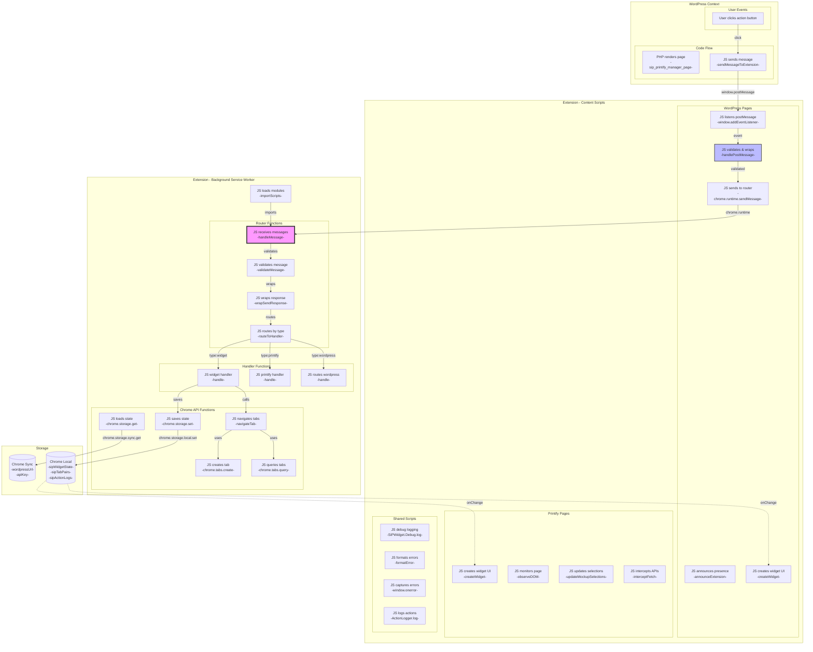
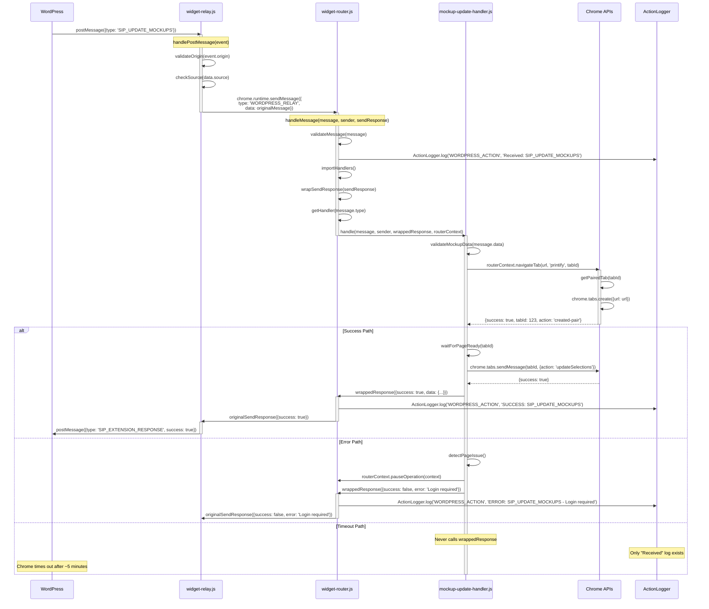
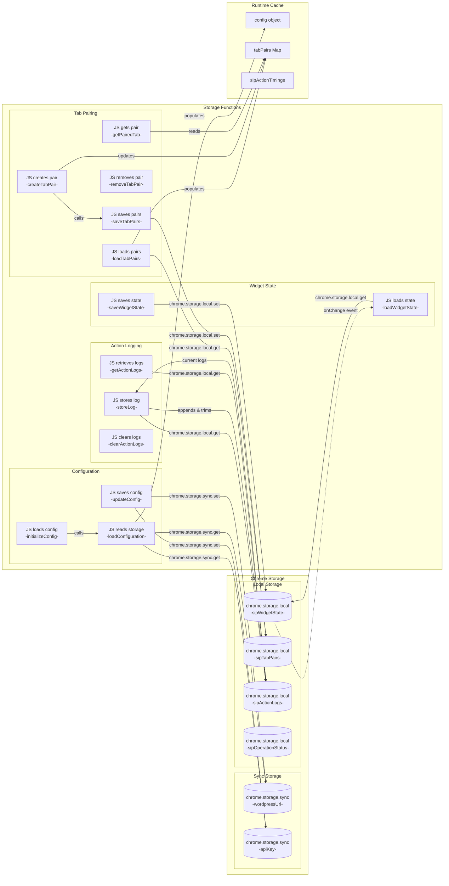
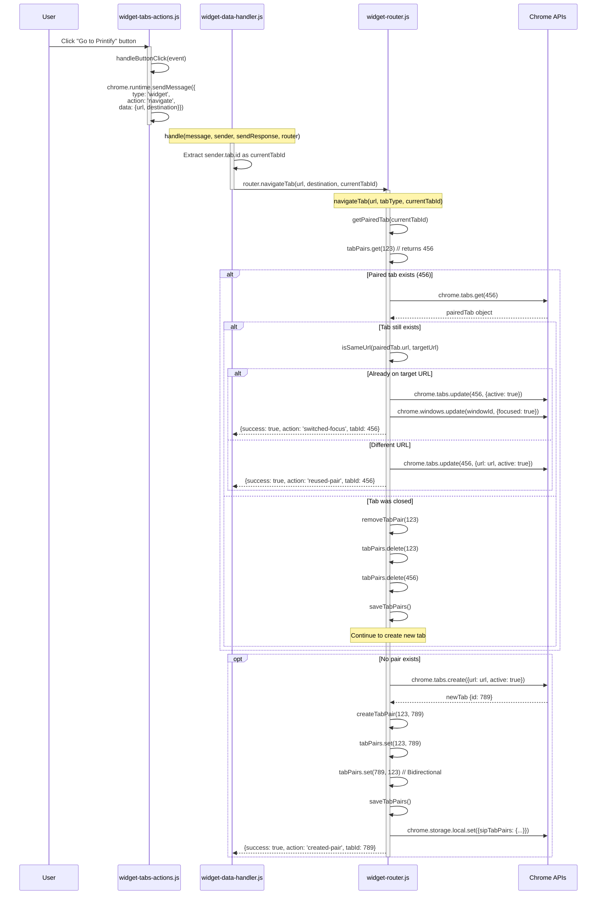
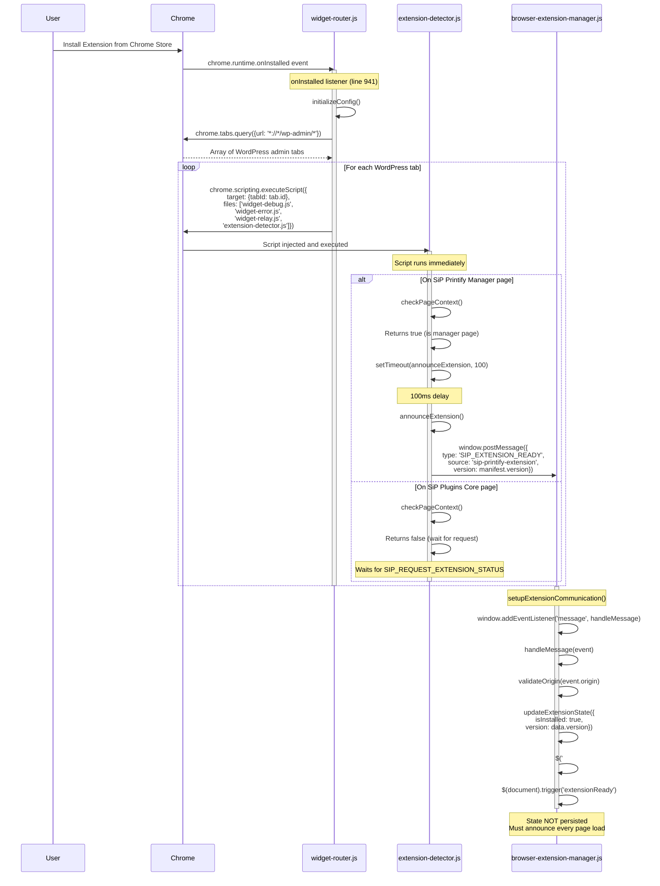
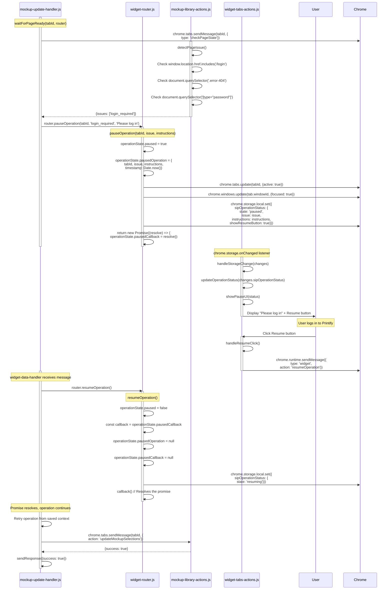
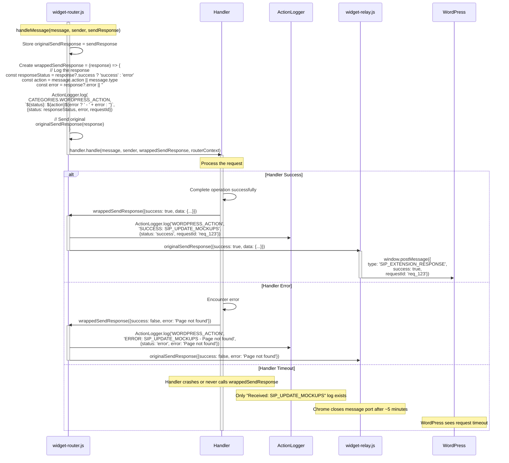

# SiP Printify Manager Browser Extension - Streamlined Documentation

**Repository**: https://github.com/tdemelle-SiP/sip-printify-manager-extension

## 1. Overview

The SiP Printify Manager browser extension bridges the gap between WordPress and Printify.com, enabling automated workflows and data access not available through Printify's public API.

**Core Problem**: WordPress plugins cannot directly access Printify's internal APIs or page data.

**Solution**: A Chrome extension that acts as a privileged intermediary, capturing data and executing operations on behalf of the WordPress plugin.

## 2. Architecture

### Diagram Notation Guide

Following the SiP Mermaid guidelines, all diagrams use consistent notation:

**Box Types**:
- `[User action]` - User events (clicks, navigations)
- `[JS does something<br/>-functionName-]` - Code execution with function name
- `[(Storage Type<br/>-key-)]` - Storage with actual key names (cylinder shape for persistence)

**Connection Labels**:
- `-->|methodName|` - Function calls or API methods
- `-->|chrome.storage.set|` - Chrome API calls
- `-->|window.postMessage|` - Browser APIs
- `-.->|onChange|` - Event-driven connections

**Why This Notation**: Every function that touches data must be visible for implementation validation.

### 2.1 Master System Architecture

This diagram shows the complete extension architecture with key functions:



**Reading the Master Diagram**:
- **Box Format**: `[Language action<br/>-functionName-]` shows what the code does and which function
- **Solid arrows (→)**: Active message/data flow with labels showing method calls
- **Dashed arrows (--->)**: Configuration or dependency relationships
- **Dotted arrows (-.->)**: Event-driven updates (storage onChange) or usage dependencies
- **Storage Format**: `[(Storage Type<br/>-key name-)]` shows actual storage keys
- **Subgraphs**: Execution contexts with different Chrome API capabilities

**Key Architecture Points**:
- **Router is the hub**: ALL runtime messages flow through handleMessage() in widget-router.js
- **Content scripts are limited**: Can only use chrome.runtime.sendMessage and chrome.storage
- **Background has full access**: Service worker context with all Chrome APIs
- **Function visibility**: Every function that touches data is shown
- **One-way message flow**: WordPress → Relay → Router → Handler → Response

### Understanding the Diagram Hierarchy

The Master System Architecture diagram above provides a complete view of the extension system, showing all major components and their relationships. However, to truly understand the implementation and validate that code matches architecture, we need function-level detail for specific flows.

The following detail diagrams expand specific aspects of the master architecture to show:
- **Every function that touches data** in that particular flow
- **The exact function names** from the code (shown in `-functionName-` format)
- **The specific operations** each function performs
- **Error handling paths** that might not be visible at the high level

Each detail diagram serves developers who need to:
- Debug a specific flow (e.g., "Why isn't my WordPress command working?")
- Implement changes to that flow (e.g., "Where do I add validation for tab operations?")
- Understand the complete chain of operations (e.g., "What happens between click and response?")

### 2.2 Complete Message Flow (Function Level)

**Purpose**: This diagram details the complete message flow from WordPress through the extension and back, showing every function call in sequence. Use this when debugging end-to-end communication issues or understanding the full request/response cycle.

This sequence diagram shows the exact function calls for a typical operation:



### 2.3 Storage Architecture Detail (Function Level)

**Purpose**: This diagram expands the storage components from the master diagram, showing every function that reads, writes, or transforms storage data. Use this when debugging storage issues, implementing new storage features, or understanding data persistence patterns.



**Storage Rationale**:
- **Sync vs Local**: Config in sync (small, needs roaming), state in local (larger, device-specific)
- **5MB Chrome limit**: Action logs auto-cleanup at 500 entries
- **Runtime state**: Performance-critical data kept in memory
- **Bidirectional pairs**: Enable navigation from either tab

### 2.4 Tab Pairing System Detail (Function Level)

**Purpose**: This diagram details the tab pairing system from the master diagram, showing how WordPress and Printify tabs maintain their bidirectional relationship. Use this when debugging navigation issues, implementing new tab operations, or understanding the pairing lifecycle.



**Tab Pairing Rationale**:
- **User expectation**: "Go to" should reuse tabs, not proliferate them
- **Bidirectional**: Users navigate both directions equally
- **Smart reuse**: Avoids reload if already on target page
- **Automatic cleanup**: chrome.tabs.onRemoved ensures no orphaned pairs

## 3. Architectural Rationale

### 3.1 Why This Architecture?

**Chrome Extension Constraints**:
1. **Security boundaries**: Web pages cannot access Chrome APIs
2. **Message passing rules**: Content scripts cannot intercept messages between other content scripts
3. **Context isolation**: Background scripts have no DOM access

**Core Design Principles**:

1. **Push-Driven Architecture**: Extension announces presence; WordPress never polls
   - *Why*: Reduces message traffic, ensures accurate state
   - *Implementation*: Fresh detection on every page load

2. **"Dumb Pipe" Principle**: Extension captures raw data; WordPress processes it
   - *Why*: Keeps extension simple, business logic centralized
   - *Implementation*: Handlers return raw API responses

3. **Central Router Pattern**: All messages flow through one hub
   - *Why*: Chrome funnels all runtime messages to background script
   - *Constraint*: Content scripts cannot intercept each other's messages

4. **Infrastructure-Level Logging**: Response logging at router, not handlers
   - *Why*: Cross-cutting concern, guaranteed coverage
   - *Implementation*: Router wraps sendResponse before passing to handlers

5. **Fresh Detection Model**: Extension state never persisted between page loads
   - *Why*: Eliminates false positives, ensures accurate detection
   - *Implementation*: Extension must announce on every page load

### 3.2 Component Purposes

| Component | Purpose (WHY it exists) |
|-----------|------------------------|
| Component | Purpose (WHY it exists) | Constraint/Requirement |
|-----------|------------------------|------------------------|
| **widget-relay.js** | Bridge between postMessage and chrome.runtime | WordPress can only use postMessage |
| **widget-router.js** | Central message hub and Chrome API executor | Chrome sends all messages to background |
| **background.js** | Module loader for service worker | Manifest V3 requires importScripts |
| **Handlers** | Separate business logic from infrastructure | Easier testing, single responsibility |
| **Action Scripts** | Detect page events and user interactions | Content scripts have limited API access |
| **widget-debug.js** | Consistent logging across contexts | Service workers use `self`, pages use `window` |
| **widget-error.js** | Standardize error responses | Consistent error format for WordPress |
| **action-logger.js** | Structured action history | Debug what extension does, not console output |
| **Tab Pairing** | Reuse existing tabs | Users expect "Go to Printify" to reuse tabs |
| **Response Logging** | Visible operation outcomes | Timeout/failures need to be debuggable |

## 4. Implementation Guide

### 4.1 Architectural Constraints

**Why widget-debug.js checks `typeof window`**:
```javascript
// Service workers have no window object
const isServiceWorker = typeof window === 'undefined';
const globalScope = isServiceWorker ? self : window;
```
This is NOT defensive coding - it's required by Chrome's dual-context architecture.

**Why Router MUST be the background script**:
- Chrome doesn't allow content scripts to intercept runtime messages between other content scripts
- ALL chrome.runtime.sendMessage() calls go directly to the background script
- This is why we achieve "ALL messages flow through router"

**Why extension state is never persisted**:
- Ensures "Install Extension" button always appears when extension not present
- Eliminates stale state from uninstalled extensions
- Forces push-driven model (extension announces when ready)

### 4.2 Message Formats

**External (WordPress ↔ Extension)**:
```javascript
{
    type: 'SIP_*',              // SIP_ prefix identifies our messages
    source: 'sip-printify-manager',
    requestId: 'unique_id',     // For async response correlation
    data: { /* command data */ }
}
```

**Internal (Extension components)**:
```javascript
{
    type: 'widget|printify|wordpress',  // Routes to handler
    action: 'specificAction',           // Handler method
    data: { /* action data */ }
}
```

### 4.3 Adding New Features

1. **Define the trigger** (user action or page event)
2. **Create message in action script**: 
   ```javascript
   chrome.runtime.sendMessage({
       type: 'printify',
       action: 'newFeature',
       data: { /* ... */ }
   });
   ```
3. **Add handler method**:
   ```javascript
   case 'newFeature':
       // Implementation
       sendResponse({success: true});
       return true; // CRITICAL for async
   ```

### 4.3 Chrome Architecture Constraints

**Service Worker (Background) Constraints**:
```javascript
// NO DOM access - this will fail in background.js:
// window.location  ❌
// document.querySelector  ❌

// Must check for window existence:
const isServiceWorker = typeof window === 'undefined';
const globalScope = isServiceWorker ? self : window;
```
*Why*: Chrome Manifest V3 service workers have no DOM

**Content Script Constraints**:
```javascript
// Limited Chrome API access:
chrome.storage.local.get()  ✓  // Allowed
chrome.runtime.sendMessage()  ✓  // Allowed
chrome.tabs.create()  ❌  // Not allowed

// Must request privileged operations from background:
chrome.runtime.sendMessage({
    type: 'widget',
    action: 'navigate',
    data: { url: 'https://...' }
});
```
*Why*: Security isolation between web pages and browser

**Message Channel Constraints**:
```javascript
// Content scripts CANNOT intercept other content script messages
// This will NEVER receive messages from other content scripts:
chrome.runtime.onMessage.addListener((message, sender) => {
    // Only receives from background script
});
```
*Why*: Chrome routes all runtime messages through background

### 4.5 Critical Patterns

**Async Message Handling**:
```javascript
// MUST return true to keep channel open
case 'asyncAction':
    (async () => {
        const result = await someAsyncOperation();
        sendResponse(result);
    })();
    return true; // CRITICAL!
```

**Router Context Usage**:
```javascript
// Handlers receive router context with Chrome API methods
const tab = await router.navigateTab(url);
const result = await router.queryTabs({url: '*://printify.com/*'});
```

## 5. Storage Schema

```javascript
// Chrome Storage Local - accessed via chrome.storage.local.get/set
{
    sipWidgetState: {           // Managed by saveWidgetState(), loadWidgetState()
        isExpanded: boolean,
        position: {x: number, y: number},
        currentOperation: {...}
    },
    sipTabPairs: {             // Managed by saveTabPairs(), loadTabPairs()
        "123": "456",          // createTabPair() sets bidirectional
        "456": "123"           // removeTabPair() deletes both
    },
    sipActionLogs: [{          // Managed by storeLog(), getActionLogs()
        timestamp: number,
        category: string,
        action: string,
        details: {...}
    }],
    sipOperationStatus: {      // Set by pauseOperation(), resumeOperation()
        state: 'paused' | 'resuming',
        issue: string,
        instructions: string,
        showResumeButton: boolean
    },
    sipCapturedApis: {...},    // Managed by API interceptor handler
    sipNewApisCount: number,
    pendingResearch: {...},
    fetchStatus_*: {...}       // Dynamic keys for fetch operations
}

// Chrome Storage Sync - accessed via chrome.storage.sync.get/set
{
    wordpressUrl: string,      // Set by updateConfig()
    apiKey: string            // 32-character key, set by updateConfig()
}

// Runtime State (not persisted)
{
    tabPairs: Map,            // In-memory cache loaded by loadTabPairs()
    operationState: {         // Managed by pauseOperation()/resumeOperation()
        paused: boolean,
        pausedOperation: {...},
        pausedCallback: Function
    },
    sipActionTimings: {}      // Performance tracking by startTiming()/endTiming()
}
```

### 5.1 Extension Detection & Installation Flow (Function Level)

**Purpose**: This diagram details how the extension announces itself to WordPress pages and how the plugin detects the extension. Use this when debugging extension detection issues, implementing new announcement mechanisms, or understanding the push-driven architecture.



**Why Programmatic Injection**: Content scripts don't auto-inject into already-open tabs after installation. Users expect immediate functionality without reload.

**Why 100ms Delay**: Ensures all scripts are fully loaded before announcing presence.

**Why No State Persistence**: Fresh detection eliminates false positives from uninstalled extensions.

## 6. Message Type Reference

### WordPress Commands (SIP_*)
| Command | Purpose | Handler |
|---------|---------|---------|
| SIP_NAVIGATE | Navigate to URL | widget |
| SIP_SHOW_WIDGET | Show widget UI | widget |
| SIP_CHECK_STATUS | Check connection | widget |
| SIP_FETCH_MOCKUPS | Get mockup data | printify |
| SIP_UPDATE_PRODUCT_MOCKUPS | Update mockups | printify |

### Internal Actions
| Type | Actions | Purpose |
|------|---------|---------|
| widget | navigate, showWidget, updateState | UI operations |
| printify | fetchMockups, updateStatus | Printify operations |
| wordpress | (routes SIP_* to handlers) | Message translation |

### 6.1 Message Format Transformation (Function Level)

**Purpose**: This diagram details how WordPress commands are transformed as they pass through the extension layers. Use this when debugging message format issues, implementing new message types, or understanding why messages arrive in different formats at different layers.

```mermaid
flowchart LR
    subgraph "WordPress Context"
        WP[JS builds message<br/>-sendMessageToExtension-]
        WPMsg["{
            type: 'SIP_UPDATE_PRODUCT_MOCKUPS',
            source: 'sip-printify-manager',
            requestId: 'req_123',
            data: { productId: 456 }
        }"]
    end
    
    subgraph "Relay Functions"
        R1[JS receives event<br/>-handlePostMessage-]
        R2[JS validates origin<br/>-event.origin check-]
        R3[JS validates source<br/>-data.source check-]
        R4[JS wraps message<br/>-chrome.runtime.sendMessage-]
        RelayMsg["{
            type: 'WORDPRESS_RELAY',
            data: {
                type: 'wordpress',
                action: 'SIP_UPDATE_PRODUCT_MOCKUPS',
                data: originalMessage,
                requestId: 'req_123'
            }
        }"]
    end
    
    subgraph "Router Functions"
        RO1[JS receives message<br/>-handleMessage-]
        RO2[JS detects relay<br/>-checkWordPressRelay-]
        RO3[JS extracts nested<br/>-message = message.data-]
        RO4[JS logs received<br/>-ActionLogger.log-]
        RO5[JS gets handler<br/>-getHandlerByType-]
        RO6[JS calls handler<br/>-handler.handle-]
    end
    
    subgraph "Handler Processing"
        H1[JS routes command<br/>-wordpress-handler.handle-]
        H2[JS converts to internal<br/>-mapWordPressAction-]
        H3[JS delegates to handler<br/>-PrintifyDataHandler.handle-]
        HandlerMsg["{
            type: 'printify',
            action: 'updateProductMockups',
            data: { productId: 456 }
        }"]
    end
    
    WP -->|creates| WPMsg
    WPMsg -->|window.postMessage| R1
    R1 -->|validates| R2
    R2 -->|checks| R3
    R3 -->|wraps| R4
    R4 -->|creates| RelayMsg
    RelayMsg -->|chrome.runtime| RO1
    RO1 -->|checks| RO2
    RO2 -->|extracts| RO3
    RO3 -->|logs| RO4
    RO4 -->|routes| RO5
    RO5 -->|calls| RO6
    RO6 -->|invokes| H1
    H1 -->|maps| H2
    H2 -->|creates| HandlerMsg
    H2 -->|delegates| H3
```



**Why Transform**: External format identifies our messages among all postMessages. Internal format routes to correct handler.

## 7. Key Features

### 7.1 Tab Pairing System
- Maintains bidirectional pairing between WordPress and Printify tabs
- Reuses existing tabs instead of creating new ones
- Automatically cleans up when tabs close

### 7.2 Pause/Resume Error Recovery (Function Level)

**Purpose**: This diagram details the pause/resume system that handles page errors (login required, 404, etc.) during operations. Use this when debugging error recovery, implementing new error types, or understanding how the extension maintains operation state across user interventions.



**Why Pause/Resume**: Operations fail on login pages, 404s, permission errors. Users can fix issues without losing progress.

**Error Detection**:
```javascript
function detectPageIssue() {
    if (window.location.href.includes('/login')) return ['login_required'];
    if (document.querySelector('.error-404')) return ['page_not_found'];
    if (document.querySelector('[type="password"]')) return ['login_required'];
    return null;
}
```

### 7.3 Response Logging Architecture (Function Level)

**Purpose**: This diagram shows how response logging is implemented at the infrastructure level in the router. Use this when debugging logging issues, understanding why certain actions aren't logged, or implementing new logging features.



**Why Infrastructure Level**: 
- DRY principle - implement once, not in every handler
- Guaranteed coverage - can't forget to log
- Evolution-friendly - change format in one place

### 7.4 Content Security Policy (CSP) Compliance

**Required Patterns**:
```javascript
// ❌ CSP Violation - Inline handler
element.innerHTML = '<button onclick="doThing()">Click</button>';

// ✓ CSP Compliant - Programmatic handler
const button = document.createElement('button');
button.textContent = 'Click';
button.addEventListener('click', doThing);
element.appendChild(button);

// ❌ CSP Violation - Inline styles
element.innerHTML = '<div style="color: red">Text</div>';

// ✓ CSP Compliant - CSS classes
element.innerHTML = '<div class="error-text">Text</div>';
```

**Why CSP Matters**: WordPress and many sites enforce CSP to prevent XSS. Extension must work everywhere.

### 7.5 Public API Naming Standards

**Critical Pattern**: All UI functions MUST be under `SiPWidget.UI` namespace

```javascript
// ❌ WRONG - Will cause ReferenceError
showWidget();  
toggleWidget();

// ✓ CORRECT - Explicit namespace
SiPWidget.UI.showWidget();
SiPWidget.UI.toggleWidget();

// Future commands follow same pattern:
SiPWidget.UI.refreshWidget();
SiPWidget.UI.resizeWidget();
```

**Why**: Prevents race conditions where function is called before module loads. Makes API discoverable and extensible.

## 8. Development Quick Reference

### File Structure with Key Functions
```
extension/
├── manifest.json              # Extension configuration
├── background.js              # importScripts() loader
├── core-scripts/
│   ├── widget-router.js      # handleMessage(), navigateTab(), pauseOperation()
│   ├── widget-relay.js       # handlePostMessage(), window.addEventListener()
│   ├── widget-debug.js       # SiPWidget.Debug.log(), error(), warn()
│   ├── widget-error.js       # formatError(), standardizeError()
│   ├── action-logger.js      # ActionLogger.log(), storeLog(), getActionLogs()
│   └── error-capture.js      # window.onerror, unhandledrejection handlers
├── action-scripts/
│   ├── extension-detector.js # announceExtension(), checkPageContext()
│   ├── widget-tabs-actions.js # createWidget(), handleButtonClick(), updateUI()
│   ├── printify-tab-actions.js # observeDOM(), detectPageChanges()
│   ├── mockup-library-actions.js # updateMockupSelections(), detectPageIssue()
│   └── api-interceptor-actions.js # interceptFetch(), captureAPI()
└── handler-scripts/
    ├── widget-data-handler.js # handle() with navigate/showWidget/updateState
    ├── printify-data-handler.js # handle() with fetchMockups/updateStatus
    ├── wordpress-handler.js   # handle() routes SIP_* to internal format
    ├── mockup-fetch-handler.js # handle() navigates and captures mockup data
    ├── mockup-update-handler.js # handle() updates product mockups
    └── api-interceptor-handler.js # handle() processes captured APIs
```

### Common Issues

**Widget not visible**: 
- Widget must start with `sip-visible` class
- Position must be in viewport: `x: window.innerWidth - 340, y: 20`
- Check `#sip-floating-widget` exists in DOM

**Messages not routing**: 
- External format requires: `type: 'SIP_*'` and `source: 'sip-printify-manager'`
- Internal format requires: `type: 'widget|printify|wordpress'` and `action: 'specificAction'`

**Manifest corruption**: 
- Run `file manifest.json` - should show "ASCII text" not "UTF-8 Unicode (with BOM)"
- Validate with `node validate-manifest.js`

### Testing Checklist with Function Verification
- [ ] Run `node validate-manifest.js` to check manifest integrity
- [ ] Check chrome://extensions for ANY errors or warnings  
- [ ] Click "service worker" link and verify all importScripts() loaded
- [ ] Verify no BOM characters: `file manifest.json` shows "ASCII text"
- [ ] Check handleMessage() receives all messages in service worker console
- [ ] Verify handlePostMessage() security checks in content script console
- [ ] Look for paired "Received"/"SUCCESS" logs from wrapSendResponse()
- [ ] Test pauseOperation()/resumeOperation() with login pages
- [ ] Verify createWidget() positions widget in viewport
- [ ] Test createTabPair() creates bidirectional entries in storage
- [ ] Confirm announceExtension() runs on page load