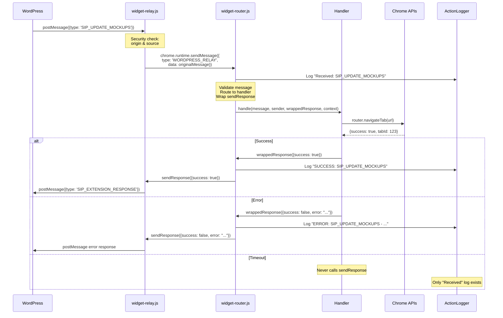
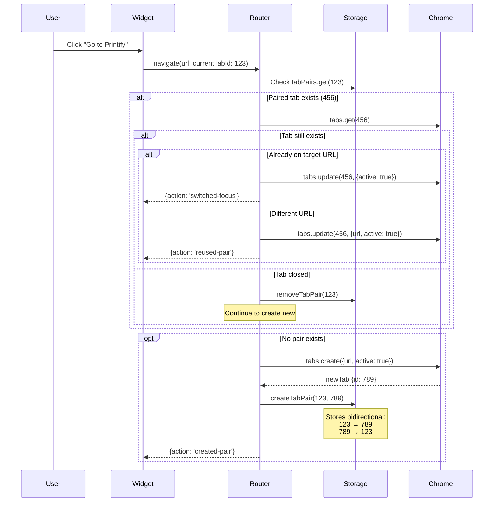
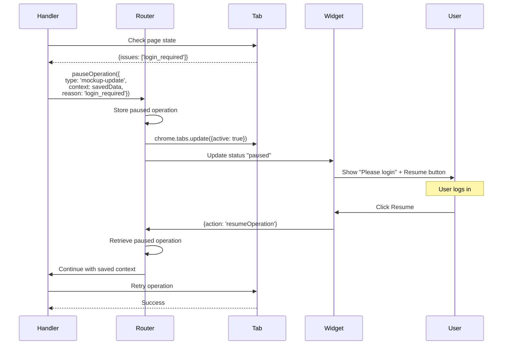
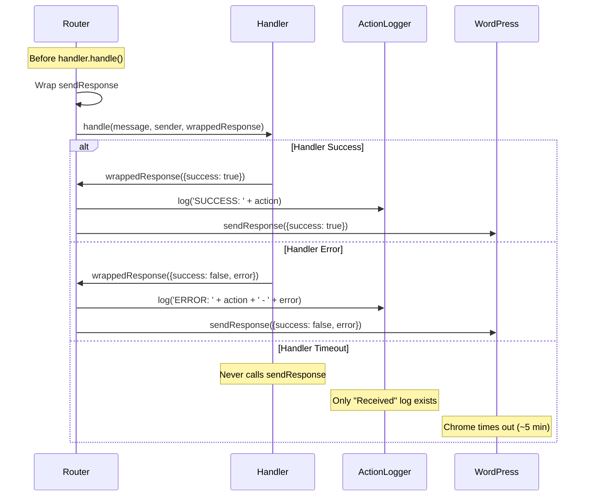

# SiP Printify Manager Browser Extension - Streamlined Documentation

**Repository**: https://github.com/tdemelle-SiP/sip-printify-manager-extension

## 1. Overview

The SiP Printify Manager browser extension bridges the gap between WordPress and Printify.com, enabling automated workflows and data access not available through Printify's public API.

**Core Problem**: WordPress plugins cannot directly access Printify's internal APIs or page data.

**Solution**: A Chrome extension that acts as a privileged intermediary, capturing data and executing operations on behalf of the WordPress plugin.

## 2. Architecture

### 2.1 Master System Architecture

This diagram shows the complete extension architecture - every component and communication path at a consistent level:

```mermaid
graph TB
    subgraph "WordPress Context"
        WP[WordPress Plugin<br/>PHP + JavaScript]
        BEM[browser-extension-manager.js<br/>Sends postMessage]
    end
    
    subgraph "Extension - Content Scripts"
        subgraph "WordPress Pages"
            Relay[widget-relay.js<br/>Message Bridge]
            Detector[extension-detector.js<br/>Announces Presence]
            Widget1[widget-tabs-actions.js<br/>Widget UI]
        end
        
        subgraph "Printify Pages"
            Widget2[widget-tabs-actions.js<br/>Widget UI]
            Monitor[printify-tab-actions.js<br/>Page Monitor]
            Mockup[mockup-library-actions.js<br/>Mockup Selector]
            APIInt[api-interceptor-actions.js<br/>API Discovery]
        end
        
        subgraph "Shared Scripts"
            Debug[widget-debug.js<br/>Debug Logging]
            Error[widget-error.js<br/>Error Formatting]
            ErrorCap[error-capture.js<br/>Error Capture]
            Logger[action-logger.js<br/>Action History]
            Styles[widget-styles.css<br/>UI Styling]
        end
    end
    
    subgraph "Extension - Background (Service Worker)"
        Router[widget-router.js<br/>Central Message Hub<br/>+ Chrome API Executor]
        BG[background.js<br/>Module Loader]
        
        subgraph "Handlers"
            WH[widget-data-handler.js]
            PH[printify-data-handler.js]
            WPH[wordpress-handler.js]
            MFH[mockup-fetch-handler.js]
            MUH[mockup-update-handler.js]
            APIH[api-interceptor-handler.js]
        end
    end
    
    subgraph "Chrome APIs"
        Tabs[chrome.tabs]
        Storage[chrome.storage]
        Runtime[chrome.runtime]
        Action[chrome.action]
    end
    
    subgraph "External"
        Printify[Printify.com]
        Manifest[manifest.json<br/>Extension Config]
    end
    
    %% Initialization
    Manifest -.->|configures| BG
    BG -->|importScripts| Router
    BG -->|importScripts| Handlers
    
    %% Communication paths
    BEM -->|postMessage| Relay
    Relay -->|chrome.runtime.sendMessage| Router
    Widget1 -->|chrome.runtime.sendMessage| Router
    Widget2 -->|chrome.runtime.sendMessage| Router
    Monitor -->|chrome.runtime.sendMessage| Router
    Mockup -->|chrome.runtime.sendMessage| Router
    APIInt -->|chrome.runtime.sendMessage| Router
    ErrorCap -->|ACTION_LOG| Router
    
    Router -->|Routes by type| Handlers
    Router <-->|Direct calls| Tabs
    Router <-->|Direct calls| Storage
    Router <-->|Direct calls| Runtime
    Router <-->|Icon clicks| Action
    
    Handlers -->|Via Router| Printify
    Storage -.->|onChange events| Widget1
    Storage -.->|onChange events| Widget2
    
    %% Response path
    Router -->|sendResponse| Relay
    Relay -->|postMessage| BEM
    
    %% Shared dependencies
    Debug -.->|Used by| Router
    Debug -.->|Used by| Handlers
    Debug -.->|Used by| Widget1
    Debug -.->|Used by| Widget2
    Error -.->|Used by| Router
    Logger -.->|Used by| Router
    Styles -.->|Applied to| Widget1
    Styles -.->|Applied to| Widget2
    
    style Router fill:#f9f,stroke:#333,stroke-width:4px
    style Relay fill:#bbf,stroke:#333,stroke-width:2px
    style BG fill:#fbb,stroke:#333,stroke-width:2px
```



**Reading the Master Diagram**:
- **Solid arrows (→)**: Active message/data flow
- **Dashed arrows (--->)**: Configuration or dependency relationships
- **Dotted arrows (-.->)**: Event-driven updates or usage
- **Thick border**: Critical infrastructure components
- **Subgraphs**: Execution contexts with different capabilities

**Key Architecture Points**:
- **Router is the hub**: ALL runtime messages flow through widget-router.js
- **Content scripts are limited**: Can only use chrome.runtime.sendMessage and chrome.storage
- **Background has full access**: Service worker context with all Chrome APIs
- **Shared scripts**: Utilities available across contexts (debug, error, logger)
- **One-way message flow**: WordPress → Relay → Router → Handler → Response

### 2.2 Complete Message Flow

This sequence diagram shows how a typical operation flows through the system:



### 2.3 Storage Architecture Detail

This diagram expands the Storage component from the master diagram:

```mermaid
graph LR
    subgraph "Chrome Storage API"
        subgraph "chrome.storage.sync"
            WPUrl[wordpressUrl<br/>Site URL]
            APIKey[apiKey<br/>32-char key]
        end
        
        subgraph "chrome.storage.local"
            Widget[sipWidgetState]
            Pairs[sipTabPairs]
            Logs[sipActionLogs]
            OpStatus[sipOperationStatus]
            APIs[sipCapturedApis]
            APICount[sipNewApisCount]
            Pending[pendingResearch]
            FetchStatus[fetchStatus_*]
        end
    end
    
    subgraph "Runtime State (Not Persisted)"
        TabMap[Tab Pairs Map<br/>In-memory cache]
        Paused[Paused Operations<br/>Context & callbacks]
        Handlers[Handler Registry<br/>Type → Handler mapping]
        Timings[Operation Timings<br/>Performance tracking]
    end
    
    subgraph "State Details"
        WidgetDetail[sipWidgetState:<br/>{isExpanded: boolean,<br/>position: {x, y},<br/>currentOperation: {...}}]
        
        PairsDetail[sipTabPairs:<br/>{"123": "456",<br/>"456": "123"}<br/>Bidirectional mapping]
        
        LogsDetail[sipActionLogs:<br/>Array of actions<br/>Max 500 entries<br/>Auto-cleanup]
    end
    
    Widget -.->|structure| WidgetDetail
    Pairs -.->|structure| PairsDetail
    Logs -.->|structure| LogsDetail
    
    Pairs <-->|Load/Save| TabMap
    OpStatus <-->|Pause/Resume| Paused
    
    style Widget fill:#bfb
    style Pairs fill:#bfb
    style Logs fill:#bfb
```

**Storage Rationale**:
- **Sync vs Local**: Config in sync (small, needs roaming), state in local (larger, device-specific)
- **5MB Chrome limit**: Action logs auto-cleanup at 500 entries
- **Runtime state**: Performance-critical data kept in memory
- **Bidirectional pairs**: Enable navigation from either tab

### 2.4 Tab Pairing System Detail

This diagram expands the tab pairing logic referenced in the master diagram:



**Tab Pairing Rationale**:
- **User expectation**: "Go to" should reuse tabs, not proliferate them
- **Bidirectional**: Users navigate both directions equally
- **Smart reuse**: Avoids reload if already on target page
- **Automatic cleanup**: chrome.tabs.onRemoved ensures no orphaned pairs

## 3. Architectural Rationale

### 3.1 Why This Architecture?

**Chrome Extension Constraints**:
1. **Security boundaries**: Web pages cannot access Chrome APIs
2. **Message passing rules**: Content scripts cannot intercept messages between other content scripts
3. **Context isolation**: Background scripts have no DOM access

**Core Design Principles**:

1. **Push-Driven Architecture**: Extension announces presence; WordPress never polls
   - *Why*: Reduces message traffic, ensures accurate state
   - *Implementation*: Fresh detection on every page load

2. **"Dumb Pipe" Principle**: Extension captures raw data; WordPress processes it
   - *Why*: Keeps extension simple, business logic centralized
   - *Implementation*: Handlers return raw API responses

3. **Central Router Pattern**: All messages flow through one hub
   - *Why*: Chrome funnels all runtime messages to background script
   - *Constraint*: Content scripts cannot intercept each other's messages

4. **Infrastructure-Level Logging**: Response logging at router, not handlers
   - *Why*: Cross-cutting concern, guaranteed coverage
   - *Implementation*: Router wraps sendResponse before passing to handlers

5. **Fresh Detection Model**: Extension state never persisted between page loads
   - *Why*: Eliminates false positives, ensures accurate detection
   - *Implementation*: Extension must announce on every page load

### 3.2 Component Purposes

| Component | Purpose (WHY it exists) |
|-----------|------------------------|
| Component | Purpose (WHY it exists) | Constraint/Requirement |
|-----------|------------------------|------------------------|
| **widget-relay.js** | Bridge between postMessage and chrome.runtime | WordPress can only use postMessage |
| **widget-router.js** | Central message hub and Chrome API executor | Chrome sends all messages to background |
| **background.js** | Module loader for service worker | Manifest V3 requires importScripts |
| **Handlers** | Separate business logic from infrastructure | Easier testing, single responsibility |
| **Action Scripts** | Detect page events and user interactions | Content scripts have limited API access |
| **widget-debug.js** | Consistent logging across contexts | Service workers use `self`, pages use `window` |
| **widget-error.js** | Standardize error responses | Consistent error format for WordPress |
| **action-logger.js** | Structured action history | Debug what extension does, not console output |
| **Tab Pairing** | Reuse existing tabs | Users expect "Go to Printify" to reuse tabs |
| **Response Logging** | Visible operation outcomes | Timeout/failures need to be debuggable |

## 4. Implementation Guide

### 4.1 Architectural Constraints

**Why widget-debug.js checks `typeof window`**:
```javascript
// Service workers have no window object
const isServiceWorker = typeof window === 'undefined';
const globalScope = isServiceWorker ? self : window;
```
This is NOT defensive coding - it's required by Chrome's dual-context architecture.

**Why Router MUST be the background script**:
- Chrome doesn't allow content scripts to intercept runtime messages between other content scripts
- ALL chrome.runtime.sendMessage() calls go directly to the background script
- This is why we achieve "ALL messages flow through router"

**Why extension state is never persisted**:
- Ensures "Install Extension" button always appears when extension not present
- Eliminates stale state from uninstalled extensions
- Forces push-driven model (extension announces when ready)

### 4.2 Message Formats

**External (WordPress ↔ Extension)**:
```javascript
{
    type: 'SIP_*',              // SIP_ prefix identifies our messages
    source: 'sip-printify-manager',
    requestId: 'unique_id',     // For async response correlation
    data: { /* command data */ }
}
```

**Internal (Extension components)**:
```javascript
{
    type: 'widget|printify|wordpress',  // Routes to handler
    action: 'specificAction',           // Handler method
    data: { /* action data */ }
}
```

### 4.3 Adding New Features

1. **Define the trigger** (user action or page event)
2. **Create message in action script**: 
   ```javascript
   chrome.runtime.sendMessage({
       type: 'printify',
       action: 'newFeature',
       data: { /* ... */ }
   });
   ```
3. **Add handler method**:
   ```javascript
   case 'newFeature':
       // Implementation
       sendResponse({success: true});
       return true; // CRITICAL for async
   ```

### 4.3 Chrome Architecture Constraints

**Service Worker (Background) Constraints**:
```javascript
// NO DOM access - this will fail in background.js:
// window.location  ❌
// document.querySelector  ❌

// Must check for window existence:
const isServiceWorker = typeof window === 'undefined';
const globalScope = isServiceWorker ? self : window;
```
*Why*: Chrome Manifest V3 service workers have no DOM

**Content Script Constraints**:
```javascript
// Limited Chrome API access:
chrome.storage.local.get()  ✓  // Allowed
chrome.runtime.sendMessage()  ✓  // Allowed
chrome.tabs.create()  ❌  // Not allowed

// Must request privileged operations from background:
chrome.runtime.sendMessage({
    type: 'widget',
    action: 'navigate',
    data: { url: 'https://...' }
});
```
*Why*: Security isolation between web pages and browser

**Message Channel Constraints**:
```javascript
// Content scripts CANNOT intercept other content script messages
// This will NEVER receive messages from other content scripts:
chrome.runtime.onMessage.addListener((message, sender) => {
    // Only receives from background script
});
```
*Why*: Chrome routes all runtime messages through background

### 4.5 Critical Patterns

**Async Message Handling**:
```javascript
// MUST return true to keep channel open
case 'asyncAction':
    (async () => {
        const result = await someAsyncOperation();
        sendResponse(result);
    })();
    return true; // CRITICAL!
```

**Router Context Usage**:
```javascript
// Handlers receive router context with Chrome API methods
const tab = await router.navigateTab(url);
const result = await router.queryTabs({url: '*://printify.com/*'});
```

## 5. Storage Schema

```javascript
// Chrome Storage Local
{
    sipWidgetState: { isExpanded, position, currentOperation },
    sipTabPairs: { "123": "456", "456": "123" }, // Bidirectional
    sipActionLogs: [ /* Action history */ ],
    sipOperationStatus: { state, pausedOperation },
    sipCapturedApis: { /* API discovery data */ }
}

// Chrome Storage Sync
{
    wordpressUrl: 'https://site.com',
    apiKey: '32-character-key'
}
```

### 5.1 Extension Detection & Installation Flow

```mermaid
sequenceDiagram
    participant User
    participant Chrome
    participant Router
    participant Tabs
    participant WP as WordPress
    
    User->>Chrome: Install Extension
    Chrome->>Router: chrome.runtime.onInstalled
    
    Router->>Chrome: Query all WordPress tabs
    Chrome-->>Router: [tab1, tab2, ...]
    
    loop For each WordPress tab
        Router->>Tabs: chrome.scripting.executeScript({
            target: tabId,
            files: [scripts...]
        })
        Tabs->>WP: Inject content scripts
        
        Note over WP: 100ms delay
        
        WP->>WP: postMessage({
            type: 'SIP_EXTENSION_READY',
            version: '1.5.3'
        })
        
        WP->>WP: Update UI (hide install button)
    end
    
    Note over WP: State NOT persisted<br/>Fresh detection required
```

**Why Programmatic Injection**: Content scripts don't auto-inject into already-open tabs after installation. Users expect immediate functionality without reload.

**Why 100ms Delay**: Ensures all scripts are fully loaded before announcing presence.

**Why No State Persistence**: Fresh detection eliminates false positives from uninstalled extensions.

## 6. Message Type Reference

### WordPress Commands (SIP_*)
| Command | Purpose | Handler |
|---------|---------|---------|
| SIP_NAVIGATE | Navigate to URL | widget |
| SIP_SHOW_WIDGET | Show widget UI | widget |
| SIP_CHECK_STATUS | Check connection | widget |
| SIP_FETCH_MOCKUPS | Get mockup data | printify |
| SIP_UPDATE_PRODUCT_MOCKUPS | Update mockups | printify |

### Internal Actions
| Type | Actions | Purpose |
|------|---------|---------|
| widget | navigate, showWidget, updateState | UI operations |
| printify | fetchMockups, updateStatus | Printify operations |
| wordpress | (routes SIP_* to handlers) | Message translation |

### 6.1 Message Format Transformation

This shows how the relay transforms external WordPress messages to internal format:

```mermaid
flowchart LR
    subgraph "WordPress Format"
        WP["{
            type: 'SIP_UPDATE_PRODUCT_MOCKUPS',
            source: 'sip-printify-manager',
            requestId: 'req_123',
            data: { productId: 456 }
        }"]
    end
    
    subgraph "Relay Transformation"
        R1[Security Check:<br/>origin & source]
        R2[Wrap in WORDPRESS_RELAY]
        R3[Extract to message.data]
    end
    
    subgraph "Router Processing"
        RO1[Detect WORDPRESS_RELAY]
        RO2[Extract nested message]
        RO3[Log Received]
        RO4[Route to handler]
    end
    
    subgraph "Internal Format"
        INT["{
            type: 'wordpress',
            action: 'SIP_UPDATE_PRODUCT_MOCKUPS',
            data: { ... },
            requestId: 'req_123'
        }"]
    end
    
    WP -->|postMessage| R1
    R1 --> R2
    R2 --> R3
    R3 -->|chrome.runtime| RO1
    RO1 --> RO2
    RO2 --> RO3
    RO3 --> RO4
    RO4 --> INT
```



**Why Transform**: External format identifies our messages among all postMessages. Internal format routes to correct handler.

## 7. Key Features

### 7.1 Tab Pairing System
- Maintains bidirectional pairing between WordPress and Printify tabs
- Reuses existing tabs instead of creating new ones
- Automatically cleans up when tabs close

### 7.2 Pause/Resume Error Recovery

This diagram shows the complete pause/resume flow:



**Why Pause/Resume**: Operations fail on login pages, 404s, permission errors. Users can fix issues without losing progress.

**Error Detection**:
```javascript
function detectPageIssue() {
    if (window.location.href.includes('/login')) return ['login_required'];
    if (document.querySelector('.error-404')) return ['page_not_found'];
    if (document.querySelector('[type="password"]')) return ['login_required'];
    return null;
}
```

### 7.3 Response Logging Architecture

This diagram shows how response logging is implemented at the infrastructure level:



**Why Infrastructure Level**: 
- DRY principle - implement once, not in every handler
- Guaranteed coverage - can't forget to log
- Evolution-friendly - change format in one place

### 7.4 Content Security Policy (CSP) Compliance

**Required Patterns**:
```javascript
// ❌ CSP Violation - Inline handler
element.innerHTML = '<button onclick="doThing()">Click</button>';

// ✓ CSP Compliant - Programmatic handler
const button = document.createElement('button');
button.textContent = 'Click';
button.addEventListener('click', doThing);
element.appendChild(button);

// ❌ CSP Violation - Inline styles
element.innerHTML = '<div style="color: red">Text</div>';

// ✓ CSP Compliant - CSS classes
element.innerHTML = '<div class="error-text">Text</div>';
```

**Why CSP Matters**: WordPress and many sites enforce CSP to prevent XSS. Extension must work everywhere.

### 7.5 Error Response Formatting

**Standardized Format** (via widget-error.js):\n```javascript\n// Success\n{\n    success: true,\n    data: { /* result data */ },\n    message: \"Optional success message\"\n}\n\n// Error\n{\n    success: false,\n    error: \"Human-readable error message\",\n    code: \"MACHINE_READABLE_CODE\",\n    timestamp: Date.now()\n}\n```\n\n**Standard Error Codes**:\n- `NOT_CONFIGURED` - Extension not set up\n- `TAB_NOT_FOUND` - Tab doesn't exist\n- `AUTH_ERROR` - Invalid API key\n- `CONNECTION_ERROR` - Network failure\n- `UNKNOWN_ACTION` - Invalid message type\n\n**Why Standardized**: WordPress expects consistent error format for proper handling.

### 7.6 Public API Naming Standards

**Critical Pattern**: All UI functions MUST be under `SiPWidget.UI` namespace

```javascript
// ❌ WRONG - Will cause ReferenceError
showWidget();  
toggleWidget();

// ✓ CORRECT - Explicit namespace
SiPWidget.UI.showWidget();
SiPWidget.UI.toggleWidget();

// Future commands follow same pattern:
SiPWidget.UI.refreshWidget();
SiPWidget.UI.resizeWidget();
```

**Why**: Prevents race conditions where function is called before module loads. Makes API discoverable and extensible.

## 8. Development Quick Reference

### File Structure
```
extension/
├── manifest.json
├── background.js              # Service worker loader
├── core-scripts/
│   ├── widget-router.js      # Message hub + Chrome APIs
│   ├── widget-relay.js       # WordPress bridge
│   └── action-logger.js      # Structured logging
├── action-scripts/           # Content scripts (*-actions.js)
└── handler-scripts/          # Background handlers (*-handler.js)
```

### Common Issues

**"Message port closed"**: Handler didn't return `true` for async operation
```javascript
case 'asyncAction':
    (async () => {
        // async work
        sendResponse(result);
    })();
    return true; // CRITICAL - keeps channel open
```

**Widget not visible**: Check position calculations and `sip-visible` class
```javascript
// Widget MUST start visible with proper positioning
widget.className = 'sip-floating-widget collapsed sip-visible';
widget.style.left = (window.innerWidth - 340) + 'px'; // 320px expanded + 20px margin
widget.style.top = '20px';
// Never rely on inline styles for critical visibility - use sip-visible class
```

**Messages not routing**: Verify message format matches expected structure
- External: `type: 'SIP_*'` with `source: 'sip-printify-manager'`
- Internal: `type: 'widget|printify|wordpress'` with `action: 'specificAction'`

**Manifest corruption**: Check for BOM characters
```bash
file manifest.json  # Should show "ASCII text" not "UTF-8 Unicode (with BOM)"
```

### Testing Checklist
- [ ] Run `node validate-manifest.js` to check manifest integrity
- [ ] Check chrome://extensions for ANY errors or warnings
- [ ] Click "service worker" link and check console for errors
- [ ] Verify no BOM characters: `file manifest.json` shows "ASCII text"
- [ ] Look for paired "Received"/"SUCCESS" logs in action history
- [ ] Test pause/resume with login pages
- [ ] Verify widget appears on screen (not just loaded)
- [ ] Test tab pairing creates bidirectional relationships
- [ ] Confirm extension announces on page load