# SiP Printify Manager Browser Extension - Streamlined Documentation

**Repository**: https://github.com/tdemelle-SiP/sip-printify-manager-extension

## 1. Overview

The SiP Printify Manager browser extension bridges the gap between WordPress and Printify.com, enabling automated workflows and data access not available through Printify's public API.

**Core Problem**: WordPress plugins cannot directly access Printify's internal APIs or page data.

**Solution**: A Chrome extension that acts as a privileged intermediary, capturing data and executing operations on behalf of the WordPress plugin.

**Critical Limitation**: Printify blocks `chrome.runtime` access in content scripts, preventing traditional extension messaging. The extension uses URL parameters for mockup updates and has limited functionality on Printify pages.

## 2. Architecture

### Diagram Notation Guide

**Box Types**:
- `[User action]` - User events (clicks, navigations)
- `[JS does something<br/>-functionName-<br/>file.js]` - Code execution with function name and file
- `[(Storage Type<br/>-key-)]` - Storage with actual key names (cylinder shape for persistence)

**Connection Labels**:
- `-->|methodName|` - Function calls or API methods
- `-->|chrome.storage.set|` - Chrome API calls
- `-->|window.postMessage|` - Browser APIs
- `-.->|onChange|` - Event-driven connections

### 2.1 Master System Architecture

This diagram shows the complete extension architecture:

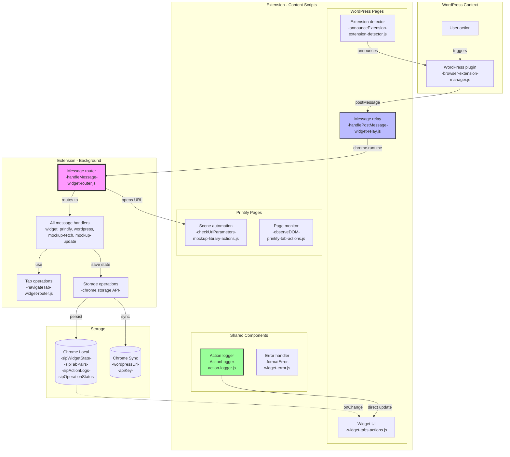

**Key Architecture Points**:
- **Router is the hub**: ALL runtime messages flow through the central router
- **Content scripts are limited**: Can only use chrome.runtime.sendMessage and chrome.storage
- **Background has full access**: Service worker context with all Chrome APIs
- **One-way message flow**: WordPress → Relay → Router → Handler → Response
- **Printify limitation**: chrome.runtime blocked, mockup updates use URL parameters instead
- **Two display update paths**: Storage-driven for stateful operations, direct updates for instant feedback

### 2.2 Message Flow

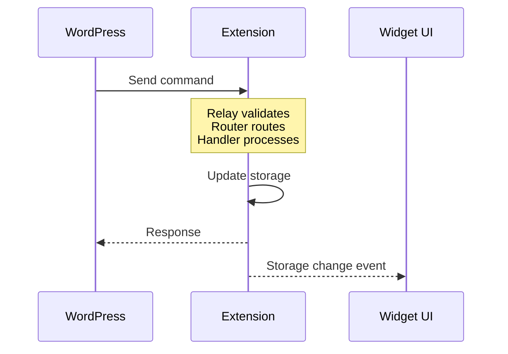

### 2.3 Widget Terminal Display

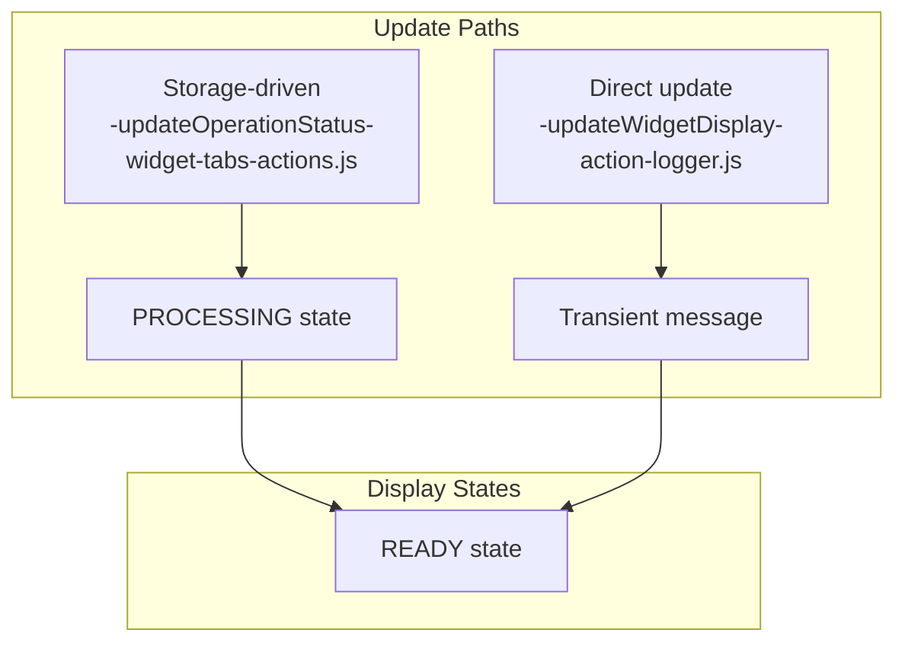

### 2.4 Storage Architecture

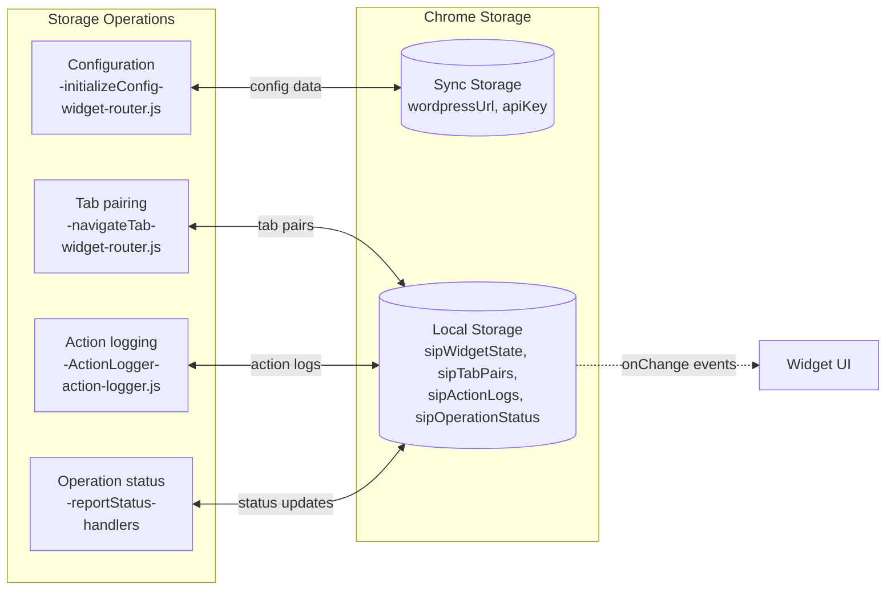

### 2.5 Tab Pairing System

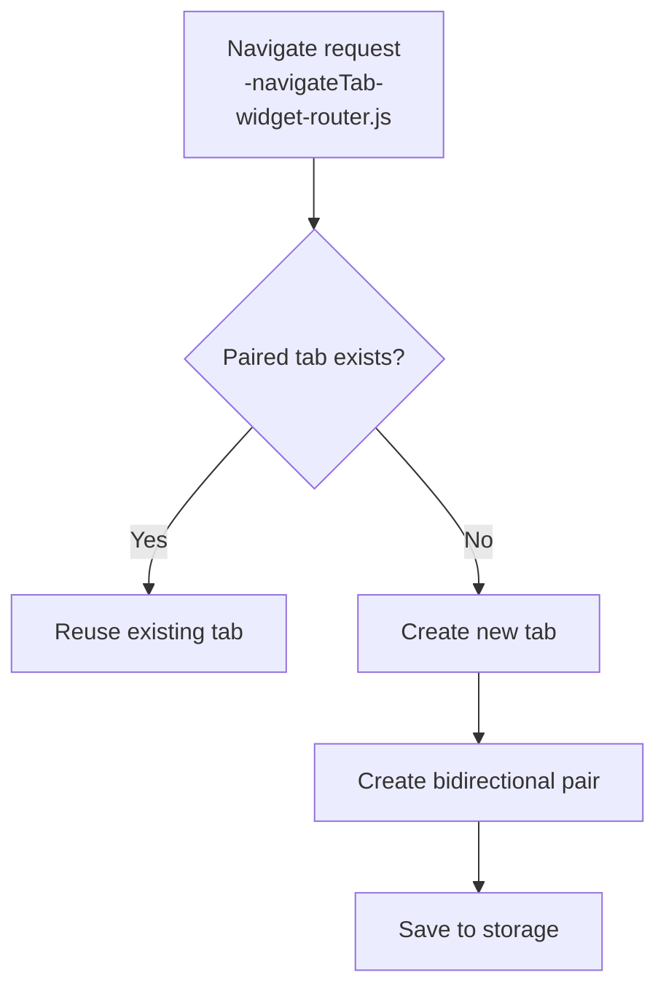

## 3. Architectural Rationale

### 3.1 Why This Architecture?

**Chrome Extension Constraints**:
1. **Security boundaries**: Web pages cannot access Chrome APIs
2. **Message passing rules**: Content scripts cannot intercept messages between other content scripts
3. **Context isolation**: Background scripts have no DOM access

**Core Design Principles**:

1. **Push-Driven Architecture**: Extension announces presence; WordPress never polls
   - Reduces message traffic, ensures accurate state
   - Fresh detection on every page load

2. **"Dumb Pipe" Principle**: Extension captures raw data; WordPress processes it
   - Keeps extension simple, business logic centralized
   - Handlers return raw API responses

3. **Central Router Pattern**: All messages flow through one hub
   - Chrome funnels all runtime messages to background script
   - Content scripts cannot intercept each other's messages

4. **Infrastructure-Level Logging**: Response logging at router, not handlers
   - Cross-cutting concern, guaranteed coverage
   - Router wraps sendResponse for logging before passing to handlers

5. **Fresh Detection Model**: Extension state never persisted between page loads
   - Eliminates false positives, ensures accurate detection
   - Extension must announce on every page load

6. **Dual Display Update Paths**: Two systems update the terminal display
   - Operation progress via hub messaging (handlers → storage → router → widget)
   - One-off messages via direct function calls (logger → updateWidgetDisplay)

### 3.2 Why Dual Display Update Paths?

The widget terminal display receives updates through two distinct paths because:

1. **Stateful Operations Need Hub Coordination**: Multi-step operations like mockup updates require centralized message routing
   - Handlers run in service worker context without DOM access
   - Router ensures messages only go to paired tabs that exist
   - Progress updates are coordinated through the hub architecture

2. **Instant Feedback Needs Direct Updates**: User interactions and transient events need immediate visual feedback
   - Navigation clicks should show instant response
   - Error messages need immediate display
   - API responses arrive outside operation context

3. **Operation Hierarchy Requires Context**: Visual structure helps users understand complex workflows
   - Operation start/end detection provides indentation
   - Parent operations group related child actions
   - Visual markers (🔻/🔺) clarify operation boundaries

### 3.3 Component Purposes

| Component | Purpose | Constraint/Requirement |
|-----------|---------|------------------------|
| **widget-relay.js** | Bridge between postMessage and chrome.runtime | WordPress can only use postMessage |
| **widget-router.js** | Central message hub and Chrome API executor | Chrome sends all messages to background |
| **background.js** | Module loader for service worker | Manifest V3 requires importScripts |
| **Handlers** | Separate business logic from infrastructure | Easier testing, single responsibility |
| **Action Scripts** | Detect page events and user interactions | Content scripts have limited API access |
| **widget-error.js** | Standardize error responses | Consistent error format for WordPress |
| **action-logger.js** | Structured action history + widget display updates | Log extension actions and update terminal for one-off messages |
| **widget-tabs-actions.js** | Widget UI and terminal display management | Shows operation progress and transient messages |
| **Tab Pairing** | Reuse existing tabs | Users expect "Go to Printify" to reuse tabs |
| **Response Logging** | Visible operation outcomes | Timeout/failures need to be traceable |

## 4. Implementation Guide

### 4.1 Architectural Constraints

**Router MUST be the background script**:
- Chrome doesn't allow content scripts to intercept runtime messages between other content scripts
- ALL chrome.runtime.sendMessage() calls go directly to the background script
- This is why we achieve "ALL messages flow through router"

**Extension announces presence on each page load**:
- Fresh detection eliminates false positives from uninstalled extensions
- WordPress receives accurate extension state for each session
- Enables reliable "Install Extension" button visibility

**WordPress manages mockup detection**:
- Checks filesystem for mockups when rendering blueprint rows
- Initiates fetch after confirming extension readiness
- Maintains filesystem as single source of truth

**Service Worker Context**:
- No DOM access in background scripts
- Must use `SiPWidget.ActionLogger` not `window.action` in handlers
- Check for window existence: `const isServiceWorker = typeof window === 'undefined'`

### 4.2 Message Formats

**External (WordPress ↔ Extension)**:
```javascript
{
    type: 'SIP_*',              // SIP_ prefix identifies our messages
    source: 'sip-printify-manager',
    requestId: 'unique_id',     // For async response correlation
    data: { /* command data */ }
}
```

**Internal (Extension components)**:
```javascript
{
    type: 'widget|printify|wordpress',  // Routes to handler
    action: 'specificAction',           // Handler method
    data: { /* action data */ }
}
```

**Operation Status (Storage)**:
```javascript
{
    operation: 'Updating Mockups',     // Operation name shown in header
    task: 'Opening mockup library',    // Current task shown in message area
    progress: 25,                      // Progress percentage (0-100)
    details: 'Multi-line\ndetails',    // Detailed info for completion
    cancellable: false,                // Future: show cancel button
    state: 'active' | 'idle' | 'paused' | 'resuming',
    message: 'Operation in progress',  // Alternative message field
    timestamp: Date.now()
}
```

### 4.3 Action Logging Shortcuts

**New Global Helper** (action-log-helper.js):
```javascript
// Available in all content scripts
action.info('User action', { details });      // USER_ACTION category
action.error('Something failed', { error });  // ERROR category  
action.warn('Warning message', { data });     // WARNING category
action.data('Data fetched', { results });     // DATA_FETCH category
action.api('API called', { endpoint });       // API_CALL category
action.navigation('Tab navigated', { url });  // NAVIGATION category

// Replaces verbose calls like:
if (window.SiPWidget && window.SiPWidget.ActionLogger) {
    window.SiPWidget.ActionLogger.log(
        window.SiPWidget.ActionLogger.CATEGORIES.ERROR,
        'Something failed',
        { error: details }
    );
}
```

**Important**: Use action logging instead of console.log() to keep all log messages together in the action history. Console.log should only be used for critical environment issues (like chrome.runtime availability).

**Service Worker Usage**: In handlers and background scripts, use `SiPWidget.ActionLogger.log()` directly as `window.action` is not available.

### 4.4 Terminal Display Implementation

**Display States**:
1. **READY**: Default state showing dots, one-off messages appear here
2. **PROCESSING**: Active operation with progress bar
3. **Transient Messages**: Brief messages that don't change state

**Color Coding Implementation**:
```javascript
// Status header colors (in updateOperationStatus)
let statusColor = '#cccccc'; // Default light grey for info
if (status === 'success') {
    statusColor = '#00ff00'; // Green for success
} else if (status === 'error' || status === 'failure') {
    statusColor = '#ff3333'; // Red for error
} else if (status === 'warning') {
    statusColor = '#ffaa00'; // Orange for warning
}

// Action message colors (in updateWidgetDisplay)
const isOnWordPress = window.location.href.includes('/wp-admin/');
const isOnPrintify = window.location.href.includes('printify.com');

let actionColor = '#00ff00'; // Default green
if (siteType === 'WordPress Site') {
    actionColor = isOnWordPress ? '#00ccff' : '#0088cc';
} else if (siteType === 'Printify Site') {
    actionColor = isOnPrintify ? '#00ff00' : '#00cc00';
}
```

**Message Dimming**:
```javascript
// Set timer to dim message after 5 seconds
messageDimTimer = setTimeout(() => {
    if (messageDiv && messageDiv.parentNode) {
        messageDiv.style.opacity = '0.5';
    }
}, 5000);
```

### 4.5 Mockup Scene Mapping

**Scene ID to Name Mapping** (mockup-update-handler.js):
```javascript
function extractSceneNames(selectedMockups) {
    const sceneIdToName = {
        '102752': 'Front',
        '102753': 'Right', 
        '102754': 'Back',
        '102755': 'Left'
    };
    
    const sceneNames = new Set();
    selectedMockups.forEach(mockup => {
        const parts = mockup.id.split('_');
        if (parts.length >= 3) {
            const sceneId = parts[2];
            const sceneName = sceneIdToName[sceneId];
            if (sceneName) {
                sceneNames.add(sceneName);
            }
        }
    });
    
    return Array.from(sceneNames);
}
```

**Mockup ID Format**: `mockup_{variant}_{scene}_{position}`
- Example: `mockup_19773102_102752_1`
- variant: 19773102 (product variant ID)
- scene: 102752 (maps to 'Front')
- position: 1 (position in scene)

**Hard-coded Mapping**: Printify's internal scene IDs are stable but not exposed in their UI. The mapping was determined by inspecting the mockup library page.

### 4.6 Chrome Architecture Constraints

**Service Worker (Background) Constraints**:
```javascript
// NO DOM access - this will fail in background.js:
// window.location  ❌
// document.querySelector  ❌

// Must check for window existence:
const isServiceWorker = typeof window === 'undefined';
const globalScope = isServiceWorker ? self : window;
```

**Content Script Constraints**:
```javascript
// Limited Chrome API access:
chrome.storage.local.get()  ✓  // Allowed
chrome.runtime.sendMessage()  ✓  // Allowed (except on Printify)
chrome.tabs.create()  ❌  // Not allowed

// Must request privileged operations from background:
chrome.runtime.sendMessage({
    type: 'widget',
    action: 'navigate',
    data: { url: 'https://...' }
});

// CRITICAL: On Printify.com, chrome.runtime is BLOCKED:
chrome.runtime.sendMessage()  ❌  // Blocked by Printify [NEEDS FIX]
chrome.runtime.onMessage  ❌  // Blocked by Printify [NEEDS FIX]
chrome.runtime.getURL()  ❌  // Blocked by Printify [NEEDS FIX]
chrome.runtime.getManifest()  ❌  // Blocked by Printify [NEEDS FIX]
```

**Message Channel Constraints**:
```javascript
// Content scripts CANNOT intercept other content script messages
// This will NEVER receive messages from other content scripts:
chrome.runtime.onMessage.addListener((message, sender) => {
    // Only receives from background script
});
```

### 4.7 Critical Patterns

**Async Message Handling**:
```javascript
// MUST return true to keep channel open
case 'asyncAction':
    (async () => {
        const result = await someAsyncOperation();
        sendResponse(result);
    })();
    return true; // CRITICAL!
```

**Router Context Usage**:
```javascript
// Handlers receive router context with Chrome API methods
const tab = await router.navigateTab(url);
const result = await router.queryTabs({url: '*://printify.com/*'});
```

**Progress Reporting Pattern**:
```javascript
// In handlers (service worker context)
async function reportStatus(operation, task, progress, details = '', cancellable = false) {
    const status = {
        operation: operation,    // e.g., "Updating Mockups"
        task: task,             // e.g., "Opening mockup library"
        progress: progress,     // 0-100
        details: details,       // Multi-line details for completion
        cancellable: cancellable,
        state: 'active',
        message: `${operation} in progress`,
        timestamp: Date.now()
    };
    
    await chrome.storage.local.set({ sipOperationStatus: status });
}

// After completion, return to idle
setTimeout(() => {
    chrome.storage.local.set({ 
        sipOperationStatus: { state: 'idle', timestamp: Date.now() } 
    });
}, 2000);
```

### 4.8 Adding New Features

1. **Define the trigger** (user action or page event)
2. **Create message in action script**: 
   ```javascript
   chrome.runtime.sendMessage({
       type: 'printify',
       action: 'newFeature',
       data: { /* ... */ }
   });
   ```
3. **Add handler method**:
   ```javascript
   case 'newFeature':
       // Implementation
       sendResponse({success: true});
       return true; // CRITICAL for async
   ```

## 5. Storage Schema

```javascript
// Chrome Storage Local - accessed via chrome.storage.local.get/set
{
    sipWidgetState: {           // Managed by saveWidgetState(), loadWidgetState()
        isExpanded: boolean,
        position: {x: number, y: number},
        currentOperation: {...}
    },
    sipTabPairs: {             // Managed by saveTabPairs(), loadTabPairs()
        "123": "456",          // createTabPair() sets bidirectional
        "456": "123"           // removeTabPair() deletes both
    },
    sipActionLogs: [{          // Managed by storeLog(), getActionLogs()
        timestamp: number,
        category: string,
        action: string,
        details: {...}
    }],
    sipOperationStatus: {      // Set by handlers and pause/resume operations
        // For active operations:
        operation: string,     // Operation name
        task: string,          // Current task
        progress: number,      // 0-100
        details: string,       // Completion details
        cancellable: boolean,  // Show cancel button
        state: 'active' | 'idle',
        message: string,       // Alternative message
        timestamp: number,
        
        // For paused operations:
        state: 'paused' | 'resuming',
        issue: string,
        instructions: string,
        showResumeButton: boolean
    },
    pendingResearch: {...},
    fetchStatus_*: {...}       // Dynamic keys for fetch operations
}

// Chrome Storage Sync - accessed via chrome.storage.sync.get/set
{
    wordpressUrl: string,      // Set by updateConfig()
    apiKey: string            // 32-character key, set by updateConfig()
}

// Runtime State (not persisted)
{
    tabPairs: Map,            // In-memory cache loaded by loadTabPairs()
    operationState: {         // Managed by pauseOperation()/resumeOperation()
        paused: boolean,
        pausedOperation: {...},
        pausedCallback: Function
    },
    handlers: Map,            // Message type to handler mapping
    config: {                 // Loaded from storage or config.json
        wordpressUrl: string,
        apiKey: string
    },
    messageDimTimer: number,  // Timer ID for dimming messages
    // ActionLogger state (in action-logger.js)
    operationStack: [],       // Tracks nested operations for hierarchy
    activeOperations: Map,    // Maps operation IDs to operation data
    sipActionTimings: Map     // Performance timing data
}
```

### 5.1 Extension Detection & Installation Flow

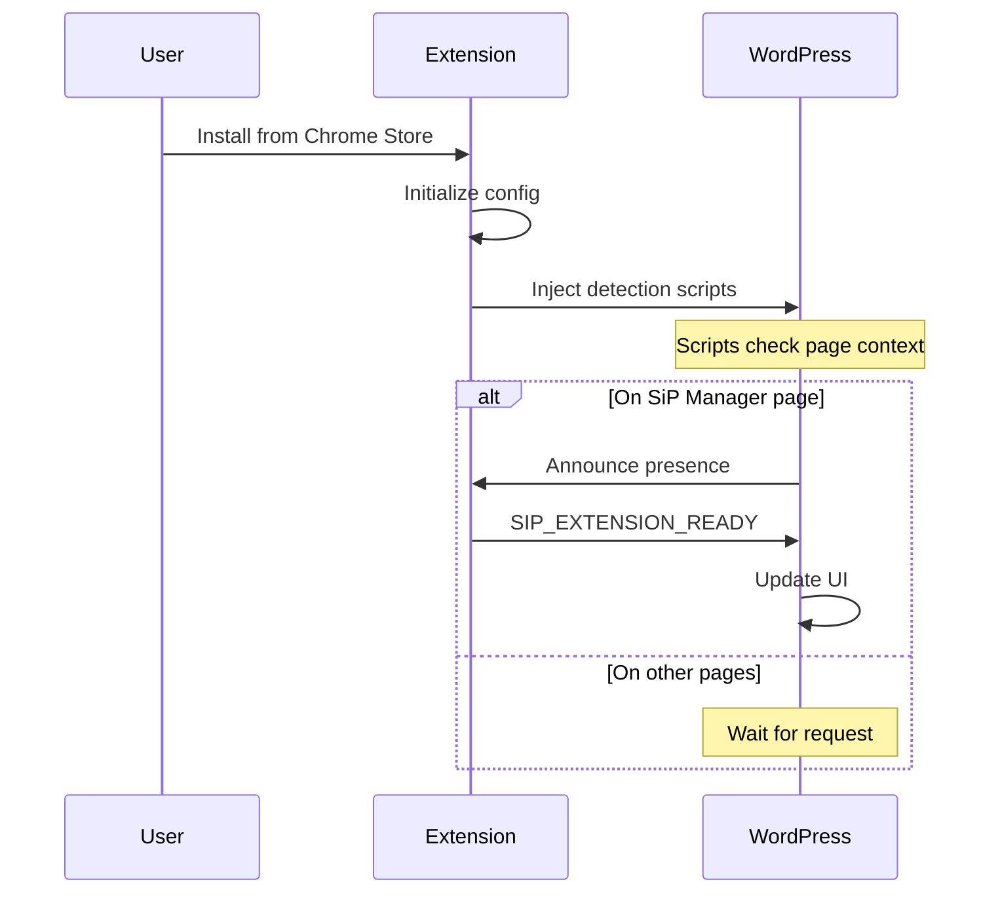

## 6. Message Type Reference

### WordPress Commands (SIP_*)
| Command | Purpose | Handler |
|---------|---------|---------|
| SIP_NAVIGATE | Navigate to URL | widget |
| SIP_SHOW_WIDGET | Show widget UI | widget |
| SIP_CHECK_STATUS | Check connection | widget |
| SIP_FETCH_MOCKUPS | Get mockup data | printify |
| SIP_UPDATE_PRODUCT_MOCKUPS | Update mockups (via URL params) | printify |

### Internal Actions
| Type | Actions | Purpose |
|------|---------|---------|
| widget | navigate, showWidget, updateState | UI operations |
| printify | fetchMockups, updateStatus | Printify operations |
| wordpress | (routes SIP_* to handlers) | Message translation |

### 6.1 Message Format Transformation

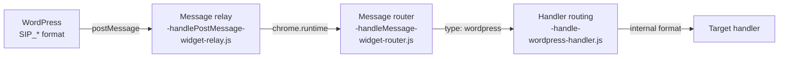

## 7. Key Features

### 7.1 Tab Pairing System
- Maintains bidirectional pairing between WordPress and Printify tabs
- Reuses existing tabs instead of creating new ones
- Automatically cleans up when tabs close

### 7.2 Widget Terminal Display

The widget features a retro terminal-style display that shows real-time action messages and operation progress.

**Three Display Modes**:
1. **READY State**
   - Shows "READY" at bottom
   - Shows "..." dots in center (or transient messages)
   - Header empty or shows previous status (dimmed)

2. **PROCESSING State**
   - Shows "PROCESSING..." at bottom
   - Shows progress bar with percentage
   - Shows current task message in action color
   - Shows operation name in header

3. **Transient Messages**
   - One-off messages that appear without changing state
   - Replace dots temporarily in READY state
   - Do NOT trigger progress bar or hide READY status

**Message Flow**:
- **Operation Progress**: Handlers → reportStatus() → storage → updateOperationStatus() → terminal
- **One-off Messages**: Actions → ActionLogger.log() → updateWidgetDisplay() → terminal

**Visual Design**:
- Black background (#000000)
- Green text (#00ff00) as default
- Monospace font (Consolas, Monaco, Courier New)
- Messages dim to 50% opacity after 5 seconds
- Progress bar fills from 0% to 100%

### 7.3 Pause/Resume Error Recovery

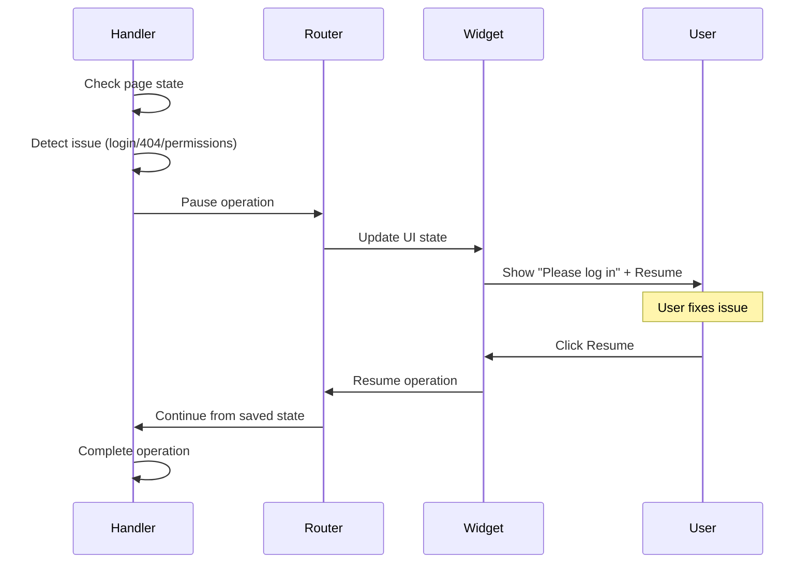

### 7.4 Response Logging Architecture

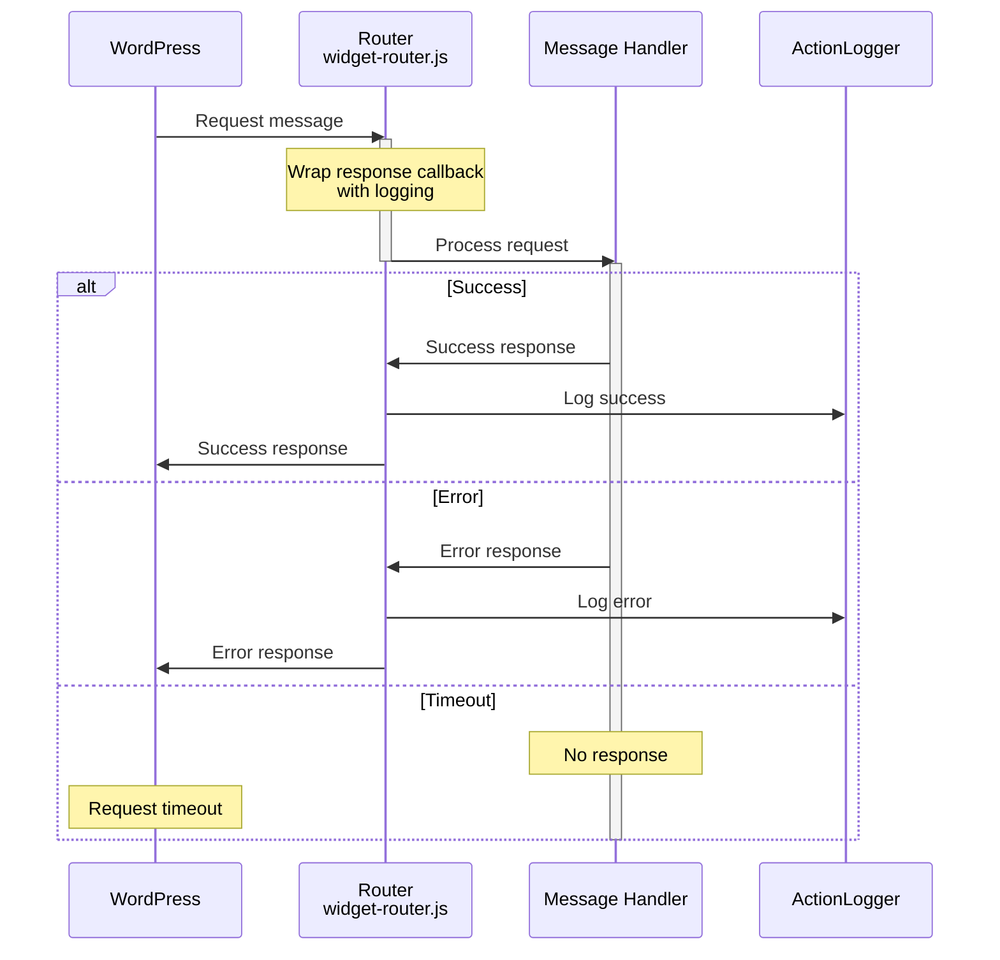

**Why Centralized Response Logging**: 
The router wraps all handler responses to guarantee logging because:
- **DRY principle**: Single implementation point for all handlers
- **Guaranteed coverage**: Handlers cannot bypass logging
- **Evolution support**: Response format changes happen in one place

### 7.5 Content Security Policy (CSP) Compliance

**Required Patterns**:
```javascript
// ❌ CSP Violation - Inline handler
element.innerHTML = '<button onclick="doThing()">Click</button>';

// ✓ CSP Compliant - Programmatic handler
const button = document.createElement('button');
button.textContent = 'Click';
button.addEventListener('click', doThing);
element.appendChild(button);

// ❌ CSP Violation - Inline styles
element.innerHTML = '<div style="color: red">Text</div>';

// ✓ CSP Compliant - CSS classes
element.innerHTML = '<div class="error-text">Text</div>';
```

**CSP Importance**: WordPress and many sites enforce CSP to prevent XSS. Extension must work everywhere.

### 7.6 Public API Naming Standards

**Critical Pattern**: All UI functions MUST be under `SiPWidget.UI` namespace

```javascript
// ❌ WRONG - Will cause ReferenceError
showWidget();  
toggleWidget();

// ✓ CORRECT - Explicit namespace
SiPWidget.UI.showWidget();
SiPWidget.UI.toggleWidget();

// Future commands follow same pattern:
SiPWidget.UI.refreshWidget();
SiPWidget.UI.resizeWidget();
```

**Namespace Reason**: Prevents race conditions where function is called before module loads. Makes API discoverable and extensible.

### 7.7 Scene-Based Mockup Selection Flow

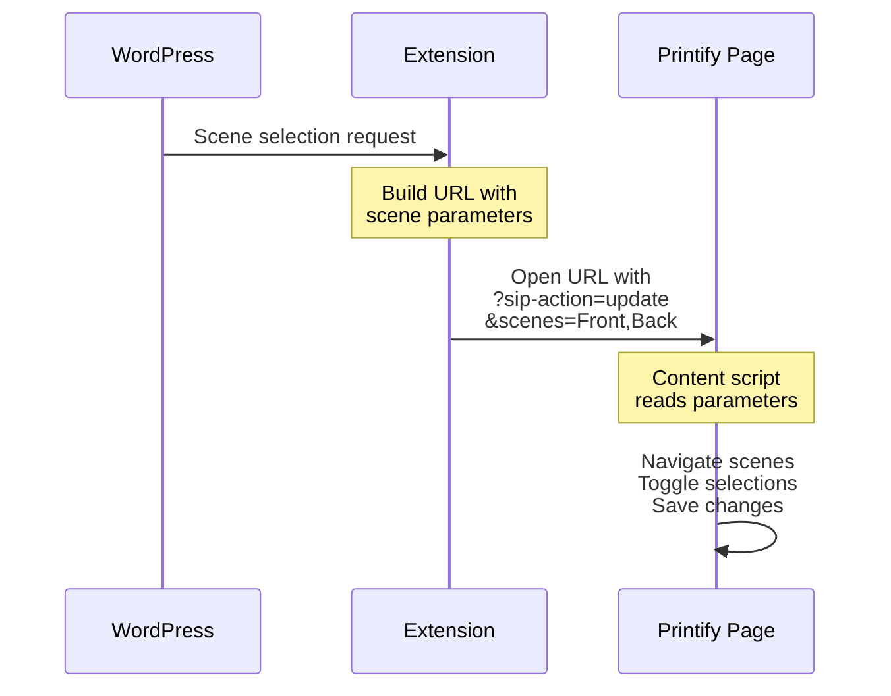

**Why URL Parameters**: 
Printify blocks `chrome.runtime` API in content scripts, preventing traditional extension messaging. URL parameters provide the only reliable way to pass data from the extension to Printify pages.

**Scene Selection Process**:
- **WordPress side**: Groups mockups by viewing angle (Front, Back, Left, Right)
- **Extension side**: Converts scene selections to URL parameters
- **Printify side**: Reads parameters and automates checkbox selection
- **Result**: Exact synchronization between WordPress and Printify selections

### 7.8 Scene-Based Selection Implementation

**Core Operations**:
- **Scene Detection**: Extract available scenes from carousel
- **Scene Navigation**: Navigate to each scene sequentially
- **Selection Sync**: Match selections to WordPress choices
- **State Management**: Ensure correct checkbox states

**Why Scene-Based Approach**:
Printify groups mockups by viewing angle (Front, Back, Left, Right). Users need to:
- **Select by scene**: Choose which angles to include in their product
- **Maintain consistency**: Ensure all products show same angles
- **Save bandwidth**: Only download needed mockup images

### 7.9 Error Capture System

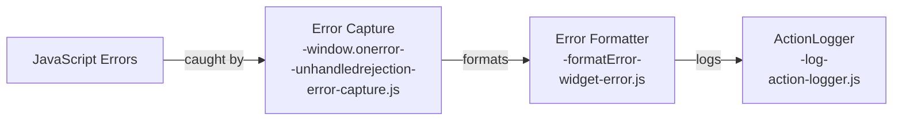

**Why Global Error Capture**:
Extension errors often occur in injected scripts where debugging is difficult. Global handlers ensure:
- **Complete coverage**: No errors go unnoticed
- **Context preservation**: Stack traces and source locations captured
- **Printify limitation**: Falls back to console when chrome.runtime blocked

### 7.10 Action Logging Helper

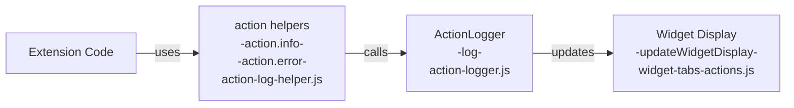

**Why Helper Functions**:
The ActionLogger API is verbose for frequent logging. Helper shortcuts provide:
- **Consistent categorization**: Each helper maps to specific category
- **Reduced boilerplate**: `action.info()` vs full ActionLogger call
- **Graceful fallback**: Works even when ActionLogger not yet loaded

### 7.11 Diagnostic and Monitoring Tools

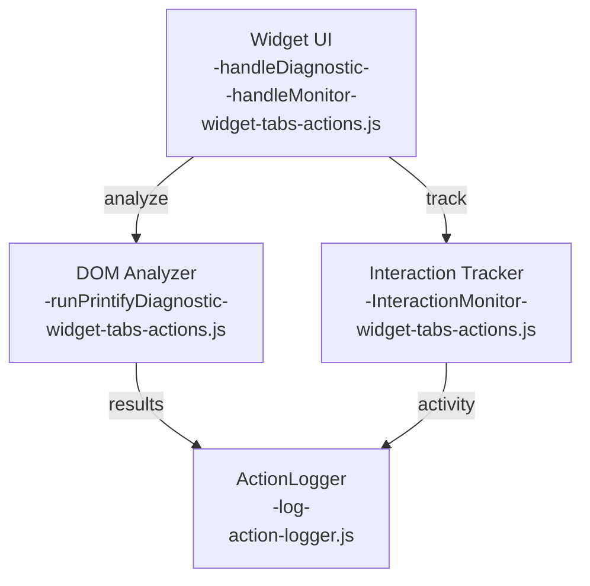

**Why Integrated Diagnostic Tools**:
Printify frequently changes DOM structure without notice, breaking extension functionality. These tools provide:
- **Real-time analysis**: Immediate DOM structure inspection without console access
- **API monitoring**: Capture undocumented API endpoints and payloads
- **Change detection**: Track when Printify updates break expected patterns

### 7.12 Action Log Visual Hierarchy

**Operation Markers**:
- `🔻` Start of operation (e.g., "Starting mockup update...")
- `│` Sub-operation within main operation
- `🔺` End of operation (e.g., "...completed successfully")

**Why Visual Hierarchy**: 
The extension performs multi-step operations that can fail at any point. Visual markers help users:
- **Track progress**: See where in a sequence an operation failed
- **Understand scope**: Distinguish main operations from sub-tasks
- **Debug efficiently**: Quickly identify incomplete operations

**Example Terminal Output**:
```
🔻 Starting mockup update for Winter Hoodie
│  Created new printify tab: printify.com/app/products/123
│  Mockup automation started for Winter Hoodie (4 mockups to sync)
│  Synchronizing mockups: Adding 2, removing 1
│  Saving mockup changes
🔺 Mockup update completed successfully

🔻 Received: SIP_FETCH_MOCKUPS
│  Opening product editor for fetch operation
│  Reused printify tab, navigated to: printify.com/app/editor
│  Blueprint: 145, Status: active, Provider: Monster Digital
🔺 Fetch Complete - Mockup data retrieved successfully
```

**Message Enhancement Examples**:
```javascript
// Navigation messages now include specific URLs
"Switched to existing printify tab: printify.com/app/products/123"
"Created new wordpress tab: example.com/wp-admin/admin.php"

// Connection test messages include target
"Connection verified with https://example.com/wp-json"
"Connection failed to https://example.com: Invalid API key"

// Mockup operations include product names and counts
"Mockup update completed for Winter Hoodie (4 mockups)"
"Synchronizing mockups for Summer Tee: Adding 3, removing 2"
```

## 8. Development Quick Reference

### File Structure

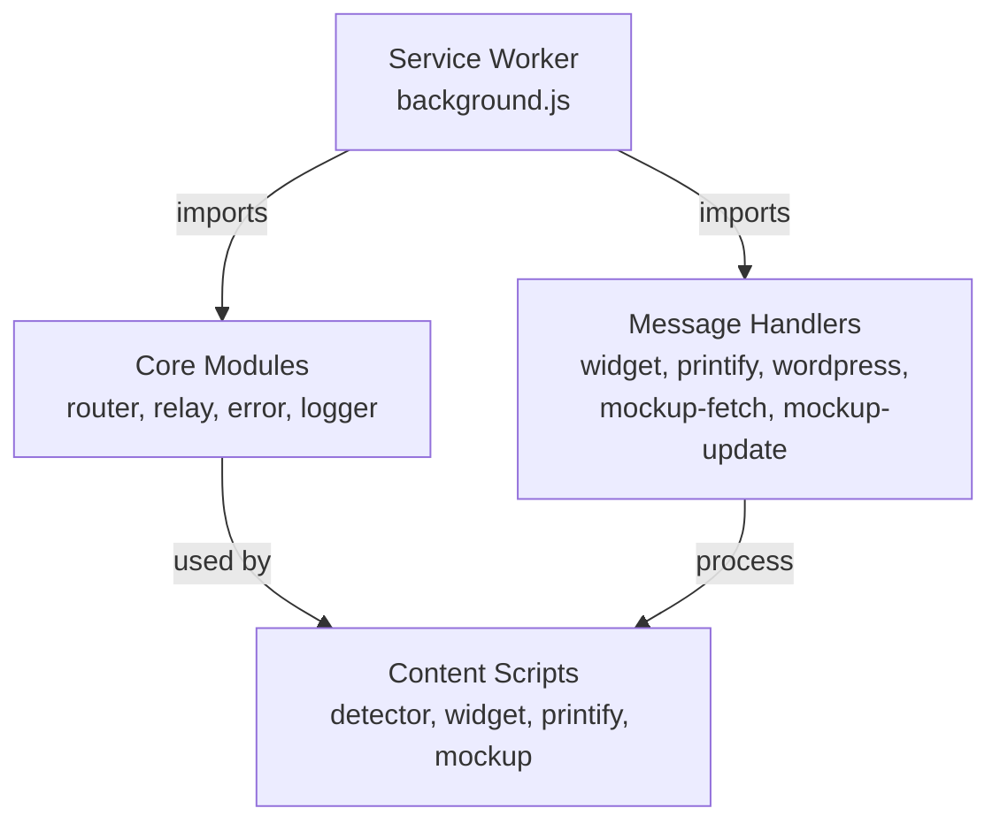

### Testing Checklist
- [ ] Manifest validation: `node validate-manifest.js`
- [ ] Extension health: chrome://extensions shows no errors
- [ ] Service worker: All scripts loaded successfully
- [ ] Message routing: Messages reach correct handlers
- [ ] Security: Origin validation works correctly
- [ ] Widget display: Appears in viewport on all sites
- [ ] Tab pairing: WordPress and Printify tabs linked
- [ ] Extension detection: WordPress recognizes extension

### Terminal Display Testing
- [ ] States: READY (dots) → PROCESSING (progress) → READY
- [ ] Message persistence: Visible until replaced, dims after 5s
- [ ] Color coding: WordPress (blue), Printify (green), Status-based headers
- [ ] Progress tracking: 0% to 100% with operation details

## 9. Key Implementation Notes

### Two Separate Progress Systems
- **WordPress Plugin**: Tracks batch progress across multiple operations
- **Extension Widget**: Tracks individual operation progress
- These work together but are completely distinct

### Message Persistence
- Messages stay visible (dimmed) until replaced
- No setTimeout to hide messages - only to dim them
- User can always see the last action that occurred

### State Management
- Only handlers should set `sipOperationStatus`
- One-off messages should never change terminal state
- State changes only through storage updates, not direct manipulation

### Service Worker Safe Logging
- Use `SiPWidget.ActionLogger.log()` in handlers
- Use `window.action` helpers in content scripts
- Check for window existence before using DOM features