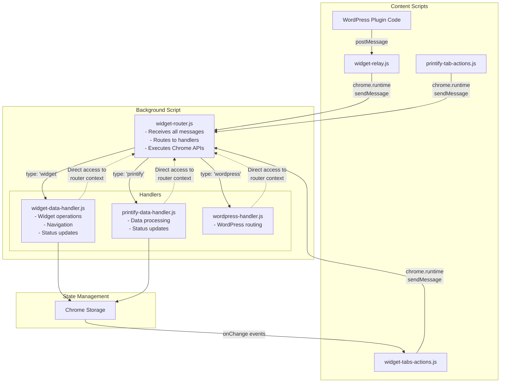
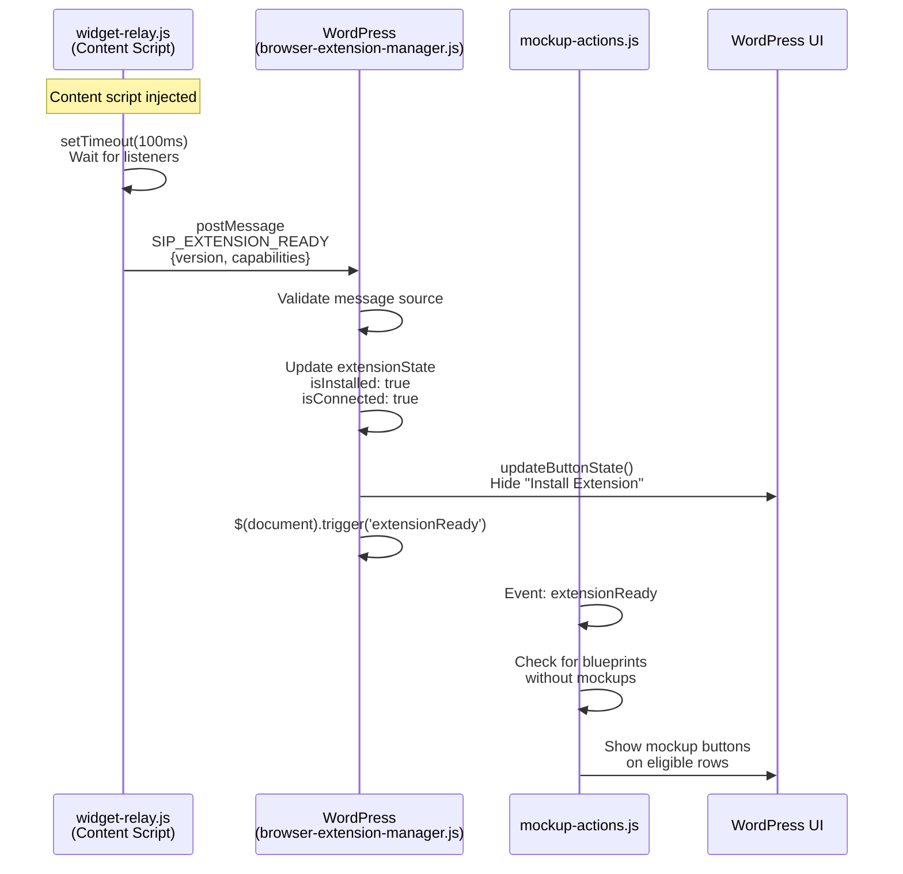
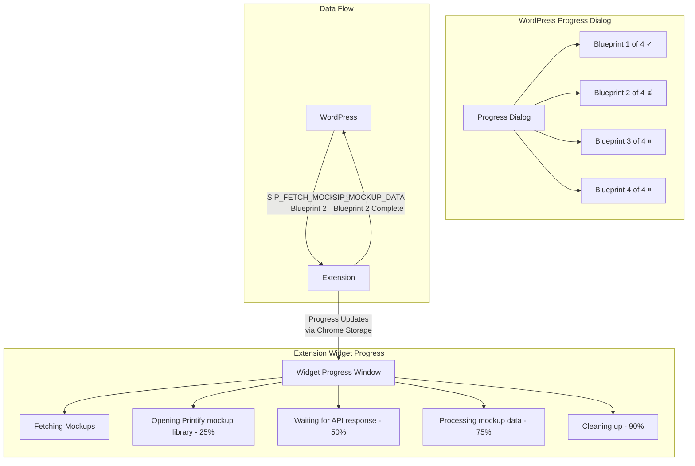
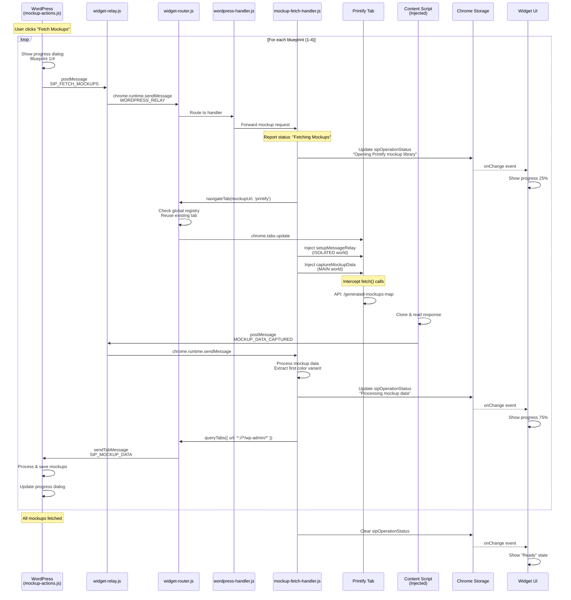

# SiP Printify Manager Browser Extension

**Version:** 4.3.0  
**Last Updated:** January 21, 2025

<!-- DOCUMENTATION RULES:
1. ARCHITECTURAL WHY - Document WHY each component exists (constraints/requirements that necessitate it)
2. NO HISTORY - Current state only, not how we got here  
3. NO DUPLICATION - Each fact appears exactly once
4. EXAMPLES OVER EXPLANATIONS - Show, don't tell
5. UPDATE THE RIGHT SECTION - Check if info already exists before adding

ARCHITECTURAL WHY GUIDELINE:
For each component, briefly explain the constraint or requirement that makes it necessary.
Focus on: Chrome API limitations, message passing rules, code organization needs.
Keep it to 1-2 sentences per component.
-->

## 1. Overview

The SiP Printify Manager browser extension bridges WordPress and Printify, enabling enhanced integration and functionality. It provides a floating widget interface for real-time operations and data synchronization between the two platforms.

### 1.1 Core Principles

**Push-Driven Communication**: The extension uses a push-driven architecture where:
- The extension announces its presence when ready (not polled by WordPress)
- State changes are pushed from extension to WordPress as they occur
- No periodic status checks or ping/pong patterns
- Event-driven updates ensure real-time synchronization

This approach reduces unnecessary message traffic and provides more responsive user experience.

## 2. Architecture Rationale

### 2.1 Why This Architecture?

**Central Router Pattern**: All messages flow through widget-router.js because Chrome extensions don't allow content scripts to intercept runtime messages from other content scripts - they go directly to the background script.

**Separate Action/Handler Scripts**: Content scripts (actions) have limited Chrome API access, while background scripts (handlers) have full access. This separation enforces proper security boundaries.

**Handler Context Pattern**: Instead of message passing between router and handlers, handlers receive a router context object. This eliminates an unnecessary message hop and provides direct access to Chrome APIs.

### 2.2 The Central Router Pattern

**ALL messages in the extension flow through widget-router.js - NO EXCEPTIONS**

The router is the background script and the single message hub that:
- Receives ALL incoming messages (chrome.runtime messages from content scripts and relayed postMessages)
- Routes to appropriate handlers based on message type
- Executes Chrome API commands directly (no separate widget-main.js)
- Returns responses to the originator

### 2.3 Message Flow Diagram


The State Management flow is shown in the Mermaid diagram above, where handlers update Chrome Storage, which triggers onChange events that update the widget UI in widget-tabs-actions.js.

### 2.4 Message Formats

**IMPORTANT**: The extension uses TWO distinct message formats for different communication contexts:

#### External Messages (WordPress ↔ Extension via postMessage)

Used for communication between web pages and the extension. These messages cross the browser security boundary.

**Format**:
```javascript
{
    type: 'SIP_COMMAND_NAME',     // Always prefixed with 'SIP_' for identification
    source: 'sip-printify-manager', // Identifies sender
    requestId: 'unique-id',        // Optional: for response matching
    // Command-specific data
}
```

**Examples**:
- WordPress → Extension: `type: 'SIP_CHECK_STATUS'`, `type: 'SIP_SHOW_WIDGET'`
- Extension → WordPress: `type: 'SIP_EXTENSION_READY'`, `type: 'SIP_EXTENSION_RESPONSE'`

**Why this format**: The 'SIP_' prefix identifies our messages among all postMessages on the page.

#### Internal Messages (Within Extension via chrome.runtime)

Used for communication between extension components (content scripts ↔ background script).

**Format**:
```javascript
{
    type: 'widget' | 'printify' | 'wordpress',  // Determines which handler
    action: 'specificAction',                   // The operation to perform
    data: {                                     // Operation-specific data
        // ...
    }
}
```

**Examples**:
- `{ type: 'widget', action: 'navigateToTab', data: { url: '...' } }`
- `{ type: 'printify', action: 'updateStatus', data: { productId: '...' } }`

**Why this format**: The `type` field routes to specific handlers, `action` specifies the operation.

#### Message Format Conversion

The widget-relay.js converts external messages to internal format:

```
WordPress sends:          { type: 'SIP_SHOW_WIDGET', source: 'sip-printify-manager' }
                            ↓
Relay converts to:        { type: 'WORDPRESS_RELAY', data: { 
                             type: 'wordpress', 
                             action: 'SIP_SHOW_WIDGET',  // Original type becomes action
                             data: {...} 
                          }}
                            ↓
Router unwraps & routes:  { type: 'wordpress', action: 'SIP_SHOW_WIDGET', data: {...} }
```

**Key Point**: Never mix formats. External messages MUST use 'SIP_' prefix. Internal messages MUST use handler/action pattern.

#### Handler Chrome API Requests
Handlers can request Chrome API execution by calling router methods directly:
```javascript
// In handler:
const result = await router.createTab({ url: 'https://example.com' });
const tabs = await router.queryTabs({ url: '*://printify.com/*' });
```

#### Response Format
```javascript
// Success
{
    success: true,
    data: object,
    message: string  // Optional
}

// Error
{
    success: false,
    error: 'Error message',
    code: 'ERROR_CODE',
    timestamp: Date.now()
}
```

**Note**: Error response formatting is centralized in `widget-error.js`. Content scripts use `SiPWidget.Error` methods. The background script (router and handlers) returns plain error objects with `success: false`.

## 3. Component Responsibilities

### 3.1 File Structure
```
browser-extension/
├── manifest.json               # Extension configuration
├── background.js               # Service worker loader - imports all modules
│   Why: Manifest V3 service workers require importScripts() to load modules
├── core-scripts/
│   ├── widget-router.js        # Background script - Central message router & Chrome API executor
│   ├── widget-relay.js         # Content script - Relays WordPress postMessages to router
│   ├── widget-debug.js         # Debug utilities
│   ├── widget-error.js         # Error response formatting
│   └── widget-styles.css       # Widget styling
├── action-scripts/
│   ├── widget-tabs-actions.js          # Widget UI creation and button handling
│   ├── printify-tab-actions.js         # Printify page monitoring and scraping
│   └── printify-api-interceptor-actions.js # API discovery monitor
├── handler-scripts/
│   ├── widget-data-handler.js          # Widget operation logic
│   ├── printify-data-handler.js        # Printify data processing
│   ├── wordpress-handler.js            # WordPress message routing
│   ├── mockup-fetch-handler.js         # Mockup fetching operations
│   └── printify-api-interceptor-handler.js # API discovery processing
├── assets/                     # Images and static files
└── validate-manifest.js        # Manifest validation tool
```

**Manifest Configuration**:
```json
{
    "background": {
        "service_worker": "background.js"
    },
    "content_scripts": [
        {
            "matches": ["https://printify.com/*"],
            "js": [
                "core-scripts/widget-debug.js",
                "core-scripts/widget-error.js",
                "action-scripts/printify-tab-actions.js",
                "action-scripts/printify-api-interceptor-actions.js",
                "action-scripts/widget-tabs-actions.js"
            ]
        },
        {
            "matches": ["*://*/wp-admin/*"],
            "js": [
                "core-scripts/widget-debug.js",
                "core-scripts/widget-error.js",
                "core-scripts/widget-relay.js",
                "action-scripts/widget-tabs-actions.js"
            ]
        }
    ]
}
```

**Naming Standards**:

**Action Scripts** (content scripts that detect events and send messages):
- Must end with `-actions.js` suffix
- Examples: `widget-tabs-actions.js`, `printify-tab-actions.js`, `printify-api-interceptor-actions.js`
- Located in `action-scripts/` directory

**Handler Scripts** (background scripts that process messages):
- Must end with `-handler.js` suffix (always singular)
- Examples: `widget-data-handler.js`, `printify-data-handler.js`, `printify-api-interceptor-handler.js`
- Located in `handler-scripts/` directory

**Paired Features**: Complex features should have matching action/handler pairs:
- `printify-api-interceptor-actions.js` → `printify-api-interceptor-handler.js`
- This makes it clear which handler processes which action script's events

### 3.2 Core Scripts

#### widget-router.js (Background Script)
**Why it exists**: Chrome extensions require a background script to access privileged APIs (tabs, cross-origin requests). Making the router the background script ensures ALL messages flow through one central point as documented.

- Receives ALL chrome.runtime.sendMessage calls from content scripts
- Routes messages to handlers based on 'type' field  
- Executes Chrome API commands directly (no separate widget-main.js)
- Provides router context to handlers with Chrome API methods
- Sends responses back to message originators
- Forwards messages to content scripts via chrome.tabs.sendMessage when needed

#### widget-relay.js (Content Script - WordPress pages only)
**Why it exists**: WordPress can only use window.postMessage() which content scripts can receive, but the router (background script) cannot. This relay bridges that gap.

- Listens for postMessage events from WordPress
- Validates message source and format
- Relays WordPress messages to router via chrome.runtime.sendMessage
- Returns responses back to WordPress via postMessage

### 3.3 Action Scripts

#### widget-tabs-actions.js
**Why it exists**: The widget UI needs to be injected into specific pages (SiP Printify Manager and Printify) to provide consistent user access. Separating UI from page-specific logic keeps code organized.

- Creates and manages the floating widget UI
- **Only shows on**: SiP Printify Manager pages (`page=sip-printify-manager`) and Printify.com
- Handles widget button clicks (navigation, status checks, etc.)
- Updates widget display based on Chrome storage changes
- Sends user-initiated actions to router
- Does NOT handle Printify page-specific actions

#### printify-tab-actions.js
**Why it exists**: Printify pages need specific DOM monitoring and scraping logic that would bloat the general widget code. This separation keeps Printify-specific logic isolated.

- Monitors Printify pages for DOM changes
- Detects page state and product information
- Detects inventory changes (future)
- Sends detected events to router
- Does NOT handle widget UI

#### printify-api-interceptor-actions.js
**Why it exists**: API interception is a complex feature requiring significant code for request monitoring and pattern analysis. It warrants its own dedicated file for maintainability.

- Intercepts Printify API calls
- Captures API patterns and responses
- Sends captured data to router for processing

### 3.4 Handler Scripts

#### widget-data-handler.js
**Why it exists**: Widget operations (navigation, config, UI state) are distinct from data operations and need their own business logic layer in the background context.

Processes widget-related operations:
- Navigation between tabs
- Widget state management
- Configuration updates
- **Required actions**: `showWidget`, `toggleWidget`, `navigate`, `updateState`, `getConfig`, `updateConfig`, `testConnection`, `checkPluginStatus`

#### mockup-fetch-handler.js
**Why it exists**: Mockup fetching is a complex multi-step operation requiring tab management, API interception, data processing, and WordPress communication. This dedicated handler isolates all mockup-related logic and provides clean separation from other extension functionality.

Processes mockup fetching operations:
- Navigates to Printify mockup library pages
- Intercepts `generated-mockups-map` API responses  
- Extracts blueprint-agnostic mockup data (one color variant only)
- Sends processed data back to WordPress
- **Required actions**: `fetchMockups`

#### printify-data-handler.js
**Why it exists**: Complex multi-step operations like api interception need coordination logic that can access Chrome APIs. Separating this from UI logic enables cleaner testing and maintenance.

Processes Printify data operations:
- Data validation and formatting
- WordPress API communication coordination
- Status update management
- Routes mockup requests to mockup-fetch-handler

#### wordpress-handler.js
**Why it exists**: WordPress sends differently formatted messages (SIP_FETCH_MOCKUPS vs fetchMockups). This handler translates WordPress commands to the extension's internal message format.

Routes WordPress postMessage commands to appropriate handlers:
- Converts WordPress message formats to extension formats
- Routes to widget or printify handlers based on command
- **Supported commands**: `SIP_FETCH_MOCKUPS`, `SIP_NAVIGATE`, `SIP_SHOW_WIDGET`, `SIP_CHECK_STATUS`

#### printify-api-interceptor-handler.js
**Why it exists**: Captured API data needs processing and storage logic separate from the capture mechanism. This separation allows the action script to focus on interception while the handler manages data.

Processes captured API data:
- Analyzes API patterns
- Stores discovered endpoints
- Manages API knowledge base

## 4. Core Systems

### 4.1 Tab Management Architecture

#### Global Tab Registry System

The extension maintains a global registry of WordPress and Printify tabs, ensuring only one primary tab of each type exists at any time.

**Design Principles**:
1. **Single Primary Tab**: Only one WordPress tab and one Printify tab are considered "primary"
2. **Tab Reuse**: Operations always reuse existing tabs rather than creating duplicates
3. **Graceful Orphan Handling**: Tabs aren't auto-closed but are reused when needed
4. **Secondary Tab Support**: Additional tabs become "observers" that can redirect to primary tabs

**Implementation Structure**:
```javascript
// Global tab registry in router
const globalTabs = {
    wordpress: {
        primary: { tabId: 123, url: '...', windowId: 1 },
        secondary: [{ tabId: 456, url: '...', windowId: 2 }]
    },
    printify: {
        primary: { tabId: 789, url: '...', windowId: 1 },
        secondary: []
    }
};
```

**Tab Navigation Logic**:
```javascript
async function navigateToPrintify(url) {
    // 1. Check for existing Printify tab (primary or orphaned)
    const existing = await findPrintifyTab();
    
    if (existing) {
        // 2. Reuse existing tab
        await chrome.tabs.update(existing.tabId, { url: url, active: true });
        return { success: true, data: { tabId: existing.tabId, action: 'reused' } };
    }
    
    // 3. Create new tab only if none exists
    const newTab = await chrome.tabs.create({ url: url });
    registerPrimaryTab('printify', newTab);
    return { success: true, data: { tabId: newTab.id, action: 'created' } };
}
```

**Tab Lifecycle Events**:
1. **Tab Creation**: First tab of each type becomes primary
2. **Tab Closure**: Primary status transfers to next available tab
3. **Orphan Detection**: Printify tabs without WordPress counterpart are marked as reusable
4. **Secondary Tab Actions**: Can optionally redirect to primary tab

**Why Keep Tabs Open?**
- **Performance**: Tab reuse eliminates page load time for sequential operations
- **User Navigation**: The "Go to Printify" button provides instant switching between WordPress and Printify
- **Active Process Support**: Open tabs are ready for immediate use by subsequent operations
- **User Control**: Users can manually close tabs when done; the extension respects their choices

### 4.2 Router Method Return Standardization

All router methods follow a consistent return pattern aligned with the documented response format.

#### Standard Return Format
```javascript
// Success Response
{
    success: true,
    data: {
        // Method-specific data
    },
    message?: string  // Optional human-readable message
}

// Error Response
{
    success: false,
    error: string,    // Error message
    code: string,     // Error code for programmatic handling
    data?: any        // Optional partial data
}
```

#### Router Method Returns

**Tab Management Methods**:
```javascript
// Create a new tab
createTab(params) → {
    success: true,
    data: {
        tabId: number,
        tab: Chrome.Tab,
        isNew: true
    }
}

// Query tabs
queryTabs(params) → {
    success: true,
    data: {
        tabs: Chrome.Tab[],
        primaryTabId?: number  // If a primary tab exists in results
    }
}

// Send message to tab
sendTabMessage(tabId, message) → {
    success: true,
    data: {
        response: any,  // Response from content script
        tabId: number
    }
}

// Update tab properties
updateTab(tabId, props) → {
    success: true,
    data: {
        tab: Chrome.Tab,
        tabId: number,
        updated: string[]  // List of updated properties
    }
}

// Remove tab
removeTab(tabId) → {
    success: true,
    data: {
        tabId: number,
        wasPrimary: boolean
    }
}

// Get current active tab
getCurrentTab() → {
    success: true,
    data: {
        tab: Chrome.Tab,
        isPrimary: boolean,
        tabType: 'wordpress' | 'printify' | 'other'
    }
}

// Navigate with smart tab management
navigateTab(url, tabType) → {
    success: true,
    data: {
        tabId: number,
        action: 'created' | 'reused' | 'navigated',
        wasPrimary: boolean
    }
}
```

**API Methods**:
```javascript
// Call WordPress API
callWordPressAPI(endpoint, method, data) → {
    success: true,
    data: any  // API response data
}

// Test connection
testWordPressConnection() → {
    success: true,
    data: {
        connected: boolean,
        apiVersion: string,
        pluginActive: boolean
    }
}

// Check plugin status
checkWordPressPluginStatus() → {
    success: true,
    data: {
        pluginActive: boolean,
        pluginVersion?: string,
        pluginName?: string
    }
}
```

**Configuration Methods**:
```javascript
// Get configuration
getConfig() → {
    success: true,
    data: {
        wordpressUrl?: string,
        apiKey?: string,
        configured: boolean
    }
}

// Update configuration
updateConfig(newConfig) → {
    success: true,
    data: {
        updated: string[],  // List of updated config keys
        configured: boolean
    }
}
```

#### Migration Guide

Handlers expecting old return formats should be updated:

```javascript
// Old pattern (inconsistent)
const tab = await router.getCurrentTab();
if (tab) { /* ... */ }

// New pattern (consistent)
const result = await router.getCurrentTab();
if (result.success) {
    const tab = result.data.tab;
    /* ... */
} else {
    console.error(`Error ${result.code}: ${result.error}`);
}
```

This standardization eliminates the need for defensive programming and provides predictable, consistent interfaces throughout the extension.

## 5. Support Systems

### 5.1 Error Handling System

The extension uses a centralized error handling system defined in `widget-error.js` that provides consistent error formatting across all components.

#### Error Recovery Strategy

The extension implements a simple, robust error recovery approach:

1. **No Automatic Retries**: Failed operations are reported back to the caller for decision-making
2. **Clear Error Communication**: All errors include actionable information
3. **State Cleanup**: Failed operations always clean up their state (tabs, listeners, storage)
4. **User Control**: WordPress decides whether to retry, skip, or abort

**Example Implementation**:
```javascript
// In mockup-fetch-handler.js
catch (error) {
    // 1. Log for debugging
    debug.error('Failed to fetch mockups:', error);
    
    // 2. Report user-friendly status
    await reportStatus('Fetch Failed', error.message, 0, 'Operation failed', false);
    
    // 3. Clean up operation state
    await chrome.storage.local.set({ 
        sipOperationStatus: { state: 'idle', timestamp: Date.now() } 
    });
    
    // 4. Return structured error to WordPress
    sendResponse({
        success: false,
        error: error.message || 'Failed to fetch mockups',
        code: 'FETCH_ERROR',
        blueprint_id: blueprint_id  // Include context for retry decisions
    });
}
```

This approach keeps error handling simple while providing WordPress with the information needed to implement its own retry logic.

#### Error Response Structure
```javascript
{
    success: false,
    error: string,        // Human-readable error message
    code: string,         // Machine-readable error code
    timestamp: number,    // Unix timestamp
    context?: {           // Optional error context
        component: string,
        action: string,
        data?: any
    }
}
```

#### Standard Error Codes

**Configuration Errors**:
- `NOT_CONFIGURED`: Extension not configured with WordPress URL/API key
- `INVALID_CONFIG`: Configuration values are invalid
- `CONFIG_LOAD_FAILED`: Failed to load configuration file

**Tab Errors**:
- `TAB_NOT_FOUND`: Requested tab does not exist
- `TAB_ACCESS_DENIED`: Cannot access tab (permissions issue)
- `TAB_CREATION_FAILED`: Failed to create new tab
- `TAB_UPDATE_FAILED`: Failed to update tab properties

**API Errors**:
- `CONNECTION_ERROR`: Failed to connect to WordPress API
- `AUTH_ERROR`: Invalid API key or authentication failed
- `PLUGIN_DEACTIVATED`: WordPress plugin is not active
- `API_TIMEOUT`: API request timed out
- `INVALID_RESPONSE`: API returned invalid data

**Handler Errors**:
- `UNKNOWN_ACTION`: Handler received unknown action
- `INVALID_PARAMS`: Missing or invalid parameters
- `HANDLER_ERROR`: General handler processing error

**General Errors**:
- `UNKNOWN_ERROR`: Unexpected error occurred
- `CHROME_API_ERROR`: Chrome API call failed
- `PERMISSION_DENIED`: Extension lacks required permissions

#### Error Handling in Content Scripts

Content scripts use the `SiPWidget.Error` module:

```javascript
// Creating formatted errors
const error = SiPWidget.Error.create('TAB_NOT_FOUND', 'Tab no longer exists', {
    component: 'widget-tabs-actions',
    action: 'navigateToTab',
    data: { tabId: 123 }
});

// Wrapping Chrome API errors
try {
    await chrome.runtime.sendMessage(message);
} catch (chromeError) {
    const error = SiPWidget.Error.wrap(chromeError, 'CHROME_API_ERROR', {
        component: 'widget-tabs-actions',
        action: 'sendMessage'
    });
    console.error('Chrome API Error:', error);
}
```

#### Error Handling in Background Scripts

Background scripts (router and handlers) return plain error objects:

```javascript
// In handler
if (!config.configured) {
    sendResponse({
        success: false,
        error: 'Extension not configured',
        code: 'NOT_CONFIGURED',
        timestamp: Date.now()
    });
    return;
}

// In router
try {
    const tab = await chrome.tabs.create({ url });
    return { success: true, data: { tab } };
} catch (error) {
    return {
        success: false,
        error: error.message || 'Failed to create tab',
        code: 'TAB_CREATION_FAILED',
        timestamp: Date.now()
    };
}
```

### 5.2 Debug System

The extension includes a comprehensive debug system in `widget-debug.js` that provides consistent logging across all components.

#### Debug Configuration

Enable debug mode via Chrome storage:
```javascript
chrome.storage.local.set({ sip_printify_debug: true });
```

#### Debug Levels

```javascript
const DEBUG_LEVELS = {
    ERROR: 0,    // Always shown
    WARN: 1,     // Warnings and above
    INFO: 2,     // General information
    DEBUG: 3,    // Detailed debug info
    TRACE: 4     // Very detailed trace info
};
```

#### Debug Usage in Content Scripts

```javascript
const debug = window.widgetDebug || { log: () => {}, error: () => {}, warn: () => {} };

// Basic logging
debug.log('[Widget UI] Initializing widget');

// Error logging with context
debug.error('[Widget UI] Failed to create widget', {
    error: error.message,
    context: { position, state }
});

// Conditional debug logging
debug.log('[Widget UI] Button clicked', { action, data }, DEBUG_LEVELS.DEBUG);
```

#### Debug Usage in Background Scripts

```javascript
// Service workers use console directly with prefixes
const debug = {
    log: (...args) => console.log('[Router]', ...args),
    error: (...args) => console.error('[Router]', ...args),
    warn: (...args) => console.warn('[Router]', ...args),
    trace: (...args) => console.log('[Router:TRACE]', ...args)
};

// Usage
debug.log('Message received:', message.type, message.action);
debug.error('Handler error:', error);
```

#### Debug Output Format

```
[Component Name] Message text { optional: 'data', context: 'values' }
[Widget UI] Widget state updated { isExpanded: true, position: { x: 100, y: 20 } }
[Router] Routing message to handler { type: 'widget', action: 'showWidget' }
```

#### Performance Monitoring

The debug system includes performance monitoring:

```javascript
// Start timing
const timer = debug.startTimer('fetchMockups');

// ... operation code ...

// End timing (automatically logs duration)
debug.endTimer('fetchMockups'); // Logs: "[Performance] fetchMockups took 1234ms"
```

### 5.3 Operation Status System

The extension tracks operation status to provide real-time feedback to users about ongoing processes.

#### Operation Status Structure

```javascript
{
    operationId: string,      // Unique operation identifier
    type: string,             // Operation type (e.g., 'mockupFetch', 'navigation')
    status: string,           // 'pending' | 'in_progress' | 'completed' | 'failed'
    message: string,          // Human-readable status message
    progress?: {              // Optional progress tracking
        current: number,
        total: number,
        percent: number
    },
    startTime: number,        // Unix timestamp
    endTime?: number,         // Unix timestamp when completed
    result?: any,             // Operation result data
    error?: {                 // Error details if failed
        code: string,
        message: string
    }
}
```

#### Operation Status Management

Operations are tracked in Chrome storage:

```javascript
// Starting an operation
const operation = {
    operationId: `mockup-fetch-${Date.now()}`,
    type: 'mockupFetch',
    status: 'pending',
    message: 'Preparing to fetch mockups...',
    startTime: Date.now()
};

await chrome.storage.local.set({
    currentOperation: operation,
    operationHistory: [...history, operation]
});

// Updating operation progress
await updateOperationStatus(operationId, {
    status: 'in_progress',
    message: 'Fetching mockups from Printify...',
    progress: { current: 5, total: 20, percent: 25 }
});

// Completing operation
await updateOperationStatus(operationId, {
    status: 'completed',
    message: 'Successfully fetched 20 mockups',
    endTime: Date.now(),
    result: { mockupCount: 20, blueprintIds: [...] }
});

// Handling operation failure
await updateOperationStatus(operationId, {
    status: 'failed',
    message: 'Failed to fetch mockups',
    endTime: Date.now(),
    error: { code: 'API_ERROR', message: 'Printify API unavailable' }
});
```

#### Operation Status Display

The widget UI subscribes to operation status changes:

```javascript
// Listen for operation updates
chrome.storage.onChanged.addListener((changes, area) => {
    if (changes.currentOperation) {
        updateOperationDisplay(changes.currentOperation.newValue);
    }
});

// Update UI based on operation status
function updateOperationDisplay(operation) {
    if (!operation) {
        hideOperationStatus();
        return;
    }
    
    switch (operation.status) {
        case 'pending':
            showSpinner('Preparing...');
            break;
        case 'in_progress':
            if (operation.progress) {
                showProgress(operation.message, operation.progress.percent);
            } else {
                showSpinner(operation.message);
            }
            break;
        case 'completed':
            showSuccess(operation.message);
            setTimeout(hideOperationStatus, 3000);
            break;
        case 'failed':
            showError(operation.error.message);
            break;
    }
}
```

#### Operation Types

**Defined Operation Types**:
- `mockupFetch`: Fetching mockups from Printify
- `navigation`: Navigating between tabs
- `configUpdate`: Updating extension configuration
- `statusCheck`: Checking WordPress plugin status
- `apiDiscovery`: Discovering Printify API endpoints
- `dataSync`: Synchronizing data with WordPress

Each operation type can have specific progress tracking and result structures tailored to its needs.

#### Active Fetches Tracking

Active fetches tracking is a specialized subset of the operation status system, specifically for mockup fetching operations:

**Purpose**: Track multiple sequential mockup fetches (e.g., 4 blueprints) as part of a single user-initiated action.

**Implementation**:
```javascript
// When starting a batch of mockup fetches
const batchOperation = {
    operationId: `mockup-batch-${Date.now()}`,
    type: 'mockupFetch',
    status: 'in_progress',
    message: 'Fetching mockups for multiple blueprints',
    progress: { current: 0, total: 4, percent: 0 },
    activeFetches: [
        { blueprintId: '123', status: 'pending' },
        { blueprintId: '456', status: 'pending' },
        { blueprintId: '789', status: 'pending' },
        { blueprintId: '012', status: 'pending' }
    ]
};

// As each fetch progresses
activeFetches[0].status = 'fetching';
progress.current = 1;
progress.percent = 25;

// Benefits of tracking active fetches:
// 1. WordPress can show detailed progress (Blueprint 2 of 4)
// 2. WordPress can start downloading completed mockups while others fetch
// 3. Users see which specific blueprint is being processed
// 4. Failed fetches can be retried individually
```

**Key Distinction**: While `sipOperationStatus` tracks the overall operation state, the `activeFetches` array within it provides granular tracking for batch operations, enabling parallel processing and better user feedback.

## 6. Chrome Extension Constraints

### 6.1 API Access Limitations

**Background Script (widget-router.js and handlers loaded by background.js)**
- Full Chrome API access
- Can make cross-origin requests
- Can manage tabs, windows, storage
- Runs as a service worker in Manifest V3
- **CRITICAL**: No DOM access - cannot use `window`, `document`, or DOM APIs
- Must check `typeof window !== 'undefined'` before using window
- Service worker errors prevent ALL content scripts from loading

**Content Scripts (action scripts and widget-relay.js)**
- Limited Chrome API access
- Can use: chrome.storage, chrome.runtime.sendMessage
- CANNOT use: chrome.tabs, chrome.windows, cross-origin fetch
- Must request privileged operations from the background script

### 6.2 Message Passing Architecture

**Key Constraint**: Content scripts cannot intercept chrome.runtime.sendMessage calls from other content scripts. These messages go directly to the background script.

This is why the router MUST be the background script - it's the only way to receive all messages as documented.

**Message Flow**:
- postMessage can only be received by content scripts injected into the page
- chrome.runtime.sendMessage sends messages directly to the background script (router)
- The router uses chrome.tabs.sendMessage to communicate with specific content scripts
- WordPress postMessage messages are relayed to the router by widget-relay.js

## 7. Common Operations

### 7.1 Status Update Flow

1. WordPress plugin: `window.postMessage({ type: 'SIP_CHECK_STATUS', source: 'sip-printify-manager' })`
2. widget-relay.js receives postMessage and relays to router via chrome.runtime.sendMessage
3. widget-router.js receives and routes to widget-data-handler.js (via wordpress-handler.js)
4. Handler uses router context to check plugin status
5. Handler updates Chrome storage with status
6. widget-tabs-actions.js updates UI from storage change
7. Response sent back through relay to WordPress

### 7.3 Extension Ready Announcement Flow

**Example**: Extension announces readiness after page load



### 7.2 Progress Reporting Systems

**Two Independent Progress Systems**:



**Key Points**:
- **WordPress Dialog**: Tracks overall batch progress (Blueprint X of Y)
- **Extension Widget**: Shows detailed progress of current operation
- **Independent Systems**: WordPress doesn't receive extension's granular progress
- **Completion Events**: Only completed mockup data is sent back to WordPress

### 7.3 Complete Mockup Fetching Flow

**Example**: Fetching mockups for 4 blueprints



**Key Points**:
- Single Printify tab reused for all 4 blueprints
- Progress reported at each stage via Chrome storage
- Widget UI auto-expands when operation starts
- Blueprint-agnostic data extracted (one color variant)
- Operation status cleared immediately on completion/failure

### 7.2 Adding New Features

To add a new feature (e.g., inventory monitoring):

1. **Add action detection** in appropriate action script
2. **Define message format**: `{ type: 'printify', action: 'inventoryChanged', data: {...} }`
3. **Add handler logic** in appropriate handler file
4. **If routing through wordpress-handler.js**, ensure the target handler implements the action
5. **Add any Chrome API methods** to router context if needed
6. **Update Chrome storage schema** for new state
7. **Update widget UI** to display new information

**CRITICAL**: When adding routing in wordpress-handler.js, you MUST implement the corresponding action in the target handler.

## 8. Storage Management

### 8.1 Chrome Storage vs SiP Core Storage

**Important Distinction**: Chrome extensions cannot use localStorage (different origin from web pages). Instead:
- **Main Plugin**: Uses localStorage via SiP Core state management system
- **Browser Extension**: Uses chrome.storage.local API
- **Pattern Alignment**: Both follow namespace-based organization for clarity

**Why Chrome Storage?**
1. **Security Isolation**: Extensions run in isolated contexts, cannot access page localStorage
2. **Cross-Script Sync**: chrome.storage events enable real-time updates across all extension scripts
3. **Persistence**: Data persists across browser sessions without additional code
4. **Performance**: Optimized for extension use cases with built-in throttling

The extension's storage patterns mirror SiP Core's approach:
```javascript
// SiP Core (main plugin)
localStorage['sip-core']['sip-printify-manager']['feature-name'] = data;

// Chrome Extension (similar pattern, different API)
chrome.storage.local.set({
    'sipWidgetState': { /* feature data */ }
});
```

**Operation Status in Chrome Storage**: The `sipOperationStatus` is stored in Chrome storage rather than memory because:
- Multiple scripts need real-time access (widget UI, handlers, router)
- Storage events automatically trigger UI updates across all tabs
- Persists through service worker restarts
- Enables cross-tab progress synchronization

### 8.2 Chrome Storage Schema

The extension uses Chrome's local storage API with a well-defined schema for all stored data.

#### Complete Storage Schema

```javascript
{
    // Configuration
    sipWidgetConfig: {
        wordpressUrl: string,      // WordPress site URL
        apiKey: string,            // 32-character API key
        autoSync: boolean,         // Reserved for future use
        configured: boolean        // Whether extension is configured
    },
    
    // Widget UI State
    sipWidgetState: {
        isExpanded: boolean,       // Widget expanded/collapsed
        position: {                // Widget position on screen
            x: number,
            y: number
        },
        isVisible: boolean,        // Widget visibility
        lastUpdated: number        // Unix timestamp
    },
    
    // Operation Status (for cross-script communication)
    sipOperationStatus: {
        operation: string,         // Operation name (e.g., "Fetching Mockups")
        task: string,              // Current task description
        progress: number,          // Progress percentage (0-100)
        details: string,           // HTML-formatted details
        state: 'active' | 'idle',  // Operation state
        message: string,           // Status message
        cancellable?: boolean,     // Whether operation can be cancelled
        timestamp: number          // Last update timestamp
    },
    
    // Current Operation Tracking (detailed)
    currentOperation: {
        operationId: string,       // Unique operation ID
        type: string,              // Operation type
        status: string,            // pending|in_progress|completed|failed
        message: string,           // Status message
        progress?: {               // Optional progress
            current: number,
            total: number,
            percent: number
        },
        startTime: number,         // Unix timestamp
        endTime?: number,          // Unix timestamp
        result?: any,              // Operation result
        error?: {                  // Error details
            code: string,
            message: string
        }
    },
    
    // Operation History (limited to last 50)
    operationHistory: [{
        // Same structure as currentOperation
    }],
    
    // Tab Registry
    tabRegistry: {
        wordpress: {
            primary: {
                tabId: number,
                url: string,
                windowId: number,
                lastActive: number  // Unix timestamp
            },
            secondary: [{
                tabId: number,
                url: string,
                windowId: number
            }]
        },
        printify: {
            primary: {
                tabId: number,
                url: string,
                windowId: number,
                lastActive: number
            },
            secondary: []
        }
    },
    
    // API Discovery Data
    apiDiscovery: {
        endpoints: {
            [endpoint: string]: {
                method: string,
                lastSeen: number,   // Unix timestamp
                sampleResponse?: any
            }
        },
        patterns: {
            mockups: string[],      // URL patterns for mockups
            products: string[],     // URL patterns for products
            blueprints: string[]    // URL patterns for blueprints
        },
        lastUpdated: number
    },
    
    // Mockup Data Cache
    mockupCache: {
        blueprints: {
            [blueprintId: string]: {
                mockups: [{
                    id: string,
                    url: string,
                    placeholders: object
                }],
                lastFetched: number
            }
        },
        totalCached: number,
        lastCleanup: number
    },
    
    // Debug Settings
    sip_printify_debug: boolean,    // Debug mode enabled
    debugLevel: number,             // 0-4 (ERROR to TRACE)
    
    // Feature Flags (for gradual rollout)
    featureFlags: {
        autoSync: boolean,          // Auto-sync feature
        inventoryTracking: boolean, // Inventory monitoring
        bulkOperations: boolean     // Bulk operations support
    },
    
    // User Preferences
    userPreferences: {
        theme: 'light' | 'dark',    // Widget theme
        notifications: boolean,      // Show notifications
        soundEnabled: boolean,       // Play sounds
        language: string            // UI language
    },
    
    // Sync Status
    syncStatus: {
        lastSync: number,           // Unix timestamp
        syncInProgress: boolean,
        itemsSynced: number,
        itemsPending: number,
        nextScheduledSync?: number
    },
    
    // Error Log (limited to last 20)
    errorLog: [{
        timestamp: number,
        code: string,
        message: string,
        context: object,
        stackTrace?: string
    }],
    
    // Performance Metrics
    performanceMetrics: {
        averageOperationTime: {
            [operationType: string]: number  // milliseconds
        },
        apiResponseTimes: {
            wordpress: number[],    // Last 10 response times
            printify: number[]      // Last 10 response times
        },
        lastMeasured: number
    }
}
```

#### Storage Access Patterns

**Reading Storage**:
```javascript
// Read single value
const { sipWidgetConfig } = await chrome.storage.local.get('sipWidgetConfig');

// Read multiple values
const data = await chrome.storage.local.get(['sipWidgetConfig', 'sipWidgetState']);

// Read with defaults
const { sipWidgetState = { isExpanded: false, position: { x: 100, y: 20 } } } = 
    await chrome.storage.local.get('sipWidgetState');
```

**Writing Storage**:
```javascript
// Write single value
await chrome.storage.local.set({ sipWidgetConfig: newConfig });

// Write multiple values
await chrome.storage.local.set({
    sipWidgetConfig: newConfig,
    sipWidgetState: newState
});

// Atomic updates
const { sipWidgetState } = await chrome.storage.local.get('sipWidgetState');
await chrome.storage.local.set({
    sipWidgetState: { ...sipWidgetState, isExpanded: true }
});
```

**Storage Change Listeners**:
```javascript
chrome.storage.onChanged.addListener((changes, area) => {
    if (area === 'local') {
        if (changes.sipWidgetState) {
            console.log('Widget state changed:', 
                'Old:', changes.sipWidgetState.oldValue,
                'New:', changes.sipWidgetState.newValue
            );
        }
    }
});
```

### 8.2 Storage Management Best Practices

#### Storage Limits
- Chrome local storage: 5MB limit
- Monitor usage with: `chrome.storage.local.getBytesInUse()`
- Implement cleanup strategies for historical data

#### Data Cleanup Strategies

**Operation History Cleanup**:
```javascript
async function cleanupOperationHistory() {
    const { operationHistory = [] } = await chrome.storage.local.get('operationHistory');
    
    // Keep only last 50 operations
    if (operationHistory.length > 50) {
        await chrome.storage.local.set({
            operationHistory: operationHistory.slice(-50)
        });
    }
    
    // Remove operations older than 7 days
    const sevenDaysAgo = Date.now() - (7 * 24 * 60 * 60 * 1000);
    const filtered = operationHistory.filter(op => op.startTime > sevenDaysAgo);
    
    await chrome.storage.local.set({ operationHistory: filtered });
}
```

**Cache Management**:
```javascript
async function cleanupMockupCache() {
    const { mockupCache = {} } = await chrome.storage.local.get('mockupCache');
    const oneDayAgo = Date.now() - (24 * 60 * 60 * 1000);
    
    // Remove stale blueprint data
    for (const blueprintId in mockupCache.blueprints) {
        if (mockupCache.blueprints[blueprintId].lastFetched < oneDayAgo) {
            delete mockupCache.blueprints[blueprintId];
        }
    }
    
    // Update cache
    mockupCache.lastCleanup = Date.now();
    mockupCache.totalCached = Object.keys(mockupCache.blueprints).length;
    
    await chrome.storage.local.set({ mockupCache });
}
```

#### Storage Migrations

When schema changes are needed:

```javascript
async function migrateStorage(fromVersion, toVersion) {
    if (fromVersion < '4.3.0' && toVersion >= '4.3.0') {
        // Migrate old widget position format
        const { widgetPosition } = await chrome.storage.local.get('widgetPosition');
        if (widgetPosition) {
            await chrome.storage.local.set({
                sipWidgetState: {
                    position: widgetPosition,
                    isExpanded: false,
                    isVisible: true,
                    lastUpdated: Date.now()
                }
            });
            await chrome.storage.local.remove('widgetPosition');
        }
    }
}
```

## 9. Implementation Standards

### 9.1 Module Pattern

All scripts use IIFE pattern with SiPWidget namespace:

**Content Scripts**:
```javascript
var SiPWidget = window.SiPWidget || {};
SiPWidget.ModuleName = (function() {
    'use strict';
    
    const debug = window.widgetDebug || { log: () => {}, error: () => {}, warn: () => {} };
    
    // Private members
    
    // Public API
    return {
        init: function() {},
        publicMethod: function() {}
    };
})();
```

**Background Scripts** (service workers):
```javascript
var SiPWidget = self.SiPWidget || {};  // Note: 'self' not 'window'
SiPWidget.ModuleName = (function() {
    'use strict';
    
    // In service workers, use console directly
    const debug = {
        log: (...args) => console.log('[Module Name]', ...args),
        error: (...args) => console.error('[Module Name]', ...args),
        warn: (...args) => console.warn('[Module Name]', ...args)
    };
    
    // Private members
    
    // Public API
    return {
        handle: function() {}
    };
})();
```

### 9.2 Message Handling Pattern

Every handler follows this pattern:
```javascript
function handle(request, sender, sendResponse, router) {
    debug.log('Processing:', request.action);
    
    switch (request.action) {
        case 'specificAction':
            handleSpecificAction(request.data, router)
                .then(result => sendResponse(result))
                .catch(error => sendResponse({
                    success: false,
                    error: error.message || error.toString(),
                    code: 'HANDLER_ERROR'
                }));
            return true; // Keep channel open
            
        default:
            sendResponse({
                success: false,
                error: 'Unknown action: ' + request.action,
                code: 'UNKNOWN_ACTION'
            });
    }
}
```

### 9.3 Handler Context

Handlers run in the background script context and have access to router methods:
```javascript
// Handler has access to router context
function handle(request, sender, sendResponse, router) {
    // Can call router methods directly
    router.createTab({ url: 'https://example.com' })
        .then(tab => sendResponse({ success: true, tabId: tab.id }))
        .catch(error => sendResponse({ success: false, error: error.message }));
    return true; // Keep channel open
}
```

## 10. Configuration and Deployment

### 10.1 Extension Configuration

The extension supports two configuration modes:

#### Pre-configured Deployment
Bundle the extension with a `config.json` file in the `assets/` directory:

```json
{
    "wordpressUrl": "https://your-wordpress-site.com",
    "apiKey": "your-32-character-api-key",
    "autoSync": false,
    "configured": true
}
```

**Fields:**
- `wordpressUrl`: The WordPress site URL where SiP Printify Manager is installed
- `apiKey`: 32-character API key from WordPress plugin settings
- `autoSync`: Reserved for future use (currently unused)
- `configured`: Must be `true` to use pre-configuration

**⚠️ SECURITY WARNING**: Never commit `config.json` with real API keys to version control. The browser-extension directory already has a `.gitignore` file, but it should be updated to use the correct path:
```
# Current (incorrect):
config.json

# Should be:
assets/config.json
```

#### User-configured Deployment
Ship without `config.json` or with `configured: false`. Users configure through:
1. Extension popup/options page
2. Settings stored in Chrome sync storage
3. Persists across browser sessions

### 10.2 Configuration Loading Order

1. On startup, router checks for `assets/config.json`
2. If found AND `configured: true`, uses those values
3. Values are copied to Chrome storage for persistence
4. If not found or `configured: false`, loads from Chrome storage
5. Updates extension badge based on configuration state:
   - ✓ Green badge: Configured and ready
   - ! Orange badge: Configuration required

**Note**: The `config.json` file is included in manifest's `web_accessible_resources` to allow the background script to fetch it using `chrome.runtime.getURL()`.

## 11. WordPress Integration

### 11.1 Extension Detection and Installation Flow

#### Chrome Content Script Injection Behavior

**Critical Chrome Limitation**: When a Chrome extension is installed, its content scripts are NOT automatically injected into already-open tabs. This is a well-documented Chrome behavior that requires either:
1. Manual page reload by the user
2. Programmatic injection by the extension

#### Understanding Content Scripts vs Widget UI

**Content Scripts** are JavaScript files that run in the context of web pages:
- `widget-relay.js` - Message bridge between WordPress and extension
- `widget-tabs-actions.js` - Creates the floating widget UI
- `widget-debug.js` & `widget-error.js` - Utility functions

**Key Distinction**: 
- `widget-relay.js` does NOT create any UI - it only handles messages
- `widget-tabs-actions.js` is responsible for creating the floating widget interface
- Both are content scripts but serve different purposes

#### Installation Flow - Detailed

```
USER INSTALLS EXTENSION:
1. User clicks "Install Extension" button in WordPress
2. Installation wizard guides user through Chrome extension installation
3. Extension installed in Chrome

PROGRAMMATIC INJECTION (Immediate activation):
4. Background script (widget-router.js) detects installation via chrome.runtime.onInstalled
5. Background script queries for all WordPress admin tabs
6. For each WordPress tab, programmatically injects ALL content scripts:
   - widget-debug.js (utilities)
   - widget-error.js (error handling)
   - widget-relay.js (message bridge)
   - widget-tabs-actions.js (widget UI creator)
7. Content scripts now active without page reload!

EXTENSION ANNOUNCES ITSELF:
8. widget-relay.js executes and sends SIP_EXTENSION_READY to WordPress
9. WordPress receives announcement and:
   - Sets extensionState.isInstalled = true
   - Hides "Install Extension" button
   - May send SIP_SHOW_WIDGET message
10. widget-tabs-actions.js creates/shows the floating widget

FIRST INSTALL DATA CHECK:
11. For fresh installs only, router sends SIP_EXTENSION_INSTALLED message
12. WordPress modules can check for data the extension can fetch:
    - Mockup-actions checks for blueprints without mockups
    - Prompts user to fetch missing data
13. Provides seamless onboarding experience

RESULT: Extension detected, page reload recommended for reliability
```

#### Why This Flow?

1. **Programmatic Injection**: Solves Chrome's limitation by injecting scripts immediately
2. **Push-Driven Detection**: Extension announces when ready, no polling needed
3. **Separation of Concerns**: 
   - Message relay separate from UI creation
   - Each script has a single responsibility
4. **Immediate Functionality**: User doesn't need to reload page manually

#### Implementation Details

**Extension Side - Programmatic Injection** (widget-router.js):
```javascript
chrome.runtime.onInstalled.addListener(async (details) => {
    if (details.reason === 'install' || details.reason === 'update') {
        // Find all WordPress admin tabs
        const tabs = await chrome.tabs.query({ url: '*://*/wp-admin/*' });
        
        for (const tab of tabs) {
            try {
                // Inject content scripts in order
                await chrome.scripting.executeScript({
                    target: { tabId: tab.id },
                    files: [
                        'core-scripts/widget-debug.js',
                        'core-scripts/widget-error.js',
                        'core-scripts/widget-relay.js',
                        'action-scripts/widget-tabs-actions.js'
                    ]
                });
                
                // Inject CSS
                await chrome.scripting.insertCSS({
                    target: { tabId: tab.id },
                    files: ['core-scripts/widget-styles.css']
                });
            } catch (error) {
                debug.log('Could not inject into tab:', tab.id, error);
            }
        }
    }
});
```

**Extension Side - Announcement** (widget-relay.js):
```javascript
// Small delay ensures WordPress listeners are ready
// NOTE: This setTimeout is a legitimate use - see Coding Guidelines "Legitimate setTimeout Usage"
// It's an industry-standard pattern for content script announcements, not a timing workaround
setTimeout(() => {
    window.postMessage({
        type: 'SIP_EXTENSION_READY',
        source: 'sip-printify-extension',
        version: chrome.runtime.getManifest().version,
        capabilities: {
            statusUpdates: true,
            apiInterception: true,
            navigation: true
        }
    }, window.location.origin);
}, 100);
```

**WordPress Side - Detection** (browser-extension-manager.js):
```javascript
// Set up listener early in page lifecycle
document.addEventListener('DOMContentLoaded', function() {
    window.addEventListener('message', function(event) {
        if (event.data && event.data.type === 'SIP_EXTENSION_READY' && 
            event.data.source === 'sip-printify-extension') {
            // Extension detected - update UI
            extensionState.isInstalled = true;
            extensionState.version = event.data.version;
            extensionState.isConnected = true;
            extensionState.capabilities = event.data.capabilities;
            updateButtonState();
            
            // Trigger jQuery event for other modules
            $(document).trigger('extensionReady', {
                version: event.data.version,
                capabilities: event.data.capabilities
            });
        }
    });
});
```

#### Message Flow Directions

**WordPress → Extension**:
- WordPress uses `window.postMessage()` (only option for web pages)
- `widget-relay.js` receives and forwards to background via `chrome.runtime.sendMessage()`
- Relay is REQUIRED because background scripts can't receive postMessages

**Extension → WordPress**:
- Content scripts use `window.postMessage()` directly
- No relay needed - direct communication
- `widget-relay.js` announces presence, not relaying

#### Key Benefits

1. **Simple Page Reload**: Most reliable approach for Chrome extension activation
2. **Immediate Feedback**: Clear installation complete message
3. **Clean Architecture**: Each component has clear responsibility
4. **Reliable Detection**: Manifest-based loading eliminates race conditions
5. **Better UX**: Quick automatic reload is better than uncertain waiting

### 11.2 Sending Commands

From WordPress plugin:
```javascript
window.postMessage({
    type: 'SIP_COMMAND_NAME',
    source: 'sip-printify-manager',
    requestId: generateUniqueId(),
    // Command-specific data
}, '*');
```

### 11.3 jQuery Events

The browser-extension-manager triggers these jQuery events for inter-module communication:

- **`extensionReady`**: Triggered when extension announces it's ready via `SIP_EXTENSION_READY`
  ```javascript
  $(document).trigger('extensionReady', {
      version: data.version,
      capabilities: data.capabilities
  });
  ```

- **`extensionInstalled`**: Triggered when extension is first installed via `SIP_EXTENSION_INSTALLED`
  ```javascript
  $(document).trigger('extensionInstalled', {
      firstInstall: true,
      version: extensionState.version
  });
  ```

Modules can listen for these events to react to extension state changes:
```javascript
$(document).on('extensionReady', function(e, data) {
    // React to extension becoming ready
});
```

### 11.4 REST API Endpoints

Extension calls these WordPress endpoints:
- `POST /wp-json/sip-printify/v1/extension-status`
- `GET /wp-json/sip-printify/v1/plugin-status`

Authentication via header: `X-SiP-API-Key: [32-character-key]`

## 12. Development Guidelines

### 12.1 Widget Visibility Requirements

**Widget Initialization**:
- Widget MUST start with `sip-visible` class for immediate visibility
- Default position MUST be within viewport bounds
- For top-right positioning: `x: window.innerWidth - 340, y: 20` (accounts for 320px expanded width)
- Position validation should account for both collapsed (60px) and expanded (320px) widths

**CSS Classes**:
- `sip-visible`: Required for widget to be visible (adds opacity: 1, visibility: visible)
- `collapsed`/`expanded`: Controls widget state
- Never rely on inline styles for critical visibility

**Debugging "Missing" Widget**:
1. Check if widget is actually loaded but positioned off-screen
2. Look for `[Widget UI]` console messages
3. Inspect DOM for `#sip-floating-widget` element
4. Verify position values in inline styles

### 12.2 Adding New Operations

1. Start with the trigger (user action or page event)
2. Define the message format
3. Add routing logic if new handler type
4. Implement handler logic
5. Define Chrome API commands if needed
6. Update storage schema if needed
7. Update UI components if needed

### 12.3 Debugging

- Enable debug mode: `chrome.storage.local.set({sip_printify_debug: true})`
- Check router for message flow
- Verify message formats match documentation
- Check Chrome DevTools for both page and extension contexts

### 12.4 Testing Checklist

- [ ] Run `node validate-manifest.js` to check manifest integrity
- [ ] Check chrome://extensions for ANY errors or warnings
- [ ] Click "service worker" link and check for console errors
- [ ] Verify no BOM characters in JSON files: `file manifest.json` should show "ASCII text" not "UTF-8 Unicode (with BOM) text"
- [ ] Add `console.log()` at top of problematic scripts to verify they load
- [ ] Check that widget appears on screen (not just loaded)
- [ ] Messages route correctly through widget-router.js
- [ ] Handlers process actions and return proper responses
- [ ] Chrome API commands execute directly in router context
- [ ] State updates propagate via Chrome storage
- [ ] Widget UI reflects state changes
- [ ] Error cases return standardized error responses

### 12.5 Common Pitfalls

**Manifest Corruption**:
- Chrome silently fails on manifest parsing errors
- BOM characters cause content_scripts to not load
- Always validate manifest.json before testing
- Check service worker console for hidden errors

**Partial Loading**:
- Extension can appear to work with corrupt manifest
- Background scripts may load while content scripts don't
- Programmatic injection can mask manifest issues

### 12.6 Manifest Validation Tool

The extension includes a `validate-manifest.js` tool for checking manifest integrity before deployment.

#### Usage
```bash
node validate-manifest.js
```

#### What It Checks

1. **JSON Syntax**: Validates proper JSON formatting
2. **BOM Detection**: Checks for byte order mark that causes Chrome failures
3. **Required Fields**: Ensures all Manifest V3 required fields are present
4. **File References**: Verifies all referenced files exist
5. **Permissions**: Validates permission strings are valid
6. **Content Script Matches**: Checks match patterns are properly formatted
7. **Web Accessible Resources**: Ensures required assets are exposed

#### Example Output
```
Validating manifest.json...
✓ JSON syntax is valid
✓ No BOM detected
✓ Manifest version: 3
✓ All required fields present
✓ All referenced files exist
✓ Permissions are valid
✓ Content script patterns are valid
✓ Web accessible resources are properly configured

Manifest validation completed successfully!
```

#### Common Issues Detected

- **BOM Characters**: `✗ BOM detected! This will cause Chrome to fail silently.`
- **Missing Files**: `✗ File not found: action-scripts/missing-script.js`
- **Invalid Permissions**: `✗ Invalid permission: "invalid-permission"`
- **Malformed Patterns**: `✗ Invalid match pattern: "http://example.com"`

## Appendices

### A. Chrome Assets

Images requiring chrome.runtime.getURL must be in manifest.json:
```json
"web_accessible_resources": [{
    "resources": ["assets/images/Scanning.gif"],
    "matches": ["<all_urls>"]
}]
```

### B. Architecture Implementation Notes

The router MUST be the background script because:
1. Chrome extensions don't allow content scripts to intercept runtime messages
2. All chrome.runtime.sendMessage calls go directly to the background script
3. This is the only way to achieve the "ALL messages flow through router" requirement

Key implementation details:
1. background.js loads all modules via importScripts in the correct order
2. Handlers are loaded in the background context and receive router context
3. widget-relay.js handles WordPress postMessage relay in content script context
4. All Chrome API execution happens directly in the router, no separate executor needed

# SiP Printify Manager Browser Extension - TODO

## Low Priority Enhancements

### 1. History View Feature
- Implement history view for captured data and actions
- Referenced in widget-tabs-actions.js:781

### 2. Auto-Sync Feature  
- The `autoSync` field in config.json is reserved for future use
- Would enable automatic synchronization of data between WordPress and Printify

### 3. Inventory Monitoring
- Example feature mentioned in documentation
- Would detect and report inventory changes on Printify pages

## Completed Items
- ✅ Central router architecture implemented
- ✅ All handlers converted to singular naming
- ✅ Service worker compatibility ensured
- ✅ Push-driven communication model implemented
- ✅ Widget visibility restricted to appropriate pages
- ✅ Proper error handling with standardized responses
- ✅ Configuration system with pre-configured and user-configured modes
- ✅ Installation flow with automatic page reload
- ✅ All deprecated code removed (widget-main.js, plural handler names)
- ✅ Documentation fully updated to reflect current implementation