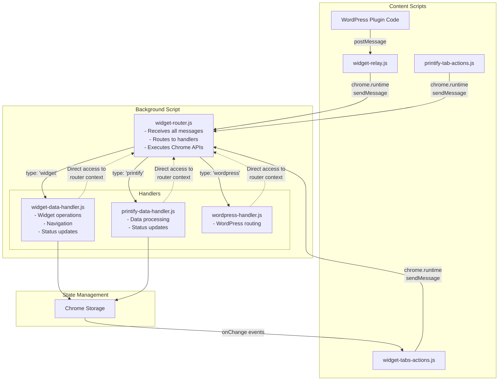
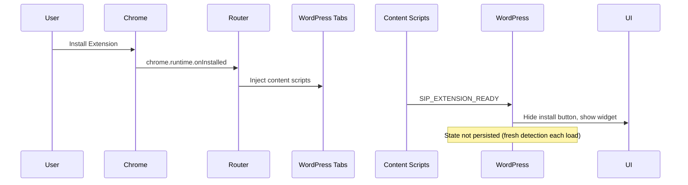

# SiP Printify Manager Browser Extension

**Version:** 1.0.0 (Independent Release)  
**Last Updated:** January 21, 2025

**Repository Location**: Flexible - can be located anywhere on the file system when added via SiP Development Tools  
**GitHub:** https://github.com/tdemelle-SiP/sip-printify-manager-extension

<!-- DOCUMENTATION RULES:
1. ARCHITECTURAL WHY - Document WHY each component exists (constraints/requirements that necessitate it)
2. NO HISTORY - Current state only, not how we got here  
3. NO DUPLICATION - Each fact appears exactly once
4. EXAMPLES OVER EXPLANATIONS - Show, don't tell
5. UPDATE THE RIGHT SECTION - Check if info already exists before adding

ARCHITECTURAL WHY GUIDELINE:
For each component, briefly explain the constraint or requirement that makes it necessary.
Focus on: Chrome API limitations, message passing rules, code organization needs.
Keep it to 1-2 sentences per component.
-->

## 1. Overview

The SiP Printify Manager browser extension is a standalone Chrome Web Store extension that integrates with the SiP Printify Manager WordPress plugin. It provides enhanced mockup data access and automated workflow capabilities that cannot be achieved through Printify's public API alone.

### System Overview Diagram

```mermaid
flowchart TD
    WP[WordPress Admin Page] -->|User click / DOM event| CS[Content-script<br>(widget-tabs-actions.js)]
    CS -- "chrome.runtime.sendMessage" --> BG[Background Router]
    BG -- "sendTabMessage()" --> CS
    CS -->|Calls| UI[SiPWidget.UI Module]
    UI -->|Injects| Widget[Widget iframe / DOM]
    UI -->|AJAX| PHP[wp-admin/admin-ajax.php]
    PHP -->|Server logic| Printify[Printify API / DB]
    Widget -. sync .-> CS
```
Legend

- **WP** WordPress admin page where the extension runs.  
- **CS** Content-script that attaches to the page and forwards messages.  
- **BG** Background script (router) that mediates extension-wide actions.  
- **UI** `SiPWidget.UI` namespace housing all widget commands.  
- **Widget** Injected UI element rendered in the page.  
- **PHP** Plugin AJAX handler (`sip-printify-manager/includes/...`).  
- **Printify** Remote Printify endpoints / site database.  

Data flow: admin click → content-script → background → back to content-script → `SiPWidget.UI` → DOM injection + WordPress AJAX → server/Printify.

### 1.1 Distribution & Update Architecture

**Chrome Web Store Distribution**: Extension is published as "unlisted" on Chrome Web Store to provide automatic updates while maintaining privacy. Users install via direct Chrome Web Store link provided by the WordPress plugin.

**Independent Release Management**: Extension follows the same Git workflow and automated release system as other SiP plugins, with its own repository and version numbering independent of the WordPress plugin.

**SiP Ecosystem Integration**: Extension appears in SiP Plugins Core dashboard alongside other plugins, with version tracking, update notifications, and installation management integrated into the SiP platform.

### 1.2 Core Principles

**Push-Driven Communication**: The extension uses a push-driven architecture where:
- The extension announces its presence when ready (not polled by WordPress)
- State changes are pushed from extension to WordPress as they occur
- No periodic status checks or ping/pong patterns
- Event-driven updates ensure real-time synchronization
- **No state persistence**: Extension state is NOT saved between page loads - the extension must announce itself each time

This approach reduces unnecessary message traffic, provides more responsive user experience, and ensures accurate extension detection.

**Version Management Integration**: Extension version is communicated to WordPress on ready announcement but is NOT persisted. The extension must announce itself on each page load to be considered installed, ensuring accurate detection state.

**Data Processing Separation**: Extension acts as a "dumb pipe" capturing and relaying raw data, while WordPress handles all processing, validation, and business logic.

**Fresh Detection Model**: Extension installation state is never persisted. The extension must announce itself on each page load to be considered installed. This ensures the "Install Extension" button always appears when the extension is not actually present, eliminating stale state issues.

## 2. Distribution & Release Management

### 2.1 Chrome Web Store Integration

**Publication Model**: Extension is published as "unlisted" on Chrome Web Store, making it accessible only via direct link while providing automatic update functionality.

**Automatic Updates**: Chrome handles extension updates automatically every 5-6 hours when new versions are published to the store, eliminating manual installation requirements.

**Installation Flow**: WordPress plugin provides direct Chrome Web Store installation link, replacing embedded extension files and manual filesystem access.

### 2.2 Independent Repository Structure

**Separate Repository**: Extension maintains its own `sip-printify-manager-extension` repository with standard SiP Git workflow (develop → master branches).

**Version Independence**: Extension versioning is independent from WordPress plugin, starting at v1.0.0 and following semantic versioning.

**Repository Management**: The extension repository is managed through the SiP Development Tools repository manager system, which allows flexible repository locations anywhere on the file system. See [Release Management Documentation](./sip-development-release-mgmt.md#repository-management) for details on adding and managing extension repositories.

### 2.3 SiP Ecosystem Integration

**SiP Core Dashboard Integration**: Extension appears as a first-class tool in SiP Plugins Core dashboard alongside WordPress plugins with:
- Version display and update notifications
- Installation status and connection monitoring  
- Auto-update preference toggle
- Chrome Web Store installation links

**SiP Development Tools Integration**: For development and release management, the extension repository must be manually added to SiP Development Tools using the repository manager. Once added, it appears in the release management table with the same capabilities as WordPress plugins. The system supports dual distribution to both the stuffisparts update server and Chrome Web Store, with Chrome Store credentials optionally configured in the `.env` file.

**Data Storage Compliance**: Extension preferences (NOT installation status) use SiP data storage patterns:
- Client-side: Extension preferences only (NOT installation state)
- Server-side: WordPress options for extension preferences
- State management: Extension must announce itself each page load - no persistence of installation status

**Update Server Integration**: Stuffisparts update server includes extension data for dashboard version checking and update notifications.

### 2.4 Release Process Integration

**Unified Release System**: The extension uses the same automated release system as WordPress plugins through SiP Development Tools. The system supports both plugin and extension releases with type-specific handling.

**Extension-Specific Features**:

#### Chrome Web Store API Integration
The release system includes a dedicated PowerShell module (`SiP-ChromeWebStore.psm1`) that provides automated Chrome Web Store publishing capabilities:

**Module Functions**:
- `Test-ChromeStoreConfig` - Validates OAuth credentials are properly configured
- `Get-ChromeAccessToken` - Exchanges refresh token for access token using OAuth 2.0
- `Upload-ToChromeWebStore` - Uploads extension ZIP to Chrome Web Store
- `Publish-ChromeExtension` - Publishes uploaded extension (or saves as draft)
- `Get-ChromeExtensionStatus` - Retrieves current publication status

**Authentication Configuration**:
Chrome Web Store API credentials are stored in `/sip-development-tools/tools/.env`:
```env
CHROME_CLIENT_ID=your-client-id
CHROME_CLIENT_SECRET=your-client-secret
CHROME_REFRESH_TOKEN=your-refresh-token
CHROME_EXTENSION_ID=your-extension-id
```

**Integration Features**:
- Extension packaging and validation via `release-extension.ps1`
- Store submission with optional draft mode (`-ChromeStoreDraft` parameter)
- Automated upload to Chrome Web Store as step 15 in release process
- Non-blocking integration - Chrome Store failures don't stop releases
- Stuffisparts data file updates for version tracking
- OAuth 2.0 authentication with automatic token refresh

**Repository Requirements**: To enable release management:
1. Extension repository must be added to SiP Development Tools via "Add Repository" button
2. Repository must contain valid `manifest.json` file
3. Repository must be a Git repository with `develop` and `master` branches

**Version Synchronization**: Release system updates both Chrome Web Store and stuffisparts server data to maintain dashboard accuracy.

**Rollback Capability**: Failed releases can be rolled back via Chrome Web Store developer console while maintaining version tracking integrity.

#### Chrome Web Store Release Process

The Chrome Web Store integration is executed as step 15 in the `release-extension.ps1` script:

**Release Flow**:
1. Extension ZIP is created and uploaded to stuffisparts update server (steps 1-14)
2. Chrome Store configuration is checked via `Test-ChromeStoreConfig`
3. If configured, OAuth access token is obtained via refresh token
4. Extension ZIP is uploaded to Chrome Web Store API
5. Based on `-ChromeStoreDraft` parameter:
   - If set: Extension saved as draft for manual review
   - If not set: Extension automatically published
6. Status is checked and reported back to user

**Error Handling**:
- Chrome Store upload failures are logged but don't stop the release
- Extension remains available via stuffisparts update server
- Manual upload to Chrome Web Store can be done if automated upload fails
- All Chrome Store operations have 30-second timeouts

**Dual Distribution Strategy**:
- Primary: Stuffisparts update server (always succeeds)
- Secondary: Chrome Web Store (optional, non-blocking)
- Users can install from either source
- Both sources receive same version simultaneously

## 3. Technical Architecture

### 3.1 Version Communication Protocol

**Extension Ready Announcement**: Extension posts a message with type 'SIP_EXTENSION_READY', source identifier, version from manifest, and capabilities object to window.location.origin.

**WordPress Version Capture**: Browser extension manager captures version in memory only (`extensionState.version = data.version`) with no persistence - fresh detection required on each page load.

**Update Checking**: WordPress compares local version against stuffisparts server data for update notifications.

## 4. Architecture Rationale

### 4.1 Why This Architecture?

**Central Router Pattern**: All messages flow through widget-router.js because Chrome extensions don't allow content scripts to intercept runtime messages from other content scripts - they go directly to the background script.

**Separate Action/Handler Scripts**: Content scripts (actions) have limited Chrome API access, while background scripts (handlers) have full access. This separation enforces proper security boundaries.

**Handler Context Pattern**: Instead of message passing between router and handlers, handlers receive a router context object. This eliminates an unnecessary message hop and provides direct access to Chrome APIs.

### 3.2 The Central Router Pattern

**ALL messages in the extension flow through widget-router.js - NO EXCEPTIONS**

The router is the background script and the single message hub that:
- Receives ALL incoming messages (chrome.runtime messages from content scripts and relayed postMessages)
- Routes to appropriate handlers based on message type
- Executes Chrome API commands directly (no separate widget-main.js)
- Returns responses to the originator

### 3.3 Message Flow Diagram


The State Management flow is shown in the Mermaid diagram above, where handlers update Chrome Storage, which triggers onChange events that update the widget UI in widget-tabs-actions.js.

### 3.4 Message Formats

**Two distinct formats for different contexts**:

**External (WordPress ↔ Extension)**: `{ type: 'SIP_*', source: 'sip-printify-manager', ... }`
- SIP_ prefix identifies our messages among all postMessages

**Internal (Extension components)**: `{ type: 'widget|printify|wordpress', action: '...', data: {...} }`
- Type routes to handler, action specifies operation

#### Message Format Conversion

The widget-relay.js converts external messages to internal format:

```
WordPress sends:          { type: 'SIP_SHOW_WIDGET', source: 'sip-printify-manager' }
                            ↓
Relay converts to:        { type: 'WORDPRESS_RELAY', data: { 
                             type: 'wordpress', 
                             action: 'SIP_SHOW_WIDGET',  // Original type becomes action
                             data: {...} 
                          }}
                            ↓
Router unwraps & routes:  { type: 'wordpress', action: 'SIP_SHOW_WIDGET', data: {...} }
```

**Key Point**: Never mix formats. External messages MUST use 'SIP_' prefix. Internal messages MUST use handler/action pattern.

#### Debug Level Synchronization

**Why it exists**: The extension needs to respect WordPress debug settings for consistent logging behavior across the entire SiP ecosystem.

**Implementation**: Every message from WordPress to the extension includes the current debug level:
```javascript
// In browser-extension-manager.js
function sendMessageToExtension(message, origin = '*') {
    const enrichedMessage = Object.assign({}, message, {
        debugLevel: SiP.Core.debug.getLevel(),      // 0=OFF, 1=NORMAL, 2=VERBOSE
        debugLevelName: SiP.Core.debug.getLevelName() // 'OFF', 'NORMAL', 'VERBOSE'
    });
    window.postMessage(enrichedMessage, origin);
}
```

**Extension Processing**: The relay checks every incoming message for debug level:
```javascript
// In widget-relay.js
if (data.debugLevel !== undefined && data.debugLevelName !== undefined) {
    SiPWidget.Debug.setDebugLevel(data.debugLevel, data.debugLevelName);
}
```

This ensures the extension always uses the correct debug level, updating immediately when changed in WordPress.

#### Request-Response Correlation

**Why Request IDs**: When multiple async operations run concurrently (e.g., fetching mockups for 4 blueprints), responses must be matched to their originating requests to prevent race conditions.

**Implementation Pattern**: WordPress sends requests with unique IDs (`operation_[itemId]_[timestamp]`) and sets up response listeners before sending. The message includes type, source, requestId, data, debugLevel (0-2), and debugLevelName. Response handlers match by requestId to correlate async responses.

**CRITICAL**: The relay preserves the requestId in wrapped responses. Extension → WordPress responses include `type: 'SIP_EXTENSION_RESPONSE'`, the preserved `requestId` from the original request, and the actual response data.

#### Handler Chrome API Requests
Handlers can request Chrome API execution by calling router methods directly:
```javascript
// In handler:
const result = await router.createTab({ url: 'https://example.com' });
const tabs = await router.queryTabs({ url: '*://printify.com/*' });
```

#### Response Format
```javascript
// Success
{
    success: true,
    data: object,
    message: string  // Optional
}

// Error
{
    success: false,
    error: 'Error message',
    code: 'ERROR_CODE',
    timestamp: Date.now()
}
```

**Note**: Error response formatting is centralized in `widget-error.js`. Content scripts use `SiPWidget.Error` methods. The background script (router and handlers) returns plain error objects with `success: false`.

## 5. Component Responsibilities

### 5.1 File Structure
```
browser-extension/
├── manifest.json               # Extension configuration
├── background.js               # Service worker loader - imports all modules
│   Why: Manifest V3 service workers require importScripts() to load modules
├── core-scripts/
│   ├── widget-router.js        # Background script - Central message router & Chrome API executor
│   ├── widget-relay.js         # Content script - Relays WordPress postMessages to router
│   ├── widget-debug.js         # Debug utilities
│   ├── widget-error.js         # Error response formatting
│   ├── action-logger.js        # Structured action logging system
│   └── widget-styles.css       # Widget styling
├── action-scripts/
│   ├── extension-detector.js            # Extension presence announcer
│   ├── widget-tabs-actions.js          # Widget UI creation and button handling
│   ├── printify-tab-actions.js         # Printify page monitoring and scraping
│   ├── printify-api-interceptor-actions.js # API discovery monitor
│   └── mockup-library-actions.js       # Mockup selection updates on Printify
├── handler-scripts/
│   ├── widget-data-handler.js          # Widget operation logic
│   ├── printify-data-handler.js        # Printify data processing
│   ├── wordpress-handler.js            # WordPress message routing
│   ├── printify-api-interceptor-handler.js # API discovery processing
│   ├── mockup-fetch-handler.js         # Blueprint mockup fetching
│   └── mockup-update-handler.js        # Product mockup updates
└── assets/                     # Images and static files
```

**Manifest Configuration**:
```json
{
    "background": {
        "service_worker": "background.js"
    },
    "content_scripts": [
        {
            "matches": ["https://printify.com/*"],
            "js": [
                "core-scripts/widget-debug.js",
                "core-scripts/widget-error.js",
                "action-scripts/printify-tab-actions.js",
                "action-scripts/printify-api-interceptor-actions.js",
                "action-scripts/widget-tabs-actions.js"
            ]
        },
        {
            "matches": ["*://*/wp-admin/*"],
            "js": [
                "core-scripts/widget-debug.js",
                "core-scripts/widget-error.js",
                "core-scripts/widget-relay.js",
                "action-scripts/extension-detector.js",
                "action-scripts/widget-tabs-actions.js"
            ]
        }
    ]
}
```

**Naming Standards**:

**Action Scripts** (content scripts that detect events and send messages):
- Must end with `-actions.js` suffix
- Examples: `widget-tabs-actions.js`, `printify-tab-actions.js`, `printify-api-interceptor-actions.js`
- Located in `action-scripts/` directory

**Handler Scripts** (background scripts that process messages):
- Must end with `-handler.js` suffix (always singular)
- Examples: `widget-data-handler.js`, `printify-data-handler.js`, `printify-api-interceptor-handler.js`
- Located in `handler-scripts/` directory

**Paired Features**: Complex features should have matching action/handler pairs:
- `printify-api-interceptor-actions.js` → `printify-api-interceptor-handler.js`
- This makes it clear which handler processes which action script's events

### 5.2 Core Scripts

#### widget-router.js (Background Script)
**Why it exists**: Chrome extensions require a background script to access privileged APIs (tabs, cross-origin requests). Making the router the background script ensures ALL messages flow through one central point as documented.

- Receives ALL chrome.runtime.sendMessage calls from content scripts
- Routes messages to handlers based on 'type' field  
- Executes Chrome API commands directly (no separate widget-main.js)
- Provides router context to handlers with Chrome API methods
- Sends responses back to message originators
- Forwards messages to content scripts via chrome.tabs.sendMessage when needed

#### widget-relay.js (Content Script - WordPress pages only)
**Why it exists**: WordPress can only use window.postMessage() which content scripts can receive, but the router (background script) cannot. This relay bridges that gap.

- Listens for postMessage events from WordPress
- Validates message source and format
- Relays WordPress messages to router via chrome.runtime.sendMessage
- Returns responses back to WordPress via postMessage

#### widget-debug.js (Core Debug Module)
**Why it exists**: Provides centralized debug logging that respects WordPress debug levels and works across all extension contexts.

**Architectural Constraint - Dual Context Support**: Chrome Manifest V3 requires the extension to operate in two distinct JavaScript contexts:
- **Service Worker (background.js)**: No DOM access, uses `self` global object
- **Content Scripts**: Run in web pages, have `window` global object

Both contexts require debug logging, so the module detects its environment using `typeof window !== 'undefined'`. This is not defensive coding but necessary environment detection mandated by Chrome's extension architecture.

- Provides debug methods that respect enabled/disabled state
- **Automatically synchronizes with WordPress debug level on every received message**
- Works in conjunction with action-logger.js for structured logging

See also: [SiP Debug System Documentation](./sip-development-testing-debug.md#browser-extension-integration) for complete debug system overview.

**Debug Levels**:
- **OFF** (0): No logging output
- **NORMAL** (1): Important operations and errors only  
- **VERBOSE** (2): All debug messages including detailed traces

**Key Functions**:
- `setDebugLevel(level, levelName)` - Updates debug level and persists to storage
- `normal(message)` - Logs at NORMAL level (important operations)
- `verbose(message)` - Logs at VERBOSE level (detailed traces)
- `log(message)` - Logs at VERBOSE level (for backward compatibility)
- `error(message)` - Logs errors at NORMAL level
- `warn(message)` - Logs warnings at NORMAL level

**Usage Pattern**:
```javascript
const debug = SiPWidget.Debug;

debug.normal('Important operation started');     // Shows in NORMAL and VERBOSE
debug.verbose('Detailed operation data:', data); // Shows only in VERBOSE
debug.error('Operation failed:', error);         // Shows in NORMAL and VERBOSE
```

**Initialization**: The debug module initializes synchronously with sensible defaults (VERBOSE level) to ensure it's immediately available when other modules load. Chrome storage state is loaded asynchronously after initialization to update settings without blocking module loading.

**Storage Format**:
```javascript
// Chrome storage keys:
// 'sip_printify_debug_level' - Current debug level (0, 1, or 2)
// 'sip_printify_debug_level_name' - Level name ('OFF', 'NORMAL', 'VERBOSE')
```

**Note**: Console log capture has been replaced by the action-logger.js system which provides structured, meaningful logging of extension actions rather than mirroring console output.

#### action-logger.js (Action Logging System)
**Why it exists**: Provides structured logging of extension actions rather than mirroring console output. This gives meaningful insights into what the extension is actually doing, with timing, status, and context information.

**Key Features**:
- Structured log entries with categories, timing, and status
- Respects WordPress debug levels (OFF/NORMAL/VERBOSE)
- Automatic storage management (1MB limit)
- Tab context for each action
- Duration tracking for operations

**Categories**:
- `WORDPRESS_ACTION` - Requests from WordPress
- `NAVIGATION` - Tab navigation operations
- `DATA_FETCH` - Data scraping and fetching
- `API_CALL` - API interceptions
- `STATE_CHANGE` - Extension state updates
- `ERROR` - Operation failures
- `AUTH` - Authentication events

**Public API**:
- `log(category, action, details)` - Log an action
- `normal(category, action, details)` - Log at NORMAL level
- `verbose(category, action, details)` - Log at VERBOSE level
- `startTiming(operationId)` - Start timing an operation
- `endTiming(operationId)` - End timing and return duration
- `getLogs(callback)` - Retrieve stored logs
- `clearLogs()` - Clear all logs
- `setDebugLevel(level, levelName)` - Update debug level

### 5.3 Action Scripts

#### extension-detector.js
**Why it exists**: The SiP ecosystem needs to know which extensions are installed to provide appropriate UI and functionality. This script announces the extension's presence on relevant pages.

- Announces extension presence to WordPress pages
- **Conditional behavior based on page**:
  - On SiP Plugins Core dashboard (`page=sip-plugins`): Only announces when requested via `SIP_REQUEST_EXTENSION_STATUS` message
  - On SiP Printify Manager pages (`page=sip-printify-manager`): Announces immediately for plugin functionality
- Sends extension information: slug, name, version, isInstalled
- Lightweight script with minimal overhead

**Implementation**: On the SiP Plugins Core dashboard, waits for `SIP_REQUEST_EXTENSION_STATUS` message before announcing. On SiP Printify Manager pages, announces immediately after DOM is ready.

#### widget-tabs-actions.js
**Why it exists**: The widget UI needs to be injected into specific pages (SiP Printify Manager and Printify) to provide consistent user access. Separating UI from page-specific logic keeps code organized.

- Creates and manages the floating widget UI
- **Only shows on**: SiP Printify Manager pages (`page=sip-printify-manager`) and Printify.com
- Handles widget button clicks (navigation, status checks, etc.)
- Updates widget display based on Chrome storage changes
- Sends user-initiated actions to router
- Does NOT handle Printify page-specific actions

#### printify-tab-actions.js
**Why it exists**: Printify pages need specific DOM monitoring and scraping logic that would bloat the general widget code. This separation keeps Printify-specific logic isolated.

- Monitors Printify pages for DOM changes
- Detects page state and product information
- Detects inventory changes (future)
- Sends detected events to router
- Does NOT handle widget UI

#### printify-api-interceptor-actions.js
**Why it exists**: API interception is a complex feature requiring significant code for request monitoring and pattern analysis. It warrants its own dedicated file for maintainability.

- Intercepts Printify API calls
- Captures API patterns and responses
- Sends captured data to router for processing

### 5.4 Handler Scripts

#### widget-data-handler.js
**Why it exists**: Widget operations (navigation, config, UI state) are distinct from data operations and need their own business logic layer in the background context.

Processes widget-related operations:
- Navigation between tabs
- Widget state management
- Configuration updates
- **Required actions**: `showWidget`, `toggleWidget`, `navigate`, `updateState`, `getConfig`, `updateConfig`, `testConnection`, `checkPluginStatus`

#### mockup-fetch-handler.js
**Why it exists**: Mockup fetching is a complex multi-step operation requiring tab management and API interception. This dedicated handler isolates all mockup-related logic and provides clean separation from other extension functionality.

Processes mockup fetching operations:
- Navigates to Printify mockup library pages
- Intercepts `generated-mockups-map` API responses  
- Returns **raw API response data** without processing
- Returns data via sendResponse callback (relay handles WordPress delivery)
- **Required actions**: `fetchMockups`

**ARCHITECTURAL PRINCIPLE**: The extension acts as a "dumb pipe" that only captures and relays raw data. All data processing, validation, and transformation happens on the WordPress side. This separation enables easier debugging, faster iteration, and clearer responsibilities.

**CRITICAL**: This handler MUST NOT use chrome.tabs.sendMessage to send data to WordPress. All responses MUST go through the sendResponse callback which the relay will properly format and deliver via postMessage.

#### printify-data-handler.js
**Why it exists**: Complex multi-step operations like api interception need coordination logic that can access Chrome APIs. Separating this from UI logic enables cleaner testing and maintenance.

Processes Printify data operations:
- Data validation and formatting
- WordPress API communication coordination
- Status update management
- Routes mockup requests to MockupFetchHandler

#### wordpress-handler.js
**Why it exists**: WordPress sends differently formatted messages (SIP_FETCH_MOCKUPS vs fetchMockups). This handler translates WordPress commands to the extension's internal message format.

Routes WordPress postMessage commands to appropriate handlers:
- Converts WordPress message formats to extension formats
- Routes to widget or printify handlers based on command
- **Supported commands**: `SIP_FETCH_MOCKUPS`, `SIP_NAVIGATE`, `SIP_SHOW_WIDGET`, `SIP_CHECK_STATUS`

#### printify-api-interceptor-handler.js
**Why it exists**: Captured API data needs processing and storage logic separate from the capture mechanism. This separation allows the action script to focus on interception while the handler manages data.

Processes captured API data:
- Analyzes API patterns
- Stores discovered endpoints
- Manages API knowledge base

## 6. Chrome Extension Constraints

### 6.1 API Access Limitations

**Background Script (widget-router.js and handlers loaded by background.js)**
- Full Chrome API access
- Can make cross-origin requests
- Can manage tabs, windows, storage
- Runs as a service worker in Manifest V3
- **CRITICAL**: No DOM access - cannot use `window`, `document`, or DOM APIs
- Must check `typeof window !== 'undefined'` before using window
- Service worker errors prevent ALL content scripts from loading

**Content Scripts (action scripts and widget-relay.js)**
- Limited Chrome API access
- Can use: chrome.storage, chrome.runtime.sendMessage
- CANNOT use: chrome.tabs, chrome.windows, cross-origin fetch
- Must request privileged operations from the background script

### 6.2 Message Passing Architecture

**Key Constraint**: Content scripts cannot intercept chrome.runtime.sendMessage calls from other content scripts. These messages go directly to the background script.

This is why the router MUST be the background script - it's the only way to receive all messages as documented.

**Message Flow**:
- postMessage can only be received by content scripts injected into the page
- chrome.runtime.sendMessage sends messages directly to the background script (router)
- The router uses chrome.tabs.sendMessage to communicate with specific content scripts
- WordPress postMessage messages are relayed to the router by widget-relay.js

### 6.3 Tab Pairing System

**Why it exists**: The widget's "Go to..." navigation feature requires maintaining relationships between WordPress admin tabs and Printify tabs to ensure navigation reuses existing tabs instead of creating new ones.

#### Architecture Overview

The tab pairing system uses a bidirectional pairing model:

```javascript
// Runtime cache in widget-router.js
const tabPairs = new Map(); // Map<tabId, pairedTabId>

// Persistent storage in chrome.storage.local
{
    sipTabPairs: {
        "123": "456",  // Tab 123 is paired with tab 456
        "456": "123"   // Tab 456 is paired with tab 123 (bidirectional)
    }
}
```

#### Key Concepts

1. **Bidirectional Pairing**: Each tab knows its pair, enabling navigation in both directions
2. **Persistence**: Pairs survive page reloads via chrome.storage.local
3. **Automatic Cleanup**: Pairs are removed when either tab closes
4. **One-to-One Relationships**: Each tab can only be paired with one other tab
5. **Smart Navigation**: Avoids unnecessary reloads by checking if the paired tab is already on the target URL

#### Tab Pairing Flow

**Initial Navigation** (WordPress → Printify):
1. User clicks "Go to Printify" in widget
2. Widget sends navigation message with current tab ID
3. Router checks if current tab has a paired Printify tab
4. If no pair exists, creates new Printify tab and establishes pairing
5. If pair exists and is valid, navigates to the paired tab

**Return Navigation** (Printify → WordPress):
1. User clicks "Go to WordPress" in widget
2. Widget sends navigation message with current tab ID
3. Router finds the paired WordPress tab
4. Navigates to the paired WordPress tab (always exists as it initiated the pair)

#### Implementation Details

**Storage Functions**: The `loadTabPairs()` function loads pairs from chrome.storage.local on startup, parsing tab IDs and populating the runtime Map. The `createTabPair()` function creates bidirectional mappings in the Map and persists to storage.

**Navigation with Pairing**: The `navigateTab()` function checks for existing paired tabs, verifies they still exist, and avoids unnecessary reloads by comparing URLs. If the paired tab is on the target URL, it just switches focus. Otherwise, it navigates the paired tab or creates a new tab with pairing. Returns success with action taken ('switched-focus', 'reused-pair', or 'created-pair').

#### Message Flow for Navigation

1. **Content Script** sends navigation message with type 'widget', action 'navigate', and target URL. The currentTabId is automatically added by the background script from sender.tab.id.

2. **Handler** extracts the current tab ID from the sender context and passes it to router.navigateTab() along with the URL and destination.

#### Lifecycle Management

**Tab Close Cleanup**: Chrome's `tabs.onRemoved` listener automatically calls `removeTabPair()` which cleans both sides of the bidirectional pairing.

**Storage Persistence**:
- Pairs are loaded on extension startup
- Pairs are saved after each create/remove operation
- Storage key uses SiP prefix convention: `sipTabPairs`

## 7. Common Operations

### 7.1 Status Update Flow

1. WordPress plugin: `window.postMessage({ type: 'SIP_CHECK_STATUS', source: 'sip-printify-manager' })`
2. widget-relay.js receives postMessage and relays to router via chrome.runtime.sendMessage
3. widget-router.js receives and routes to widget-data-handler.js (via wordpress-handler.js)
4. Handler uses router context to check plugin status
5. Handler updates Chrome storage with status
6. widget-tabs-actions.js updates UI from storage change
7. Response sent back through relay to WordPress

### 7.2 Adding New Features

To add a new feature (e.g., inventory monitoring):

1. **Add action detection** in appropriate action script
2. **Define message format**: `{ type: 'printify', action: 'inventoryChanged', data: {...} }`
3. **Add handler logic** in appropriate handler file
4. **If routing through wordpress-handler.js**, ensure the target handler implements the action
5. **Add any Chrome API methods** to router context if needed
6. **Update Chrome storage schema** for new state
7. **Update widget UI** to display new information

**CRITICAL**: When adding routing in wordpress-handler.js, you MUST implement the corresponding action in the target handler.

## 8. Implementation Standards

### 8.1 Module Pattern

All scripts use IIFE pattern with SiPWidget namespace:

**Content Scripts**: Use `window.SiPWidget` namespace with `window.widgetDebug` for logging. Returns public API object with init() and other public methods.

**Background Scripts** (service workers): Use `self.SiPWidget` namespace (not `window`) with console directly for logging. Returns public API with handle() method.

### 8.2 Message Handling Pattern

**CRITICAL**: Async handlers MUST return `true` to keep the message channel open. Without this, Chrome will close the channel before the async response is sent, causing "The message port closed before a response was received" errors.

Every handler follows this pattern:
- Receives: `request`, `sender`, `sendResponse`, `router` parameters
- Logs the action being processed
- Uses switch statement for action routing
- For async operations: MUST return `true` to keep channel open
- For sync operations: No return statement needed
- Always sends response with success/error structure

**Common Patterns**:

1. **Async with immediate response wrapper** (Recommended): Use async IIFE to wrap all async operations, then return `true`
2. **Promise chain pattern**: Chain promises with .then()/.catch(), then return `true`
3. **Synchronous response**: Send response immediately, no return statement needed

### 8.3 Handler Context

Handlers run in the background script context and have access to router methods. They can call router methods directly (e.g., `router.createTab()`) and must return `true` for async operations.

### 8.4 Public API Naming Standard  

**Purpose** Prevent future `ReferenceError` issues and keep the extension extensible by enforcing a single, namespaced surface for all UI commands.

| Rule | Rationale | Example |
|------|-----------|---------|
| **Expose every UI function under `SiPWidget.UI` only.** | Makes the API explicit and discoverable; avoids accidental globals.| `SiPWidget.UI.showWidget()` |
| **Never call a bare function such as `showWidget()` or `toggleWidget()` from any script (wrapper, relay, handler, or content-script).** | Guarantees the call site never outruns the module loader; eliminates race conditions. | _Wrong:_ `showWidget();`<br>_Right:_ `SiPWidget.UI.showWidget();` |
| **If WordPress code requires a global function, create it inside `widget-tabs-actions.js` and mark it clearly.** | Provides clear API surface for WordPress integration. | `window.showWidget = SiPWidget.UI.showWidget; // WordPress integration` |
| **Future commands** (e.g. `refreshWidget`, `resizeWidget`) **must follow the same pattern**. | Keeps extension growth predictable. | `SiPWidget.UI.refreshWidget();` |

**Implementation Checklist**: Search for bare function calls (`showWidget(`, `toggleWidget(`), refactor to use `SiPWidget.UI.*`, remove unnecessary `window.*` aliases, and document new commands in the pattern table.


## 9. Widget UI Features

### 9.1 Action History Viewer

**Why it exists**: During complex operations like mockup fetching that span multiple tabs (WordPress ↔ Printify), understanding the sequence of actions performed by the extension is crucial for debugging. The action logger provides structured, meaningful logs of what the extension actually does.

#### Implementation Architecture

**Action Logging System**:
- **Extension Side** (`action-logger.js`): Logs structured actions with categories, timing, and status
- **WordPress Side**: Sends only actionable requests (no console mirroring)
- **Storage**: Chrome local storage with 1MB limit and automatic cleanup
- **Categories**: WORDPRESS_ACTION, NAVIGATION, DATA_FETCH, API_CALL, STATE_CHANGE, ERROR, AUTH

#### Action Categories

The system logs these types of extension actions:
- **WORDPRESS_ACTION**: Requests received from WordPress plugin
- **NAVIGATION**: Tab navigation and pairing operations
- **DATA_FETCH**: Data scraping and mockup fetching
- **API_CALL**: Printify API interceptions
- **STATE_CHANGE**: Extension state updates
- **ERROR**: Operation failures
- **AUTH**: Authentication events

#### Usage Flow

1. **History Button**: User clicks History button in extension widget
2. **Log Retrieval**: `SiPWidget.ActionLogger.getLogs()` retrieves action history
3. **Window Creation**: New popup window opens with formatted action viewer
4. **Features Available**:
   - **Action Timeline**: Chronological list of extension actions
   - **Duration Tracking**: Shows how long each operation took
   - **Status Indicators**: Success/failure for each action
   - **Tab Information**: Shows which tab performed the action
   - **Copy Functionality**: Export action history for analysis

#### Technical Details

**Action Structure**:
```javascript
{
    timestamp: Date.now(),
    category: 'WORDPRESS_ACTION',
    action: 'fetchMockups', 
    tabId: 123,
    tabName: 'SiP Printify Manager',
    duration: 1234, // milliseconds
    status: 'success', // or 'failure'
    details: { /* action-specific data */ }
}
```

**Debug Level Integration**:
- **OFF** (0): No action logging
- **NORMAL** (1): Important operations (WordPress actions, navigation, errors)
- **VERBOSE** (2): All actions including detailed traces

**Storage Management**:
- Key: 'sipActionLogs' in Chrome local storage
- Automatic cleanup when approaching 1MB limit
- Persists through page reloads
- Respects WordPress debug level settings

#### User Experience

**Action Viewer Window**:
- **Timeline View**: Actions displayed chronologically
- **Action Details**: Category, description, duration, status
- **Tab Context**: Shows which tab performed each action
- **Filtering**: View by category or status
- **Performance Metrics**: Total time for operations

**Integration Points**:
- **Widget Button**: Seamlessly integrated into existing widget UI
- **Real-time Updates**: Actions appear as they happen
- **Export Options**: Copy action history for debugging

## 10. Storage Management

### 10.1 State Storage

All UI state stored in Chrome storage for cross-tab sync:
```javascript
chrome.storage.local.set({
    sipWidgetState: {
        isExpanded: boolean,
        position: { x, y },
        currentOperation: { /* ... */ },
        // Feature-specific state
    }
});
```

### 10.2 Storage Limits

- Chrome storage has 5MB limit
- Monitor usage and prune old operation history
- Use efficient data structures

## 11. Configuration and Deployment

### 11.1 Extension Configuration

**Two modes**: Pre-configured (`assets/config.json` with wordpressUrl, apiKey, configured:true) or user-configured (via extension popup).

**⚠️ SECURITY**: Never commit `config.json` with real API keys. Already in `.gitignore`.

### 11.2 Configuration Loading Order

1. On startup, router checks for `assets/config.json`
2. If found AND `configured: true`, uses those values
3. Values are copied to Chrome storage for persistence
4. If not found or `configured: false`, loads from Chrome storage
5. Updates extension badge based on configuration state:
   - ✓ Green badge: Configured and ready
   - ! Orange badge: Configuration required

**Note**: The `config.json` file is included in manifest's `web_accessible_resources` to allow the background script to fetch it using `chrome.runtime.getURL()`.

## 12. WordPress Integration

### 12.1 Extension Detection and Installation Flow

**Chrome Limitation**: Content scripts don't auto-inject into already-open tabs after installation. The extension handles this by programmatically injecting scripts on install.

#### Installation Flow - Detailed



#### Implementation Details

**Extension Side - Programmatic Injection** (widget-router.js): On install/update, automatically injects content scripts and CSS into open WordPress admin tabs for immediate availability without reload.

**Extension Side - Announcement** (widget-relay.js): After 100ms delay, posts `SIP_EXTENSION_READY` with version and capabilities.

**WordPress Side - Detection** (browser-extension-manager.js): WordPress initializes with extension not detected, listens for `SIP_EXTENSION_READY`, updates state in memory only, hides install button, and triggers jQuery event.

#### Message Flow Directions

**WordPress → Extension**:
- WordPress uses `window.postMessage()` (only option for web pages)
- `widget-relay.js` receives and forwards to background via `chrome.runtime.sendMessage()`
- Relay is REQUIRED because background scripts can't receive postMessages

**Extension → WordPress**:
- Content scripts use `window.postMessage()` directly
- No relay needed - direct communication
- `widget-relay.js` announces presence, not relaying

#### Key Benefits

1. **Fresh Detection Each Load**: Extension must announce itself on every page load
2. **No Stale State**: No persistence means no false positives for extension detection
3. **Clean Architecture**: Each component has clear responsibility
4. **Reliable Detection**: Push-driven model with no saved state ensures accuracy
5. **Install Button Visibility**: Always shows when extension not detected

### 12.2 Supported WordPress Commands

The extension supports the following commands from WordPress:

| Command | Purpose | Handler |
|---------|---------|---------|
| `SIP_NAVIGATE` | Navigate to URL in new/existing tab | Widget handler |
| `SIP_OPEN_TAB` | Open URL in new tab | Widget handler |
| `SIP_TOGGLE_WIDGET` | Toggle widget visibility | Widget handler |
| `SIP_SHOW_WIDGET` | Show the widget | Widget handler |
| `SIP_CHECK_STATUS` | Check plugin connection status | Widget handler |
| `SIP_FETCH_MOCKUPS` | Fetch mockup data from Printify | Printify handler |
| `SIP_UPDATE_PRODUCT_MOCKUPS` | Update product mockups via internal API | Printify handler |
| `SIP_PUBLISH_PRODUCTS` | Publish products via internal API | Printify handler |

**Note**: Any other command will receive an error response with code `UNKNOWN_ACTION`.

### 12.3 Sending Commands

From WordPress plugin:
Commands are sent via `window.postMessage()` with a specific type, source identifier, unique request ID, and command-specific data.

#### Example: Mockup Fetching
WordPress sends a `SIP_FETCH_MOCKUPS` message containing blueprint ID, product ID, shop ID, and user ID. The extension processes this request and returns a response wrapped as `SIP_EXTENSION_RESPONSE` with a matching request ID, containing the mockup data.

#### Example: Update Product Mockups
WordPress sends a `SIP_UPDATE_PRODUCT_MOCKUPS` message with product IDs, shop ID, and an array of selected mockups. The extension navigates to the product mockup page, makes internal API calls, and returns success/failure status for each mockup update.

#### Example: Publish Products
WordPress sends a `SIP_PUBLISH_PRODUCTS` message with an array of products (containing WordPress product ID, Printify product ID, and title) and shop ID. The extension makes internal API calls to publish each product and returns success/failure status for each.

### 12.4 jQuery Events

The browser-extension-manager triggers these jQuery events for inter-module communication:

- **`extensionReady`**: Triggered when extension announces it's ready via `SIP_EXTENSION_READY`, passing the extension version and capabilities.

- **`extensionInstalled`**: Triggered when extension is first installed via `SIP_EXTENSION_INSTALLED`, passing a flag indicating first install and the extension version.

Modules can listen for these events to react to extension state changes using jQuery's event system.

### 12.5 Extension Detection on Authentication Page

The SiP Printify Manager authentication page includes a two-step process where Step 1 checks for extension installation.

#### Implementation Pattern

**HTML Structure** (dashboard-html.php):
Two div elements are used - one showing the install button and instructions (visible by default), and another showing the success message (hidden by default).

**JavaScript Detection** (shop-actions.js):
Listens for the `extensionReady` event from browser-extension-manager. When received, it hides the "not detected" div, shows the "detected" div, and marks the extension install section as completed.

**Why This Pattern**:
- Initial state is clear: extension not detected (only one div visible)
- Detection uses existing event system (no duplicate listeners)
- UI updates are coordinated through jQuery events

**Key Points**:
- The `browser-extension-manager.js` handles all extension communication
- Other modules listen for the `extensionReady` jQuery event
- No direct `window.addEventListener` for extension messages in individual modules
- DOM marker detection used for extension presence verification

### 12.6 Common Pitfalls - MUST READ

**CRITICAL: Understanding Message Boundaries**

1. **chrome.tabs.sendMessage ONLY reaches content scripts**
   ```javascript
   // WRONG - WordPress pages cannot receive this:
   chrome.tabs.sendMessage(tabId, { data: 'something' });
   
   // CORRECT - Use the relay pattern documented above
   ```

2. **WordPress pages can ONLY receive postMessage**
   - WordPress has NO chrome.runtime.onMessage listener
   - WordPress has NO access to Chrome Extension APIs
   - ALL Extension → WordPress communication MUST use postMessage

3. **The Relay is One-Way for Responses**
   - widget-relay.js forwards WordPress → Extension messages
   - Extension responses come back through the SAME relay
   - Do NOT attempt to bypass the relay with direct messaging

**Why This Architecture**: Chrome's security model creates strict boundaries between web pages and extensions. The relay pattern is the ONLY reliable way to bridge these boundaries.

### 12.7 REST API Endpoints

Extension calls these WordPress endpoints:
- `POST /wp-json/sip-printify/v1/extension-status`
- `GET /wp-json/sip-printify/v1/plugin-status`

Authentication via header: `X-SiP-API-Key: [32-character-key]`

## 13. Pause/Resume Error Recovery System

### 13.1 Overview

The pause/resume system provides interactive error handling for page load failures during automated operations. When the extension encounters login requirements, 404 errors, or page load issues, it pauses operations, focuses the problematic tab, and provides clear instructions for users to resolve the issue before resuming.

### 13.2 Architecture

#### Core Components

**Router State Management** (`widget-router.js`): Maintains `pausedOperation` state variable. The `pauseOperation()` stores operation context, while `resumeOperation()` retrieves and clears the stored operation.

**Error Detection** (`mockup-library-actions.js`): The `detectPageIssue()` function checks for login pages (URL contains '/login' or password input exists), 404 errors (title or content indicators), and general error pages (error class elements). Returns array of detected issues or null.

### 13.3 Operation Flow

#### Pause Flow
1. **Error Detection**: Content script detects page load issue
2. **Operation Pause**: Handler stores operation context in router
3. **Tab Focus**: Chrome focuses the problematic tab
4. **UI Update**: Widget shows pause status with clear instructions
5. **User Action**: User fixes the issue (logs in, navigates to correct page)

#### Resume Flow
1. **User Clicks Resume**: Widget sends resume request
2. **Context Retrieval**: Router retrieves paused operation
3. **Operation Continues**: Handler resumes from where it left off
4. **Success Response**: Operation completes and responds to WordPress

### 13.4 Implementation Example

**Mockup Update Handler** (`mockup-update-handler.js`): The `waitForPageReady()` function waits for page load, checks page state, and if issues are detected, pauses the operation with context, focuses the problematic tab, updates the widget UI with status message, and returns a pause indicator.

### 13.5 Widget UI Integration

**Status Display** (`widget-tabs-actions.js`): The `updateOperationStatus()` function updates the widget UI to show pause status with warning icon, message, and resume button when status is 'paused'.

### 13.6 Error Messages

The system provides user-friendly messages for common issues:

| Issue | Message |
|-------|---------|
| `login_required` | "Please log in to Printify, then click Resume" |
| `page_not_found` | "Page not found. Please navigate to the correct page and click Resume" |
| `page_error` | "Page failed to load. Please refresh the page and click Resume" |
| `permission_denied` | "Access denied. Please check your permissions and click Resume" |

### 13.7 Best Practices

1. **Always Include Resume Handler**: Specify which handler should process the resume
2. **Store Minimal Context**: Only store what's needed to resume the operation
3. **Clear Instructions**: Provide specific actions users should take
4. **Tab Focus**: Always focus the problematic tab for user convenience
5. **Graceful Degradation**: Operations should handle both pause and non-pause scenarios

### 13.8 Adding Pause/Resume to New Operations

To add pause/resume support to a new operation:

1. **Add Error Detection**: Check for page issues during operation
2. **Store Context**: Use `router.pauseOperation()` with operation details
3. **Update UI**: Send status update to widget
4. **Handle Resume**: Add case in `widget-data-handler.js` for your operation type
5. **Test Scenarios**: Test with login pages, 404s, and network errors

## 14. Development Guidelines

### 14.1 Widget Visibility Requirements

**Widget Initialization**:
- Widget MUST start with `sip-visible` class for immediate visibility
- Default position MUST be within viewport bounds
- For top-right positioning: `x: window.innerWidth - 340, y: 20` (accounts for 320px expanded width)
- Position validation should account for both collapsed (60px) and expanded (320px) widths

**CSS Classes**:
- `sip-visible`: Required for widget to be visible (adds opacity: 1, visibility: visible)
- `collapsed`/`expanded`: Controls widget state
- Never rely on inline styles for critical visibility

**Debugging "Missing" Widget**:
1. Check if widget is actually loaded but positioned off-screen
2. Look for `[Widget UI]` console messages
3. Inspect DOM for `#sip-floating-widget` element
4. Verify position values in inline styles

### 14.2 Adding New Operations

1. Start with the trigger (user action or page event)
2. Define the message format
3. Add routing logic if new handler type
4. Implement handler logic
5. Define Chrome API commands if needed
6. Update storage schema if needed
7. Update UI components if needed

### 14.3 Debugging

- Enable debug mode: `chrome.storage.local.set({sip_printify_debug: true})`
- Check router for message flow
- Verify message formats match documentation
- Check Chrome DevTools for both page and extension contexts

### 14.4 Testing Checklist

- [ ] Run `node validate-manifest.js` to check manifest integrity
- [ ] Check chrome://extensions for ANY errors or warnings
- [ ] Click "service worker" link and check for console errors
- [ ] Verify no BOM characters in JSON files: `file manifest.json` should show "ASCII text" not "UTF-8 Unicode (with BOM) text"
- [ ] Add `console.log()` at top of problematic scripts to verify they load
- [ ] Check that widget appears on screen (not just loaded)
- [ ] Messages route correctly through widget-router.js
- [ ] Handlers process actions and return proper responses
- [ ] Chrome API commands execute directly in router context
- [ ] State updates propagate via Chrome storage
- [ ] Widget UI reflects state changes
- [ ] Error cases return standardized error responses

### 14.5 Common Pitfalls

**Manifest Corruption**:
- Chrome silently fails on manifest parsing errors
- BOM characters cause content_scripts to not load
- Always validate manifest.json before testing
- Check service worker console for hidden errors

**Partial Loading**:
- Extension can appear to work with corrupt manifest
- Background scripts may load while content scripts don't
- Programmatic injection can mask manifest issues

### 14.6 Content Security Policy (CSP) Compliance

**Why it matters**: WordPress and many web applications enforce Content Security Policy to prevent XSS attacks. Extensions must be CSP-compliant to function correctly.

**CSP Restrictions**:
- No inline scripts (`<script>` tags in HTML strings)
- No inline event handlers (`onclick`, `onload`, etc.)
- No `document.write()` or `eval()`
- Limited inline styles (some CSPs block all inline styles)

**Implementation Patterns**: Avoid inline scripts and event handlers. Instead of using HTML strings with `onclick` attributes or `<script>` tags, create elements programmatically and attach event listeners with `addEventListener()`. Never use `document.write()` or `eval()`.

**Widget CSP Compliance**:
- All styles in `widget-styles.css` with CSS classes
- Dynamic values use data attributes: `data-progress="50"`
- Event handlers attached via `addEventListener()`
- DOM built programmatically, never with HTML strings

**Testing for CSP**:
1. Add CSP header to test page: `Content-Security-Policy: script-src 'self';`
2. Check browser console for CSP violation errors
3. Verify all functionality works without inline scripts/styles

## 15. Chrome Web Store Troubleshooting

### 15.1 Obtaining OAuth Credentials

**Prerequisites**:
1. Google Cloud Console account
2. Chrome Web Store Developer account ($5 one-time fee)
3. Extension must be uploaded to Chrome Web Store (can be draft)

**Steps to Get Credentials**:
1. **Create Google Cloud Project**:
   - Go to https://console.cloud.google.com/
   - Create new project or select existing
   - Enable Chrome Web Store API

2. **Create OAuth 2.0 Credentials**:
   - Navigate to APIs & Services → Credentials
   - Click "Create Credentials" → "OAuth client ID"
   - Application type: "Web application"
   - Add authorized redirect URI: `https://developers.google.com/oauthplayground`
   - Save Client ID and Client Secret

3. **Get Refresh Token**:
   - Go to https://developers.google.com/oauthplayground
   - Click settings (gear icon) → Use your own OAuth credentials
   - Enter Client ID and Client Secret
   - In Step 1, manually enter scope: `https://www.googleapis.com/auth/chromewebstore`
   - Authorize and exchange for tokens
   - Copy the Refresh Token

4. **Get Extension ID**:
   - Go to Chrome Web Store Developer Dashboard
   - Find your extension
   - Copy the ID from the URL or listing

### 15.2 Common Error Scenarios

**Authentication Errors**:
- **401 Unauthorized**: Check refresh token is valid
- **403 Forbidden**: Ensure Chrome Web Store API is enabled in Google Cloud Console
- **Invalid Grant**: Refresh token expired - regenerate via OAuth playground

**Upload Errors**:
- **400 Bad Request**: Check ZIP file structure (manifest.json must be at root)
- **409 Conflict**: Version already exists - increment version number
- **413 Entity Too Large**: ZIP file exceeds 2GB limit

**Network Errors**:
- Timeout after 30 seconds - retry manually
- Corporate proxy blocking - use manual upload

### 15.3 Manual Publishing Fallback

If automated publishing fails:
1. Extension ZIP is still created in local repository
2. Log shows location: `sip-printify-manager-extension/releases/[version]/`
3. Manually upload via Chrome Web Store Developer Dashboard
4. Extension remains available via stuffisparts update server regardless

### 15.4 Testing Chrome Store Integration

**Verify Configuration**: Use the `Test-ChromeStoreConfig` function from `SiP-ChromeWebStore.psm1` with environment variables for Client ID, Secret, Refresh Token, and Extension ID.

**Test Token Exchange**: Use `Get-ChromeAccessToken` with the same credentials to verify OAuth token exchange is working.

## Appendices

### A. Chrome Assets

Images requiring chrome.runtime.getURL must be declared in manifest.json under `web_accessible_resources` with appropriate resource paths and match patterns.

### B. Architecture Implementation Notes

The router MUST be the background script because:
1. Chrome extensions don't allow content scripts to intercept runtime messages
2. All chrome.runtime.sendMessage calls go directly to the background script
3. This is the only way to achieve the "ALL messages flow through router" requirement

Key implementation details:
1. background.js loads all modules via importScripts in the correct order
2. Handlers are loaded in the background context and receive router context
3. widget-relay.js handles WordPress postMessage relay in content script context
4. All Chrome API execution happens directly in the router, no separate executor needed

## 16. Common Issues and Troubleshooting

### 16.1 Message Port Closed Error

**Error**: "The message port closed before a response was received"

**Cause**: Handler function didn't return `true` for async operations

**Solution**: Always return `true` at the end of async handler functions to keep the message channel open. Without this return statement, Chrome closes the channel before the async response can be sent.

### 16.2 Tab Navigation Issues

**Issue**: Operations requiring Printify access fail when no Printify tab is open

**Solution**: The `navigateTab` function in widget-router.js automatically checks for existing paired tabs, creates new tabs if needed, and maintains tab pairing. Handlers should always use `router.navigateTab()` for Printify operations to get the tab ID.


