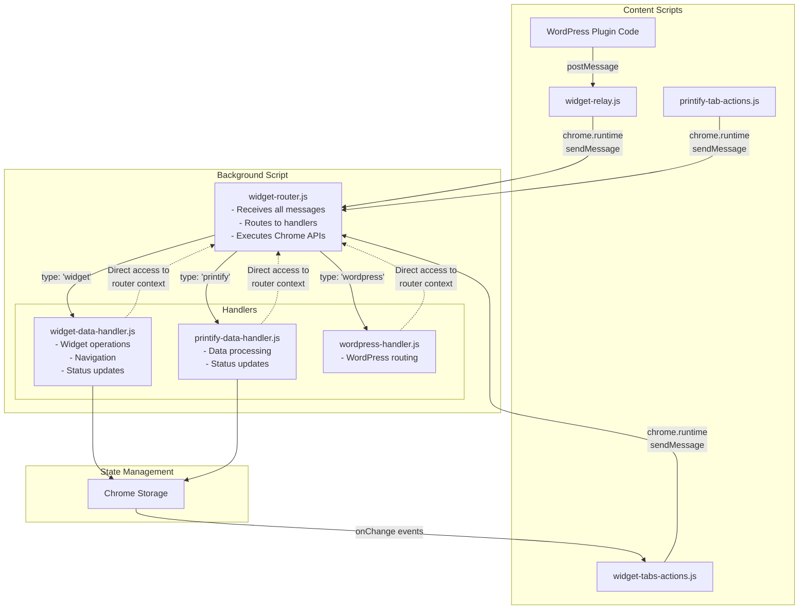

# SiP Printify Manager Browser Extension

**Version:** 4.3.0  
**Last Updated:** January 21, 2025

<!-- DOCUMENTATION RULES:
1. ARCHITECTURAL WHY - Document WHY each component exists (constraints/requirements that necessitate it)
2. NO HISTORY - Current state only, not how we got here  
3. NO DUPLICATION - Each fact appears exactly once
4. EXAMPLES OVER EXPLANATIONS - Show, don't tell
5. UPDATE THE RIGHT SECTION - Check if info already exists before adding

ARCHITECTURAL WHY GUIDELINE:
For each component, briefly explain the constraint or requirement that makes it necessary.
Focus on: Chrome API limitations, message passing rules, code organization needs.
Keep it to 1-2 sentences per component.
-->

## 1. Overview

The SiP Printify Manager browser extension bridges WordPress and Printify, enabling enhanced integration and functionality. It provides a floating widget interface for real-time operations and data synchronization between the two platforms.

### 1.1 Core Principles

**Push-Driven Communication**: The extension uses a push-driven architecture where:
- The extension announces its presence when ready (not polled by WordPress)
- State changes are pushed from extension to WordPress as they occur
- No periodic status checks or ping/pong patterns
- Event-driven updates ensure real-time synchronization

This approach reduces unnecessary message traffic and provides more responsive user experience.

## 2. Architecture Rationale

### 2.1 Why This Architecture?

**Central Router Pattern**: All messages flow through widget-router.js because Chrome extensions don't allow content scripts to intercept runtime messages from other content scripts - they go directly to the background script.

**Separate Action/Handler Scripts**: Content scripts (actions) have limited Chrome API access, while background scripts (handlers) have full access. This separation enforces proper security boundaries.

**Handler Context Pattern**: Instead of message passing between router and handlers, handlers receive a router context object. This eliminates an unnecessary message hop and provides direct access to Chrome APIs.

### 2.2 The Central Router Pattern

**ALL messages in the extension flow through widget-router.js - NO EXCEPTIONS**

The router is the background script and the single message hub that:
- Receives ALL incoming messages (chrome.runtime messages from content scripts and relayed postMessages)
- Routes to appropriate handlers based on message type
- Executes Chrome API commands directly (no separate widget-main.js)
- Returns responses to the originator

### 2.3 Message Flow Diagram


The State Management flow is shown in the Mermaid diagram above, where handlers update Chrome Storage, which triggers onChange events that update the widget UI in widget-tabs-actions.js.

### 2.4 Message Formats

**IMPORTANT**: The extension uses TWO distinct message formats for different communication contexts:

#### External Messages (WordPress ↔ Extension via postMessage)

Used for communication between web pages and the extension. These messages cross the browser security boundary.

**Format**:
```javascript
{
    type: 'SIP_COMMAND_NAME',     // Always prefixed with 'SIP_' for identification
    source: 'sip-printify-manager', // Identifies sender
    requestId: 'unique-id',        // Optional: for response matching
    // Command-specific data
}
```

**Examples**:
- WordPress → Extension: `type: 'SIP_CHECK_STATUS'`, `type: 'SIP_SHOW_WIDGET'`
- Extension → WordPress: `type: 'SIP_EXTENSION_READY'`, `type: 'SIP_EXTENSION_RESPONSE'`

**Why this format**: The 'SIP_' prefix identifies our messages among all postMessages on the page.

#### Internal Messages (Within Extension via chrome.runtime)

Used for communication between extension components (content scripts ↔ background script).

**Format**:
```javascript
{
    type: 'widget' | 'printify' | 'wordpress',  // Determines which handler
    action: 'specificAction',                   // The operation to perform
    data: {                                     // Operation-specific data
        // ...
    }
}
```

**Examples**:
- `{ type: 'widget', action: 'navigateToTab', data: { url: '...' } }`
- `{ type: 'printify', action: 'updateStatus', data: { productId: '...' } }`

**Why this format**: The `type` field routes to specific handlers, `action` specifies the operation.

#### Message Format Conversion

The widget-relay.js converts external messages to internal format:

```
WordPress sends:          { type: 'SIP_SHOW_WIDGET', source: 'sip-printify-manager' }
                            ↓
Relay converts to:        { type: 'WORDPRESS_RELAY', data: { 
                             type: 'wordpress', 
                             action: 'SIP_SHOW_WIDGET',  // Original type becomes action
                             data: {...} 
                          }}
                            ↓
Router unwraps & routes:  { type: 'wordpress', action: 'SIP_SHOW_WIDGET', data: {...} }
```

**Key Point**: Never mix formats. External messages MUST use 'SIP_' prefix. Internal messages MUST use handler/action pattern.

#### Handler Chrome API Requests
Handlers can request Chrome API execution by calling router methods directly:
```javascript
// In handler:
const result = await router.createTab({ url: 'https://example.com' });
const tabs = await router.queryTabs({ url: '*://printify.com/*' });
```

#### Response Format
```javascript
// Success
{
    success: true,
    data: object,
    message: string  // Optional
}

// Error
{
    success: false,
    error: 'Error message',
    code: 'ERROR_CODE',
    timestamp: Date.now()
}
```

**Note**: Error response formatting is centralized in `widget-error.js`. Content scripts use `SiPWidget.Error` methods. The background script (router and handlers) returns plain error objects with `success: false`.

## 3. Component Responsibilities

### 3.1 File Structure
```
browser-extension/
├── manifest.json               # Extension configuration
├── background.js               # Service worker loader - imports all modules
│   Why: Manifest V3 service workers require importScripts() to load modules
├── core-scripts/
│   ├── widget-router.js        # Background script - Central message router & Chrome API executor
│   ├── widget-relay.js         # Content script - Relays WordPress postMessages to router
│   ├── widget-debug.js         # Debug utilities
│   ├── widget-error.js         # Error response formatting
│   └── widget-styles.css       # Widget styling
├── action-scripts/
│   ├── widget-tabs-actions.js          # Widget UI creation and button handling
│   ├── printify-tab-actions.js         # Printify page monitoring and scraping
│   └── printify-api-interceptor-actions.js # API discovery monitor
├── handler-scripts/
│   ├── widget-data-handler.js          # Widget operation logic
│   ├── printify-data-handler.js        # Printify data processing
│   ├── wordpress-handler.js            # WordPress message routing
│   └── printify-api-interceptor-handler.js # API discovery processing
└── assets/                     # Images and static files
```

**Manifest Configuration**:
```json
{
    "background": {
        "service_worker": "background.js"
    },
    "content_scripts": [
        {
            "matches": ["https://printify.com/*"],
            "js": [
                "core-scripts/widget-debug.js",
                "core-scripts/widget-error.js",
                "action-scripts/printify-tab-actions.js",
                "action-scripts/printify-api-interceptor-actions.js",
                "action-scripts/widget-tabs-actions.js"
            ]
        },
        {
            "matches": ["*://*/wp-admin/*"],
            "js": [
                "core-scripts/widget-debug.js",
                "core-scripts/widget-error.js",
                "core-scripts/widget-relay.js",
                "action-scripts/widget-tabs-actions.js"
            ]
        }
    ]
}
```

**Naming Standards**:

**Action Scripts** (content scripts that detect events and send messages):
- Must end with `-actions.js` suffix
- Examples: `widget-tabs-actions.js`, `printify-tab-actions.js`, `printify-api-interceptor-actions.js`
- Located in `action-scripts/` directory

**Handler Scripts** (background scripts that process messages):
- Must end with `-handler.js` suffix (always singular)
- Examples: `widget-data-handler.js`, `printify-data-handler.js`, `printify-api-interceptor-handler.js`
- Located in `handler-scripts/` directory

**Paired Features**: Complex features should have matching action/handler pairs:
- `printify-api-interceptor-actions.js` → `printify-api-interceptor-handler.js`
- This makes it clear which handler processes which action script's events

### 3.2 Core Scripts

#### widget-router.js (Background Script)
**Why it exists**: Chrome extensions require a background script to access privileged APIs (tabs, cross-origin requests). Making the router the background script ensures ALL messages flow through one central point as documented.

- Receives ALL chrome.runtime.sendMessage calls from content scripts
- Routes messages to handlers based on 'type' field  
- Executes Chrome API commands directly (no separate widget-main.js)
- Provides router context to handlers with Chrome API methods
- Sends responses back to message originators
- Forwards messages to content scripts via chrome.tabs.sendMessage when needed

#### widget-relay.js (Content Script - WordPress pages only)
**Why it exists**: WordPress can only use window.postMessage() which content scripts can receive, but the router (background script) cannot. This relay bridges that gap.

- Listens for postMessage events from WordPress
- Validates message source and format
- Relays WordPress messages to router via chrome.runtime.sendMessage
- Returns responses back to WordPress via postMessage

### 3.3 Action Scripts

#### widget-tabs-actions.js
**Why it exists**: The widget UI needs to be injected into specific pages (SiP Printify Manager and Printify) to provide consistent user access. Separating UI from page-specific logic keeps code organized.

- Creates and manages the floating widget UI
- **Only shows on**: SiP Printify Manager pages (`page=sip-printify-manager`) and Printify.com
- Handles widget button clicks (navigation, status checks, etc.)
- Updates widget display based on Chrome storage changes
- Sends user-initiated actions to router
- Does NOT handle Printify page-specific actions

#### printify-tab-actions.js
**Why it exists**: Printify pages need specific DOM monitoring and scraping logic that would bloat the general widget code. This separation keeps Printify-specific logic isolated.

- Monitors Printify pages for DOM changes
- Detects page state and product information
- Detects inventory changes (future)
- Sends detected events to router
- Does NOT handle widget UI

#### printify-api-interceptor-actions.js
**Why it exists**: API interception is a complex feature requiring significant code for request monitoring and pattern analysis. It warrants its own dedicated file for maintainability.

- Intercepts Printify API calls
- Captures API patterns and responses
- Sends captured data to router for processing

### 3.4 Handler Scripts

#### widget-data-handler.js
**Why it exists**: Widget operations (navigation, config, UI state) are distinct from data operations and need their own business logic layer in the background context.

Processes widget-related operations:
- Navigation between tabs
- Widget state management
- Configuration updates
- **Required actions**: `showWidget`, `toggleWidget`, `navigate`, `updateState`, `getConfig`, `updateConfig`, `testConnection`, `checkPluginStatus`

#### mockup-fetch-handler.js
**Why it exists**: Mockup fetching is a complex multi-step operation requiring tab management, API interception, data processing, and WordPress communication. This dedicated handler isolates all mockup-related logic and provides clean separation from other extension functionality.

Processes mockup fetching operations:
- Navigates to Printify mockup library pages
- Intercepts `generated-mockups-map` API responses  
- Extracts blueprint-agnostic mockup data (one color variant only)
- Sends processed data back to WordPress
- **Required actions**: `fetchMockups`

#### printify-data-handler.js
**Why it exists**: Complex multi-step operations like api interception need coordination logic that can access Chrome APIs. Separating this from UI logic enables cleaner testing and maintenance.

Processes Printify data operations:
- Data validation and formatting
- WordPress API communication coordination
- Status update management
- Routes mockup requests to MockupFetchHandler

#### wordpress-handler.js
**Why it exists**: WordPress sends differently formatted messages (SIP_FETCH_MOCKUPS vs fetchMockups). This handler translates WordPress commands to the extension's internal message format.

Routes WordPress postMessage commands to appropriate handlers:
- Converts WordPress message formats to extension formats
- Routes to widget or printify handlers based on command
- **Supported commands**: `SIP_FETCH_MOCKUPS`, `SIP_NAVIGATE`, `SIP_SHOW_WIDGET`, `SIP_CHECK_STATUS`

#### printify-api-interceptor-handler.js
**Why it exists**: Captured API data needs processing and storage logic separate from the capture mechanism. This separation allows the action script to focus on interception while the handler manages data.

Processes captured API data:
- Analyzes API patterns
- Stores discovered endpoints
- Manages API knowledge base

## 4. Chrome Extension Constraints

### 4.1 API Access Limitations

**Background Script (widget-router.js and handlers loaded by background.js)**
- Full Chrome API access
- Can make cross-origin requests
- Can manage tabs, windows, storage
- Runs as a service worker in Manifest V3
- **CRITICAL**: No DOM access - cannot use `window`, `document`, or DOM APIs
- Must check `typeof window !== 'undefined'` before using window
- Service worker errors prevent ALL content scripts from loading

**Content Scripts (action scripts and widget-relay.js)**
- Limited Chrome API access
- Can use: chrome.storage, chrome.runtime.sendMessage
- CANNOT use: chrome.tabs, chrome.windows, cross-origin fetch
- Must request privileged operations from the background script

### 4.2 Message Passing Architecture

**Key Constraint**: Content scripts cannot intercept chrome.runtime.sendMessage calls from other content scripts. These messages go directly to the background script.

This is why the router MUST be the background script - it's the only way to receive all messages as documented.

**Message Flow**:
- postMessage can only be received by content scripts injected into the page
- chrome.runtime.sendMessage sends messages directly to the background script (router)
- The router uses chrome.tabs.sendMessage to communicate with specific content scripts
- WordPress postMessage messages are relayed to the router by widget-relay.js

## 5. Common Operations

### 5.1 Status Update Flow

1. WordPress plugin: `window.postMessage({ type: 'SIP_CHECK_STATUS', source: 'sip-printify-manager' })`
2. widget-relay.js receives postMessage and relays to router via chrome.runtime.sendMessage
3. widget-router.js receives and routes to widget-data-handler.js (via wordpress-handler.js)
4. Handler uses router context to check plugin status
5. Handler updates Chrome storage with status
6. widget-tabs-actions.js updates UI from storage change
7. Response sent back through relay to WordPress

### 5.2 Adding New Features

To add a new feature (e.g., inventory monitoring):

1. **Add action detection** in appropriate action script
2. **Define message format**: `{ type: 'printify', action: 'inventoryChanged', data: {...} }`
3. **Add handler logic** in appropriate handler file
4. **If routing through wordpress-handler.js**, ensure the target handler implements the action
5. **Add any Chrome API methods** to router context if needed
6. **Update Chrome storage schema** for new state
7. **Update widget UI** to display new information

**CRITICAL**: When adding routing in wordpress-handler.js, you MUST implement the corresponding action in the target handler.

## 6. Implementation Standards

### 6.1 Module Pattern

All scripts use IIFE pattern with SiPWidget namespace:

**Content Scripts**:
```javascript
var SiPWidget = window.SiPWidget || {};
SiPWidget.ModuleName = (function() {
    'use strict';
    
    const debug = window.widgetDebug || { log: () => {}, error: () => {}, warn: () => {} };
    
    // Private members
    
    // Public API
    return {
        init: function() {},
        publicMethod: function() {}
    };
})();
```

**Background Scripts** (service workers):
```javascript
var SiPWidget = self.SiPWidget || {};  // Note: 'self' not 'window'
SiPWidget.ModuleName = (function() {
    'use strict';
    
    // In service workers, use console directly
    const debug = {
        log: (...args) => console.log('[Module Name]', ...args),
        error: (...args) => console.error('[Module Name]', ...args),
        warn: (...args) => console.warn('[Module Name]', ...args)
    };
    
    // Private members
    
    // Public API
    return {
        handle: function() {}
    };
})();
```

### 6.2 Message Handling Pattern

Every handler follows this pattern:
```javascript
function handle(request, sender, sendResponse, router) {
    debug.log('Processing:', request.action);
    
    switch (request.action) {
        case 'specificAction':
            handleSpecificAction(request.data, router)
                .then(result => sendResponse(result))
                .catch(error => sendResponse({
                    success: false,
                    error: error.message || error.toString(),
                    code: 'HANDLER_ERROR'
                }));
            return true; // Keep channel open
            
        default:
            sendResponse({
                success: false,
                error: 'Unknown action: ' + request.action,
                code: 'UNKNOWN_ACTION'
            });
    }
}
```

### 6.3 Handler Context

Handlers run in the background script context and have access to router methods:
```javascript
// Handler has access to router context
function handle(request, sender, sendResponse, router) {
    // Can call router methods directly
    router.createTab({ url: 'https://example.com' })
        .then(tab => sendResponse({ success: true, tabId: tab.id }))
        .catch(error => sendResponse({ success: false, error: error.message }));
    return true; // Keep channel open
}
```

## 7. Storage Management

### 7.1 State Storage

All UI state stored in Chrome storage for cross-tab sync:
```javascript
chrome.storage.local.set({
    sipWidgetState: {
        isExpanded: boolean,
        position: { x, y },
        currentOperation: { /* ... */ },
        // Feature-specific state
    }
});
```

### 7.2 Storage Limits

- Chrome storage has 5MB limit
- Monitor usage and prune old operation history
- Use efficient data structures

## 8. Configuration and Deployment

### 8.1 Extension Configuration

The extension supports two configuration modes:

#### Pre-configured Deployment
Bundle the extension with a `config.json` file in the `assets/` directory:

```json
{
    "wordpressUrl": "https://your-wordpress-site.com",
    "apiKey": "your-32-character-api-key",
    "autoSync": false,
    "configured": true
}
```

**Fields:**
- `wordpressUrl`: The WordPress site URL where SiP Printify Manager is installed
- `apiKey`: 32-character API key from WordPress plugin settings
- `autoSync`: Reserved for future use (currently unused)
- `configured`: Must be `true` to use pre-configuration

**⚠️ SECURITY WARNING**: Never commit `config.json` with real API keys to version control. The browser-extension directory already has a `.gitignore` file, but it should be updated to use the correct path:
```
# Current (incorrect):
config.json

# Should be:
assets/config.json
```

#### User-configured Deployment
Ship without `config.json` or with `configured: false`. Users configure through:
1. Extension popup/options page
2. Settings stored in Chrome sync storage
3. Persists across browser sessions

### 8.2 Configuration Loading Order

1. On startup, router checks for `assets/config.json`
2. If found AND `configured: true`, uses those values
3. Values are copied to Chrome storage for persistence
4. If not found or `configured: false`, loads from Chrome storage
5. Updates extension badge based on configuration state:
   - ✓ Green badge: Configured and ready
   - ! Orange badge: Configuration required

**Note**: The `config.json` file is included in manifest's `web_accessible_resources` to allow the background script to fetch it using `chrome.runtime.getURL()`.

## 9. WordPress Integration

### 9.1 Extension Detection and Installation Flow

#### Chrome Content Script Injection Behavior

**Critical Chrome Limitation**: When a Chrome extension is installed, its content scripts are NOT automatically injected into already-open tabs. This is a well-documented Chrome behavior that requires either:
1. Manual page reload by the user
2. Programmatic injection by the extension

#### Understanding Content Scripts vs Widget UI

**Content Scripts** are JavaScript files that run in the context of web pages:
- `widget-relay.js` - Message bridge between WordPress and extension
- `widget-tabs-actions.js` - Creates the floating widget UI
- `widget-debug.js` & `widget-error.js` - Utility functions

**Key Distinction**: 
- `widget-relay.js` does NOT create any UI - it only handles messages
- `widget-tabs-actions.js` is responsible for creating the floating widget interface
- Both are content scripts but serve different purposes

#### Installation Flow - Detailed

```
USER INSTALLS EXTENSION:
1. User clicks "Install Extension" button in WordPress
2. Installation wizard guides user through Chrome extension installation
3. Extension installed in Chrome

PROGRAMMATIC INJECTION (Immediate activation):
4. Background script (widget-router.js) detects installation via chrome.runtime.onInstalled
5. Background script queries for all WordPress admin tabs
6. For each WordPress tab, programmatically injects ALL content scripts:
   - widget-debug.js (utilities)
   - widget-error.js (error handling)
   - widget-relay.js (message bridge)
   - widget-tabs-actions.js (widget UI creator)
7. Content scripts now active without page reload!

EXTENSION ANNOUNCES ITSELF:
8. widget-relay.js executes and sends SIP_EXTENSION_READY to WordPress
9. WordPress receives announcement and:
   - Sets extensionState.isInstalled = true
   - Hides "Install Extension" button
   - May send SIP_SHOW_WIDGET message
10. widget-tabs-actions.js creates/shows the floating widget

RESULT: Extension detected, page reload recommended for reliability
```

#### Why This Flow?

1. **Programmatic Injection**: Solves Chrome's limitation by injecting scripts immediately
2. **Push-Driven Detection**: Extension announces when ready, no polling needed
3. **Separation of Concerns**: 
   - Message relay separate from UI creation
   - Each script has a single responsibility
4. **Immediate Functionality**: User doesn't need to reload page manually

#### Implementation Details

**Extension Side - Programmatic Injection** (widget-router.js):
```javascript
chrome.runtime.onInstalled.addListener(async (details) => {
    if (details.reason === 'install' || details.reason === 'update') {
        // Find all WordPress admin tabs
        const tabs = await chrome.tabs.query({ url: '*://*/wp-admin/*' });
        
        for (const tab of tabs) {
            try {
                // Inject content scripts in order
                await chrome.scripting.executeScript({
                    target: { tabId: tab.id },
                    files: [
                        'core-scripts/widget-debug.js',
                        'core-scripts/widget-error.js',
                        'core-scripts/widget-relay.js',
                        'action-scripts/widget-tabs-actions.js'
                    ]
                });
                
                // Inject CSS
                await chrome.scripting.insertCSS({
                    target: { tabId: tab.id },
                    files: ['core-scripts/widget-styles.css']
                });
            } catch (error) {
                debug.log('Could not inject into tab:', tab.id, error);
            }
        }
    }
});
```

**Extension Side - Announcement** (widget-relay.js):
```javascript
// Small delay ensures WordPress listeners are ready
// NOTE: This setTimeout is a legitimate use - see Coding Guidelines "Legitimate setTimeout Usage"
// It's an industry-standard pattern for content script announcements, not a timing workaround
setTimeout(() => {
    window.postMessage({
        type: 'SIP_EXTENSION_READY',
        source: 'sip-printify-extension',
        version: chrome.runtime.getManifest().version,
        capabilities: {
            statusUpdates: true,
            apiInterception: true,
            navigation: true
        }
    }, window.location.origin);
}, 100);
```

**WordPress Side - Detection** (browser-extension-manager.js):
```javascript
// Set up listener early in page lifecycle
document.addEventListener('DOMContentLoaded', function() {
    window.addEventListener('message', function(event) {
        if (event.data && event.data.type === 'SIP_EXTENSION_READY' && 
            event.data.source === 'sip-printify-extension') {
            // Extension detected - update UI
            extensionState.isInstalled = true;
            extensionState.version = event.data.version;
            extensionState.isConnected = true;
            extensionState.capabilities = event.data.capabilities;
            updateButtonState();
        }
    });
});
```

#### Message Flow Directions

**WordPress → Extension**:
- WordPress uses `window.postMessage()` (only option for web pages)
- `widget-relay.js` receives and forwards to background via `chrome.runtime.sendMessage()`
- Relay is REQUIRED because background scripts can't receive postMessages

**Extension → WordPress**:
- Content scripts use `window.postMessage()` directly
- No relay needed - direct communication
- `widget-relay.js` announces presence, not relaying

#### Key Benefits

1. **Simple Page Reload**: Most reliable approach for Chrome extension activation
2. **Immediate Feedback**: Clear installation complete message
3. **Clean Architecture**: Each component has clear responsibility
4. **Reliable Detection**: Manifest-based loading eliminates race conditions
5. **Better UX**: Quick automatic reload is better than uncertain waiting

### 9.2 Sending Commands

From WordPress plugin:
```javascript
window.postMessage({
    type: 'SIP_COMMAND_NAME',
    source: 'sip-printify-manager',
    requestId: generateUniqueId(),
    // Command-specific data
}, '*');
```

### 9.3 REST API Endpoints

Extension calls these WordPress endpoints:
- `POST /wp-json/sip-printify/v1/extension-status`
- `GET /wp-json/sip-printify/v1/plugin-status`

Authentication via header: `X-SiP-API-Key: [32-character-key]`

## 10. Development Guidelines

### 10.1 Widget Visibility Requirements

**Widget Initialization**:
- Widget MUST start with `sip-visible` class for immediate visibility
- Default position MUST be within viewport bounds
- For top-right positioning: `x: window.innerWidth - 340, y: 20` (accounts for 320px expanded width)
- Position validation should account for both collapsed (60px) and expanded (320px) widths

**CSS Classes**:
- `sip-visible`: Required for widget to be visible (adds opacity: 1, visibility: visible)
- `collapsed`/`expanded`: Controls widget state
- Never rely on inline styles for critical visibility

**Debugging "Missing" Widget**:
1. Check if widget is actually loaded but positioned off-screen
2. Look for `[Widget UI]` console messages
3. Inspect DOM for `#sip-floating-widget` element
4. Verify position values in inline styles

### 10.2 Adding New Operations

1. Start with the trigger (user action or page event)
2. Define the message format
3. Add routing logic if new handler type
4. Implement handler logic
5. Define Chrome API commands if needed
6. Update storage schema if needed
7. Update UI components if needed

### 9.2 Debugging

- Enable debug mode: `chrome.storage.local.set({sip_printify_debug: true})`
- Check router for message flow
- Verify message formats match documentation
- Check Chrome DevTools for both page and extension contexts

### 9.3 Testing Checklist

- [ ] Run `node validate-manifest.js` to check manifest integrity
- [ ] Check chrome://extensions for ANY errors or warnings
- [ ] Click "service worker" link and check for console errors
- [ ] Verify no BOM characters in JSON files: `file manifest.json` should show "ASCII text" not "UTF-8 Unicode (with BOM) text"
- [ ] Add `console.log()` at top of problematic scripts to verify they load
- [ ] Check that widget appears on screen (not just loaded)
- [ ] Messages route correctly through widget-router.js
- [ ] Handlers process actions and return proper responses
- [ ] Chrome API commands execute directly in router context
- [ ] State updates propagate via Chrome storage
- [ ] Widget UI reflects state changes
- [ ] Error cases return standardized error responses

### 9.4 Common Pitfalls

**Manifest Corruption**:
- Chrome silently fails on manifest parsing errors
- BOM characters cause content_scripts to not load
- Always validate manifest.json before testing
- Check service worker console for hidden errors

**Partial Loading**:
- Extension can appear to work with corrupt manifest
- Background scripts may load while content scripts don't
- Programmatic injection can mask manifest issues

## Appendices

### A. Chrome Assets

Images requiring chrome.runtime.getURL must be in manifest.json:
```json
"web_accessible_resources": [{
    "resources": ["assets/images/Scanning.gif"],
    "matches": ["<all_urls>"]
}]
```

### B. Architecture Implementation Notes

The router MUST be the background script because:
1. Chrome extensions don't allow content scripts to intercept runtime messages
2. All chrome.runtime.sendMessage calls go directly to the background script
3. This is the only way to achieve the "ALL messages flow through router" requirement

Key implementation details:
1. background.js loads all modules via importScripts in the correct order
2. Handlers are loaded in the background context and receive router context
3. widget-relay.js handles WordPress postMessage relay in content script context
4. All Chrome API execution happens directly in the router, no separate executor needed

# SiP Printify Manager Browser Extension - TODO

## Low Priority Enhancements

### 1. History View Feature
- Implement history view for captured data and actions
- Referenced in widget-tabs-actions.js:781

### 2. Auto-Sync Feature  
- The `autoSync` field in config.json is reserved for future use
- Would enable automatic synchronization of data between WordPress and Printify

### 3. Inventory Monitoring
- Example feature mentioned in documentation
- Would detect and report inventory changes on Printify pages

## Completed Items
- ✅ Central router architecture implemented
- ✅ All handlers converted to singular naming
- ✅ Service worker compatibility ensured
- ✅ Push-driven communication model implemented
- ✅ Widget visibility restricted to appropriate pages
- ✅ Proper error handling with standardized responses
- ✅ Configuration system with pre-configured and user-configured modes
- ✅ Installation flow with automatic page reload
- ✅ All deprecated code removed (widget-main.js, plural handler names)
- ✅ Documentation fully updated to reflect current implementation