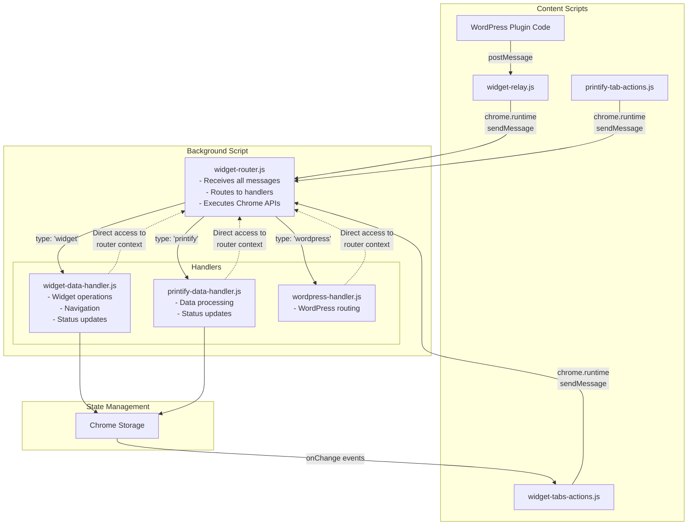

# SiP Printify Manager Browser Extension

**Version:** 1.0.0 (Independent Release)  
**Last Updated:** January 21, 2025

**Repository Location**: Flexible - can be located anywhere on the file system when added via SiP Development Tools  
**GitHub:** https://github.com/tdemelle-SiP/sip-printify-manager-extension

<!-- DOCUMENTATION RULES:
1. ARCHITECTURAL WHY - Document WHY each component exists (constraints/requirements that necessitate it)
2. NO HISTORY - Current state only, not how we got here  
3. NO DUPLICATION - Each fact appears exactly once
4. EXAMPLES OVER EXPLANATIONS - Show, don't tell
5. UPDATE THE RIGHT SECTION - Check if info already exists before adding

ARCHITECTURAL WHY GUIDELINE:
For each component, briefly explain the constraint or requirement that makes it necessary.
Focus on: Chrome API limitations, message passing rules, code organization needs.
Keep it to 1-2 sentences per component.
-->

## 1. Overview

The SiP Printify Manager browser extension is a standalone Chrome Web Store extension that integrates with the SiP Printify Manager WordPress plugin. It provides enhanced mockup data access and automated workflow capabilities that cannot be achieved through Printify's public API alone.

### 1.1 Distribution & Update Architecture

**Chrome Web Store Distribution**: Extension is published as "unlisted" on Chrome Web Store to provide automatic updates while maintaining privacy. Users install via direct Chrome Web Store link provided by the WordPress plugin.

**Independent Release Management**: Extension follows the same Git workflow and automated release system as other SiP plugins, with its own repository and version numbering independent of the WordPress plugin.

**SiP Ecosystem Integration**: Extension appears in SiP Plugins Core dashboard alongside other plugins, with version tracking, update notifications, and installation management integrated into the SiP platform.

### 1.2 Core Principles

**Push-Driven Communication**: The extension uses a push-driven architecture where:
- The extension announces its presence when ready (not polled by WordPress)
- State changes are pushed from extension to WordPress as they occur
- No periodic status checks or ping/pong patterns
- Event-driven updates ensure real-time synchronization
- **No state persistence**: Extension state is NOT saved between page loads - the extension must announce itself each time

This approach reduces unnecessary message traffic, provides more responsive user experience, and ensures accurate extension detection.

**Version Management Integration**: Extension version is communicated to WordPress on ready announcement but is NOT persisted. The extension must announce itself on each page load to be considered installed, ensuring accurate detection state.

**Data Processing Separation**: Extension acts as a "dumb pipe" capturing and relaying raw data, while WordPress handles all processing, validation, and business logic.

**Fresh Detection Model**: Extension installation state is never persisted. The extension must announce itself on each page load to be considered installed. This ensures the "Install Extension" button always appears when the extension is not actually present, eliminating stale state issues.

## 2. Distribution & Release Management

### 2.1 Chrome Web Store Integration

**Publication Model**: Extension is published as "unlisted" on Chrome Web Store, making it accessible only via direct link while providing automatic update functionality.

**Automatic Updates**: Chrome handles extension updates automatically every 5-6 hours when new versions are published to the store, eliminating manual installation requirements.

**Installation Flow**: WordPress plugin provides direct Chrome Web Store installation link, replacing embedded extension files and manual filesystem access.

### 2.2 Independent Repository Structure

**Separate Repository**: Extension maintains its own `sip-printify-manager-extension` repository with standard SiP Git workflow (develop → master branches).

**Version Independence**: Extension versioning is independent from WordPress plugin, starting at v1.0.0 and following semantic versioning.

**Repository Management**: The extension repository is managed through the SiP Development Tools repository manager system, which allows flexible repository locations anywhere on the file system. See [Release Management Documentation](./sip-development-release-mgmt.md#repository-management) for details on adding and managing extension repositories.

### 2.3 SiP Ecosystem Integration

**SiP Core Dashboard Integration**: Extension appears as a first-class tool in SiP Plugins Core dashboard alongside WordPress plugins with:
- Version display and update notifications
- Installation status and connection monitoring  
- Auto-update preference toggle
- Chrome Web Store installation links

**SiP Development Tools Integration**: For development and release management, the extension repository must be manually added to SiP Development Tools using the repository manager. Once added, it appears in the release management table with the same capabilities as WordPress plugins.

**Data Storage Compliance**: Extension preferences (NOT installation status) use SiP data storage patterns:
- Client-side: Extension preferences only (NOT installation state)
- Server-side: WordPress options for extension preferences
- State management: Extension must announce itself each page load - no persistence of installation status

**Update Server Integration**: Stuffisparts update server includes extension data for dashboard version checking and update notifications.

### 2.4 Release Process Integration

**Unified Release System**: The extension uses the same automated release system as WordPress plugins through SiP Development Tools. The system supports both plugin and extension releases with type-specific handling.

**Extension-Specific Features**:
- Chrome Web Store API integration for automated publishing
- Extension packaging and validation via `release-extension.ps1`
- Store submission and review process automation
- Stuffisparts data file updates for version tracking

**Repository Requirements**: To enable release management:
1. Extension repository must be added to SiP Development Tools via "Add Repository" button
2. Repository must contain valid `manifest.json` file
3. Repository must be a Git repository with `develop` and `master` branches

**Version Synchronization**: Release system updates both Chrome Web Store and stuffisparts server data to maintain dashboard accuracy.

**Rollback Capability**: Failed releases can be rolled back via Chrome Web Store developer console while maintaining version tracking integrity.

## 3. Technical Architecture

### 3.1 Version Communication Protocol

**Extension Ready Announcement**: Extension announces version on load:
```javascript
window.postMessage({
    type: 'SIP_EXTENSION_READY',
    source: 'sip-printify-extension',
    version: chrome.runtime.getManifest().version,
    capabilities: { ... }
}, window.location.origin);
```

**WordPress Version Capture**: Browser extension manager captures version but does NOT persist it:
```javascript
extensionState.version = data.version;
// No state persistence - fresh detection on each page load
// Extension must announce itself to be considered installed
```

**Update Checking**: WordPress compares local version against stuffisparts server data for update notifications.

## 4. Architecture Rationale

### 4.1 Why This Architecture?

**Central Router Pattern**: All messages flow through widget-router.js because Chrome extensions don't allow content scripts to intercept runtime messages from other content scripts - they go directly to the background script.

**Separate Action/Handler Scripts**: Content scripts (actions) have limited Chrome API access, while background scripts (handlers) have full access. This separation enforces proper security boundaries.

**Handler Context Pattern**: Instead of message passing between router and handlers, handlers receive a router context object. This eliminates an unnecessary message hop and provides direct access to Chrome APIs.

### 2.2 The Central Router Pattern

**ALL messages in the extension flow through widget-router.js - NO EXCEPTIONS**

The router is the background script and the single message hub that:
- Receives ALL incoming messages (chrome.runtime messages from content scripts and relayed postMessages)
- Routes to appropriate handlers based on message type
- Executes Chrome API commands directly (no separate widget-main.js)
- Returns responses to the originator

### 2.3 Message Flow Diagram


The State Management flow is shown in the Mermaid diagram above, where handlers update Chrome Storage, which triggers onChange events that update the widget UI in widget-tabs-actions.js.

### 2.4 Message Formats

**IMPORTANT**: The extension uses TWO distinct message formats for different communication contexts:

#### External Messages (WordPress ↔ Extension via postMessage)

Used for communication between web pages and the extension. These messages cross the browser security boundary.

**Format**:
```javascript
{
    type: 'SIP_COMMAND_NAME',     // Always prefixed with 'SIP_' for identification
    source: 'sip-printify-manager', // Identifies sender
    requestId: 'unique-id',        // Optional: for response matching
    // Command-specific data
}
```

**Examples**:
- WordPress → Extension: `type: 'SIP_CHECK_STATUS'`, `type: 'SIP_SHOW_WIDGET'`
- Extension → WordPress: `type: 'SIP_EXTENSION_READY'`, `type: 'SIP_EXTENSION_RESPONSE'`

**Why this format**: The 'SIP_' prefix identifies our messages among all postMessages on the page.

#### Internal Messages (Within Extension via chrome.runtime)

Used for communication between extension components (content scripts ↔ background script).

**Format**:
```javascript
{
    type: 'widget' | 'printify' | 'wordpress',  // Determines which handler
    action: 'specificAction',                   // The operation to perform
    data: {                                     // Operation-specific data
        // ...
    }
}
```

**Examples**:
- `{ type: 'widget', action: 'navigateToTab', data: { url: '...' } }`
- `{ type: 'printify', action: 'updateStatus', data: { productId: '...' } }`

**Why this format**: The `type` field routes to specific handlers, `action` specifies the operation.

#### Message Format Conversion

The widget-relay.js converts external messages to internal format:

```
WordPress sends:          { type: 'SIP_SHOW_WIDGET', source: 'sip-printify-manager' }
                            ↓
Relay converts to:        { type: 'WORDPRESS_RELAY', data: { 
                             type: 'wordpress', 
                             action: 'SIP_SHOW_WIDGET',  // Original type becomes action
                             data: {...} 
                          }}
                            ↓
Router unwraps & routes:  { type: 'wordpress', action: 'SIP_SHOW_WIDGET', data: {...} }
```

**Key Point**: Never mix formats. External messages MUST use 'SIP_' prefix. Internal messages MUST use handler/action pattern.

#### Request-Response Correlation

**Why Request IDs**: When multiple async operations run concurrently (e.g., fetching mockups for 4 blueprints), responses must be matched to their originating requests to prevent race conditions.

**Implementation Pattern**:
```javascript
// WordPress sends request with unique ID
const requestId = 'operation_' + itemId + '_' + Date.now();
window.postMessage({
    type: 'SIP_COMMAND_NAME',
    source: 'sip-printify-manager',
    requestId: requestId,  // Required for async operations
    data: { /* request data */ }
}, '*');

// Set up response listener BEFORE sending request
const responseHandler = function(event) {
    if (event.data && 
        event.data.type === 'SIP_EXTENSION_RESPONSE' &&
        event.data.requestId === requestId) {  // Match by requestId
        
        window.removeEventListener('message', responseHandler);
        const response = event.data.response;
        // Process response...
    }
};
window.addEventListener('message', responseHandler);
```

**CRITICAL**: The relay preserves the requestId in wrapped responses:
```javascript
// Extension → WordPress (via relay)
{
    type: 'SIP_EXTENSION_RESPONSE',
    requestId: 'operation_6_1642351234567',  // Preserved from request
    response: { /* actual response data */ }
}
```

#### Handler Chrome API Requests
Handlers can request Chrome API execution by calling router methods directly:
```javascript
// In handler:
const result = await router.createTab({ url: 'https://example.com' });
const tabs = await router.queryTabs({ url: '*://printify.com/*' });
```

#### Response Format
```javascript
// Success
{
    success: true,
    data: object,
    message: string  // Optional
}

// Error
{
    success: false,
    error: 'Error message',
    code: 'ERROR_CODE',
    timestamp: Date.now()
}
```

**Note**: Error response formatting is centralized in `widget-error.js`. Content scripts use `SiPWidget.Error` methods. The background script (router and handlers) returns plain error objects with `success: false`.

## 3. Component Responsibilities

### 3.1 File Structure
```
browser-extension/
├── manifest.json               # Extension configuration
├── background.js               # Service worker loader - imports all modules
│   Why: Manifest V3 service workers require importScripts() to load modules
├── core-scripts/
│   ├── widget-router.js        # Background script - Central message router & Chrome API executor
│   ├── widget-relay.js         # Content script - Relays WordPress postMessages to router
│   ├── widget-debug.js         # Debug utilities
│   ├── widget-error.js         # Error response formatting
│   └── widget-styles.css       # Widget styling
├── action-scripts/
│   ├── widget-tabs-actions.js          # Widget UI creation and button handling
│   ├── printify-tab-actions.js         # Printify page monitoring and scraping
│   └── printify-api-interceptor-actions.js # API discovery monitor
├── handler-scripts/
│   ├── widget-data-handler.js          # Widget operation logic
│   ├── printify-data-handler.js        # Printify data processing
│   ├── wordpress-handler.js            # WordPress message routing
│   └── printify-api-interceptor-handler.js # API discovery processing
└── assets/                     # Images and static files
```

**Manifest Configuration**:
```json
{
    "background": {
        "service_worker": "background.js"
    },
    "content_scripts": [
        {
            "matches": ["https://printify.com/*"],
            "js": [
                "core-scripts/widget-debug.js",
                "core-scripts/widget-error.js",
                "action-scripts/printify-tab-actions.js",
                "action-scripts/printify-api-interceptor-actions.js",
                "action-scripts/widget-tabs-actions.js"
            ]
        },
        {
            "matches": ["*://*/wp-admin/*"],
            "js": [
                "core-scripts/widget-debug.js",
                "core-scripts/widget-error.js",
                "core-scripts/widget-relay.js",
                "action-scripts/widget-tabs-actions.js"
            ]
        }
    ]
}
```

**Naming Standards**:

**Action Scripts** (content scripts that detect events and send messages):
- Must end with `-actions.js` suffix
- Examples: `widget-tabs-actions.js`, `printify-tab-actions.js`, `printify-api-interceptor-actions.js`
- Located in `action-scripts/` directory

**Handler Scripts** (background scripts that process messages):
- Must end with `-handler.js` suffix (always singular)
- Examples: `widget-data-handler.js`, `printify-data-handler.js`, `printify-api-interceptor-handler.js`
- Located in `handler-scripts/` directory

**Paired Features**: Complex features should have matching action/handler pairs:
- `printify-api-interceptor-actions.js` → `printify-api-interceptor-handler.js`
- This makes it clear which handler processes which action script's events

### 3.2 Core Scripts

#### widget-router.js (Background Script)
**Why it exists**: Chrome extensions require a background script to access privileged APIs (tabs, cross-origin requests). Making the router the background script ensures ALL messages flow through one central point as documented.

- Receives ALL chrome.runtime.sendMessage calls from content scripts
- Routes messages to handlers based on 'type' field  
- Executes Chrome API commands directly (no separate widget-main.js)
- Provides router context to handlers with Chrome API methods
- Sends responses back to message originators
- Forwards messages to content scripts via chrome.tabs.sendMessage when needed

#### widget-relay.js (Content Script - WordPress pages only)
**Why it exists**: WordPress can only use window.postMessage() which content scripts can receive, but the router (background script) cannot. This relay bridges that gap.

- Listens for postMessage events from WordPress
- Validates message source and format
- Relays WordPress messages to router via chrome.runtime.sendMessage
- Returns responses back to WordPress via postMessage

#### widget-debug.js (Core Debug Module)
**Why it exists**: Provides centralized debug logging and cross-tab console log capture. During complex operations spanning multiple tabs (WordPress ↔ Printify), logs from both contexts are captured and preserved for debugging.

- Intercepts console.log/error/warn calls containing SiP-related prefixes
- Formats logs consistently: `[HH:MM:SS] Source: Message`
- Stores logs as pre-formatted strings in Chrome storage (max 1MB)
- Provides debug methods that respect enabled/disabled state
- Exposes `storeLogEntry()` for other modules to store formatted logs

**Key Functions**:
- `formatLogEntry(source, level, message)` - Centralized log formatting
- `captureLog(level, args)` - Intercepts and formats console output
- `storeLogEntry(entry)` - Stores formatted string with size management
- `getConsoleLogs(callback)` - Retrieves stored logs for history viewing
- `clearConsoleLogs()` - Clears all stored logs

**Storage Format** (Updated 2025-06-17):
```javascript
// Chrome storage key: 'sipConsoleLogs'
// Value: Array of formatted strings
[
    "[10:30:45] WordPress: Fetching mockups for Blueprint #6",
    "[10:30:45] Extension: Request received, navigating to Printify",
    "[10:30:48] Extension: API response captured - 12 mockups found"
]
```

### 3.3 Action Scripts

#### widget-tabs-actions.js
**Why it exists**: The widget UI needs to be injected into specific pages (SiP Printify Manager and Printify) to provide consistent user access. Separating UI from page-specific logic keeps code organized.

- Creates and manages the floating widget UI
- **Only shows on**: SiP Printify Manager pages (`page=sip-printify-manager`) and Printify.com
- Handles widget button clicks (navigation, status checks, etc.)
- Updates widget display based on Chrome storage changes
- Sends user-initiated actions to router
- Does NOT handle Printify page-specific actions

#### printify-tab-actions.js
**Why it exists**: Printify pages need specific DOM monitoring and scraping logic that would bloat the general widget code. This separation keeps Printify-specific logic isolated.

- Monitors Printify pages for DOM changes
- Detects page state and product information
- Detects inventory changes (future)
- Sends detected events to router
- Does NOT handle widget UI

#### printify-api-interceptor-actions.js
**Why it exists**: API interception is a complex feature requiring significant code for request monitoring and pattern analysis. It warrants its own dedicated file for maintainability.

- Intercepts Printify API calls
- Captures API patterns and responses
- Sends captured data to router for processing

### 3.4 Handler Scripts

#### widget-data-handler.js
**Why it exists**: Widget operations (navigation, config, UI state) are distinct from data operations and need their own business logic layer in the background context.

Processes widget-related operations:
- Navigation between tabs
- Widget state management
- Configuration updates
- **Required actions**: `showWidget`, `toggleWidget`, `navigate`, `updateState`, `getConfig`, `updateConfig`, `testConnection`, `checkPluginStatus`

#### mockup-fetch-handler.js
**Why it exists**: Mockup fetching is a complex multi-step operation requiring tab management and API interception. This dedicated handler isolates all mockup-related logic and provides clean separation from other extension functionality.

Processes mockup fetching operations:
- Navigates to Printify mockup library pages
- Intercepts `generated-mockups-map` API responses  
- Returns **raw API response data** without processing
- Returns data via sendResponse callback (relay handles WordPress delivery)
- **Required actions**: `fetchMockups`

**ARCHITECTURAL PRINCIPLE**: The extension acts as a "dumb pipe" that only captures and relays raw data. All data processing, validation, and transformation happens on the WordPress side. This separation enables easier debugging, faster iteration, and clearer responsibilities.

**CRITICAL**: This handler MUST NOT use chrome.tabs.sendMessage to send data to WordPress. All responses MUST go through the sendResponse callback which the relay will properly format and deliver via postMessage.

#### printify-data-handler.js
**Why it exists**: Complex multi-step operations like api interception need coordination logic that can access Chrome APIs. Separating this from UI logic enables cleaner testing and maintenance.

Processes Printify data operations:
- Data validation and formatting
- WordPress API communication coordination
- Status update management
- Routes mockup requests to MockupFetchHandler

#### wordpress-handler.js
**Why it exists**: WordPress sends differently formatted messages (SIP_FETCH_MOCKUPS vs fetchMockups). This handler translates WordPress commands to the extension's internal message format.

Routes WordPress postMessage commands to appropriate handlers:
- Converts WordPress message formats to extension formats
- Routes to widget or printify handlers based on command
- **Supported commands**: `SIP_FETCH_MOCKUPS`, `SIP_NAVIGATE`, `SIP_SHOW_WIDGET`, `SIP_CHECK_STATUS`

#### printify-api-interceptor-handler.js
**Why it exists**: Captured API data needs processing and storage logic separate from the capture mechanism. This separation allows the action script to focus on interception while the handler manages data.

Processes captured API data:
- Analyzes API patterns
- Stores discovered endpoints
- Manages API knowledge base

## 4. Chrome Extension Constraints

### 4.1 API Access Limitations

**Background Script (widget-router.js and handlers loaded by background.js)**
- Full Chrome API access
- Can make cross-origin requests
- Can manage tabs, windows, storage
- Runs as a service worker in Manifest V3
- **CRITICAL**: No DOM access - cannot use `window`, `document`, or DOM APIs
- Must check `typeof window !== 'undefined'` before using window
- Service worker errors prevent ALL content scripts from loading

**Content Scripts (action scripts and widget-relay.js)**
- Limited Chrome API access
- Can use: chrome.storage, chrome.runtime.sendMessage
- CANNOT use: chrome.tabs, chrome.windows, cross-origin fetch
- Must request privileged operations from the background script

### 4.2 Message Passing Architecture

**Key Constraint**: Content scripts cannot intercept chrome.runtime.sendMessage calls from other content scripts. These messages go directly to the background script.

This is why the router MUST be the background script - it's the only way to receive all messages as documented.

**Message Flow**:
- postMessage can only be received by content scripts injected into the page
- chrome.runtime.sendMessage sends messages directly to the background script (router)
- The router uses chrome.tabs.sendMessage to communicate with specific content scripts
- WordPress postMessage messages are relayed to the router by widget-relay.js

## 5. Common Operations

### 5.1 Status Update Flow

1. WordPress plugin: `window.postMessage({ type: 'SIP_CHECK_STATUS', source: 'sip-printify-manager' })`
2. widget-relay.js receives postMessage and relays to router via chrome.runtime.sendMessage
3. widget-router.js receives and routes to widget-data-handler.js (via wordpress-handler.js)
4. Handler uses router context to check plugin status
5. Handler updates Chrome storage with status
6. widget-tabs-actions.js updates UI from storage change
7. Response sent back through relay to WordPress

### 5.2 Adding New Features

To add a new feature (e.g., inventory monitoring):

1. **Add action detection** in appropriate action script
2. **Define message format**: `{ type: 'printify', action: 'inventoryChanged', data: {...} }`
3. **Add handler logic** in appropriate handler file
4. **If routing through wordpress-handler.js**, ensure the target handler implements the action
5. **Add any Chrome API methods** to router context if needed
6. **Update Chrome storage schema** for new state
7. **Update widget UI** to display new information

**CRITICAL**: When adding routing in wordpress-handler.js, you MUST implement the corresponding action in the target handler.

## 6. Implementation Standards

### 6.1 Module Pattern

All scripts use IIFE pattern with SiPWidget namespace:

**Content Scripts**:
```javascript
var SiPWidget = window.SiPWidget || {};
SiPWidget.ModuleName = (function() {
    'use strict';
    
    const debug = window.widgetDebug || { log: () => {}, error: () => {}, warn: () => {} };
    
    // Private members
    
    // Public API
    return {
        init: function() {},
        publicMethod: function() {}
    };
})();
```

**Background Scripts** (service workers):
```javascript
var SiPWidget = self.SiPWidget || {};  // Note: 'self' not 'window'
SiPWidget.ModuleName = (function() {
    'use strict';
    
    // In service workers, use console directly
    const debug = {
        log: (...args) => console.log('[Module Name]', ...args),
        error: (...args) => console.error('[Module Name]', ...args),
        warn: (...args) => console.warn('[Module Name]', ...args)
    };
    
    // Private members
    
    // Public API
    return {
        handle: function() {}
    };
})();
```

### 6.2 Message Handling Pattern

Every handler follows this pattern:
```javascript
function handle(request, sender, sendResponse, router) {
    debug.log('Processing:', request.action);
    
    switch (request.action) {
        case 'specificAction':
            handleSpecificAction(request.data, router)
                .then(result => sendResponse(result))
                .catch(error => sendResponse({
                    success: false,
                    error: error.message || error.toString(),
                    code: 'HANDLER_ERROR'
                }));
            return true; // Keep channel open
            
        default:
            sendResponse({
                success: false,
                error: 'Unknown action: ' + request.action,
                code: 'UNKNOWN_ACTION'
            });
    }
}
```

### 6.3 Handler Context

Handlers run in the background script context and have access to router methods:
```javascript
// Handler has access to router context
function handle(request, sender, sendResponse, router) {
    // Can call router methods directly
    router.createTab({ url: 'https://example.com' })
        .then(tab => sendResponse({ success: true, tabId: tab.id }))
        .catch(error => sendResponse({ success: false, error: error.message }));
    return true; // Keep channel open
}
```

## 7. Widget UI Features

### 7.1 Cross-Tab Console Log Viewer

**Why it exists**: During complex operations like mockup fetching that span multiple tabs (WordPress ↔ Printify), console logs from both contexts are needed for debugging. Page reloads during blueprint processing cause log loss, making cross-tab history essential for development and troubleshooting.

#### Implementation Architecture

**Log Capture System**:
- **Extension Side** (`widget-debug.js`): Intercepts console.log/error/warn calls matching SiP prefixes
- **WordPress Side** (`browser-extension-manager.js`): Intercepts SiP.Core.debug calls and sends to extension
- **Storage**: Chrome local storage with 1MB limit and automatic cleanup
- **Correlation**: Timestamps enable chronological interleaving of logs from both tabs

#### SiP Prefixes Captured

The system captures console logs containing these SiP-related prefixes:
- `♀️ [SiP Printify Extension]` - Extension debug output
- `SiP` - WordPress SiP.Core.debug calls
- `▶`, `🟢`, `🔴`, `🟡`, `⚪`, `✅`, `❌`, `⚠️` - Emoji prefixes used in SiP debug output

#### Usage Flow

1. **History Button**: User clicks History button in extension widget
2. **Log Retrieval**: `window.widgetDebug.getConsoleLogs()` retrieves stored logs
3. **Window Creation**: New popup window opens with formatted log viewer
4. **Features Available**:
   - **Copy All Logs**: Copies all logs to clipboard in plain text format
   - **Clear Logs**: Clears stored logs with confirmation
   - **Visual Filtering**: Color-coded by log level (error/warn/log) and source (WordPress/Extension)
   - **Chronological Display**: Logs sorted by timestamp showing cross-tab interaction sequence

#### Technical Details

**WordPress Console Interception** (browser-extension-manager.js):
```javascript
// Intercepts SiP.Core.debug calls and sends to extension
function sendLogToExtension(level, args) {
    // Convert arguments to string
    let message = args.map(arg => {
        if (typeof arg === 'object') {
            try {
                return JSON.stringify(arg, null, 2);
            } catch (e) {
                return String(arg);
            }
        }
        return String(arg);
    }).join(' ');
    
    // Format timestamp
    const timestamp = new Date().toTimeString().split(' ')[0]; // HH:MM:SS
    
    // Add level prefix for warnings and errors
    if (level === 'warn') {
        message = 'Warning: ' + message;
    } else if (level === 'error') {
        message = 'Error: ' + message;
    }
    
    // Create formatted log string
    const formattedLog = `[${timestamp}] WordPress: ${message}`;
    
    // Send pre-formatted string to extension
    window.postMessage({
        type: 'SIP_CONSOLE_LOG',
        source: 'sip-printify-manager',
        data: formattedLog
    }, '*');
}
```

**Extension Console Interception** (widget-debug.js):
```javascript
// Captures extension console logs with SiP prefixes
function captureLog(level, args) {
    if (!shouldCaptureLog(args)) return;
    
    // Determine source
    var source = inWordPressContext() ? 'WordPress' : 'Extension';
    
    // Format message
    var message = args.map(function(arg) {
        if (typeof arg === 'object') {
            try {
                return JSON.stringify(arg, null, 2);
            } catch (e) {
                return String(arg);
            }
        }
        return String(arg);
    }).join(' ');
    
    // Use centralized formatting function
    var formattedLog = formatLogEntry(source, level, message);
    
    // Store the formatted log entry
    storeLogEntry(formattedLog);
}
```

**Storage Management**:
- **Key**: `sipConsoleLogs` in Chrome local storage
- **Format**: Array of formatted log strings: `[HH:MM:SS] Source: Message`
- **Size Management**: Automatic cleanup when approaching 1MB limit
- **Persistence**: Survives page reloads and browser restarts

**Log Format Standardization** (Updated 2025-06-17):
- All logs stored as pre-formatted strings for simplicity
- Format: `[HH:MM:SS] WordPress: Message` or `[HH:MM:SS] Extension: Message`
- Warnings prefixed with "Warning:", errors prefixed with "Error:"
- No JSON parsing needed - what you see is what you copy

#### User Experience

**Log Viewer Window**:
- **Dark Theme**: Console-like appearance for developer familiarity
- **Grid Layout**: Timestamp | Source | Level | Message columns
- **Color Coding**: Visual distinction between log levels and sources
- **Copy Functionality**: One-click copy of all logs for sharing/analysis
- **Statistics**: Shows total log count and breakdown by source

**Integration Points**:
- **Widget Button**: Seamlessly integrated into existing widget UI
- **Error Handling**: Graceful fallback if log capture unavailable
- **Performance**: Minimal impact on normal operation, only captures SiP-related logs

## 8. Storage Management

### 8.1 State Storage

All UI state stored in Chrome storage for cross-tab sync:
```javascript
chrome.storage.local.set({
    sipWidgetState: {
        isExpanded: boolean,
        position: { x, y },
        currentOperation: { /* ... */ },
        // Feature-specific state
    }
});
```

### 8.2 Storage Limits

- Chrome storage has 5MB limit
- Monitor usage and prune old operation history
- Use efficient data structures

## 9. Configuration and Deployment

### 9.1 Extension Configuration

The extension supports two configuration modes:

#### Pre-configured Deployment
Bundle the extension with a `config.json` file in the `assets/` directory:

```json
{
    "wordpressUrl": "https://your-wordpress-site.com",
    "apiKey": "your-32-character-api-key",
    "autoSync": false,
    "configured": true
}
```

**Fields:**
- `wordpressUrl`: The WordPress site URL where SiP Printify Manager is installed
- `apiKey`: 32-character API key from WordPress plugin settings
- `autoSync`: Reserved for future use (currently unused)
- `configured`: Must be `true` to use pre-configuration

**⚠️ SECURITY WARNING**: Never commit `config.json` with real API keys to version control. The browser-extension directory includes a `.gitignore` file that properly excludes `assets/config.json` from version control.

#### User-configured Deployment
Ship without `config.json` or with `configured: false`. Users configure through:
1. Extension popup/options page
2. Settings stored in Chrome sync storage
3. Persists across browser sessions

### 9.2 Configuration Loading Order

1. On startup, router checks for `assets/config.json`
2. If found AND `configured: true`, uses those values
3. Values are copied to Chrome storage for persistence
4. If not found or `configured: false`, loads from Chrome storage
5. Updates extension badge based on configuration state:
   - ✓ Green badge: Configured and ready
   - ! Orange badge: Configuration required

**Note**: The `config.json` file is included in manifest's `web_accessible_resources` to allow the background script to fetch it using `chrome.runtime.getURL()`.

## 10. WordPress Integration

### 10.1 Extension Detection and Installation Flow

#### Chrome Content Script Injection Behavior

**Critical Chrome Limitation**: When a Chrome extension is installed, its content scripts are NOT automatically injected into already-open tabs. This is a well-documented Chrome behavior that requires either:
1. Manual page reload by the user
2. Programmatic injection by the extension

#### Understanding Content Scripts vs Widget UI

**Content Scripts** are JavaScript files that run in the context of web pages:
- `widget-relay.js` - Message bridge between WordPress and extension
- `widget-tabs-actions.js` - Creates the floating widget UI
- `widget-debug.js` & `widget-error.js` - Utility functions

**Key Distinction**: 
- `widget-relay.js` does NOT create any UI - it only handles messages
- `widget-tabs-actions.js` is responsible for creating the floating widget interface
- Both are content scripts but serve different purposes

#### Installation Flow - Detailed

```
USER INSTALLS EXTENSION:
1. User clicks "Install Extension" button in WordPress
2. Installation wizard guides user through Chrome extension installation
3. Extension installed in Chrome

PROGRAMMATIC INJECTION (Immediate activation):
4. Background script (widget-router.js) detects installation via chrome.runtime.onInstalled
5. Background script queries for all WordPress admin tabs
6. For each WordPress tab, programmatically injects ALL content scripts:
   - widget-debug.js (utilities)
   - widget-error.js (error handling)
   - widget-relay.js (message bridge)
   - widget-tabs-actions.js (widget UI creator)
7. Content scripts now active without page reload!

EXTENSION ANNOUNCES ITSELF:
8. widget-relay.js executes and sends SIP_EXTENSION_READY to WordPress
9. WordPress receives announcement and:
   - Sets extensionState.isInstalled = true (in memory only - NOT persisted)
   - Hides "Install Extension" button
   - May send SIP_SHOW_WIDGET message
10. widget-tabs-actions.js creates/shows the floating widget

IMPORTANT: Extension state is NOT persisted - fresh detection on each page load

FIRST INSTALL DATA CHECK:
11. For fresh installs only, router sends SIP_EXTENSION_INSTALLED message
12. WordPress modules can check for data the extension can fetch:
    - Mockup-actions checks for blueprints without mockups
    - Prompts user to fetch missing data
13. Provides seamless onboarding experience

RESULT: Extension detected, page reload recommended for reliability
```

#### Why This Flow?

1. **Programmatic Injection**: Solves Chrome's limitation by injecting scripts immediately
2. **Push-Driven Detection**: Extension announces when ready, no polling needed
3. **Separation of Concerns**: 
   - Message relay separate from UI creation
   - Each script has a single responsibility
4. **Immediate Functionality**: User doesn't need to reload page manually

#### Implementation Details

**Extension Side - Programmatic Injection** (widget-router.js):
```javascript
chrome.runtime.onInstalled.addListener(async (details) => {
    if (details.reason === 'install' || details.reason === 'update') {
        // Find all WordPress admin tabs
        const tabs = await chrome.tabs.query({ url: '*://*/wp-admin/*' });
        
        for (const tab of tabs) {
            try {
                // Inject content scripts in order
                await chrome.scripting.executeScript({
                    target: { tabId: tab.id },
                    files: [
                        'core-scripts/widget-debug.js',
                        'core-scripts/widget-error.js',
                        'core-scripts/widget-relay.js',
                        'action-scripts/widget-tabs-actions.js'
                    ]
                });
                
                // Inject CSS
                await chrome.scripting.insertCSS({
                    target: { tabId: tab.id },
                    files: ['core-scripts/widget-styles.css']
                });
            } catch (error) {
                debug.log('Could not inject into tab:', tab.id, error);
            }
        }
    }
});
```

**Extension Side - Announcement** (widget-relay.js):
```javascript
// Small delay ensures WordPress listeners are ready
// NOTE: This setTimeout is a legitimate use - see Coding Guidelines "Legitimate setTimeout Usage"
// It's an industry-standard pattern for content script announcements, not a timing workaround
setTimeout(() => {
    window.postMessage({
        type: 'SIP_EXTENSION_READY',
        source: 'sip-printify-extension',
        version: chrome.runtime.getManifest().version,
        capabilities: {
            statusUpdates: true,
            apiInterception: true,
            navigation: true
        }
    }, window.location.origin);
}, 100);
```

**WordPress Side - Detection** (browser-extension-manager.js):
```javascript
// Set up listener early in page lifecycle
document.addEventListener('DOMContentLoaded', function() {
    // Always start with extension not detected
    extensionState.isInstalled = false;
    extensionState.isConnected = false;
    updateButtonState(); // Show install button by default
    
    window.addEventListener('message', function(event) {
        if (event.data && event.data.type === 'SIP_EXTENSION_READY' && 
            event.data.source === 'sip-printify-extension') {
            // Extension detected - update UI (memory only, no persistence)
            extensionState.isInstalled = true;
            extensionState.version = event.data.version;
            extensionState.isConnected = true;
            extensionState.capabilities = event.data.capabilities;
            updateButtonState();
            
            // Trigger jQuery event for other modules
            $(document).trigger('extensionReady', {
                version: event.data.version,
                capabilities: event.data.capabilities
            });
        }
    });
});
```

#### Message Flow Directions

**WordPress → Extension**:
- WordPress uses `window.postMessage()` (only option for web pages)
- `widget-relay.js` receives and forwards to background via `chrome.runtime.sendMessage()`
- Relay is REQUIRED because background scripts can't receive postMessages

**Extension → WordPress**:
- Content scripts use `window.postMessage()` directly
- No relay needed - direct communication
- `widget-relay.js` announces presence, not relaying

#### Key Benefits

1. **Fresh Detection Each Load**: Extension must announce itself on every page load
2. **No Stale State**: No persistence means no false positives for extension detection
3. **Clean Architecture**: Each component has clear responsibility
4. **Reliable Detection**: Push-driven model with no saved state ensures accuracy
5. **Install Button Visibility**: Always shows when extension not detected

### 10.2 Supported WordPress Commands

The extension supports the following commands from WordPress:

| Command | Purpose | Handler |
|---------|---------|---------|
| `SIP_NAVIGATE` | Navigate to URL in new/existing tab | Widget handler |
| `SIP_OPEN_TAB` | Open URL in new tab | Widget handler |
| `SIP_TOGGLE_WIDGET` | Toggle widget visibility | Widget handler |
| `SIP_SHOW_WIDGET` | Show the widget | Widget handler |
| `SIP_CHECK_STATUS` | Check plugin connection status | Widget handler |
| `SIP_FETCH_MOCKUPS` | Fetch mockup data from Printify | Printify handler |
| `SIP_CONSOLE_LOG` | Store console log from WordPress | WordPress handler |

**Note**: Any other command will receive an error response with code `UNKNOWN_ACTION`.

### 10.3 Sending Commands

From WordPress plugin:
```javascript
window.postMessage({
    type: 'SIP_COMMAND_NAME',
    source: 'sip-printify-manager',
    requestId: generateUniqueId(),
    // Command-specific data
}, '*');
```

#### Example: Mockup Fetching
```javascript
// WordPress sends mockup fetch request
window.postMessage({
    type: 'SIP_FETCH_MOCKUPS',
    source: 'sip-printify-manager',
    requestId: 'mockup_6_1642351234567',  // Unique ID for response correlation
    data: {
        blueprint_id: '6',
        product_id: '6740c96f6abac8a2d30d6a12',
        shop_id: '17823150',
        user_id: '14758458'  // Retrieved from global sipPrintifyManagerData
    }
}, '*');

// Extension processes request and returns response via relay
// Response wrapped as SIP_EXTENSION_RESPONSE with matching requestId

// WordPress receives:
{
    type: 'SIP_EXTENSION_RESPONSE',
    requestId: 'mockup_6_1642351234567',  // Matches the request
    response: {
        success: true,
        type: 'SIP_MOCKUP_DATA',           // Original message type
        source: 'sip-printify-extension',
        blueprint_id: '6',
        data: { /* mockup data */ }
    }
}
```

### 10.3 jQuery Events

The browser-extension-manager triggers these jQuery events for inter-module communication:

- **`extensionReady`**: Triggered when extension announces it's ready via `SIP_EXTENSION_READY`
  ```javascript
  $(document).trigger('extensionReady', {
      version: data.version,
      capabilities: data.capabilities
  });
  ```

- **`extensionInstalled`**: Triggered when extension is first installed via `SIP_EXTENSION_INSTALLED`
  ```javascript
  $(document).trigger('extensionInstalled', {
      firstInstall: true,
      version: extensionState.version
  });
  ```

Modules can listen for these events to react to extension state changes:
```javascript
$(document).on('extensionReady', function(e, data) {
    // React to extension becoming ready
});
```

### 10.4 Extension Detection on Authentication Page

The SiP Printify Manager authentication page includes a two-step process where Step 1 checks for extension installation.

#### Implementation Pattern

**HTML Structure** (dashboard-html.php):
```html
<div id="extension-not-detected">
    <!-- Shows install button and instructions -->
</div>

<div id="extension-detected" style="display: none;">
    <!-- Shows success message - hidden by default -->
</div>
```

**JavaScript Detection** (shop-actions.js):
```javascript
// Listen for extensionReady event from browser-extension-manager
$(document).on('extensionReady', function(e, data) {
    $('#extension-not-detected').hide();
    $('#extension-detected').show();
    $('#extension-install-section').addClass('completed');
});
```

**Why This Pattern**:
- Initial state is clear: extension not detected (only one div visible)
- Detection uses existing event system (no duplicate listeners)
- UI updates are coordinated through jQuery events

**Key Points**:
- The `browser-extension-manager.js` handles all extension communication
- Other modules listen for the `extensionReady` jQuery event
- No direct `window.addEventListener` for extension messages in individual modules
- Legacy DOM marker detection maintained for backward compatibility

### 10.5 Common Pitfalls - MUST READ

**CRITICAL: Understanding Message Boundaries**

1. **chrome.tabs.sendMessage ONLY reaches content scripts**
   ```javascript
   // WRONG - WordPress pages cannot receive this:
   chrome.tabs.sendMessage(tabId, { data: 'something' });
   
   // CORRECT - Use the relay pattern documented above
   ```

2. **WordPress pages can ONLY receive postMessage**
   - WordPress has NO chrome.runtime.onMessage listener
   - WordPress has NO access to Chrome Extension APIs
   - ALL Extension → WordPress communication MUST use postMessage

3. **The Relay is One-Way for Responses**
   - widget-relay.js forwards WordPress → Extension messages
   - Extension responses come back through the SAME relay
   - Do NOT attempt to bypass the relay with direct messaging

**Why This Architecture**: Chrome's security model creates strict boundaries between web pages and extensions. The relay pattern is the ONLY reliable way to bridge these boundaries.

### 10.5 REST API Endpoints

Extension calls these WordPress endpoints:
- `POST /wp-json/sip-printify/v1/extension-status`
- `GET /wp-json/sip-printify/v1/plugin-status`

Authentication via header: `X-SiP-API-Key: [32-character-key]`

## 11. Development Guidelines

### 11.1 Widget Visibility Requirements

**Widget Initialization**:
- Widget MUST start with `sip-visible` class for immediate visibility
- Default position MUST be within viewport bounds
- For top-right positioning: `x: window.innerWidth - 340, y: 20` (accounts for 320px expanded width)
- Position validation should account for both collapsed (60px) and expanded (320px) widths

**CSS Classes**:
- `sip-visible`: Required for widget to be visible (adds opacity: 1, visibility: visible)
- `collapsed`/`expanded`: Controls widget state
- Never rely on inline styles for critical visibility

**Debugging "Missing" Widget**:
1. Check if widget is actually loaded but positioned off-screen
2. Look for `[Widget UI]` console messages
3. Inspect DOM for `#sip-floating-widget` element
4. Verify position values in inline styles

### 11.2 Adding New Operations

1. Start with the trigger (user action or page event)
2. Define the message format
3. Add routing logic if new handler type
4. Implement handler logic
5. Define Chrome API commands if needed
6. Update storage schema if needed
7. Update UI components if needed

### 11.3 Debugging

- Enable debug mode: `chrome.storage.local.set({sip_printify_debug: true})`
- Check router for message flow
- Verify message formats match documentation
- Check Chrome DevTools for both page and extension contexts

### 11.4 Testing Checklist

- [ ] Run `node validate-manifest.js` to check manifest integrity
- [ ] Check chrome://extensions for ANY errors or warnings
- [ ] Click "service worker" link and check for console errors
- [ ] Verify no BOM characters in JSON files: `file manifest.json` should show "ASCII text" not "UTF-8 Unicode (with BOM) text"
- [ ] Add `console.log()` at top of problematic scripts to verify they load
- [ ] Check that widget appears on screen (not just loaded)
- [ ] Messages route correctly through widget-router.js
- [ ] Handlers process actions and return proper responses
- [ ] Chrome API commands execute directly in router context
- [ ] State updates propagate via Chrome storage
- [ ] Widget UI reflects state changes
- [ ] Error cases return standardized error responses

### 11.5 Common Pitfalls

**Manifest Corruption**:
- Chrome silently fails on manifest parsing errors
- BOM characters cause content_scripts to not load
- Always validate manifest.json before testing
- Check service worker console for hidden errors

**Partial Loading**:
- Extension can appear to work with corrupt manifest
- Background scripts may load while content scripts don't
- Programmatic injection can mask manifest issues

## Appendices

### A. Chrome Assets

Images requiring chrome.runtime.getURL must be in manifest.json:
```json
"web_accessible_resources": [{
    "resources": ["assets/images/Scanning.gif"],
    "matches": ["<all_urls>"]
}]
```

### B. Architecture Implementation Notes

The router MUST be the background script because:
1. Chrome extensions don't allow content scripts to intercept runtime messages
2. All chrome.runtime.sendMessage calls go directly to the background script
3. This is the only way to achieve the "ALL messages flow through router" requirement

Key implementation details:
1. background.js loads all modules via importScripts in the correct order
2. Handlers are loaded in the background context and receive router context
3. widget-relay.js handles WordPress postMessage relay in content script context
4. All Chrome API execution happens directly in the router, no separate executor needed

# SiP Printify Manager Browser Extension - TODO

## Low Priority Enhancements

### 1. ~~History View Feature~~ ✅ COMPLETED
- ~~Implement history view for captured data and actions~~
- ✅ **Cross-tab console log viewer implemented** - History button now opens captured SiP-related console logs from both WordPress and Extension in a new window with copy/clear functionality

### 2. Auto-Sync Feature  
- The `autoSync` field in config.json is reserved for future use
- Would enable automatic synchronization of data between WordPress and Printify

### 3. Inventory Monitoring
- Example feature mentioned in documentation
- Would detect and report inventory changes on Printify pages

## Completed Items
- ✅ Central router architecture implemented
- ✅ All handlers converted to singular naming
- ✅ Service worker compatibility ensured
- ✅ Push-driven communication model implemented
- ✅ Widget visibility restricted to appropriate pages
- ✅ Proper error handling with standardized responses
- ✅ Configuration system with pre-configured and user-configured modes
- ✅ Installation flow with automatic page reload
- ✅ Cross-tab console log viewer with SiP-prefix filtering, chronological ordering, and copy/clear functionality
- ✅ All deprecated code removed (widget-main.js, plural handler names, action history system)
- ✅ Documentation fully updated to reflect current implementation

---

# IMPLEMENTATION BACKLOG: Chrome Web Store Distribution

## Phase 1: Repository & Release Infrastructure

### 1.1 New Repository Setup
- [ ] **Create `sip-printify-manager-extension` repository**
  - [ ] Initialize with develop/master branch structure
  - [ ] Copy extension files from current browser-extension directory
  - [ ] Create .gitignore for extension-specific files
  - [ ] Set up repository description and README

### 1.2 Release Management Integration
- [ ] **Create release-extension.ps1 script** (based on existing release-plugin.ps1)
  - [ ] Adapt 16-step process for extension requirements
  - [ ] Add Chrome Web Store API integration steps
  - [ ] Add extension packaging and validation
  - [ ] Update stuffisparts server data file

- [ ] **Chrome Web Store API Integration**
  - [ ] Set up Chrome Web Store API credentials
  - [ ] Create extension upload automation
  - [ ] Add store submission and review monitoring
  - [ ] Implement rollback capabilities

- [ ] **Modify SiP Development Tools**
  - [ ] Add extension release UI option
  - [ ] Create extension-specific release actions
  - [ ] Add Chrome Web Store status monitoring

## Phase 2: Data Storage Integration

### 2.1 WordPress Data Storage Updates
- [ ] **Update browser-extension-manager.js**
  - [ ] Keep runtime-only state (no persistence of installation status)
  - [ ] Store only user preferences (NOT extension detection state)
  - [ ] Add auto-update preference toggle
  - [ ] Implement update checking logic

- [ ] **Create extension-functions.php**
  - [ ] Add extension storage registration with sip_plugin_storage()
  - [ ] Create extension update checking functions
  - [ ] Add WordPress options management for extension preferences
  - [ ] Implement AJAX handlers for extension operations

- [ ] **Update WordPress Options Structure**
  - [ ] Add `sip_extension_settings` option
  - [ ] Store auto-update preferences
  - [ ] Track extension installation methods
  - [ ] Store last version check timestamps

### 2.2 Client-Side State Management
- [ ] **Runtime State Management**
  - [ ] Keep extension detection state in memory only
  - [ ] Update runtime state on version announcements
  - [ ] Persist only user preferences in localStorage
  - [ ] Never persist installation/detection state

## Phase 3: SiP Core Dashboard Integration

### 3.1 Dashboard Display Updates
- [ ] **Modify SiP Plugins Core dashboard**
  - [ ] Add extensions section alongside plugins
  - [ ] Display extension version and status
  - [ ] Show update available notifications
  - [ ] Add Chrome Web Store installation links

- [ ] **Create Extension Update UI**
  - [ ] Add "Update Available" notifications
  - [ ] Create auto-update toggle interface
  - [ ] Add manual update/install buttons
  - [ ] Display extension connection status

### 3.2 Update Server Integration
- [ ] **Extend stuffisparts data structure**
  - [ ] Add `extensions` section to server data file
  - [ ] Include Chrome Web Store URLs and IDs
  - [ ] Track extension version information
  - [ ] Support multiple installation methods

- [ ] **Update Server Data Management**
  - [ ] Modify release scripts to update extension data
  - [ ] Ensure version synchronization between store and server
  - [ ] Add extension-specific metadata fields

## Phase 4: WordPress Plugin Updates

### 4.1 Installation Flow Changes
- [ ] **Update Installation Instructions**
  - [ ] Replace filesystem path references with Chrome Web Store links
  - [ ] Update user guidance in WordPress admin
  - [ ] Create installation wizard for new users
  - [ ] Add fallback for manual installation

- [ ] **Remove Embedded Extension Files**
  - [ ] Remove browser-extension directory from WordPress plugin
  - [ ] Update plugin packaging to exclude extension files
  - [ ] Clean up references to local extension files
  - [ ] Update documentation and help text

### 4.2 Extension Communication Updates
- [ ] **Version Detection Enhancement**
  - [ ] Ensure extension version is captured on ready announcement
  - [ ] Store version persistently for offline comparison
  - [ ] Add version validation and compatibility checking
  - [ ] Handle extension not installed scenarios

## Phase 5: Testing & Documentation

### 5.1 Integration Testing
- [ ] **Test Extension Installation Flow**
  - [ ] Verify Chrome Web Store installation process
  - [ ] Test automatic update functionality
  - [ ] Validate version detection and storage
  - [ ] Ensure dashboard integration works correctly

- [ ] **Test Release Process**
  - [ ] Verify automated Chrome Web Store publishing
  - [ ] Test stuffisparts data file updates
  - [ ] Validate version synchronization
  - [ ] Test rollback procedures

### 5.2 Documentation Updates
- [ ] **Update User Documentation**
  - [ ] Revise installation instructions
  - [ ] Document new update process
  - [ ] Update troubleshooting guides
  - [ ] Create migration guide for existing users

- [ ] **Update Developer Documentation**
  - [ ] Document release process changes
  - [ ] Update architecture documentation
  - [ ] Document Chrome Web Store API integration
  - [ ] Update data storage patterns documentation

## Phase 6: Migration & Deployment

### 6.1 User Migration
- [ ] **Create Migration Strategy**
  - [ ] Plan transition from embedded to Chrome Web Store
  - [ ] Create user communication for migration
  - [ ] Provide installation assistance
  - [ ] Handle edge cases and troubleshooting

### 6.2 Deployment Validation
- [ ] **Production Testing**
  - [ ] Test full release pipeline end-to-end
  - [ ] Validate all integration points
  - [ ] Verify update notifications work correctly
  - [ ] Confirm auto-update functionality

---

**Total Estimated Tasks: 47**  

## 11. WordPress Plugin Implementation

### 11.1 Current State

**Version Communication**: Extension already announces version on load:
```javascript
// In widget-relay.js line 70
version: chrome.runtime.getManifest().version
```

WordPress already captures version in browser-extension-manager.js:
```javascript  
// Line 112
extensionState.version = data.version;
```

### 11.2 Required WordPress Plugin Changes

#### Update browser-extension-manager.js
**File**: `/wp-content/plugins/sip-printify-manager/assets/js/modules/browser-extension-manager.js`

**Changes needed:**
1. Keep local `extensionState` object for runtime state only (no persistence)
2. Add Chrome Web Store installation detection
3. Add update checking against stuffisparts server

**Key sections to modify:**
- Line 17-23: extensionState object → keep as-is for runtime state
- Line 112: Where version is captured → keep in memory only
- Add new function: `checkForExtensionUpdates()`

**IMPORTANT**: Extension state is NOT persisted - fresh detection on each page load

#### Create extension-functions.php
**Create new file**: `/wp-content/plugins/sip-printify-manager/includes/extension-functions.php`

```php
<?php
// Register extension storage following SiP patterns
sip_plugin_storage()->register_plugin('sip-printify-manager-extension', array(
    'folders' => array('data', 'logs', 'cache')
));

// AJAX handler for extension update checks
function sip_handle_extension_update_check() {
    // Implementation following SiP AJAX patterns
    $current_version = isset($_POST['current_version']) ? sanitize_text_field($_POST['current_version']) : '';
    
    // Check stuffisparts for latest version
    $response = wp_remote_get('https://updates.stuffisparts.com/update-api.php?extension=sip-printify-manager-extension');
    
    if (is_wp_error($response)) {
        SiP_AJAX_Response::error('sip-printify-manager', 'extension_update', 'check', $response->get_error_message());
        return;
    }
    
    $data = json_decode(wp_remote_retrieve_body($response), true);
    
    // Compare versions and return update status
    SiP_AJAX_Response::success('sip-printify-manager', 'extension_update', 'check', array(
        'update_available' => version_compare($current_version, $data['version'], '<'),
        'latest_version' => $data['version'],
        'chrome_store_url' => $data['chrome_store_url']
    ));
}
```

#### Update WordPress Plugin Core Files

1. **sip-printify-manager.php**:
   - Add: `require_once plugin_dir_path(__FILE__) . 'includes/extension-functions.php';`
   - Remove: Any references to embedded extension files

2. **includes/printify-ajax-shell.php**:
   - Add extension AJAX action handler:
   ```php
   case 'extension_update':
       require_once plugin_dir_path(dirname(__FILE__)) . 'includes/extension-functions.php';
       sip_handle_extension_update_check();
       break;
   ```

3. **views/dashboard-html.php**:
   - Update installation instructions to use Chrome Web Store link
   - Add extension version display from runtime state only
   - Remove embedded extension download links
   - Ensure install button shows by default (no saved state)

### 11.3 Data Structure Requirements

#### Stuffisparts Server Data
The update server needs to include extension data:

```json
{
  "plugins": { 
    // existing plugin entries
  },
  "extensions": {
    "sip-printify-manager-extension": {
      "name": "SiP Printify Manager Extension",
      "version": "1.0.0",
      "chrome_store_id": "[TBD after publication]",
      "chrome_store_url": "https://chrome.google.com/webstore/detail/[TBD]",
      "download_url": "https://updates.stuffisparts.com/extensions/sip-printify-manager-extension-1.0.0.zip",
      "requires": {
        "sip-printify-manager": "4.3.0"
      },
      "changelog": "Initial Chrome Web Store release"
    }
  }
}
```

#### WordPress Options Storage
Extension preferences stored following SiP patterns:
```php
// Option: sip_printify_manager_extension_preferences
array(
    'auto_update' => true,
    'last_check' => '2025-01-21 12:00:00',
    'installed_version' => '1.0.0',
    'available_version' => '1.0.0'
)
```

### 11.4 File Browser Integration

The repository management system now uses simple text input fields for adding extension repositories:

```javascript
// In release-actions.js - Add Repository button handler
$('#add-repository-btn').on('click', function() {
    // Show dialog with text input for path
    const dialogHtml = `
        <div class="sip-modal">
            <input type="text" id="repository-path" class="widefat" 
                   placeholder="Enter repository path">
            <button id="validate-path" class="button">Add Repository</button>
        </div>
    `;
    // User enters path directly, validation done server-side
});
```

This approach uses simple text input fields following WordPress standards for path entry.

## 12. Conflicts and Standards Clarification

Based on reviewing both documentation files, there are no significant conflicts. The implementation guide provides tactical details while this document provides the architectural overview. Key clarifications:

1. **Version Independence**: Extension version (1.0.0) is completely independent from WordPress plugin version (4.3.4)
2. **Repository Structure**: Extension has its own repository with standard SiP Git workflow
3. **Update Mechanism**: Chrome Web Store handles updates, but SiP dashboard shows version info
4. **Data Storage**: Uses standard SiP patterns for both client and server storage
**Critical Path: Repository setup → Release integration → Dashboard integration → Testing**  
**Success Criteria: Extension appears and behaves identically to other SiP plugins in dashboard with automatic updates functioning correctly**