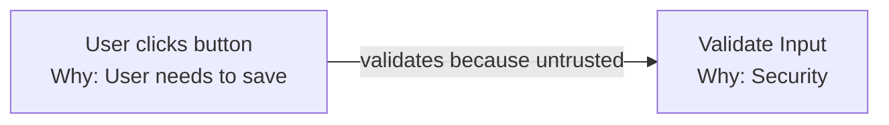
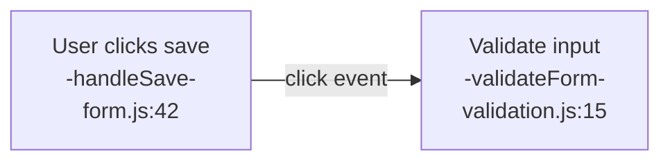
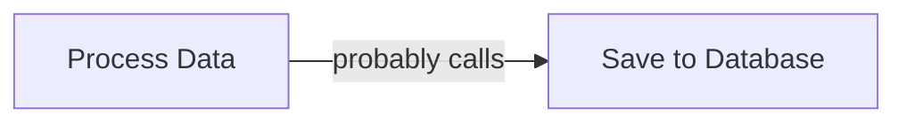
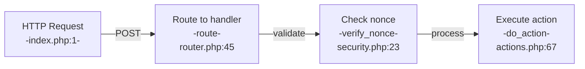
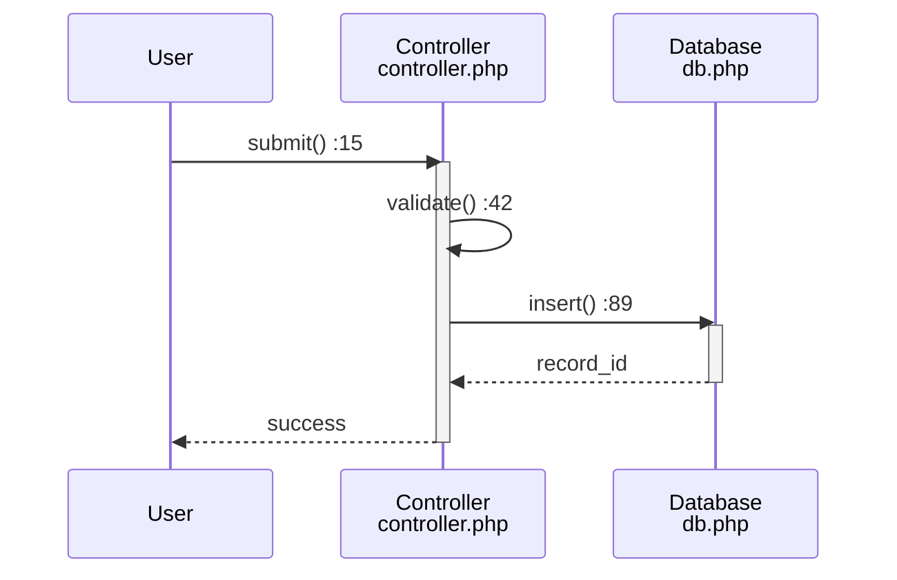
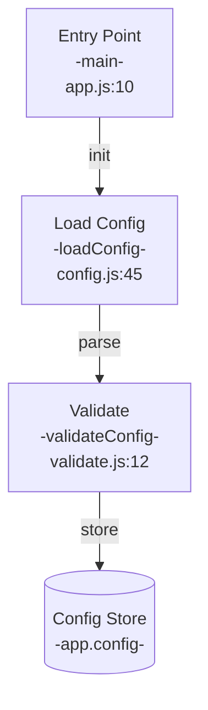
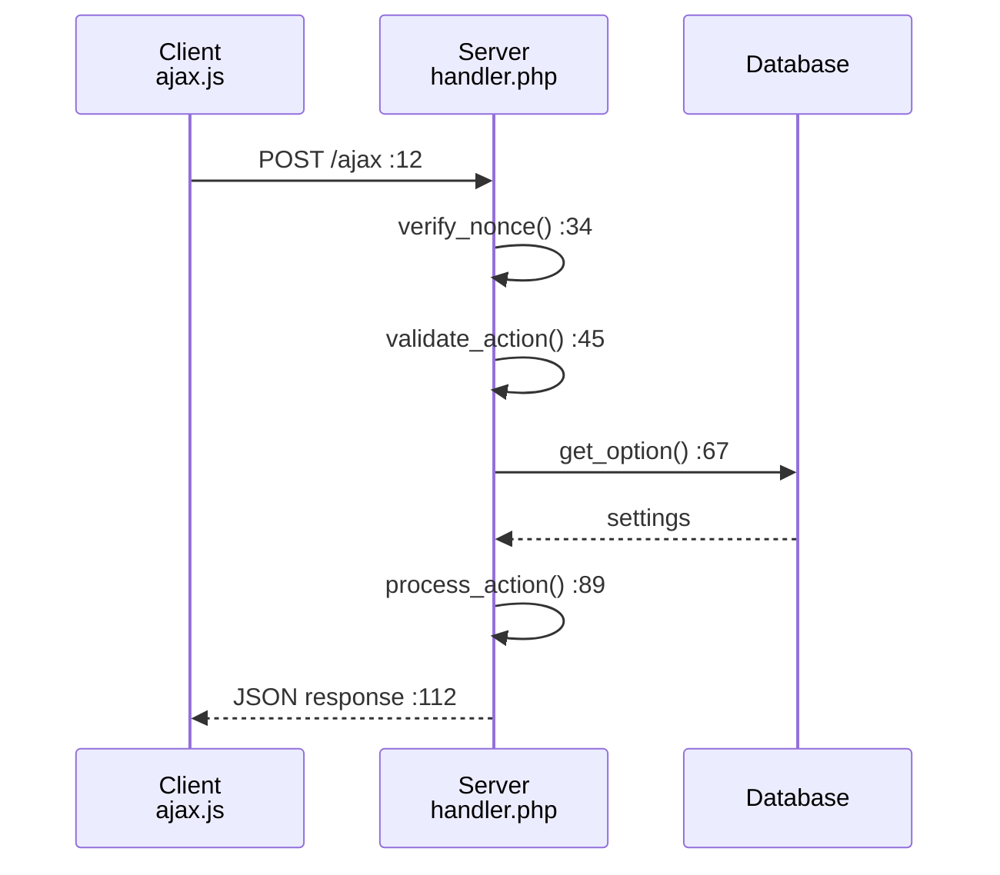

# SiP Unified Documentation Guidelines

## Core Documentation Philosophy

Documentation serves as the bridge between implementation and understanding. It consists of two complementary parts:

1. **Diagrams**: Show WHAT exists (structure, flow, relationships)
2. **Text**: Explain WHY it exists (decisions, constraints, rationale)

This separation ensures clarity and prevents redundancy. Readers first see the structure visually, then understand the reasoning behind it.

## The Documentation Rules

### 1. SEPARATION OF CONCERNS
**Rule**: Diagrams show structure; text explains rationale.

**Why**: Clear separation prevents confusion and redundancy. Readers know where to look for specific information.

**❌ Bad Example**:


**✅ Good Example**:


**Accompanying Text**:
The form validation occurs client-side before submission because:
- Immediate user feedback reduces server load
- Security validation still occurs server-side (never trust client)
- Form complexity requires staged validation

### 2. NO ASSUMPTIONS - VERIFY EVERYTHING
**Rule**: Every element in documentation must be verifiable against actual code.

**Why**: Prevents documentation drift and ensures accuracy. Aligns with coding principle of zero assumptions.

**For Diagrams**:
- Include file:line references for every function
- Verify all connections by tracing actual code
- Use exact function/method names from implementation

**For Text**:
- Reference specific constraints that drove decisions
- Link to actual code examples
- Verify rationale is still current

**❌ Bad Example**:


**✅ Good Example**:
```mermaid
graph LR
    A[Process form data<br/>-processSubmit-<br/>handler.php:89] 
    -->|save()| B[Insert record<br/>-saveToDatabase-<br/>db.php:234]
```

### 3. NO FUTURE OR HISTORY
**Rule**: Document current state only. No roadmaps, predictions, or changelogs.

**Why**: Documentation reflects what IS, not what was or might be.

**❌ Bad**:
- "Will be refactored to use..."
- "Previously this used..."
- "Planning to add..."

**✅ Good**:
- "Uses batch processing because..."
- "Validates input to prevent..."
- "Caches results to reduce..."

### 4. SINGLE SOURCE OF TRUTH
**Rule**: Each fact appears in exactly one location.

**Why**: Prevents contradictions and simplifies maintenance. Multiple sources lead to conflicts.

**Implementation**:
- Core concepts defined once, referenced elsewhere
- Use anchors: `[See Debug Levels](#debug-levels)`
- Diagrams show structure once, text explains once
- Never duplicate between diagram and text

### 5. ROOT CAUSE DOCUMENTATION
**Rule**: Document the fundamental reason, not the symptom or workaround.

**Why**: Understanding root causes enables proper solutions. Aligns with "fix root causes, not symptoms" coding principle.

**❌ Bad Example**:
```markdown
The system checks if the user object exists before processing because sometimes it's undefined.
```

**✅ Good Example**:
```markdown
User authentication occurs during the 'init' hook at priority 5 because:
- WordPress core user functions are available after priority 0
- Our user enhancement must run before template rendering at priority 10
- This eliminates any race condition with user availability
```

## Diagram Guidelines (The WHAT)

### Purpose of Diagrams
Show structure, flow, and relationships WITHOUT explaining why. Diagrams answer:
- What components exist?
- How do they connect?
- What is the execution flow?
- Where is the code located?

### Diagram Requirements

#### 1. Complete Representation
Every significant element relevant to the diagram's purpose must be shown:
- All functions in the execution path
- All data stores and state
- All external interfaces
- All decision points

#### 2. Verifiable References
Every code element must include verification information:

**Format for Functions**:
```
[Language does action<br/>-functionName-<br/>file.ext:line]
```

**Examples**:
```
[JS validates form<br/>-validateInput-<br/>form.js:156]
[PHP saves option<br/>-update_option-<br/>wp-core]
```

#### 3. Exact Naming
- Use actual function/method names from code
- Use actual file paths and line numbers
- Use actual storage keys and table names
- No generic or simplified names

#### 4. Connection Accuracy
Every arrow must represent an actual code connection:
- Verified function calls
- Traced execution paths
- Actual event triggers
- Real data flow

### What Diagrams Must NOT Include
- WHY explanations or rationale
- Historical information
- Future plans
- Workarounds or defensive patterns
- Troubleshooting flows

### Diagram Types and Standards

#### Flow/Graph Diagrams
Show data or control flow through system:


#### Sequence Diagrams
Show time-ordered interactions:


## Text Documentation Guidelines (The WHY)

### Purpose of Text
Explain the reasoning behind what diagrams show. Text answers:
- Why does this structure exist?
- Why was this approach chosen?
- What constraints led to this design?
- What problems does this solve?

### Text Requirements

#### 1. Architectural Rationale
Every design decision must include its reasoning:
- Business constraints that drove the decision
- Technical limitations that required this approach
- Performance considerations that influenced design
- Security requirements that shaped implementation

#### 2. Root Cause Explanations
Document fundamental reasons, not symptoms:
```markdown
### Why Hybrid Table Architecture

The Creation Table combines DataTables with custom row injection because:

1. **Parent-Child Relationships**: DataTables cannot dynamically group rows by 
   blueprint/product hierarchy - it treats all rows as independent

2. **Summary Row Requirements**: Business needs aggregate data rows that:
   - Show combined metrics for all children
   - Cannot be selected or sorted as normal rows
   - Must update dynamically as children change

3. **Performance Constraints**: Loading 1000+ products requires virtualization
   that DataTables provides, but with our custom modifications
```

#### 3. Constraint Documentation
Explain limitations that affect implementation:
```markdown
### Chrome Extension Constraints

The extension operates under these browser-imposed limitations:

1. **Printify Blocks chrome.runtime**: Cannot use standard messaging on printify.com
   - Forces URL parameter communication for mockup updates
   - Prevents real-time status updates from content scripts
   
2. **CORS Restrictions**: Cannot fetch Printify API directly
   - Must inject scripts into page context
   - Requires postMessage for data extraction
```

### What Text Must NOT Include
- Repetition of what diagrams show
- Step-by-step how-to instructions (that's what diagrams show)
- Code structure descriptions (diagrams show this)
- Historical context or future plans

## How Diagrams and Text Work Together

### Pattern: Feature Documentation

```markdown
# Feature Name

## Overview
Brief description of the feature's purpose in the system.

## Architecture

### System Flow


### Design Decisions

#### Why Configuration Loads First
Configuration must be loaded before any other initialization because:
- Feature flags determine which modules to load
- API endpoints vary by environment
- User preferences affect initial UI state

#### Why Validation is Separate
Configuration validation is a separate step rather than part of loading because:
- Multiple config sources need the same validation
- Validation rules change more frequently than loading logic
- Failed validation must not corrupt existing config
```

### Pattern: Complex Flow Documentation

```markdown
## AJAX Request Handling

### Request Flow


### Architecture Rationale

#### Why Three-Level Action Routing
The AJAX system uses plugin → type → action routing because:

1. **Plugin Isolation**: Each plugin handles only its own actions, preventing 
   cross-plugin conflicts and enabling independent deployment

2. **Type Organization**: Grouping by type (template, product, order) allows:
   - Shared validation per type
   - Consistent response formats
   - Type-specific error handling

3. **Granular Permissions**: Action-level routing enables precise capability 
   checks without cluttering individual handlers
```

## Code Example Guidelines

### In Diagrams
- Show structure and connections
- Include file:line references
- Use exact function names
- Keep labels concise

### In Text
- Show implementation patterns
- Maximum 20 lines per example
- Focus on specific concepts
- Include rationale comments

**Example**:
```javascript
// Configuration loads at priority 5 because WordPress user 
// functions are available after priority 0
add_action('init', function() {
    $config = loadConfiguration();  // Single source of truth
    validateConfig($config);        // Fail fast on invalid config
    storeConfig($config);          // Make available system-wide
}, 5);
```

## Verification Checklist

### Before Creating Documentation
- [ ] Read actual implementation code
- [ ] Trace execution paths completely
- [ ] Identify architectural constraints
- [ ] Understand root causes, not symptoms

### For Diagrams
- [ ] Every function has file:line reference
- [ ] All connections verified in code
- [ ] No WHY explanations included
- [ ] Shows actual structure, not idealized

### For Text
- [ ] Explains WHY for each design decision
- [ ] Documents constraints that drove design
- [ ] No repetition of WHAT (that's in diagrams)
- [ ] Root causes explained, not workarounds

### Final Review
- [ ] No assumptions - everything verified
- [ ] Single source of truth maintained
- [ ] Current state only (no past/future)
- [ ] Diagrams and text complement, not duplicate

## Common Anti-Patterns to Avoid

### 1. The Explanation Diagram
Adding WHY annotations to diagrams instead of keeping them structural.

### 2. The Structural Text
Describing code flow in paragraphs instead of using diagrams.

### 3. The Assumption
Documenting probable behavior instead of verified behavior.

### 4. The Workaround Documentation
Explaining defensive code instead of why proper structure prevents issues.

### 5. The Time Machine
Including historical decisions or future possibilities.

## Quick Reference

| Aspect | Diagrams Show | Text Explains |
|--------|--------------|---------------|
| Structure | ✓ Components and connections | ✗ Why this structure |
| Flow | ✓ Execution sequence | ✗ Why this order |
| Data | ✓ What is stored where | ✗ Why stored there |
| Functions | ✓ Names and locations | ✗ Why they exist |
| Constraints | ✗ Not shown | ✓ What limits design |
| Decisions | ✗ Not shown | ✓ Rationale behind choices |
| Trade-offs | ✗ Not shown | ✓ What was considered |

## Maintenance Guidelines

### When to Update
- **Immediately**: When changing architecture or flow
- **Before merging**: When rationale changes
- **During refactoring**: When structure changes

### Update Process
1. Update diagrams to reflect new structure
2. Update text to explain new rationale
3. Verify all file:line references
4. Remove any obsolete explanations
5. Ensure no duplication created

---

Remember: Diagrams show the map; text explains why we take this route.