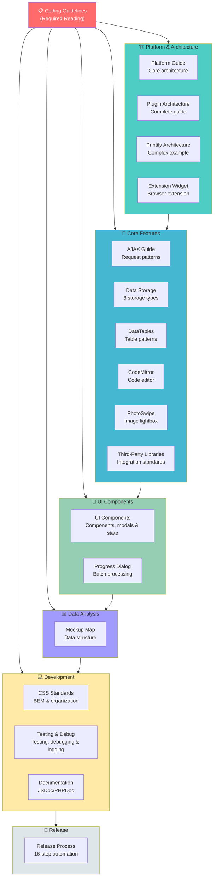

# SiP Plugin Suite Documentation Map

This document serves as a central reference point and navigation guide for the SiP Plugin Suite codebase. It organizes all documentation in the .claude directory and provides context for understanding the architecture, conventions, and functionality of the plugin suite.

## 🚨 REQUIRED READING - START HERE 🚨

**BEFORE doing ANY work on the SiP Plugin Suite, you MUST read:**

### **[📋 Coding Guidelines](./Coding_Guidelines_Snapshot.txt)** 

**This document defines HOW to work within the SiP ecosystem and contains critical behavioral standards that prevent destructive coding patterns. Failure to follow these guidelines results in broken functionality, wasted time, and technical debt.**

**Key areas covered:**
- **Planning requirements** - When and how to code
- **Work methodology** - How to understand and modify existing code
- **Quality standards** - What constitutes acceptable code changes
- **Review processes** - How to verify work meets standards

**These guidelines are not suggestions - they are requirements that must be followed rigorously.**

## Introduction for Claude

>Your mission is twofold: (1) work on the specific code that is the focus of the session, and (2) maintain this document as a map of the overall SiP Plugin Suite codebase. Use this document to orient yourself to where the specific code being worked on resides within the larger framework. Ensure that new code conforms to the patterns described here. If it doesn't, either reconsider the approach to the immediate code task or extend/clarify this documentation to maintain alignment between the map and the terrain.  All of this should take place within the formal steps of the plan, work, review process.

## Visual Documentation Map

### Documentation Structure (ASCII)

```
┌────────────────────────────────────────────────────────────────┐
│              SiP Plugin Suite Documentation Map                │
└────────────────────────────────────────────────────────────────┘

📋 Coding_Guidelines_Snapshot.txt ← START HERE (Required Reading)
│
├── 🏗️ Platform & Architecture
│   ├── sip-plugin-platform.md      → Core architecture & dependencies
│   ├── sip-plugin-architecture.md  → Complete plugin creation & dashboards
│   ├── sip-plugins-core-dashboard.md → Unified installer management
│   ├── sip-printify-manager-architecture.md → Complex plugin example
│   └── sip-printify-manager-extension-widget.md → Browser extension docs
│
├── 🔧 Core Features
│   ├── sip-plugin-ajax.md          → AJAX patterns & implementation
│   ├── sip-plugin-data-storage.md  → Storage types & patterns
│   ├── sip-feature-datatables.md   → DataTables integration
│   ├── sip-feature-codemirror.md   → Code editor integration
│   ├── sip-feature-photoswipe.md   → Image lightbox gallery
│   └── sip-feature-third-party-libraries.md → Library integration standards
│
├── 🎨 UI Components
│   ├── sip-feature-ui-components.md → UI hierarchy, modals & state mgmt
│   └── sip-feature-progress-dialog.md → Batch processing UI
│
├── 📊 Data Analysis
│   └── mockup-map-analysis.md      → Mockup data structure guide
│
├── 💻 Development Standards
│   ├── sip-development-css.md      → CSS architecture & BEM
│   ├── sip-development-testing-debug.md → Testing, debugging & logging
│   └── sip-development-documentation.md → Documentation standards
│
└── 🚀 Release Process
    └── sip-development-release-mgmt.md → Git workflow & versioning
```

### Documentation Structure (Mermaid)



## SPECIFIC PATTERN COMPLIANCE

If you are working on a task that you suspect may involve any of the above systems, make sure to READ the relevant documntation fies COMPLETELY. Common examples below:

**AJAX IMPLEMENTATION:**
- Read sip-plugin-ajax.md completely before any AJAX work
- Verify parameter naming: $_POST[$action_type] matches JavaScript createFormData() second parameter
- Test AJAX call with browser dev tools before considering complete
- Check that response routing follows documented three-level structure

**DATATABLES IMPLEMENTATION:**
- Read sip-feature-datatables.md for table patterns
- Follow client-side processing standards
- Implement proper cleanup before destroy()

**UI COMPONENTS:**
- Read sip-feature-ui-components.md for UI patterns
- Use SiP.Core utilities for all UI operations
- Follow the three-layer visibility structure for tables

## Getting Started with SiP Plugins

New to SiP Plugin development? Much of the documentation is structured specifically to serve as an intuitive and accessible reference to use as you are executing common development tasks.  Follow this path to get up to speed quickly:

1. **Understand the Platform** → Start with [SiP Plugins Platform](./guidelines/sip-plugin-platform.md)
   - Learn the key principles and architecture
   - Understand how plugins interact with the core platform

2. **Create Or Extend a Plugin** → Follow [Plugin Architecture](./guidelines/sip-plugin-architecture.md)
   - Set up proper file structure
   - Register with SiP Core framework
   - Implement basic functionality
   - Create admin dashboards

3. **Add AJAX Capabilities** → Read [AJAX Implementation](./guidelines/sip-plugin-ajax.md)
   - Set up standardized AJAX handling
   - Implement proper error handling
   - Follow request-response patterns

4. **Implement Advanced Features** → Choose from available features
   - [DataTables](./guidelines/sip-feature-datatables.md) for data display
   - [UI Components](./guidelines/sip-feature-ui-components.md) for interface elements
   - [Progress Dialog](./guidelines/sip-feature-progress-dialog.md) for batch operations

5. **Document Your Code** → Follow [Documentation Standards](./guidelines/sip-development-documentation.md)
   - Add JSDoc/PHPDoc to all functions
   - Document interface contracts, not implementation
   - Include parameter types and structures

6. **Test and Debug** → Review [Testing, Debugging & Logging](./guidelines/sip-development-testing-debug.md)
   - Set up debug logging
   - Implement testing workflows
   - Troubleshoot common issues

7. **Release Your Plugin** → Use [Release Management](./guidelines/sip-development-release-mgmt.md)
   - Follow versioning standards
   - Deploy using the automated system

## Architecture Overview

The SiP Plugin Suite consists of two main components:

### SiP Plugins Core
A foundational plugin providing centralized functionality that all other SiP plugins leverage:

1. **AJAX System**: Centralized request routing and standardized response formatting
2. **UI Utilities**: Shared components (spinners, toasts, dialogs)
3. **Debug Logging**: Unified JavaScript and PHP debug logging system
4. **Plugin Framework**: Registration system and shared menu management
5. **Update Mechanism**: Centralized update system with dependency validation
6. **Dependency Management**: Automated version requirements and compatibility checking
7. **Libraries**: CodeMirror editor and PhotoSwipe lightbox

### SiP Development Tools
Development and deployment utilities for the plugin suite:

1. **Release Management**: Automated versioning, Git workflow, and deployment
   - WordPress plugin releases with dependency management
   - Chrome extension releases with optional Chrome Web Store publishing
   - Centralized update server distribution
2. **Development Helpers**: Code generation and testing utilities
3. **System Diagnostics**: Environment verification and troubleshooting

## Task-Oriented Guides

The documentation is organized into four main categories:

1. **Core Documentation** - Development standards and best practices
2. **Plugin Development (sip-plugin-*)** - Guides for creating new plugins using SiP Core patterns
3. **Feature Implementation (sip-feature-*)** - Guides for implementing specific SiP Core features
4. **Development Tools (sip-development-*)** - Using the SiP Development Tools plugin for workflow automation

Each guide presents standards and conventions in the context where they're used.

## Visual Documentation Map

```
┌─────────────────────────────────────┐
│       SiP Plugin Suite Platform      │
│       [sip-plugin-platform.md]      │
└───────────────────┬─────────────────┘
                    │
        ┌───────────┴───────────┐
        │                       │
┌───────▼──────────┐    ┌───────▼──────────┐
│  Plugin Creation  │    │  Feature Modules │
│  & Development    │    │  Implementation  │
└───────┬──────────┘    └───────┬──────────┘
        │                       │
┌───────▼──────────┐    ┌───────▼──────────┐
│ Creating Plugin   │    │  UI Components   │
│ [sip-plugin-      │    │  [sip-feature-   │
│  creation.md]     │    │   ui-components] │
└───────┬──────────┘    └───────┬──────────┘
        │                       │
┌───────▼──────────┐    ┌───────▼──────────┐    ┌─────────────────┐
│ AJAX Implementation│    │  DataTables      │    │ Development Tools│
│ [sip-plugin-ajax.md]│    │  [sip-feature-   │    │ & Workflow      │
└───────┬──────────┘    │   datatables.md] │    └───────┬─────────┘
        │                └───────┬──────────┘            │
┌───────▼──────────┐    ┌───────▼──────────┐    ┌───────▼─────────┐
│ Admin Dashboards  │    │  Progress Dialog │    │ Debug Logging   │
│ [sip-plugin-      │    │  [sip-feature-   │    │ [sip-development-│
│  dashboards.md]   │    │   progress-      │    │  debug-logging] │
└───────┬──────────┘    │   dialog.md]     │    └───────┬─────────┘
        │                └───────┬──────────┘            │
┌───────▼──────────┐    ┌───────▼──────────┐    ┌───────▼─────────┐
│ Data Storage      │    │  Other Features  │    │ Testing &       │
│ [sip-plugin-      │    │  • CodeMirror    │    │ Troubleshooting │
│  data-storage.md] │    │  • PhotoSwipe    │    │ [sip-development-│
└──────────────────┘    │  • Modals        │    │  testing.md]    │
                        └──────────────────┘    └───────┬─────────┘
                                                        │
                                                ┌───────▼─────────┐
                                                │ Release Mgmt    │
                                                │ [sip-development-│
                                                │  release-mgmt]  │
                                                └─────────────────┘
```

### Plugin Development (sip-plugin-*)
Guides for creating new plugins using the SiP Core plugin framework and patterns.

| Guide | Description | Status |
|-------|-------------|--------|
| [Plugin Architecture](./guidelines/sip-plugin-architecture.md) | Complete guide to creating plugins and dashboards | ✅ Complete |
| [AJAX Implementation](./guidelines/sip-plugin-ajax.md) | Complete AJAX guide including error handling | ✅ Complete |
| [Data Storage & File Handling](./guidelines/sip-plugin-data-storage.md) | All data storage patterns and file handling | ✅ Complete |
| Plugin Development Workflow | See workflow section below | ✅ In Index |

### Feature Implementation (sip-feature-*)
Guides for implementing specific SiP Core features in your plugins.

| Guide | Description | Status |
|-------|-------------|--------|
| [Progress Dialog](./guidelines/sip-feature-progress-dialog.md) | Batch operations and progress feedback | ✅ Complete |
| [DataTables](./guidelines/sip-feature-datatables.md) | Server-side data tables | ✅ Complete |
| [UI Components](./guidelines/sip-feature-ui-components.md) | Core UI utilities, modals, and localStorage for UI state | ✅ Complete |
| [CodeMirror](./guidelines/sip-feature-codemirror.md) | Code editor integration | ✅ Complete |
| [PhotoSwipe](./guidelines/sip-feature-photoswipe.md) | Image lightbox functionality | ✅ Complete |
| [Third-Party Libraries](./guidelines/sip-feature-third-party-libraries.md) | Standards for integrating external libraries | ✅ Complete |

### Development Tools (sip-development-*)
Guides for using the SiP Development Tools plugin for automated workflows.

| Guide | Description | Status |
|-------|-------------|--------|
| [Release Management](./guidelines/sip-development-release-mgmt.md) | Versioning, Git workflow, and automated deployment | ✅ Complete |
| [Testing, Debugging & Logging](./guidelines/sip-development-testing-debug.md) | Testing strategies, debugging, and logging | ✅ Complete |

### Development Standards
Standards and best practices for SiP plugin development.

| Guide | Description | Status |
|-------|-------------|--------|
| [CSS Development](./guidelines/sip-development-css.md) | CSS architecture, naming conventions, and best practices | ✅ Complete |
| [Documentation Standards](./guidelines/sip-development-documentation.md) | JSDoc/PHPDoc standards and interface documentation | ✅ Complete |

### Plugin-Specific Architecture
Detailed architecture guides for specific SiP plugins with complex systems.

| Guide | Description | Status |
|-------|-------------|--------|
| [SiP Plugins Core Dashboard](./guidelines/sip-plugins-core-dashboard.md) | Unified installer management for plugins and extensions | ✅ Complete |
| [SiP Printify Manager Architecture](./guidelines/sip-printify-manager-architecture.md) | Complete architecture, data flows, and parent-child product relationships | ✅ Complete |
| [SiP Printify Manager Extension](./guidelines/sip-printify-manager-extension-widget.md) | Browser extension architecture and integration | ✅ Complete |
| [SiP Printify Manager Testing](./guidelines/sip-printify-manager-testing.md) | API testing procedures and experimental feature testing | ✅ Complete |

**Important Note**: All SiP Printify Manager specific documentation (including implementation details, status management, table behaviors, etc.) should be maintained in the [SiP Printify Manager Architecture](./guidelines/sip-printify-manager-architecture.md) file, not in the general plugin development guides.

### Extension Architecture Vision
Future architectural direction for browser extensions in the SiP ecosystem.

| Guide | Description | Status |
|-------|-------------|--------|
| [Master Extension Architecture Vision](./vision/sip-master-extension-architecture.md) | Vision for unified browser extension platform supporting multiple plugin modules | ✅ Vision Document |

**Note**: The master extension architecture is a future vision. Current implementation uses individual extensions per plugin with installation management centralized in SiP Plugins Core.


## Core Components and Utilities

The SiP Plugins Core provides these key components (detailed in implementation guides):

### AJAX System
- Centralized routing through `ajax-handler.php`
- Flexible response routing based on PHP response fields
- Standardized responses via `SiP_AJAX_Response` class
- Client-side handling via `SiP.Core.ajax`
- Cross-table operation support
- Error handling patterns included

### UI Utilities
- **Spinner/Overlay**: `SiP.Core.utilities.spinner` - [Full Documentation](./guidelines/sip-feature-ui-components.md#spinner-and-overlay)
- **Toast Notifications**: `SiP.Core.utilities.toast` - [Documentation](./guidelines/sip-feature-ui-components.md#toast-notifications)
- **Progress Dialog**: `SiP.Core.progressDialog` - [Full Guide](./guidelines/sip-feature-progress-dialog.md)
- **Extension Installer**: `SiP.Core.extensionInstaller` - Centralized browser extension installation wizard

### Plugin Framework
- Registration: `SiP_Plugin_Framework::init_plugin()`
- Standard headers: `sip_render_standard_header()`
- Shared menu system

### Libraries
- **CodeMirror**: Code editor with syntax highlighting
- **PhotoSwipe**: Lightbox for image galleries

### JavaScript Architecture
- Namespace: `SiP.PluginName.moduleName`
- Module pattern with IIFE
- Standardized AJAX handling
- Module Consolidation: Related functionality grouped in single module files
- Dependency Management: Automated version requirements and compatibility validation
- Branch Recovery System: Automated branch switching and recovery for releases
- Modal System Enhancement: Custom sip-modal pattern for user interactions

## Existing Documentation

These files contain reference information and detailed specifications:

| Document | Description | Status |
|----------|-------------|--------|
| **[Coding Guidelines](./Coding_Guidelines_Snapshot.txt)** | **Behavioral standards and work process requirements** | **✅ Critical** |
| [SiP Plugin Ajax Architecture](./sip_plugin_ajax_architecture.md) | AJAX system architecture details | ✅ Exists |
| [SiP Code Standards Overview](./sip_code_standards_overview.md) | General coding principles | ✅ Exists |
| [SiP Plugin File Structure](./sip_plugin_file_structure.md) | File organization and naming | ✅ Exists |
| [SiP Plugin Suite Hierarchy](./sip_plugin_suite_hierarchy.md) | Complete file hierarchy | ✅ Exists |


## Plugin Development Workflow

The SiP Plugin Suite documentation is organized to guide you through the complete plugin development process. Here's how the documentation categories work together:

### Step-by-Step Development Process

1. **Create the Plugin Foundation** (sip-plugin-* guides)
   - Start with [Plugin Architecture](./guidelines/sip-plugin-architecture.md)
   - Set up proper file structure and initialization
   - Register with SiP Core framework
   - Create admin dashboards

2. **Build Core Functionality** (sip-plugin-* guides)
   - Implement [AJAX handlers](./guidelines/sip-plugin-ajax.md) for server communication
   - Set up [data storage](./guidelines/sip-plugin-data-storage.md) patterns

3. **Add SiP Core Features** (sip-feature-* guides)
   Choose from available features as needed:
   - [Progress Dialog](./guidelines/sip-feature-progress-dialog.md) for batch operations
   - [DataTables](./guidelines/sip-feature-datatables.md) for data display
   - [UI Components](./guidelines/sip-feature-ui-components.md) for consistent interfaces and modals
   - [CodeMirror](./guidelines/sip-feature-codemirror.md) for code editing
   - [PhotoSwipe](./guidelines/sip-feature-photoswipe.md) for image galleries

4. **Test and Deploy** (sip-development-* guides)
   - Use [Testing, Debugging & Logging](./guidelines/sip-development-testing-debug.md) during development
   - Deploy using [Release Management](./guidelines/sip-development-release-mgmt.md)

### Workflow Decision Tree

```
Start New Plugin?
    ├─> YES: Use sip-plugin-architecture.md
    │    └─> Need AJAX? -> sip-plugin-ajax.md
    │    └─> Need Storage? -> sip-plugin-data-storage.md
    │
    └─> NO: Adding to Existing Plugin?
         └─> Review current structure
         └─> Choose needed features:
              ├─> Batch Operations? -> sip-feature-progress-dialog.md
              ├─> Data Tables? -> sip-feature-datatables.md
              ├─> Modal Dialogs? -> sip-feature-ui-components.md
              └─> Other UI? -> sip-feature-ui-components.md
```

### Example: Building a Complete Plugin

Here's how you might use the documentation to build a plugin that manages product data:

1. **Foundation**: Use [Plugin Architecture](./guidelines/sip-plugin-architecture.md) to set up `sip-product-manager` with dashboard
2. **AJAX**: Implement product CRUD operations with [AJAX Implementation](./guidelines/sip-plugin-ajax.md)
3. **Storage**: Set up database tables with [Data Storage & File Handling](./guidelines/sip-plugin-data-storage.md)
4. **Features**: Add:
   - [DataTables](./guidelines/sip-feature-datatables.md) for product listings
   - [Progress Dialog](./guidelines/sip-feature-progress-dialog.md) for bulk imports
   - [UI Components](./guidelines/sip-feature-ui-components.md) for modals and interface elements
6. **Deployment**: Use [Release Management](./guidelines/sip-development-release-mgmt.md) to deploy

## Quick Reference

### Common Tasks
1. **Need to create a new plugin?** → [Plugin Architecture](./guidelines/sip-plugin-architecture.md)
2. **Adding AJAX to your plugin?** → [AJAX Implementation](./guidelines/sip-plugin-ajax.md)
3. **Need progress feedback?** → [Progress Dialog](./guidelines/sip-feature-progress-dialog.md)
4. **Working with data storage?** → [Data Storage & File Handling](./guidelines/sip-plugin-data-storage.md)
5. **Need UI components?** → [UI Components](./guidelines/sip-feature-ui-components.md)

### Essential Patterns
1. **AJAX Requests**: Always use `SiP.Core.utilities.createFormData()` and `SiP.Core.ajax.handleAjaxAction()`
2. **AJAX Responses**: Always use `SiP_AJAX_Response::success()` or `SiP_AJAX_Response::error()`
3. **Response Routing**: PHP controls success handler routing via `action_type` field in response
4. **Cross-Table Operations**: Use response routing for operations between different table modules
5. **Event Handling**: Follow the module pattern with proper event attachment
6. **UI Components**: Use the standardized SiP Core utilities
7. **File Organization**: Maintain the established directory structure
8. **Documentation**: All functions must have JSDoc/PHPDoc documenting interface contracts

### Development Environment
- **Operating System**: Windows 11 with WSL2
- **Local Development**: Local by Flywheel
- **Code Editor**: Visual Studio Code with Claude integration
- **Plugin Path**: `/mnt/c/Users/tdeme/Local Sites/faux-stained-glass-panes/app/public/wp-content/plugins/`

## Documentation Maintenance

### When to Update Documentation
1. **Architecture Changes**: Update when changing plugin structure or core functionality
2. **New Patterns**: Document new coding patterns or conventions
3. **API Changes**: Update when modifying public APIs or interfaces
4. **Major Features**: Create guides for significant new functionality

### Documentation Standards
1. **Task-Oriented**: Present standards in the context of actual tasks
2. **Code Examples**: Lead with practical examples, explain standards after
3. **Progressive Complexity**: Start simple, build to advanced topics
4. **Cross-References**: Link between related documents
5. **Status Tracking**: Mark documents as TODO, In Progress, or Complete

## Complete Documentation Assessment

This section provides a complete listing of all documentation files in the guidelines directory for AI pre-task context gathering:

### Platform & Architecture Documentation
- **sip-plugin-platform.md** - Core platform architecture, component overview, and key principles
- **sip-plugin-architecture.md** - Complete guide for plugin creation including file structure, naming conventions, storage management, AJAX implementation, dashboard creation, and feature development
- **sip-printify-manager-architecture.md** - Complex plugin example showing parent-child relationships, table management, and advanced features
- **sip-printify-manager-extension-widget.md** - Browser extension integration for the Printify Manager

### Core Feature Documentation
- **sip-plugin-ajax.md** - AJAX implementation patterns, three-level action structure, standardized responses, error handling
- **sip-plugin-data-storage.md** - Eight storage types, client-server sync patterns, centralized storage manager
- **sip-feature-datatables.md** - DataTables integration, server-side processing, column rendering
- **sip-feature-codemirror.md** - Code editor integration and configuration
- **sip-feature-photoswipe.md** - Image lightbox gallery implementation
- **sip-feature-third-party-libraries.md** - Standards for integrating external JavaScript and CSS libraries

### UI Component Documentation
- **sip-feature-ui-components.md** - UI hierarchy, modals, toast notifications, spinners, form elements, checkbox patterns, responsive tables, local storage for UI state
- **sip-feature-progress-dialog.md** - Batch operation UI with progress tracking and cancellation

### Development Standards Documentation
- **sip-development-css.md** - CSS architecture, BEM methodology, organization patterns
- **sip-development-testing-debug.md** - Testing strategies, debugging workflows, debug logging system for JavaScript and PHP
- **sip-development-documentation.md** - JSDoc/PHPDoc standards, interface documentation requirements
- **sip-development-release-mgmt.md** - Git workflow, versioning standards, 16-step automated release process
- **task-working-file-template.md** - Template for tracking task progress and maintaining context during implementation

### Data Analysis Documentation
- **mockup-map-analysis.md** - Mockup data structure analysis and visualization guide

### Testing Documentation
- **sip-printify-manager-testing.md** - API testing procedures and experimental feature testing specific to Printify Manager


## Next Steps

With all primary documentation complete, focus shifts to implementation verification:

1. **Verify Code Compliance** - Ensure all plugin code follows documented standards
2. **Create Compliance Checklist** - Systematic verification of standards across plugins
3. **Update Non-Conforming Code** - Fix any areas not following standards
4. **Create Code Templates** - Add boilerplate generation to SiP Development Tools
5. **Document Any Gaps** - Add documentation for any discovered patterns

By following this documentation structure, developers can quickly find the information they need in the context where they'll use it, making the SiP Plugin Suite more accessible and maintainable.