# SiP Plugin Suite Documentation Map

This document serves as a central reference point and navigation guide for the SiP Plugin Suite codebase. It organizes all documentation in the .claude directory and provides context for understanding the architecture, conventions, and functionality of the plugin suite.

## 🚨 REQUIRED READING - START HERE 🚨

**BEFORE doing ANY work on the SiP Plugin Suite, you MUST read:**

### **[📋 Coding Guidelines](./Coding_Guidelines_Snapshot.txt)** 

**This document defines HOW to work within the SiP ecosystem and contains critical behavioral standards that prevent destructive coding patterns. Failure to follow these guidelines results in broken functionality, wasted time, and technical debt.**

**Key areas covered:**
- **Planning requirements** - When and how to code
- **Work methodology** - How to understand and modify existing code
- **Quality standards** - What constitutes acceptable code changes
- **Review processes** - How to verify work meets standards

**These guidelines are not suggestions - they are requirements that must be followed rigorously.**

### **[📝 Process Message Cribsheet](./Claude_Process_Message_Cribsheet.txt)**

**Standard messages for managing the development process:**
- **Plan Stage** - Task initiation message
- **Iteration** - Issue resolution message
- **Review Stage** - Work completion and documentation review
- **Recovery** - Context auto-compact recovery

**This cribsheet ensures consistent communication throughout the development workflow.**

## Introduction for Claude

>Your mission is twofold: (1) work on the specific code that is the focus of the session, and (2) maintain this document as a map of the overall SiP Plugin Suite codebase. Use this document to orient yourself to where the specific code being worked on resides within the larger framework. Ensure that new code conforms to the patterns described here. If it doesn't, either reconsider the approach to the immediate code task or extend/clarify this documentation to maintain alignment between the map and the terrain.  All of this should take place within the formal steps of the plan, work, review process.

## Visual Documentation Map

```mermaid
graph TD
    Guidelines["📋 Coding Guidelines<br/>(Required Reading)"]
    
    subgraph Platform["🏗️ Platform & Architecture"]
        PlatformGuide["Platform Guide<br/>Core architecture"]
        Architecture["Plugin Architecture<br/>Complete guide"]
        CoreDashboard["Core Dashboard<br/>Unified installer"]
        PrintifyArch["Printify Architecture<br/>Complex example"]
        Extension["Extension Widget<br/>Browser extension"]
    end
    
    subgraph Features["🔧 Core Features"]
        Ajax["AJAX Guide<br/>Request patterns"]
        Storage["Data Storage<br/>8 storage types"]
        DataTables["DataTables<br/>Table patterns"]
        CodeMirror["CodeMirror<br/>Code editor"]
        PhotoSwipe["PhotoSwipe<br/>Image lightbox"]
        ThirdParty["Third-Party Libraries<br/>Integration standards"]
    end
    
    subgraph UI["🎨 UI Components"]
        Components["UI Components<br/>Components, modals & state"]
        Progress["Progress Dialog<br/>Batch processing"]
    end
    
    subgraph Data["📊 Data Analysis"]
        MockupMap["Mockup Map<br/>Data structure"]
    end
    
    subgraph Dev["💻 Development"]
        CSS["CSS Standards<br/>BEM & organization"]
        TestDebug["Testing & Debug<br/>Testing, debugging & logging"]
        Docs["Documentation<br/>JSDoc/PHPDoc"]
    end
    
    subgraph Release["🚀 Release"]
        ReleaseMgmt["Release Process<br/>16-step automation"]
    end
    
    Guidelines --> Platform
    Guidelines --> Features
    Guidelines --> UI
    Guidelines --> Data
    Guidelines --> Dev
    
    Platform --> Features
    Features --> UI
    UI --> Data
    Data --> Dev
    Dev --> Release
    
    style Guidelines fill:#ff6b6b,color:#fff
    style Platform fill:#4ecdc4
    style Features fill:#45b7d1
    style UI fill:#96ceb4
    style Data fill:#a29bfe
    style Dev fill:#ffeaa7
    style Release fill:#dfe6e9
```



## SPECIFIC PATTERN COMPLIANCE

If you are working on a task that you suspect may involve any of the above systems, make sure to READ the relevant documentation files COMPLETELY. Common examples below:

**AJAX IMPLEMENTATION:**
- Read sip-plugin-ajax.md completely before any AJAX work
- Verify parameter naming: $_POST[$action_type] matches JavaScript createFormData() second parameter
- Test AJAX call with browser dev tools before considering complete
- Check that response routing follows documented three-level structure

**DATATABLES IMPLEMENTATION:**
- Read sip-feature-datatables.md for table patterns
- Follow client-side processing standards
- Implement proper cleanup before destroy()

**UI COMPONENTS:**
- Read sip-feature-ui-components.md for UI patterns
- Use SiP.Core utilities for all UI operations
- Follow the three-layer visibility structure for tables

## Getting Started with SiP Plugins

New to SiP Plugin development? Much of the documentation is structured specifically to serve as an intuitive and accessible reference to use as you are executing common development tasks.  Follow this path to get up to speed quickly:

1. **Understand the Platform** → Start with [SiP Plugins Platform](./guidelines/sip-plugin-platform.md)
   - Learn the key principles and architecture
   - Understand how plugins interact with the core platform

2. **Create Or Extend a Plugin** → Follow [Plugin Architecture](./guidelines/sip-plugin-architecture.md)
   - Set up proper file structure
   - Register with SiP Core framework
   - Implement basic functionality
   - Create admin dashboards

3. **Add AJAX Capabilities** → Read [AJAX Implementation](./guidelines/sip-plugin-ajax.md)
   - Set up standardized AJAX handling
   - Implement proper error handling
   - Follow request-response patterns

4. **Implement Advanced Features** → Choose from available features
   - [DataTables](./guidelines/sip-feature-datatables.md) for data display
   - [UI Components](./guidelines/sip-feature-ui-components.md) for interface elements
   - [Progress Dialog](./guidelines/sip-feature-progress-dialog.md) for batch operations

5. **Document Your Code** → Follow [Documentation Standards](./guidelines/sip-development-documentation.md)
   - Add JSDoc/PHPDoc to all functions
   - Document interface contracts, not implementation
   - Include parameter types and structures

6. **Test and Debug** → Review [Testing, Debugging & Logging](./guidelines/sip-development-testing-debug.md)
   - Set up debug logging
   - Implement testing workflows
   - Troubleshoot common issues

7. **Release Your Plugin** → Use [Release Management](./guidelines/sip-development-release-mgmt.md)
   - Follow versioning standards
   - Deploy using the automated system

## Architecture Overview

The SiP Plugin Suite consists of two main components:

### SiP Plugins Core
A foundational plugin providing centralized functionality that all other SiP plugins leverage:

1. **AJAX System**: Centralized request routing and standardized response formatting
2. **UI Utilities**: Shared components (spinners, toasts, dialogs)
3. **Debug Logging**: Unified JavaScript and PHP debug logging system
4. **Plugin Framework**: Registration system and shared menu management
5. **Update Mechanism**: Centralized update system with dependency validation
6. **Dependency Management**: Automated version requirements and compatibility checking
7. **Libraries**: CodeMirror editor and PhotoSwipe lightbox

### SiP Development Tools
Development and deployment utilities for the plugin suite:

1. **Release Management**: Automated versioning, Git workflow, and deployment
   - WordPress plugin releases with dependency management
   - Chrome extension releases with optional Chrome Web Store publishing
   - Centralized update server distribution
2. **Development Helpers**: Code generation and testing utilities
3. **System Diagnostics**: Environment verification and troubleshooting

## Task-Oriented Guides

The documentation is organized into four main categories:

1. **Core Documentation** - Development standards and best practices
2. **Plugin Development (sip-plugin-*)** - Guides for creating new plugins using SiP Core patterns
3. **Feature Implementation (sip-feature-*)** - Guides for implementing specific SiP Core features
4. **Development Tools (sip-development-*)** - Using the SiP Development Tools plugin for workflow automation

Each guide presents standards and conventions in the context where they're used.


## Complete Documentation Reference

| Category | Document | Description |
|----------|----------|-------------|
| **🏗️ Platform & Architecture** | | |
| Core Platform | [sip-plugin-platform.md](./guidelines/sip-plugin-platform.md) | Core architecture, components, and key principles |
| Plugin Creation | [sip-plugin-architecture.md](./guidelines/sip-plugin-architecture.md) | Complete guide for plugin creation including file structure, naming conventions, storage management, AJAX implementation, dashboard creation |
| Core Dashboard | [sip-plugins-core-dashboard.md](./guidelines/sip-plugins-core-dashboard.md) | Unified installer management for plugins and extensions |
| Complex Example | [sip-printify-manager-architecture.md](./guidelines/sip-printify-manager-architecture.md) | Complete architecture example showing parent-child relationships, table management, and advanced features |
| Browser Extension | [sip-printify-manager-extension-widget.md](./guidelines/sip-printify-manager-extension-widget.md) | Browser extension architecture and WordPress integration |
| **🔧 Core Features** | | |
| AJAX System | [sip-plugin-ajax.md](./guidelines/sip-plugin-ajax.md) | AJAX patterns, three-level action structure, standardized responses, error handling |
| Data Storage | [sip-plugin-data-storage.md](./guidelines/sip-plugin-data-storage.md) | Eight storage types, client-server sync patterns, centralized storage manager |
| DataTables | [sip-feature-datatables.md](./guidelines/sip-feature-datatables.md) | DataTables integration, server-side processing, column rendering |
| Code Editor | [sip-feature-codemirror.md](./guidelines/sip-feature-codemirror.md) | CodeMirror integration and configuration |
| Image Lightbox | [sip-feature-photoswipe.md](./guidelines/sip-feature-photoswipe.md) | PhotoSwipe gallery implementation |
| Third-Party Libraries | [sip-feature-third-party-libraries.md](./guidelines/sip-feature-third-party-libraries.md) | Standards for integrating external JavaScript and CSS libraries |
| **🎨 UI Components** | | |
| UI System | [sip-feature-ui-components.md](./guidelines/sip-feature-ui-components.md) | UI hierarchy, modals, toast notifications, spinners, form elements, checkbox patterns, responsive tables, localStorage for UI state |
| Progress Dialog | [sip-feature-progress-dialog.md](./guidelines/sip-feature-progress-dialog.md) | Batch operation UI with progress tracking and cancellation |
| **💻 Development Standards** | | |
| CSS Architecture | [sip-development-css.md](./guidelines/sip-development-css.md) | CSS architecture, BEM methodology, organization patterns |
| Testing & Debug | [sip-development-testing-debug.md](./guidelines/sip-development-testing-debug.md) | Testing strategies, debugging workflows, three-level debug logging system |
| Documentation Guidelines | [sip-documentation-guidelines.md](./guidelines/sip-documentation-guidelines.md) | The ten documentation rules with examples and templates |
| Documentation | [sip-development-documentation.md](./guidelines/sip-development-documentation.md) | JSDoc/PHPDoc standards, interface documentation requirements |
| Release Process | [sip-development-release-mgmt.md](./guidelines/sip-development-release-mgmt.md) | Git workflow, versioning standards, 16-step automated release process |
| **📊 Data Analysis** | | |
| Mockup Analysis | [mockup-map-analysis.md](./guidelines/mockup-map-analysis.md) | Mockup data structure analysis and visualization guide |
| **🧪 Testing** | | |
| API Testing | [sip-printify-manager-testing.md](./guidelines/sip-printify-manager-testing.md) | API testing procedures and experimental feature testing |

**Important Note**: All SiP Printify Manager specific documentation (including implementation details, status management, table behaviors, etc.) should be maintained in the [SiP Printify Manager Architecture](./guidelines/sip-printify-manager-architecture.md) file, not in the general plugin development guides.


## Core Components and Utilities

The SiP Plugins Core provides these key components (detailed in implementation guides):

### AJAX System
- Centralized routing through `ajax-handler.php`
- Flexible response routing based on PHP response fields
- Standardized responses via `SiP_AJAX_Response` class
- Client-side handling via `SiP.Core.ajax`
- Cross-table operation support
- Error handling patterns included

### UI Utilities
- **Spinner/Overlay**: `SiP.Core.utilities.spinner` - [Full Documentation](./guidelines/sip-feature-ui-components.md#spinner-and-overlay)
- **Toast Notifications**: `SiP.Core.utilities.toast` - [Documentation](./guidelines/sip-feature-ui-components.md#toast-notifications)
- **Progress Dialog**: `SiP.Core.progressDialog` - [Full Guide](./guidelines/sip-feature-progress-dialog.md)
- **Extension Installer**: `SiP.Core.extensionInstaller` - Centralized browser extension installation wizard

### Plugin Framework
- Registration: `SiP_Plugin_Framework::init_plugin()`
- Standard headers: `sip_render_standard_header()`
- Shared menu system

### Libraries
- **CodeMirror**: Code editor with syntax highlighting
- **PhotoSwipe**: Lightbox for image galleries

### JavaScript Architecture
- Namespace: `SiP.PluginName.moduleName`
- Module pattern with IIFE
- Standardized AJAX handling
- Module Consolidation: Related functionality grouped in single module files
- Storage Consolidation: State management and storage APIs unified in `/assets/js/core/state.js`
- Dependency Management: Automated version requirements and compatibility validation
- Branch Recovery System: Automated branch switching and recovery for releases
- Modal System Enhancement: Custom sip-modal pattern for user interactions


## Plugin Development Workflow

The SiP Plugin Suite documentation is organized to guide you through the complete plugin development process. Here's how the documentation categories work together:

### Step-by-Step Development Process

1. **Create the Plugin Foundation** (sip-plugin-* guides)
   - Start with [Plugin Architecture](./guidelines/sip-plugin-architecture.md)
   - Set up proper file structure and initialization
   - Register with SiP Core framework
   - Create admin dashboards

2. **Build Core Functionality** (sip-plugin-* guides)
   - Implement [AJAX handlers](./guidelines/sip-plugin-ajax.md) for server communication
   - Set up [data storage](./guidelines/sip-plugin-data-storage.md) patterns

3. **Add SiP Core Features** (sip-feature-* guides)
   Choose from available features as needed:
   - [Progress Dialog](./guidelines/sip-feature-progress-dialog.md) for batch operations
   - [DataTables](./guidelines/sip-feature-datatables.md) for data display
   - [UI Components](./guidelines/sip-feature-ui-components.md) for consistent interfaces and modals
   - [CodeMirror](./guidelines/sip-feature-codemirror.md) for code editing
   - [PhotoSwipe](./guidelines/sip-feature-photoswipe.md) for image galleries

4. **Test and Deploy** (sip-development-* guides)
   - Use [Testing, Debugging & Logging](./guidelines/sip-development-testing-debug.md) during development
   - Deploy using [Release Management](./guidelines/sip-development-release-mgmt.md)

### Workflow Decision Tree

```
Start New Plugin?
    ├─> YES: Use sip-plugin-architecture.md
    │    └─> Need AJAX? -> sip-plugin-ajax.md
    │    └─> Need Storage? -> sip-plugin-data-storage.md
    │
    └─> NO: Adding to Existing Plugin?
         └─> Review current structure
         └─> Choose needed features:
              ├─> Batch Operations? -> sip-feature-progress-dialog.md
              ├─> Data Tables? -> sip-feature-datatables.md
              ├─> Modal Dialogs? -> sip-feature-ui-components.md
              └─> Other UI? -> sip-feature-ui-components.md
```

### Example: Building a Complete Plugin

Here's how you might use the documentation to build a plugin that manages product data:

1. **Foundation**: Use [Plugin Architecture](./guidelines/sip-plugin-architecture.md) to set up `sip-product-manager` with dashboard
2. **AJAX**: Implement product CRUD operations with [AJAX Implementation](./guidelines/sip-plugin-ajax.md)
3. **Storage**: Set up database tables with [Data Storage & File Handling](./guidelines/sip-plugin-data-storage.md)
4. **Features**: Add:
   - [DataTables](./guidelines/sip-feature-datatables.md) for product listings
   - [Progress Dialog](./guidelines/sip-feature-progress-dialog.md) for bulk imports
   - [UI Components](./guidelines/sip-feature-ui-components.md) for modals and interface elements
6. **Deployment**: Use [Release Management](./guidelines/sip-development-release-mgmt.md) to deploy

## Quick Reference

### Common Tasks
1. **Need to create a new plugin?** → [Plugin Architecture](./guidelines/sip-plugin-architecture.md)
2. **Adding AJAX to your plugin?** → [AJAX Implementation](./guidelines/sip-plugin-ajax.md)
3. **Need progress feedback?** → [Progress Dialog](./guidelines/sip-feature-progress-dialog.md)
4. **Working with data storage?** → [Data Storage & File Handling](./guidelines/sip-plugin-data-storage.md)
5. **Need UI components?** → [UI Components](./guidelines/sip-feature-ui-components.md)

### Essential Patterns
1. **AJAX Requests**: Always use `SiP.Core.utilities.createFormData()` and `SiP.Core.ajax.handleAjaxAction()`
2. **AJAX Responses**: Always use `SiP_AJAX_Response::success()` or `SiP_AJAX_Response::error()`
3. **Response Routing**: PHP controls success handler routing via `action_type` field in response
4. **Cross-Table Operations**: Use response routing for operations between different table modules
5. **Event Handling**: Follow the module pattern with proper event attachment
6. **UI Components**: Use the standardized SiP Core utilities
7. **File Organization**: Maintain the established directory structure
8. **Documentation**: All functions must have JSDoc/PHPDoc documenting interface contracts

### Development Environment
- **Operating System**: Windows 11 with WSL2
- **Local Development**: Local by Flywheel
- **Code Editor**: Visual Studio Code with Claude integration
- **Plugin Path**: `/mnt/c/Users/tdeme/Local Sites/faux-stained-glass-panes/app/public/wp-content/plugins/`

## Documentation Maintenance

### When to Update Documentation
1. **Architecture Changes**: Update when changing plugin structure or core functionality
2. **New Patterns**: Document new coding patterns or conventions
3. **API Changes**: Update when modifying public APIs or interfaces
4. **Major Features**: Create guides for significant new functionality

### Documentation Standards
1. **Task-Oriented**: Present standards in the context of actual tasks
2. **Code Examples**: Lead with practical examples, explain standards after
3. **Progressive Complexity**: Start simple, build to advanced topics
4. **Cross-References**: Link between related documents
5. **Status Tracking**: Mark documents as TODO, In Progress, or Complete


By following this documentation structure, developers can quickly find the information they need in the context where they'll use it, making the SiP Plugin Suite more accessible and maintainable.