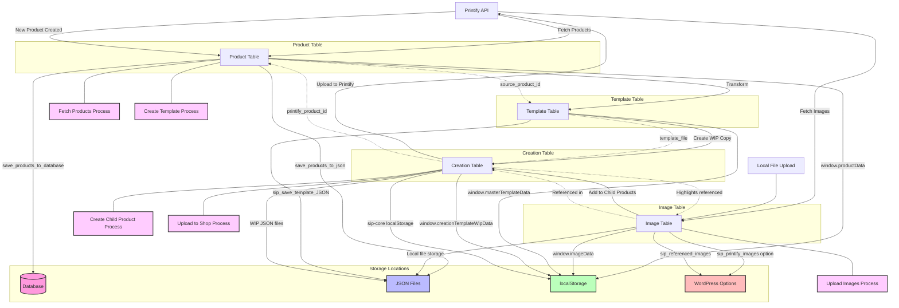

# SiP Printify Manager Data Lifecycle Flowchart

This document provides a comprehensive visualization of the data lifecycle across all four tables in the SiP Printify Manager plugin: Product Table, Image Table, Template Table, and Creation Table.

## Overall Data Lifecycle



## Key Data Processes in Detail

### 1. Fetch Products Process

```mermaid
flowchart TD
    Start[User clicks "Reload Shop Products"] --> FetchChunks[fetchShopProductsInChunks()]
    FetchChunks --> |AJAX| PHPFetch[sip_fetch_shop_products_chunk()]
    PHPFetch --> SaveDB[save_products_to_database()]
    PHPFetch --> SaveJSON[save_products_to_json()]
    PHPFetch --> |Response| UpdateWindow[Update window.productData]
    UpdateWindow --> ReloadTable[reloadProductTable()]
    ReloadTable --> SaveState[Save table state to localStorage]
    SaveState --> End[Process Complete]
```

### 2. Upload Images Process

```mermaid
flowchart TD
    Start[User uploads image] --> LocalUpload[startMultiLocalImageAdd()]
    LocalUpload --> |AJAX| PHPUpload[sip_add_local_image()]
    PHPUpload --> SaveFile[Save file to uploads directory]
    PHPUpload --> CreateThumb[Create thumbnail]
    PHPUpload --> UpdateOption[Update sip_printify_images option]
    PHPUpload --> |Response| ReloadTable[reloadImageTable()]
    
    PrintifyUpload[User uploads to Printify] --> HandleUpload[handleUploadImageToPrintify()]
    HandleUpload --> |AJAX| PHPPrintify[sip_upload_image_to_printify()]
    PHPPrintify --> |API Call| PrintifyAPI[Printify API]
    PHPPrintify --> |Response| UpdateRecord[updateUploadedImageRecord()]
    UpdateRecord --> UpdateOption
    UpdateRecord --> ReloadTable
    ReloadTable --> End[Process Complete]
```

### 3. Create Template Process

```mermaid
flowchart TD
    Start[User selects product & clicks "Create Template"] --> HandleSubmit[handleProductActionFormSubmit()]
    HandleSubmit --> |AJAX| PHPCreate[sip_create_template_from_product()]
    PHPCreate --> Transform[transform_product_data()]
    Transform --> SaveJSON[sip_save_template_JSON()]
    SaveJSON --> |Response| UpdateWindow[Update window.masterTemplateData]
    UpdateWindow --> ReloadTable[reloadTemplateTable()]
    ReloadTable --> End[Process Complete]
```

### 4. Create Child Product Process

```mermaid
flowchart TD
    Start[User clicks "Create Child Product"] --> HandleCreate[handleCreateChildProduct()]
    HandleCreate --> |AJAX| PHPCreate[sip_create_child_product()]
    PHPCreate --> LoadWIP[Load WIP file]
    LoadWIP --> AddCopy[Add new copy to copies array]
    AddCopy --> SaveWIP[Save WIP file]
    SaveWIP --> |Response| UpdateWindow[Update window.creationTemplateWipData]
    UpdateWindow --> ReloadTable[Reload creation table]
    ReloadTable --> End[Process Complete]
```

### 5. Upload to Shop Process

```mermaid
flowchart TD
    Start[User selects child product & clicks "Upload to Printify"] --> HandleUpload[handleUploadProductToPrintifyDialogue()]
    HandleUpload --> |AJAX| PHPUpload[sip_upload_child_product_to_printify()]
    PHPUpload --> AssembleJSON[assemble_product_json()]
    AssembleJSON --> |API Call| PrintifyAPI[Printify API]
    PrintifyAPI --> UpdateStatus[Update child product status]
    UpdateStatus --> SaveWIP[Save WIP file]
    SaveWIP --> |Response| UpdateWindow[Update window.creationTemplateWipData]
    UpdateWindow --> ReloadTable[Reload creation table]
    ReloadTable --> End[Process Complete]
```

## Data Storage Locations Summary

| Table | Database | Files | localStorage | WordPress Options |
|-------|----------|-------|--------------|------------------|
| Product | wp_sip_printify_products | /uploads/products/*.json | window.productData, Product_DataTables_* | - |
| Image | - | /uploads/images/* | window.imageData, Image_DataTables_* | sip_printify_images, sip_referenced_images |
| Template | - | /uploads/templates/*.json | window.masterTemplateData, Template_DataTables_* | - |
| Creation | - | /uploads/templates/wip/*_wip.json | window.creationTemplateWipData, Creation_DataTables_*, sip-core | - |

## Data Lifecycle Analysis

### 1. Product Table Data Lifecycle

**Data Sources:**
- Initial data comes from the Printify API via `fetchShopProductsInChunks()` in product-actions.js
- Data is fetched in chunks and processed incrementally

**Storage Locations:**
- **Database:** Products are stored in the WordPress database table `wp_sip_printify_products`
- **JSON Files:** Each product is saved as a JSON file in `/uploads/sip-printify-manager/products/`
- **localStorage:** Product data is stored in `window.productData` and persisted in localStorage under `Product_DataTables_[instance]`
- **DataTable State:** Table view state (sorting, filtering, etc.) is saved in localStorage

**Data Flow:**
1. User clicks "Reload Shop Products" → `handleReloadShopProductsButton()` → `fetchShopProductsInChunks()`
2. API data is fetched in chunks via AJAX to `sip_fetch_shop_products_chunk()` in product-functions.php
3. Each chunk is saved to database via `save_products_to_database()` and as JSON files via `save_products_to_json()`
4. Frontend receives data and updates `window.productData`
5. DataTable is reloaded with `reloadProductTable()`
6. Table state is saved to localStorage

### 2. Image Table Data Lifecycle

**Data Sources:**
- Printify API via `sip_reload_shop_images()` in image-functions.php
- Local file uploads via `sip_add_local_image()`

**Storage Locations:**
- **WordPress Option:** Images are stored in the WordPress option `sip_printify_images`
- **Local Files:** Uploaded images are stored in `/uploads/sip-printify-manager/images/`
- **localStorage:** Image data is stored in `window.imageData` and persisted in localStorage under `Image_DataTables_[instance]`
- **Referenced Images:** Images used in templates are tracked in the WordPress option `sip_referenced_images`

**Data Flow:**
1. Images can be loaded from Printify API or uploaded locally
2. For Printify images: `handleReFetchShopImages()` → AJAX to `sip_reload_shop_images()` → `fetch_images()`
3. For local uploads: `startMultiLocalImageAdd()` → AJAX to `sip_add_local_image()`
4. Images can be uploaded to Printify via `handleUploadImageToPrintify()` → AJAX to `sip_upload_image_to_printify()`
5. Image status (referenced in templates) is tracked via `updateImageTableStatus()`
6. DataTable is updated with `reloadImageTable()`

### 3. Template Table Data Lifecycle

**Data Sources:**
- Created from products via `sip_create_template_from_product()` in product-functions.php
- Templates are transformed product data with specific structure

**Storage Locations:**
- **JSON Files:** Templates are stored as JSON files in `/uploads/sip-printify-manager/templates/`
- **localStorage:** Template data is stored in `window.masterTemplateData` and persisted in localStorage under `Template_DataTables_[instance]`

**Data Flow:**
1. User selects product(s) and clicks "Create Template" → `handleProductActionFormSubmit()` → AJAX to `sip_create_template_from_product()`
2. Product data is transformed via `transform_product_data()` and saved as JSON via `sip_save_template_JSON()`
3. Frontend receives template data and updates `window.masterTemplateData`
4. DataTable is reloaded with `reloadTemplateTable()`

### 4. Creation Table Data Lifecycle

**Data Sources:**
- Templates loaded as working copies (WIP files)
- Child products created and modified within the creation table

**Storage Locations:**
- **WIP JSON Files:** Working copies of templates stored in `/uploads/sip-printify-manager/templates/wip/`
- **localStorage:**
  - Creation table data stored in `window.creationTemplateWipData`
  - Table state persisted in localStorage under `Creation_DataTables_[instance]`
  - Dirty state tracked in localStorage under `sip-core['sip-printify-manager']['creations-table'].isDirty`
  - Current WIP filename in localStorage under `sip-core['sip-printify-manager']['creations-table']['wipFilename']`

**Data Flow:**
1. User selects template and clicks "Create New Products" → `handleTemplateActionFormSubmit()` → `checkAndLoadTemplateWip()`
2. AJAX request to `sip_check_and_load_template_wip()` creates a WIP copy of the template
3. WIP data is loaded into `window.creationTemplateWipData`
4. Child products can be created via `handleCreateChildProduct()` → AJAX to `sip_create_child_product()`
5. Images can be added to child products via `handleBatchImageAddToProduct()` → AJAX to `sip_integrate_new_product_images()`
6. Child products can be uploaded to Printify via `handleUploadProductToPrintifyDialogue()` → AJAX to `sip_upload_child_product_to_printify()`
7. WIP can be saved back to main template via `handleSaveWipToMain()` → AJAX to `sip_save_wip_to_main_template_file()`
8. Creation table can be closed via `closeCreationTable()` → AJAX to `sip_close_creation_table()`
