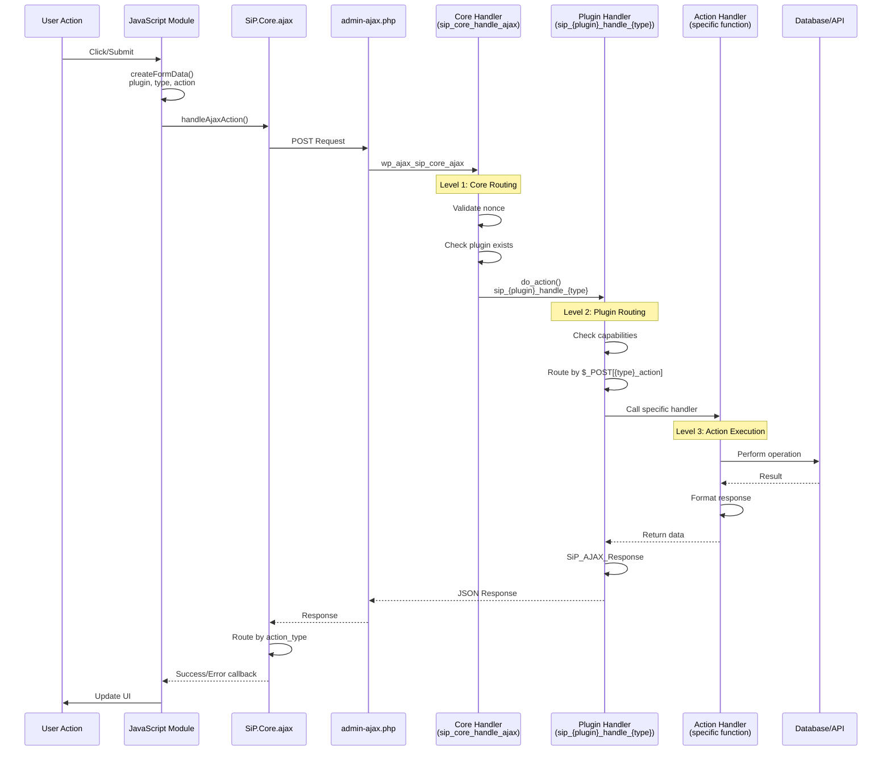

# AJAX Architecture Diagram Draft

## Mermaid Diagram for sip-plugin-ajax.md

This diagram should be placed at the beginning of the AJAX documentation, right after the Overview section.



## Key Points to Emphasize

1. **Three-Level Architecture**:
   - Core Handler: Security and plugin routing
   - Plugin Handler: Type-based routing
   - Action Handler: Specific operation

2. **Parameter Naming Convention**:
   - `plugin_id` → routes to plugin
   - `action_type` → routes to handler within plugin
   - `{action_type}_action` → specific action to perform

3. **Response Routing**:
   - PHP sets `action_type` in response
   - JavaScript routes to appropriate success handler
   - Enables cross-module operations

## Example Flow Annotation

Add this example below the diagram:

```
Example: Delete Template Action

1. User clicks "Delete Template" button
2. JS creates FormData:
   - plugin_id: 'printify-manager'
   - action_type: 'template'
   - template_action: 'delete'
3. Core routes to: sip_printify-manager_handle_template
4. Plugin handler checks for 'delete' in $_POST['template_action']
5. Calls delete_template() function
6. Returns success with action_type: 'template_deleted'
7. JS routes to templateDeleted() handler
```