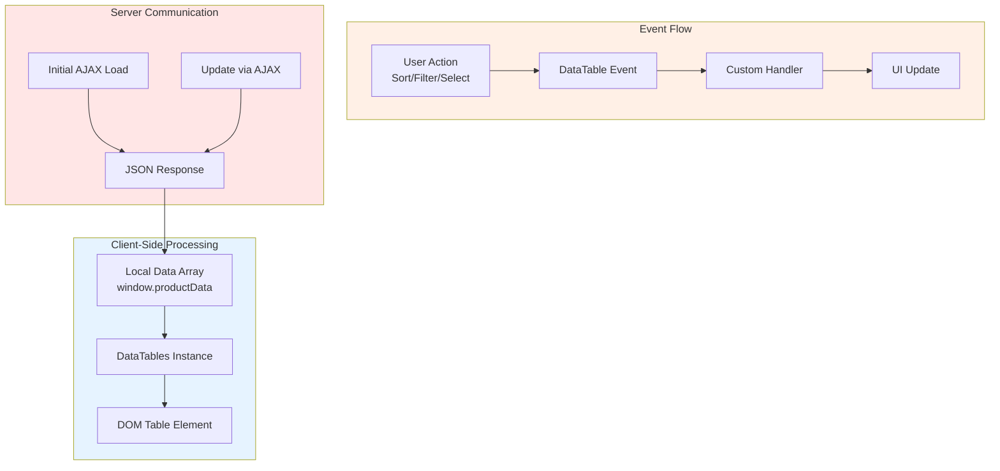
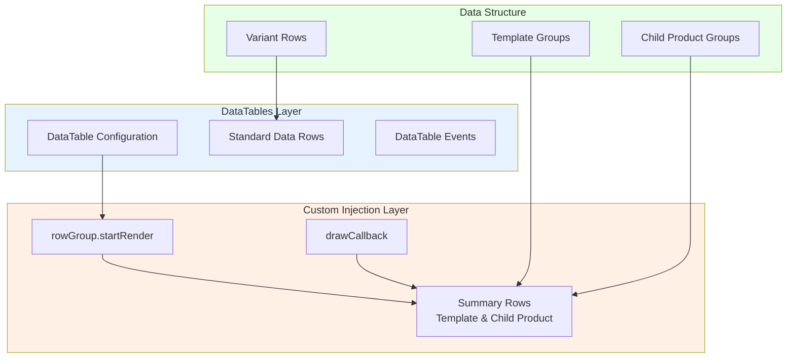

# DataTables Integration

The standard pattern for initializing DataTables in SiP plugins. For AJAX integration with DataTables, see the [AJAX Guide](./sip-plugin-ajax.md#datatables-integration).

## DataTables Architecture



## Why Client-Side Processing

DataTables implementation in SiP plugins uses **client-side processing only** for these reasons:

1. **Data Volume**: Product counts rarely exceed 10,000 items, well within client-side limits
2. **Performance**: Instant sorting/filtering without server round-trips
3. **Offline Capability**: Tables remain functional during connection issues
4. **Simplicity**: No server-side pagination/sorting logic needed
5. **State Management**: Easy to maintain selection state across operations

For simple tables that don't require DataTables functionality, see [Non-DataTables Table Refresh](./sip-feature-ui-components.md#non-datatables-table-refresh).

For complex hierarchical data relationships (like parent-child product relationships), see the [SiP Printify Manager Architecture Guide](./sip-printify-manager-architecture.md).

## DataTable Initialization Patterns

### Core Configuration

All DataTables share these base configurations:

```javascript
const baseConfig = {
    serverSide: false,
    processing: false,
    autoWidth: false,
    fixedHeader: true,
    scrollX: false,
    scrollY: "100%",
    scrollCollapse: true,
    scrollResize: true,
    paging: false,
    responsive: false,
    keys: true
};
```

### Select Configuration

Tables with row selection use:

```javascript
select: {
    style: "multi",
    selector: "td.select-column",
    headerCheckbox: true,
    info: true
},
columnDefs: [
    {
        orderable: false,
        render: DataTable.render.select(),
        targets: 0
    }
]
```

## Products Table

The products table implements complex parent-child relationships and rowGroup functionality.

### Products Table Configuration

```javascript
productTable = new DataTable("#product-table", {
    serverSide: false,
    processing: false,
    data: window.productData,
    autoWidth: false,
    fixedHeader: true,
    
    layout: {
        topStart: "info",
        topEnd: "search",
        bottomStart: null,
        bottomEnd: null
    },
    
    select: {
        style: "multi",
        selector: "td.select-column",
        headerCheckbox: true,
        info: true
    },
    
    columns: [
        {
            data: null,
            name: 'checkbox',
            defaultContent: '',
            className: 'select-column',
            width: '24px'
        },
        {
            data: 'title',
            name: 'title',
            render: function(data, type, row) {
                // Complex render logic for sorting by blueprint, parent-child relationships
                if (type === 'sort') {
                    let sortValue = row.bp_id || 'zzz';
                    // Parent-child sorting logic
                    if (row.type === 'Child' && row.parent_product_id) {
                        sortValue += '_' + row.parent_product_id + '_b_' + data.toLowerCase();
                    } else if (row.type === 'Parent') {
                        sortValue += '_' + row.product_id + '_a_' + data.toLowerCase();
                    } else {
                        sortValue += '_single_' + data.toLowerCase();
                    }
                    return sortValue;
                }
                
                if (type === 'display' || type === 'filter') {
                    const thumbnail = SiP.PrintifyManager.utilities.createThumbnail({
                        src: row.src,
                        name: data,
                        width: row.width || 0,
                        height: row.height || 0
                    }, {
                        thumbnailSize: 24,
                        containerClass: 'product-title'
                    });
                    
                    return `<div class="title-content">
                        ${thumbnail}
                        <span class="product-title">${data}</span>
                    </div>`;
                }
                
                return data;
            },
            className: 'title-column',
            width: '45%'
        },
        {
            data: 'type',
            name: 'type',
            className: 'type-column sip-filter-header',
            width: '20%',
            render: function(data, type, row) {
                if (type === 'display' && data === 'Parent') {
                    return `Parent (${row.childCount || 0})`;
                }
                return data;
            }
        },
        {
            data: 'status',
            name: 'status',
            className: 'status-column sip-filter-header',
            width: '35%'
        },
        {
            data: 'bp_id',
            name: 'hidden_sortkey',
            orderable: false,
            className: 'hidden-blueprint-column sip-hidden',
            width: '0px'
        }
    ],
    
    orderFixed: [[4, "asc"]],  // First sort by blueprint ID
    order: [[1, "asc"]],  // Then sort by title
    
    rowGroup: {
        dataSrc: "bp_id",
        emptyDataGroup: null,
        startRender: function(rows, group) {
            // Custom blueprint summary row rendering
            let rowData = rows.data()[0];
            let productCount = rows.count();
            
            let rowsHidden = rows.nodes().toArray().every(node => 
                $(node).hasClass('invisible-row')
            );
            let toggleIcon = rowsHidden ? "⯈" : "⯆";
            
            // Selection state tracking
            let selectedCount = rows.nodes().toArray().filter(node => 
                $(node).hasClass('selected')
            ).length;
            
            let checkboxState = '';
            if (selectedCount === rows.count()) checkboxState = 'checked';
            else if (selectedCount > 0) checkboxState = 'indeterminate';
            
            const blueprintThumbnail = SiP.PrintifyManager.utilities.createThumbnail({
                src: rowData.bp_image,
                name: rowData.bp_name,
                width: rowData.bp_width || 0,
                height: rowData.bp_height || 0
            }, {
                thumbnailSize: 24
            });
            
            return `<tr class="blueprint-summary-row" data-bp_id="${group}">
                <td class="bp-rowgroup-select-column"><input type="checkbox" ${checkboxState}></td>
                <td class="bp-rowgroup-visibility">${toggleIcon}</td>
                <td class="bp-rowgroup-title-column">
                    <div class="blueprint-content">
                        ${blueprintThumbnail}
                        <span class="bp-text">Blueprint: ${rowData.bp_name} (${productCount})</span>
                    </div>
                </td>
                <td></td>
                <td></td>
            </tr>`;
        }
    },
    
    stateSave: true,
    stateDuration: -1,
    
    stateLoadCallback: function(settings) {
        let savedState = localStorage.getItem("Product_DataTables_" + settings.sInstance);
        return savedState ? JSON.parse(savedState) : {};
    },
    
    stateSaveCallback: function(settings, data) {
        localStorage.setItem("Product_DataTables_" + settings.sInstance, JSON.stringify(data));
    },
    
    stateSaveParams: function(settings, data) {
        // Only save sort order, not search/filter settings
        data.search = null;
        if (data.columns) {
            data.columns.forEach(function(column) {
                column.search = null;
            });
        }
    },
    
    createdRow: function(row, data, dataIndex) {
        $(row).addClass('single-product-row');
        
        if (data.type === "Parent") {
            $(row).attr('data-parent-id', data.product_id);
            $(row).addClass('parent-product-row');
            $(row).removeClass('single-product-row');
        } else if (data.type === "Child" && data.parent_product_id) {
            $(row).attr('data-parent-id', data.parent_product_id);
            $(row).addClass('child-product-row');
            $(row).removeClass('single-product-row');
            $(row).addClass('invisible-row'); // Initially hide child rows
        }
        
        if (data.bp_id) {
            $(row).attr('data-bp-id', data.bp_id);
        }
    },
    
    drawCallback: function(settings) {
        // Update PhotoSwipe dimensions for all thumbnails
        SiP.PrintifyManager.utilities.ui.updatePhotoSwipeDimensions();
        
        const api = this.api();
        
        // Add toggle buttons to parent rows
        api.rows().every(function(rowIdx) {
            const rowData = this.data();
            if (rowData.type !== "Parent") return;
            
            const row = this.node();
            const childRows = api.rows(`[data-parent-id="${rowData.product_id}"]`).nodes();
            
            if (childRows.length > 0) {
                const toggleCell = $(row).find('td:nth-child(2)');
                const titleContent = toggleCell.find('.title-content');
                
                if (titleContent.find('.parent-product-visibility').length === 0) {
                    const toggleIcon = "⯈"; // Initially collapsed
                    titleContent.prepend($(`<span class="parent-product-visibility">${toggleIcon}</span>`));
                }
            }
        });
    }
});
```

## Images Table

The images table implements filtering and custom rendering for file metadata.

### Images Table Configuration

```javascript
imageTable = new DataTable("#image-table", {
    serverSide: false,
    processing: false,
    data: window.imageData,
    
    layout: {
        topStart: "select",
        topEnd: "info",
        bottomStart: null,
        bottomEnd: null
    },
    
    select: {
        style: "multi",
        selector: "td.select-column",
        headerCheckbox: true
    },
    
    columns: [
        {
            data: null,
            name: "checkbox",
            defaultContent: "",
            className: "select-column",
            width: "24px"
        },
        {
            data: "name",
            name: "title",
            render: function(data, type, row) {
                if (type === 'display') {
                    const thumbnail = SiP.PrintifyManager.utilities.createThumbnail({
                        src: row.src,
                        name: data,
                        width: row.width || 0,
                        height: row.height || 0
                    }, {
                        thumbnailSize: 24,
                        containerClass: 'name'
                    });
                    
                    return `<div class="title-content">
                        ${thumbnail}
                        <span class="name">${data}</span>
                    </div>`;
                }
                return data;
            },
            className: "title-column",
            width: "32%"
        },
        { 
            data: "location",
            name: "location",
            className: "location-column sip-filter-header",
            width: "16%"
        },
        { 
            data: null,
            name: "status",
            className: "status-column sip-filter-header",
            width: "14%",
            render: function(data, type, row) {
                return row.status || 'Available';
            }
        },
        { 
            data: "upload_time",
            className: "upload-time-column",
            width: "12%"
        },
        { 
            data: null,
            className: "dimensions-column",
            width: "14%",
            render: function(data, type, row) {
                if (row.dimensions) {
                    return row.dimensions;
                } else if (row.width && row.height) {
                    return row.width + 'x' + row.height;
                } else {
                    return 'Unknown';
                }
            }
        },
        { 
            data: "size",
            className: "size-column",
            width: "12%",
            render: {
                _: function(data) { 
                    if (typeof data === "number") {
                        const units = ["B", "KB", "MB", "GB", "TB"];
                        let size = Math.abs(data);
                        let unit = 0;
                        
                        while (size >= 1024 && unit < units.length - 1) {
                            size /= 1024;
                            unit++;
                        }
                        
                        return Math.round(size * 100) / 100 + " " + units[unit];
                    }
                    return data;
                },
                sort: function(data) {
                    return typeof data === "number" ? data : 0;
                },
            },
            type: "num"
        }
    ],
    
    stateSave: true,
    stateDuration: -1,
    
    stateLoadCallback: function(settings) {
        let savedState = localStorage.getItem("Image_DataTables_" + settings.sInstance);
        return savedState ? JSON.parse(savedState) : {};
    },
    
    stateSaveCallback: function(settings, data) {
        localStorage.setItem("Image_DataTables_" + settings.sInstance, JSON.stringify(data));
    },
    
    drawCallback: function(settings) {
        SiP.PrintifyManager.utilities.ui.updatePhotoSwipeDimensions();
    },
    
    language: {
        search: "",
        searchPlaceholder: "Search Images..."
    },
    
    initComplete: function() {
        let api = this.api();
        
        // Move search box to header
        let searchWrapper = $(api.table().container()).find(".dt-search"); 
        searchWrapper.appendTo(".image-header-left-top h2");
        
        // Add location filter
        var locationColumn = this.api().column("location:name");
        var locationSelect = $("<select><option value=\"\">All</option></select>")
            .addClass("sip-filter")
            .css({
                "box-sizing": "border-box",
                "margin-top": "5px"
            })
            .appendTo($(locationColumn.header()))
            .on("click", function(e) {
                e.stopPropagation();
            })
            .on("change", function() {
                var val = $.fn.dataTable.util.escapeRegex($(this).val());
                locationColumn
                    .search(val ? "^" + val + "$" : "", true, false)
                    .draw();
            });
        
        locationColumn.data().unique().sort().each(function(d) {
            if (d) {
                locationSelect.append("<option value=\"" + d + "\">" + d + "</option>");
            }
        });
        
        // Add status filter
        var statusColumn = this.api().column("status:name");
        var statusSelect = $("<select><option value=\"\">All</option></select>")
            .addClass("sip-filter")
            .css({
                "margin-top": "5px"
            })
            .appendTo($(statusColumn.header()))
            .on("click", function(e) {
                e.stopPropagation();
            })
            .on("change", function() {
                var val = $.fn.dataTable.util.escapeRegex($(this).val());
                statusColumn
                    .search(val ? "^" + val + "$" : "", true, false)
                    .draw();
            });
        
        statusColumn.data().unique().sort().each(function(d) {
            if (d) {
                statusSelect.append("<option value=\"" + d + "\">" + d + "</option>");
            }
        });
    }
});
```

### Filter Selector Scoping

**Important**: When manipulating filter dropdowns, always use table-specific selectors to avoid affecting other tables:

```javascript
// ✅ CORRECT: Target filters within specific table
$('#image-table_wrapper .sip-filter').val('');
$('#product-table_wrapper .sip-filter').val('');

// ❌ WRONG: Affects all tables
$('.sip-filter').val('');
```

This prevents unintended side effects where operations in one table trigger actions in others.

## Templates Table

The templates table is the simplest implementation with basic selection and search.

### Templates Table Configuration

```javascript
templateTable = new DataTable("#template-table", {
    serverSide: false,
    processing: false,
    data: window.masterTemplateData.templates,
    
    layout: {
        topStart: "select",
        topEnd: "info",
        bottomStart: null,
        bottomEnd: null
    },
    
    select: {
        style: "multi",
        selector: "td.select-column",
        headerCheckbox: true
    },
    
    columns: [
        {
            data: null,
            name: 'checkbox',
            defaultContent: '',
            className: 'select-column',
            width: '5%'
        },
        {
            data: 'title',
            name: 'title',
            className: 'title-column',
            width: '20%',
            render: function(data, type, row) {
                if (type === 'display') {
                    const thumbnail = SiP.PrintifyManager.utilities.createThumbnail({
                        src: row.preview_url,
                        name: data,
                        width: 100,
                        height: 100
                    }, {
                        thumbnailSize: 24,
                        containerClass: 'template-title'
                    });
                    
                    return `<div class="title-content">
                        ${thumbnail}
                        <span class="template-title">${data}</span>
                    </div>`;
                }
                return data;
            }
        },
        {
            data: 'filename',
            name: 'filename',
            className: 'filename-column',
            width: '20%'
        },
        {
            data: function(row) {
                const childCount = row.child_products ? row.child_products.length : 0;
                return childCount > 0 ? `Parent (${childCount})` : 'Single/Unknown';
            },
            name: 'type',
            className: 'type-column',
            width: '15%'
        },
        {
            data: function(row) {
                return row.last_modified_date || 'Unknown';
            },
            name: 'last_modified',
            className: 'last-modified-column',
            width: '20%',
            type: 'date'
        },
        {
            data: function(row) {
                return row.source_product && row.source_product.product_id ? 
                    `${row.source_product.product_id}` : 'N/A';
            },
            name: 'product_id',
            className: 'product-id-column',
            width: '10%'
        }
    ],
    
    order: [[2, "asc"]],  // Sort by filename
    
    stateSave: true,
    stateDuration: -1,
    
    stateLoadCallback: function(settings) {
        let savedState = localStorage.getItem("Template_DataTables_" + settings.sInstance);
        return savedState ? JSON.parse(savedState) : {};
    },
    
    stateSaveCallback: function(settings, data) {
        localStorage.setItem("Template_DataTables_" + settings.sInstance, JSON.stringify(data));
    },
    
    drawCallback: function(settings) {
        SiP.PrintifyManager.utilities.ui.updatePhotoSwipeDimensions();
    },
    
    language: {
        search: "",
        searchPlaceholder: "Search Templates..."
    },
    
    initComplete: function() {
        let api = this.api();
        let searchWrapper = $(api.table().container()).find(".dt-search");
        if ($(".template-section-header h2 .dt-search").length === 0) {
            searchWrapper.appendTo(".template-section-header h2");
        } else {
            searchWrapper.remove();
        }
    }
});
```

## Product Creation Table

### Hybrid Architecture Overview



The creation table implements a **hybrid architecture** that combines:
1. **DataTables**: For sorting, filtering, and managing variant rows
2. **Custom Row Injection**: For summary rows that aggregate variant data
3. **Dynamic Grouping**: Based on template or child product relationships

**Note**: The creation table underwent a column reorganization to improve alignment across different row types. For detailed architecture information, see the [Creation Table System section](./sip-printify-manager-architecture.md#creation-table-system) in the SiP Printify Manager Architecture guide.

### Base Configuration

```javascript
creationTable = new DataTable("#creation-table", {
    serverSide: false,
    processing: false,
    
    // Ordering configuration
    order: [[5, "asc"], [3, "asc"]], // Order by row_type then title
    orderFixed: [4, "asc"], // Fixed ordering on row_type column
    
    // Performance optimization
    deferRender: true,
    bAutoWidth: false,
    tableLayout: "fixed",
    width: "100%",
    autoWidth: false,
    fixedHeader: true,
    
    // Layout configuration
    layout: {
        topStart: "select",
        topEnd: "info"
    },
    
    data: [],  // Data populated dynamically
    
    // Selection configuration
    select: {
        style: "multi",
        selector: "td.select-column",
        headerCheckbox: true
    },
    // ... other configuration
});
```

### Column Configuration

```javascript
// Column definitions for creation table
columns: [
    {
        data: "row_number",
        name: "row_number",
        defaultContent: "",
        className: "row-number-column",
        orderable: false,
        visible: true
    },
    {
        data: "selector",
        name: "checkbox",
        defaultContent: "",
        className: "select-column"
    },
    {
        data: "visibility",
        name: "visibility",
        defaultContent: "",
        className: "visibility-column",
        orderable: false
    },
    {
        data: "variant_title",
        name: "title",
        className: "title-column"
    },
    {
        data: "row_type",
        name: "row_type",
        className: "row-type-column"
    },
    {
        data: "status",
        name: "status",
        className: "status-column",
        orderable: false
    },
    {
        data: "print_area",
        className: "print-area-column"
    },
    {
        data: "colors",
        className: "colors-column"
    },
    {
        data: "sizes",
        className: "sizes-column"
    },
    {
        data: "tags",
        name: "tags",
        className: "tags-column"
    },
    {
        data: "description",
        className: "description-column"
    },
    {
        data: "price",
        className: "price-column"
    }
]
```

### Column Definitions and Ordering

```javascript
columnDefs: [
    {
        orderable: false,
        targets: [0, 2]  // Row number and visibility columns
    },
    {
        orderable: false,
        render: DataTable.render.select(),
        targets: 1  // Checkbox column is now index 1
    },
    {
        orderSequence: ['asc', 'desc'],
        targets: '_all'  // Applies to all columns
    }
]
```

### Row Grouping with Summary Rows

```javascript
rowGroup: {
    dataSrc: function(row) {
        return row.is_template ? "template" : row.child_product_id;
    },
    emptyDataGroup: null,
    startRender: function(rows, group) {
        let rowData = rows.data()[0];
        let isTemplate = rowData.is_template === true;
        
        if (isTemplate) {
            // Template summary row
            return buildTemplateSummaryRow(rowData);
        } else {
            // Child product summary row
            return buildChildProductSummaryRow(rowData);
        }
    }
}
```

### Summary Row Builders

```javascript
function buildTemplateSummaryRow(rowData) {
    const title = rowData.template_title || 
                  rowData.variant_title.split(" - Variant")[0];
    
    return `<tr class="template-summary-row" data-template="true">
        <td class="row-number-column"></td>
        <td class="select-column"></td>
        <td class="visibility-column toggle-group" data-template="true">▶</td>
        <td class="title-column">${title}</td>
        <td class="row-type-column">Template Summary</td>
        <td class="status-column">Template</td>
        <td class="print-area-column"></td>
        <td class="colors-column"></td>
        <td class="sizes-column"></td>
        <td class="tags-column"></td>
        <td class="description-column"></td>
        <td class="price-column"></td>
    </tr>`;
}

function buildChildProductSummaryRow(rowData) {
    const title = rowData.variant_title.split(" - Variant")[0];
    const id = rowData.child_product_id;
    
    return `<tr class="child-product-summary-row" data-child_product_id="${id}">
        <td class="row-number-column"><span class="row-number"></span></td>
        <td class="select-column">
            <input type="checkbox" class="child-product-group-select">
        </td>
        <td class="visibility-column toggle-group" 
            data-child_product_id="${id}" style="cursor: pointer;">▶</td>
        <td class="title-column">${title}</td>
        <td class="row-type-column">Child Product Summary</td>
        <td class="status-column">${rowData.status}</td>
        <td class="print-area-column"></td>
        <td class="colors-column"></td>
        <td class="sizes-column"></td>
        <td class="tags-column"></td>
        <td class="description-column"></td>
        <td class="price-column"></td>
    </tr>`;
}
```

### State Management

```javascript
stateSave: true,
stateDuration: -1,

stateLoadCallback: function(settings) {
    let savedState = localStorage.getItem(
        "Creation_DataTables_" + settings.sInstance
    );
    return savedState ? JSON.parse(savedState) : {};
},

stateSaveCallback: function(settings, data) {
    localStorage.setItem(
        "Creation_DataTables_" + settings.sInstance, 
        JSON.stringify(data)
    );
}
```

### Row Creation Handler

```javascript
createdRow: function(row, data, dataIndex) {
    $(row).addClass('invisible-row');
    
    if (data.is_template) {
        $(row).addClass('template-row');
        $(row).attr('data-template-id', data.template_id);
    } else if (data.child_product_id) {
        $(row).addClass('child-product-row');
        $(row).attr('data-child-product-id', data.child_product_id);
    }
    
    if (data.row_type === 'variant') {
        $(row).addClass('variant-row');
        if (data.is_template) {
            $(row).attr('data-template-variant', 'true');
        } else {
            $(row).attr('data-child_product_id', data.child_product_id);
        }
    }
}
```

### Draw Callback for Summary Row Data Injection

```javascript
drawCallback: function(settings) {
    const api = this.api();
    const templateWipData = window.creationTemplateWipData?.data;
    const isTemplateLoaded = templateWipData;
    
    if (isTemplateLoaded) {
        // Inject data into summary rows
        const utils = SiP.PrintifyManager.creationTableSetupActions.utils;
        
        // Build all summary and variant cells
        utils.buildTemplateSummaryCells();
        utils.buildTemplateVariantCells();
        utils.buildChildProductSummaryCells();
        utils.buildChildProductVariantCells();
    }
    
    // Reattach event listeners for expansion/collapse
    attachGroupToggleListeners();
    
    // Update PhotoSwipe dimensions
    SiP.PrintifyManager.utilities.ui.updatePhotoSwipeDimensions();
}
```

### How Creation Table Components Work Together

1. **Base Configuration**: Sets up client-side processing with deferred rendering
2. **Column Configuration**: Defines 12 columns with specific data mappings
3. **Row Grouping**: Dynamically groups by template or child product ID
4. **Summary Row Builders**: Inject custom HTML rows that aggregate variant data
5. **State Management**: Persists user preferences (sort, filter) to localStorage
6. **Row Creation**: Adds CSS classes and data attributes for styling and selection
7. **Draw Callback**: Post-processing that injects aggregated data into summary rows

This hybrid approach allows DataTables to handle sorting/filtering of variant rows while custom code manages the hierarchical parent-child relationships.

## Common Patterns

### State Management

All tables implement state saving to localStorage:

```javascript
stateSave: true,
stateDuration: -1,

stateLoadCallback: function(settings) {
    let savedState = localStorage.getItem("TableName_DataTables_" + settings.sInstance);
    return savedState ? JSON.parse(savedState) : {};
},

stateSaveCallback: function(settings, data) {
    localStorage.setItem("TableName_DataTables_" + settings.sInstance, JSON.stringify(data));
}
```

### Thumbnail Integration

Tables use the standardized thumbnail utility. For complete PhotoSwipe implementation, refer to the [PhotoSwipe Guide](./sip-feature-photoswipe.md):

```javascript
const thumbnail = SiP.PrintifyManager.utilities.createThumbnail({
    src: row.src,
    name: data,
    width: row.width || 0,
    height: row.height || 0
}, {
    thumbnailSize: 24,
    containerClass: 'title-class',
    usePhotoSwipe: true
});
```

### PhotoSwipe Updates

All tables update PhotoSwipe dimensions in drawCallback:

```javascript
drawCallback: function(settings) {
    SiP.PrintifyManager.utilities.ui.updatePhotoSwipeDimensions();
}
```

### Column Filtering

Column filters are added in initComplete:

```javascript
initComplete: function() {
    var column = this.api().column("column:name");
    var select = $("<select><option value=\"\">All</option></select>")
        .addClass("sip-filter")
        .appendTo($(column.header()))
        .on("change", function() {
            var val = $.fn.dataTable.util.escapeRegex($(this).val());
            column.search(val ? "^" + val + "$" : "", true, false).draw();
        });
    
    column.data().unique().sort().each(function(d) {
        if (d) {
            select.append("<option value=\"" + d + "\">" + d + "</option>");
        }
    });
}
```

### Row Grouping

Complex tables use rowGroup for hierarchical display:

```javascript
rowGroup: {
    dataSrc: "grouping_field",
    emptyDataGroup: null,
    startRender: function(rows, group) {
        // Custom rendering for group header row
        return `<tr class="group-row">
            <td colspan="10">Group: ${group}</td>
        </tr>`;
    }
}
```

## Implementation Requirements

### Table Container

Tables require specific HTML structure:

```html
<div class="table-container">
    <table id="table-id" class="wp-list-table widefat fixed striped">
        <!-- Table content populated by DataTables -->
    </table>
</div>
```

### CSS Classes

Standard CSS classes used across tables:

- `.select-column` - Checkbox column
- `.title-column` - Primary content column
- `.sip-filter-header` - Columns with filters
- `.sip-hidden` - Hidden columns for sorting
- `.invisible-row` - Rows hidden by default
- `.sip-visibility` - Toggle visibility controls

### Event Handling

Tables attach event listeners after initialization:

```javascript
// In drawCallback or after initialization
api.rows().every(function() {
    const row = this.node();
    // Attach row-specific event handlers
});
```

## Data Management

### Initial Data Loading

Tables load data from window variables:

```javascript
data: window.productData,       // Products table
data: window.imageData,         // Images table
data: window.masterTemplateData.templates,  // Templates table
data: []  // Creation table (populated dynamically)
```

### Data Updates

Tables refresh data using:

```javascript
// Reload with new data
table.clear().rows.add(newData).draw();

// Reload from server (for AJAX tables)
table.ajax.reload();
```

## Table Lifecycle Management

### Destruction and Cleanup

When destroying DataTables that have moved UI elements (like search fields or filters), you must clean up the moved elements to prevent orphaning:

```javascript
// WRONG - leaves orphaned elements
if ($.fn.DataTable.isDataTable('#image-table')) {
    $('#image-table').DataTable().destroy();
}

// CORRECT - cleans up moved elements first
if ($.fn.DataTable.isDataTable('#image-table')) {
    // Remove any UI elements that were moved to other locations
    $('.image-header-left-top h2 .dt-search').remove();
    $('.sip-filter').remove(); // Remove any moved filters
    
    $('#image-table').DataTable().destroy();
}
```

### Common Cleanup Scenarios

| Moved Element | Cleanup Selector | When to Use |
|---------------|------------------|-------------|
| Search field | `.target-container .dt-search` | When search field moved in initComplete |
| Column filters | `.sip-filter` | When filters added to column headers |
| Custom controls | `.custom-control-class` | When custom UI elements added |

### Detection Best Practices

Use consistent table detection patterns:

```javascript
// Check if DataTable exists
if ($.fn.DataTable.isDataTable('#table-id')) {
    // Table exists, can call methods
    const table = $('#table-id').DataTable();
}

// Check if table variable is valid
if (tableVariable && typeof tableVariable.clear === 'function') {
    // Variable contains valid DataTable instance
    tableVariable.clear().rows.add(newData).draw();
}
```

## Key Implementation Details

1. All tables use client-side processing (`serverSide: false`)
2. Tables implement state persistence via localStorage
3. Complex tables use rowGroup for hierarchical display
4. Selection is handled via DataTables select extension
5. Thumbnails use standardized utility functions
6. PhotoSwipe integration is updated on each draw
7. Column filters are added dynamically in initComplete
8. Custom rendering handles sorting vs display differently
9. **CRITICAL:** Always clean up moved UI elements before destroying tables

## Table Visibility Management

### Critical Lesson Learned

**Always check basic visibility first.** A multi-hour debugging session revealed that a table wasn't showing simply because it was hidden with `$('#element').hide()` and never shown again. Before investigating complex initialization issues, always verify:

1. Is the element visible? Check with browser inspector
2. Is it explicitly hidden in CSS or JavaScript?
3. Is there a corresponding `.show()` call?

### The Three-Layer Structure

Most SiP tables have three layers of visibility to manage:

1. **Parent Container**: e.g., `#product-creation-container`
2. **Table Container**: e.g., `#creation-datatable`  
3. **Table Element**: e.g., `#creation-table`

**All three must be visible for the table to display properly.**

### Standard Pattern for Showing Tables

```javascript
function showTable() {
    // 1. Hide any "no data" messages
    $('#no-data-message').hide();
    
    // 2. Show all containers from parent to child
    $('#parent-container').show();
    $('#table-container').show();
    $('#table-element').show();
    
    // 3. Initialize or refresh DataTable
    initializeDataTable();
}
```

### Standard Pattern for Hiding Tables

```javascript
function hideTable() {
    // 1. Destroy DataTable if it exists
    if ($.fn.DataTable.isDataTable('#table-element')) {
        $('#table-element').DataTable().destroy();
    }
    
    // 2. Hide the table element (but usually keep containers visible)
    $('#table-element').hide();
    
    // 3. Show any "no data" messages
    $('#no-data-message').show();
}
```

### Common Visibility Issues

#### Issue 1: Table Hidden After Close
**Problem**: Table doesn't appear after being closed and reopened.
**Cause**: Close handler hides table element but reopen doesn't show it.
**Solution**: Always include `$('#table-element').show()` when displaying tables.

#### Issue 2: Container Hierarchy
**Problem**: Table appears blank even though DataTable has data.
**Cause**: Parent container is hidden while child elements are shown.
**Solution**: Show all containers in the hierarchy.

#### Issue 3: Page Reload vs Dynamic Load
**Problem**: Table works on page reload but not on AJAX load.
**Cause**: HTML default state differs from JavaScript-managed state.
**Solution**: Ensure dynamic operations explicitly set all visibility states.

### Debugging Checklist

When a table isn't showing:

1. **Check Basic Visibility**
   ```javascript
   console.log($('#table-element').is(':visible')); // Is it visible?
   console.log($('#table-element').css('display')); // What's the display value?
   ```

2. **Check Parent Visibility**
   ```javascript
   $('#table-element').parents().each(function() {
       console.log(this.id, $(this).is(':visible'));
   });
   ```

3. **Check DataTable State**
   ```javascript
   console.log($.fn.DataTable.isDataTable('#table-element')); // Is it initialized?
   ```

4. **Check for Hidden Calls**
   - Search codebase for `#table-element.*hide`
   - Search for corresponding `.show()` calls
   - Verify they're balanced

### Best Practices

1. **Always Show What You Hide**: If you hide an element, ensure there's a corresponding show operation.

2. **Manage Visibility at the Right Level**: 
   - Hide containers for major state changes
   - Hide table elements for data updates
   - Hide rows for filtering

3. **Document Visibility Dependencies**: Comment when visibility depends on other state.

4. **Use Consistent Patterns**: All tables should follow the same show/hide patterns.

5. **Test Both Paths**: Always test both page reload and dynamic load scenarios.

### Implementation Examples

#### Product Table
- Hidden when shop is cleared
- Shown when shop is selected
- Parent container managed by `updateShopVisibility()`

#### Template Table  
- Always visible (no hide operations)
- Only rows are filtered

#### Creation Table
- Hidden when template is closed
- Must explicitly show table element when loading template
- Parent container managed separately

#### Image Table
- Hidden when shop is cleared
- Shown when shop is selected
- Filters managed independently

### Common Mistakes to Avoid

1. **Hiding without showing**: `$('#element').hide()` without corresponding `.show()`
2. **Showing child while parent is hidden**: Child won't be visible
3. **Initializing DataTable on hidden element**: Causes rendering issues
4. **Forgetting the table element**: Showing container but not table itself
5. **Not checking simplest solution first**: Always verify basic visibility before complex debugging

Remember: When something isn't showing, first check if it's simply hidden. The simplest explanation is usually correct.

## Working with DataTables Events

### Selection Event Handling

When you need to modify DataTables' selection behavior, work WITH the built-in events rather than replacing them:

```javascript
// Good: React to selection events
$('#table-id').on('select.dt', function(e, dt, type, indexes) {
    if (type === 'row') {
        indexes.forEach(function(index) {
            var row = dt.row(index);
            var $node = $(row.node());
            // Apply custom logic based on row state
            if ($node.hasClass('filter-hidden')) {
                row.deselect();
            }
        });
    }
});

// Bad: Override click handlers and prevent default behavior
$(document).on('click', '#table-id thead th.select-column input', function(e) {
    e.stopPropagation(); // This prevents DataTables from working normally
    // Custom implementation...
});
```

### Common Event Patterns

1. **select.dt / deselect.dt**: Fired when rows/cells/columns are selected/deselected
2. **draw.dt**: Fired when table is redrawn
3. **init.dt**: Fired when table initialization is complete
4. **page.dt**: Fired when page changes
5. **order.dt**: Fired when ordering changes

### Best Practices

1. **Enhance, Don't Replace**: Add functionality via events rather than replacing core behavior
2. **Check State First**: Always verify the current state before applying changes
3. **Use DataTables API**: Use the API methods rather than direct DOM manipulation
4. **Handle Edge Cases**: Consider filtered rows, hidden rows, and custom row types

## Performance Considerations

### DOM-Based Filtering

When implementing custom filtering that manipulates DOM elements directly (rather than using DataTables' search API):

```javascript
// Cache jQuery selections at the start
var $allRows = $('.row-type');
var $allVariants = $('.variant-row');

// Use .filter() on cached collections instead of new selectors
var $matchingRows = $allRows.filter('[data-id="' + id + '"]');

// Batch operations to minimize reflows
$allRows.removeClass('filter-hidden'); // Class changes first
$matchingRows.show();                   // Then visibility changes
```

### Performance Monitoring

For operations that might scale with data size, add timing to identify bottlenecks:

```javascript
var startTime = performance.now();
// ... operation ...
var duration = performance.now() - startTime;
console.log(`Operation completed in ${duration.toFixed(2)}ms`);
```

If an operation is fast enough (< 100ms), avoid adding complexity like spinners or async processing.

## Related Guides
- For CSS styling standards and DataTables-specific CSS architecture, see the [CSS Development Guide](./sip-development-css.md#datatables-styling-standards)
- For dashboard integration examples, see the [Dashboards Guide](./sip-plugin-dashboards.md#step-5-initialize-datatables)