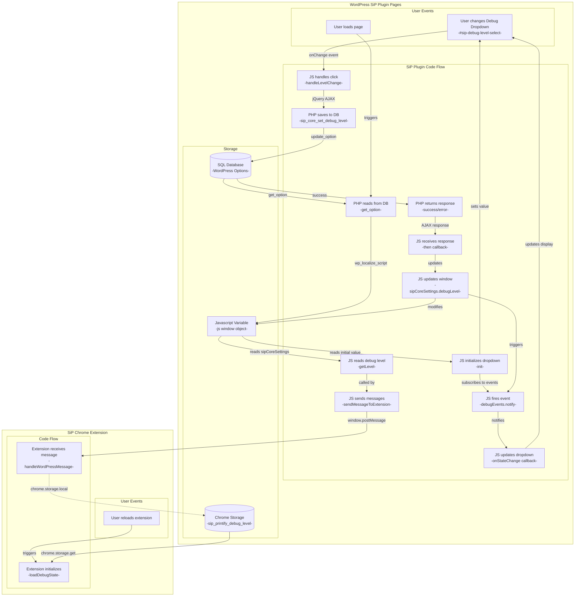

# Debug State Storage Architecture



## Simple Explanation

### WordPress Side:
- Debug toggle in header updates SQL database (WordPress Options)
- PHP writes to Javascript Variables (js window object) on page load
- NO localStorage usage

### Extension Side:
- Chrome Storage is the single source for extension
- Extension maintains its own debug state

### Communication:
- WordPress sends debug level in messages to extension
- Extension temporarily uses WordPress level when on WordPress pages
- NO storage synchronization between systems

## Mermaid Diagram Framework Guide

### Core Principle: Complete Function Representation
**Every function that reads, writes, transforms, or passes data must be shown in the diagram.** This includes:
- Functions that read from storage
- Functions that write to storage
- Functions that transform data between formats
- Functions that pass data between components
- Event handlers and callbacks
- AJAX request and response handlers

If a function participates in the data flow, it must have a box in the diagram. This ensures the implementation can be validated against the documented architecture.

### Box Types and Organization

#### System Containers
- **Top-level subgraphs**: Represent major systems (e.g., "WordPress SiP Plugin Pages", "SiP Chrome Extension")
- Use quotes around labels to prevent parsing issues
- Keep labels concise to avoid wrapping

#### Within Each System
1. **User Events**: Actions initiated by users
   - Format: `[User does action]`
   - Examples: "User clicks Debug Toggle", "User loads page", "User reloads extension"

2. **Code Flow**: Functions and code execution
   - Format: `[Language does action<br/>-functionName-]`
   - Language prefix: JS, PHP, etc.
   - Action description on first line
   - Function name in dashes on second line
   - Examples: 
     - `[JS handles click<br/>-handleLevelChange-]`
     - `[PHP saves to DB<br/>-sip_core_set_debug_level-]`

3. **Storage**: Data persistence mechanisms
   - Format: `[(Storage Type<br/>-specific identifier-)]`
   - Use cylinder shape for databases: `[(...)]`
   - Use rectangle for runtime storage: `[...]`
   - Examples:
     - `[(SQL Database<br/>-WordPress Options-)]`
     - `[Javascript Variable<br/>-js window object-]`
     - `[(Chrome Storage<br/>-sip_printify_debug_level-)]`

### Connection Labels

Connections show how data flows between nodes:

#### Event Connections
- User events: `-->|triggers|` or `-->|specific event type|`
- Examples: `-->|onChange event|`, `-->|triggers|`

#### Data Flow Connections
- Function calls: `-->|function/method name|`
- Data access: `-->|reads from|`, `-->|writes to|`
- API calls: `-->|jQuery AJAX|`, `-->|window.postMessage|`
- Examples:
  - `-->|get_option|` (PHP reading from database)
  - `-->|update_option|` (PHP writing to database)
  - `-->|wp_localize_script|` (PHP to JavaScript)
  - `-->|chrome.storage.get|` (Extension reading storage)

#### Special Connection Types
- Dotted line `-.->` for separate/independent operations
- Example: `-.->|chrome.storage.local|` (independent storage system)

### Naming Conventions

1. **Consistency**: Use actual function names from code, not descriptions
2. **Language Prefixes**: Always prefix code actions with language (JS, PHP)
3. **Storage Keys**: Show actual keys/options used in storage systems
4. **No Parentheses**: Avoid `()` in labels - Mermaid can't parse them
5. **No Quotes in Labels**: Avoid quotes inside node labels

### Layout Tips

1. **Order Matters**: Declare nodes in logical flow order
2. **Group Related Items**: Use subgraphs to organize related nodes
3. **Avoid Over-nesting**: Too many subgraph levels causes layout issues
4. **Keep Labels Short**: Long labels cause wrapping and layout problems

### Data Flow Completeness Checklist

When documenting a data flow, verify:

1. **Initial State**: How does data get into the system?
   - Page load sequences
   - Default values
   - Initialization functions

2. **State Changes**: How does data change?
   - User interactions that trigger changes
   - All functions in the chain from user action to storage
   - AJAX request/response cycles
   - Success AND error paths

3. **State Propagation**: How do changes propagate?
   - Event notifications
   - Callback chains
   - UI updates
   - Cross-system messaging

4. **State Reading**: Who reads the data?
   - UI elements that display values
   - Functions that use the data
   - External systems that receive the data

### Common Mistakes to Avoid

1. **Hidden Functions**: Don't hide intermediate functions inside generic boxes
   - Wrong: "JS handles everything"
   - Right: Show each function in the chain

2. **Missing Response Handlers**: Always show what happens after async operations
   - Show both success and error paths for AJAX
   - Show how responses update state

3. **Incomplete Event Flows**: Show the full event propagation
   - Event trigger
   - Event handler
   - State update
   - UI update

### Example Pattern
```mermaid
subgraph "System Name"
    subgraph "User Events"
        UserAction[User does something]
    end
    
    subgraph "Code Flow"
        Handler[JS handles event<br/>-handleEvent-]
        Process[JS processes data<br/>-processData-]
        Save[PHP saves data<br/>-saveData-]
        Response[PHP returns response<br/>-success/error-]
        Update[JS updates state<br/>-updateState-]
        Notify[JS notifies listeners<br/>-notify-]
    end
    
    subgraph "Storage"
        DataStore[(Storage Type<br/>-storage key-)]
        StateVar[Runtime State<br/>-variable name-]
    end
end

UserAction -->|event| Handler
Handler -->|transforms| Process
Process -->|AJAX| Save
Save -->|writes| DataStore
DataStore -->|result| Response
Response -->|data| Update
Update -->|modifies| StateVar
Update -->|triggers| Notify
```