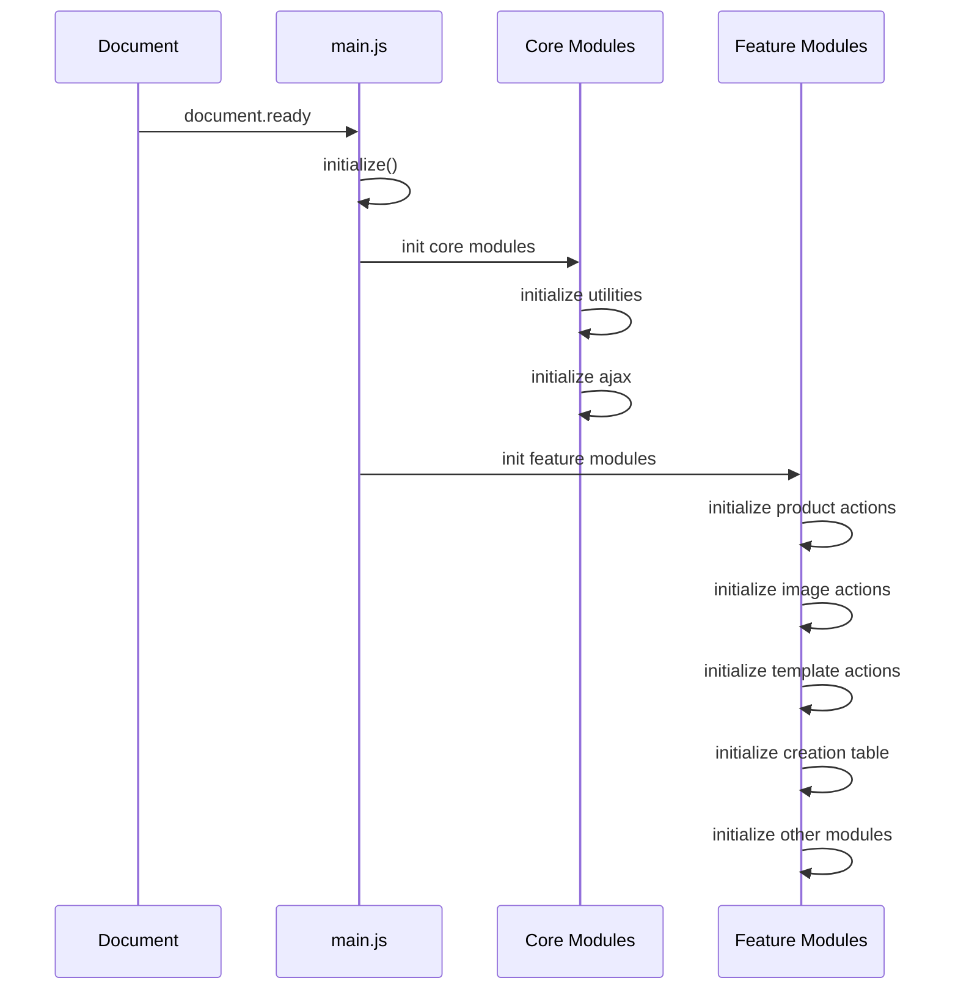

# SiP Printify Manager - Code Documentation

> **Viewing This Documentation**: 
> 
> To properly view this documentation with rendered Mermaid diagrams in VS Code:
> 1. Press `Ctrl+Shift+V` (Windows/Linux) or `Cmd+Shift+V` (Mac) to open the Markdown Preview
> 2. For enhanced Mermaid diagram support, install the "Markdown Preview Enhanced" extension
> 3. When clicking links to other documentation files, they will open in the editor - press `Ctrl+Shift+V` (Windows/Linux) or `Cmd+Shift+V` (Mac) again to view them in preview mode

## Table of Contents

- [Overview](#overview)
- [Technology Stack](#technology-stack)
- [Plugin Architecture](#plugin-architecture)
- [Code Structure](#code-structure)
- [Data Flow and State Management](#data-flow-and-state-management)
- [Key Patterns and Conventions](#key-patterns-and-conventions)
- [Development Standards](#development-standards)
- [Questions and Observations](#questions-and-observations-for-verification)

## Overview

This document provides technical documentation for developers working with the SiP Printify Manager WordPress plugin. It explains the technology stack, code structure, and the patterns and conventions that should be followed when modifying or extending the codebase.

## Technology Stack

// In addition to wordpress, I think it makes sense for the stack to include reference to woocommerce, printify and perhaps other components of the worpress installation if they are integral to its functionality.  Speaking of which, a diagram of the file hierarchy should be included somewhere aroundhere as a high level map of the components and conceptual framework of the plugin.

- **Backend**: PHP (WordPress plugin)
- **Frontend**: JavaScript, jQuery, HTML, CSS
- **Data Storage**:  //I'd like to be explicit about what is stored in each format and why.  It would be nice if the diagram showing the storage types that you have below was shown here... or if this was just a pointer to a section that explains the storage types with the diagram.  It feels like bad design to present this much information without the diagram here.
  - WordPress options API
  - JSON files stored in the WordPress uploads directory
  - Browser localStorage for UI state
  - MySQL database for product data
- **Third-party Libraries**:
  - DataTables for table management
  - PhotoSwipe for image galleries
  - CodeMirror for the JSON editor

## Plugin Architecture

This diagram shows the high-level architecture of the SiP Printify Manager plugin:
// This is extremely interesting.  My temptation is to pair and cross reference this with a diagram of the file hierarchy.


## Code Structure

The plugin follows a modular architecture with clear separation of concerns:

### Core Files

- `sip-printify-manager.php`: Main plugin file that initializes the plugin, registers hooks, and loads dependencies
- `views/dashboard-html.php`: Main dashboard HTML template

### JavaScript Structure

#### Core Modules

- `assets/js/main.js`: Entry point that initializes all other modules
- `assets/js/core/utilities.js`: Utility functions and UI state management
- `assets/js/core/ajax.js`: AJAX request handling and response processing with success handler registration system

#### Feature Modules

Each major feature has its own JavaScript module:

- `assets/js/modules/product-actions.js`: Product table functionality
- `assets/js/modules/image-actions.js`: Image table functionality
- `assets/js/modules/template-actions.js`: Template table functionality
- `assets/js/modules/creation-table-actions.js`: Product creation table functionality
- `assets/js/modules/creation-table-setup-actions.js`: Setup for the product creation table
- `assets/js/modules/json-editor-actions.js`: Template JSON editor functionality
- `assets/js/modules/catalog-image-index-actions.js`: Catalog image index functionality
- `assets/js/modules/shop-actions.js`: Shop management functionality
- `assets/js/modules/sync-products-to-shop-actions.js`: Synchronization with Printify

This diagram illustrates the organization of the codebase:
// This diagram is not really legible at this scale.  A better solution here might be to limit this to the structure illustration on the right and to use a proper file hierarchy outline to show the specific files.


### PHP Structure

#### Core Files

- `includes/utilities.php`: Utility functions used throughout the plugin
- `includes/ajax-functions.php`: AJAX request handling

#### Feature Files

Each major feature has its own PHP file:

- `includes/product-functions.php`: Product-related functionality
- `includes/image-functions.php`: Image-related functionality
- `includes/template-functions.php`: Template-related functionality
- `includes/creation-table-functions.php`: Product creation table functionality
- `includes/creation-table-setup-functions.php`: Setup for the product creation table
- `includes/json-editor-functions.php`: Template JSON editor functionality
- `includes/catalog-image-index-functions.php`: Catalog image index functionality
- `includes/shop-functions.php`: Shop management functionality
- `includes/sync-products-to-shop-functions.php`: Synchronization with Printify

### Module Initialization Flow
// this is amazing - the modules should reference their filenames
This diagram shows how modules are initialized:



## Data Flow and State Management

### Data Storage Mechanisms

The plugin uses four primary data storage mechanisms:

// These need to be separated out into individual infographics.  smushed together like this on one horizontal leaves them much too small to be legible.


#### 1. WordPress Options API

Used for storing persistent configuration data that needs to be available server-side.

//Used for storing printify shop details retrieved from printify during authentication.  These inclue:

**Printify Shop Data:**
- `printify_bearer_token`: Encrypted API token for Printify
- `sip_printify_shop_id`: ID of the connected Printify shop
- `sip_printify_shop_name`: Name of the connected Printify shop
- `sip_printify_blueprints`: Cache of blueprint data from Printify
- `sip_printify_images`: Cache of image data from Printify
- `sip_local_images`: Data for locally uploaded images

**Access Pattern:**
```php
// Get option
$token = get_option('printify_bearer_token');

// Update option
update_option('sip_printify_shop_name', $shop_name);
```

#### 2. JSON Files
// JSON Files are stored for products, templates and the template_wip that is loaded into the product creation table for editing.  This was done initially to allow easier user access and editing of the data and has been preserved for convenience.  These are stored in 
\public\wp-content\uploads\sip-printify-manager\
products\
templates\
templates\wip\

**File Types:**
- Product JSON files: `wp-upload-dir/sip-printify-manager/products/{product-title}.json`
- Template JSON files: `wp-upload-dir/sip-printify-manager/templates/{template-title}.json`
- Template WIP files: `wp-upload-dir/sip-printify-manager/templates/wip/{template-title}_wip.json`
- Editor state files: `wp-upload-dir/sip-printify-manager/templates/wip/editor-state.json`

**Access Pattern:**
```php
// Read JSON file
$json_file = wp_upload_dir()['basedir'] . '/sip-printify-manager/templates/' . $filename;
$json_data = file_get_contents($json_file);
$template_data = json_decode($json_data, true);

// Write JSON file
$json_file = wp_upload_dir()['basedir'] . '/sip-printify-manager/templates/' . $filename;
file_put_contents($json_file, json_encode($template_data, JSON_PRETTY_PRINT));
```

#### 3. Browser localStorage

Used for storing UI state that needs to persist between page loads but doesn't need to be available server-side.  \\Table UI state is tracked and refreshed using datatables.  Other non data-tables UI state is tracked in localStorage.  The terms "track" and "refresh" are used in the functions for saving and loading ui state to differentiate it from non ui state data.

**Key Storage:**
- `sip-core`: Contains UI state for all components
  - `sip-printify-manager`: Contains plugin-specific UI state
    - `products-table`: Product table UI state
    - `images-table`: Image table UI state
    - `templates-table`: Template table UI state
    - `creations-table`: Creation table UI state
    - `catalog-image-index`: Catalog image index UI state
    - `template-json-editor`: Template JSON editor UI state
    - `main-window`: Main window UI state

**Access Pattern:**
```javascript
// Get state
const state = JSON.parse(localStorage.getItem('sip-core')) || {};
const productTableState = state['sip-printify-manager']?.['products-table'] || {};

// Update state
state['sip-printify-manager']['products-table'] = {
    actionDropdown: $('#product_action').val() || '',
};
localStorage.setItem('sip-core', JSON.stringify(state));
```

#### 4. MySQL Database

Used for storing product data that needs to be queried efficiently.

**Tables:**
- `wp_sip_printify_products`: Stores product data for efficient querying

**Schema:**
```sql
CREATE TABLE wp_sip_printify_products (
    id VARCHAR(64) NOT NULL,
    title TEXT NOT NULL,
    status VARCHAR(50) NOT NULL,
    blueprint_id VARCHAR(64) NOT NULL,
    image_url TEXT NOT NULL,
    full_data LONGTEXT NOT NULL,
    PRIMARY KEY (id)
) ENGINE=InnoDB DEFAULT CHARSET=utf8mb4 COLLATE=utf8mb4_unicode_ci;
```

**Access Pattern:**
```php
global $wpdb;
$table_name = $wpdb->prefix . 'sip_printify_products';

// Query products
$products = $wpdb->get_results(
    "SELECT id, title, status, blueprint_id, image_url FROM $table_name",
    ARRAY_A
);

// Insert or update product
$wpdb->replace($table_name, [
    'id' => $product_id,
    'title' => $product['title'],
    'status' => $product['status'],
    'blueprint_id' => $product['blueprint_id'],
    'image_url' => $product['image_url'],
    'full_data' => wp_json_encode($product)
]);
```

### Data Flow

The plugin follows specific data flow patterns for different operations:

#### 1. Shop Initialization Flow

When a user enters a Printify API token:


#### 2. Product Table Data Flow //In time this should be the flow for all the tables.  All tables should be using data tables.  The products table will initialize as serverside: true, and will use a custom REST API ajax handler.  This may be the case for the other tables as well.  If the other tables do not use sufficient data to need to use serverside handling, they will continue to use the ajax handler specified in the ajax.js file.

### AJAX Handling System

The plugin uses a centralized AJAX handling system with specialized optimizations for the product table:

#### 1. Core AJAX Module (`ajax.js`)

The core AJAX module provides a standardized way to handle AJAX requests and responses:

```javascript
// Handle AJAX action
SiP.Core.ajax.handleAjaxAction('action_type', formData);
```

Key components:
- **Success Handler Registration**: Each module registers a handler for its action type
- **Centralized Error Handling**: Common error handling for all AJAX requests
- **Spinner Management**: Automatic showing/hiding of loading spinners


#### 2. Success Handler Registration System

Each module registers a success handler for its specific action type:

```javascript
// Register a success handler
SiP.Core.ajax.registerSuccessHandler('template_action', SiP.PrintifyManager.templateActions.handleSuccessResponse);
```

The success handler is called when an AJAX response is received:

```javascript
// Success handler implementation
function handleSuccessResponse(response) {
    if (!response.success) {
        console.error('Error in AJAX response:', response.data);
        return;
    }
    
    switch (response.data.action_type) {
        case 'specific_action':
            // Handle specific action
            break;
        // Other cases...
    }
}
```

#### 3. Dual AJAX Approach for Product Table

The product table uses a dual approach for optimal performance:

1. **REST API for Data Loading**:
   - Uses WordPress REST API for server-side processing
   - Implemented with `fetch()` instead of jQuery AJAX
   - Optimized for handling large datasets efficiently
   - Endpoint: `/sip-printify/v1/products`

```javascript
// REST API approach in product-actions.js
fetch(url, {
    credentials: 'same-origin',
    headers: {
        'X-WP-Nonce': sipAjax.rest_nonce
    }
})
.then(response => response.json())
.then(response => {
    SiP.PrintifyManager.productActions.handleSuccessResponse(response);
})
```

2. **Standard AJAX for Actions**:
   - Uses `SiP.Core.ajax.handleAjaxAction()` for form submissions and other actions
   - Consistent with other modules
   - Example: Creating templates, removing products

```javascript
// Standard AJAX approach for actions
const formData = SiP.Core.utilities.createFormData('sip-printify-manager', 'product_action', 'create_template');
SiP.Core.ajax.handleAjaxAction('product_action', formData);
```

#### 4. Client-Side Data Handling for Other Tables

Other tables (templates, images, etc.) use client-side data handling:

```javascript
// Template table initialization with client-side data
templateTable = new DataTable("#template-table", {
    serverSide: false,
    processing: false,
    data: window.masterTemplateData.table_items || []
});
```

These tables still use the standard AJAX system for actions:

```javascript
// Template action example
const formData = SiP.Core.utilities.createFormData('sip-printify-manager', 'template_action', 'delete_template');
SiP.Core.ajax.handleAjaxAction('template_action', formData);
```

#### 5. Server-Side AJAX Request Routing

The server-side AJAX handling follows a two-level routing pattern:

1. **First-Level Routing (ajax-functions.php)**:
   - All AJAX requests are initially processed by `sip_handle_ajax_request()`
   - Requests are routed based on the `action_type` parameter (e.g., 'template_action', 'product_action')
   - Each action type has a dedicated handler function (e.g., `sip_handle_template_action()`, `sip_handle_product_action()`)

```php
// First-level routing in ajax-functions.php
function sip_handle_ajax_request() {
    $action_type = isset($_POST['action_type']) ? sanitize_text_field($_POST['action_type']) : '';
    
    switch ($action_type) {
        case 'template_action':
            sip_handle_template_action();
            break;
        case 'product_action':
            sip_handle_product_action();
            break;
        // Other action types...
    }
}
```

2. **Second-Level Routing (specific handler functions)**:
   - Each handler function further routes the request based on a specific action parameter
   - For example, `sip_handle_template_action()` routes based on the `template_action` parameter
   - Each specific action has its own case in a switch statement

```php
// Second-level routing in template-functions.php
function sip_handle_template_action() {
    $template_action = isset($_POST['template_action']) ? sanitize_text_field($_POST['template_action']) : '';
    
    switch ($template_action) {
        case 'check_and_load_template_wip':
            // Redirect to the creation setup action handler
            $_POST['creation_setup_action'] = 'check_and_load_template_wip';
            $_POST['creation_template_wip_name'] = str_replace('.json', '', $selected_templates[0]);
            sip_handle_creation_setup_action();
            break;
        case 'delete_template':
            $result = sip_delete_selected_templates($selected_templates);
            // Process and return result
            break;
        // Other template actions...
    }
}
```

3. **Cross-Module Routing**:
   - Some actions may need to be handled by functions in different modules
   - For example, 'check_and_load_template_wip' in template-functions.php redirects to sip_handle_creation_setup_action()
   - This allows for modular code organization while maintaining proper routing

#### 6. Response Format Standardization

All AJAX responses follow a consistent format, whether from REST API or standard AJAX:

```javascript
{
    success: true,
    data: {
        action_type: 'product_action',
        product_action: 'specific_action',
        message: 'Action completed successfully',
        params: {
            // Action-specific data
            table_items: [],
            total: 0,
            filtered: 0
        }
    }
}
```

This consistent format ensures that success handlers can process responses uniformly. The standardization is achieved through the `sip_standardize_datatable_response()` function in ajax-functions.php:

```php
function sip_standardize_datatable_response($module_action_type, $specific_action, $data, $message) {
    // Create standard response structure
    $response = array(
        'action_type' => $module_action_type,
        $module_action_type => $specific_action,
        'message' => $message
    );
    
    // Add data in a consistent format
    $response['params'] = array(
        'total' => $data['total'],
        'filtered' => $data['filtered'],
        'table_items' => $data['table_items']
    );
    
    return $response;
}
```

When loading and interacting with the product table:


#### 3. Template Creation Flow

When creating a template from a product:


#### 4. Product Creation Table Flow

When working with the product creation table:


### State Management

The plugin uses a specific pattern for managing UI state:

#### 1. State Structure

UI state is stored in localStorage under the `sip-core` key:

```javascript
{
    "sip-printify-manager": {
        "images-table": {
            "actionDropdown": "add_image_to_new_product",
            // Other image table state
        },
        "products-table": {
            "actionDropdown": "create_template",
            // Other product table state
        },
        "templates-table": {
            "actionDropdown": "check_and_load_template_wip",
            // Other template table state
        },
        "creations-table": {
            "actionDropdown": "upload_product_to_printify",
            // Other creation table state
        },
        "catalog-image-index": {
            "view": "index",
            "searchField": "",
            "scrollPosition": 0,
            // Other catalog image index state
        },
        "template-json-editor": {
            "descriptionWindow": {
                "view": "rendered",
                "searchField": "",
                "scrollPosition": 0
            },
            "jsonWindow": {
                "searchField": "",
                "scrollPosition": 0
            },
            "modal": {
                "position": { "x": 50, "y": 100 },
                "scale": 1.5,
                "dividerPosition": 300
            }
        },
        "main-window": {
            "scrollPosition": 0
        }
    }
}
```

#### 2. State Management Functions

Each component has four key functions for state management:


1. **getDefaultXXXUi()**: Defines the default state for the component
2. **refreshXXXUi()**: Applies the state from localStorage to the UI
3. **attachXXXUiListeners()**: Attaches event listeners to track UI changes
4. **trackXXXUi()**: Saves the current UI state to localStorage

Example:

```javascript
// Default state
function getDefaultProductTableUi() {
    return {
        actionDropdown: 'create-template',
        search: { search: '' },
        displayStart: 0,
        order: [],
        columns: {}
    };
}

// Refresh UI from state
function refreshProductTableUi() {
    const stored = JSON.parse(localStorage.getItem('sip-core'))?.['sip-printify-manager']?.['products-table'] || {};
    const defaultState = getDefaultProductTableUi();
    const finalState = {
        ...defaultState,
        ...stored
    };
    
    // Apply state to UI
    $('#product_action').val(finalState.actionDropdown);
}

// Attach listeners to track changes
function attachProductTableUiListeners() {
    $('#product_action').on('change', trackProductTableUi);
}

// Save current state
function trackProductTableUi() {
    const state = JSON.parse(localStorage.getItem('sip-core')) || {};
    if (!state['sip-printify-manager']) state['sip-printify-manager'] = {};
    
    state['sip-printify-manager']['products-table'] = {
        actionDropdown: $('#product_action').val() || '',
    };
    
    localStorage.setItem('sip-core', JSON.stringify(state));
}
```

#### 3. State Management Pattern

This diagram illustrates the state management pattern used in the plugin:


#### 4. State Initialization

State is initialized when the page loads:

1. `main.js` calls `SiP.PrintifyManager.utilities.uistate.initDashboardUiState()`
2. This function:
   - Initializes the localStorage schema if needed
   - Calls refresh functions for each component
   - Attaches event listeners to track UI changes

```javascript
function initDashboardUiState() {
    // Initialize localStorage schema
    initializeLocalStorage();
    
    // Refresh UI from localStorage
    SiP.PrintifyManager.utilities.uistate.refreshMainWindowUi();
    SiP.PrintifyManager.utilities.uistate.refreshProductTableUi();
    SiP.PrintifyManager.utilities.uistate.refreshTemplateTableUi();
    SiP.PrintifyManager.utilities.uistate.refreshImageTableUi();
    SiP.PrintifyManager.utilities.uistate.refreshCreationTableUi();
    
    // Attach event listeners
    SiP.PrintifyManager.utilities.uistate.attachMainWindowUiListeners();
    SiP.PrintifyManager.utilities.uistate.attachProductTableUiListeners();
    SiP.PrintifyManager.utilities.uistate.attachTemplateTableUiListeners();
    SiP.PrintifyManager.utilities.uistate.attachImageTableUiListeners();
    SiP.PrintifyManager.utilities.uistate.attachCreationTableUiListeners();
}
```

### Data Lifecycle

#### 1. Product Data Lifecycle

1. **Creation**: Products are created in Printify and fetched via the API
2. **Storage**: Products are stored in:
   - MySQL database for efficient querying
   - JSON files for detailed data
3. **Usage**: Products are:
   - Displayed in the product table
   - Used to create templates
4. **Updates**: Products are updated when:
   - Reloading shop products
   - Synchronizing with Printify
5. **Deletion**: Products are deleted when:
   - Removed from the manager
   - Clearing the products database

#### 2. Template Data Lifecycle

1. **Creation**: Templates are created from products
2. **Storage**: Templates are stored in:
   - JSON files in the templates directory
   - WIP files when being edited
3. **Usage**: Templates are:
   - Displayed in the template table
   - Used to create new products
   - Edited in the product creation table
4. **Updates**: Templates are updated when:
   - Saving changes from the product creation table
   - Pushing changes from the JSON editor
5. **Deletion**: Templates are deleted when:
   - Removed by the user

#### 3. Image Data Lifecycle

1. **Creation**: Images are:
   - Fetched from Printify
   - Uploaded by the user
2. **Storage**: Images are stored in:
   - WordPress options for metadata
   - File system for image files
3. **Usage**: Images are:
   - Displayed in the image table
   - Used in product templates
4. **Updates**: Images are updated when:
   - Reloading shop images
   - Uploading to Printify
5. **Deletion**: Images are deleted when:
   - Removed by the user

#### 4. Image and Thumbnail Management

The plugin handles different types of images with specific workflows:

1. **Image Sources**:
   - **Local Images**: Uploaded directly to the plugin
   - **Printify Shop Images**: Retrieved from the Printify API
   - **Blueprint Images**: Product blueprint images from Printify
   - **Product Images**: Images associated with products in Printify

2. **Image Storage**:
   - **Local Images**: Stored in `wp-upload-dir/sip-printify-manager/images/`
   - **Thumbnails**: Generated and stored in `wp-upload-dir/sip-printify-manager/images/thumbnails/`
   - **Remote Images**: Referenced by URL from Printify's servers

3. **Image Metadata**:
   - Stored in WordPress options under `sip_printify_images`
   - Includes dimensions, file size, upload time, and location information
   - Example metadata structure:
     ```javascript
     {
       'id': 'unique_id',
       'name': 'image_filename.jpg',
       'size': 123456,
       'width': 800,
       'height': 800,
       'src': 'https://path/to/image.jpg',
       'location': 'Local File', // or 'Printify Shop'
       'upload_time': '2023-01-01 12:00:00',
       'thumbnail': 'https://path/to/thumbnail.jpg'
     }
     ```

## Development Standards

### Progress Dialog System

The plugin uses a standardized Progress Dialog system for handling long-running operations with user feedback. This system is documented in detail in [PROGRESS_DIALOG_DOCUMENTATION_DRAFT.md](PROGRESS_DIALOG_DOCUMENTATION_DRAFT.md).

#### 1. Pragmatic Promise-Based Pattern

The recommended approach for operations that need progress tracking is to use the pragmatic Promise-based pattern:

```javascript
/**
 * Process a collection of items with progress dialog
 * Uses Promise-based approach with pragmatic adaptations for existing code
 * 
 * @param {Array} items - The items to process
 * @param {Number} targetColumn - Target column for item placement
 * @returns {Promise} Resolves when processing is complete
 */
function handleBatchOperation(items, targetColumn) {
    console.log('Starting batch processing for', items.length, 'items');
    
    // Create a progress dialog using the utility
    return SiP.Core.progressDialog.processBatch({
        items: items,
        batchSize: 1, // Process one item at a time for better tracking
        
        // Dialog configuration
        dialogOptions: {
            title: 'Processing Items',
            initialMessage: `${items.length} items selected for processing.`,
            showTitleOption: true,
            titleOptionLabel: 'Use titles for processing'
        },
        
        // Process each item with a clear, linear flow using async/await
        processItemFn: async function(item, dialog) {
            try {
                // Update status message
                dialog.updateStatus(`Processing item "${item.name}"...`);
                
                // Step 1: First operation
                let result = await performFirstOperation(item);
                
                // Step 2: Second operation (if needed)
                if (someCondition) {
                    dialog.updateStatus(`Performing second operation for "${item.name}"...`);
                    result = await performSecondOperation(result);
                }
                
                // Step 3: Final operation
                dialog.updateStatus(`Finalizing "${item.name}"...`);
                await performFinalOperation(result);
                
                return { success: true };
            } catch (error) {
                // Handle any errors in the process
                console.error('Error processing item:', error);
                dialog.showError(`Failed to process ${item.name}: ${error.message}`);
                return { success: false, error };
            }
        },
        
        // Completion handler with pragmatic approach to non-Promise functions
        onAllComplete: async function(successCount, failureCount, errors) {
            console.log('All batches complete. Success:', successCount, 'Failure:', failureCount);
            
            // If no successful operations, just return
            if (successCount === 0) {
                return { success: false };
            }
            
            // Reload data with pragmatic approach
            try {
                this.updateStatus('Reloading data...');
                
                // Reload data if possible - PRAGMATIC APPROACH
                if (typeof reloadData === 'function') {
                    // Call the function but don't assume it returns a Promise
                    reloadData();
                    this.updateStatus('Data reload requested.');
                    
                    // Wait a moment for the data to reload
                    await new Promise(resolve => setTimeout(resolve, 500));
                    
                    this.updateStatus('Data reloaded successfully.');
                }
                
                return { success: true };
            } catch (error) {
                // Handle any errors in the reload process
                console.error('Error reloading data:', error);
                this.showError(`Error reloading data: ${error.message}`);
                return { success: true }; // Still return success since the items were processed
            }
        },
        
        // Simple cancellation handler
        onCancel: async function() {
            console.log('Operation cancelled by user');
            
            // Reload data to show any changes that were made before cancellation
            try {
                if (typeof reloadData === 'function') {
                    await reloadData();
                }
            } catch (error) {
                console.error('Error reloading after cancel:', error);
            }
        }
    }).catch(error => {
        // Handle any unexpected errors in the batch processing
        console.error('Critical error in batch processing:', error);
        SiP.Core.utilities.toast.show(`Error: ${error.message}`, 5000);
        return { success: false, error };
    });
}
```

#### 2. Key Implementations

The Progress Dialog system has been implemented in the following functions:

1. `handleBatchImageAddToProduct` in `image-actions.js` - For adding images to new products
2. `fetchShopProductsInChunks` in `product-actions.js` - For fetching products from Printify

These implementations serve as reference examples for refactoring other progress dialog implementations throughout the codebase.

#### 3. Implementation Principles

The Progress Dialog system follows four key principles:

1. **Promise-Based Structure**: Use async/await for clarity and maintainability
2. **Pragmatic Adaptations**: Handle non-Promise functions appropriately
3. **Defensive Coding**: Validate inputs and handle errors gracefully
4. **Clear Documentation**: Document the approach and any special handling

For more details on the Progress Dialog system, including API reference, implementation checklist, and best practices, see [PROGRESS_DIALOG_DOCUMENTATION_DRAFT.md](PROGRESS_DIALOG_DOCUMENTATION_DRAFT.md).

### Error Handling Standards

The plugin uses standardized error handling to ensure consistent error reporting and recovery.

#### 1. Error Creation

Create errors using the standard Error object:

```javascript
// Create a standard error
const error = new Error('Operation failed');

// Add additional properties if needed
error.code = 'OPERATION_ERROR';
error.context = { operationData: data };
```

#### 2. Error Propagation

Propagate errors through Promise chains:

```javascript
return someAsyncOperation()
    .then(result => {
        if (!result.success) {
            throw new Error(`Operation failed: ${result.message}`);
        }
        return result.data;
    })
    .catch(error => {
        // Log the error
        console.error('Error in operation:', error);
        
        // Re-throw to propagate
        throw error;
    });
```

#### 3. User Feedback

Provide user feedback for errors:

```javascript
function handleOperationError(error) {
    // Log detailed error for debugging
    console.error('Operation failed:', error);
    
    // Show user-friendly message
    SiP.Core.utilities.toast.show(`Error: ${error.message}`, 5000);
    
    // Update UI if needed
    $('#status-indicator').addClass('error');
}
```

### Code Simplification Principles

The following principles should be applied to all new code and refactoring efforts:

#### 1. Data Normalization

Normalize data consistently:

```javascript
/**
 * Normalize image data to ensure consistent field names
 * @param {Object} data - The data to normalize
 * @returns {Object} Normalized data
 */
function normalizeImageData(data) {
    if (!data) return {};
    
    // Create a new object to avoid modifying the original
    const normalized = { ...data };
    
    // Ensure consistent field names
    normalized.name = data.name || data.file_name || '';
    normalized.file_name = data.file_name || data.name || '';
    normalized.src = data.src || data.preview_url || '';
    normalized.preview_url = data.preview_url || data.src || '';
    normalized.type = data.type || data.mime_type || 'image/jpeg';
    normalized.mime_type = data.mime_type || data.type || 'image/jpeg';
    
    // Ensure numeric fields are numbers
    normalized.width = parseInt(data.width || 0, 10);
    normalized.height = parseInt(data.height || 0, 10);
    normalized.size = parseInt(data.size || 0, 10);
    
    return normalized;
}
```

#### 2. Function Simplification

Keep functions focused and simple:

```javascript
// AVOID: Complex function with multiple responsibilities
function processAndUploadImage(image) {
    // Validation
    if (!image || !image.name) {
        throw new Error('Invalid image data');
    }
    
    // Normalization
    const normalizedImage = normalizeImageData(image);
    
    // Upload
    return uploadImageToPrintify(normalizedImage);
}

// BETTER: Split into focused functions
function validateImage(image) {
    if (!image || !image.name) {
        throw new Error('Invalid image data');
    }
    return image;
}

function processAndUploadImage(image) {
    return Promise.resolve(image)
        .then(validateImage)
        .then(normalizeImageData)
        .then(uploadImageToPrintify);
}
```

#### 3. Promise Chain Simplification

Simplify Promise chains:

```javascript
// AVOID: Unnecessary Promise wrapping
function uploadImage(image) {
    return new Promise((resolve, reject) => {
        SiP.Core.ajax.handleAjaxAction('image_action', formData)
            .then(response => {
                resolve(response);
            })
            .catch(error => {
                reject(error);
            });
    });
}

// BETTER: Direct Promise return
function uploadImage(image) {
    return SiP.Core.ajax.handleAjaxAction('image_action', formData);
}
```

#### 4. Proper Promise Handling in Completion Handlers

When implementing completion handlers for batch operations, always return a properly constructed Promise:

```javascript
// AVOID: Inconsistent Promise returns
function handleBatchCompletion(dialog, successCount, failureCount, errors) {
    console.log('All items complete. Success:', successCount, 'Failure:', failureCount);
    
    // Only reload data if at least one item was processed successfully
    if (successCount > 0) {
        dialog.updateStatus('Reloading data...');
        
        // This might return undefined if checkAndLoadTemplateWip is undefined
        return someFunction()
            .then(function() {
                return anotherFunction();
            });
    }
    
    // No return statement here - will return undefined
}

// BETTER: Always return a Promise
function handleBatchCompletion(dialog, successCount, failureCount, errors) {
    console.log('All items complete. Success:', successCount, 'Failure:', failureCount);
    
    // Return a Promise that resolves when all completion handling is done
    return new Promise(function(resolve, reject) {
        // Only reload data if at least one item was processed successfully
        if (successCount > 0) {
            dialog.updateStatus('Reloading data...');
            
            // Check if the function exists before calling it
            if (typeof someFunction === 'function') {
                someFunction()
                    .then(function() {
                        return anotherFunction();
                    })
                    .then(function() {
                        resolve({ success: true, successCount, failureCount, errors });
                    })
                    .catch(function(error) {
                        console.error('Error:', error);
                        dialog.showError(`Error: ${error.message}`);
                        resolve({ success: true, successCount, failureCount, errors });
                    });
            } else {
                // Function doesn't exist, just resolve
                resolve({ success: true, successCount, failureCount, errors });
            }
        } else {
            // No successful operations, just resolve
            resolve({ success: true, successCount, failureCount, errors });
        }
    });
}
```

#### 4. Consistent Parameter Patterns

Use consistent parameter patterns:

```javascript
// AVOID: Inconsistent parameter order
function createProduct(title, blueprint, images, options) { /* ... */ }
function updateProduct(product, images, title, blueprint) { /* ... */ }

// BETTER: Consistent parameter object
function createProduct(params) {
    const { title, blueprint, images, options } = params;
    // ...
}

function updateProduct(params) {
    const { product, images, title, blueprint } = params;
    // ...
}
```

#### 5. Minimize Logging

Use focused, actionable logging:

```javascript
// AVOID: Excessive logging
function processImage(image) {
    console.log('Starting image processing');
    console.log('Image data:', image);
    
    // Process image
    const processed = doImageProcessing(image);
    
    console.log('Image processing complete');
    console.log('Processed image:', processed);
    
    return processed;
}

// BETTER: Focused logging
function processImage(image) {
    // Log only important information or errors
    if (!image.width || !image.height) {
        console.warn('Processing image with missing dimensions:', image.name);
    }
    
    // Process image
    const processed = doImageProcessing(image);
    
    return processed;
}
```

### Implementation Guidelines

When implementing these standards:

1. **Prioritize Readability**: Code should be easy to understand and maintain
2. **Respect Existing Patterns**: New code should follow established patterns
3. **Minimize Changes**: Make focused changes that address specific issues
4. **Test Thoroughly**: Ensure changes don't break existing functionality
5. **Document Changes**: Update documentation to reflect new patterns

By following these standards, the codebase will become more maintainable, reliable, and easier to extend over time.

## Questions and Observations
